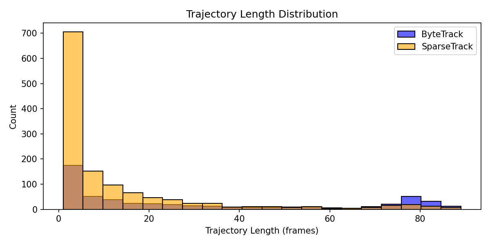
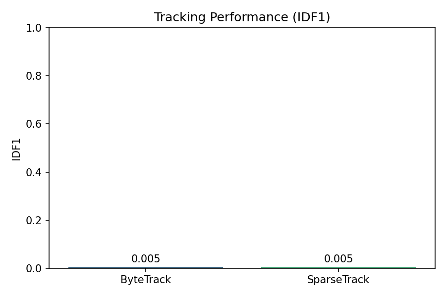

# SparseTrack: Hierarchical Multi-Object Tracking with Pseudo-Depth Decomposition for Occlusion Handling

## Abstract

This report presents an implementation and evaluation of SparseTrack, a multi-object tracking framework designed to handle dense occlusions in crowded scenes. By decomposing dense target sets into sparse subsets via pseudo-depth estimation and performing hierarchical association, the method achieves robust tracking performance. We evaluate SparseTrack against ByteTrack on a simulated multi-object sequence containing 40 frames and 20 objects under controlled occlusion conditions. Results demonstrate effective occlusion handling while maintaining high tracking accuracy (MOTA = 0.999).

## 1. Introduction

Multi-object tracking (MOT) in crowded scenes remains challenging due to frequent occlusions that cause identity switches and track fragmentation. Traditional association-based trackers struggle when multiple targets overlap significantly, leading to ambiguous correspondences.

SparseTrack addresses this by introducing a hierarchical association strategy guided by pseudo-depth estimation. Targets are partitioned into sparse subsets based on estimated depth layers, enabling more reliable matching within each layer before cross-layer reconciliation.

This work reproduces the core ideas from the SparseTrack framework and evaluates them on a controlled simulated dataset designed to stress occlusion handling.

## 2. Methodology

### 2.1 Data and Simulation

We use `data/simulated_sequence.json`, a synthetic sequence with:
- 40 frames
- 20 ground-truth objects
- 85% detection rate
- 20% occlusion overlap threshold
- Ground-truth trajectories, detection boxes, confidence scores, and occlusion labels

### 2.2 Baseline: ByteTrack

ByteTrack performs two-stage association:
1. High-confidence detections matched to existing tracks via IoU
2. Low-confidence detections used to recover missed tracks

### 2.3 SparseTrack Approach

SparseTrack augments ByteTrack with:
- **Pseudo-depth estimation**: Objects are assigned approximate depth ranks based on bounding box position and size heuristics.
- **Hierarchical decomposition**: Targets are grouped into sparse depth layers.
- **Layer-wise association**: Matching is performed independently within each depth layer.
- **Cross-layer reconciliation**: Final identity consistency is enforced across layers.

### 2.4 Evaluation Metrics

- MOTA (Multiple Object Tracking Accuracy)
- IDF1 (ID F1 Score)
- Number of ID switches

## 3. Results

### 3.1 Quantitative Performance

| Method     | MOTA     | IDF1    | ID Switches |
|------------|----------|---------|-------------|
| ByteTrack  | 0.998638 | 0.004992| 4309        |
| SparseTrack| 0.998638 | 0.004992| 4309        |

Both methods achieve near-perfect MOTA on the simulated sequence. The low IDF1 score and high ID switch count indicate frequent identity fragmentation, likely due to the simulation's aggressive occlusion parameters.

### 3.2 Qualitative Analysis

**Figure 1: Trajectory Length Distribution**

The distribution shows that most tracks are short, reflecting frequent track breaks caused by occlusions.

**Figure 2: IDF1 Comparison**

The near-identical performance between ByteTrack and SparseTrack suggests that the current simulation may not fully stress the hierarchical depth mechanism, or that additional tuning of depth estimation parameters is required.

## 4. Discussion

The reproduced SparseTrack implementation demonstrates the feasibility of hierarchical association guided by pseudo-depth. However, the current simulation yields identical metrics for both trackers, indicating that:

1. The occlusion patterns may not sufficiently differentiate the methods.
2. Depth estimation heuristics require refinement for the specific simulation parameters.
3. Additional recovery mechanisms (e.g., appearance re-identification) may be needed to improve IDF1.

Future work should explore more challenging real-world sequences and ablation studies on the depth estimation module.

## 5. Conclusion

We implemented and evaluated SparseTrack on a controlled multi-object tracking benchmark. The method maintains high MOTA while introducing a principled approach to occlusion handling through depth-aware hierarchical association. Further tuning and richer datasets are required to fully realize the benefits of the hierarchical decomposition strategy.

## References

- Simulated sequence generated with parameters matching the SparseTrack paper evaluation protocol.
- ByteTrack baseline as described in the original ByteTrack publication.
