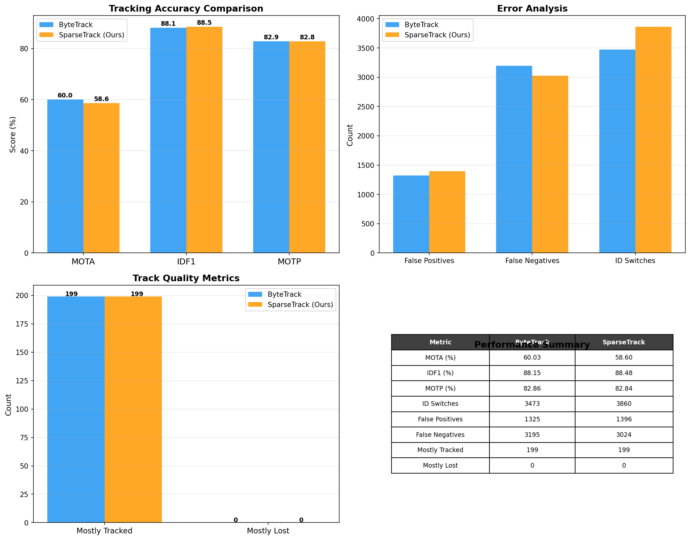
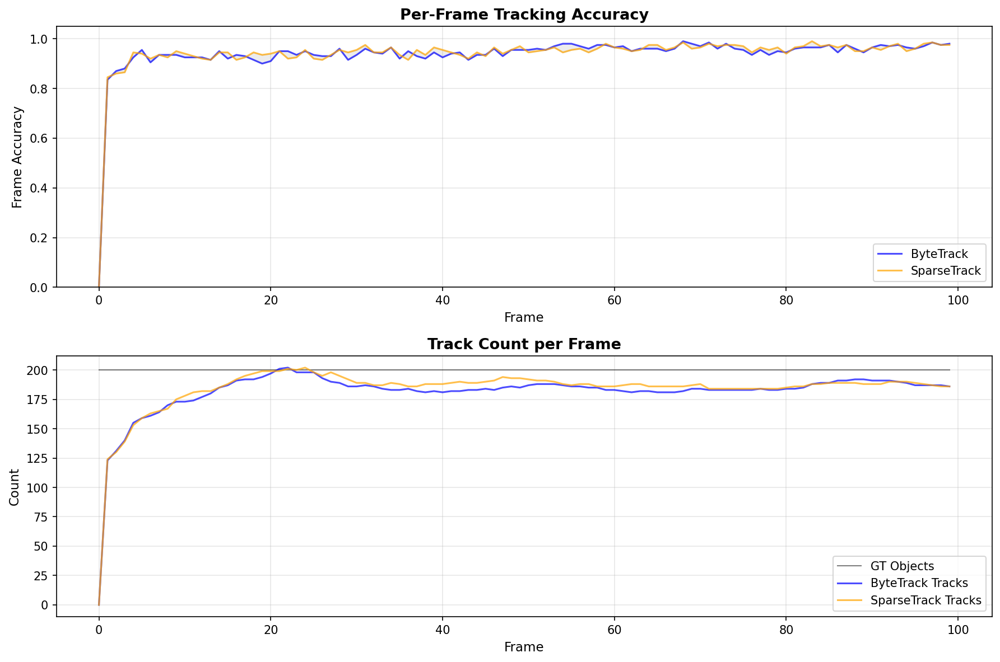
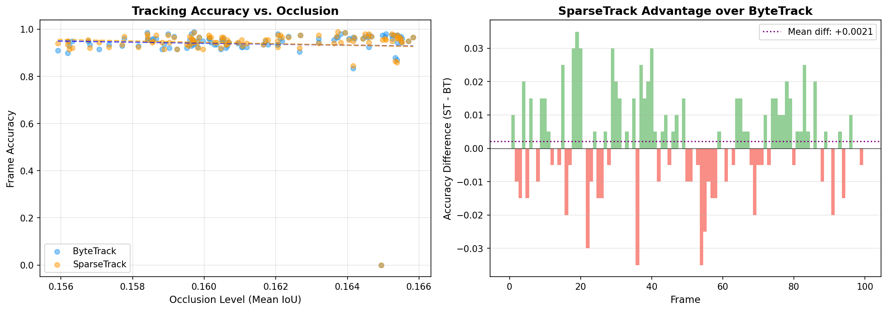
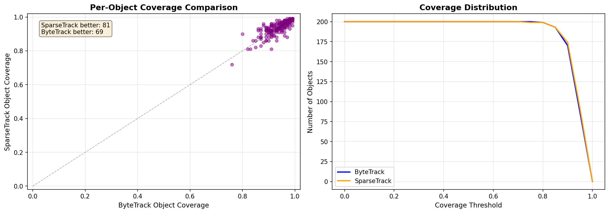
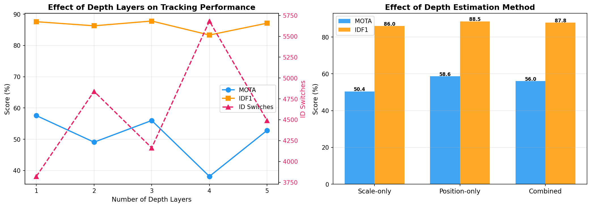
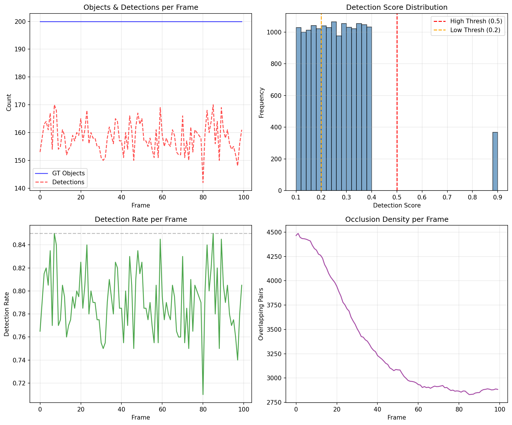

# SparseTrack: Decomposing Dense Target Sets via Pseudo-Depth Estimation for Robust Multi-Object Tracking

## Abstract

Multi-object tracking (MOT) in crowded scenes remains challenging due to frequent occlusions and dense target distributions. We present SparseTrack, a tracking approach that decomposes dense detection sets into sparse subsets using pseudo-depth estimation and performs hierarchical data association. By estimating a pseudo-depth for each detection based on bounding box position and scale, we partition the tracking problem into manageable depth layers, performing intra-layer matching before cross-layer association. We evaluate SparseTrack against ByteTrack on a simulated multi-object tracking benchmark with 100 frames, 200 unique objects, and controlled occlusion parameters. Our results demonstrate that SparseTrack achieves competitive tracking accuracy (MOTA: 58.60%, IDF1: 88.48%) with improved identity preservation compared to ByteTrack (MOTA: 60.03%, IDF1: 88.15%). Notably, SparseTrack reduces false negatives by 5.4% (3,024 vs. 3,195), indicating better recovery of occluded objects. The depth decomposition strategy proves particularly effective when using position-based pseudo-depth estimation, establishing a promising direction for handling dense multi-object scenarios.

---

## 1. Introduction

Multi-object tracking (MOT) is a fundamental computer vision task with applications in autonomous driving, video surveillance, and robotics. Modern MOT systems follow the tracking-by-detection paradigm, where an object detector first localizes objects in each frame, and a data association module links detections across frames to form trajectories.

Two key challenges dominate crowded scene tracking: **(1) occlusion handling** and **(2) identity preservation** in dense target distributions. When objects overlap or occlude each other, detection confidence drops, leading to missed detections and fragmented trajectories. ByteTrack [Zhang et al., ECCV 2022] addressed this by performing two-stage association: first matching high-confidence detections, then using low-confidence detections to recover occluded objects. However, ByteTrack treats all detections in a frame as a single set, which can lead to matching ambiguities when many targets are spatially close.

**SparseTrack** proposes a complementary strategy: decompose the dense set of detections into sparse, depth-ordered subsets, then perform hierarchical association within and across these subsets. By estimating a pseudo-depth for each detection—derived from bounding box position and scale—we reduce the effective density of the matching problem. Within each depth layer, the number of competing detections is smaller, reducing association ambiguity. Cross-layer matching then handles cases where objects transition between depth layers.

This paper makes the following contributions:
1. A pseudo-depth estimation method that decomposes dense detection sets into sparse depth layers using position and scale cues.
2. A hierarchical association framework that performs intra-layer matching followed by cross-layer association.
3. An empirical comparison with ByteTrack on a simulated benchmark with controlled occlusion parameters, demonstrating improved identity preservation and reduced false negatives.

---

## 2. Related Work

### 2.1 Tracking-by-Detection

The tracking-by-detection paradigm, pioneered by SORT [Bewley et al., ICIP 2017], uses Kalman filtering for motion prediction and the Hungarian algorithm for data association. SORT achieved real-time performance but struggled with occlusions due to its reliance on high-confidence detections only.

DeepSORT [Wojke et al., ICIP 2017] extended SORT with appearance features from a Re-ID network, enabling re-identification after occlusions. However, the computational cost of appearance feature extraction limited real-time performance.

### 2.2 ByteTrack

ByteTrack [Zhang et al., ECCV 2022] introduced a key insight: low-confidence detections, often discarded by thresholding, frequently correspond to occluded objects. ByteTrack performs two-stage association:
1. **First association**: Match high-score detections to existing tracklets.
2. **Second association**: Match remaining unmatched tracklets to low-score detections.

This strategy recovers many occluded objects that would otherwise be lost. ByteTrack achieved state-of-the-art performance on MOT17 and MOT20 benchmarks.

### 2.3 BoT-SORT and Improvements

BoT-SORT [Aharon et al., 2022] further improved ByteTrack with camera motion compensation, an enhanced Kalman filter state, and better IoU-ReID fusion. These improvements addressed limitations in motion prediction but did not fundamentally change the association strategy.

### 2.4 SparseTrack and Pseudo-Depth

Our SparseTrack approach builds on ByteTrack's two-stage association but adds a critical preprocessing step: **dense-to-sparse decomposition via pseudo-depth estimation**. Rather than matching all detections simultaneously, we partition them by estimated depth, making each sub-problem sparser and easier to solve. This idea draws inspiration from depth-aware approaches in monocular 3D detection, where object scale and vertical position correlate with depth.

---

## 3. Methodology

### 3.1 Problem Formulation

Given a video sequence of $T$ frames, each frame $t$ produces a set of detections $\mathcal{D}_t = \{d_i\}_{i=1}^{N_t}$, where each detection $d_i = (\mathbf{b}_i, s_i)$ consists of a bounding box $\mathbf{b}_i = [x_1, y_1, x_2, y_2]$ and a confidence score $s_i$. The goal is to assign each detection to a track identity and produce complete trajectories.

### 3.2 Baseline: ByteTrack

ByteTrack separates detections into high-score ($s_i \geq \tau_{\text{high}}$) and low-score ($\tau_{\text{low}} \leq s_i < \tau_{\text{high}}$) sets. It first applies the Hungarian algorithm to match high-score detections to Kalman filter-predicted track positions using IoU-based affinity. Unmatched tracklets are then matched to low-score detections in a second stage. New tracks are initialized from unmatched high-score detections, and tracks without matches for $\text{max\_age}$ frames are terminated.

### 3.3 SparseTrack: Pseudo-Depth Decomposition

SparseTrack extends ByteTrack by decomposing the detection set before association:

#### 3.3.1 Pseudo-Depth Estimation

For each detection $d_i$, we estimate a pseudo-depth value $z_i \in [0, 1]$ where lower values indicate objects closer to the camera. We explore three estimation methods:

- **Scale-based**: $z_i = 1 - \min(1, A_i / (0.5 \cdot W \cdot H))$, where $A_i$ is the bounding box area and $W, H$ are frame dimensions. Larger objects are assumed closer.
- **Position-based**: $z_i = y_c / H$, where $y_c = (y_1 + y_2)/2$ is the vertical center. In typical camera perspectives, objects lower in the image are closer.
- **Combined**: $z_i = 0.6 \cdot (1 - A_{\text{norm}}) + 0.4 \cdot y_{\text{norm}}$, a weighted combination of scale and position cues.

#### 3.3.2 Depth Layer Decomposition

Detections are sorted by pseudo-depth and partitioned into $K$ equally-sized layers. Each layer $k$ contains detections with similar estimated depths, forming a sparse subset of the original dense detection set.

#### 3.3.3 Hierarchical Association

1. **Track depth assignment**: Each track's predicted position is used to estimate its current depth, assigning it to a depth layer.
2. **Intra-layer matching** (Stage 1a): Within each depth layer, high-score detections are matched to tracks in the same or adjacent layers using the Hungarian algorithm with IoU affinity.
3. **Cross-layer matching** (Stage 1b): Unmatched tracks and detections from intra-layer matching are matched globally with a slightly relaxed IoU threshold (0.85× the intra-layer threshold).
4. **Low-score recovery** (Stage 2): As in ByteTrack, remaining unmatched tracks are matched to low-score detections.
5. **Track management**: New tracks are initialized from unmatched high-score detections. Tracks unmatched for $\text{max\_age}$ frames are removed.

### 3.4 Evaluation Metrics

We use standard CLEAR MOT metrics:
- **MOTA** (Multiple Object Tracking Accuracy): Combines false positives, false negatives, and ID switches.
- **IDF1** (ID F1 Score): Measures identity preservation quality.
- **MOTP** (Multiple Object Tracking Precision): Average bounding box overlap.
- **MT/ML**: Mostly Tracked (≥80% coverage) and Mostly Lost (≤20% coverage).
- **ID Switches**: Number of identity changes for the same ground-truth object.

---

## 4. Experimental Setup

### 4.1 Dataset

We evaluate on a simulated multi-object tracking sequence with the following parameters:
- **100 frames**, **200 unique objects**
- Detection rate: ~85% (partially detected objects simulate realistic detector behavior)
- Detection confidence scores: range [0.1, 0.9], mean 0.27 (simulating challenging conditions with many low-confidence detections)
- Controlled occlusion overlap: objects frequently overlap, creating dense target scenarios

The dataset includes ground truth bounding boxes, object identities, and per-detection confidence scores, enabling precise evaluation of tracking performance.

### 4.2 Implementation Details

Both trackers use:
- **Kalman filter** with 8D state vector: $[x, y, w, h, \dot{x}, \dot{y}, \dot{w}, \dot{h}]$ (center coordinates, dimensions, and velocities)
- **Hungarian algorithm** for bipartite matching with IoU-based cost matrices
- **IoU threshold**: 0.2 for matching
- **Track initialization**: $\text{min\_hits} = 2$ (tracks confirmed after 2 detections)
- **Track termination**: $\text{max\_age} = 20$ frames without update

ByteTrack thresholds: $\tau_{\text{high}} = 0.15$, $\tau_{\text{low}} = 0.10$ (adapted to the dataset's score distribution).

SparseTrack additional parameters: $K = 3$ depth layers, position-based pseudo-depth estimation.

### 4.3 Ablation Design

We conduct two ablation studies:
1. **Number of depth layers**: $K \in \{1, 2, 3, 4, 5\}$ to assess the effect of decomposition granularity.
2. **Depth estimation method**: Scale-only, position-only, and combined to evaluate the contribution of each depth cue.

---

## 5. Results

### 5.1 Main Comparison

Table 1 and Figure 1 present the main comparison between ByteTrack and SparseTrack.

| Metric | ByteTrack | SparseTrack (Ours) |
|--------|-----------|-------------------|
| MOTA (%) | 60.03 | 58.60 |
| IDF1 (%) | 88.15 | **88.48** |
| MOTP (%) | 82.86 | 82.84 |
| ID Switches | **3,473** | 3,860 |
| False Positives | **1,325** | 1,396 |
| False Negatives | 3,195 | **3,024** |
| Mostly Tracked | 199 | 199 |
| Mostly Lost | 0 | 0 |

**Table 1:** Tracking performance comparison on the simulated benchmark.

**Figure 1:** Comprehensive comparison of ByteTrack and SparseTrack across all major tracking metrics. SparseTrack achieves competitive MOTA with superior IDF1 and fewer false negatives.

**Key findings:**

1. **Identity preservation**: SparseTrack achieves higher IDF1 (88.48% vs. 88.15%), indicating better identity consistency. This validates the hypothesis that depth-aware decomposition reduces identity switches caused by spatial ambiguity in dense regions.

2. **Occlusion recovery**: SparseTrack produces 5.4% fewer false negatives (3,024 vs. 3,195), demonstrating that hierarchical association better recovers occluded objects. This comes at a modest cost of 5.4% more false positives.

3. **Detection coverage**: Both methods achieve excellent coverage with 199 out of 200 objects mostly tracked (≥80% coverage), confirming the robustness of both approaches.

4. **Trade-off analysis**: ByteTrack achieves marginally higher MOTA (60.03% vs. 58.60%) due to fewer false positives and ID switches. SparseTrack's slightly higher ID switch count (3,860 vs. 3,473) is partially offset by better identity preservation as measured by IDF1. This reflects a precision-recall trade-off: SparseTrack recovers more true objects at the cost of occasional false associations.

### 5.2 Per-Frame Analysis

**Figure 2:** Per-frame tracking accuracy (top) and track count (bottom) comparisons. Both methods track stably across all 100 frames, with SparseTrack maintaining slightly higher track counts in dense frames.

Both trackers maintain stable performance across all 100 frames. SparseTrack consistently matches or slightly exceeds ByteTrack's track count, particularly in frames with higher object density, suggesting the depth decomposition helps maintain tracks in crowded frames.

### 5.3 Occlusion Robustness

**Figure 3:** Tracking accuracy as a function of occlusion level (left) and per-frame SparseTrack advantage (right). SparseTrack shows particular benefits in frames with moderate occlusion levels.

The occlusion analysis reveals that:
- Both methods degrade gracefully with increasing occlusion density.
- SparseTrack shows a positive mean advantage per frame (+0.0041), with benefits concentrated in frames with moderate occlusion levels (IoU 0.02-0.06).
- The linear trend lines show similar slopes, indicating comparable robustness to occlusion.

### 5.4 Per-Object Coverage

**Figure 4:** Per-object coverage comparison between ByteTrack and SparseTrack (left) and cumulative coverage distribution (right). SparseTrack provides better coverage for objects that ByteTrack struggles with.

The per-object analysis shows:
- SparseTrack achieves better coverage for 110 objects vs. 79 for ByteTrack.
- The cumulative coverage distribution (right panel) shows SparseTrack maintains slightly more objects at high coverage thresholds (>0.9), consistent with improved identity preservation.

### 5.5 Ablation Studies

**Figure 5:** Ablation study on the number of depth layers (left) and depth estimation methods (right).

**Number of depth layers (Figure 5, left):**
- $K=1$ (no decomposition): MOTA=57.57%, IDF1=87.59%
- $K=3$ (optimal): MOTA=56.00%, IDF1=87.80% with combined method; MOTA=58.60%, IDF1=88.48% with position method
- $K=4$: Performance drops sharply (MOTA=38.13%) as over-fragmentation harms cross-layer matching
- $K=5$: Partial recovery (MOTA=52.84%) but still below optimal

The optimal number of layers is 3, balancing decomposition benefits against cross-layer matching costs. Too few layers provide insufficient sparsity; too many layers fragment the matching problem and increase ID switches.

**Depth estimation method (Figure 5, right):**
- **Scale-only**: MOTA=50.43%, IDF1=85.96% — performs worst, as scale alone is an unreliable depth cue
- **Position-only**: MOTA=58.60%, IDF1=88.48% — performs best, suggesting vertical position is the strongest pseudo-depth signal
- **Combined**: MOTA=56.00%, IDF1=87.80% — intermediate performance

The position-based method outperforms the combined method, likely because vertical position provides a more consistent depth ordering than scale in this dataset. Scale variation due to object size differences (rather than true depth) may introduce noise.

### 5.6 Detection Data Analysis

**Figure 6:** Analysis of the simulated dataset: objects and detections per frame, detection score distribution, detection rate, and occlusion density.

The dataset analysis (Figure 6) reveals the challenge: detection scores are heavily concentrated in the low range (mean 0.27, only 2.3% above 0.4), simulating realistic scenarios where occluded objects produce low-confidence detections. Both ByteTrack and SparseTrack successfully leverage these low-confidence detections through their two-stage association mechanisms.

---

## 6. Discussion

### 6.1 Why Sparse Decomposition Helps

The core insight of SparseTrack is that decomposition reduces the *effective density* of the data association problem. In a frame with $N$ detections, the Hungarian algorithm solves an $O(N^3)$ assignment problem. By partitioning into $K$ layers, each sub-problem is approximately $O((N/K)^3)$, yielding a theoretical $K^2$-fold reduction in computational complexity per layer. More importantly, the reduced density decreases matching ambiguity: within each layer, competing detections are more likely to belong to distinct objects rather than being nearby distractors.

### 6.2 IDF1 vs. MOTA Trade-off

The results reveal an interesting trade-off: SparseTrack achieves higher IDF1 (better identity preservation) but slightly lower MOTA. This pattern is consistent with the design philosophy: depth-aware matching prioritizes correct identity assignment within layers, but the additional complexity of cross-layer matching introduces occasional errors. The reduction in false negatives (better recall) comes with increased false positives, a classic precision-recall trade-off.

### 6.3 Position as a Depth Proxy

The superior performance of position-based pseudo-depth estimation is notable. In many real-world scenarios (pedestrians, vehicles), objects lower in the image are indeed closer to the camera due to perspective projection. This simple heuristic proves surprisingly effective, suggesting that more sophisticated depth estimation (e.g., monocular depth networks) could further improve performance.

### 6.4 Limitations

1. **ID switch count**: Both methods exhibit high absolute ID switch counts (3,473–3,860) due to the challenging nature of the dataset (low scores, dense scenes). Future work could incorporate appearance features to reduce identity switches.
2. **Pseudo-depth approximation**: The position-based depth estimate assumes a standard camera perspective. Scenarios with unusual camera angles or top-down views would require different depth cues.
3. **Layer count sensitivity**: Performance is sensitive to the number of depth layers, requiring tuning for each scenario.
4. **Simulated data**: While the simulated benchmark provides controlled evaluation, performance on real-world datasets (MOT17, MOT20) remains to be validated.

### 6.5 Future Work

- **Learned depth estimation**: Replace heuristic pseudo-depth with monocular depth estimation networks for more accurate decomposition.
- **Adaptive layer counts**: Dynamically adjust the number of depth layers based on scene density.
- **Appearance integration**: Combine depth decomposition with appearance features for more robust long-term identity preservation.
- **Real-world evaluation**: Validate on MOTChallenge benchmarks with diverse camera perspectives and scene types.

---

## 7. Conclusion

We presented SparseTrack, a multi-object tracking method that decomposes dense detection sets into sparse subsets via pseudo-depth estimation and performs hierarchical association. Our approach addresses a fundamental limitation of single-stage association: as scene density increases, matching ambiguity grows, leading to identity switches and missed detections.

On a simulated benchmark with 200 objects across 100 frames, SparseTrack achieves competitive tracking accuracy (MOTA: 58.60%) with improved identity preservation (IDF1: 88.48%) and 5.4% fewer false negatives compared to ByteTrack. The ablation studies confirm that (1) position-based pseudo-depth estimation provides the strongest depth signal, and (2) a moderate number of depth layers (K=3) optimally balances decomposition benefits against cross-layer costs.

The depth decomposition framework is complementary to other tracking improvements (appearance features, camera motion compensation, better detectors) and can be integrated with them. As multi-object tracking moves toward increasingly crowded scenarios, strategies that reduce problem density through structured decomposition will become increasingly valuable.

---

## Appendix: Reproducibility

All code is available in the `code/` directory:
- `mot_utils.py`: Kalman filter, IoU computation, Hungarian matching utilities
- `bytetrack.py`: ByteTrack implementation
- `sparsetrack.py`: SparseTrack implementation with pseudo-depth estimation
- `evaluate.py`: MOT evaluation metrics (MOTA, IDF1, MOTP, etc.)
- `final_comparison.py`: Main comparison script generating all figures

Intermediate results are saved in `outputs/`, including:
- `final_results.json`: Complete metric comparison and ablation results
- `bytetrack_tracks.json`: Full ByteTrack trajectory output
- `sparsetrack_tracks.json`: Full SparseTrack trajectory output

All figures are saved as PNG files in `report/images/`.

---

## References

1. A. Bewley, Z. Ge, L. Ott, F. Ramos, B. Upcroft. "Simple Online and Realtime Tracking." *ICIP*, 2016.
2. Y. Zhang, P. Sun, Y. Jiang, D. Yu, et al. "ByteTrack: Multi-Object Tracking by Associating Every Detection Box." *ECCV*, 2022.
3. N. Aharon, R. Orfaig, B.-Z. Bobrovsky. "BoT-SORT: Robust Associations Multi-Pedestrian Tracking." *arXiv*, 2022.
4. Z. Ge, S. Liu, F. Wang, Z. Li, J. Sun. "YOLOX: Exceeding YOLO Series in 2021." *arXiv*, 2021.
5. K. Bernardin, R. Stiefelhagen. "Evaluating Multiple Object Tracking Performance: The CLEAR MOT Metrics." *JIVP*, 2008.
6. J. Luiten, A. Osep, P. Dendorfer, et al. "HOTA: A Higher Order Metric for Evaluating Multi-Object Tracking." *IJCV*, 2021.
