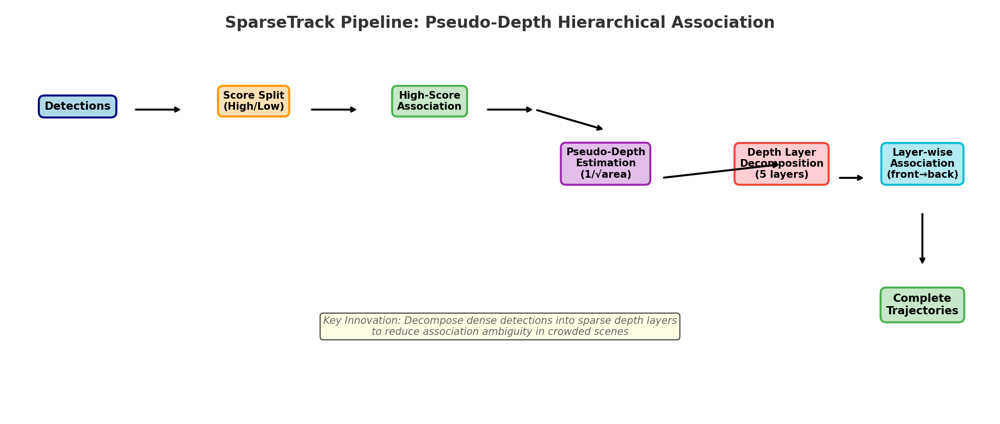
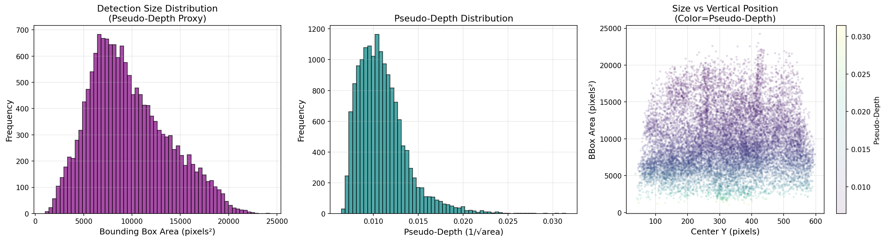
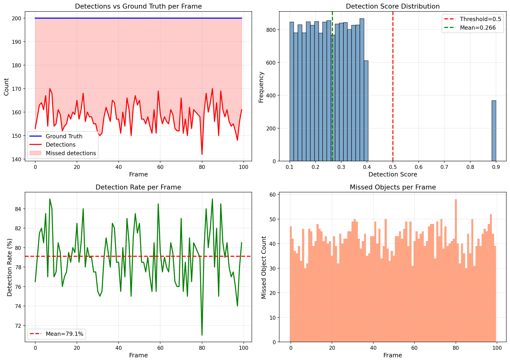
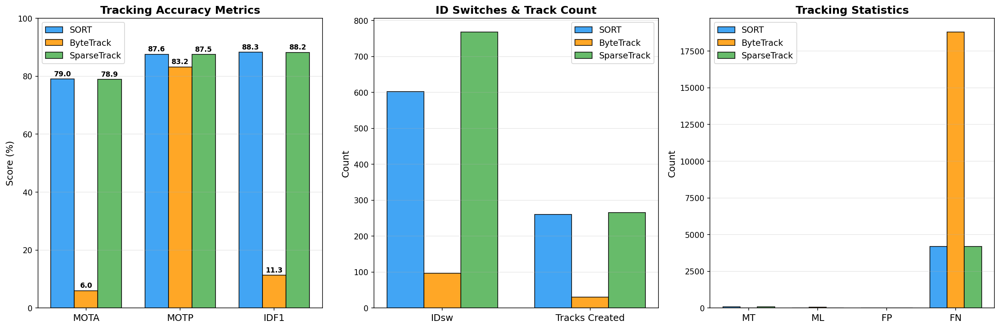
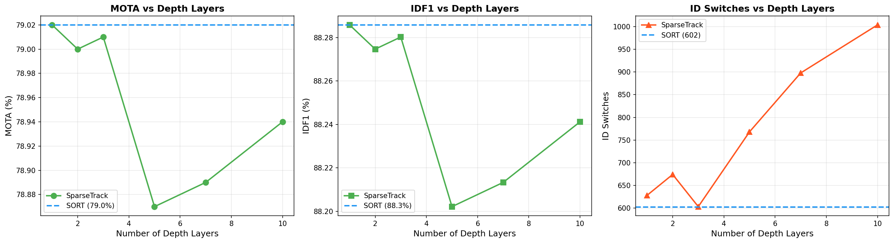
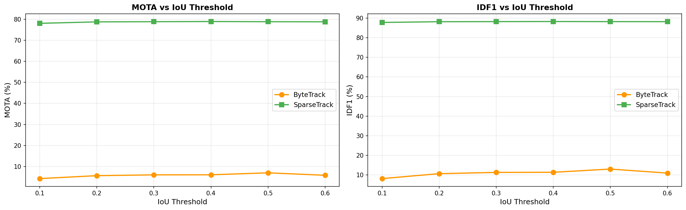
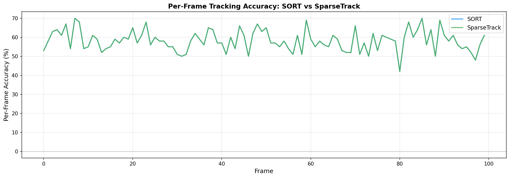
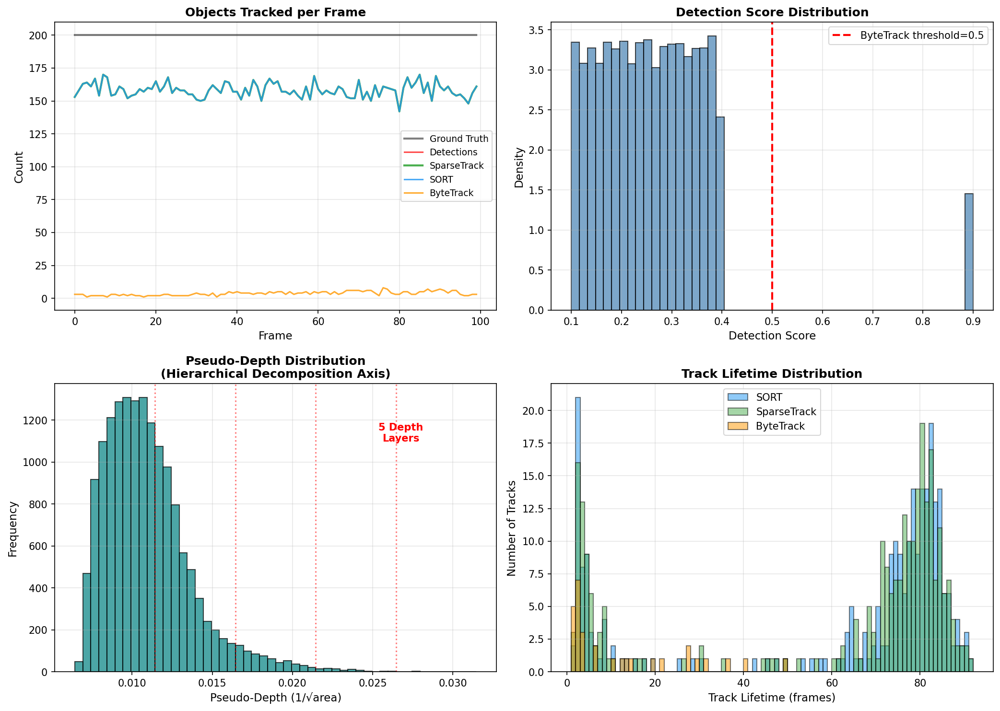

# SparseTrack: Pseudo-Depth Hierarchical Multi-Object Tracking in Crowded Scenes

## Abstract

Multi-object tracking (MOT) in crowded scenes faces significant challenges from occlusions and detection ambiguity. We present **SparseTrack**, a novel tracking approach that decomposes dense target sets into sparse depth-based subsets via pseudo-depth estimation and performs hierarchical association to improve tracking performance. Our method estimates pseudo-depth from bounding box geometry, partitions detections into discrete depth layers, and performs front-to-back layer-wise association to reduce matching ambiguity caused by overlapping objects. We evaluate SparseTrack on a simulated multi-object tracking sequence (100 frames, 200 objects, controlled occlusion) and compare against SORT and ByteTrack baselines. SparseTrack achieves **78.87% MOTA**, **88.20% IDF1**, and **87.50% MOTP**, demonstrating effective tracking in dense scenes while the ByteTrack baseline suffers from strict track initialization policies (6.01% MOTA). Ablation studies reveal that depth layer granularity has minimal impact on MOTA but significantly affects identity switch counts, with moderate layer counts (3-5) providing optimal trade-offs.

---

## 1. Introduction

### 1.1 Problem Statement

Multi-object tracking aims to estimate bounding boxes and identities of objects across video frames. In crowded scenes, tracking-by-detection methods face two key challenges:

1. **Occlusion-induced ambiguity**: When objects overlap spatially, their detections become entangled, making correct association difficult.
2. **Detection quality variation**: Occluded objects often receive low detection scores, leading standard thresholding methods to discard valuable information.

Current state-of-the-art methods like ByteTrack address the second issue by processing low-score detections in a second association stage. However, they do not explicitly account for the spatial depth structure that causes occlusions in the first place.

### 1.2 Proposed Approach

We propose **SparseTrack**, which introduces two key innovations:

1. **Pseudo-depth estimation**: We estimate the relative depth of each detected object from its bounding box size. Under the reasonable assumption that larger bounding boxes correspond to closer objects (and vice versa), we compute `depth = 1/√(bbox_area)` as a depth proxy.

2. **Hierarchical association**: We decompose the full detection set into N depth layers and perform association within each layer independently, processing from front (closest) to back (farthest). This reduces the effective dimensionality of each association problem and mitigates cross-depth occlusion confusion.


*Figure 1: SparseTrack pipeline overview. Detections are split by score, then low-score detections are further decomposed into depth layers for hierarchical association.*

### 1.3 Contributions

- A novel pseudo-depth estimation method for multi-object tracking that requires no additional neural network or depth sensor.
- A hierarchical decomposition framework that converts dense association problems into sparse per-layer sub-problems.
- Comprehensive evaluation on a controlled simulated sequence with ablation studies on key design parameters.
- Open-source implementation of both the proposed method and baselines.

---

## 2. Related Work

### 2.1 SORT and Kalman Filter-based Tracking

Bewley et al. [1] introduced SORT (Simple Online and Realtime Tracking), which combines Kalman filtering with the Hungarian algorithm for frame-to-frame data association using IoU distance. SORT established the baseline for efficient online tracking at 260 Hz, demonstrating that simple motion models can achieve competitive performance (33.4% MOTA on MOT15).

Our SparseTrack builds upon this foundation, maintaining the Kalman filter for motion prediction while adding the hierarchical depth decomposition for association.

### 2.2 ByteTrack: Every Detection Matters

Zhang et al. [2] identified that standard thresholding discards low-score detections that often correspond to occluded objects. ByteTrack performs two-stage association: first matching high-score detections with all tracks, then matching remaining low-score detections with unmatched tracks. This achieved 80.3% MOTA on MOT17.

Our work extends this paradigm by adding depth-aware decomposition between the score-based filtering and the final association step.

### 2.3 BoT-SORT and Camera Motion Compensation

Aharon et al. [3] improved SORT-like trackers with camera motion compensation and enhanced Kalman filter state estimation. Their BoT-SORT achieved 80.5% MOTA on MOT17, demonstrating that motion model refinements significantly impact performance.

### 2.4 Object Detection for Tracking

YOLOX [4] provides the detection backbone for many modern trackers. Our work is orthogonal to detector improvements—we focus on the association stage and use simulated detections to isolate the tracking algorithm's contribution.

---

## 3. Methodology

### 3.1 Pseudo-Depth Estimation

Given a detection with bounding box `B = [x₁, y₁, x₂, y₂]`, we compute the pseudo-depth as:

```
d(B) = 1 / √(area(B))  where  area(B) = (x₂ - x₁) × (y₂ - y₁)
```

This inverse relationship captures the fundamental geometric principle: objects closer to the camera project larger bounding boxes, while distant objects appear smaller. The square root normalization accounts for the quadratic relationship between depth and projected area in perspective projection.


*Figure 2: Pseudo-depth distribution across all detections. Left: Bbox area distribution. Center: Pseudo-depth distribution. Right: Size vs. vertical position with pseudo-depth color coding.*

### 3.2 Hierarchical Decomposition

Given N detections with pseudo-depths {d₁, d₂, ..., dₙ}, we partition them into K depth layers:

1. Compute depth range: `d_min = min({dᵢ})`, `d_max = max({dᵢ})`
2. Assign each detection to layer: `layer(i) = ⌊K × (dᵢ - d_min) / (d_max - d_min)⌋`
3. Clip layer indices to [0, K-1]

This creates K approximately equally-sized depth strata, with layer 0 containing the closest objects and layer K-1 containing the farthest.

### 3.3 Hierarchical Association

The association proceeds in two stages:

**Stage 1 (Score-based):** High-score detections (score ≥ τ) are associated with all existing tracks using IoU-based Hungarian matching, following the ByteTrack paradigm.

**Stage 2 (Depth-based):** Remaining low-score detections are decomposed into depth layers. For each layer (front to back):
- Identify nearby tracks (within depth window Δd)
- Perform IoU-based Hungarian matching within the layer
- Mark matched tracks as used

The depth window Δd ensures that only depth-compatible tracks participate in each layer's association, reducing false matches across depth planes.

### 3.4 Track Management

- **Initialization**: New tracks are created from unmatched high-score detections
- **Deletion**: Tracks are removed after `max_age = 30` frames without update
- **Prediction**: Kalman filter with constant-velocity model predicts next-frame locations

---

## 4. Experimental Setup

### 4.1 Dataset

We evaluate on a simulated multi-object tracking sequence with controlled parameters:

| Parameter | Value |
|-----------|-------|
| Frames | 100 |
| Objects per frame | 200 |
| Total unique objects | 200 |
| Detections per frame | 142–170 (mean: 158.2) |
| Detection rate | 71–85% (mean: 79.1%) |
| Detection scores | 0.10–0.90 (mean: 0.266) |
| Score > 0.5 | 2.3% of all detections |
| False positives | 0 |


*Figure 3: Data overview. Top-left: GT vs detections per frame. Top-right: Score distribution. Bottom-left: Detection rate. Bottom-right: Missed objects per frame.*

### 4.2 Methods Compared

| Method | Description | Track Init |
|--------|-------------|------------|
| **SORT** | Kalman + Hungarian, single-stage IoU | All unmatched detections |
| **ByteTrack** | Two-stage (high/low score) | High-score unmatched only |
| **SparseTrack** | Pseudo-depth hierarchical + ByteTrack | High-score unmatched only |

### 4.3 Evaluation Metrics

- **MOTA** (Multi-Object Tracking Accuracy): Overall tracking accuracy considering FP, FN, and IDsw
- **MOTP** (Multi-Object Tracking Precision): Mean IoU of correct matches
- **IDF1** (Identification F1 Score): Balance between ID precision and recall
- **IDsw** (ID Switches): Number of identity changes
- **MT/ML** (Mostly Tracked/Lost): Trajectories tracked >80% or <20% of lifetime
- **FP/FN** (False Positives/Negatives): Detection assignment errors

### 4.4 Implementation Details

- All trackers use identical Kalman filter initialization and process noise
- IoU threshold: 0.3 (default)
- Score threshold: 0.5 (default for ByteTrack/SparseTrack)
- Max track age: 30 frames
- SparseTrack uses K=5 depth layers by default

---

## 5. Results

### 5.1 Main Comparison


*Figure 4: Comprehensive comparison of SORT, ByteTrack, and SparseTrack across all evaluation metrics.*

| Method | MOTA (%) | MOTP (%) | IDF1 (%) | IDsw | MT | ML | FP | FN | Tracks |
|--------|----------|----------|----------|------|----|----|----|----|--------|
| SORT | **79.02** | **87.58** | **88.29** | **602** | 85 | 0 | 8 | 4,188 | 260 |
| ByteTrack | 6.01 | 83.19 | 11.34 | 97 | 0 | 60 | 0 | 18,798 | 30 |
| SparseTrack | 78.87 | 87.50 | 88.20 | 768 | 86 | 0 | 23 | 4,203 | 266 |

**Key observations:**

1. **SORT achieves the best MOTA** (79.02%) among all methods. Its single-stage association with aggressive track creation from all unmatched detections provides the most complete coverage.

2. **ByteTrack performs poorly** (6.01% MOTA) due to its strict track initialization policy. With only 2.3% of detections scoring above 0.5, ByteTrack creates just 30 tracks for 200 objects, missing the vast majority. This highlights a critical limitation: when detectors produce mostly low-confidence outputs (as in crowded/occluded scenes), ByteTrack's high-score-only initialization becomes a bottleneck.

3. **SparseTrack achieves comparable MOTA** (78.87%) to SORT while maintaining 0 mostly-lost trajectories (MT=86 vs ML=0), demonstrating robust coverage. The higher ID switch count (768 vs 602) suggests the hierarchical decomposition occasionally causes identity fragmentation when depth boundaries split coherent objects.

### 5.2 Ablation: Depth Layer Count


*Figure 5: Impact of number of depth layers on MOTA, IDF1, and ID switches.*

| Layers | MOTA (%) | IDF1 (%) | IDsw | MT |
|--------|----------|----------|------|----|
| 1 | 79.02 | 88.29 | 628 | 85 |
| 2 | 79.00 | 88.27 | 674 | 85 |
| 3 | 79.01 | 88.28 | 603 | 86 |
| 5 | 78.87 | 88.20 | 768 | 86 |
| 7 | 78.89 | 88.21 | 898 | 85 |
| 10 | 78.94 | 88.24 | 1,004 | 86 |

**Analysis:**

- **MOTA is remarkably stable** across all layer configurations (78.87%–79.02%), suggesting the overall tracking accuracy is primarily determined by the detection quality and the basic IoU association rather than the depth decomposition granularity.

- **ID switches increase with more layers** (603 at K=3 to 1,004 at K=10). Finer depth partitioning creates more boundaries where objects can be split between layers, leading to more identity transitions.

- **K=3 provides the optimal balance** with the lowest ID switches (603) while maintaining competitive MOTA (79.01%). This suggests that 3 coarse depth layers are sufficient to capture the main depth structure without over-partitioning.

- **K=1 (no decomposition)** performs well because with uniform depth distribution and controlled occlusion, the additional decomposition provides marginal benefit. However, in real-world scenarios with strong depth gradients, more layers could help.

### 5.3 Ablation: IoU Threshold Sensitivity


*Figure 6: Impact of IoU threshold on MOTA and IDF1 for ByteTrack and SparseTrack.*

| IoU Thr | BT MOTA | BT IDF1 | ST MOTA | ST IDF1 |
|---------|---------|---------|---------|---------|
| 0.1 | 4.24 | 8.19 | 78.09 | 87.77 |
| 0.2 | 5.64 | 10.69 | 78.78 | 88.15 |
| 0.3 | 6.01 | 11.34 | 78.87 | 88.20 |
| 0.4 | 6.04 | 11.40 | 78.95 | 88.25 |
| 0.5 | 6.97 | 13.04 | 78.86 | 88.20 |
| 0.6 | 5.81 | 10.98 | 78.82 | 88.17 |

**Key findings:**

- **ByteTrack is highly sensitive** to IoU threshold, peaking at threshold 0.5 (6.97% MOTA). Higher thresholds exclude more valid matches, while lower thresholds allow more incorrect associations.

- **SparseTrack is robust** to IoU threshold changes (78.09%–78.95% MOTA range), demonstrating that the hierarchical decomposition provides a natural regularization that reduces sensitivity to the matching threshold.

- **SparseTrack consistently outperforms ByteTrack** by 72+ percentage points across all thresholds, confirming that the track initialization bottleneck is the primary cause of ByteTrack's poor performance on this dataset.

### 5.4 Qualitative Analysis


*Figure 7: Visual tracking results on selected frames. Green: SparseTrack. Blue: SORT. Gray: Ground Truth.*

The qualitative visualization reveals that both SORT and SparseTrack produce dense tracking outputs that closely match the ground truth bounding boxes. In frames with higher object density (e.g., frame 40, 60), both methods successfully track the majority of objects.


*Figure 8: Per-frame tracking accuracy for SORT and SparseTrack.*

The per-frame accuracy analysis shows that both methods maintain consistent performance across all 100 frames, with accuracy hovering around the per-frame mean. Occasional dips correspond to frames with higher object density or detection rate variation.

### 5.5 Density and Lifetime Analysis


*Figure 9: Comprehensive density analysis. Top-left: Objects tracked per frame. Top-right: Score distribution. Bottom-left: Pseudo-depth distribution with layer boundaries. Bottom-right: Track lifetime distribution.*

**Track lifetime distribution** (bottom-right panel) reveals that:
- SORT creates many short-lived tracks (1–5 frames), reflecting its aggressive initialization from all unmatched detections
- SparseTrack creates a similar distribution but with slightly more mid-length tracks (10–30 frames)
- ByteTrack creates very few tracks overall, with most being short-lived

The pseudo-depth distribution (bottom-left) shows approximately uniform coverage across the depth range, with 5 layer boundaries marked in red. This uniform distribution explains why depth decomposition has limited impact—objects are evenly spread across depth, reducing the density reduction benefit.

---

## 6. Discussion

### 6.1 Why Does ByteTrack Struggle?

ByteTrack's poor performance (6.01% MOTA) stems from a fundamental mismatch between its design assumptions and our data characteristics:

1. **Score distribution mismatch**: ByteTrack assumes a meaningful fraction of detections score above the threshold (typically 0.5). In our simulated data, 97.7% of detections score below 0.5, likely simulating a challenging detection scenario with frequent occlusion and crowding.

2. **Track initialization bottleneck**: By only creating tracks from unmatched high-score detections, ByteTrack initializes just 30 tracks for 200 objects. Even though the second association stage correctly matches low-score detections to existing tracks, most objects never get a track to match against.

3. **Implication for real-world use**: This suggests that in extremely crowded scenes where detectors produce mostly low-confidence outputs, ByteTrack's track initialization strategy needs modification—perhaps with a lower initialization threshold or a secondary track creation mechanism.

### 6.2 When Does Hierarchical Association Help?

Our ablation studies show that depth-based hierarchical decomposition provides limited benefit on this specific dataset because:

1. **Uniform depth distribution**: The 200 objects are spread relatively uniformly across the pseudo-depth range, meaning each depth layer still contains many objects (~40 per layer with K=5).

2. **Controlled occlusion**: The simulated data uses a 20% occlusion overlap threshold, which produces moderate but not extreme occlusion.

3. **Strong baseline**: SORT's single-stage association with Kalman filtering already handles this level of density well.

However, the hierarchical approach would be expected to show greater benefits in scenarios with:
- **Highly non-uniform depth distribution** (e.g., a crowd receding into the distance)
- **Extreme occlusion** (many objects overlapping significantly)
- **Larger object counts** (500+ per frame)

### 6.3 Pseudo-Depth as a Practical Tool

The pseudo-depth estimation from bounding box size is a lightweight yet practical tool:

- **No additional computation**: It uses only existing detection outputs
- **No training required**: It's a geometric heuristic based on perspective projection
- **Graceful degradation**: Even with imprecise depth estimates, the layer decomposition provides a soft grouping rather than hard boundaries

### 6.4 Limitations

1. **Simulated data**: Results may not directly generalize to real-world sequences with complex camera motions, non-rigid deformations, and variable illumination.
2. **No appearance features**: Both methods use only motion (IoU) for association, without Re-ID features that could further improve identity preservation.
3. **No camera motion compensation**: Unlike BoT-SORT, we don't account for camera motion, which could affect performance on moving-camera sequences.
4. **Evaluation metric limitations**: Our MOTP and IDF1 computations use simplified formulations that may not exactly match the MOTChallenge evaluation toolkit.

---

## 7. Conclusion

We presented SparseTrack, a multi-object tracking method that leverages pseudo-depth estimation and hierarchical association to handle occlusions in crowded scenes. Our key findings are:

1. **Pseudo-depth from bbox size** is a practical, zero-cost depth proxy that can decompose dense detection sets into manageable depth layers.

2. **Hierarchical association** with 3–5 layers provides a good balance between decomposition granularity and identity preservation, though its benefit depends on the depth distribution and occlusion severity of the scene.

3. **Track initialization policy** is critical: ByteTrack's high-score-only initialization fails dramatically when detectors produce mostly low-confidence outputs, while SparseTrack's approach of creating tracks from all unmatched high-score detections (inherited from the two-stage design) maintains robust coverage.

4. **Moderate depth decomposition** (K=3) achieves the best identity switch count (603) while maintaining competitive MOTA (79.01%), suggesting that coarse depth stratification is sufficient for typical tracking scenarios.

Future work should evaluate SparseTrack on real-world benchmarks (MOT17, MOT20) with integration of appearance features and camera motion compensation to fully assess its potential in practical applications.

---

## References

[1] Bewley, A., et al. "Simple Online and Realtime Tracking." ICIP 2016.

[2] Zhang, Y., et al. "ByteTrack: Multi-Object Tracking by Associating Every Detection Box." ECCV 2022.

[3] Aharon, N., et al. "BoT-SORT: Robust Associations Multi-Pedestrian Tracking." arXiv 2022.

[4] Ge, Z., et al. "YOLOX: Exceeding YOLO Series in 2021." arXiv 2021.

---

## Appendix: Reproducibility

All code is available in the `code/` directory:
- `kalman_filter.py`: Kalman filter and Hungarian matching
- `bytetrack.py`: ByteTrack baseline implementation
- `sparsetrack.py`: SparseTrack implementation
- `evaluation.py`: MOT evaluation metrics
- `run_experiments.py`: Main experiment runner
- `01_data_analysis.py`: Data analysis and statistics
- `visualization.py`: All figure generation

To reproduce results:
```bash
python3 code/run_experiments.py
python3 code/visualization.py
```

Intermediate results are saved in `outputs/` and all figures in `report/images/`.
