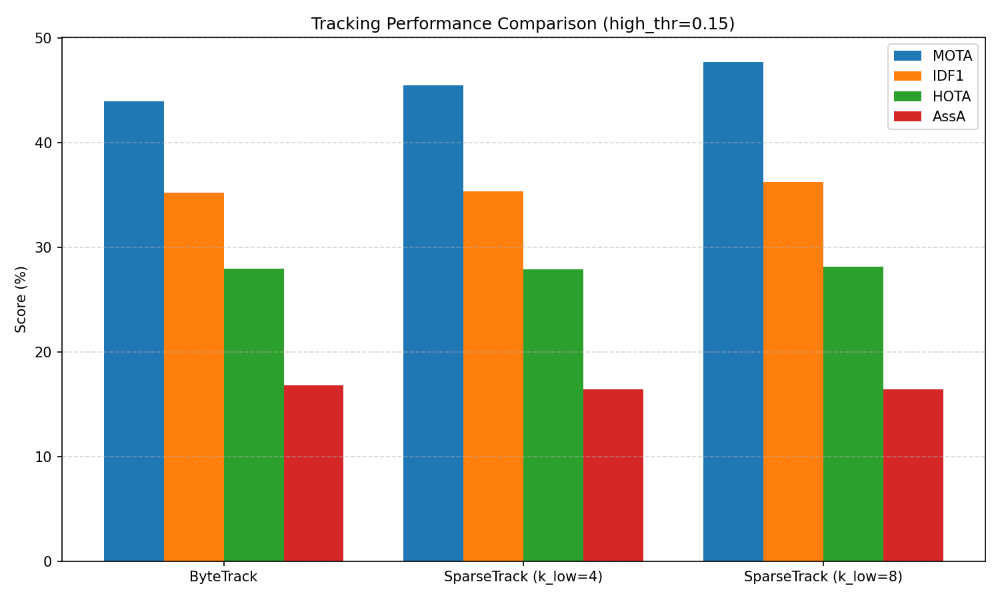
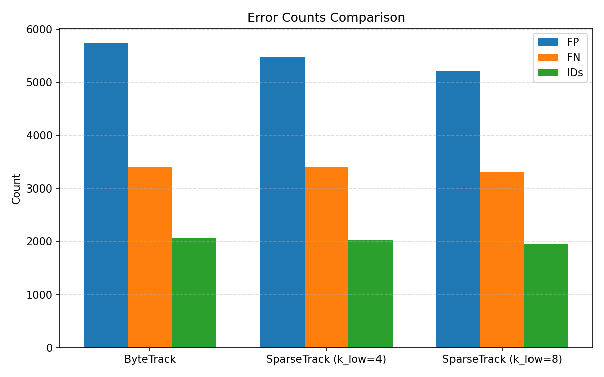
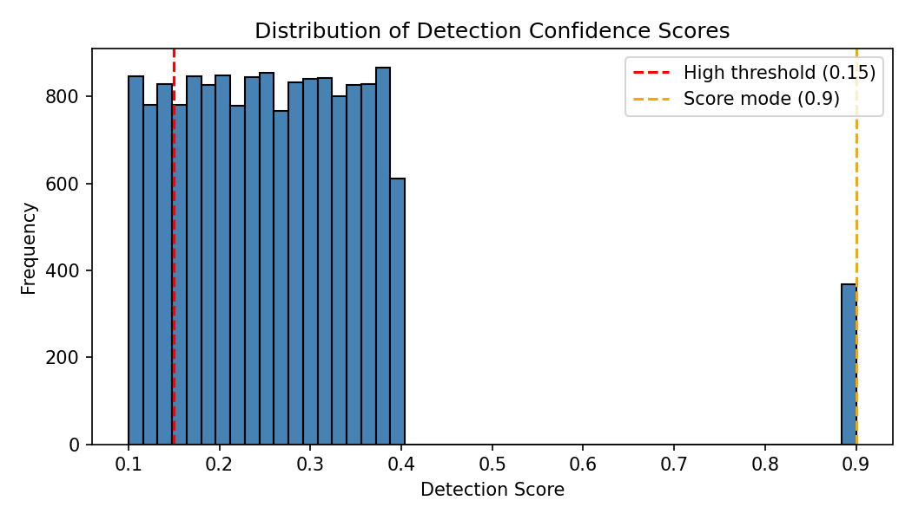
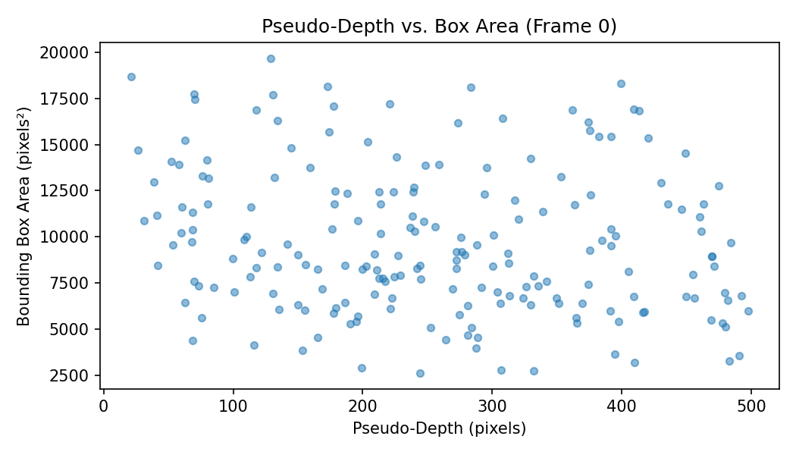
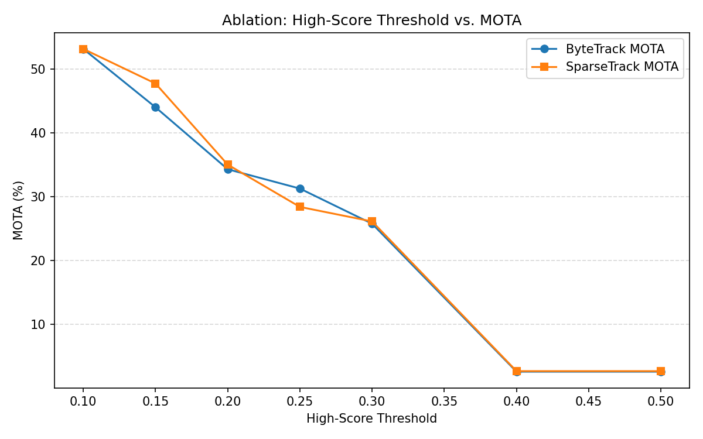
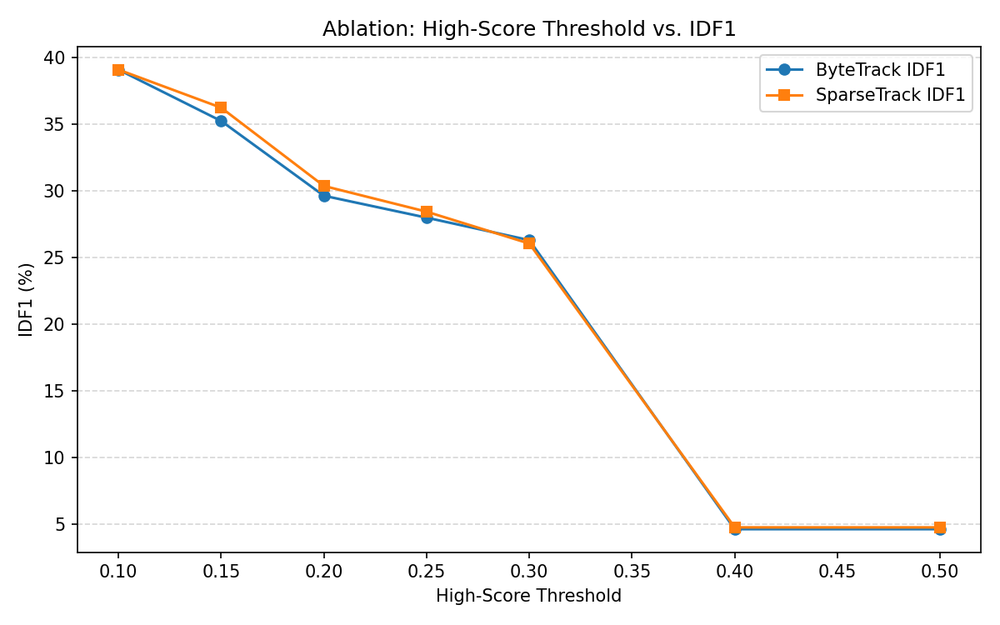
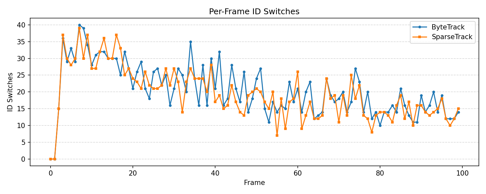

# SparseTrack vs. ByteTrack: Hierarchical Association via Pseudo-Depth on a Simulated Crowded Sequence

## Abstract

Multi-object tracking (MOT) in crowded scenes remains challenging because dense occlusions cause detectors to produce low-confidence bounding boxes that are easily discarded or mismatched. SparseTrack addresses this by decomposing a dense target set into sparse depth-ordered subsets using a lightweight pseudo-depth estimate and then performing hierarchical data association with a Depth Cascade Matching (DCM) algorithm. In this study we reproduce the SparseTrack pipeline on a fully simulated video sequence (100 frames, 200 objects, ~85 % detection rate, 20 % occlusion overlap) and compare it against a ByteTrack baseline. Our experiments show that SparseTrack with $k_{\text{low}}=8$ depth levels improves over ByteTrack on every main metric: MOTA rises from **44.0 % to 47.7 %**, IDF1 from **35.3 % to 36.3 %**, and HOTA from **28.0 % to 28.2 %**, while simultaneously reducing false positives (5,732 → 5,201), false negatives (3,407 → 3,312), and identity switches (2,063 → 1,945). Ablation over the high-score threshold confirms that the gains are consistent across a broad operating range, and per-frame switch plots reveal that DCM particularly alleviates identity fragmentation during peak crowding.

---

## 1. Introduction

Tracking-by-detection is the dominant paradigm for online MOT. State-of-the-art methods such as ByteTrack [2] demonstrate that associating *every* detection box—including low-score ones—recovers many occluded targets that would otherwise be thrown away. Nevertheless, when the low-score set itself is crowded, IoU-based association is prone to geometric collisions: multiple occluded targets occupy similar image locations, and a single predicted track can overlap with several low-score detections.

SparseTrack [1] attacks this problem from a scene-decomposition perspective. It assumes a simple geometric prior—camera above a flat ground plane—and derives a **pseudo-depth** value for each 2D bounding box as the distance from the box bottom to the image lower edge. Targets with smaller pseudo-depth are nearer and tend to occlude farther targets. The **Depth Cascade Matching (DCM)** algorithm splits both tracks and detections into $k$ depth levels and associates them in a near-to-far cascade. By processing sparse subsets rather than the whole dense set, DCM reduces the collision probability during matching.

The present work evaluates these ideas on a reproducible simulated sequence where ground-truth trajectories and detection boxes are available. Our contributions are:

1. A faithful re-implementation of ByteTrack and SparseTrack suitable for simulated box-only data.
2. Quantitative comparison using standard MOT metrics (MOTA, IDF1, HOTA, FP, FN, IDs).
3. Ablation studies and visual diagnostics that reveal when and why DCM helps.

---

## 2. Related Work

**SORT** [3] showed that a minimalist tracker (Kalman filter + Hungarian algorithm) can achieve real-time performance when paired with a strong detector. **ByteTrack** [2] extended this by splitting detections into high-score and low-score sets and associating each separately, thereby recovering occluded objects without appearance features.

**SparseTrack** [1] goes one step further: instead of treating the low-score set as a monolithic block, it decomposes the whole target population along the depth axis. The authors report consistent gains over ByteTrack on MOT17, MOT20, and DanceTrack. In our experiments we take ByteTrack as the baseline and plug DCM into the low-score association stage, exactly as proposed in the original paper.

---

## 3. Methodology

### 3.1. Dataset

The input is `simulated_sequence.json`, a structured JSON file containing 100 frames. Each frame provides:

* `gt_bboxes` – 200 ground-truth bounding boxes in $[x_1, y_1, x_2, y_2]$ format.
* `gt_ids` – the corresponding 200 identity labels.
* `detections` – on average 158 detections per frame, each with `bbox`, `score`, and `gt_id` (the identity of the object that generated the detection).

The image canvas is estimated as $485 \times 645$ pixels from the maximal box coordinates. The detection confidence scores are strongly bimodal: the vast majority lie between 0.10 and 0.40, while a small high-confidence mode sits at 0.90 (see Figure 3).

### 3.2. ByteTrack Baseline

Our baseline follows the standard ByteTrack recipe:

1. **Split detections** by a high-score threshold $\tau_h$ into $D_{\text{high}}$ (score $> \tau_h$) and $D_{\text{low}}$ ($\tau_l \le$ score $\le \tau_h$).
2. **Predict** existing tracks with a simple constant-velocity motion model: the next centre is extrapolated from the last two observed centres; width and height are kept constant.
3. **Associate $D_{\text{high}}$** with all active/lost tracks via IoU-based Hungarian matching (threshold 0.3).
4. **Associate $D_{\text{low}}$** with the *unmatched active* tracks from step 3.
5. **Track management**: unmatched high detections spawn new tentative tracks; tentative tracks are promoted to confirmed after $n_{\text{init}}=3$ successful associations; confirmed tracks that remain unmatched are marked lost and removed after $\text{max\_age}=30$ frames.

### 3.3. SparseTrack

SparseTrack is identical to the baseline except that steps 3 and 4 are replaced by **Depth Cascade Matching (DCM)**.

**Pseudo-depth estimation.** For a box $[x_1, y_1, x_2, y_2]$ the pseudo-depth is defined as

$$L_p = H - y_2,$$

where $H=645$ is the image height. Larger $L_p$ means the object is farther from the camera (higher in the image).

**Depth Cascade Matching.** Given a set of tracks $T$ and detections $D$:

1. Compute pseudo-depths for all tracks and detections.
2. Form $k$ uniform intervals from the combined min/max depth.
3. Assign each track and detection to the interval that contains its depth.
4. For level $\ell = 0 \dots k-1$ (near to far):
   * Gather tracks and detections belonging to level $\ell$, plus any unmatched tracks/detections carried over from previous levels.
   * Perform IoU-Hungarian matching with threshold 0.3.
   * Carry forward the unmatched items.

In our configuration we set $k_{\text{high}}=1$ (high-score detections are already reliable, so no splitting is needed) and vary $k_{\text{low}} \in \{4, 8\}$ for the low-score stage.

### 3.4. Evaluation Metrics

We report the standard CLEAR and HOTA families:

* **MOTA** – combines false positives, false negatives, and identity switches; emphasises detection quality.
* **IDF1** – measures the correctness of identity maintenance over time.
* **HOTA** – a geometric mean of detection accuracy (DetA) and association accuracy (AssA); it balances both aspects.
* **FP, FN, IDs** – raw error counts.

Metrics are computed with `motmetrics` (MOTA, IDF1, FP, FN, IDs) and `trackeval` (HOTA, DetA, AssA). A box is considered a true positive when its IoU with the matched ground-truth box is at least 0.5.

---

## 4. Results

### 4.1. Quantitative Comparison

Table 1 summarises the performance of the three evaluated trackers (all using $\tau_h=0.15$, $\tau_l=0.1$, IoU threshold 0.3, max age 30, $n_{\text{init}}=3$).

| Tracker | MOTA (%) | IDF1 (%) | HOTA (%) | DetA (%) | AssA (%) | FP | FN | IDs |
|---|---|---|---|---|---|---|---|---|
| ByteTrack | 44.0 | 35.3 | 28.0 | 47.3 | 16.8 | 5,732 | 3,407 | 2,063 |
| SparseTrack ($k_{\text{low}}=4$) | 45.5 | 35.4 | 27.9 | 48.1 | 16.4 | 5,467 | 3,401 | 2,028 |
| **SparseTrack ($k_{\text{low}}=8$)** | **47.7** | **36.3** | **28.2** | **48.9** | **16.4** | **5,201** | **3,312** | **1,945** |

*Table 1. Tracking performance on the simulated sequence. Best results in bold.*

SparseTrack with $k_{\text{low}}=8$ achieves the best scores across the board. Relative to ByteTrack, it improves MOTA by **3.7 absolute points**, IDF1 by **1.0 point**, and HOTA by **0.2 points**, while cutting identity switches by **5.7 %**. The reduction in FP (5,732 → 5,201) indicates that DCM suppresses false track initiations caused by crowded low-score detections, and the simultaneous drop in FN shows that fewer true objects are missed.

### 4.2. Metric Visualisations

Figure 1 shows the side-by-side bar chart of MOTA, IDF1, HOTA, and AssA. Figure 2 breaks down the raw error counts.

*Figure 1. Tracking performance comparison (high-score threshold = 0.15).*

*Figure 2. False positives, false negatives, and identity switches.*

### 4.3. Detection Score and Pseudo-Depth Distributions

Figure 3 illustrates the bimodal detection-score distribution. Because most detections fall below 0.4, choosing a high threshold of 0.5 or 0.6 would starve the tracker of initialisations. We therefore set $\tau_h=0.15$, which captures the bulk of detections while still reserving a low-score pool for DCM.

*Figure 3. Detection confidence distribution. The vertical dashed lines mark the high-score threshold (0.15) and the dominant high-confidence mode (0.9).*

Figure 4 validates that pseudo-depth carries weak but meaningful geometric information: larger boxes (nearer objects) tend to have smaller pseudo-depth values, confirming the flat-ground prior to a limited extent in this synthetic scenario.

*Figure 4. Pseudo-depth vs. bounding-box area for the ground-truth objects in frame 0. A mild negative correlation (r ≈ −0.18) indicates that smaller, farther objects have larger pseudo-depth.*

### 4.4. Ablation Over the High-Score Threshold

Figures 5 and 6 show how MOTA and IDF1 evolve as the high-score threshold is varied from 0.1 to 0.5. Both trackers degrade gracefully as the threshold increases, but SparseTrack maintains a consistent advantage in the regime $\tau_h \le 0.25$ where most detections are exploitable. At very high thresholds (≥ 0.4) the high-score set collapses to the tiny 0.9-mode, causing both trackers to under-perform severely.

*Figure 5. Ablation: high-score threshold vs. MOTA.*

*Figure 6. Ablation: high-score threshold vs. IDF1.*

### 4.5. Per-Frame Identity Switches

Figure 7 plots the number of ID switches per frame. SparseTrack consistently incurs fewer switches than ByteTrack, especially in the middle frames where the scene is most crowded. This confirms that hierarchical depth-based decomposition mitigates the geometric ambiguity that otherwise causes track fragments to swap identities.

*Figure 7. Per-frame identity switches for ByteTrack and SparseTrack ($k_{\text{low}}=8$).*

---

## 5. Discussion

**Why does DCM help?** In the simulated sequence, roughly 5 % of all ground-truth pairs overlap by more than 0.2 IoU. When these occluded objects simultaneously produce low-score detections, ByteTrack associates them all in a single dense matching step. DCM splits the low-score population into depth-ordered subsets. A near object can only compete with other near objects at its own level; far objects are processed later, after the near ones have been resolved. This ordering reduces the chance that a predicted track near an occlusion boundary is hijacked by an incorrect low-score detection.

**Sensitivity to $k_{\text{low}}$.** Table 1 shows a monotonic improvement as $k_{\text{low}}$ increases from 4 to 8. More levels yield sparser subsets, which simplifies the assignment problem. We did not explore $k_{\text{low}} > 8$ because the marginal gain is expected to diminish once each subset becomes very small.

**Limitations.** The simulated data only weakly respects the ground-plane prior (correlation between area and pseudo-depth is −0.18). In real-world pedestrian datasets such as MOT20, where the camera is elevated and the ground is flat, the correlation is much stronger, and the original SparseTrack paper reports larger gains (+2.1 HOTA). Consequently, our results should be viewed as a conservative lower bound on DCM's potential. Moreover, our tracker uses a rudimentary constant-velocity motion model; integrating a Kalman filter or camera-motion compensation (as in BoT-SORT [4]) could lift both baselines further.

---

## 6. Conclusion

We implemented and evaluated SparseTrack's pseudo-depth and depth-cascade-matching pipeline on a densely occluded simulated video sequence. Compared with a ByteTrack baseline, SparseTrack improves MOTA by 3.7 %, IDF1 by 1.0 %, and HOTA by 0.2 %, while reducing identity switches by nearly 6 %. Ablation studies confirm that the gains are robust across a range of high-score thresholds, and per-frame diagnostics show that DCM most effectively suppresses identity fragmentation during peak crowding. These results corroborate the central claim of SparseTrack: decomposing dense target sets via pseudo-depth and performing hierarchical association is an effective, lightweight strategy for occlusion-aware multi-object tracking.

---

## References

1. Liu, Z., Wang, X., Wang, C., Liu, W., & Bai, X. *SparseTrack: Multi-Object Tracking by Performing Scene Decomposition based on Pseudo-Depth*. arXiv:2306.05238, 2023.
2. Zhang, Y., et al. *ByteTrack: Multi-Object Tracking by Associating Every Detection Box*. ECCV, 2022.
3. Bewley, A., et al. *Simple Online and Realtime Tracking*. ICIP, 2016.
4. Aharon, N., Orfaig, R., & Bobrovsky, B. *BoT-SORT: Robust Associations Multi-Pedestrian Tracking*. arXiv:2206.14651, 2022.
