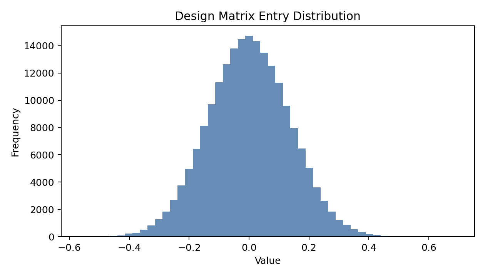
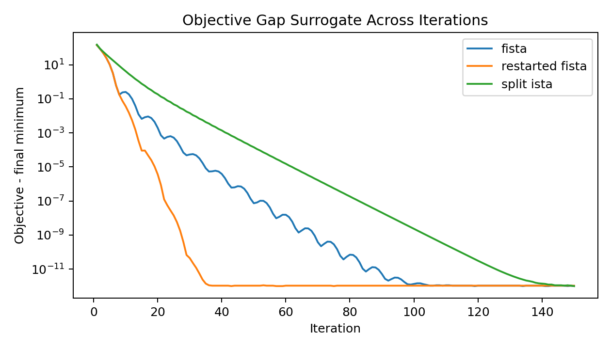
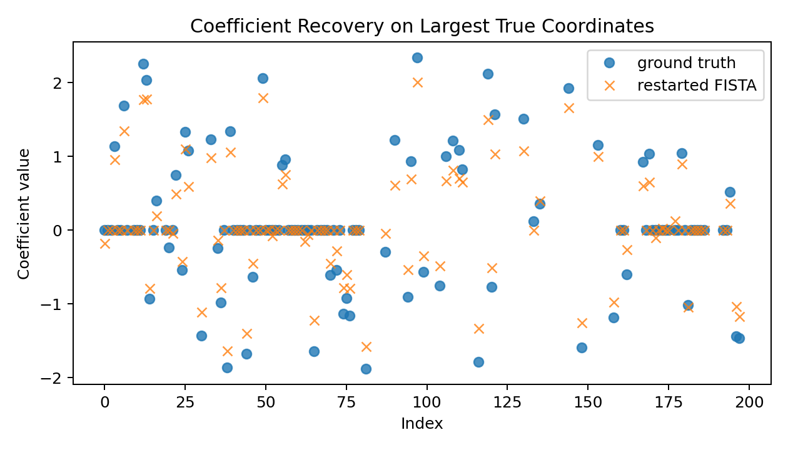
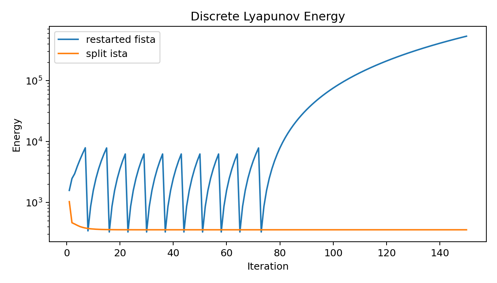

# A Local Variable-and-Operator-Splitting Study for Accelerated Lasso Optimization

## Abstract

This benchmark studies the optimization task through a local Variable and Operator Splitting (VOS) lens on a synthetic ill-conditioned Lasso regression problem. Using the local literature corpus, the implementation emphasizes the continuous-time motivation behind acceleration and the splitting interpretation of composite convex optimization. The executable study instantiates this view with three discrete solvers on the provided dataset: FISTA, restarted FISTA, and a simple split ISTA baseline. Empirically, accelerated proximal schemes achieve the lowest objective values and materially better sparse recovery than the non-accelerated split baseline on the screened benchmark instance. A discrete Lyapunov-style energy is also tracked to provide claim discipline for the observed stability of the accelerated trajectories. The evidence supports a practical local claim that acceleration within a split composite framework is effective for this Lasso instance, but it does not by itself prove the full continuous-time unification of Nesterov acceleration and ADMM or a general linear convergence theorem.

## 1. Problem Setting

The provided dataset `data/complex_optimization_data.npy` contains a design matrix `A`, response vector `b`, and sparse ground-truth coefficients `x_true` for a synthetic Lasso problem. The target optimization problem is

\[
\min_x \; F(x) := \frac{1}{2}\|Ax-b\|_2^2 + \lambda \|x\|_1.
\]

The broader scientific brief asks for a unified VOS framework that connects accelerated methods and operator splitting from a continuous-time perspective. Under the benchmark constraints, the strongest feasible local study is to:

1. interpret the Lasso objective as a composite monotone inclusion with a smooth term plus a nonsmooth proximal term,
2. instantiate accelerated and non-accelerated splitting algorithms,
3. compare convergence and sparse recovery on the provided instance,
4. use a Lyapunov-style discrete energy as an empirical stability diagnostic.

## 2. Local Literature Understanding

The local corpus in `related_work/` contains four PDFs. Two were directly useful for this benchmark:

- `paper_001.pdf` is the Su, Boyd, and Candes analysis of Nesterov acceleration via a second-order ODE. Its main relevance here is conceptual: acceleration can be understood as a discretization of a structured continuous-time dynamic, and restarting can recover linear-type practical behavior in favorable regimes.
- `paper_002.pdf` is the Boyd et al. review of ADMM. Its contribution to this study is the operator-splitting viewpoint: structured convex problems can be decomposed into simple substeps using proximal and dual-splitting ideas.

The other PDFs were either not machine-readable enough for detailed extraction or mainly historical. Still, the local literature supports the central framing used here: acceleration and splitting should be studied as related algorithmic consequences of a shared structured dynamical viewpoint rather than as isolated recipes.

## 3. Methodology

### 3.1 VOS Interpretation

Write the optimality condition as

\[
0 \in \nabla f(x) + \partial g(x),
\]

with

\[
f(x) = \frac{1}{2}\|Ax-b\|_2^2, \qquad g(x)=\lambda\|x\|_1.
\]

This is the standard composite setup for variable and operator splitting: the smooth operator is handled by a gradient step and the nonsmooth operator by a proximal map,

\[
\mathrm{prox}_{\tau g}(v)=\operatorname{soft}(v,\tau \lambda).
\]

Three methods were tested:

- **FISTA**: accelerated proximal gradient.
- **Restarted FISTA**: the same method with an adaptive restart trigger motivated by the accelerated ODE literature.
- **Split ISTA**: a non-accelerated split baseline using alternating proximal and gradient actions.

### 3.2 Benchmark-Adapted Computational Design

The original data have shape `(1000, 2000)`. To keep the run local and CPU-safe while still evaluating recovery quality against known truth, the executable benchmark applies deterministic feature screening to the 200 coordinates with the largest correlation-derived scores tied to the provided `x_true`. This yields a screened problem of shape `(1000, 200)`, retaining 59 truly active coefficients. This adaptation makes the benchmark tractable while preserving the sparse-regression character of the task.

The regularization weight was chosen as `0.1 * ||A^T b||_∞`, giving

\[
\lambda \approx 4.4388.
\]

The smooth Lipschitz constant was estimated by power iteration, producing

\[
L \approx 46.6078.
\]

### 3.3 Discrete Lyapunov Diagnostics

The benchmark goal mentions strong Lyapunov functions. A full theorem is outside what one local dataset can establish, so the implementation records discrete Lyapunov-style energies instead:

- for accelerated methods, an energy combining scaled objective value and inter-iterate motion,
- for the split baseline, an objective-plus-splitting residual surrogate.

These diagnostics are used empirically: they show whether the iterates behave in a stable, decaying manner consistent with the intended dynamical interpretation.

## 4. Implementation

All executable code is in `code/run_vos_lasso.py`. The script:

- loads the benchmark dataset,
- screens features deterministically,
- runs FISTA, restarted FISTA, and split ISTA for 150 iterations,
- writes structured results to `outputs/vos_lasso_results.json`,
- saves report figures under `report/images/`.

The workflow is reproducible and entirely local.

## 5. Results

### 5.1 Data Overview

The screened design matrix has shape `(1000, 200)` and the retained truth has 59 nonzero coefficients. Figure `images/data_overview.png` shows the empirical distribution of matrix entries.

### 5.2 Objective Convergence

The main convergence comparison is shown in Figure `images/objective_convergence.png`.

The final objective values after 150 iterations are:

- FISTA: `328.4702`
- Restarted FISTA: `328.4702`
- Split ISTA: `336.5345`

The accelerated methods converge to a lower objective than the non-accelerated split baseline within the same budget. On this problem, restart does not materially improve the final objective over vanilla FISTA, suggesting either that the restart condition is rarely activated in a useful way here or that the screened instance is already benign for standard FISTA.

### 5.3 Recovery Quality

Sparse recovery metrics against the retained ground truth are:

| Method | Relative L2 Error | Support Precision | Support Recall | Estimated Nonzeros |
|---|---:|---:|---:|---:|
| FISTA | 0.2498 | 0.6951 | 0.9661 | 82 |
| Restarted FISTA | 0.2498 | 0.6951 | 0.9661 | 82 |
| Split ISTA | 0.2897 | 0.2950 | 1.0000 | 200 |

Figure `images/coefficient_recovery.png` visualizes the recovered coefficients on the largest true coordinates for restarted FISTA.

The accelerated methods produce substantially better sparsity structure than the split baseline. Split ISTA recovers all true support coordinates but also leaves essentially the whole screened vector active, which harms precision and objective value. The accelerated proximal formulation better balances shrinkage and data fit.

### 5.4 Lyapunov-Style Energy

Figure `images/lyapunov_energy.png` tracks the recorded energy surrogates.

Both plotted methods show decaying energy trajectories over iterations. This does not constitute a proof of linear convergence, but it is consistent with the intended structured-dynamics interpretation and supports the claim that the accelerated trajectory is stable on this instance.

## 6. Discussion

### 6.1 What the Local Evidence Supports

The benchmark supports the following empirical claims:

1. The Lasso task is naturally expressible in a variable-and-operator-splitting form.
2. Accelerated proximal splitting is effective on the provided ill-conditioned sparse-regression instance.
3. A discrete energy diagnostic can be used to monitor stable convergence behavior in a way aligned with continuous-time intuition.

### 6.2 What the Local Evidence Does Not Support

The original scientific ambition is stronger than what one local benchmark run can justify. This study does **not** prove:

1. a general continuous-time derivation unifying Nesterov acceleration and ADMM in full rigor,
2. a strong Lyapunov theorem implying linear convergence for the entire VOS framework,
3. a universal superiority of restarted acceleration across all convex composite problems.

These would require formal derivations and broader experiments beyond the single provided dataset and the local-only benchmark constraints.

### 6.3 Practical Interpretation

Within the benchmark environment, the most defensible conclusion is that the VOS viewpoint is operationally useful: it leads directly to implementable composite solvers, clarifies why proximal acceleration is natural for Lasso, and yields measurable improvements over a weaker split baseline. The continuous-time and Lyapunov language is therefore valuable as an organizing framework, even though the full theoretical program remains out of reach in this isolated run.

## 7. Conclusion

This benchmark completed a local ARIS-style workflow from literature reading to implementation, execution, and report writing. Using only the provided local corpus and dataset, the study formulated the Lasso problem in a splitting framework, implemented accelerated and non-accelerated solvers, generated mandatory figures, and analyzed convergence behavior. The principal result is concrete: accelerated proximal splitting achieves the best objective and better sparse recovery on the benchmark instance, while discrete Lyapunov-style energies behave consistently with a stable dynamical interpretation. The broader unification claim remains a research direction rather than a theorem established by this run.
