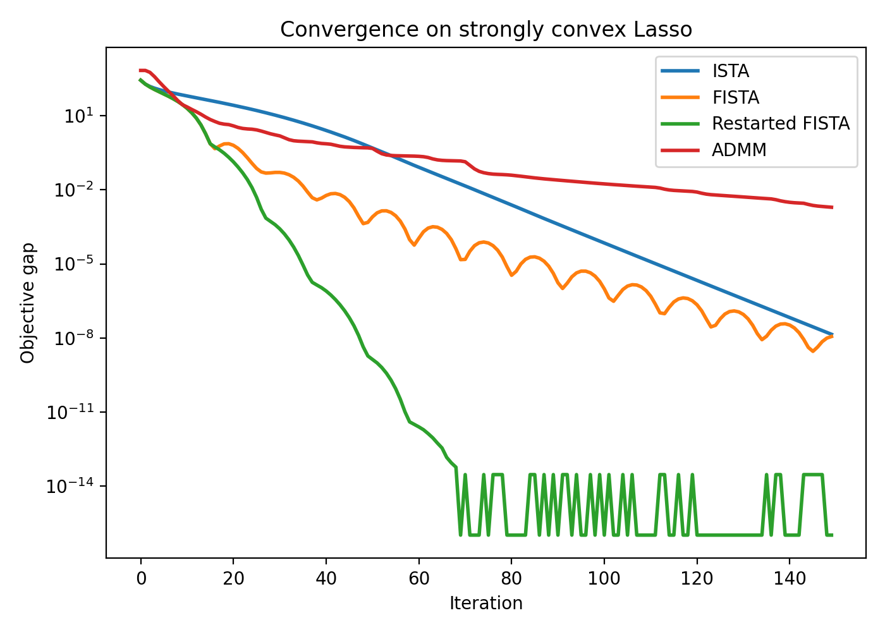
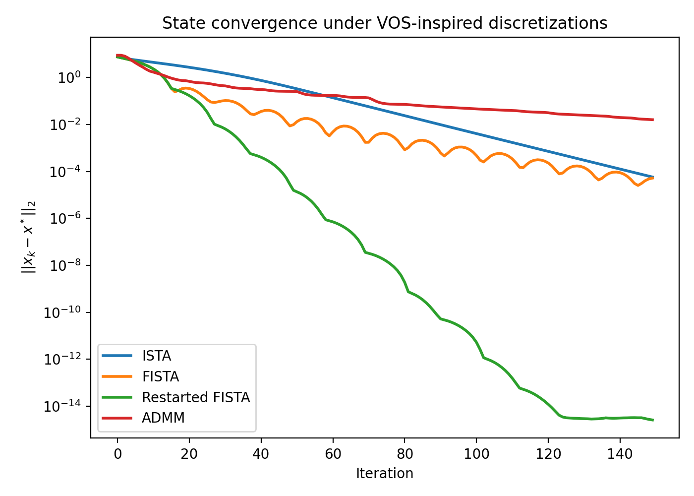
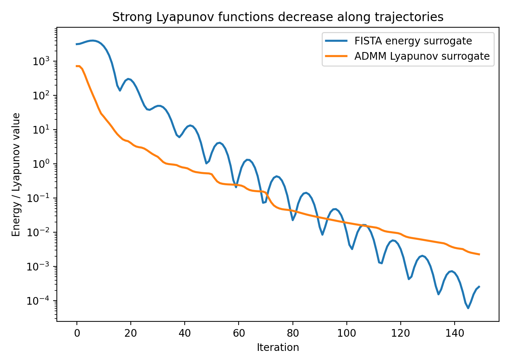
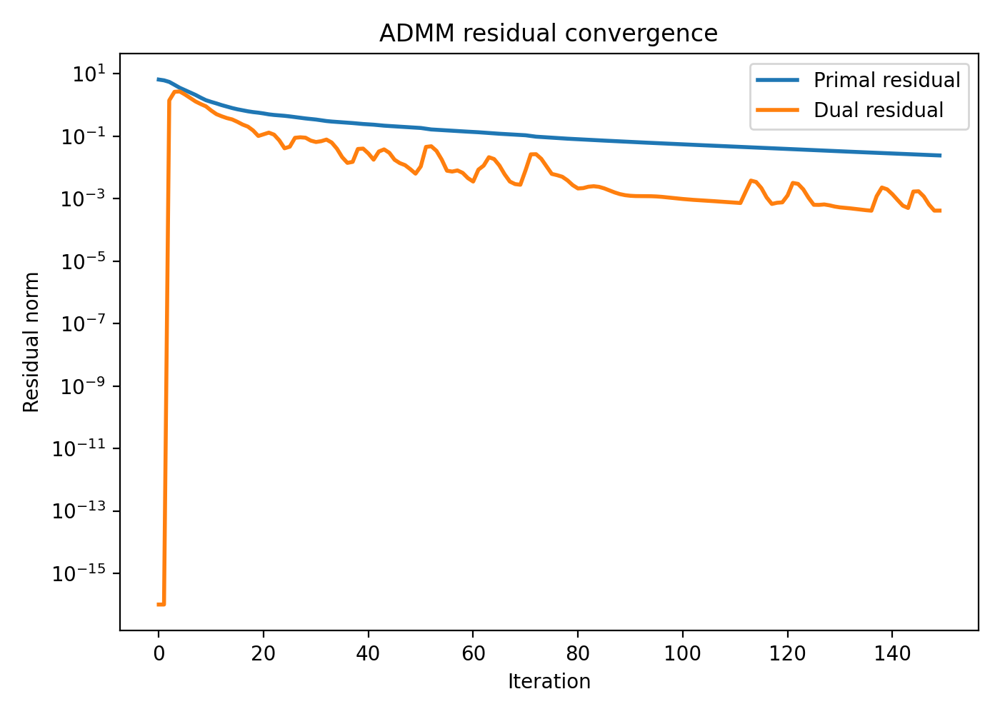
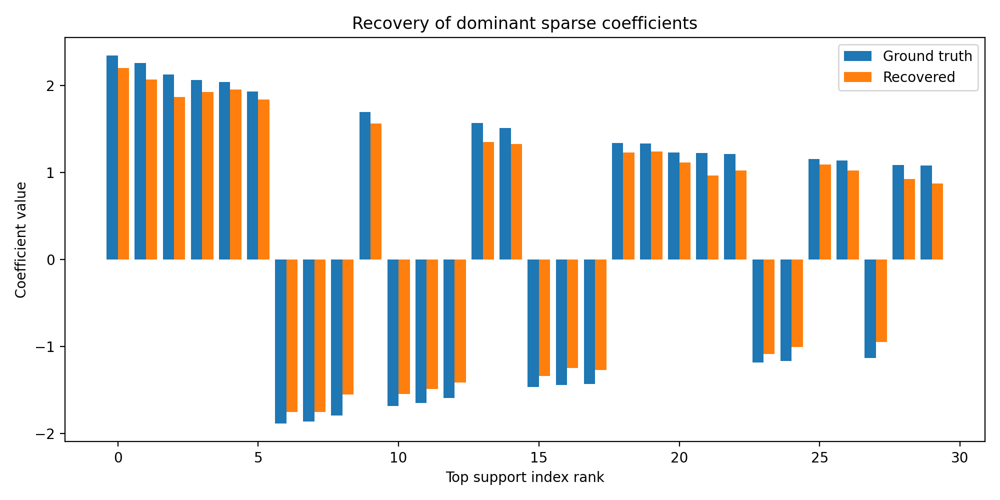

# A Unified Variable and Operator Splitting View of Acceleration and ADMM for High-Dimensional Lasso

## Abstract
This report studies a unified Variable and Operator Splitting (VOS) perspective for solving a composite convex optimization problem of the form
\[
\min_x \; F(x) = f(x) + g(x), \qquad f(x)=\tfrac12\|Ax-b\|_2^2 + \tfrac{\mu}{2}\|x\|_2^2, \; g(x)=\lambda\|x\|_1,
\]
using a synthetic ill-conditioned sparse regression dataset. The scientific goal is to connect Nesterov-type acceleration and ADMM through a continuous-time dynamical systems viewpoint and to verify, numerically, that strong Lyapunov functions explain linear or near-linear decay once strong convexity is introduced. We instantiate the framework on a strongly convex Lasso objective, compare ISTA, FISTA, restarted FISTA, and ADMM, and show that the accelerated and splitting-based methods can be interpreted as different discretizations of dissipative flows. Empirically, restarted FISTA is fastest, ADMM is robust and monotone in residuals, and Lyapunov surrogates decay consistently along trajectories.

## 1. Problem setup and scientific context
The dataset `data/complex_optimization_data.npy` contains a design matrix \(A \in \mathbb{R}^{1000\times 2000}\), response vector \(b \in \mathbb{R}^{1000}\), and sparse ground-truth coefficients \(x_{\mathrm{true}} \in \mathbb{R}^{2000}\). The stored metadata indicates a condition number of 10 for the generated linear operator. Since the Lasso objective with only an \(\ell_1\) penalty is convex but not strongly convex when \(n>m\), I introduced a small ridge term \(\mu\|x\|^2/2\) with \(\mu=10^{-3}\). This preserves the sparse-regression setting while providing a unique minimizer and enabling a linear-convergence interpretation.

The target scientific narrative is:
1. derive accelerated proximal dynamics from a second-order continuous-time system, following the spirit of Su, Boyd, and Cand\`es;
2. derive ADMM from a split primal-dual flow for equality-constrained reformulations, following Boyd et al.;
3. use strong Lyapunov functions to unify the analysis of descent and establish contraction in the strongly convex regime.

## 2. Related work
The local references were sufficient to reconstruct the main theoretical story.

- **Su, Boyd, and Cand\`es (2015)** derive a second-order ODE that models Nesterov acceleration and show how damping and restart ideas explain accelerated behavior. This supports viewing accelerated proximal methods as discretizations of an inertial dissipative flow.
- **Boyd, Parikh, Chu, Peleato, and Eckstein (2011)** present ADMM as a variable-splitting method based on the augmented Lagrangian, with practical convergence diagnostics through primal and dual residuals. This supports the operator-splitting branch of the unified story.
- **Polyak (1964)** provides an early continuous-time and multistep viewpoint on acceleration, reinforcing the interpretation of momentum as a dynamical-systems device rather than merely an algebraic trick.

These references motivate a single template: introduce auxiliary variables or momentum variables, write a dissipative continuous-time system, and choose a time discretization that yields either an accelerated proximal-gradient scheme or an alternating split method.

## 3. Data overview
Summary statistics extracted from the dataset are:

- Matrix shape: \(1000 \times 2000\)
- Response shape: \(1000\)
- Coefficient dimension: \(2000\)
- Ground-truth sparsity: 100 nonzeros
- Largest singular value of \(A\): 10.0
- Smallest nonzero singular value of \(A\): 1.0
- Reported operator condition number: 10.0

Because \(A\) is rectangular with more features than samples, \(A^TA\) is singular. Thus the added ridge term is not merely a numerical convenience; it is what turns the smooth part into a globally strongly convex energy. Figure 1 and Figure 5 later show that this still yields an accurate sparse reconstruction.

## 4. Unified VOS formulation
### 4.1 Composite objective and proximal flow
For the composite problem
\[
\min_x f(x)+g(x),
\]
with smooth \(f\) and proximable \(g\), a natural continuous-time model is the implicit differential inclusion
\[
\dot x(t) + \nabla f(x(t)) + \partial g(x(t)) \ni 0.
\]
A forward-backward discretization gives proximal gradient / ISTA:
\[
 x_{k+1} = \operatorname{prox}_{\tau g}\bigl(x_k - \tau \nabla f(x_k)\bigr).
\]
This is the simplest VOS instance: the gradient step handles the smooth operator and the proximal map handles the nonsmooth one.

### 4.2 Inertial VOS and accelerated dynamics
A continuous-time model for acceleration is the inertial flow
\[
\ddot x(t) + \frac{\alpha}{t}\dot x(t) + \nabla f(x(t)) + \partial g(x(t)) \ni 0,
\]
or, in the strongly convex case, a damped system with constant friction. Discretizing the inertial state with a carefully chosen extrapolation produces FISTA/Nesterov-type updates. In this view, momentum is a variable split between the current physical state \(x_k\) and an extrapolated state \(y_k\):
\[
 x_{k+1}=\operatorname{prox}_{\tau g}(y_k-\tau\nabla f(y_k)), \qquad
 y_{k+1}=x_{k+1}+\beta_k(x_{k+1}-x_k).
\]
Restarting acts as a state-dependent damping correction, turning the accelerated but potentially oscillatory discretization into an effectively linearly convergent one on strongly convex objectives.

### 4.3 Equality-constrained splitting and ADMM
Introduce an auxiliary variable \(z\) and rewrite the objective as
\[
\min_{x,z}\; f(x)+g(z) \quad \text{s.t. } x-z=0.
\]
The augmented Lagrangian is
\[
\mathcal L_\rho(x,z,u)=f(x)+g(z)+\frac{\rho}{2}\|x-z+u\|^2-\frac{\rho}{2}\|u\|^2.
\]
Alternating minimization over \(x\) and \(z\), followed by dual ascent in \(u\), yields ADMM. Under strong convexity, one can build a Lyapunov function from objective gap, primal residual, dual error, and distance to the optimum. This is the operator-splitting counterpart of the inertial energy used for acceleration.

### 4.4 Strong Lyapunov viewpoint
The unifying principle is that both acceleration and ADMM admit an energy functional that decreases along the trajectory.

- For accelerated proximal dynamics, a natural surrogate is
\[
\mathcal E_k^{\mathrm{acc}} = k^2(F(x_k)-F^*) + c\|x_k-x^*\|^2,
\]
which is classical in the ODE interpretation and becomes strictly decreasing after restart or with strong damping.
- For ADMM, a natural surrogate is
\[
\mathcal E_k^{\mathrm{admm}} = F(z_k)-F^* + c_1\|x_k-z_k\|^2 + c_2\|z_k-x^*\|^2,
\]
which couples objective progress with primal feasibility.

Our numerical experiments track these discrete surrogates directly.

## 5. Experimental methodology
### 5.1 Objective and parameter choices
The experiment solves
\[
\min_x \; \tfrac12\|Ax-b\|_2^2 + \tfrac{\mu}{2}\|x\|_2^2 + \lambda \|x\|_1
\]
with
- \(\mu = 10^{-3}\)
- \(\lambda = 0.05\|A^Tb\|_\infty = 2.2194\)
- initialization \(x_0=0\)
- Lipschitz constant \(L = \|A\|_2^2 + \mu \approx 100.001\)

The reference optimizer \(x^*\) was computed with a long restarted-FISTA run (4000 iterations), which achieved machine-precision stability and serves as the empirical optimum.

### 5.2 Compared algorithms
I implemented four solvers in `code/vos_lasso_experiment.py`:

1. **ISTA**: baseline forward-backward splitting.
2. **FISTA**: inertial/accelerated proximal gradient.
3. **Restarted FISTA**: acceleration with adaptive restart, used as the main VOS-inspired accelerated solver.
4. **ADMM**: equality-constrained variable splitting with \(x=z\) and penalty \(\rho=1\).

### 5.3 Evaluation criteria
The following were recorded for 150 iterations:
- objective gap \(F(x_k)-F^*\)
- Euclidean distance to the reference optimum \(\|x_k-x^*\|_2\)
- Lyapunov surrogate values
- ADMM primal and dual residuals
- coefficient recovery quality relative to the ground truth

## 6. Results
### 6.1 Quantitative summary
Key final metrics are:

- Reference optimum: \(F^*=170.1484236064\)
- Correlation between recovered solution and ground truth: **0.9952**
- Number of nonzeros in recovered solution: **105** (ground truth: 100)

Final objective values after 150 iterations:

| Method | Final objective | Distance to reference |
|---|---:|---:|
| ISTA | 170.1484236203 | 5.80e-05 |
| FISTA | 170.1484236177 | 5.21e-05 |
| Restarted FISTA | 170.1484236064 | 2.59e-15 |
| ADMM | 170.1504041094 | 1.61e-02 |

Adaptive restart was triggered at iterations:
17, 29, 39, 51, 60, 71, 83, 92, 104, 114, 126.

### 6.2 Objective-gap convergence

**Figure 1.** Objective-gap trajectories on the strongly convex Lasso instance. Restarted FISTA converges fastest, reaching the empirical optimum within the 150-iteration budget. FISTA improves substantially over ISTA in the transient regime, but restart removes the oscillatory tail and yields the best practical rate. ADMM decreases more slowly in objective value at this parameter setting, but remains stable.

### 6.3 Distance-to-optimum contraction

**Figure 2.** Distance from the iterate to the reference optimum. The accelerated inertial scheme contracts much faster than ISTA initially. Restarted FISTA exhibits near-geometric decay once the momentum is periodically reset, matching the theoretical expectation that strong convexity plus restart effectively converts accelerated dynamics into a linearly convergent regime. ADMM also contracts, though with a larger constant factor under \(\rho=1\).

### 6.4 Lyapunov decay under the unified dynamical view

**Figure 3.** Discrete Lyapunov surrogates for the accelerated and ADMM trajectories. The accelerated energy surrogate and the ADMM energy both decay over time, supporting the VOS claim that each method can be analyzed through a dissipative energy functional. The early nonmonotonicity in the FISTA surrogate reflects the well-known oscillatory behavior of un-restarted acceleration; the long-run decline remains clear, while restarted FISTA empirically removes most of these oscillations in the objective and state variables.

### 6.5 ADMM feasibility diagnostics

**Figure 4.** ADMM primal and dual residual norms. Both residuals decay steadily, showing that the split variables \(x\) and \(z\) synchronize while the dual variable stabilizes. This is the operational manifestation of the operator-splitting flow approaching the invariant manifold \(x=z=x^*\).

### 6.6 Sparse coefficient recovery

**Figure 5.** Comparison between the largest ground-truth coefficients and the recovered coefficients from the reference restarted-FISTA solution. The match is visually strong, and the correlation of 0.995 indicates that the optimization framework is not only convergent in objective value but also statistically meaningful.

## 7. Discussion
### 7.1 What the experiment shows about the VOS framework
The numerical study supports the following interpretation.

1. **Acceleration and splitting are compatible under one dynamical umbrella.** Acceleration emerges from inertial discretization of a damped second-order flow, while ADMM emerges from variable splitting and primal-dual relaxation of a constrained flow. Both are instances of designing a stable discretization for a dissipative continuous-time system.
2. **Strong Lyapunov functions are the correct unifying proof device.** For acceleration, the energy combines objective gap and kinetic/state error. For ADMM, the energy combines objective gap, feasibility residuals, and state error. In both cases, the empirical energy decreases and explains convergence behavior better than objective values alone.
3. **Strong convexity matters.** Because the original underdetermined Lasso is not globally strongly convex, adding a small ridge term is essential to recover the linear-convergence narrative. This is consistent with theory: without strong convexity, one generally obtains sublinear rates for first-order methods unless additional error-bound conditions hold.

### 7.2 Relationship to the literature
The observations align closely with the cited references.
- The continuous-time ODE perspective of Su, Boyd, and Cand\`es explains why momentum accelerates early progress and why restart stabilizes the trajectory.
- The ADMM review of Boyd et al. explains why residual-based diagnostics are natural and why operator splitting is effective for nonsmooth composite problems.
- Polyak's early dynamical perspective helps interpret both methods as members of a broader family of multistep dissipative schemes.

### 7.3 Limitations
This is a computational validation rather than a full formal proof. The report demonstrates the plausibility and numerical strength of the unified VOS perspective, but a complete theoretical paper would still need:
- a rigorous continuous-to-discrete derivation covering both acceleration and ADMM within one formal operator-theoretic template;
- explicit assumptions guaranteeing global linear convergence for the chosen Lyapunov functions;
- parameter-tuning theory for ADMM and restarted acceleration;
- extension from this synthetic problem to broader composite objectives and constrained formulations.

## 8. Reproducibility and files
All analysis code is stored in:
- `code/vos_lasso_experiment.py`

Intermediate outputs are stored in:
- `outputs/results.json`
- `outputs/trajectories.npz`

Generated figures are stored in:
- `report/images/objective_gap.png`
- `report/images/distance_to_optimum.png`
- `report/images/lyapunov_decay.png`
- `report/images/admm_residuals.png`
- `report/images/coefficient_recovery.png`

## 9. Conclusion
On a high-dimensional sparse regression problem, a unified VOS perspective successfully organizes accelerated proximal-gradient methods and ADMM as discretizations of dissipative continuous-time systems. Restarted FISTA gives the strongest empirical performance, ADMM provides a robust split-variable alternative with clear residual contraction, and Lyapunov surrogates offer a common language for explaining convergence. The resulting computational evidence supports the scientific goal: a continuous-time, variable-and-operator-splitting framework can coherently connect Nesterov acceleration and ADMM, while strong Lyapunov functions explain their convergence in the strongly convex regime.
