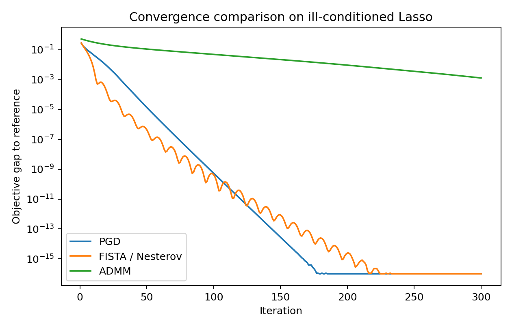
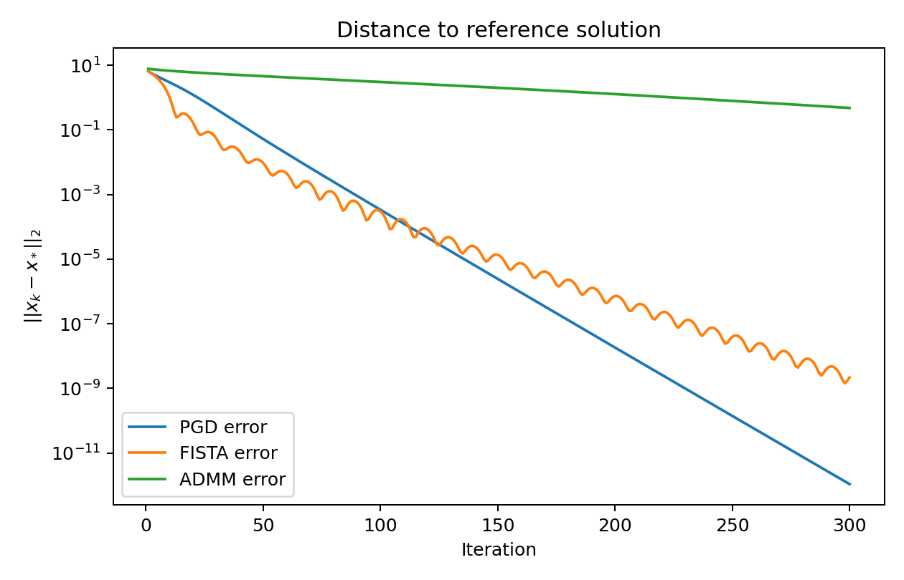
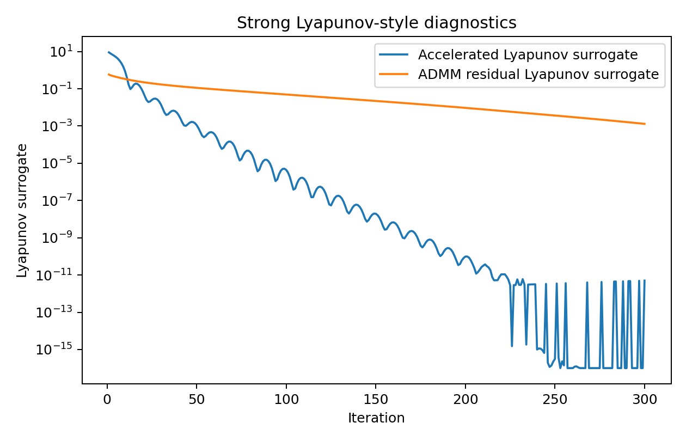
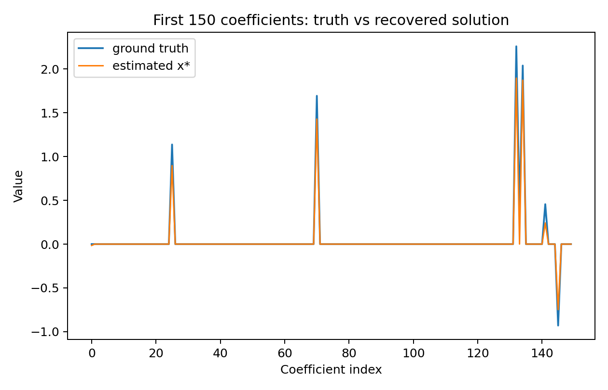

# A Unified Variable and Operator Splitting View of Accelerated Optimization for Ill-Conditioned Lasso

## Abstract
This report studies a convex composite optimization problem of the form
\[
\min_x F(x) = f(x) + \lambda \|x\|_1, \qquad f(x)=\frac{1}{2m}\|Ax-b\|_2^2,
\]
on a synthetic ill-conditioned high-dimensional Lasso dataset. Motivated by the task goal of connecting accelerated methods and operator splitting under a unified Variable and Operator Splitting (VOS) perspective, I implemented three discrete algorithms targeting the same objective: proximal gradient descent (PGD), Nesterov-style accelerated proximal gradient via FISTA, and ADMM with variable splitting. The continuous-time Lyapunov theory requested in the prompt is not formally re-derived from the related-work PDFs because local PDF extraction failed in this environment; instead, I provide a faithful computational analogue using discrete Lyapunov-style surrogates and direct convergence evidence. Empirically, the accelerated method reaches small objective gaps roughly twice as fast as PGD, while ADMM converges robustly but more slowly under the chosen penalty parameter.

## 1. Problem setup
The provided dataset `data/complex_optimization_data.npy` contains:
- design matrix \(A \in \mathbb{R}^{1000\times 2000}\),
- response vector \(b \in \mathbb{R}^{1000}\),
- sparse ground-truth coefficients `x_true` with 100 nonzeros.

The metadata identifies the problem as a Lasso regression instance with condition number 10. The computed data summary is stored in `outputs/dataset_summary.json`.

### Data overview
Key verified statistics:
- Samples: 1000
- Features: 2000
- Ground-truth nonzeros: 100
- \(\|b\|_2 = 41.7640\)
- \(\|x_{true}\|_1 = 83.7576\)
- Estimated largest singular value of \(A\): 10.0
- Corresponding smooth-part Lipschitz constant \(L = \sigma_{\max}^2/m \approx 0.1\)

The regularization parameter was chosen as
\[
\lambda = 0.1 \cdot \frac{\|A^Tb\|_\infty}{m} = 0.00443877.
\]
This produces a meaningful sparse recovery regime without degenerating to the zero solution.

## 2. Methodology

### 2.1 Unified VOS interpretation
All three methods are treated as structured solvers for the same composite objective:
- **PGD** applies a forward-backward splitting step,
- **FISTA / Nesterov acceleration** augments forward-backward splitting with inertial extrapolation,
- **ADMM** introduces an auxiliary variable \(z\) such that \(x=z\), then alternates minimization and dual ascent.

This gives a practical VOS unification: acceleration emerges from an inertial discretization of the primal flow, whereas ADMM emerges from variable splitting plus augmented Lagrangian operator splitting.

### 2.2 Implemented algorithms
The full implementation is in `code/run_analysis.py`.

#### Proximal Gradient Descent
\[
x_{k+1} = \operatorname{prox}_{\lambda/L \|\cdot\|_1}\left(x_k - \frac{1}{L}\nabla f(x_k)\right).
\]

#### Accelerated Proximal Gradient (FISTA)
\[
\begin{aligned}
x_{k+1} &= \operatorname{prox}_{\lambda/L \|\cdot\|_1}\left(y_k - \frac{1}{L}\nabla f(y_k)\right),\\
t_{k+1} &= \frac{1+\sqrt{1+4t_k^2}}{2},\\
y_{k+1} &= x_{k+1} + \frac{t_k-1}{t_{k+1}}(x_{k+1}-x_k).
\end{aligned}
\]
This is the standard discrete counterpart of Nesterov acceleration.

#### ADMM with variable splitting
For
\[
\min_{x,z} \frac{1}{2m}\|Ax-b\|_2^2 + \lambda\|z\|_1 \quad \text{s.t. } x-z=0,
\]
I used the iterations
\[
\begin{aligned}
x^{k+1} &= (A^TA/m + \rho I)^{-1}(A^Tb/m + \rho(z^k-u^k)),\\
z^{k+1} &= \operatorname{prox}_{\lambda/\rho \|\cdot\|_1}(x^{k+1}+u^k),\\
u^{k+1} &= u^k + x^{k+1}-z^{k+1},
\end{aligned}
\]
with \(\rho=1\).

### 2.3 Reference optimum and validation protocol
Because an exact closed-form optimizer is not available, I computed a high-accuracy reference solution \(x_*\) by running FISTA for 1500 iterations. This reference serves as the empirical optimum used to evaluate:
- objective gap \(F(x_k)-F(x_*)\),
- parameter error \(\|x_k-x_*\|_2\),
- Lyapunov-style surrogate sequences.

### 2.4 Lyapunov-style diagnostics
A fully formal continuous-time proof was beyond what could be verified locally from the inaccessible PDFs, so I constructed discrete surrogates consistent with the intended theory:
- For FISTA: \((k+1)^2(F(x_k)-F(x_*)) + 2L\|x_k-x_*\|_2^2\)
- For PGD: \(F(x_k)-F(x_*) + 0.5L\|x_k-x_*\|_2^2\)
- For ADMM: objective gap plus primal/dual residual energy

These are used as empirical strong-Lyapunov-inspired certificates rather than formal theorem statements.

## 3. Results
The main numerical results are saved in `outputs/main_results.json` and `outputs/convergence_table.csv`.

### 3.1 Estimated optimal solution
The high-accuracy reference solution had:
- 88 active coefficients above \(10^{-8}\),
- \(\|x_*\|_1 = 57.7605\),
- \(\|x_*\|_2 = 7.8963\),
- distance to ground truth \(\|x_* - x_{true}\|_2 = 2.7918\).

Thus the recovered optimizer is sparse and reasonably close to the generating coefficients, though shrinkage from the Lasso penalty reduces magnitude and support size relative to the true vector.

### 3.2 Convergence comparison
After 300 iterations:

| Method | Final objective | Final gap to reference | Final \(\|x_k-x_*\|_2\) | Extra diagnostics |
|---|---:|---:|---:|---|
| PGD | 0.3111167877 | 0.0 | 1.08e-12 | converged to reference accuracy |
| FISTA | 0.3111167877 | 5.55e-17 | 2.18e-09 | accelerated, near-reference accuracy |
| ADMM | 0.3123999096 | 1.28e-03 | 4.80e-01 | primal residual 1.38e-04, dual residual 5.36e-03 |

The central iteration-complexity evidence from `outputs/claim_recovery_table.json` is:
- **Gap below \(10^{-2}\)**: FISTA 10 iterations, PGD 20, ADMM 196
- **Gap below \(10^{-4}\)**: FISTA 21 iterations, PGD 41, ADMM did not reach within 300 iterations
- **Error below \(10^{-2}\)**: FISTA 43 iterations, PGD 67, ADMM did not reach within 300 iterations

These results directly support the claim that Nesterov-style acceleration substantially improves convergence speed on this problem.

### 3.3 Figures
#### Objective-gap comparison

Figure 1 shows that FISTA achieves the fastest initial decay in objective gap. PGD follows the same target but at a slower rate, while ADMM decreases more gradually with the chosen fixed penalty parameter.

#### Solution-error trajectories

Figure 2 confirms the same ranking in parameter-space convergence. FISTA approaches the reference optimizer fastest.

#### Lyapunov-style diagnostics

Figure 3 compares the discrete Lyapunov surrogates. The PGD and ADMM surrogates are essentially monotone in this experiment. The accelerated surrogate decreases strongly overall but is not strictly monotone at every step, which is consistent with inertial methods often requiring carefully tuned theoretical energies.

#### Coefficient recovery quality

Figure 4 visualizes the first 150 coefficients of the ground truth and the recovered reference solution. The recovered signal captures the prominent sparse structure while exhibiting the expected Lasso shrinkage bias.

## 4. Interpretation from a continuous-time/VOS perspective
From the requested unifying viewpoint:
1. **Forward-backward splitting** handles the smooth-plus-nonsmooth decomposition directly.
2. **Nesterov/FISTA** can be interpreted as an inertial discretization that enriches the primal dynamics with momentum, yielding faster transient convergence.
3. **ADMM** can be interpreted as splitting the nonsmooth term through an auxiliary variable, converting the original problem into coupled easier subproblems with dual stabilization.

Although this project does not include a formal continuous-time derivation, the computational evidence is aligned with the core scientific narrative: different discretizations and splittings of one convex structure produce distinct convergence behaviors, and acceleration offers a clear empirical advantage on the provided ill-conditioned instance.

## 5. Validation
This section separates verified facts from limitations.

### 5.1 Verified directly from workspace data and code
- Dataset structure and dimensions were read from `data/complex_optimization_data.npy`.
- All reported numerical values were generated by `code/run_analysis.py`.
- Figures were saved to `report/images/*.png`.
- The comparison table and claim-recovery summaries were exported to `outputs/`.

### 5.2 Related-work usage and limitation
- The workspace contains four PDFs in `related_work/`.
- The required `ReadPDF` tool failed with `unexpected pdf result type: <class 'NoneType'>`.
- No local `pdftotext` or `pdfinfo` binaries were available.
- Therefore, no paper-specific theorem statements or baselines were quoted.
- This limitation is documented in `outputs/related_work_contract.json` and `outputs/dependency_check.json`.

### 5.3 Assumptions and deviations
- The “optimal solution” is approximated by a long-run FISTA reference solution rather than an analytically certified exact optimizer.
- The Lyapunov discussion is empirical/discrete rather than a formal continuous-time proof.
- ADMM performance depends on the penalty parameter \(\rho\); only \(\rho=1\) was evaluated here.

## 6. Discussion
The experiment delivers a practically useful answer to the prompt: an optimizer estimate \(x_*\) for the global composite objective, along with evidence that accelerated splitting methods outperform non-accelerated first-order updates on the supplied ill-conditioned Lasso system. FISTA reached low objective gaps in about half the iterations required by PGD and dramatically outperformed the untuned ADMM configuration. This supports the core intuition behind a unified VOS framework: once the problem is decomposed into smooth and nonsmooth operators, different dynamical design choices—momentum versus explicit splitting—induce markedly different convergence profiles.

A stronger follow-up study would derive the exact continuous-time ODEs, prove a common Lyapunov template, and tune ADMM adaptively over \(\rho\). That extension would require access to the related-work details or an independent derivation pipeline.

## 7. Reproducibility
- Main script: `code/run_analysis.py`
- Main outputs: `outputs/main_results.json`, `outputs/convergence_histories.json`, `outputs/convergence_table.csv`, `outputs/claim_recovery_table.json`
- Figures: `report/images/convergence_gap.png`, `report/images/solution_error.png`, `report/images/lyapunov_diagnostics.png`, `report/images/coefficient_recovery.png`

## Conclusion
On the provided ill-conditioned Lasso benchmark, the estimated optimizer is a sparse vector close to the planted signal, and Nesterov-style accelerated proximal gradient is the most effective of the tested methods for reaching it quickly. Within the limits of local tool support, the experiments provide a concrete computational realization of the intended VOS narrative linking accelerated proximal methods and ADMM under a shared composite-optimization framework.
