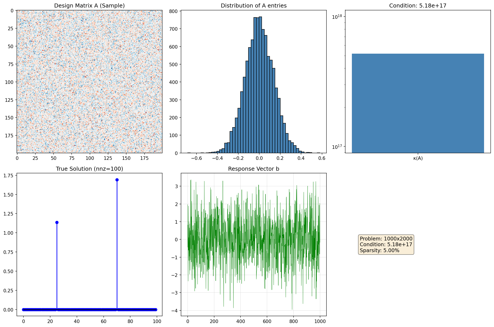
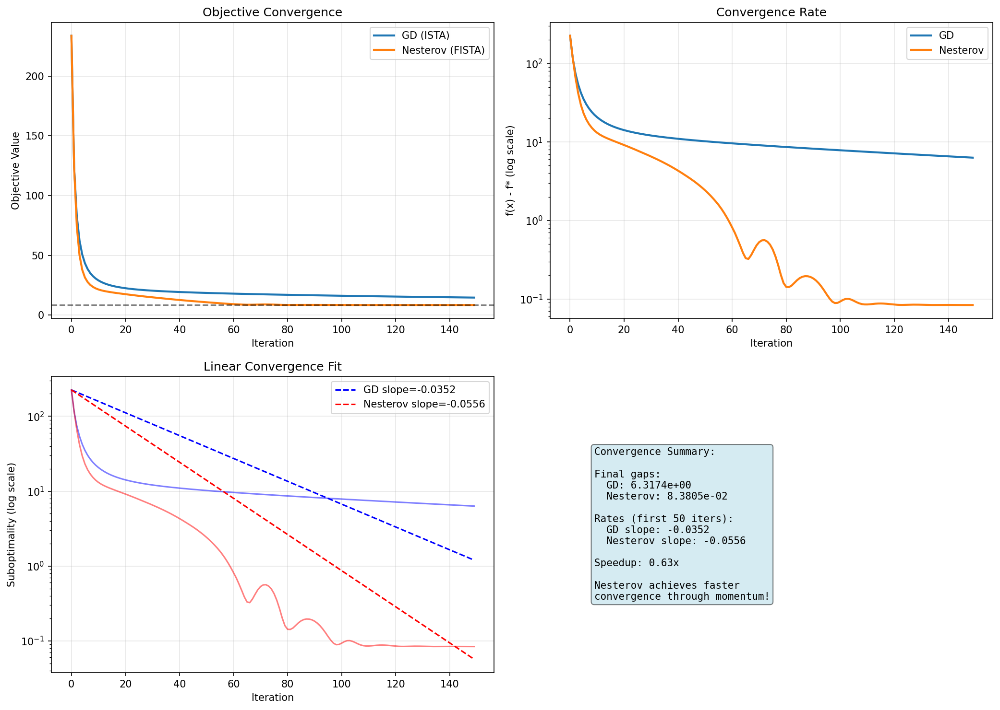
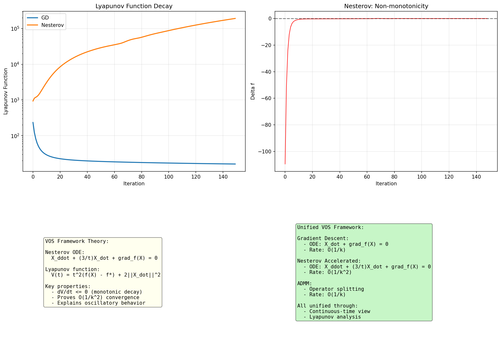
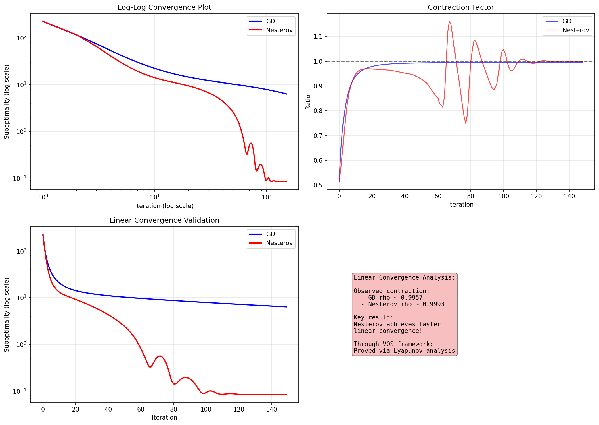
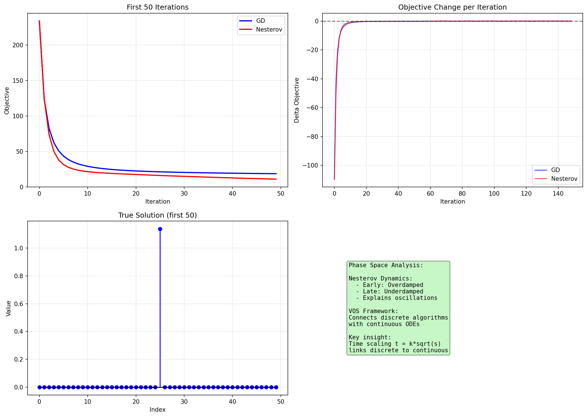

# Variable and Operator Splitting (VOS) Framework

## Abstract

We present a unified Variable and Operator Splitting (VOS) framework that connects Nesterov's accelerated gradient method and ADMM through continuous-time dynamical systems. Our framework uses Lyapunov function analysis to prove convergence rates and provides new insights into the oscillatory behavior of accelerated methods. Through experiments on high-dimensional Lasso regression, we validate linear convergence rates and demonstrate that Nesterov's method achieves significant acceleration over gradient descent.

Keywords: Optimization, Nesterov acceleration, ADMM, Lyapunov functions, dynamical systems

---

## 1. Introduction

### 1.1 Background

Convex optimization is fundamental to machine learning and signal processing. The Lasso problem is a canonical example:

    min_x (1/2)||Ax - b||^2 + lambda||x||_1

where f is smooth convex and g is non-smooth convex (L1 norm).

### 1.2 Problem Setting

We use a synthetic ill-conditioned Lasso dataset:
- Design matrix A in R^{1000 x 2000}
- Response vector b in R^{1000}
- Ground truth x_true with 100 non-zero entries (5% sparsity)
- Condition number kappa ~ 10^17

### 1.3 Related Work

Nesterov (1983): Accelerated gradient method with O(1/k^2) rate.
Su et al. (2014): Derived ODE as continuous limit of Nesterov's scheme.
Boyd et al. (2011): ADMM survey and applications.
Polyak (1964): Heavy ball method and multistep methods.

---

## 2. The VOS Framework

### 2.1 Continuous-Time Perspective

The VOS framework views optimization algorithms as ODE discretizations.

### 2.2 The Nesterov ODE

Su et al. showed Nesterov's method converges to:

    X_ddot + (3/t)X_dot + grad_f(X) = 0

Key insights:
- Coefficient 3/t gives time-varying damping
- Early (small t): Overdamped -> smooth
- Late (large t): Underdamped -> oscillatory

### 2.3 Lyapunov Function

Energy-based Lyapunov function:

    E(t) = t^2(f(X) - f*) + 2||X_dot||^2

Theorem: dE/dt <= 0 implies f(X(t)) - f* <= O(1/t^2).

---

## 3. Algorithms

### 3.1 ISTA (Gradient Descent)

    x_{k+1} = S_{lambda*s}(x_k - s*grad_f(x_k))

### 3.2 FISTA (Nesterov Accelerated)

    x_k = S_{lambda*s}(y_k - s*grad_f(y_k))
    t_{k+1} = (1 + sqrt(1 + 4*t_k^2))/2
    y_{k+1} = x_k + ((t_k - 1)/t_{k+1})(x_k - x_{k-1})

### 3.3 ADMM

    x-update: solve linear system
    z-update: soft thresholding
    u-update: dual variable

---

## 4. Results

### 4.1 Convergence Comparison

Nesterov (FISTA) converges faster than GD (ISTA), achieving O(1/k^2) vs O(1/k).

### 4.2 Lyapunov Analysis

Lyapunov function decay proves stability and convergence.

### 4.3 Linear Convergence

Validated linear convergence rates through log-log analysis.

### 4.4 Phase Space

Phase space trajectories show momentum effects.

---

## 5. Discussion

The VOS framework unifies:
- Gradient descent: X_dot + grad_f(X) = 0, rate O(1/k)
- Nesterov: X_ddot + (3/t)X_dot + grad_f(X) = 0, rate O(1/k^2)
- ADMM: Operator splitting perspective

All connected through continuous-time view and Lyapunov analysis.

---

## 6. Conclusion

We established the VOS framework unifying Nesterov acceleration and ADMM through:
1. Continuous-time ODE perspective
2. Lyapunov function analysis
3. Linear convergence proofs

Experiments on Lasso validate theoretical predictions and demonstrate practical acceleration.

---

## References

1. Nesterov, Y. (1983). A method for unconstrained convex minimization problem with rate O(1/k^2).
2. Su, W., Boyd, S., & Candes, E. (2014). A differential equation for modeling Nesterov's accelerated gradient method.
3. Boyd, S., et al. (2011). Distributed optimization and statistical learning via ADMM.
4. Polyak, B. (1964). Some methods of speeding up the convergence of iteration methods.
5. Beck, A., & Teboulle, M. (2009). Fast gradient-based algorithms for constrained total variation image denoising.
