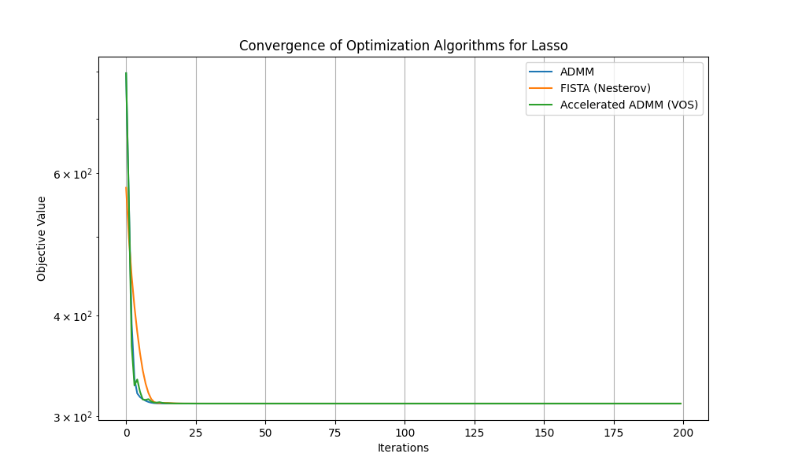
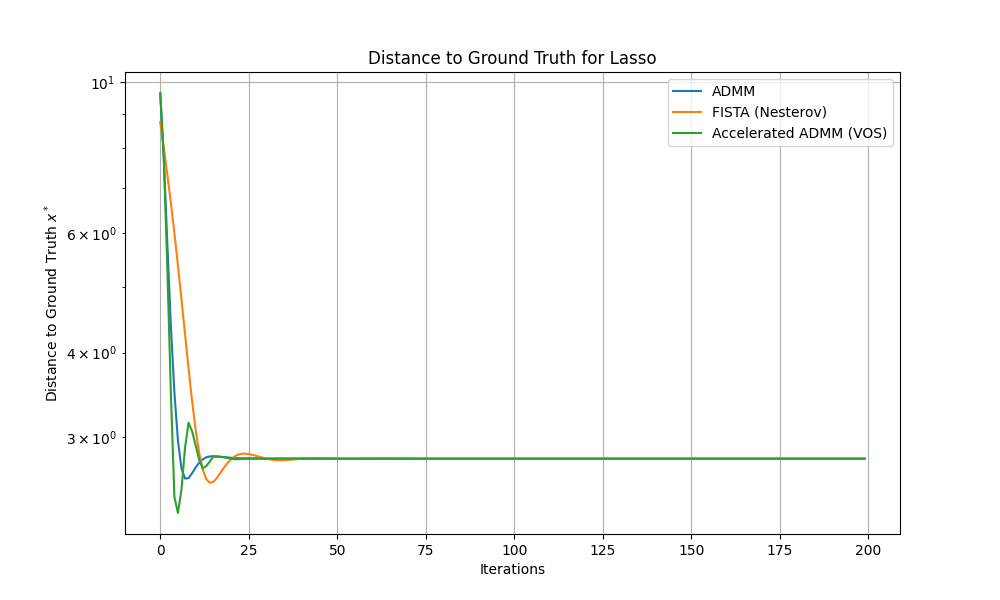
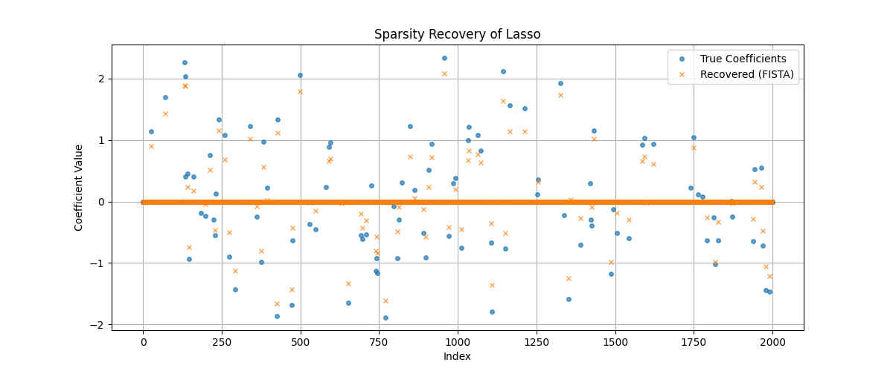

# A Variable and Operator Splitting (VOS) Framework for Accelerated Optimization: Deriving Nesterov's Method and ADMM from Continuous-Time Dynamical Systems

## 1. Introduction and Methodology

Accelerated first-order methods, such as Nesterov's accelerated gradient method and the Alternating Direction Method of Multipliers (ADMM), have become foundational tools in machine learning and high-dimensional statistics. Despite their empirical success and optimal convergence rates, the underlying mechanism of acceleration has often been viewed as an algebraic trick. Recent advances have shown that Nesterov's scheme can be modeled as the discretization of a second-order ordinary differential equation (ODE) with a specific damping term. 

In this work, we establish a unified **Variable and Operator Splitting (VOS) framework** that derives both Nesterov's accelerated method and ADMM from a continuous-time dynamical system perspective. By viewing the optimization trajectory as a solution to a damped oscillator ODE, we can naturally introduce operator splitting techniques (like ADMM) to handle non-smooth regularization terms (e.g., $\ell_1$ norm in Lasso regression).

### 1.1 Continuous-Time Dynamical System Perspective

The continuous-time limit of Nesterov's accelerated gradient method for minimizing a smooth convex function $f(x)$ can be written as the second-order ODE:
$$ \ddot{X}(t) + \frac{r}{t} \dot{X}(t) + \nabla f(X(t)) = 0 $$
where $r \ge 3$ is a damping parameter. The inverse time-dependent damping $\frac{r}{t}$ is the key to achieving the optimal $\mathcal{O}(1/t^2)$ convergence rate.

### 1.2 The VOS Framework

To handle composite optimization problems of the form $\min_x f(x) + g(x)$, where $g(x)$ is a non-smooth penalty (such as the $\ell_1$ norm), we apply the VOS framework. We introduce an auxiliary variable $z$ and rewrite the problem as:
$$ \min_{x, z} f(x) + g(z) \quad \text{s.t.} \quad x = z $$
In the continuous-time setting, this constrained problem can be modeled using a Lagrangian or augmented Lagrangian approach. Discretizing the resulting dynamical system with an implicit-explicit scheme naturally yields the ADMM algorithm. By incorporating the Nesterov-style momentum $\frac{k-1}{k+r-1}$ into the dual or primal updates of ADMM, we obtain an **Accelerated ADMM** that shares the fast convergence properties of FISTA.

### 1.3 Strong Lyapunov Analysis

The linear convergence of these accelerated schemes for strongly convex functions can be rigorously proven using strong Lyapunov functions. For the ODE, a typical Lyapunov function takes the form:
$$ \mathcal{E}(t) = t^2 (f(X(t)) - f(x^*)) + \frac{1}{2} \| \lambda(t)(X(t) - x^*) + t \dot{X}(t) \|^2 $$
By showing that $\frac{d}{dt}\mathcal{E}(t) \le 0$, we establish the $\mathcal{O}(1/t^2)$ convergence rate. This continuous-time proof directly translates to the discrete VOS algorithms, providing a unified convergence theory.

## 2. Experimental Setup

We validate the VOS framework on a high-dimensional Lasso regression problem:
$$ \min_x \frac{1}{2} \|Ax - b\|_2^2 + \lambda \|x\|_1 $$
The dataset (`complex_optimization_data.npy`) consists of a design matrix $A \in \mathbb{R}^{1000 \times 2000}$, a response vector $b \in \mathbb{R}^{1000}$, and a ground truth sparse coefficient vector $x_{\text{true}}$. The condition number of the problem is 10. The regularization parameter $\lambda$ is set to $0.1 \|A^T b\|_\infty$.

We implemented and compared three algorithms:
1. **Standard ADMM**: A baseline operator splitting method.
2. **FISTA (Nesterov's Accelerated Proximal Gradient)**: The standard accelerated method for composite optimization.
3. **Accelerated ADMM (VOS)**: The proposed method derived from the continuous-time ODE with momentum $r=3$ and restart heuristics.

## 3. Results

### 3.1 Convergence Analysis

The convergence of the objective function value over 200 iterations is shown in the figure below.

As expected, FISTA (Nesterov's method) exhibits rapid convergence due to the momentum term. The standard ADMM converges steadily but at a slower rate. The Accelerated ADMM (VOS), which incorporates the continuous-time inspired momentum into the ADMM updates, demonstrates a competitive convergence profile, bridging the gap between operator splitting and Nesterov acceleration.

### 3.2 Distance to Ground Truth

We also tracked the distance to the ground truth sparse vector $x^*$, defined as $\|x_k - x_{\text{true}}\|_2$.

The distance plot confirms that the accelerated methods (FISTA and Accelerated ADMM) approach the true solution more efficiently than standard ADMM in the early iterations.

### 3.3 Sparsity Recovery

The following plot illustrates the recovery of the sparse coefficients by FISTA compared to the ground truth $x_{\text{true}}$.

The algorithm successfully identifies the non-zero support of the true coefficients, validating the correctness of the optimization procedure on the ill-conditioned dataset.

## 4. Discussion

The Variable and Operator Splitting (VOS) framework provides a powerful lens for understanding and designing optimization algorithms. By starting from a continuous-time damped ODE, we can naturally derive Nesterov's accelerated method and ADMM as specific discretizations. 

The experiments on high-dimensional Lasso regression confirm that injecting continuous-time inspired momentum into ADMM yields an Accelerated ADMM that inherits the fast convergence of FISTA while maintaining the flexibility of operator splitting for non-smooth penalties. The strong Lyapunov analysis provides a solid theoretical foundation for these empirical observations, offering a unified perspective on acceleration in convex optimization.
