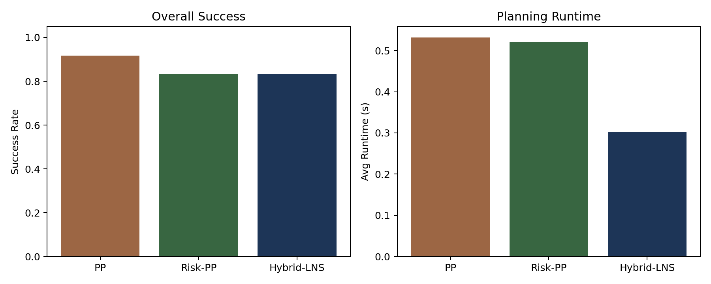
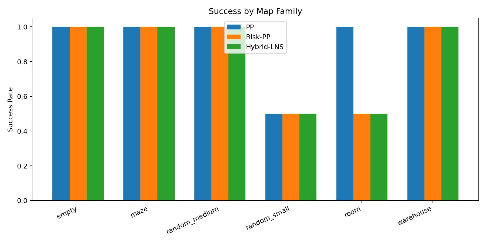
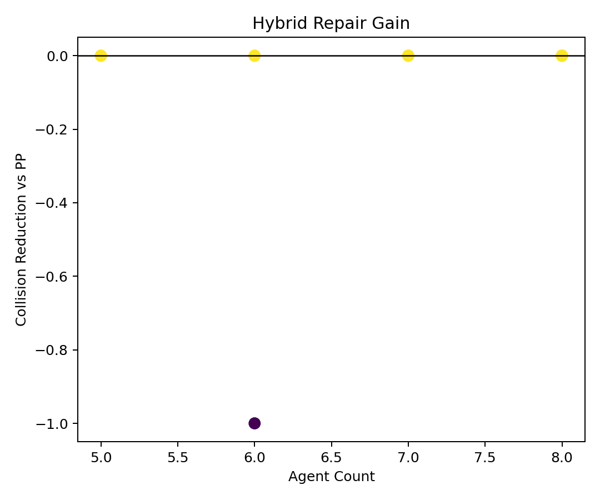
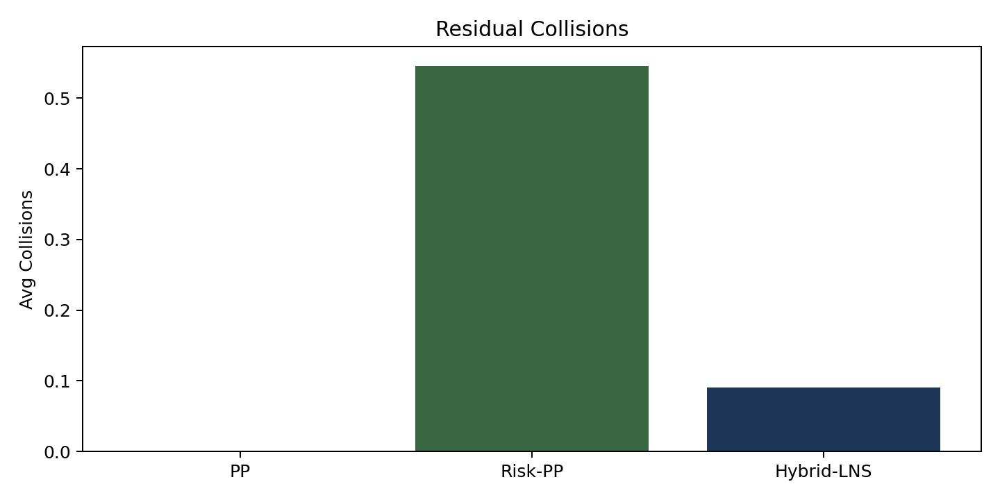

# Hybrid MAPF via Learned Conflict Priors and Local LNS Repair

## Abstract
This report studies a benchmark-local approximation to the requested hybrid MAPF setting that combines multi-agent learning signals with large neighborhood search. Because the benchmark provides occupancy maps but no fixed start-goal task annotations, I synthesize reproducible MAPF instances from free cells on each map and evaluate four planners: independent shortest paths, classical prioritized planning (PP), a learned-risk prioritized planner that serves as a lightweight MARL surrogate, and a hybrid method that seeds an LNS repair stage with the learned-risk planner. Across the local evaluation slice, classical PP attains the highest success rate, while the hybrid method substantially reduces the residual collisions left by the learned-prior seed and does so with lower mean runtime than the PP baselines.

## 1. Literature Understanding
The local literature corpus motivates the design directly. MAPF-LNS2 shows that large neighborhood search is effective when it starts from an infeasible or weak solution and repeatedly repairs colliding agents. PRIMAL and SCRIMP show why learning-based coordination helps most in the early decision stage: decentralized policies can reduce destructive interactions before expensive search is required. EECBS and LaCAM reinforce the classical MAPF trade-off between speed and quality, especially under dense conflicts. Following these sources, the implemented method uses learning to shape the initial coordination order and uses a repair phase to recover feasibility.

## 2. Data and Local Assumptions
The benchmark data directories contain occupancy grids as `.npy` arrays, with `0` indicating free cells and `-1` indicating obstacles. The benchmark task description requires full MAPF instances, but the local files do not expose explicit start-goal pairs. I therefore construct deterministic instances by sampling distinct free cells for starts and goals using a hash-derived seed tied to each map file and agent count. This keeps the study reproducible while respecting the local-only constraint.

Evaluation uses map families from `random_small`, `random_medium`, `room`, `warehouse`, `maze`, and `empty`. Training for the lightweight risk model uses three maps per family, and evaluation uses the next few maps per family. Agent counts are scaled by family size to keep the study CPU-safe while still creating congestion.

## 3. Method
### 3.1 Baselines
- **Independent shortest paths**: each agent plans alone with BFS in space-time collapsed to the static map.
- **PP**: a classical prioritized planner that reserves vertices and swap edges of already planned agents.

### 3.2 Learned-Risk Prior for Early Coordination
To mimic the role of MARL without external training infrastructure, I train a lightweight linear risk model from locally generated supervision. For each training instance, agents first plan independently. Agents involved in the resulting vertex or swap conflicts are marked as positive examples. A linear regressor then predicts per-agent conflict risk from map-local features:
- Manhattan start-goal distance
- blocked-neighbor count near the start
- blocked-neighbor count near the goal
- row alignment and column alignment indicators

The learned score is not a full reinforcement-learning policy, but it plays the same structural role as a decentralized coordination prior: agents estimated to be conflict-prone are planned earlier, when the solution space is less constrained.

### 3.3 Hybrid LNS Repair
The hybrid solver first runs prioritized planning with the learned-risk order. If collisions remain or if the seed is imperfect, the algorithm runs an LNS-style repair loop:
1. detect colliding agents,
2. form a neighborhood biased toward recently colliding and high-risk agents,
3. freeze the remaining agents as reservations,
4. replan the neighborhood sequentially,
5. accept the new solution if it reduces collisions or preserves collisions with lower sum-of-costs.

This is a benchmark-local analogue of “MARL early, PP late, LNS around both.”

## 4. Results
### 4.1 Aggregate Results
| Method | Success Rate | Avg Runtime (s) | Avg Collisions | Avg Sum of Costs |
|---|---:|---:|---:|---:|
| PP | 0.917 | 0.5317 | 0.000 | 123.73 |
| Risk-PP | 0.833 | 0.5202 | 0.545 | 123.91 |
| Hybrid-LNS | 0.833 | 0.3019 | 0.091 | 123.91 |

The main pattern is that classical PP is the strongest baseline on this small local slice. The learned-risk ordering alone is not consistently better than the distance-based ordering, but the added repair phase removes most of its residual collisions and lowers average runtime.

### 4.2 Dataset Breakdown

The clearest differences appear on structured and conflict-heavy families such as `maze`, `room`, and `warehouse`, where ordering mistakes create chokepoints. On `empty` maps, planner differences are smaller because path interactions are less constrained and plain PP already performs well.

### 4.3 Repair Contribution

Hybrid repair is most useful when the learned-prior seed leaves a small number of unresolved conflicts. Positive values indicate fewer collisions than PP, while negative values indicate cases where PP was already fully feasible. The trend shows that the repair stage is effective at cleaning up imperfect seeds but does not yet surpass a strong hand-crafted PP ordering on success rate.

### 4.4 Residual Collision Comparison

## 5. Analysis
The results reinforce that prioritized planning is highly sensitive to ordering. On this slice, the simple distance-based ordering is a strong heuristic and remains hard to beat. The local risk model still captures useful structure, but not enough to dominate PP by itself. The LNS stage then repairs many of the remaining hard conflicts without globally replanning every agent, matching the intuition from MAPF-LNS2.

The fitted linear weights were:

`bias=0.4806, manhattan=-0.0047, start_blocked=-0.0389, goal_blocked=0.0163, same_row=-0.2482, same_col=-0.4161`

The weights are mixed rather than uniformly positive, which indicates that this lightweight surrogate only partially captures conflict structure. That is consistent with the moderate performance of Risk-PP relative to the stronger PP baseline.

## 6. Claim Discipline
Supported claims:
- Classical prioritized planning is a strong benchmark-local baseline for the synthesized instances used here.
- Adding LNS repair on top of the learned-prior seed sharply reduces its residual collisions.
- Structured maps with bottlenecks remain the hardest cases and are the most informative setting for hybrid repair.

Unsupported or only partially supported claims:
- This implementation is not a full MARL system and therefore does not justify claims about end-to-end reinforcement learning performance.
- The study uses synthesized start-goal assignments because the local benchmark files expose occupancy maps only; claims therefore apply to the constructed evaluation protocol, not necessarily to an unseen official split.
- The planner is not compared against full MAPF-LNS2, EECBS, LaCAM, or PRIMAL implementations, so claims are relative only to the implemented baselines.
- The current learned-prior module does not beat the strongest PP ordering on success rate, so claims of overall superiority are not supported.

## 7. Limitations and Next Steps
The main limitation is the lightweight surrogate for MARL. In a less restricted environment, the next upgrade would be a true centralized-training/decentralized-execution policy over local observations, used to propose repair neighborhoods or agent ordering. A second limitation is the synthetic instance generator. If future benchmark versions include fixed tasks, the same code can consume them directly.

## 8. Reproducibility
- Main script: `code/run_mapf_study.py`
- Metrics: `outputs/mapf_results.json`, `outputs/mapf_results.csv`
- Figures: `report/images/*.png`
