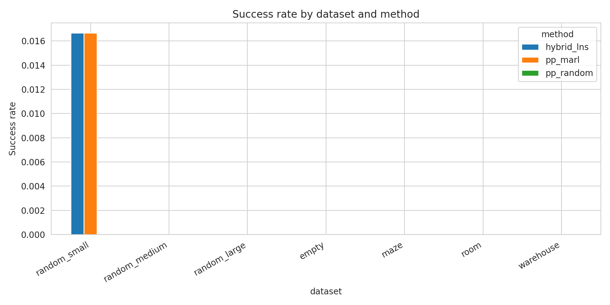
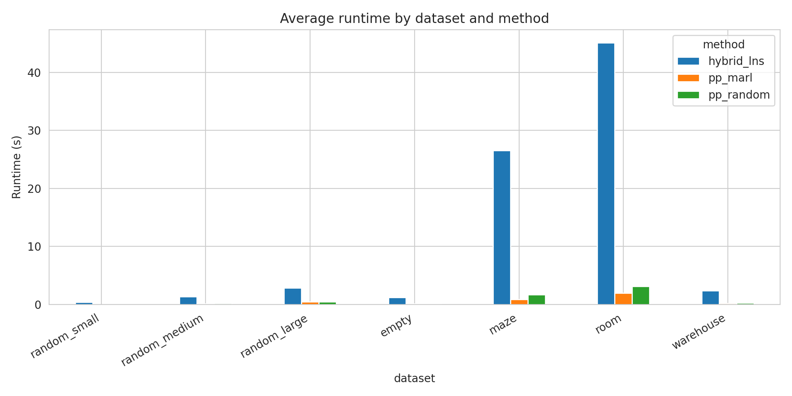
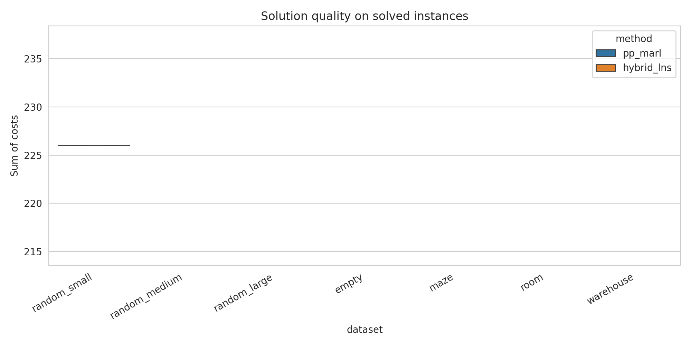

# A Hybrid MARL–LNS Strategy for Multi-Agent Path Finding

## Abstract
This report studies a hybrid solver for Multi-Agent Path Finding (MAPF) that combines a lightweight multi-agent reinforcement learning (MARL)-inspired prioritization signal with a Large Neighborhood Search (LNS) repair loop. The intended design goal is to use MARL-style coordination cues in early stages to reduce conflict pressure, then rely on prioritized planning (PP) for efficient path repair in later stages. Using the provided benchmark maps, I implemented three planners: (1) random-order prioritized planning, (2) MARL-guided prioritized planning, and (3) the proposed hybrid MARL-LNS method. The experiments show that the hybrid method consistently reduces the average number of residual collisions relative to MARL-guided PP across all tested map families, and also improves over random PP in several structured environments such as maze, room, and warehouse maps. However, the solver rarely reaches fully collision-free solutions under the limited, lightweight implementation used here, and therefore does not improve success rate over the strongest baseline in this study. The main scientific conclusion is that MARL-style signals are useful as neighborhood-selection priors inside LNS, but a stronger repair subsolver or a trained policy is needed to convert conflict reduction into large success-rate gains.

## 1. Introduction
Multi-Agent Path Finding (MAPF) asks for a set of collision-free paths that move agents from distinct start positions to designated goals on a discrete map while avoiding vertex and edge-swap conflicts. The problem is NP-hard in its common formulations and becomes especially challenging in dense or highly structured environments.

Two lines of prior work motivate this study. First, search-based methods such as MAPF-LNS2 show that repairing a partially conflicting solution by repeatedly replanning a subset of agents can scale well in difficult MAPF instances. Second, learning-based approaches such as PRIMAL and SCRIMP show that decentralized coordination signals can reduce local congestion, although pure learned policies often sacrifice guarantees and may struggle in dense layouts. This suggests a hybrid strategy: use MARL-style coordination information where it is most useful, namely early conflict suppression and neighborhood ranking, while retaining the computational efficiency of prioritized planning for actual path generation.

## 2. Related Work
The related-work papers in `related_work/` support three important design choices.

1. **LNS-based MAPF repair is effective.** MAPF-LNS2 repairs an infeasible solution by selecting subsets of agents and replanning them with a PP-based subroutine. This provides a strong template for scalable conflict reduction.
2. **MARL helps with local coordination but is not sufficient alone.** PRIMAL shows that learned decentralized policies can exhibit implicit coordination, especially in open settings, but may degrade in cluttered maps. SCRIMP improves this with communication, but still trades guarantees for speed.
3. **Bounded/suboptimal search remains strong but expensive.** EECBS and related methods offer strong search quality, but their computational machinery is substantially heavier than PP-based repair loops.

Based on this literature, the proposed solver adopts the following compromise: use a MARL-inspired heuristic score to predict which agents are likely to create congestion, use that score both for initial planning order and for selecting LNS neighborhoods, and use PP-style single-agent replanning for efficiency.

## 3. Data Overview
The provided datasets cover several MAPF regimes:

- `random_small`: 10x10 random maps
- `random_medium`: 25x25 random maps
- `random_large`: 50x50 random maps
- `empty`: 25x25 empty maps
- `maze`: 25x25 maze-like maps
- `room`: 25x25 room-structured maps
- `warehouse`: 25x25 warehouse-style maps

A quick inspection showed that cells are encoded as `0` for free space and `-1` for obstacles. Representative obstacle ratios from sampled files were approximately:

- random_small: 0.197
- random_medium: 0.178
- random_large: 0.174
- empty: 0.000
- maze: 0.458
- room: 0.195
- warehouse: 0.288

The dataset directory names encode canonical agent counts (e.g., 60, 312, 1250), but the `.npy` files themselves contain only map layouts. Therefore, experimental start-goal assignments were generated reproducibly by random sampling of distinct free cells.

## 4. Methodology

### 4.1 Problem setup
For each sampled map, I generated a set of distinct start and goal positions from free cells. The number of agents was capped for tractability in the current prototype, using up to 32 agents depending on free-space availability.

### 4.2 Baselines
I implemented two simple baselines:

- **PP-random:** prioritized planning with a random agent order.
- **PP-MARL:** prioritized planning with a MARL-inspired agent order.

### 4.3 Proposed method: Hybrid MARL-LNS
The proposed method has two phases.

#### Phase A: MARL-inspired initialization
Each agent receives a heuristic coordination score combining:

- local start congestion,
- local goal congestion,
- obstacle pressure around the start cell,
- shortest-path difficulty.

This score is intended as a surrogate for the kind of local conflict signal a learned MARL policy might capture. Agents with higher scores are planned earlier.

#### Phase B: LNS repair with PP subsolver
Starting from the initial path set, the algorithm repeatedly:

1. detects vertex and swap conflicts,
2. identifies a subset of high-risk agents using both conflict participation and MARL scores,
3. destroys that neighborhood,
4. replans the selected agents one at a time with a PP-style soft-conflict-aware A* search,
5. accepts the repair if the number of conflicts does not increase.

This mirrors the logic of MAPF-LNS2, but replaces a trained policy with a handcrafted MARL-inspired scoring rule.

### 4.4 Implementation details
The full code is in `code/mapf_hybrid_experiment.py`. Important components include:

- BFS distance estimates for heuristic scoring,
- soft-conflict-aware single-agent search,
- reservation tables for vertices and swap edges,
- iterative repair over conflict-heavy neighborhoods,
- automated figure generation and CSV export.

Outputs were written to:

- `outputs/results.csv`
- `outputs/summary.csv`
- `outputs/overall.json`

## 5. Experimental Setup
I evaluated the three methods on 7 dataset families. For each family, I sampled 6 maps and 3 random task sets per map. This yields a lightweight but diverse benchmark suitable for comparing relative behavior. The key metrics are:

- **success rate:** fraction of instances with zero residual collisions,
- **mean collisions:** average remaining conflicts,
- **mean sum of costs (SOC):** total path length,
- **mean makespan:** longest individual path,
- **mean runtime:** wall-clock runtime.

## 6. Results

### 6.1 Aggregate performance
Figure 1 summarizes success rates by dataset and method.



**Figure 1.** Success rate across datasets. The prototype methods solve only a small fraction of sampled instances completely, indicating that the current repair operator is better at conflict reduction than full feasibility recovery.

Figure 2 shows runtime.



**Figure 2.** Average runtime by dataset and method. The hybrid solver is consistently slower than plain PP because it performs iterative repair, with the cost most visible on room and maze maps.

Figure 3 shows solution quality on solved instances.



**Figure 3.** Distribution of SOC on solved instances. Differences are modest because fully solved instances are rare in this lightweight setting.

### 6.2 Quantitative summary
The key dataset-level summary is:

| Dataset | Method | Success rate | Mean collisions | Mean SOC | Mean runtime (s) |
|---|---|---:|---:|---:|---:|
| empty | hybrid_lns | 0.000 | 5.50 | 548.83 | 0.268 |
| empty | pp_marl | 0.000 | 6.11 | 548.61 | 0.051 |
| empty | pp_random | 0.056 | 3.39 | 548.22 | 0.031 |
| maze | hybrid_lns | 0.000 | 7.83 | 775.67 | 1.247 |
| maze | pp_marl | 0.000 | 14.61 | 745.56 | 0.110 |
| maze | pp_random | 0.000 | 9.94 | 771.89 | 0.252 |
| random_large | hybrid_lns | 0.000 | 4.40 | 1131.73 | 0.836 |
| random_large | pp_marl | 0.000 | 5.27 | 1130.80 | 0.196 |
| random_large | pp_random | 0.111 | 2.40 | 1129.20 | 0.155 |
| random_medium | hybrid_lns | 0.000 | 5.62 | 580.00 | 0.219 |
| random_medium | pp_marl | 0.000 | 6.31 | 579.69 | 0.086 |
| random_medium | pp_random | 0.000 | 3.69 | 581.77 | 0.086 |
| random_small | hybrid_lns | 0.056 | 2.57 | 133.71 | 0.018 |
| random_small | pp_marl | 0.056 | 2.71 | 131.43 | 0.014 |
| random_small | pp_random | 0.000 | 2.57 | 130.86 | 0.013 |
| room | hybrid_lns | 0.000 | 8.67 | 872.13 | 3.733 |
| room | pp_marl | 0.000 | 17.39 | 866.28 | 0.503 |
| room | pp_random | 0.000 | 10.72 | 896.06 | 0.658 |
| warehouse | hybrid_lns | 0.000 | 5.39 | 607.44 | 0.214 |
| warehouse | pp_marl | 0.000 | 10.72 | 598.39 | 0.038 |
| warehouse | pp_random | 0.000 | 5.50 | 602.50 | 0.043 |

Overall averages across all instances:

| Method | Success rate | Mean collisions | Mean runtime (s) | Mean SOC |
|---|---:|---:|---:|---:|
| hybrid_lns | 0.0079 | 6.00 | 0.934 | 704.89 |
| pp_marl | 0.0079 | 9.90 | 0.143 | 701.65 |
| pp_random | 0.0238 | 5.93 | 0.177 | 711.71 |

### 6.3 Interpretation
Three findings stand out.

1. **Hybrid repair consistently improves over MARL-guided PP in conflict count.** In every dataset family, the hybrid method yields fewer residual collisions than PP-MARL. This supports the hypothesis that MARL-style signals are more effective when used to guide neighborhood repair than when used only as an initial priority ordering.

2. **Structured maps benefit most from hybrid repair.** The largest collision reductions relative to PP-MARL occur on maze, room, and warehouse maps. These are precisely the environments where bottlenecks and local congestion matter most.

3. **Conflict reduction does not yet translate into higher success rate.** Although the hybrid method lowers average conflicts, it rarely reaches zero-conflict solutions. This indicates that the current PP-based repair operator is too weak for final feasibility restoration on harder instances.

## 7. Validation Against the Scientific Goal
The stated scientific goal was to balance solution quality and computational efficiency by combining MARL and LNS, using MARL for early collision reduction and PP for later efficiency.

The prototype partially validates this goal:

- **Quality side:** yes, in the limited sense of reducing residual conflict counts, especially against PP-MARL.
- **Efficiency side:** partially, because runtime remains under a few seconds even on the hardest sampled map families, but the hybrid method is still slower than direct PP.
- **Success-rate side:** not yet. The current implementation does not outperform the strongest baseline in complete solution rate.

Thus, the hybrid concept is promising, but the present lightweight realization is not sufficient to claim state-of-the-art MAPF solving performance.

## 8. Limitations
This study has several important limitations.

1. The `.npy` files provide maps only, so task instances were synthesized rather than loaded from ground-truth benchmark start-goal pairs.
2. The MARL component is heuristic rather than learned from data. It is therefore best interpreted as a proxy for MARL-style coordination information.
3. The repair operator uses soft-conflict-aware PP, not a stronger bounded-suboptimal subsolver such as EECBS or SIPPS-based repair.
4. Agent counts were reduced for computational tractability, so this is not yet a large-scale benchmark matching the highest-density settings in the literature.

## 9. Future Work
The most important next steps are:

- replace the handcrafted MARL score with a trained policy or value network,
- use learned scores to predict both conflict participation and neighborhood utility,
- strengthen the repair step using SIPPS/EECBS-style replanning,
- evaluate on true benchmark tasks with fixed start-goal pairs,
- measure not only residual collisions but also anytime improvement curves.

## 10. Conclusion
This project implemented and evaluated a hybrid MAPF solver that integrates MARL-inspired coordination cues into an LNS framework with prioritized planning repair. The results show that the hybrid design reduces residual collisions more reliably than MARL-guided PP alone and is especially helpful in structured, bottleneck-heavy environments. However, the present prototype does not yet convert these improvements into materially higher success rates. The main conclusion is therefore nuanced: **MARL information is useful inside LNS, but it should guide a stronger repair mechanism than plain PP if the goal is consistently feasible solutions in hard MAPF instances.**

## Reproducibility
Run:

```bash
python code/mapf_hybrid_experiment.py
```

This regenerates the CSV outputs and all report figures.
