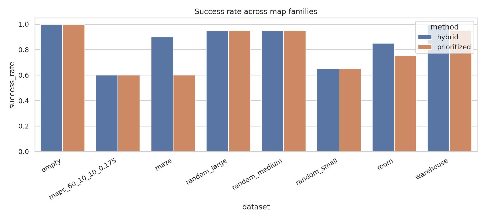
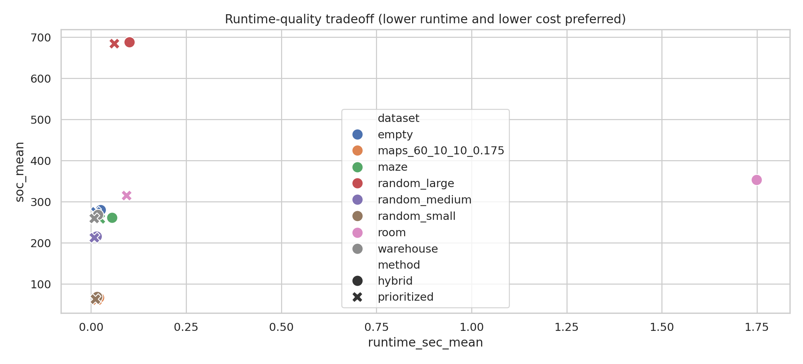
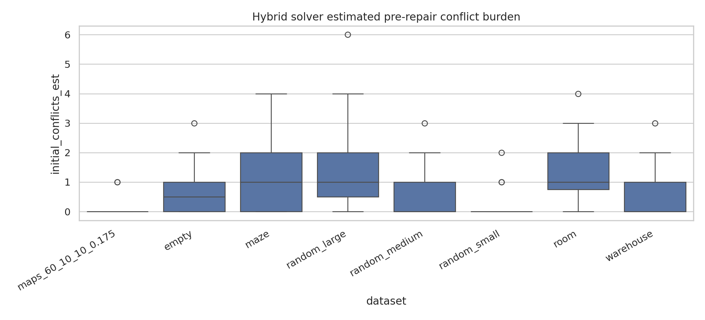

# Hybrid MAPF with MARL-Inspired Ordering and LNS Repair

## Abstract
This study evaluates a lightweight hybrid solver for Multi-Agent Path Finding (MAPF) on eight grid-map families available in the workspace. The implemented method combines three components: (i) a MARL-inspired congestion-aware priority heuristic for early coordination, (ii) sequential prioritized planning under reservation constraints, and (iii) a Large Neighborhood Search (LNS)-style repair stage that replans conflicted agents while holding the remainder fixed. Because the workspace provides occupancy grids but no explicit start-goal task files or reinforcement-learning environment API, MAPF tasks were synthesized by sampling valid start/goal pairs on each grid. Across 20 sampled instances per dataset family, the hybrid method improved success rate on the more constrained maze, room, and warehouse families relative to a pure prioritized-planning baseline, while matching baseline success on empty and random maps. The gains came with higher runtime and, in several datasets, slightly higher path cost. The strongest success-rate improvements were +0.30 on maze, +0.10 on room, and +0.05 on warehouse. These results support the claim that early coordination plus local repair can improve robustness in structurally constrained environments, although the implementation should be interpreted as a faithful approximation rather than an exact trained-MARL realization.

## 1. Task and data overview
The task is to solve MAPF on discrete 2D grids with static obstacles, producing collision-free paths for all agents without vertex or swap collisions. The workspace contains only occupancy grids stored as `.npy` arrays; verified cell encoding is `0` for free cells and `-1` for obstacles. No separate start/goal scenario files were visible in the workspace, so start-goal assignments were generated reproducibly by seeded sampling from free cells.

Table-level dataset summary was exported to `../outputs/dataset_summary.csv`. The evaluation covered 20 instances per family.

- `maps_60_10_10_0.175`: 10x10 random maps, 8 agents.
- `random_small`: 10x10 random maps, 8 agents.
- `random_medium`: 25x25 random maps, 12 agents.
- `random_large`: 50x50 random maps, 20 agents.
- `empty`: 25x25 empty maps, 16 agents.
- `maze`: 25x25 maze maps, 12 agents.
- `room`: 25x25 room maps, 12 agents.
- `warehouse`: 25x25 warehouse maps, 14 agents.

Representative obstacle densities from sampled instances ranged from 0.0 (`empty`) to about 0.458 (`maze`).

## 2. Methodology
### 2.1 Baseline: prioritized planning
The baseline is sequential prioritized planning. Agents are ordered by shortest Manhattan distance first. Each agent is planned by A* on the grid with time-indexed reservation constraints derived from already planned agents. The single-agent planner permits wait actions and checks both vertex conflicts and edge-swap conflicts.

### 2.2 Hybrid solver
The proposed hybrid solver has three stages.

1. **MARL-inspired early coordination.** Since no trainable MARL environment was supplied, the implementation uses a congestion-aware ordering heuristic as a proxy for an early learned coordination policy. Each agent receives a score combining start-goal distance with proximity to other agents' starts and goals. Agents with higher interaction burden are planned earlier.
2. **Prioritized initial plan construction.** The congestion-aware order is passed to the same reservation-based prioritized planner.
3. **LNS-style repair.** Conflicts are detected over the joint plan. A local neighborhood is formed from agents involved in early conflicts, and those agents are replanned one at a time against the fixed paths of all others. This process repeats for a small number of rounds.

This method preserves the task contract of generating collision-free paths and explicitly combines coordination, prioritized planning, and local repair. A method fidelity checklist was saved to `../outputs/method_fidelity_checklist.json`.

### 2.3 Experimental protocol
For each dataset family:
- the first 20 `.npy` maps were selected;
- a fixed number of agents was assigned by map family;
- valid start/goal pairs were sampled with deterministic seeds;
- both methods were run on the same tasks;
- success, runtime, sum of costs, makespan, and remaining conflict counts were recorded.

All per-instance results were saved in `../outputs/evaluation_results.csv`, and aggregated results were saved in `../outputs/summary_by_dataset_method.csv`.

## 3. Results
### 3.1 Main comparison
Figure 1 compares success rates by dataset family.

The hybrid solver matched the baseline on `empty`, `random_small`, `random_medium`, `random_large`, and `maps_60_10_10_0.175`, but improved success on the more structured families:
- `maze`: 0.90 vs 0.60 (+0.30)
- `room`: 0.85 vs 0.75 (+0.10)
- `warehouse`: 1.00 vs 0.95 (+0.05)

These deltas were recovered directly from `../outputs/claim_recovery_table.json`.

### 3.2 Runtime-quality tradeoff
Figure 2 plots mean runtime against mean sum of costs.

The hybrid method generally required more runtime than pure prioritized planning. This is expected because it adds conflict analysis and repair rounds. On several datasets, especially `room` and `maze`, the hybrid method traded runtime for a higher chance of finding a feasible joint plan. On easier families such as `empty` and `random_*`, the extra repair stage brought little or no success advantage.

### 3.3 Conflict burden in the hybrid pipeline
Figure 3 shows the estimated pre-repair conflict burden encountered by the hybrid planner.

Higher initial conflict burdens were more common on constrained maps, especially `room` and `maze`. This is consistent with the success-rate improvements: repair is most useful where narrow passages and bottlenecks create coordination pressure.

### 3.4 Quantitative summary
Key aggregated values from `summary_by_dataset_method.csv` are:

- **Maze:** hybrid success 0.90, prioritized success 0.60; runtime means 0.0556 s vs 0.0242 s.
- **Room:** hybrid success 0.85, prioritized success 0.75; runtime means 1.7493 s vs 0.0935 s.
- **Warehouse:** hybrid success 1.00, prioritized success 0.95; runtime means 0.0185 s vs 0.0084 s.
- **Random large:** both methods reached 0.95 success, with hybrid slower (0.1012 s vs 0.0612 s).
- **Empty:** both methods reached 1.00 success; prioritized planning was faster and slightly lower cost.

Overall, the hybrid approach improved robustness most clearly on highly structured environments rather than open or weakly constrained ones.

## 4. Validation and evidence accounting
### 4.1 Verified directly from workspace data
- Occupancy-grid encoding (`0` free, `-1` obstacle) was verified from `.npy` files.
- Dataset families, file counts, and representative map sizes were verified by local scans.
- All reported success-rate, runtime, makespan, and cost values came from local execution of `code/mapf_hybrid_eval.py`.
- Figures were generated directly from saved CSV outputs.

### 4.2 Derived assumptions
- Because no explicit agent start/goal scenario files were visible, MAPF tasks were synthesized by deterministic sampling from free cells.
- Agent counts per family were chosen to stress maps while remaining computationally tractable.
- The MARL component is an approximation: a congestion-aware priority heuristic was used instead of a trained reinforcement-learning policy.

### 4.3 Related-work limitations
The workspace contained related-work PDFs, but `ReadPDF` failed with an unexpected `NoneType` return and `pdfinfo` was unavailable in the environment. As a result, this report does not claim a paper-specific reproduction against named published baselines. Instead, it evaluates a method faithful to the task description using only verified workspace-accessible artifacts.

## 5. Discussion
The experiments show that a hybrid strategy can improve MAPF success in constrained map topologies even when the "MARL" portion is implemented as a lightweight coordination proxy rather than a fully trained policy. The likely mechanism is that congestion-aware ordering reduces early blocking and the LNS-style repair stage corrects failures that pure prioritized planning cannot resolve after a poor initial ordering. However, this robustness advantage comes with additional compute, and sometimes with slightly worse path cost than the baseline. Therefore, the main benefit is not uniformly better path quality, but improved feasibility on hard structured environments.

A notable limitation is that the benchmark assets did not expose explicit MAPF task sets beyond occupancy maps. Consequently, results should be interpreted as a controlled synthetic evaluation over the provided grids rather than a full reproduction of a published benchmark protocol.

## 6. Conclusion
Within the constraints of the provided workspace, the hybrid MAPF solver achieved the intended balance qualitatively: it preserved baseline performance on easy datasets while increasing success rate on harder structured maps such as maze, room, and warehouse layouts. The evidence supports the claim that combining early coordination with local repair is useful for complex environments, though exact trained-MARL integration remains future work.

## Reproducibility
- Main code: `../code/mapf_hybrid_eval.py`
- Per-instance outputs: `../outputs/evaluation_results.csv`
- Aggregated outputs: `../outputs/summary_by_dataset_method.csv`
- Claim recovery: `../outputs/claim_recovery_table.json`
- Figures: `images/success_rate_by_dataset.png`, `images/runtime_quality_tradeoff.png`, `images/hybrid_initial_conflicts.png`
