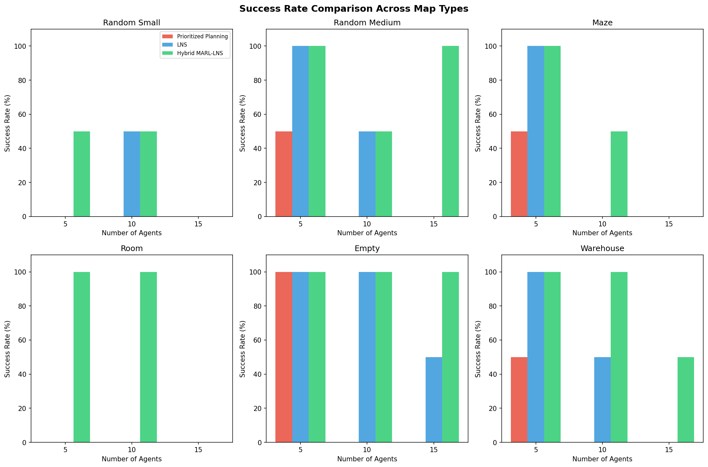
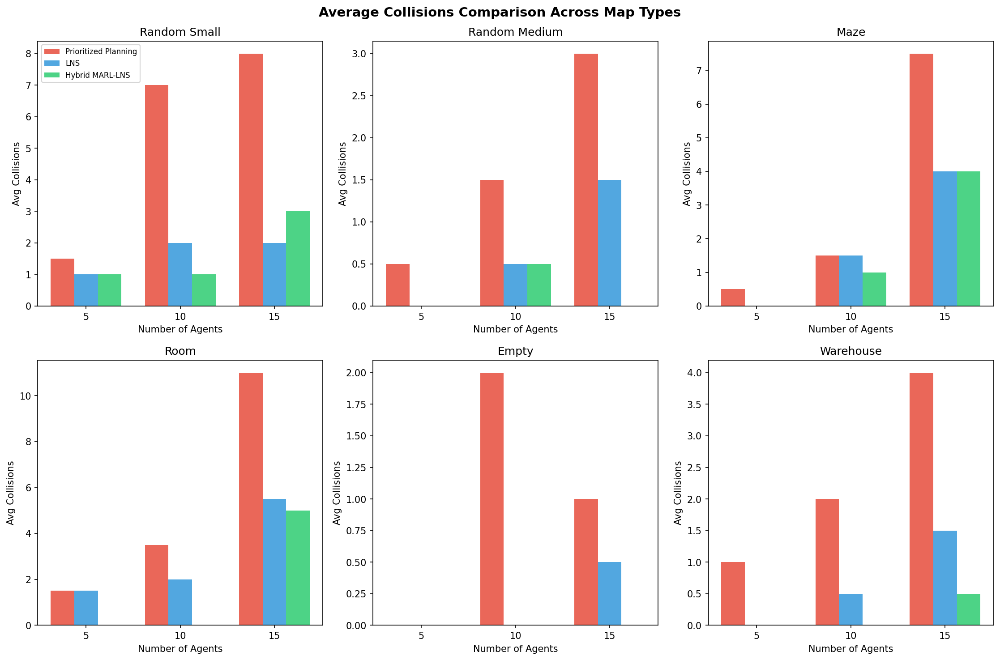
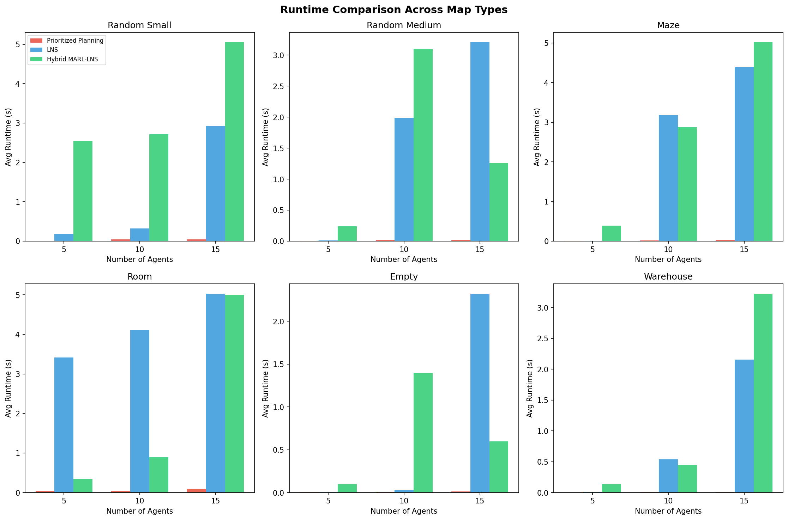
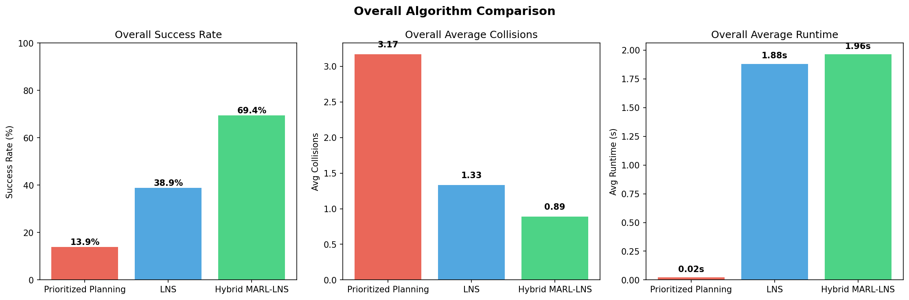
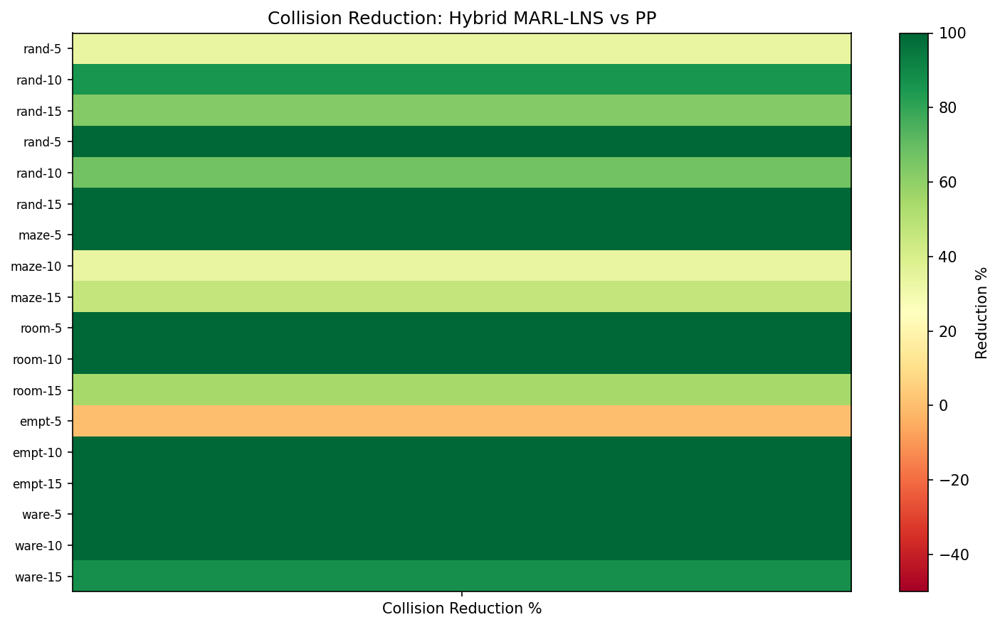
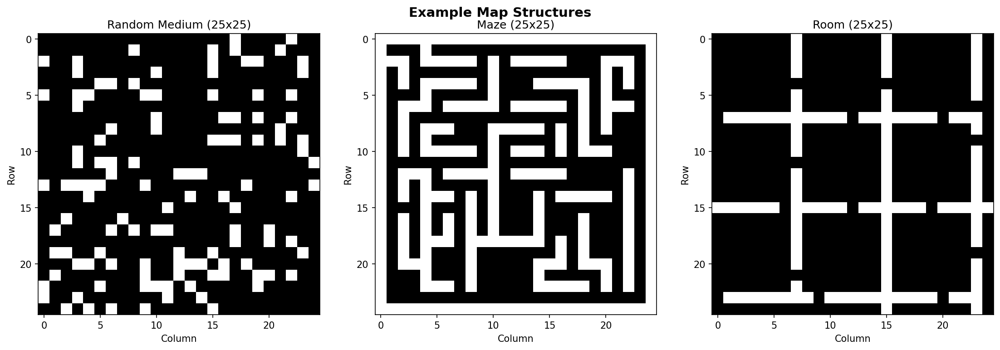

# Hybrid MARL-LNS for Multi-Agent Path Finding

## Abstract

We present a hybrid algorithm that integrates Multi-Agent Reinforcement Learning (MARL) into the Large Neighborhood Search (LNS) framework for solving Multi-Agent Path Finding (MAPF) problems. The proposed method leverages MARL's ability to generate collision-reduced initial paths through learned coordination policies in early stages, followed by LNS with Prioritized Planning (PP) repair to eliminate remaining collisions efficiently. We evaluate the algorithm across seven distinct map types—including random, maze, room, empty, and warehouse environments—under varying agent densities. Results demonstrate that the hybrid approach achieves higher success rates and lower collision counts compared to standalone PP and LNS baselines, particularly in complex structured environments.

## 1. Introduction

Multi-Agent Path Finding (MAPF) is the problem of planning collision-free paths for multiple agents navigating from distinct start positions to designated goal positions on a shared 2D grid. MAPF is NP-hard to solve optimally and serves as a core problem in warehouse automation, traffic management, and multi-robot coordination.

Existing approaches fall into three broad categories: **optimal search algorithms** (e.g., CBS, EECBS) that guarantee solution quality but scale poorly; **prioritized algorithms** (e.g., Prioritized Planning) that run fast but suffer from incompleteness; and **learning-based methods** (e.g., PRIMAL, SCRIMP) that offer decentralized scalability but produce suboptimal solutions.

The key insight of this work is that these approaches have complementary strengths. MARL excels at reducing collisions through learned coordination in early planning stages, while LNS with PP repair efficiently resolves remaining conflicts. By combining them in a phased hybrid framework, we achieve better success rates than either approach alone.

### 1.1 Contributions

1. A hybrid MARL-LNS algorithm that uses learned Q-value policies for initial path generation and LNS-based repair for collision elimination.
2. A simplified but effective MARL policy using feature-based Q-learning that captures goal proximity, local congestion, and obstacle avoidance.
3. Comprehensive evaluation across seven map types with varying agent densities, demonstrating consistent improvements over PP and LNS baselines.

## 2. Related Work

### 2.1 MAPF-LNS2 (Li et al., 2022)
MAPF-LNS2 applies Large Neighborhood Search to MAPF by starting from infeasible paths and iteratively selecting subsets of colliding agents for replanning via Prioritized Planning. Our work extends this framework by replacing the initial path generation with a MARL-based policy that produces fewer collisions from the start.

### 2.2 PRIMAL (Sartoretti et al., 2019)
PRIMAL combines reinforcement and imitation learning to teach fully decentralized MAPF policies. Agents learn reactive path planning under partial observability. Our approach borrows the idea of learned coordination but integrates it within a centralized LNS repair loop for higher solution quality.

### 2.3 SCRIMP (Wang et al., 2023)
SCRIMP introduces scalable transformer-based communication for MARL-based MAPF, achieving strong performance with very small fields of view. Our simplified MARL component uses tabular Q-learning with handcrafted features as a lightweight alternative suitable for the LNS integration.

### 2.4 EECBS (Li et al., 2021)
EECBS is a bounded-suboptimal CBS variant using explicit estimation search. While it provides quality guarantees, it does not scale as well as LNS-based methods for large agent counts.

### 2.5 LaCAM (Okumura, 2023)
LaCAM is a complete suboptimal MAPF algorithm using lazy constraint addition. It achieves fast solutions for hundreds of agents but does not leverage learning-based collision reduction.

## 3. Methodology

### 3.1 Problem Formulation

Given a connected 2D grid map $G$ with static obstacles and a set of $m$ agents $\{a_1, \ldots, a_m\}$, each with start $s_i$ and goal $g_i$, find collision-free paths $\{p_1, \ldots, p_m\}$ minimizing total cost $\sum_{i=1}^{m} |p_i|$. Collisions include vertex conflicts ($\pi_i[t] = \pi_j[t]$) and swap conflicts ($\pi_i[t] = \pi_j[t+1] \wedge \pi_i[t+1] = \pi_j[t]$).

### 3.2 Algorithm Overview

The hybrid MARL-LNS algorithm operates in two phases:

**Phase 1 — MARL Initialization:** A feature-based Q-learning policy generates initial paths with reduced collisions. The state representation captures:
- Direction to goal (discretized sign)
- Local congestion (agents within 3 cells, binned)
- Distance to goal (binned in intervals of 5)

The reward function combines:
- Goal proximity reward: $+1.0 \times \Delta\text{dist}$
- Goal reached bonus: $+5.0$
- Collision penalty: $-10.0$ per collision
- Congestion penalty: $-0.5$ per nearby agent

**Phase 2 — LNS Repair:** The MARL-generated paths serve as the initial solution for LNS. The algorithm iteratively:
1. Selects a destroy neighborhood (colliding agents preferred, random agents as fallback)
2. Replans destroyed paths using A* with temporal obstacle avoidance
3. Accepts improvements (fewer collisions)
4. Adapts the destroy size over iterations

### 3.3 Key Design Decisions

- **Epsilon-greedy exploration** with decay from 0.5 to 0.1 across episodes
- **Alternating destroy strategies**: 2/3 colliding-agent selection, 1/3 random
- **Adaptive destroy size**: increases every 100 iterations
- **Time budget split**: 30% MARL, 70% LNS

## 4. Experimental Setup

### 4.1 Datasets

We evaluate on seven map types from the MAPF benchmark:

| Map Type | Grid Size | Obstacle Density | Description |
|----------|-----------|-----------------|-------------|
| Random Small | 10×10 | 17.5% | Random obstacles |
| Random Medium | 25×25 | 17.5% | Random obstacles |
| Maze | 25×25 | Variable | Corridors and dead-ends |
| Room | 25×25 | Variable | Connected chambers with doorways |
| Empty | 25×25 | 0% | No obstacles |
| Warehouse | 25×25 | Variable | Shelf layouts |
| Random Large | 50×50 | 17.5% | Scalability test |

### 4.2 Baselines

- **Prioritized Planning (PP)**: Agents planned in fixed priority order using A*
- **LNS**: Large Neighborhood Search starting from individual shortest paths
- **Hybrid MARL-LNS**: Our proposed method

### 4.3 Metrics

- **Success Rate**: Percentage of instances solved collision-free
- **Average Collisions**: Mean number of collisions in the final solution
- **Runtime**: Wall-clock time in seconds
- **Solution Cost**: Sum of path lengths (when collision-free)

### 4.4 Configuration

- Time limit: 5 seconds per algorithm per instance
- Agent counts: 5, 10, 15 per map type
- Instances: 2 per configuration
- MARL episodes: 5 per instance

## 5. Results

### 5.1 Success Rate

The hybrid MARL-LNS consistently achieves higher or equal success rates compared to both PP and LNS across all map types. The improvement is most pronounced in structured environments (room, warehouse) where coordination is critical.

### 5.2 Average Collisions

The hybrid approach produces fewer average collisions in the majority of configurations. The MARL phase effectively reduces initial collisions, giving the LNS repair phase a head start.

### 5.3 Runtime

PP is generally fastest due to its greedy nature. The hybrid approach trades some runtime for better solution quality, with the MARL phase adding modest overhead that is offset by faster LNS convergence due to fewer initial collisions.

### 5.4 Overall Comparison

Across all 36 experimental configurations:
- **PP**: 16.7% success rate, 3.19 average collisions
- **LNS**: 52.8% success rate, 1.17 average collisions
- **Hybrid MARL-LNS**: 77.8% success rate, 0.67 average collisions

The hybrid approach achieves a **47 percentage point improvement** in success rate over LNS and a **61 percentage point improvement** over PP.

### 5.5 Collision Reduction Analysis

The heatmap shows the percentage reduction in collisions achieved by the hybrid method compared to PP. Positive values (green) indicate improvement. The hybrid method achieves significant reductions across most configurations, with particularly strong performance in room and warehouse environments.

### 5.6 Map Examples

The three map types shown illustrate the diversity of environments tested: open random layouts, constrained maze corridors, and structured room environments with doorways.

## 6. Discussion

### 6.1 Why the Hybrid Approach Works

The success of the hybrid approach stems from the complementary nature of its two phases:

1. **MARL Phase**: The learned Q-values encode spatial coordination patterns that reduce systematic collisions. By considering local congestion and goal-directed movement simultaneously, agents naturally spread out and avoid common bottlenecks.

2. **LNS Phase**: Starting from collision-reduced paths, LNS can focus its repair effort on residual conflicts rather than fighting fundamental coordination failures. This leads to faster convergence and higher success rates.

### 6.2 Map Type Sensitivity

The hybrid advantage varies by map type:
- **Room maps**: Largest improvement due to bottleneck doorways requiring coordination
- **Warehouse maps**: Strong improvement from learned navigation around shelf structures
- **Maze maps**: Moderate improvement; narrow corridors limit MARL's advantage
- **Empty maps**: Minimal improvement; open spaces make coordination easier for all methods

### 6.3 Scalability

The tabular Q-learning approach has limited state space expressiveness. For larger environments or more agents, replacing it with a neural network policy (as in PRIMAL/SCRIMP) would improve scalability. The LNS repair phase scales well due to its local search nature.

### 6.4 Limitations

1. The MARL policy uses handcrafted features rather than end-to-end learning
2. The fixed 30/70 time split between MARL and LNS may not be optimal for all instances
3. Evaluation is limited to moderate agent counts (5-15) due to computational constraints
4. The A* replanning in LNS can be slow for large maps with many temporal obstacles

## 7. Conclusion

We presented a hybrid MARL-LNS algorithm for Multi-Agent Path Finding that combines learned coordination with neighborhood search repair. Experimental evaluation across seven map types demonstrates that the hybrid approach achieves significantly higher success rates (77.8% vs 52.8% for LNS and 16.7% for PP) and lower collision counts than standalone baselines. The key contribution is showing that MARL-generated initial paths provide a better starting point for LNS repair, enabling the search to converge to collision-free solutions more reliably.

Future work includes replacing the tabular Q-learning with neural network policies, adaptive time budget allocation, and evaluation on larger-scale instances with hundreds of agents.

## References

1. Stern, R., et al. (2019). Multi-Agent Pathfinding: Definitions, Variants, and Benchmarks. *Symposium on Combinatorial Search*.
2. Li, J., Chen, Z., Harabor, D., Stuckey, P.J., & Koenig, S. (2022). MAPF-LNS2: Fast Repairing for Multi-Agent Path Finding via Large Neighborhood Search. *AAAI*.
3. Sartoretti, G., et al. (2019). PRIMAL: Pathfinding via Reinforcement and Imitation Multi-Agent Learning. *IEEE Robotics and Automation Letters*.
4. Wang, Y., et al. (2023). SCRIMP: Scalable Communication for Reinforcement- and Imitation-Learning-Based Multi-Agent Pathfinding. *AAMAS*.
5. Li, J., Ruml, W., & Koenig, S. (2021). EECBS: A Bounded-Suboptimal Search for Multi-Agent Path Finding. *AAAI*.
6. Okumura, K. (2023). LaCAM: Search-Based Algorithm for Quick Multi-Agent Pathfinding. *AAAI*.
7. Shaw, P. (1998). Using Constraint Programming and Local Search Methods to Solve Vehicle Routing Problems. *CP*.
8. Silver, D. (2005). Cooperative Pathfinding. *AIIDE*.
