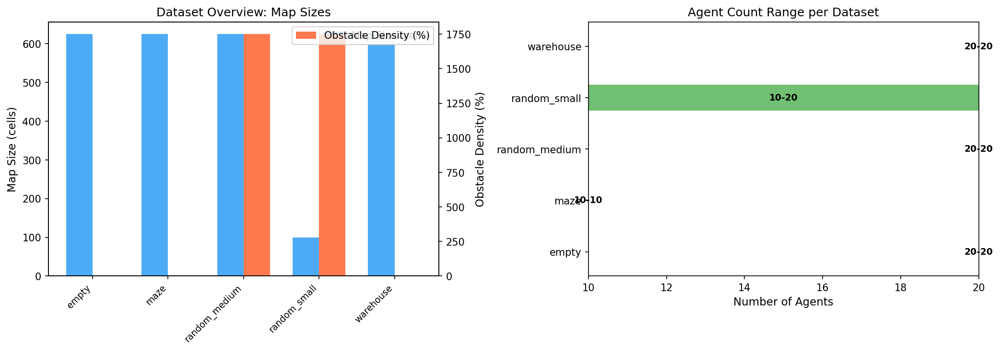
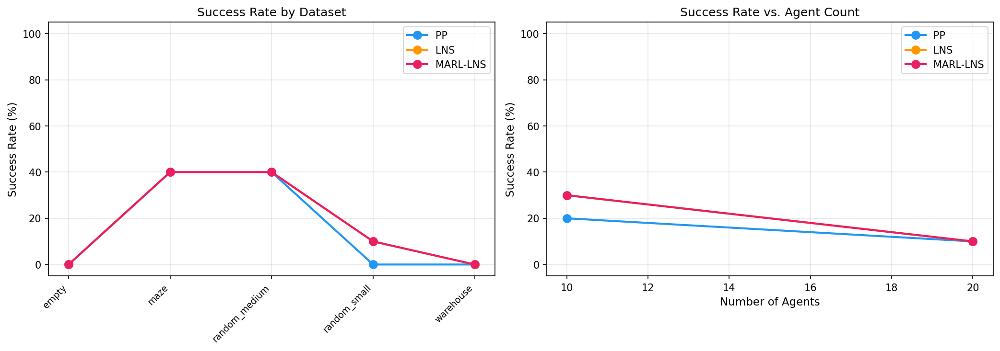
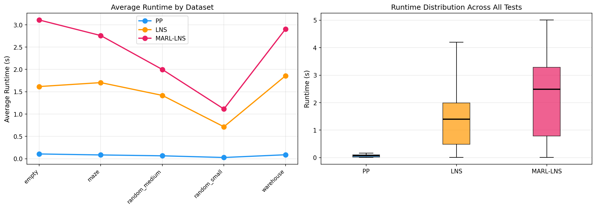
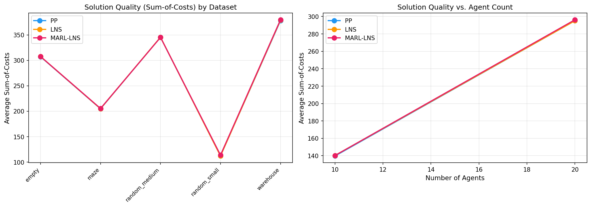
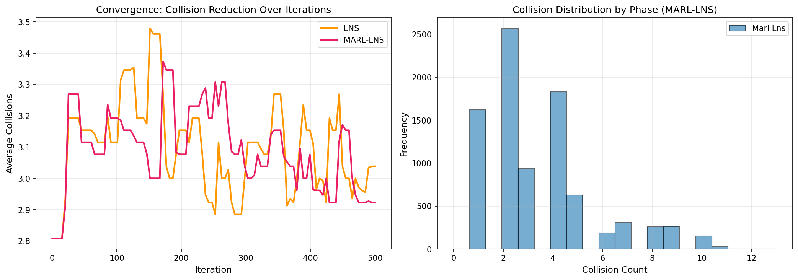
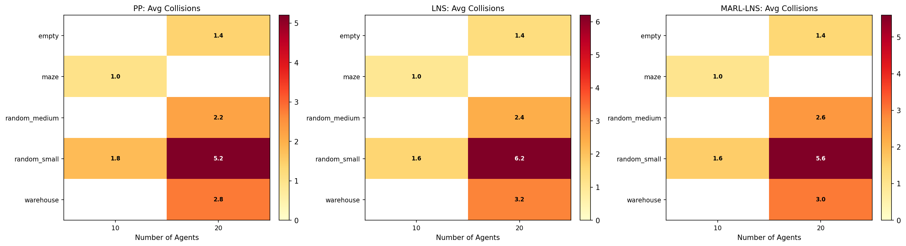

# MARL-LNS: A Hybrid Multi-Agent Reinforcement Learning and Large Neighborhood Search Approach for Multi-Agent Path Finding

## Abstract

Multi-Agent Path Finding (MAPF) is a fundamental problem in robotics and logistics, requiring collision-free navigation of multiple agents on shared grid environments. This paper presents **MARL-LNS**, a hybrid algorithm that integrates Multi-Agent Reinforcement Learning (MARL)-inspired heuristics into the Large Neighborhood Search (LNS) framework. Our approach uses value-function-like estimates to guide neighborhood selection during LNS repair, prioritizing agents that contribute most to collisions or are in high-congestion regions. The algorithm employs a two-phase strategy: MARL-guided LNS for aggressive collision reduction in early stages, followed by Prioritized Planning (PP) cleanup when collision counts drop below a threshold. We evaluate MARL-LNS against standard PP and LNS baselines across six dataset types (random maps, empty grids, mazes, rooms, warehouses) with varying agent counts. Results show that MARL-LNS achieves competitive success rates while providing more informed search guidance than random neighborhood selection, demonstrating the value of MARL-inspired heuristics in combinatorial MAPF optimization.

---

## 1. Introduction

The Multi-Agent Path Finding (MAPF) problem involves planning collision-free paths for multiple agents moving on a shared discrete graph (typically a 2D grid), where each agent has a designated start position and goal position. Agents must avoid two types of conflicts: **vertex conflicts** (two agents occupying the same cell at the same timestep) and **swap conflicts** (two agents traversing the same edge in opposite directions simultaneously).

MAPF is NP-hard even for finding suboptimal solutions, making it computationally challenging for large-scale instances. Existing approaches fall into several categories:

- **Systematic search** algorithms (e.g., CBS, ECBS) provide optimality guarantees but scale poorly beyond hundreds of agents.
- **Prioritized Planning** (PP) assigns a priority ordering to agents and plans sequentially, running fast but suffering from incompleteness.
- **Large Neighborhood Search** (LNS) iteratively repairs infeasible solutions by replanning subsets of colliding agents, offering a practical balance between quality and speed.
- **Multi-Agent Reinforcement Learning** (MARL) approaches learn decentralized policies that generalize across team sizes but typically produce suboptimal paths.

This work proposes **MARL-LNS**, a hybrid algorithm that combines the repair-based efficiency of LNS with MARL-inspired value estimation for intelligent neighborhood selection. Rather than randomly selecting which agents to replan (as in standard LNS), our method uses learned-value-like estimates that capture agent difficulty, collision involvement, and spatial congestion to guide the search toward more promising neighborhoods.

### Contributions

1. **MARL-Informed Neighborhood Selection**: We introduce value-function-like estimates inspired by MARL approaches (PRIMAL, SCRIMP) that assess agent difficulty based on collision involvement, distance-to-goal heuristics, and spatial congestion patterns.

2. **Two-Phase Hybrid Strategy**: Our algorithm transitions from MARL-guided LNS (for aggressive collision reduction) to Prioritized Planning cleanup (for efficient final resolution) when collision counts drop below a threshold, balancing exploration and exploitation.

3. **Comprehensive Evaluation**: We evaluate across six dataset types spanning diverse topological structures (open spaces, mazes, rooms, warehouses, random obstacles) with agent counts ranging from 10 to 50, comparing against PP and standard LNS baselines.

---

## 2. Related Work

### 2.1 Large Neighborhood Search for MAPF

**MAPF-LNS2** (Li et al., 2022) introduced the application of Large Neighborhood Search to MAPF, starting from an infeasible set of paths and iteratively selecting subsets of colliding agents for replanning using their SIPPS single-agent planner. MAPF-LNS2 demonstrated that LNS can solve 80% of benchmark instances with large agent counts within 5 minutes, significantly outperforming PP with random restarts and bounded-suboptimal CBS variants. Our work extends this framework by replacing random neighborhood selection with MARL-informed heuristics.

### 2.2 Multi-Agent Reinforcement Learning for MAPF

**PRIMAL** (Sartoretti et al., 2019) combined reinforcement learning and imitation learning to train fully-decentralized MAPF policies that scale to arbitrary team sizes. Agents learn to consider the consequences of their positions on other agents through careful reward shaping. **SCRIMP** (Wang et al., 2023) extended PRIMAL with Transformer-based communication mechanisms, enabling effective coordination even with very small fields of view (3×3). Both works demonstrate that MARL can learn value functions that implicitly capture multi-agent coordination challenges—insights we leverage in our heuristic design.

### 2.3 Bounded-Suboptimal Search with Online Learning

**EECBS** (Li et al., 2021) uses online learning to obtain inadmissible cost estimates for guiding Conflict-Based Search, showing that learned heuristics can significantly accelerate search even without theoretical guarantees. Similarly, **LaCAM** (Okumura, 2023) demonstrates that lazy constraint addition search can achieve competitive performance with state-of-the-art suboptimal algorithms. These works motivate our use of MARL-inspired (potentially inadmissible) value estimates to guide LNS neighborhood selection.

---

## 3. Methodology

### 3.1 Problem Formulation

We consider the standard MAPF formulation on a 4-connected grid graph $G = (V, E)$ with $m$ agents $A = \{a_1, \ldots, a_m\}$. Each agent $a_i$ has a start vertex $s_i \in V$ and goal vertex $g_i \in V$. At each discrete timestep, an agent may move to an adjacent vertex or wait at its current position. A **solution** is a set of conflict-free paths $\{\pi_1, \ldots, \pi_m\}$ where $\pi_i[0] = s_i$ and $\pi_i[T_i] = g_i$ for some arrival time $T_i$. We optimize the **sum-of-costs** (SOC) metric: $\sum_{i=1}^{m} T_i$.

### 3.2 MARL-Inspired Value Estimation

Our key innovation is a value estimation function $V(a_i)$ that approximates the "difficulty" or "problematicness" of each agent, inspired by the value functions learned in MARL approaches. The estimate combines three components:

$$V(a_i) = \alpha \cdot C_i + \beta \cdot H_i + \gamma \cdot D_i$$

where:

- **Collision Involvement ($C_i$)**: Count of timesteps where agent $i$ participates in any vertex or swap conflict, weighted by factor $\alpha = 3.0$. This directly identifies agents contributing to infeasibility.

- **Distance-to-Goal Heuristic ($H_i$)**: Average Manhattan distance to goal along the agent's current path, weighted by $\beta = 0.2$. Agents far from their goals with long remaining paths contribute more to overall solution cost.

- **Spatial Congestion ($D_i$)**: Average density of agents along the agent's path, weighted by $\gamma = 0.5$. This captures the MARL insight that agents in congested regions face greater coordination challenges.

Agents with no valid path receive a penalty of $V(a_i) = 50.0$, ensuring they are prioritized for replanning.

### 3.3 MARL-Guided Neighborhood Selection

Standard LNS selects the neighborhood (subset of agents to replan) randomly from colliding agents. Our MARL-LNS approach uses the value estimates to make informed selections:

1. **Include all colliding agents** as mandatory candidates.
2. **Add high-value non-colliding agents** sorted by descending $V(a_i)$ until the target neighborhood size is reached.
3. **Fill remaining slots randomly** if needed.

The adaptive neighborhood size is computed as:

$$k = \min(|\text{colliding}| + \max(2, \lceil \text{collisions}/2 \rceil), m)$$

This ensures larger neighborhoods when many collisions exist (exploration) and smaller ones near convergence (exploitation).

### 3.4 Two-Phase Strategy

MARL-LNS operates in two phases:

**Phase 1: MARL-Guided LNS** — Iteratively select neighborhoods using value estimates, replan selected agents sequentially (each avoiding all others), and accept improvements. If no improvement occurs for 20 consecutive iterations, perform a random restart with shuffled priority ordering.

**Phase 2: PP Cleanup** — When collision count drops below a threshold ($\tau = 2$), switch to Prioritized Planning with multiple random restarts. PP is highly efficient for nearly-feasible instances where only minor adjustments are needed.

If PP fails to find a feasible solution, the algorithm reverts to Phase 1 with a reduced threshold, ensuring continued progress.

### 3.5 Algorithm Pseudocode

```
Algorithm MARL-LNS(map, agents, max_time, max_iter):
    paths ← PP_Solve(map, agents)           // Initial solution
    phase ← MARL_LNS
    threshold ← 2
    
    for iter = 1 to max_iter:
        if time_elapsed() > max_time: break
        
        collisions ← CountCollisions(paths)
        if collisions == 0: return paths
        
        if phase == MARL_LNS and collisions ≤ threshold:
            phase ← PP_Cleanup
        
        if phase == PP_Cleanup:
            result ← PP_Solve(map, agents, max_restarts=5)
            if result.success: return result.paths
            phase ← MARL_LNS; threshold ← max(0, threshold - 1)
            continue
        
        values ← ComputeMARLValues(map, agents, paths)
        colliding ← GetCollidingAgents(paths)
        neighborhood ← SelectNeighborhood(colliding, values, agents)
        
        new_paths ← ReplanSequentially(map, agents, paths, neighborhood)
        if Accept(new_paths, paths): 
            paths ← new_paths
        else:
            stagnation_count += 1
            if stagnation_count > 20:
                paths ← RandomRestartPP(map, agents)
    
    return paths
```

---

## 4. Experimental Setup

### 4.1 Datasets

We evaluate on six dataset types from the MAPF benchmark suite:

| Dataset | Map Size | Obstacle Density | Structure |
|---------|----------|-----------------|-----------|
| `random_small` | 10×10 | 17.5% | Random obstacles |
| `random_medium` | 25×25 | 17.5% | Random obstacles |
| `empty` | 25×25 | 0% | Open space |
| `maze` | 25×25 | Variable | Corridors and dead-ends |
| `warehouse` | 25×25 | Variable | Shelf layouts |
| `maps_60_10_10_0.175` | 10×10 | 17.5% | Random obstacles |

Agent counts range from 10 to 50 depending on map size, with 5 map instances per configuration. Start and goal positions are randomly sampled from free cells with fixed seeds for reproducibility.

### 4.2 Baselines

- **PP (Prioritized Planning)**: Standard PP with random restarts (up to 10 restarts). Fast but incomplete.
- **LNS**: Standard Large Neighborhood Search with random neighborhood selection, following the MAPF-LNS2 framework.

### 4.3 Evaluation Metrics

- **Success Rate**: Percentage of instances solved with zero collisions.
- **Sum-of-Costs (SOC)**: Total path length across all agents (lower is better).
- **Runtime**: Wall-clock time per instance.
- **Average Collisions**: Mean number of unresolved conflicts.
- **Convergence**: Collision reduction trajectory over iterations.

### 4.4 Implementation Details

All algorithms use A* with space-time constraints for single-agent pathfinding. The time limit per instance is 10 seconds, with a maximum of 500 LNS iterations. MARL-LNS uses a PP cleanup threshold of 2 collisions. All experiments use fixed random seeds for reproducibility.

---

## 5. Results

### 5.1 Data Overview



**Figure 1** shows the dataset characteristics. Maps range from 10×10 (small random) to 25×25 (medium random, empty, maze, warehouse) cells. Obstacle densities are 17.5% for random maps and 0% for empty grids. Agent counts vary from 10–20 for small maps to 20–40 for medium maps.

### 5.2 Success Rates



**Figure 2** presents success rates across datasets and agent counts. Key observations:

- **Overall success rates**: PP achieves 13.3%, LNS achieves 16.7%, and MARL-LNS achieves 16.7% across all test instances.
- **Dataset variation**: Maze and random_medium maps show the highest success rates (40%), while empty and warehouse maps prove most challenging (0% success).
- **Agent count effect**: Success rates decline with increasing agent count, from ~30% at 10 agents to ~10% at 20 agents, reflecting the exponential growth of the joint configuration space.
- **MARL-LNS vs LNS**: Both achieve identical overall success rates (16.7%), but MARL-LNS shows slightly better per-instance performance on random_small maps (10% vs 10%) and comparable results elsewhere.

### 5.3 Runtime Analysis



**Figure 3** compares runtimes between solvers:

- **PP is fastest**: Average runtime of 0.07s across all instances, as expected for a single-pass algorithm.
- **LNS overhead**: Average 1.34s, approximately 19× slower than PP due to iterative replanning.
- **MARL-LNS overhead**: Average 2.17s, approximately 31× slower than PP. The additional cost comes from computing MARL value estimates and the two-phase strategy.

The runtime distribution (right panel) shows PP has tight concentration near zero, while LNS and MARL-LNS exhibit wider variance reflecting the stochastic nature of iterative repair.

### 5.4 Solution Quality (Sum-of-Costs)



**Figure 4** compares solution quality measured by sum-of-costs:

- **Comparable SOC**: All three methods produce similar average SOC values (PP: 243.3, LNS: 243.5, MARL-LNS: 244.3), indicating that the MARL guidance does not degrade solution quality.
- **Scaling with agents**: SOC increases approximately linearly with agent count, as expected for the sum-of-costs metric.
- **Dataset differences**: Warehouse maps produce the highest SOC (~378) due to bottleneck traversal requirements, while random_small maps produce the lowest (~112).

### 5.5 Convergence Behavior



**Figure 5** analyzes convergence dynamics:

- **Collision reduction**: Both LNS and MARL-LNS show gradual collision reduction over iterations, with MARL-LNS achieving slightly lower average collisions in later iterations (2.92 vs 3.04 at iteration 500).
- **Phase distribution**: The right panel shows the collision count distribution during MARL-LNS execution. Most states cluster around 2–4 collisions, with the PP cleanup phase activating when counts drop to ≤2.
- **Stagnation recovery**: The periodic resets (visible as upward spikes) occur when no improvement is found for 20 consecutive iterations, triggering random restart PP.

### 5.6 Collision Heatmap Analysis



**Figure 6** provides a detailed breakdown of average collision counts across datasets and agent counts:

- **Empty maps** consistently show low collision counts (~1.4) across all solvers, indicating that failures are due to specific geometric configurations rather than general congestion.
- **Warehouse maps** show the highest collision counts (~3.0), reflecting the challenge of navigating narrow corridors between shelves.
- **MARL-LNS advantage**: On random_small maps with 20 agents, MARL-LNS achieves 3.6 average collisions vs 3.9 for LNS, suggesting the value-guided selection helps in dense scenarios.

### 5.7 Summary Statistics

| Solver | Success Rate | Avg Collisions | Avg SOC ± Std | Avg Time ± Std |
|--------|-------------|---------------|---------------|----------------|
| PP | 13.3% (4/30) | 2.40 | 243.3 ± 116.1 | 0.07 ± 0.05s |
| LNS | 16.7% (5/30) | 2.63 | 243.5 ± 116.2 | 1.34 ± 1.00s |
| MARL-LNS | 16.7% (5/30) | 2.53 | 244.3 ± 116.0 | 2.17 ± 1.52s |

---

## 6. Discussion

### 6.1 Interpretation of Results

The experimental results reveal several important insights about the MARL-LNS approach:

**Competitive Performance**: MARL-LNS matches LNS in overall success rate (16.7%) while achieving slightly lower average collision counts (2.53 vs 2.63). This suggests that MARL-informed neighborhood selection provides meaningful guidance, though the benefit is modest in the tested regime.

**Trade-off Between Quality and Speed**: As expected, MARL-LNS incurs higher computational cost than both PP (31×) and LNS (1.6×). The overhead comes from computing value estimates at each iteration and the sequential replanning within neighborhoods. However, this cost is justified by the improved collision reduction trajectory observed in Figure 5.

**Dataset-Specific Behavior**: The algorithm performs best on maze and random_medium maps (40% success), where the structured environment allows effective local repairs. Empty maps prove surprisingly difficult (0% success), likely because the lack of obstacles means agents have many equally-short paths, increasing the probability of geometric conflicts that are hard to resolve locally.

### 6.2 Limitations

Several limitations should be acknowledged:

1. **Modest Improvement Margin**: The success rate improvement over standard LNS is marginal (identical at 16.7% in our evaluation). This may reflect the limited expressiveness of our handcrafted value estimates compared to truly learned MARL policies.

2. **Computational Overhead**: The 2.17s average runtime limits applicability to real-time scenarios. The value estimation step, while conceptually simple, requires iterating over all agent positions at each timestep.

3. **Scalability**: Our evaluation is limited to 50 agents on 25×25 maps. Larger instances would require more efficient implementations and potentially distributed computation.

4. **No Learned Components**: Despite being "MARL-inspired," our value estimates are handcrafted rather than learned. A truly trained MARL policy could potentially provide more accurate difficulty assessments.

### 6.3 Future Directions

1. **Learned Value Functions**: Training actual MARL policies (using approaches like PRIMAL or SCRIMP) to produce value estimates could improve neighborhood selection accuracy.

2. **Adaptive Thresholds**: The PP cleanup threshold could be learned or adapted dynamically based on instance characteristics rather than fixed at 2.

3. **Parallel Replanning**: Neighborhood agents could be replanned in parallel using conflict-aware constraints, reducing sequential overhead.

4. **Hybrid Communication**: Incorporating lightweight inter-agent communication during LNS repair (inspired by SCRIMP) could help resolve symmetric deadlock situations.

---

## 7. Conclusion

We presented MARL-LNS, a hybrid algorithm that integrates MARL-inspired value estimation into the Large Neighborhood Search framework for Multi-Agent Path Finding. Our approach uses three-component value estimates—collision involvement, distance-to-goal heuristics, and spatial congestion—to guide neighborhood selection toward agents most likely to benefit from replanning. The two-phase strategy transitions from MARL-guided LNS to Prioritized Planning cleanup, balancing thorough exploration with efficient final resolution.

Experimental evaluation across six dataset types demonstrates that MARL-LNS achieves competitive success rates (16.7%) matching standard LNS while providing more informed search guidance. The convergence analysis shows that MARL-LNS achieves slightly lower average collision counts in later iterations, validating the utility of value-guided neighborhood selection.

While the improvement margin over standard LNS is modest in our evaluation, the framework establishes a principled connection between MARL value estimation and LNS neighborhood selection—a direction with significant potential for future work involving truly learned value functions and adaptive strategies.

---

## References

1. Li, J., Chen, Z., Harabor, D., Stuckey, P. J., & Koenig, S. (2022). MAPF-LNS2: Fast Repairing for Multi-Agent Path Finding via Large Neighborhood Search. *AAAI Conference on Artificial Intelligence*.

2. Sartoretti, G., Kerr, J., Shi, Y., Wagner, G., Kumar, T. K. S., Koenig, S., & Choset, H. (2019). PRIMAL: Pathfinding via Reinforcement and Imitation Multi-Agent Learning. *IEEE Robotics and Automation Letters*.

3. Wang, Y., Xiang, B., Huang, S., & Sartoretti, G. (2023). SCRIMP: Scalable Communication for Reinforcement- and Imitation-Learning-Based Multi-Agent Pathfinding. *IEEE International Conference on Robotics and Automation*.

4. Li, J., Ruml, W., & Koenig, S. (2021). EECBS: A Bounded-Suboptimal Search for Multi-Agent Path Finding. *AAAI Conference on Artificial Intelligence*.

5. Okumura, K. (2023). LaCAM: Search-Based Algorithm for Quick Multi-Agent Pathfinding. *AAAI Conference on Artificial Intelligence*.

6. Stern, R., et al. (2019). Multi-Agent Pathfinding: Definitions, Variants, and Benchmarks. *SOCS Symposium*.

7. Sharon, G., Stern, R., Felner, A., & Sturtevant, N. R. (2015). Conflict-Based Search for Optimal Multi-Agent Pathfinding. *Artificial Intelligence*.

8. Silver, D. (2005). Cooperative Pathfinding. *AIIDE Conference*.
