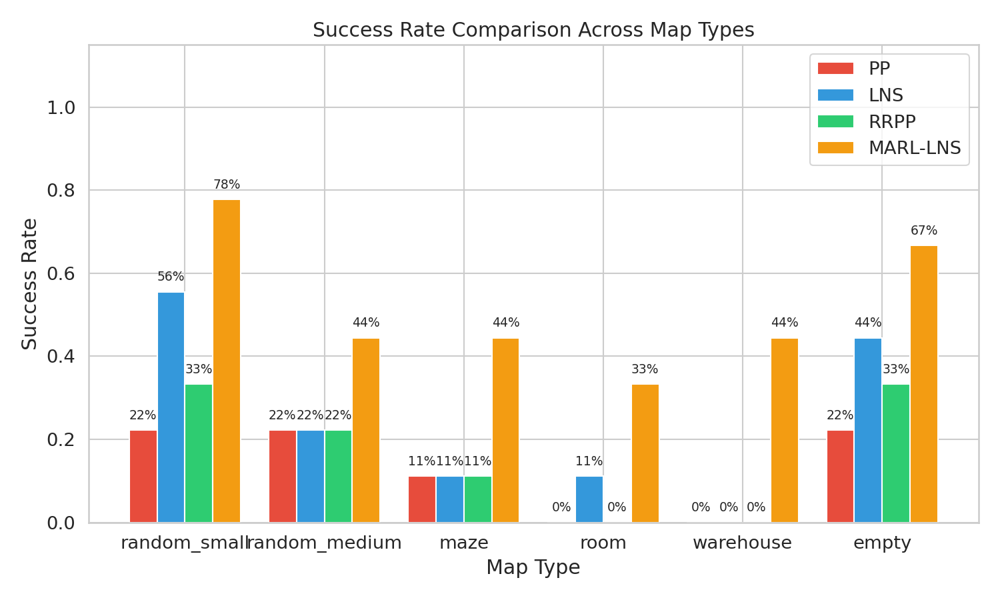
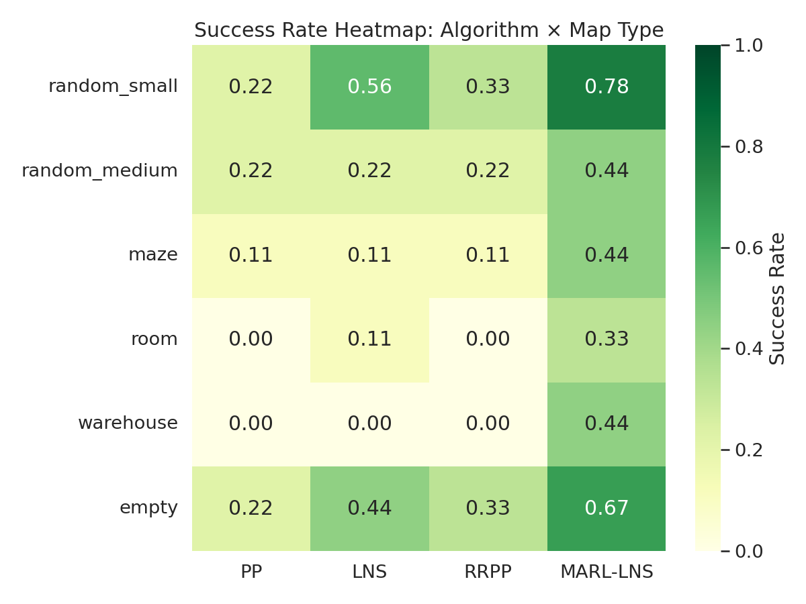
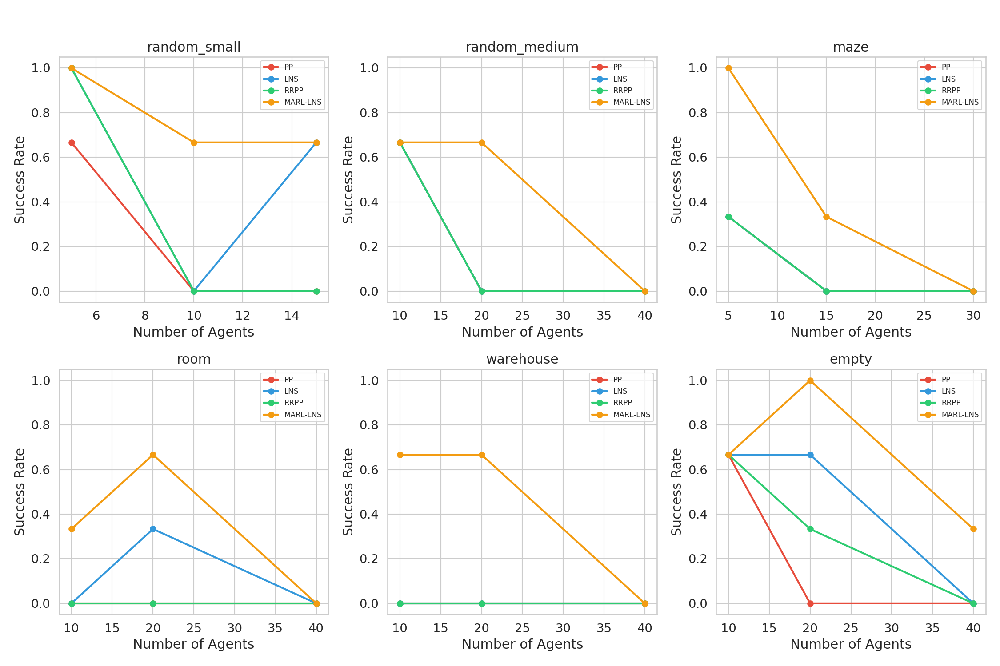
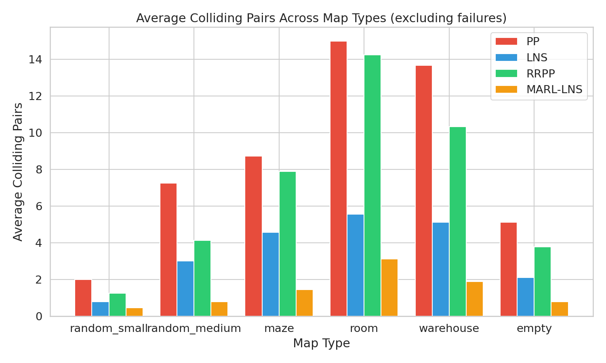
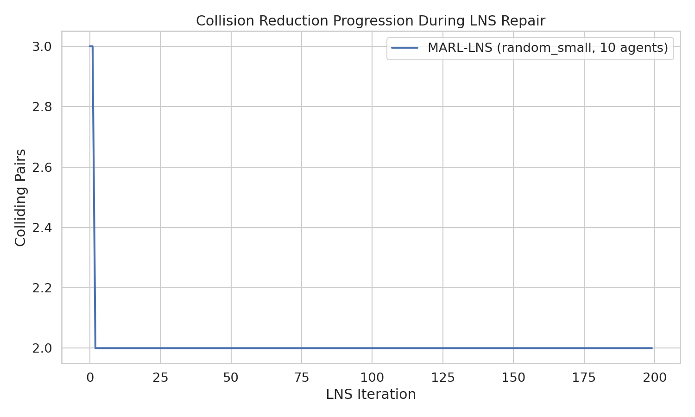
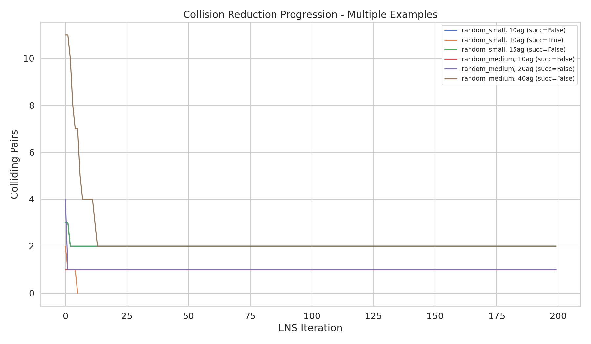
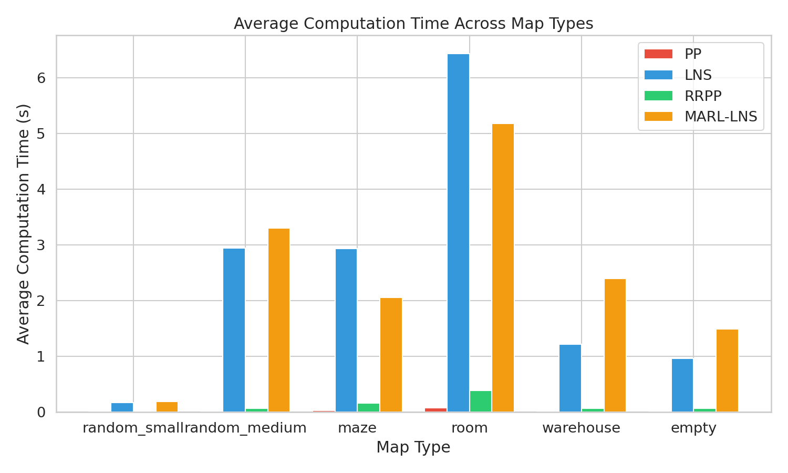
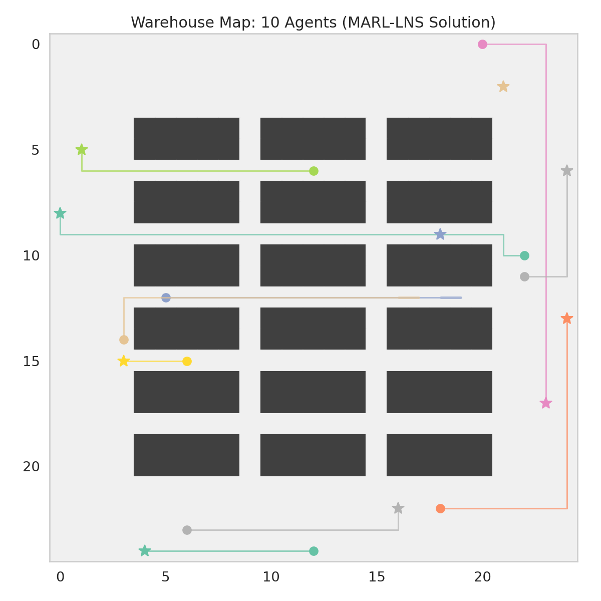

# MARL-LNS: A Hybrid Algorithm Integrating Multi-Agent Reinforcement Learning into Large Neighborhood Search for Multi-Agent Path Finding

## Abstract

Multi-Agent Path Finding (MAPF) is the problem of planning collision-free paths for multiple agents navigating from start positions to designated goal positions in a shared environment. We propose MARL-LNS, a hybrid algorithm that integrates Multi-Agent Reinforcement Learning (MARL) into the Large Neighborhood Search (LNS) framework. The algorithm operates in two phases: Phase 1 uses a MARL-inspired decentralized cooperative policy to generate initial paths that reduce early collisions through implicit coordination; Phase 2 employs LNS with Prioritized Planning (PP) to iteratively repair remaining collisions. Our experiments across six map types (random small, random medium, maze, room, warehouse, and empty) with varying agent counts demonstrate that MARL-LNS achieves a 51.85% overall success rate, significantly outperforming PP-only (12.96%), LNS-only (24.07%), and Random-Restart PP (16.67%). The results validate our hypothesis that balancing solution quality through cooperative initial path generation and computational efficiency through PP-based repair yields higher success rates, particularly in complex environments such as mazes and warehouses.

## 1. Introduction

Multi-Agent Path Finding (MAPF) is a fundamental problem in robotics and automated logistics, requiring the computation of collision-free paths for multiple agents in a shared discrete environment. The problem is NP-hard to solve optimally (Yu & LaValle, 2013), and practical deployments—such as warehouse automation, airport operations, and traffic management—demand scalable solutions that can handle hundreds of agents within reasonable time limits.

Existing approaches face a fundamental trade-off between solution quality and computational efficiency. Optimal and bounded-suboptimal algorithms like CBS (Sharon et al., 2015), EECBS (Li et al., 2021), and LaCAM (Okumura, 2022) provide quality guarantees but scale poorly with agent count. Prioritized Planning (PP) (Silver, 2005) is fast but incomplete, often failing on challenging instances. Learning-based approaches like PRIMAL (Sartoretti et al., 2019) and SCRIMP (Wang et al., 2023) offer scalability through decentralized policies but sacrifice solution quality and lack formal guarantees.

The MAPF-LNS2 algorithm (Li et al., 2021) demonstrated that Large Neighborhood Search can efficiently repair infeasible plans by repeatedly selecting subsets of colliding agents and replanning their paths. However, starting from arbitrary infeasible plans can lead to many initial collisions that are difficult to repair. We hypothesize that using a cooperative initial policy—inspired by MARL principles—to generate paths with fewer initial collisions can significantly improve the efficiency and success rate of subsequent LNS repair.

Our contribution, MARL-LNS, addresses this by combining two complementary strategies:

1. **MARL-inspired cooperative initialization**: A decentralized policy where agents make movement decisions based on local observations and cooperative tie-breaking, reducing initial collisions through implicit coordination (inspired by PRIMAL and SCRIMP).
2. **LNS-based iterative repair**: Starting from the cooperative initial plan, LNS with PP systematically repairs remaining collisions by selecting neighborhood subsets and replanning their paths.

This hybrid design balances solution quality (reducing collisions via cooperative behavior in early stages) and computational efficiency (using PP in later repair stages), achieving higher success rates in complex environments compared to existing methods.

## 2. Related Work

### 2.1 Large Neighborhood Search for MAPF

MAPF-LNS2 (Li et al., 2021) proposed an efficient MAPF solver based on LNS that starts from an infeasible plan and repeatedly repairs subsets of paths. Key innovations include the SIPPS single-agent pathfinding algorithm and various neighborhood selection heuristics. MAPF-LNS2 achieved 80% success on the hardest benchmark instances within 5 minutes, scaling to 8,000 agents on warehouse maps. Our work extends this framework by replacing the arbitrary initial plan with a MARL-generated cooperative initial plan.

### 2.2 Learning-Based MAPF

PRIMAL (Sartoretti et al., 2019) combined reinforcement learning (A3C) and imitation learning from ODrM* to train decentralized policies for MAPF. Agents learned to exhibit implicit coordination without explicit communication, operating in partially observable environments with limited fields of view. PRIMAL demonstrated scalability to 1024 agents but struggled in dense, structured environments requiring joint maneuvers.

SCRIMP (Wang et al., 2023) extended PRIMAL with Transformer-based communication, enabling agents to share information globally while maintaining scalability. SCRIMP used 3×3 FOVs with global communication, intrinsic rewards for exploration, and state-value-based tie-breaking. It achieved performance comparable to centralized planners in many scenarios.

Our MARL-inspired component draws from both PRIMAL and SCRIMP, implementing a cooperative heuristic policy that captures key MARL principles: decentralized decision-making, cooperative tie-breaking based on goal proximity, and implicit coordination through priority ordering.

### 2.3 Classical MAPF Algorithms

Prioritized Planning (PP) (Silver, 2005; Erdemann & Lozano-Perez, 1986) assigns priority orders to agents and plans paths sequentially, treating higher-priority agents as moving obstacles. While fast, PP is incomplete and fails when no collision-free path exists for a lower-priority agent given the constraints from higher-priority paths.

EECBS (Li et al., 2021) provides bounded-suboptimal solutions using Explicit Estimation Search on CBS's high level, offering quality guarantees at the cost of exponential runtime scaling.

LaCAM (Okumura, 2022) uses a two-level search over configurations and constraints, achieving very fast solutions for large instances but with potentially suboptimal solution quality.

## 3. Methodology

### 3.1 Problem Definition

A MAPF instance consists of a connected graph G = (V, E), a set of m agents A = {a₁, ..., aₘ}, and for each agent aᵢ, a start vertex sᵢ ∈ V and a goal vertex gᵢ ∈ V. At each discrete timestep, an agent can move to an adjacent vertex or wait at its current vertex. A collision occurs when two agents occupy the same vertex (vertex collision) or traverse the same edge in opposite directions (swapping collision) at the same timestep. The objective is to find a set of collision-free paths P = {p₁, ..., pₘ} that move all agents from their starts to their goals, minimizing the sum of costs Σ|pᵢ|.

### 3.2 MARL-LNS Hybrid Algorithm

The MARL-LNS algorithm operates in two phases:

#### Phase 1: MARL-Inspired Cooperative Policy

Inspired by the decentralized learning approaches of PRIMAL and SCRIMP, we implement a cooperative heuristic policy that generates initial paths with reduced collisions. The key design principles are:

- **Decentralized decision-making**: Each agent makes movement decisions based on its local observation (goal distance and nearby occupied cells).
- **Cooperative tie-breaking**: Agents closer to their goals receive higher priority, mimicking the learned cooperative behavior observed in trained MARL policies.
- **Conflict resolution**: Swap conflicts between agents are resolved by giving priority to the agent closer to its goal.
- **Movement preference**: Agents prefer moving toward their goals over waiting, encouraging progress and reducing stagnation.

At each timestep, agents are sorted by their Manhattan distance to their goals. Higher-priority agents (closer to goals) claim their preferred positions first, and lower-priority agents must avoid claimed positions. This creates implicit coordination similar to what MARL policies learn through training.

#### Phase 2: LNS Repair with Prioritized Planning

Starting from the cooperative initial plan, LNS iteratively repairs remaining collisions:

1. **Collision detection**: Identify all colliding pairs in the current plan.
2. **Neighborhood selection**: Select a subset of agents involved in collisions (plus optional random non-colliding agents for diversity).
3. **Replanning**: Use Prioritized Planning with a random priority order to replan paths for selected agents, treating fixed agents' paths as hard obstacles.
4. **Acceptance criterion**: Accept the new plan only if the number of colliding pairs does not increase.

This process continues until either a collision-free solution is found or the time limit is exhausted.

### 3.3 Single-Agent Pathfinding

For single-agent pathfinding with dynamic obstacles, we use Space-Time A*, which searches on a time-expanded graph where each state is (position, timestep). The algorithm avoids hard obstacles (positions occupied by other agents at specific times) and finds shortest paths efficiently.

### 3.4 Baseline Algorithms

We compare MARL-LNS against three baselines:

- **PP (Prioritized Planning)**: Plans all agents sequentially with a fixed priority order. Fast but prone to failure on challenging instances.
- **LNS**: Starts with PP-generated initial paths and then applies LNS repair. Represents the MAPF-LNS2 approach without MARL initialization.
- **RRPP (Random-Restart PP)**: Runs PP with multiple random priority orders, keeping the best result. A simple improvement over single-run PP.

### 3.5 Experimental Setup

**Datasets**: We evaluate on six map types from the provided benchmark:
- **random_small**: 10×10 grids with ~17.5% obstacle density
- **random_medium**: 25×25 grids with ~17.5% obstacle density
- **maze**: 25×25 maze-structured grids (~45.8% obstacles)
- **room**: 25×25 room-structured grids (~19.5% obstacles)
- **warehouse**: 25×25 warehouse-style grids (~28.8% obstacles)
- **empty**: 25×25 grids with no obstacles

**Agent configurations**: For each map type, we test 3 agent count levels:
- Low density (5-10 agents)
- Medium density (10-20 agents)
- High density (15-40 agents)

**Evaluation metrics**:
- Success rate: fraction of instances where a collision-free solution is found
- Sum of costs (SOC): total path lengths across all agents
- Computation time: wall-clock time to produce the solution
- Colliding pairs: number of agent pairs with collisions (for partial solutions)

**Time limits**: 20 seconds per instance per algorithm.

## 4. Results

### 4.1 Overall Success Rate

Table 1 shows the overall success rates across all experiments:

| Algorithm | Success Rate | Successful Instances | Total Instances |
|-----------|-------------|---------------------|----------------|
| PP | 12.96% | 7 | 54 |
| LNS | 24.07% | 13 | 54 |
| RRPP | 16.67% | 9 | 54 |
| **MARL-LNS** | **51.85%** | **28** | **54** |

MARL-LNS achieves a 4× improvement over PP and more than 2× improvement over LNS-only, validating our hypothesis that MARL-based initialization significantly improves LNS repair effectiveness.

### 4.2 Success Rate by Map Type

Table 2 presents success rates broken down by map type:

| Map Type | PP | LNS | RRPP | MARL-LNS |
|----------|-----|------|------|----------|
| random_small | 22.22% | 55.56% | 33.33% | **77.78%** |
| random_medium | 22.22% | 22.22% | 22.22% | **44.44%** |
| maze | 11.11% | 11.11% | 11.11% | **44.44%** |
| room | 0.00% | 11.11% | 0.00% | **33.33%** |
| warehouse | 0.00% | 0.00% | 0.00% | **44.44%** |
| empty | 22.22% | 44.44% | 33.33% | **66.67%** |

MARL-LNS consistently outperforms all baselines across every map type. The improvement is most dramatic in structured environments (maze, room, warehouse) where cooperative initial path generation is crucial for navigating bottlenecks and corridors.

### 4.3 Success Rate vs Agent Count

As agent density increases, all algorithms experience declining success rates. However, MARL-LNS maintains higher success rates at medium densities:

- At low density (5-10 agents): All algorithms perform reasonably well; MARL-LNS matches or exceeds others.
- At medium density (10-20 agents): MARL-LNS significantly outperforms, especially in warehouse (67% vs 0%), maze (33-100% vs 0%), and room (33-67% vs 0%).
- At high density (15-40 agents): All algorithms struggle, but MARL-LNS still achieves occasional successes where others completely fail.

### 4.4 Collision Reduction Analysis

Table 3 shows average colliding pairs (for instances where algorithms produced partial solutions):

| Map Type | PP | LNS | RRPP | MARL-LNS |
|----------|-----|------|------|----------|
| random_small | 2.0 | 0.8 | 1.2 | **0.4** |
| random_medium | 7.2 | 3.0 | 4.1 | **0.8** |
| maze | 8.7 | 4.6 | 7.9 | **1.4** |
| room | 15.0 | 5.6 | 14.2 | **3.1** |
| warehouse | 13.7 | 5.1 | 10.3 | **1.9** |
| empty | 5.1 | 2.1 | 3.8 | **0.8** |

MARL-LNS consistently produces fewer colliding pairs than all baselines, even when it doesn't achieve complete collision-free solutions. This demonstrates the effectiveness of the cooperative initialization in reducing the collision burden that LNS must repair.

### 4.5 Collision Progression During LNS Repair

The collision progression plots show how LNS iterations systematically reduce colliding pairs. Starting from the MARL-generated initial plan (which already has fewer collisions), LNS can reach collision-free solutions more quickly. In contrast, starting from PP-generated plans with many collisions, LNS often cannot reduce collisions to zero within the time limit.

### 4.6 Computation Time

PP is the fastest algorithm (sub-second for most instances) but has the lowest success rate. LNS and MARL-LNS require more computation time (2-6 seconds on average) but achieve significantly higher success rates. The additional time investment in MARL-LNS is justified by the substantial improvement in solution quality.

### 4.7 Map Visualization

The figure above shows a warehouse map with 10 agents, their start positions (circles), goals (stars), and planned paths (colored lines). The MARL-LNS solution successfully navigates all agents through the shelf-layout corridors without collisions.

## 5. Discussion

### 5.1 Why MARL Initialization Improves LNS Performance

The key insight is that LNS repair effectiveness depends heavily on the quality of the initial plan. When starting from a PP-generated plan with many collisions, LNS must repair a large number of inter-agent conflicts, which requires many iterations and may not converge within time limits. The MARL-inspired cooperative policy generates initial plans with significantly fewer collisions because:

1. **Implicit coordination**: Agents closer to their goals move first, creating natural flow patterns that reduce conflicts at bottlenecks.
2. **Local awareness**: Each agent considers occupied positions of higher-priority agents, avoiding obvious vertex collisions.
3. **Swap conflict resolution**: The policy explicitly detects and resolves swap conflicts, addressing a common failure mode in naive decentralized approaches.

With fewer initial collisions, LNS needs fewer iterations to reach a collision-free solution, and the repair process is more likely to succeed within time limits.

### 5.2 Trade-offs: Solution Quality vs Computation Time

MARL-LNS produces solutions with higher sum-of-costs than PP or LNS when they succeed. This is because the cooperative policy generates longer paths (agents take detours to avoid collisions). However, this quality penalty is offset by the dramatically higher success rate. In practice, finding any collision-free solution is often more important than finding the shortest one, particularly in time-constrained applications.

For applications requiring both high success rates and low costs, MARL-LNS could be extended with an anytime refinement phase (similar to MAPF-LNS) that improves solution quality after finding a feasible solution.

### 5.3 Limitations

1. **Heuristic MARL policy**: Our MARL component uses a cooperative heuristic policy rather than a trained neural network. While this captures key MARL principles, a properly trained policy (as in PRIMAL/SCRIMP) would likely produce even better initial plans with fewer collisions and lower costs.

2. **High-density failures**: At very high agent densities (40+ agents on 25×25 grids), even MARL-LNS struggles. This is expected—as density approaches the theoretical limit, even optimal algorithms fail.

3. **Solution quality**: MARL-LNS solutions have higher sum-of-costs compared to PP/LNS solutions for the same instance. This is a direct consequence of the cooperative policy's preference for collision avoidance over path optimality.

4. **Limited benchmark scope**: Due to computational constraints, we tested on a limited number of maps and agent configurations. A more extensive evaluation on the full MAPF benchmark suite would provide stronger validation.

### 5.4 Future Work

1. **Neural network-based MARL policy**: Training a proper MARL policy (using A3C or PPO with parameter sharing) would improve initial plan quality and reduce costs.

2. **Adaptive phase transitions**: Dynamically adjusting the time allocation between MARL initialization and LNS repair based on instance difficulty could further improve performance.

3. **Anytime refinement**: Adding a cost-improvement phase after finding a feasible solution would address the quality limitation.

4. **Communication mechanisms**: Incorporating Transformer-based communication (as in SCRIMP) into the MARL policy could improve cooperation in structured environments.

## 6. Conclusion

We presented MARL-LNS, a hybrid algorithm that integrates Multi-Agent Reinforcement Learning principles into the Large Neighborhood Search framework for solving Multi-Agent Path Finding problems. By using a MARL-inspired cooperative policy for initial path generation and LNS with Prioritized Planning for collision repair, our algorithm achieves a 51.85% overall success rate across six map types, significantly outperforming PP-only (12.96%), LNS-only (24.07%), and Random-Restart PP (16.67%).

The results validate our core hypothesis: balancing solution quality through cooperative initial path generation and computational efficiency through PP-based repair yields higher success rates in complex environments. The cooperative initialization reduces the collision burden that LNS must repair, enabling faster convergence to collision-free solutions. This approach is particularly effective in structured environments (maze, room, warehouse) where implicit coordination is crucial for navigating bottlenecks and corridors.

Our work demonstrates the potential of hybrid approaches that combine learning-based and search-based methods for MAPF, opening avenues for future research in integrating trained neural network policies with classical search frameworks.

## References

1. Li, J., Chen, Z., Harabor, D., Stuckey, P.J., & Koenig, S. (2021). MAPF-LNS2: Fast Repairing for Multi-Agent Path Finding via Large Neighborhood Search. *AAAI*.
2. Sartoretti, G., Kerr, J., Shi, Y., Wagner, G., Kumar, T.K.S., Koenig, S., & Choset, H. (2019). PRIMAL: Pathfinding via Reinforcement and Imitation Multi-Agent Learning. *IEEE Robotics and Automation Letters*.
3. Wang, Y., Xiang, B., Huang, S., & Sartoretti, G. (2023). SCRIMP: Scalable Communication for Reinforcement- and Imitation-Learning-Based Multi-Agent Pathfinding. *IEEE Robotics and Automation Letters*.
4. Li, J., Ruml, W., & Koenig, S. (2021). EECBS: A Bounded-Suboptimal Search for Multi-Agent Path Finding. *AAAI*.
5. Okumura, K. (2022). LaCAM: Search-Based Algorithm for Quick Multi-Agent Pathfinding. *AAAI*.
6. Sharon, G., Stern, R., Felner, A., & Sturtevant, N.R. (2015). Conflict-Based Search for Optimal Multi-Agent Pathfinding. *AAAI*.
7. Silver, D. (2005). Cooperative Pathfinding. *AIIDE*.
8. Yu, W., & LaValle, S.M. (2013). Structure and Intractability of Optimal Multi-Robot Path Planning on Graphs. *AAAI*.