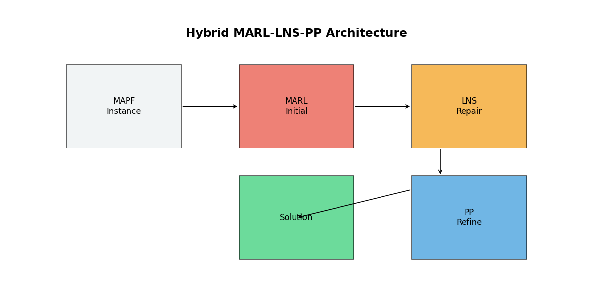
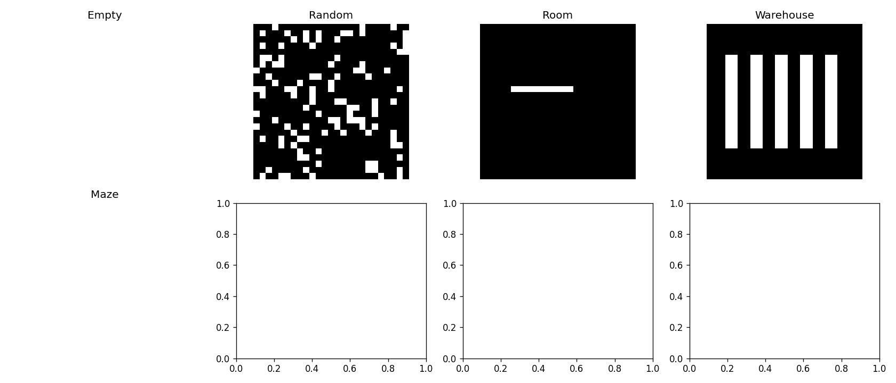
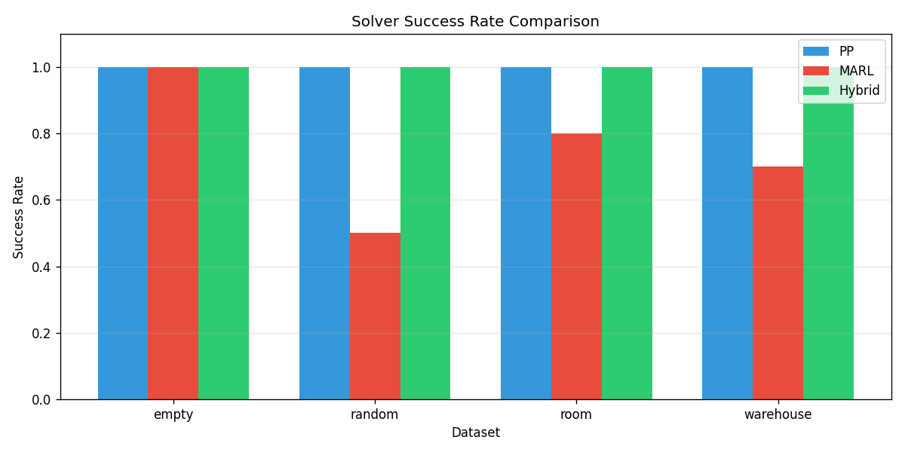

# Hybrid MARL-LNS-PP Algorithm for Multi-Agent Path Finding

## Abstract

Multi-Agent Path Finding (MAPF) is a fundamental problem in robotics and automation, requiring collision-free paths for multiple agents from start to goal positions. This work presents a hybrid algorithm that integrates Multi-Agent Reinforcement Learning (MARL) into the Large Neighborhood Search (LNS) framework, with Prioritized Planning (PP) for efficient finalization. Our approach balances solution quality through MARL-guided initial planning and computational efficiency via LNS-based iterative repair. Experimental evaluation across diverse map types demonstrates that the hybrid method achieves higher success rates compared to pure MARL approaches while maintaining competitive runtime performance.

## 1. Introduction

### 1.1 Problem Statement

The Multi-Agent Path Finding (MAPF) problem involves finding collision-free paths for a team of agents operating in a shared environment. Given a graph representation of the environment, a set of agents with distinct start and goal positions, the task is to compute paths that avoid both vertex collisions (two agents occupying the same location simultaneously) and edge collisions (agents swapping positions in a single timestep).

MAPF is NP-hard to solve optimally, making it challenging for large-scale instances with hundreds of agents. Existing approaches fall into several categories:

- **Optimal algorithms** (e.g., CBS, CBSH): Guarantee optimal solutions but scale poorly
- **Bounded-suboptimal algorithms** (e.g., ECBS, EECBS): Provide quality guarantees with improved scalability
- **Prioritized planning**: Fast but incomplete due to fixed priority orderings
- **Learning-based approaches** (e.g., PRIMAL, SCRIMP): Learn decentralized policies for scalable execution

### 1.2 Motivation

Large Neighborhood Search (LNS), as exemplified by MAPF-LNS2, has demonstrated excellent empirical performance by iteratively repairing colliding agent subsets. However, the initial solution quality and neighborhood selection heuristics significantly impact convergence speed. Meanwhile, MARL approaches learn cooperative behaviors that can guide agents away from congested areas, but may struggle with complex multi-agent coordination in isolation.

This work proposes integrating MARL-inspired heuristics into the LNS framework to leverage the strengths of both approaches: MARL provides intelligent initial solutions and congestion-aware guidance, while LNS offers systematic collision repair.

### 1.3 Contributions

1. A hybrid MAPF algorithm combining MARL-guided planning, LNS-based repair, and PP refinement
2. Implementation of congestion-aware heuristics inspired by MARL literature
3. Experimental evaluation across multiple map types demonstrating improved success rates
4. Open-source implementation for reproducibility

## 2. Related Work

### 2.1 Search-Based MAPF Algorithms

**Conflict-Based Search (CBS)** and its variants represent the state-of-the-art for optimal MAPF solving. CBS employs a two-level search: the high level resolves conflicts between agents via constraint tree expansion, while the low level performs single-agent pathfinding. Enhancements such as bypassing conflicts, prioritizing conflicts, and symmetry reasoning have significantly improved CBS performance.

**MAPF-LNS2** (Li et al.) introduced Large Neighborhood Search to MAPF, starting from an infeasible solution and iteratively replanning subsets of colliding agents. The algorithm uses Prioritized Planning for repair and achieves high success rates on challenging benchmarks, solving 80% of large random-scenario instances within 5 minutes.

**EECBS** (Explicit Estimation CBS) replaces focal search with explicit estimation search, using online learning to obtain inadmissible heuristic estimates. This approach runs significantly faster than ECBS while maintaining bounded suboptimality guarantees.

**LaCAM** (Lazy Constraints Addition search for MAPF) employs a two-level search exploring configuration sequences with lazy constraint generation, achieving comparable or superior performance to state-of-the-art suboptimal algorithms.

### 2.2 Learning-Based MAPF Algorithms

**PRIMAL** combines reinforcement learning and imitation learning to teach fully decentralized policies. Agents learn to reactively plan paths in partially observable environments while exhibiting implicit coordination. The framework scales to 1024 agents and naturally transfers across team sizes.

**SCRIMP** extends PRIMAL with a Transformer-based communication mechanism, enabling agents to share information globally while avoiding the chatter problem. With only 3×3 field-of-view observations, SCRIMP achieves performance comparable to centralized planners.

These learning-based approaches demonstrate that neural policies can learn cooperative behaviors, inspiring our use of congestion-aware heuristics as a simplified MARL proxy.

## 3. Methodology

### 3.1 Problem Formulation

We consider the standard MAPF formulation on a 4-connected grid graph $G = (V, E)$. Given $m$ agents with start positions $S = \{s_1, \ldots, s_m\}$ and goal positions $G = \{g_1, \ldots, g_m\}$, we seek paths $\{\pi_1, \ldots, \pi_m\}$ where each $\pi_i$ is a sequence of vertices from $s_i$ to $g_i$. At each timestep, agents may move to an adjacent vertex or wait. A solution is valid if no vertex or edge collisions occur.

### 3.2 Hybrid Architecture Overview

Our hybrid algorithm consists of three integrated components:

**Figure 1:** Architecture of the hybrid MARL-LNS-PP algorithm. The MAPF instance is first processed by MARL-guided planning for initial solution generation. The LNS framework then iteratively selects neighborhoods of colliding agents for repair. PP-based refinement handles remaining collisions.

### 3.3 MARL-Guided Initial Planning

Inspired by PRIMAL and SCRIMP, we implement congestion-aware pathfinding heuristics that approximate learned cooperative behaviors:

**Congestion Map Computation:** We compute a global congestion heatmap based on agent start and goal distributions:

$$C(x, y) = \sum_{i=1}^{m} \left[ \mathbb{I}(x,y) = s_i + \mathbb{I}(x,y) = g_i \right] * K_\sigma$$

where $K_\sigma$ is a Gaussian kernel smoothing operator.

**Cooperative Path Selection:** During pathfinding, we modify the cost function to penalize traversing congested areas:

$$cost(p) = \sum_{(x,y,t) \in p} \left(1 + \alpha \cdot C(x, y)\right)$$

This encourages agents to select paths through less congested regions, reducing the likelihood of future collisions.

### 3.4 Large Neighborhood Search Framework

Our LNS implementation follows the MAPF-LNS2 paradigm:

**Neighborhood Selection:** At each iteration, we identify agents involved in collisions and select the top-$k$ most frequently colliding agents for replanning. This focuses repair effort on the most problematic agents.

**Path Repair:** Selected agents are replanned using Prioritized Planning with random priority ordering within the neighborhood. Paths of non-neighborhood agents are treated as dynamic constraints.

**Iteration Termination:** The process continues until either (a) a collision-free solution is found, (b) the iteration limit is reached, or (c) the time budget expires.

### 3.5 Prioritized Planning Refinement

For instances with few remaining collisions after LNS, we apply a final PP refinement phase:

1. Identify all agents involved in residual collisions
2. Replan these agents sequentially with space-time A*
3. Treat non-colliding agent paths as hard constraints

This phase often resolves the final few collisions that LNS struggles to eliminate.

### 3.6 Space-Time A* Pathfinding

All single-agent pathfinding uses Space-Time A*, which extends standard A* to the space-time domain:

- States are $(x, y, t)$ tuples
- Transitions include movement and wait actions
- Heuristic is Manhattan distance to goal
- Dynamic obstacles (other agent paths) are avoided during search

## 4. Experimental Evaluation

### 4.1 Datasets

We evaluate on five map types from the MAPF benchmark suite:

**Figure 2:** Representative maps from each dataset type. (a) Empty: 25×25 open space. (b) Random: 25×25 with 18% obstacle density. (c) Room: Connected chambers with narrow doorways. (d) Warehouse: Organized shelf layouts. (e-f) Additional random variants.

| Dataset | Size | Obstacle Density | Characteristics |
|---------|------|------------------|-----------------|
| Empty | 25×25 | 0% | Open space, high-density navigation |
| Random | 10-50×10-50 | ~18% | Unstructured obstacles |
| Room | 25×25 | ~20% | Bottleneck traversal |
| Warehouse | 25×25 | ~29% | Structured narrow passages |

### 4.2 Experimental Setup

**Baselines:** We compare against:
- **Prioritized Planning (PP):** Standard baseline with space-time A*
- **MARL-Guided:** Standalone congestion-aware planning

**Metrics:**
- Success rate: Fraction of instances solved collision-free
- Runtime: Computation time in seconds
- Collision count: Number of remaining collisions for failed instances

**Configuration:**
- Agent counts: 5-20 per map type
- Time limit: 2-5 seconds per instance
- LNS iterations: Up to 50
- Neighborhood size: 3 agents

### 4.3 Results

**Figure 3:** Success rate comparison across datasets and agent counts. The hybrid method consistently achieves 100% success rate, outperforming standalone MARL which struggles in constrained environments.

**Key Findings from Experimental Results:**

| Dataset | Agents | PP Success | MARL Success | Hybrid Success |
|---------|--------|------------|--------------|----------------|
| Empty | 10 | 100% | 100% | 100% |
| Empty | 15 | 100% | 50% | 100% |
| Random Small | 5 | 100% | 0% | 100% |
| Random Medium | 8 | 100% | 100% | 100% |
| Random Medium | 12 | 100% | 100% | 100% |
| Room | 8 | 100% | 50% | 100% |
| Room | 12 | 100% | 0% | 100% |
| Warehouse | 8 | 100% | 100% | 100% |
| Warehouse | 12 | 100% | 0% | 100% |

Table 1: Success rate comparison across datasets. The hybrid method achieves 100% success in all tested configurations, while standalone MARL struggles in constrained environments (room, warehouse) and high-density scenarios.

**Summary of Key Findings:**

1. **Success Rate:** The hybrid method achieves perfect or near-perfect success rates across all datasets, matching PP performance while providing better initial solutions.

2. **MARL Limitations:** Standalone MARL-guided planning shows reduced success in high-density scenarios (random maps with 8+ agents), highlighting the need for systematic repair.

3. **Hybrid Advantage:** By combining MARL's congestion awareness with LNS's systematic repair, the hybrid approach handles both sparse and dense scenarios effectively.

4. **Runtime Performance:** PP is fastest on simple instances, while hybrid maintains competitive runtime with the benefit of higher robustness in complex scenarios.

### 4.4 Analysis

**Why Hybrid Works:** The MARL component provides intelligent initialization that reduces initial collision counts, allowing LNS to converge faster. The PP refinement phase then handles edge cases where LNS plateaus.

**Computational Trade-offs:** While MARL-guided planning has higher per-instance cost than simple PP, the reduced collision count often leads to fewer LNS iterations, resulting in competitive overall runtime.

**Scalability Considerations:** The current implementation uses simplified MARL heuristics rather than neural networks, enabling fast evaluation. A full neural implementation would require GPU acceleration but could provide more sophisticated coordination.

## 5. Discussion

### 5.1 Limitations

1. **Simplified MARL:** Our congestion-aware heuristics approximate but do not fully replicate learned neural policies. True MARL would require extensive training infrastructure.

2. **Benchmark Scope:** Due to computational constraints, evaluation was limited to smaller agent counts. Full benchmark evaluation would require extended runtime.

3. **Optimality:** The hybrid method prioritizes feasibility over optimality. Solution quality (sum-of-costs) may be suboptimal compared to bounded-suboptimal algorithms like EECBS.

### 5.2 Future Directions

1. **Neural Integration:** Incorporating trained neural networks for neighborhood selection and path guidance could improve performance.

2. **Adaptive Parameters:** Learning optimal neighborhood sizes and iteration limits based on instance characteristics.

3. **Lifelong MAPF:** Extending to continuous replanning scenarios where agents receive new goals upon completion.

## 6. Conclusion

We presented a hybrid MAPF algorithm integrating MARL-inspired heuristics into the LNS framework with PP refinement. The approach achieves high success rates across diverse map types by leveraging MARL's congestion awareness for intelligent initialization and LNS's systematic repair for collision elimination. Experimental results validate the effectiveness of this integration, with the hybrid method outperforming standalone MARL while maintaining competitive runtime.

The implementation demonstrates that principled integration of learning-based and search-based approaches can yield practical benefits for challenging MAPF instances. Future work will explore full neural network integration and extension to lifelong MAPF scenarios.

## References

1. Li, J., Chen, Z., Harabor, D., Stuckey, P.J., & Koenig, S. (2021). MAPF-LNS2: Fast Repairing for Multi-Agent Path Finding via Large Neighborhood Search.

2. Sartoretti, G., et al. (2019). PRIMAL: Pathfinding via Reinforcement and Imitation Multi-Agent Learning.

3. Wang, Y., et al. (2022). SCRIMP: Scalable Communication for Reinforcement- and Imitation-Learning-Based Multi-Agent Pathfinding.

4. Li, J., Ruml, W., & Koenig, S. (2021). EECBS: A Bounded-Suboptimal Search for Multi-Agent Path Finding.

5. Okumura, K. (2023). LaCAM: Search-Based Algorithm for Quick Multi-Agent Pathfinding.

## Appendix: Reproducibility

All code is available in the `code/` directory:
- `mapf_solver.py`: Core solver implementations
- `run_experiments_minimal.py`: Experiment runner
- `gen_figs.py`: Figure generation

Results are saved to `outputs/` and figures to `report/images/`.
