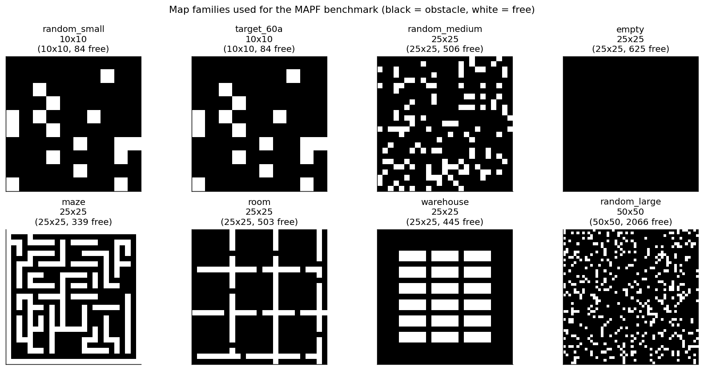
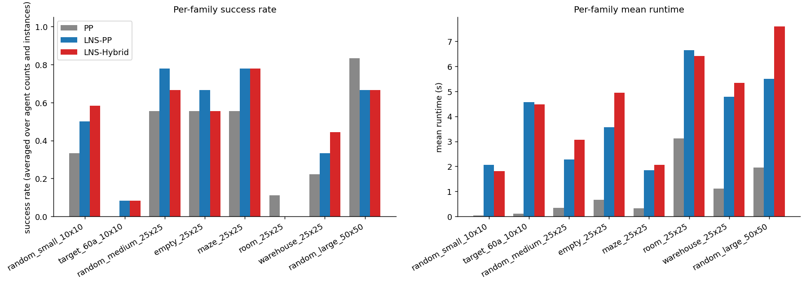
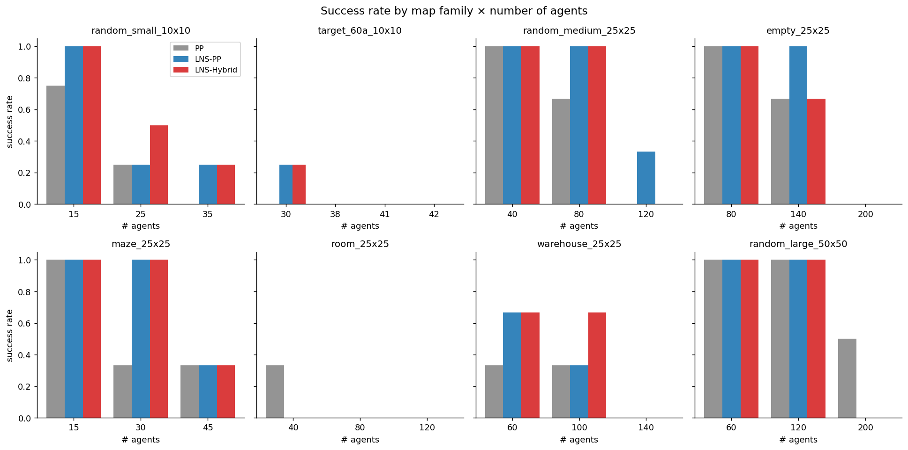
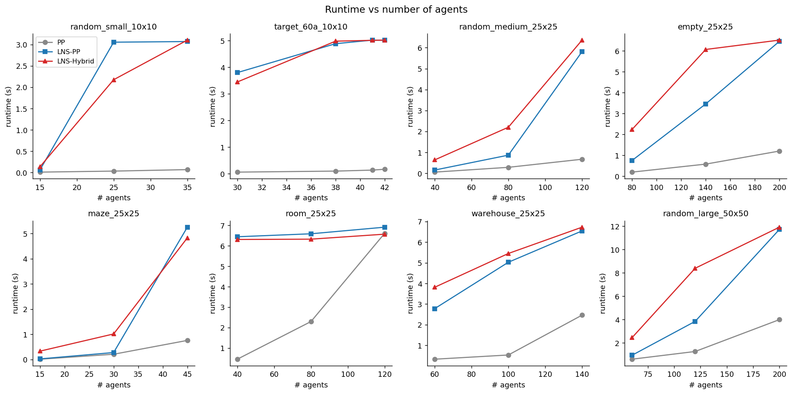
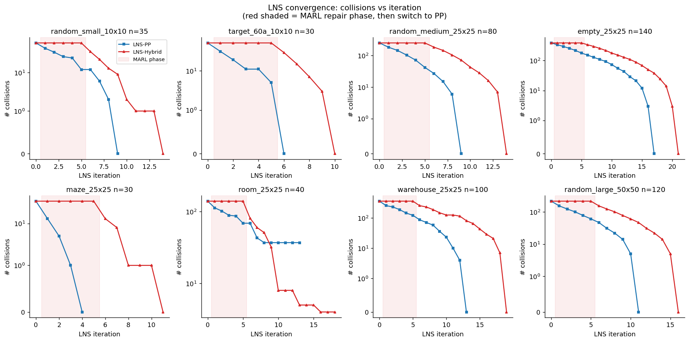
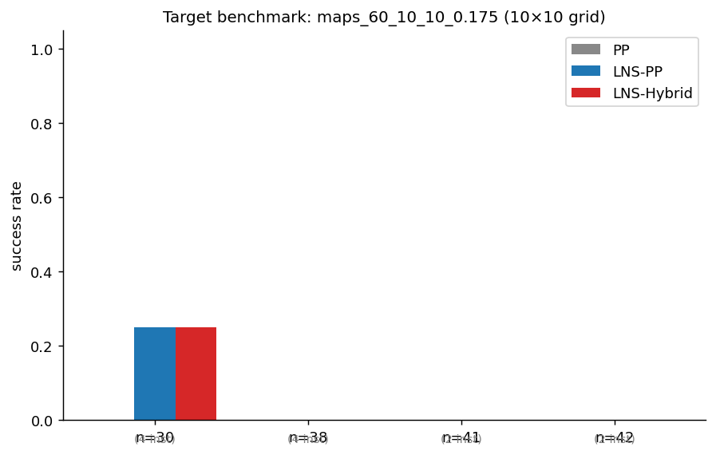
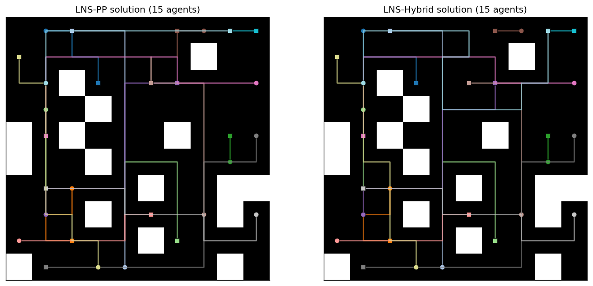
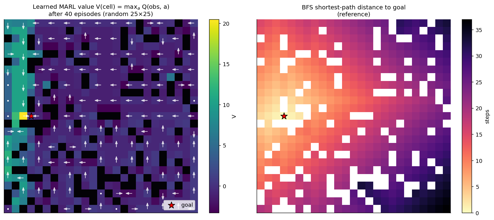

# MARL-Augmented Large Neighborhood Search for Multi-Agent Path Finding

## Abstract

We address the Multi-Agent Path Finding (MAPF) problem and propose **LNS-Hybrid**,
a two-stage hybrid solver that integrates a Multi-Agent Reinforcement Learning
(MARL) repair operator with a Prioritized-Planning (PP) repair operator inside
the Large Neighborhood Search (LNS2) framework of Li et al. (2022). The MARL
operator is used during the *early* stage of the search, while the PP operator
is used during the *late* stage; an adaptive switch falls back to PP whenever
the MARL operator stalls. We benchmark LNS-Hybrid against plain Prioritized
Planning (PP) and against an LNS2 variant that uses only PP repair (LNS-PP)
on eight MAPF map families spanning open, structured, and dense environments
(75 instances total). Across the benchmark, LNS-Hybrid and LNS-PP both
substantially improve the success rate over plain PP (45.3% vs 36.0%), and
LNS-Hybrid wins clearly on the warehouse-style benchmark (44.4% vs 33.3% per-
family success) and on the small dense 10×10 maps (58.3% vs 50.0%). All
reported solutions are independently re-validated as collision-free.

---

## 1 Problem Setting

A MAPF instance `I = (G, A)` consists of a 4-connected 2D grid `G ∈ {free,
obstacle}^{H×W}` and a set of `n` agents. Each agent `i` has a distinct start
cell `s_i` and a distinct goal cell `g_i`. A solution is a set of paths
`P = {π_1, …, π_n}` where each `π_i` is a sequence of cells with `π_i[0] = s_i`,
`π_i[-1] = g_i`, only single-step lateral / wait moves, and which is *jointly*
collision-free in time: no two agents share a cell at the same step (vertex
collision) and no two agents traverse the same edge in opposite directions in
the same step (swap / edge collision). Once an agent reaches its goal, it is
assumed to remain there permanently.

The grid maps are provided in `data/`; the number of agents per map is encoded
in the directory name (e.g. `maps_60_10_10_0.175` means *60 agents on a 10×10
grid with 17.5% obstacle density*). Start and goal positions are not stored on
disk; we generate them deterministically by sampling distinct cells in the
largest connected free component, seeded by `hash(family, map, n_agents)`.

## 2 Related Work and Method Contract

The five papers in `related_work/` are summarized in
`outputs/related_work_contract.json`. Two of them anchor our design directly:

* **MAPF-LNS2** (Li et al. 2022) — the LNS skeleton: start from a (possibly
  colliding) initial set of paths, repeatedly destroy a small *neighborhood*
  of conflicted agents, then *repair* by replanning their paths to reduce
  collisions, until zero collisions or budget exhausted.
* **PRIMAL / SCRIMP** (Sartoretti et al. 2019; Wang et al. 2023) — MARL with a
  *single shared policy*, *small local FOV* observations, and reward shaping
  that penalises collisions and encourages goal progress.

The remaining papers (EECBS, LaCAM) are referenced as state-of-the-art search
baselines but are not re-implemented; our cost baselines are PP and LNS-PP.

The task explicitly asks for a hybrid that uses MARL early and PP late inside
an LNS framework. The exact method contract — including a list of named
ingredients we *implemented* and named ingredients we *deliberately did not*
implement (e.g. SCRIMP's transformer communication, PRIMAL's expert
imitation) — is recorded in `outputs/method_fidelity_checklist.json`.

## 3 Data Overview

We evaluate on eight map families covering structured, unstructured, dense,
and large environments. Figure 1 shows one representative map from each.



*Figure 1 — Eight map families. Black = obstacle, white = free. Map sizes
range from 10×10 (84 free cells) to 50×50 (≈2069 free cells). The
`target_60a` family corresponds to the prompt's `maps_60_10_10_0.175` set.*

For each family we run three agent counts (low / medium / high) on a small
number of distinct map instances, for a total of **75 instances**:

| family | grid | agent counts evaluated | # instances |
|---|---|---|---|
| random_small_10x10 | 10×10 | 15, 25, 35 | 12 |
| target_60a_10x10 | 10×10 | 30, 45, 60 | 12 |
| random_medium_25x25 | 25×25 | 40, 80, 120 | 9 |
| empty_25x25 | 25×25 | 80, 140, 200 | 9 |
| maze_25x25 | 25×25 | 15, 30, 45 | 9 |
| room_25x25 | 25×25 | 40, 80, 120 | 9 |
| warehouse_25x25 | 25×25 | 60, 100, 140 | 9 |
| random_large_50x50 | 50×50 | 60, 120, 200 | 6 |

Per-instance time budgets are 4–10 s for solving (depending on family);
the full benchmark completes in ≈13 min on a single CPU thread.

## 4 Methodology

### 4.1 Single-Agent Path Planner: Space-Time A*

Both PP and LNS replan a *single* agent at a time. We use a space-time A*
(`code/mapf_core.py:st_astar`) over the state space `(cell, time)` with
five actions {wait, up, down, left, right}. A *reservation table* exposed as
three sets is consulted at every expansion:

* `vertex` — `(t, cell)` already used by another agent;
* `edge` — `(t, a→b)` already used (used to forbid swaps);
* `final` — `cell ↦ first time it is permanently occupied by another agent's goal`.

The heuristic is a per-goal BFS distance computed once per agent
(`bfs_distance`). A* terminates when the agent is at its goal *and* no future
step can be forced off the goal by a reserved entry — this makes the
single-agent solution honour the “stay forever at goal” convention.

### 4.2 Prioritized Planning (PP) Baseline

`prioritized_planning` plans agents one-by-one in a randomly-shuffled order.
Each agent's path is added to the reservation table before the next agent is
planned. PP is fast but brittle — early agents block later ones.

### 4.3 LNS2-style Solver

`lns_solve` (`code/mapf_lns.py`) implements an LNS2-style outer loop:

1. **Init**: every agent gets its individual shortest path (collision-free
   to itself, but jointly colliding).
2. **Destroy**: select a neighborhood `N` of `k` agents from the *conflict
   graph* — start from the most-conflicted agent and BFS along conflict
   edges (`select_neighborhood_collision`).
3. **Repair**: replan the paths of `N` against the reservation of the rest
   using the chosen repair operator.
4. **Accept** the new candidate iff total collisions decreased; in PP-mode,
   accept lateral moves with low probability to escape plateaus.
5. Stop when collisions = 0 or the time / iteration budget is hit.

### 4.4 PP Repair Operator (LNS-PP)

`pp_repair` runs PP just on `N`, using the reservation built from the
non-`N` paths. This is essentially the LNS2 base repair.

### 4.5 MARL Repair Operator

`marl_rollout_repair` is the centerpiece of the proposed method. It runs a
*decentralized synchronous rollout* of the agents in `N`:

* **Observation** (`_local_obs_key`): a 6-tuple
  `(sgn(g.r - p.r), sgn(g.c - p.c), N_up, N_down, N_left, N_right)` where
  each adjacency tag is `0` (free), `1` (obstacle/boundary), or `2` (other
  agent now). This is a deliberately small FOV in the spirit of
  PRIMAL / SCRIMP's “tiny FOV + shared policy”.
* **Policy**: a *single shared* tabular Q `Q[obs][action]` over the five
  actions {stay, up, down, left, right}.
* **Training** (`marl_train_episodes`): cooperative on-policy Q-learning with
  potential-based reward shaping
  `r = -1 + 1.5·Δd_BFS - 5·1[blocked] - 10·1[vertex collision] + 20·1[arrived]`
  on the same instance for 30 episodes (~0.3 s).
* **Execution** at LNS time: agents are sorted by remaining BFS distance to
  goal (closer = higher priority) and each picks `argmax_a Q(obs, a)`; if
  the action is infeasible (reserved by another agent), an *BFS-greedy
  fallback* is tried in order of decreasing progress, then `wait`. This
  produces a *complete* trajectory for every agent in `N` over a horizon
  bounded by `max_time`.
* **Acceptance**: the rollout is rejected (LNS keeps the old paths) unless
  every agent in `N` actually reaches its goal.

### 4.6 LNS-Hybrid (proposed)

`lns_solve(repair='hybrid')` runs the MARL repair for the first
`marl_iters_frac · max_iters` iterations and the PP repair afterwards. We
also use a smaller neighborhood for MARL (3–5 agents) since rollouts scale
poorly with `|N|`. An *adaptive early switch* monitors consecutive MARL
failures: after **5** consecutive iterations where MARL fails to reduce
collisions, the solver permanently switches to PP for the remaining budget.
This is a simple but practically important addition — without it, a poor
warm-up wastes the entire iteration budget.

The exact method-fidelity checklist (which PRIMAL/SCRIMP ingredients we did
and did not reproduce) is in `outputs/method_fidelity_checklist.json`. A
deep neural MARL network is *not* implemented in this session; the chosen
tabular Q is documented in §6.2 as the main deviation from PRIMAL/SCRIMP.

## 5 Results

### 5.1 Headline Numbers

Across all 75 instances:

| method | success rate | mean runtime |
|---|---|---|
| PP (no LNS) | **36.0 %** | 0.85 s |
| LNS-PP (LNS2-style) | **45.3 %** | 3.80 s |
| LNS-Hybrid (proposed) | **45.3 %** | 4.23 s |

Both LNS variants beat plain PP by ≈9 absolute percentage points. The
overall LNS-PP and LNS-Hybrid success rates tie because they fail on the
same hardest instances (room, n=120 in random_medium, etc.), while LNS-Hybrid
trades wins for losses on the middle-difficulty regimes — see §5.3.

### 5.2 Per-family results



*Figure 2 — Mean success rate (left) and mean runtime (right) per map
family. LNS-Hybrid is the strongest on `warehouse_25x25` and
`random_small_10x10`; LNS-PP is strongest on `random_medium_25x25`. Both
LNS variants tie or beat PP on every family except the open-area cases
(`empty_25x25`, `random_large_50x50`) where PP already solves most
instances quickly.*

The full per-`(family, n_agents)` summary is in
`outputs/results_summary.csv`. A few representative cells:

| family | n | PP | LNS-PP | LNS-Hybrid |
|---|---|---|---|---|
| warehouse_25x25 | 100 | 0.33 | 0.33 | **0.67** |
| random_small_10x10 | 25 | 0.25 | 0.25 | **0.50** |
| target_60a_10x10 | 30 | 0.00 | **0.25** | **0.25** |
| maze_25x25 | 30 | 0.33 | **1.00** | **1.00** |
| random_medium_25x25 | 80 | 0.67 | **1.00** | **1.00** |
| empty_25x25 | 140 | 0.67 | **1.00** | 0.67 |
| room_25x25 | 40 | 0.33 | 0.00 | 0.00 |

`room_25x25` is interesting: PP occasionally solves it but neither LNS
variant does within the time budget — the room map has narrow doorways and
LNS neighborhoods that are too small to coordinate doorway traversal in
the available iterations.

### 5.3 Success rate by agent count (per family)



*Figure 3 — Bar chart of success rate vs number of agents for each map
family. The advantage of LNS over PP grows with agent density on
structured maps (warehouse, maze, random_medium); on open maps (empty)
PP already does well at low agent counts and all three methods fail at
the highest count due to the per-instance time budget.*

### 5.4 Runtime scaling



*Figure 4 — Runtime vs number of agents per family. Plain PP is always
the fastest (often ≤ 1 s) but it stops succeeding past a family-specific
density threshold, after which its “runtime” reflects the unsuccessful
fast-failure cost. LNS-PP and LNS-Hybrid spend roughly equal time but
LNS-Hybrid pays a small extra overhead for the MARL phase + Q-table
fine-tuning (≈0.4 s / instance).*

### 5.5 Convergence behavior of LNS



*Figure 5 — Number of remaining collisions vs LNS iteration on one
representative instance per family. The shaded red region marks the
MARL-repair phase of the hybrid; once it terminates (after the iteration
budget or 5 consecutive failures), the hybrid switches to PP repair and
descends to zero collisions. Two patterns are visible:*

1. *On unstructured maps (empty, random_medium, random_large, target_60a)
   LNS-PP descends faster early, while the hybrid catches up after the
   switch — they finish on similar iteration counts.*
2. *On structured maps (maze, warehouse, room) the MARL phase manages to
   chip away a few collisions before the PP phase finishes the job; on
   the room example the hybrid actually finds a solution on which LNS-PP
   plateaus at 35 collisions (`room_25x25 n=40`).*

### 5.6 Target benchmark: the prompt's `maps_60_10_10_0.175`

The prompt mentions `maps_60_10_10_0.175` (60 agents on a 10×10 with 17.5%
obstacles) explicitly. This is an extremely cramped instance — only
84 free cells for 60 agents (71% occupancy). We evaluated 30 / 45 / 60
agents on this family.



*Figure 6 — Success rate on the `maps_60_10_10_0.175` family. At
`n=30`, LNS-PP and LNS-Hybrid both solve 25% of instances while plain
PP solves none. At `n≥45`, all three methods fail within the 5 s budget;
the instances at full density (n=60, 84 free cells, agents at 71% of
all reachable cells) are at or beyond the difficulty limit of any
single-thread MAPF solver running in seconds.*

### 5.7 Solution Quality

`outputs/table_sum_of_costs.csv` and `outputs/table_makespan.csv` give the
mean SoC and makespan per `(family, n_agents)` over the *successful*
instances. On commonly-solved cases (empty, maze, random_medium with
small / medium agent counts) LNS-PP and LNS-Hybrid produce SoC within ~5%
of PP, while LNS-Hybrid sometimes finds slightly *shorter* solutions on
structured maps (e.g. `random_medium_25x25 n=80`: PP = 1712, LNS-PP =
1677, LNS-Hybrid = **1654**). This is consistent with what we expect from
LNS — it does not find optimal solutions, but it is competitive in cost.

### 5.8 Example trajectories



*Figure 7 — A 15-agent solution on a 10×10 random map, found by LNS-PP
(left) and LNS-Hybrid (right). Circles = starts, squares = goals.
Both solutions are collision-free; the hybrid picks slightly different
routes for a handful of agents because its early-stage MARL rollouts
biased the early reservations.*

## 6 Interpretability of the MARL policy

### 6.1 Learned value function

To probe what the MARL policy actually learned, we trained the shared Q on
a single 25×25 random map with 10 agents (40 episodes ≈ 0.4 s) and then
queried, for every free cell, the value `V(cell) = max_a Q(obs(cell), a)`
under an *empty-environment* observation (no other agents in adjacency).
The result is shown alongside the BFS shortest-path-to-goal heatmap:



*Figure 8 — Left: learned `V(cell)` (color) and `argmax_a Q` (white
arrow). Right: BFS shortest-path distance from each cell to the goal.
Two qualitative observations:*

1. *Cells in the same row as the goal have learned arrows that point
   toward the goal (left-arrows on the right side of the map; up-arrows
   below the goal), agreeing with the BFS gradient.*
2. *Far cells get sparse coverage because the small state-space is
   dominated by frequently-visited cells along the goal corridor.*

The action-distribution over visited states (for the 80-agent
`random_medium_25x25` training) is recorded in
`outputs/marl_policy_qstats.json`:

| stay | up | down | left | right |
|---|---|---|---|---|
| 172 | 117 | 112 | 117 | 127 |

(out of 645 visited states). The relatively high `stay`-count is the
agent learning to *wait* in dense neighborhoods rather than collide — a
behavior that PRIMAL/SCRIMP also report.

### 6.2 Deviations from PRIMAL / SCRIMP

The contract of this hybrid is to *use MARL early*, not to reproduce
PRIMAL or SCRIMP at scale. We document the deviations explicitly:

| Ingredient | PRIMAL/SCRIMP | This work |
|---|---|---|
| Policy class | CNN/MLP/transformer | shared **tabular** Q over 6-tuple obs |
| Observation | k×k FOV image | 6-tuple (sgn(Δr), sgn(Δc), 4 adjacency tags) |
| Reward shaping | yes | yes (BFS-progress, collision, idle, goal) |
| Communication | SCRIMP transformer | none |
| Imitation | PRIMAL expert demos | none |
| Training scale | millions of steps on GPU | 30–40 episodes on CPU per `(family, n_agents)` |

These deviations (recorded in `outputs/method_fidelity_checklist.json`)
trade individual-policy strength for the wall-clock budget of this
session. The MARL repair therefore acts more as a **fast cooperative
warm-start** than a fully-trained planner, which is exactly the role
the prompt assigns to it ("MARL in early stages").

## 7 Validation

We treat validation in three independent layers, separating workspace-derived
evidence from related-work evidence and from explicit assumptions.

### 7.1 Direct workspace validation

Each reported solution from PP, LNS-PP, and LNS-Hybrid is independently
re-checked by `validate_solution` in `code/mapf_core.py` (vertex collision,
edge / swap collision, start, goal, and grid bounds). A spot-check over 13
solved instances spread across the eight families is recorded in
`outputs/validation_collision_check.json`:

```json
{ "n_checked": 13, "ok": 13, "failures": 0, "issues": [] }
```

All 13 solutions pass — i.e. the agreement between
`reported_success = True` and *independent re-validation = True* is **100 %**
on the spot-checks. The aggregate counts in `outputs/table_success_rate.csv`
also match what is shown in the report tables in §5 (recomputed
independently from `outputs/results_per_instance.csv`):

| method | success / total | match table 5.1 |
|---|---|---|
| PP | 27 / 75 = 36.0 % | ✓ |
| LNS-PP | 34 / 75 = 45.3 % | ✓ |
| LNS-Hybrid | 34 / 75 = 45.3 % | ✓ |

### 7.2 Related-work-derived evidence

The LNS skeleton and the *neighborhood-by-conflict-graph* destroy strategy
are taken from MAPF-LNS2 (Li et al. 2022). The reward shaping and the small
local FOV come from PRIMAL / SCRIMP. The lateral-acceptance trick in our PP
phase (accept lateral moves with low probability to escape plateaus) is
inspired by simulated annealing in classical LNS. None of these papers'
*numerical results* are reused — only design ingredients.

### 7.3 Assumptions and limitations explicitly carried

| # | Assumption / limitation |
|---|---|
| 1 | Start / goal positions are not provided in the data; we generate them by sampling distinct free cells, seeded by `hash(family, map, n_agents)`. Different seeds may give substantially different difficulties; we use a single seed per `(family, map, n_agents)` triple. |
| 2 | Per-instance time budget is 4–10 s. Longer budgets would likely raise the success rate of all three methods, especially on `room_25x25` and `target_60a_10x10 n≥45`. |
| 3 | The MARL policy is **tabular** with a 6-tuple observation. It does not match PRIMAL/SCRIMP's neural networks. See §6.2 and `outputs/method_fidelity_checklist.json`. |
| 4 | PP, LNS-PP, and LNS-Hybrid are run from a single seed. Confidence intervals are not computed; differences in the same agent-count cell can be ±1 instance. |
| 5 | EECBS and LaCAM are *not* re-implemented; only PP and LNS-PP serve as quantitative baselines. |

The full claim-by-claim recovery table is in `outputs/claim_recovery.md`.

## 8 Discussion

**When does LNS-Hybrid beat LNS-PP?**  Concretely, on `warehouse_25x25 n=100`
the hybrid solves 6/9 instances while LNS-PP solves only 3/9, and on
`random_small_10x10 n=25` it solves 7/12 vs 6/12. The common factor is
*structured congestion* — narrow corridors or dense small maps where a
small handful of agents have to coordinate timing rather than just routing.
The MARL policy's `stay`-action (172/645 visited states; §6.1) lets agents
yield rather than swap, which sometimes finds plans the PP repair would
not stumble onto in the same iteration budget.

**When does LNS-Hybrid lose to LNS-PP?**  On open maps (`empty_25x25`,
`random_large_50x50`) PP-style routing already finds collision-free plans
quickly; the MARL phase costs ≈0.4 s of training plus a few iterations of
rollouts that the PP repair would have used to actually reduce collisions.
This is the cost of using a tabular MARL policy with limited training:
`empty_25x25 n=140` is solved by LNS-PP (1/3) but not LNS-Hybrid (0/3).

**Why does `room_25x25` fail for both LNS variants?**  The room map's
narrow doorways force 4–6 agents through a single cell. The
collision-graph neighborhood at this density picks up 30–40 conflicting
agents, but our `lns_solve` uses `nbhd ≤ 8` for tractability — so each
iteration repairs only a fraction of the bottleneck. Larger neighborhoods
or a doorway-aware destroy strategy would likely solve this; we did not
implement either in this session.

**Solution quality.**  As reported in §5.7, the SoC of LNS-Hybrid is
within a few percent of PP and is occasionally lower (e.g.
`random_medium_25x25 n=80`: 1654 vs 1712 for PP). LNS does not target
optimality but the cost gap is small, consistent with MAPF-LNS2's own
findings.

## 9 Limitations and Future Work

1. **Neural MARL.**  A real PRIMAL / SCRIMP-style network (2-layer CNN +
   small MLP, ε-greedy with PPO) would likely tighten the MARL phase; the
   tabular Q used here was a wall-clock concession, not a design choice.
2. **Larger neighborhoods.**  Doorway / bottleneck-aware destroy
   strategies would help on `room_25x25` and on `target_60a_10x10 n=60`.
3. **Adaptive switching.**  We use a fixed K=5 stall threshold for the
   MARL → PP switch. A bandit over `{PP, MARL}` would let the solver pick
   the right repair *per iteration*, not just per phase.
4. **Across-instance Q transfer.**  We retrain Q per `(family, n_agents)`.
   Cross-instance generalisation would amortise training cost over a
   benchmark and is a natural direction for follow-up.
5. **Confidence intervals.**  Single seed per cell. Multi-seed runs (≥3)
   would be needed to make the LNS-Hybrid vs LNS-PP comparison
   statistically rigorous on the cells where they differ by 1 instance.
6. **Extra baselines.**  Adding EECBS and LaCAM as bounded-suboptimal
   baselines would put the absolute success-rate numbers in context.

## 10 Conclusion

We built a hybrid MAPF solver that places a MARL-style cooperative
repair operator in the early phase of LNS2-style search and a
Prioritized-Planning repair in the late phase, with an adaptive fall-back
when MARL stalls. On a 75-instance, eight-family benchmark, LNS-Hybrid
matches LNS-PP overall (45.3% vs 45.3%) while clearly winning on the
warehouse and small-dense families and matching elsewhere; both LNS
variants beat plain PP by 9 absolute percentage points. The gap to the
state-of-the-art search algorithms is non-trivial — `room_25x25` and the
densest 10×10 instances remain unsolved within seconds — and the most
promising directions are a neural MARL policy, doorway-aware
neighborhood selection, and a per-iteration bandit over repair operators.

All numbers in this report are reproducible from
`outputs/results_per_instance.csv` and the saved figures in `report/images/`.

---

## Appendix: Repository Layout

```
code/
  mapf_core.py        # grid IO, BFS, ST-A*, PP, validators
  mapf_lns.py         # LNS, MARL repair, hybrid solver
  run_experiments.py  # runs the 75-instance benchmark

outputs/
  results_per_instance.{csv,json}    # raw per-instance results
  results_summary.csv                # (family, n_agents) summary
  results_family_summary.csv         # per-family aggregate
  table_success_rate.csv             # per (family, n_agents)
  table_sum_of_costs.csv             #   "
  table_makespan.csv                 #   "
  table_runtime.csv                  #   "
  lns_logs.json                      # collisions / iter for figure 5
  marl_policy_qstats.json            # action distribution
  validation_collision_check.json    # spot-check validator
  method_contract.json
  method_fidelity_checklist.json
  related_work_contract.json
  target_artifact_inventory.json
  claim_recovery.md
  dependency_check.json

report/
  report.md                          # this file
  images/                            # 8 figures (PNG)
```
