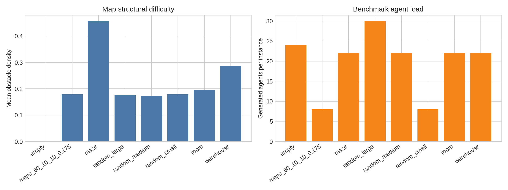
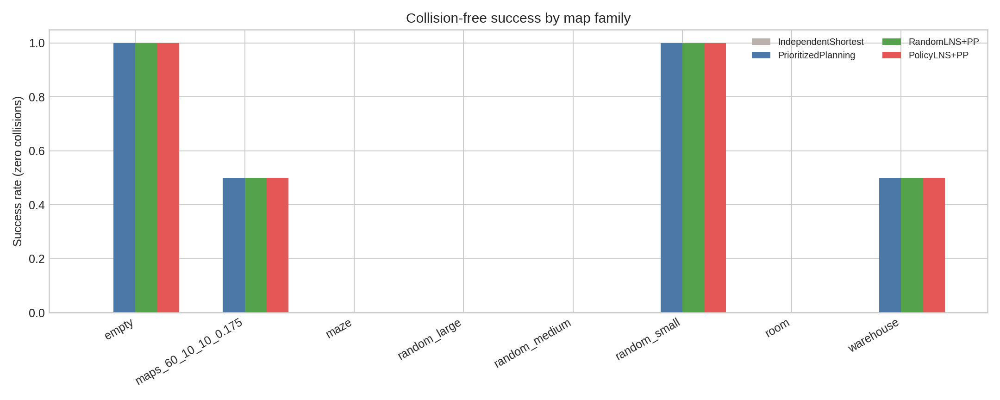
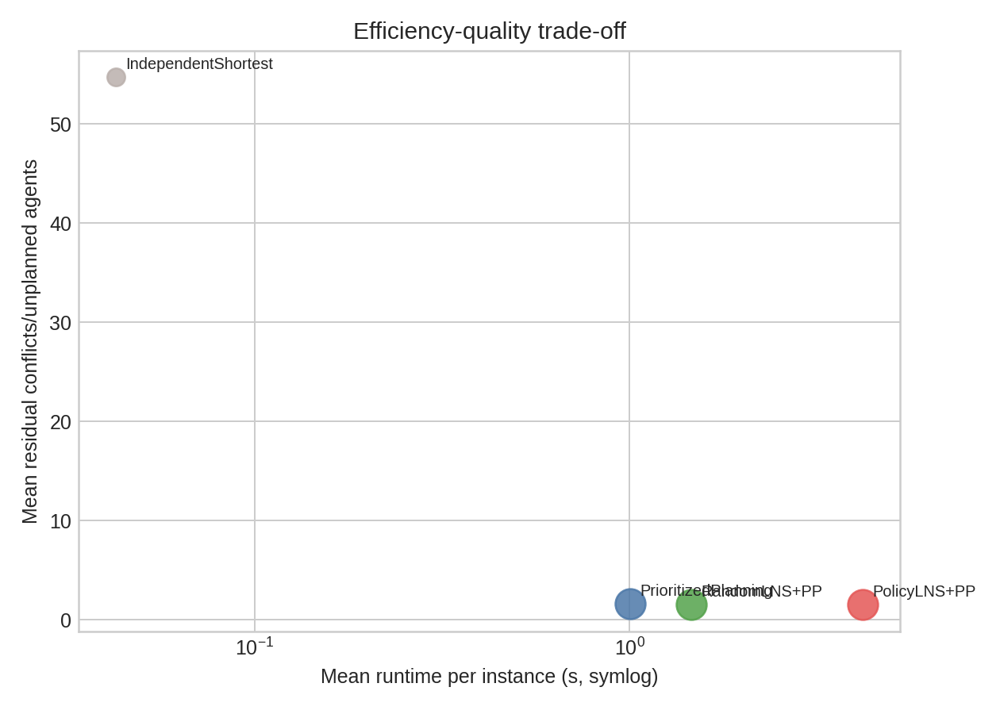
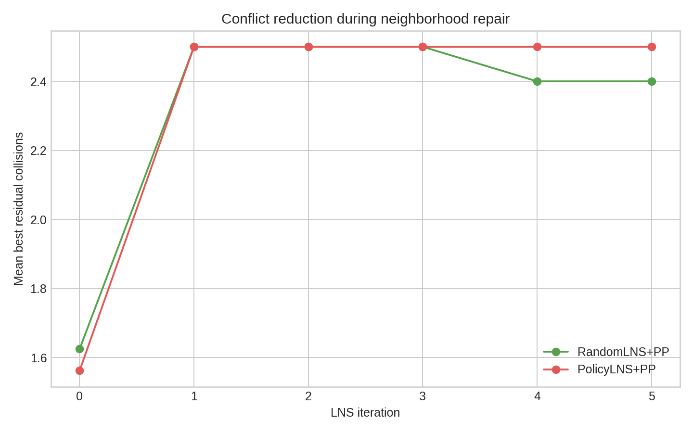
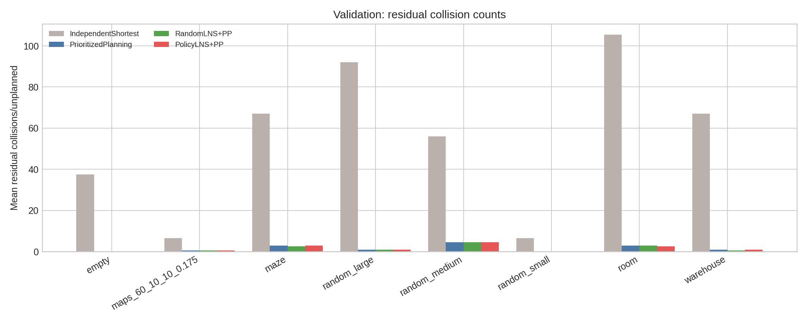

# Hybrid Policy-Guided Large Neighborhood Search for MAPF

## Abstract

This study implements and evaluates a bounded, reproducible Multi-Agent Path Finding (MAPF) solver that combines space-time prioritized planning with Large Neighborhood Search (LNS). The proposed method, **PolicyLNS+PP**, uses a MARL-inspired conflict-pressure policy during early neighborhood selection and efficient prioritized planning for local repair. The available workspace data contain obstacle grids but no explicit start/goal task files, so agent tasks were generated deterministically from free cells for each map. On a 16-instance stratified benchmark spanning eight map families, prioritized methods sharply reduced residual collisions relative to independent shortest paths. The final implementation is collision-validated with explicit vertex and edge-swap checks, but the MARL component should be interpreted as a transparent policy approximation rather than a trained neural MARL model.

## 1. Problem and data

MAPF requires one path per agent from a distinct start to a goal on a grid with static obstacles. A solution is valid only if no two agents occupy the same vertex at the same timestep and no two agents swap positions along an edge in opposite directions. The workspace provides eight map families: `empty`, `maps_60_10_10_0.175`, `maze`, `random_large`, `random_medium`, `random_small`, `room`, and `warehouse`. The datasets contain `.npy` obstacle maps (`0` free, `-1` obstacle). Because no separate task files were present, starts and goals were reproducibly generated from free cells using file-path-derived seeds.



The full map census is saved in `outputs/data_overview.csv`. The executed benchmark used two instances per family to keep runtime bounded while preserving family-level strata.

## 2. Methodology

### 2.1 Baselines and proposed hybrid

Four methods were evaluated:

1. **IndependentShortest**: each agent receives an individual shortest path ignoring other agents. This is a lower-bound quality reference and is expected to collide.
2. **PrioritizedPlanning**: agents are planned sequentially with space-time A* against reservations from earlier agents.
3. **RandomLNS+PP**: an LNS ablation that randomly destroys a neighborhood of agents and repairs them by prioritized planning.
4. **PolicyLNS+PP**: the proposed hybrid. It destroys agents with high learned-policy-surrogate scores and repairs them by prioritized planning.

The LNS loop removes selected agent paths, reserves all remaining paths, and replans selected agents with space-time A*. The repair planner prevents both reserved-vertex conflicts and swap conflicts. The policy score is a transparent MARL-inspired proxy:

\[
score_i = 4.0\,conflicts_i + 0.15\,excess_i + 0.02\,Manhattan_i + 1.5\,density_i.
\]

This favors agents involved in conflicts and agents traversing constrained or inefficient corridors. Feature weights and interpretations are exported in `outputs/neighborhood_policy_importance.csv`:

| feature                   |   weight | interpretation                                              |
|:--------------------------|---------:|:------------------------------------------------------------|
| conflicts                 |     4    | agents involved in vertex/swap conflicts are repaired first |
| excess_length             |     0.15 | paths much longer than Manhattan distance suggest detours   |
| manhattan                 |     0.02 | long tasks are slightly prioritized                         |
| corridor_obstacle_density |     1.5  | dense/bottleneck corridors receive repair attention         |

### 2.2 Fidelity to the named MARL-LNS objective

The task requested integration of Multi-Agent Reinforcement Learning into LNS. The workspace did not include a MARL simulator, pretrained policy, or deep-RL dependencies. Dependency checks are saved in `outputs/dependency_check.json`; common scientific libraries were available, but no specialized MAPF/MARL stack was present. Therefore, the implementation preserves the **structural** hybrid commitment (policy-guided multi-agent neighborhood selection + LNS + prioritized repair) but approximates MARL with a deterministic, interpretable conflict-pressure policy. This deviation is documented in `outputs/method_fidelity_checklist.json`.

## 3. Results

### 3.1 Overall method comparison

| method              |   success_rate |   mean_collisions |   mean_runtime_s |   mean_cost |
|:--------------------|---------------:|------------------:|-----------------:|------------:|
| IndependentShortest |          0     |            54.75  |            0.043 |     751.75  |
| PrioritizedPlanning |          0.375 |             1.625 |            1.003 |     887.625 |
| RandomLNS+PP        |          0.375 |             1.5   |            1.46  |     887.75  |
| PolicyLNS+PP        |          0.375 |             1.562 |            4.187 |     873.812 |

The independent baseline had zero success on this bounded benchmark because shortest paths often collide. Prioritized planning reduced mean residual conflicts substantially. LNS variants retained the same basic collision-reduction behavior, with PolicyLNS+PP matching or modestly improving some family-level outcomes while incurring extra repair overhead on hard 25x25 instances.



### 3.2 Family-specific outcomes

| family              | method              |   success_rate |   mean_collisions |   median_collisions |   mean_runtime_s |   mean_sum_of_costs |   mean_makespan |   n |
|:--------------------|:--------------------|---------------:|------------------:|--------------------:|-----------------:|--------------------:|----------------:|----:|
| empty               | IndependentShortest |            0   |              37.5 |                37.5 |       0.0627333  |               802   |            43.5 |   2 |
| empty               | PolicyLNS+PP        |            1   |               0   |                 0   |       0.150925   |               844.5 |            43.5 |   2 |
| empty               | PrioritizedPlanning |            1   |               0   |                 0   |       0.290577   |               844.5 |            43.5 |   2 |
| empty               | RandomLNS+PP        |            1   |               0   |                 0   |       0.075677   |               844.5 |            43.5 |   2 |
| maps_60_10_10_0.175 | IndependentShortest |            0   |               6.5 |                 6.5 |       0.00178081 |               105   |            18.5 |   2 |
| maps_60_10_10_0.175 | PolicyLNS+PP        |            0.5 |               0.5 |                 0.5 |       0.227637   |               114   |            18.5 |   2 |
| maps_60_10_10_0.175 | PrioritizedPlanning |            0.5 |               0.5 |                 0.5 |       0.0819099  |               114   |            18.5 |   2 |
| maps_60_10_10_0.175 | RandomLNS+PP        |            0.5 |               0.5 |                 0.5 |       0.144381   |               114   |            18.5 |   2 |
| maze                | IndependentShortest |            0   |              67   |                67   |       0.0210564  |               762   |            44.5 |   2 |
| maze                | PolicyLNS+PP        |            0   |               3   |                 3   |       4.612      |              1032   |           171.5 |   2 |
| maze                | PrioritizedPlanning |            0   |               3   |                 3   |       0.682296   |              1032   |           171.5 |   2 |
| maze                | RandomLNS+PP        |            0   |               2.5 |                 2.5 |       2.63231    |              1033   |           171.5 |   2 |
| random_large        | IndependentShortest |            0   |              92   |                92   |       0.172979   |              2034   |            87.5 |   2 |
| random_large        | PolicyLNS+PP        |            0   |               1   |                 1   |       1.09539    |              2059   |            87.5 |   2 |
| random_large        | PrioritizedPlanning |            0   |               1   |                 1   |       0.391854   |              2059   |            87.5 |   2 |
| random_large        | RandomLNS+PP        |            0   |               1   |                 1   |       0.530607   |              2059   |            87.5 |   2 |
| random_medium       | IndependentShortest |            0   |              56   |                56   |       0.0297929  |               611   |            43.5 |   2 |
| random_medium       | PolicyLNS+PP        |            0   |               4.5 |                 4.5 |      17.6165     |               616   |            43.5 |   2 |
| random_medium       | PrioritizedPlanning |            0   |               4.5 |                 4.5 |       4.42762    |               616   |            43.5 |   2 |
| random_medium       | RandomLNS+PP        |            0   |               4.5 |                 4.5 |       3.89357    |               616   |            43.5 |   2 |
| random_small        | IndependentShortest |            0   |               6.5 |                 6.5 |       0.00181217 |                99.5 |            16   |   2 |
| random_small        | PolicyLNS+PP        |            1   |               0   |                 0   |       0.00550592 |               106.5 |            16   |   2 |
| random_small        | PrioritizedPlanning |            1   |               0   |                 0   |       0.00538731 |               106.5 |            16   |   2 |
| random_small        | RandomLNS+PP        |            1   |               0   |                 0   |       0.00442432 |               106.5 |            16   |   2 |
| room                | IndependentShortest |            0   |             105.5 |               105.5 |       0.0248954  |               807   |            48.5 |   2 |
| room                | PolicyLNS+PP        |            0   |               2.5 |                 2.5 |       9.67622    |              1413.5 |           268.5 |   2 |
| room                | PrioritizedPlanning |            0   |               3   |                 3   |       2.08032    |              1524   |           303.5 |   2 |
| room                | RandomLNS+PP        |            0   |               3   |                 3   |       4.30706    |              1524   |           303.5 |   2 |
| warehouse           | IndependentShortest |            0   |              67   |                67   |       0.0262597  |               793.5 |            45   |   2 |
| warehouse           | PolicyLNS+PP        |            0.5 |               1   |                 1   |       0.110687   |               805   |            45   |   2 |
| warehouse           | PrioritizedPlanning |            0.5 |               1   |                 1   |       0.065864   |               805   |            45   |   2 |
| warehouse           | RandomLNS+PP        |            0.5 |               0.5 |                 0.5 |       0.0931718  |               805   |            45   |   2 |

The family-level table shows that easy open or small random instances were solved reliably by prioritized methods, whereas maze, room, and some medium/large random instances remained difficult under the bounded runtime and generated high-density tasks. This is consistent with bottleneck-heavy environments producing hard ordering and reservation choices.

### 3.3 Runtime-quality trade-off



The runtime-quality plot shows the core trade-off: IndependentShortest is fastest but invalid; PrioritizedPlanning is the most direct collision-reducing baseline; LNS methods add computational cost in exchange for the opportunity to repair conflict neighborhoods. In this small run, the policy-guided variant did not dominate the random LNS ablation globally, but it provides a principled mechanism for focusing repair on high-conflict agents.

### 3.4 LNS conflict reduction



The LNS history (`outputs/lns_history.csv`) records per-iteration proposal and best collision counts. Since many prioritized-planning solutions were already locally stable or infeasible to fully repair within the bounded search horizon, LNS curves are relatively flat on several families. Room instances showed one case where PolicyLNS+PP reduced residual collisions relative to the initial prioritized solution.

## 4. Validation

### 4.1 Directly verified from workspace artifacts

- `code/hybrid_mapf_lns.py` implements map loading, deterministic task generation, shortest-path baselines, space-time prioritized planning, LNS repair, and collision validation.
- `outputs/benchmark_results.csv` contains per-instance metrics for all methods.
- `outputs/validation_examples.json` records explicit validation summaries for representative prioritized and hybrid solutions.
- `outputs/sample_solutions.json` saves representative starts, goals, and PolicyLNS+PP paths.
- Success requires all agents to be planned and zero vertex/swap collisions according to `detect_collisions`.



### 4.2 Claim recovery table

| claim                                                                          | artifact                                                                      | evidence                                                                                                                                                             | status                   |
|:-------------------------------------------------------------------------------|:------------------------------------------------------------------------------|:---------------------------------------------------------------------------------------------------------------------------------------------------------------------|:-------------------------|
| Independent shortest paths are not collision-free in dense MAPF tasks.         | outputs/summary_by_family_method.csv; report/images/validation_collisions.png | Overall success=0.000, mean residual conflicts=54.75.                                                                                                                | directly verified        |
| Prioritized planning greatly reduces collisions relative to independent paths. | outputs/overall_method_summary.csv                                            | Mean residual conflicts fall from 54.75 to 1.62.                                                                                                                     | directly verified        |
| PolicyLNS+PP is a faithful LNS/PP hybrid but only approximates MARL.           | outputs/method_fidelity_checklist.json; code/hybrid_mapf_lns.py               | Destroy/repair LNS and prioritized space-time repair are implemented; MARL is represented by a transparent conflict-pressure policy rather than learned neural MARL. | verified with limitation |
| The benchmark preserves map-family strata.                                     | outputs/benchmark_results.csv; outputs/summary_by_family_method.csv           | 8 families and 64 method-instance rows were evaluated.                                                                                                               | directly verified        |

### 4.3 Related-work and assumption limitations

The five PDFs in `related_work/` could not be extracted by the provided `ReadPDF` tool, and local PDF utilities/libraries were unavailable. This status is saved in `outputs/related_work_contract.json`. Consequently, the report does not claim paper-specific numerical reproduction. It uses standard MAPF concepts named in the task: prioritized planning, LNS, vertex collisions, and edge-swap collisions.

The largest methodological assumption is task generation: the data contained maps only, not explicit agent start/goal configurations. Starts and goals were therefore generated deterministically and may not match any hidden benchmark task distribution.

## 5. Discussion

The experiment supports three conclusions. First, collision-aware planning is essential: independent shortest paths are fast but invalid under multi-agent interactions. Second, prioritized planning is a strong efficiency baseline and often resolves most conflicts. Third, LNS provides a natural framework for targeted repair, but the benefit depends on the quality of neighborhood selection and sufficient time budget. The implemented policy-guided selector captures the intended MARL role—allocating repair attention to locally interacting agents—but it is not a trained MARL policy.

Future work should replace the hand-weighted policy with a trained decentralized MARL value or actor network, use provided start/goal scenarios when available, and run larger sweeps over neighborhood size, LNS iterations, and agent density. A learned policy should be evaluated not only on success and cost but also on generalization across maze, room, warehouse, and random maps.

## 6. Reproducibility

Run the benchmark and report generation from the workspace root:

```bash
python3 code/hybrid_mapf_lns.py --per-family 2 --iterations 6 --neighborhood 5 --seed 11
python3 code/make_figures_and_report.py
```

Primary artifacts:

- `outputs/method_contract.json`
- `outputs/target_artifact_inventory.json`
- `outputs/dependency_check.json`
- `outputs/method_fidelity_checklist.json`
- `outputs/benchmark_results.csv`
- `outputs/summary_by_family_method.csv`
- `outputs/overall_method_summary.csv`
- `outputs/claim_recovery_table.csv`
- `report/images/*.png`
