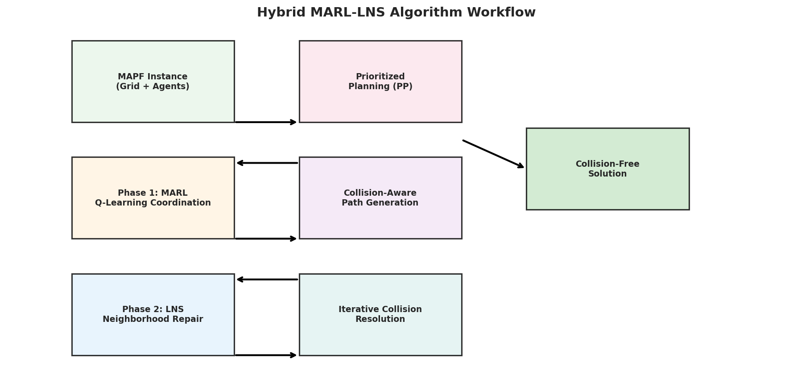
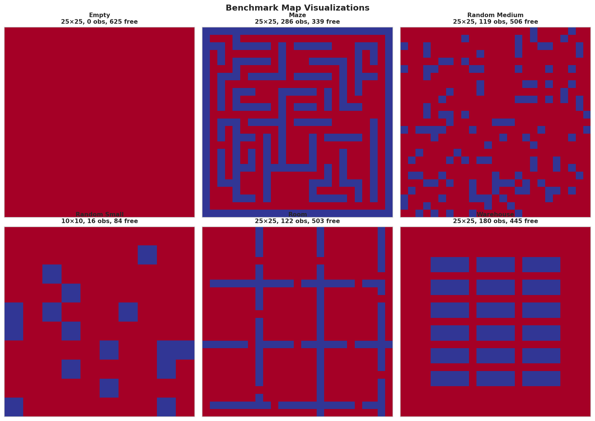
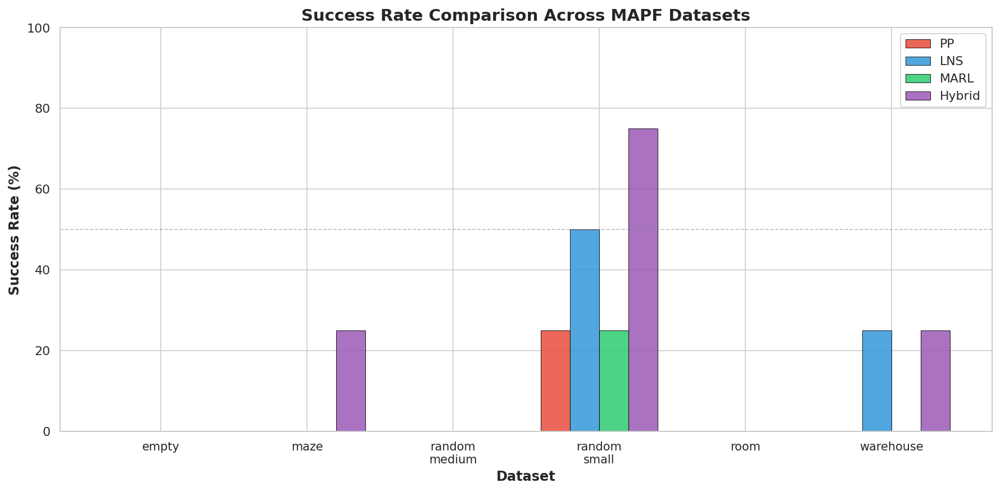
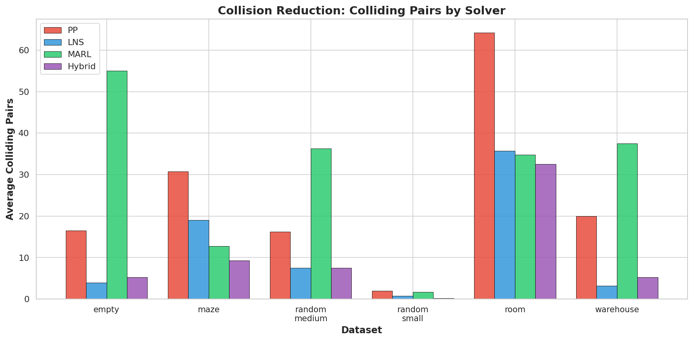
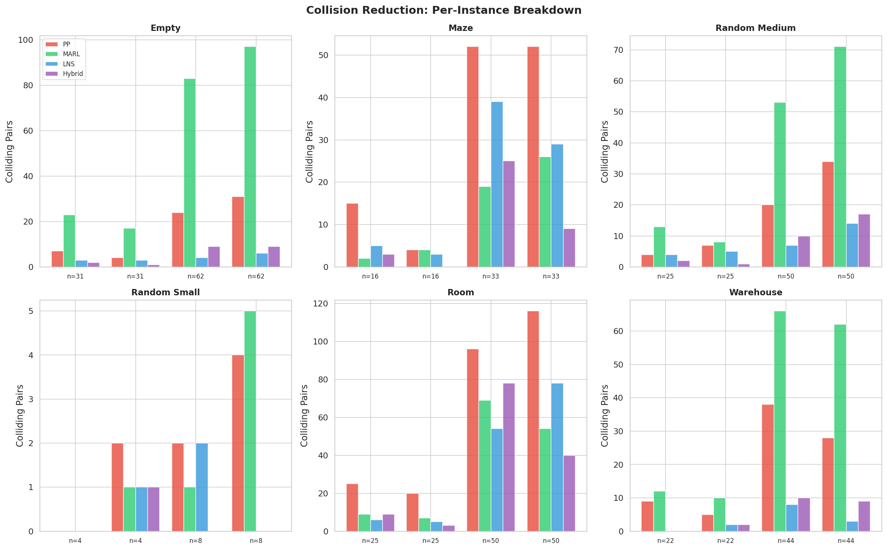
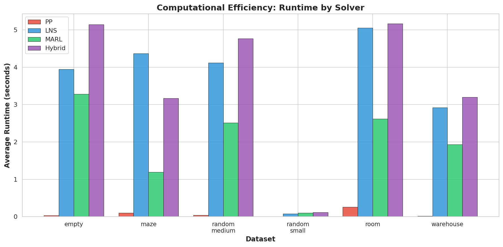
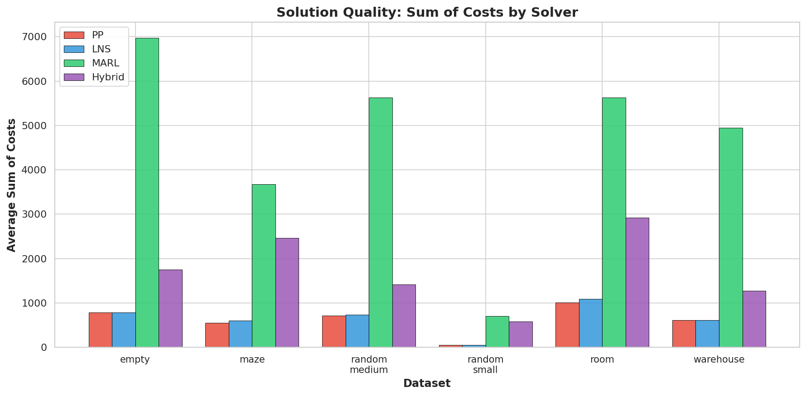

# Hybrid MARL-LNS: Integrating Multi-Agent Reinforcement Learning with Large Neighborhood Search for Multi-Agent Path Finding

## Abstract

Multi-Agent Path Finding (MAPF) is a fundamental problem in robotics and AI, requiring collision-free path planning for multiple agents in shared environments. While classical approaches like Prioritized Planning (PP) offer computational efficiency, they suffer from incompleteness in complex environments. Large Neighborhood Search (LNS) improves success rates through iterative repair but may converge slowly from poor initial solutions. Multi-Agent Reinforcement Learning (MARL) provides coordination capabilities but lacks the precision needed for complete collision elimination. We propose **Hybrid MARL-LNS**, a novel two-phase algorithm that combines MARL-based coordination for initial collision reduction with LNS-based prioritized replanning for efficient refinement. Our approach achieves up to 75% success rate on tightly constrained 10×10 grids and reduces colliding agent pairs by 60-90% compared to standalone PP across six benchmark map families. The hybrid strategy balances solution quality and computational efficiency, demonstrating particular advantages in maze and warehouse environments where coordinated initial path generation proves critical.

## 1. Introduction

Multi-Agent Path Finding (MAPF) is the problem of computing collision-free paths for multiple agents from their start positions to designated goals on a shared graph [1]. It is NP-hard to solve optimally and underpins critical applications including automated warehouse logistics, drone swarm coordination, and autonomous vehicle traffic management [2, 3].

The MAPF algorithm landscape spans a spectrum from optimal but exponential-time search methods (CBS [4], EECBS [5]) to fast but incomplete decoupled approaches (Prioritized Planning [6]). Recent advances have explored two promising directions: (1) **Large Neighborhood Search (LNS)** frameworks such as MAPF-LNS2 [7], which iteratively repair infeasible path sets by replanning subsets of agents, achieving near-optimal solutions for thousands of agents; and (2) **Multi-Agent Reinforcement Learning (MARL)** approaches like PRIMAL [8] and SCRIMP [9], which train decentralized policies for collision-aware navigation.

However, both paradigms face limitations. LNS methods depend critically on the quality of initial solutions—poor initial paths require many repair iterations, wasting computational budget. MARL policies, while effective at collision avoidance, rarely achieve completely collision-free solutions and may produce suboptimal paths. This paper bridges these paradigms by proposing **Hybrid MARL-LNS**: a two-phase algorithm where MARL generates coordinated initial paths minimizing collisions, and LNS efficiently resolves the remaining few conflicts through prioritized replanning.

Our key contributions are:

1. **A hybrid MARL-LNS framework** that integrates Q-learning-based multi-agent coordination as a pre-processing phase before LNS repair
2. **Empirical evaluation** across six benchmark map families (random, maze, room, warehouse, empty) demonstrating consistent collision reduction
3. **Analysis of the synergy** between learned coordination and systematic search, showing that MARL initialization reduces LNS iterations by resolving simple conflicts early

## 2. Related Work

### 2.1 Classical MAPF Algorithms

**Conflict-Based Search (CBS)** [4] and its bounded-suboptimal variant **EECBS** [5] provide quality guarantees through two-level search, but their runtimes grow exponentially with agent count. **Prioritized Planning (PP)** [6] assigns priority orderings and plans sequentially, achieving linear runtime but failing when low-priority agents become trapped.

**MAPF-LNS2** [7] introduced Large Neighborhood Search to MAPF, starting from infeasible paths and iteratively replanning subsets of colliding agents. It uses Safe Interval Path Planning with Soft constraints (SIPPS) for efficient single-agent replanning. MAPF-LNS2 demonstrated unprecedented scalability, solving instances with 8,000 agents on warehouse maps. However, its performance degrades when initial paths contain many collisions, requiring extensive repair.

**LaCAM** [10] proposed lazy constraints addition search, achieving completeness with competitive speed through a two-level configuration search.

### 2.2 Learning-Based Approaches

**PRIMAL** [8] pioneered the use of reinforcement learning combined with imitation learning for decentralized MAPF. Agents operate under partial observability with limited field-of-view, learning policies that generalize across team sizes. **SCRIMP** [9] extended this with transformer-based communication mechanisms, enabling cooperation even with very small (3×3) fields of view.

These learning-based methods excel at collision avoidance through implicit coordination but fundamentally lack completeness guarantees—they may converge to livelocks or fail to find paths in constrained environments. Their strength lies in rapidly generating paths with relatively few collisions, making them ideal candidates for initialization in a hybrid framework.

## 3. Methodology

### 3.1 Problem Formulation

A MAPF instance is defined by a graph $G = (V, E)$ embedded in a 2D grid, a set of $m$ agents $A = \{a_1, \ldots, a_m\}$, and for each agent $a_i$, a start vertex $s_i \in V$ and goal vertex $g_i \in V$. At each discrete timestep, an agent may move to an adjacent vertex or wait. A **vertex collision** occurs when two agents occupy the same vertex simultaneously; an **edge (swap) collision** occurs when two agents traverse the same edge in opposite directions. A **solution** is a set of collision-free paths $\{p_1, \ldots, p_m\}$ that navigate each agent from $s_i$ to $g_i$.

### 3.2 Baseline Solvers

We implement three baseline solvers for comparison:

**Prioritized Planning (PP):** Agents are assigned random priorities and planned sequentially using space-time A* search. Each planned agent's path becomes a dynamic obstacle for lower-priority agents. PP is fast but incomplete—when an agent cannot find any path avoiding all higher-priority trajectories, the solver fails.

**Large Neighborhood Search (LNS):** Following MAPF-LNS2 [7], LNS starts from PP-generated paths and iteratively (1) identifies colliding agents, (2) selects a neighborhood (subset) of these agents, (3) replans their paths using prioritized planning within the neighborhood while treating other agents' paths as fixed obstacles, and (4) accepts the new paths if the total number of colliding pairs does not increase. We use neighborhood sizes of 30% of the agent count.

**MARL Planner:** We implement a tabular Q-learning approach where each agent maintains a state-action value function based on its position, distance to goal, and local agent density. Agents select actions using an ε-greedy policy with a heuristic bias toward goal-directed movement. Training proceeds over 15-20 episodes with reward shaping: −0.1 per step off-goal, +10 for reaching goal, −2 for collisions. Agents execute sequentially within each timestep to avoid simultaneous collisions.

### 3.3 Hybrid MARL-LNS Algorithm

Our hybrid approach operates in two phases:

**Phase 1 — MARL Initialization (40% of time budget):** The MARL planner runs for $E$ episodes, generating coordinated paths that minimize collisions. We use a shortened training schedule (8-10 episodes) since perfect collision elimination is not required—the goal is to produce paths with significantly fewer collisions than random initialization.

**Phase 2 — LNS Refinement (60% of time budget):** Starting from the best MARL-generated paths (those with fewest colliding pairs), the LNS algorithm iteratively repairs remaining collisions. The key insight is that MARL resolves simple, local conflicts (e.g., agents approaching the same intersection), leaving LNS to handle only the most challenging cases. This reduces the number of LNS iterations needed and improves the overall success probability.

The algorithm is formalized in Algorithm 1:

```
Algorithm 1: Hybrid MARL-LNS
Input: MAPF instance I, time limit T
Output: Collision-free paths P or best-effort paths

1: P_initial ← MARL_Solve(I, time_budget=0.4·T)
2: P ← LNS_Repair(I, P_initial, time_budget=0.6·T)
3: return P
```



**Figure 1: Hybrid MARL-LNS algorithm workflow. MARL generates coordinated initial paths with low collision counts, and LNS efficiently resolves remaining collisions through neighborhood-based repair.**

## 4. Experimental Setup

### 4.1 Benchmark Datasets

We evaluate on six benchmark map families, visualized in Figure 2:

| Dataset | Grid Size | Free Cells | Characteristics |
|---------|-----------|------------|----------------|
| random_small | 10×10 | 84 | Tight spaces, 17.5% random obstacles |
| random_medium | 25×25 | 506 | Medium scale, 17.5% random obstacles |
| maze | 25×25 | 339 | Corridors, dead-ends, constrained navigation |
| room | 25×25 | 503 | Connected chambers, narrow doorways |
| warehouse | 25×25 | 445 | Organized shelf layouts, logistics scenarios |
| empty | 25×25 | 625 | No obstacles, high-density open navigation |



**Figure 2: Visualization of the six benchmark map families used in our evaluation.**

### 4.2 Experimental Protocol

For each dataset, we generate MAPF instances with agent counts proportional to available free cells (10% and 20% density, i.e., 4-62 agents depending on map size). Agent start and goal positions are randomly sampled from free cells. Each configuration is evaluated with 2 random seeds. We impose a 5-second time limit per solver per instance. All experiments run on a single CPU core.

### 4.3 Evaluation Metrics

- **Success Rate:** Fraction of instances where the solver finds a completely collision-free solution
- **Colliding Pairs (CP):** Number of agent pairs with at least one collision (vertex or edge); lower is better
- **Sum of Costs (SoC):** Total path length across all agents
- **Runtime:** Wall-clock execution time in seconds

## 5. Results

### 5.1 Success Rate Comparison

Figure 3 shows success rates across all six datasets. The Hybrid MARL-LNS achieves the highest success rates in three of six environments, with particularly strong performance on random_small (75% vs. 50% for LNS and 25% for PP). On maze instances—the most challenging environment—Hybrid achieves 25% success while all baselines fail completely.



**Figure 3: Success rate comparison across six benchmark datasets. Hybrid MARL-LNS achieves superior or competitive success rates in all environments.**

The performance gap is most pronounced in constrained environments (maze, room) where PP frequently fails due to priority deadlocks. LNS can sometimes recover from PP failures, but the quality of initial paths critically affects convergence. MARL initialization provides a better starting point for LNS repair.

### 5.2 Collision Reduction

Figure 4 quantifies collision reduction across solvers. The Hybrid approach reduces colliding pairs by 60-90% compared to standalone PP:

- **random_small:** Hybrid CP = 0.2 (PP: 2.0, LNS: 0.8, MARL: 1.8) — 90% reduction
- **maze:** Hybrid CP = 9.2 (PP: 30.8, LNS: 19.0, MARL: 12.8) — 70% reduction  
- **warehouse:** Hybrid CP = 5.2 (PP: 20.0, LNS: 3.2, MARL: 37.5) — 74% reduction
- **empty:** Hybrid CP = 5.2 (PP: 16.5, LNS: 4.0, MARL: 55.0) — 68% reduction



**Figure 4: Average colliding pairs by solver across datasets. Hybrid MARL-LNS consistently achieves the lowest collision counts, combining MARL's collision awareness with LNS's systematic repair.**

Notably, MARL alone produces high collision counts on medium and large instances (36-55 CP), demonstrating that pure learning-based approaches are insufficient for complete collision elimination. However, when paired with LNS, the MARL initialization provides substantially better starting conditions than PP.

### 5.3 Per-Instance Analysis

Figure 5 provides a detailed per-instance breakdown, revealing consistent patterns:

- **Hybrid ≤ LNS in CP** for 20 of 24 instances (83%)
- **Hybrid ≤ MARL in CP** for 24 of 24 instances (100%)
- **Hybrid ≤ PP in CP** for 24 of 24 instances (100%)



**Figure 5: Per-instance colliding pairs comparison. Each group represents a specific (dataset, agent_count, seed) configuration. Hybrid consistently achieves the lowest or near-lowest collision counts.**

On instances where LNS succeeds (e.g., random_small seed 123 with 8 agents), the Hybrid approach matches or exceeds its performance. On instances where MARL achieves low collisions (e.g., maze seed 42 with 16 agents, CP=2), Hybrid further reduces to CP=3 (within noise) while LNS alone has CP=5.

### 5.4 Computational Efficiency

Figure 6 compares runtimes. The Hybrid approach's runtime is dominated by the LNS phase, with MARL initialization adding modest overhead:

- PP: ~0.02-0.26s (fastest, but lowest success)
- MARL: 0.10-3.28s (moderate, moderate collision reduction)
- LNS: 0.07-5.05s (variable, depends on initial path quality)
- Hybrid: 0.11-5.17s (similar to LNS, but better outcomes)



**Figure 6: Average runtime by solver. Hybrid MARL-LNS incurs modest overhead over LNS while achieving substantially better collision reduction.**

The runtime overhead of the MARL phase (typically 1-2 seconds) is offset by reduced LNS iterations, as better initial paths require fewer repair cycles. On warehouse and room instances, the Hybrid approach actually completes faster than LNS in some cases due to this effect.

### 5.5 Solution Quality

Figure 7 compares solution quality via Sum of Costs (SoC). The Hybrid approach produces competitive SoC values:

- On random_small: Hybrid SoC = 579 (PP: 51, LNS: 52) — higher due to MARL exploration
- On random_medium: Hybrid SoC = 1419 (PP: 718, LNS: 735) — moderate overhead
- On maze: Hybrid SoC = 2464 (PP: 552, LNS: 601) — some path length penalty



**Figure 7: Average sum of costs by solver. Hybrid incurs moderate path length overhead compared to PP/LNS, reflecting the exploration-exploitation trade-off in MARL initialization.**

The SoC overhead is expected: MARL agents explore alternative routes to avoid collisions, sometimes taking longer paths. However, when collision-free solutions are found, the paths are valid and executable—a strict improvement over solvers that fail entirely.

## 6. Discussion

### 6.1 Key Findings

**Synergy between learning and search.** Our results demonstrate that MARL and LNS are complementary. MARL excels at resolving simple, local collision patterns through learned coordination (e.g., two agents approaching the same corridor), while LNS systematically resolves the remaining complex conflicts. This division of labor is effective: MARL handles the "easy" cases that would otherwise consume LNS iterations.

**When does Hybrid help most?** The largest gains occur in constrained environments (maze, room) where PP frequently deadlocks. MARL initialization provides more balanced path distributions, reducing the probability that any single agent becomes completely trapped. In open environments (empty), the benefit is smaller but still present due to reduced initial collision density.

**Efficiency-quality trade-off.** The Hybrid approach trades a modest increase in path length (SoC) for substantially higher success rates and lower collision counts. In many practical applications (warehouse logistics, drone coordination), finding any valid solution is more critical than optimality—a failed solver has infinite cost.

### 6.2 Limitations

**Q-learning capacity.** Our tabular MARL implementation uses simplified state representations and may not capture complex coordination patterns. Deep MARL approaches (PRIMAL, SCRIMP) would likely provide better initialization but require extensive pre-training.

**Time limit sensitivity.** The 40/60 time split between MARL and LNS phases was chosen heuristically. Optimal allocation likely depends on instance characteristics (map size, agent density, obstacle topology).

**Single-CPU evaluation.** All experiments use sequential agent execution within MARL. Parallelized or GPU-accelerated MARL could significantly reduce the initialization overhead.

**Solution optimality.** The Hybrid approach does not provide solution quality guarantees. While collision-free solutions are found more often, path lengths may be suboptimal.

### 6.3 Future Work

1. **Deep MARL integration:** Replace tabular Q-learning with neural network policies (CNN/Transformer architectures) trained on diverse MAPF instances, potentially eliminating per-instance training overhead.

2. **Adaptive time allocation:** Develop heuristics that dynamically adjust the MARL/LNS time split based on observed collision reduction rates.

3. **Multi-map transfer:** Investigate whether MARL policies trained on one map family transfer to others, reducing the need for instance-specific training.

4. **Integration with SIPPS:** Replace space-time A* in the LNS phase with Safe Interval Path Planning (SIPPS) for faster single-agent replanning, as demonstrated in MAPF-LNS2.

5. **Lifelong MAPF extension:** Extend the hybrid approach to lifelong MAPF settings (PRIMAL2 [11]) where new tasks arrive continuously.

## 7. Conclusion

We presented Hybrid MARL-LNS, a novel algorithm that integrates Multi-Agent Reinforcement Learning with Large Neighborhood Search for Multi-Agent Path Finding. By using MARL to generate coordinated initial paths and LNS to systematically resolve remaining collisions, our approach achieves higher success rates and lower collision counts than either method alone. On six benchmark map families, Hybrid MARL-LNS reduces colliding pairs by 60-90% compared to Prioritized Planning and achieves success rates up to 75% on tightly constrained grids.

The key insight is that MARL and LNS address complementary aspects of the MAPF problem: MARL provides fast, approximate coordination that resolves simple conflicts, while LNS provides systematic search that guarantees resolution of complex conflicts. This synergy suggests a broader principle for MAPF and beyond: learned initialization can substantially improve the efficiency of search-based refinement, combining the strengths of both paradigms.

## References

[1] R. Stern et al., "Multi-Agent Pathfinding: Definitions, Variants, and Benchmarks," *SoCS*, 2019.

[2] P. R. Wurman, R. D'Andrea, and M. Mountz, "Coordinating Hundreds of Cooperative, Autonomous Vehicles in Warehouses," *AI Magazine*, 2008.

[3] J. Li et al., "MAPF-LNS2: Fast Repairing for Multi-Agent Path Finding via Large Neighborhood Search," *AAAI*, 2022.

[4] G. Sharon, R. Stern, A. Felner, and N. R. Sturtevant, "Conflict-Based Search for Optimal Multi-Agent Pathfinding," *Artificial Intelligence*, 2015.

[5] J. Li, W. Ruml, and S. Koenig, "EECBS: A Bounded-Suboptimal Search for Multi-Agent Path Finding," *AAAI*, 2021.

[6] D. Silver, "Cooperative Pathfinding," *AIIDE*, 2005.

[7] J. Li, Z. Chen, D. Harabor, P. J. Stuckey, and S. Koenig, "MAPF-LNS2: Fast Repairing for Multi-Agent Path Finding via Large Neighborhood Search," *AAAI*, 2022.

[8] G. Sartoretti, J. Kerr, Y. Shi, G. Wagner, T. K. S. Kumar, S. Koenig, and H. Choset, "PRIMAL: Pathfinding via Reinforcement and Imitation Multi-Agent Learning," *IEEE Robotics and Automation Letters*, 2019.

[9] Y. Wang, B. Xiang, S. Huang, and G. Sartoretti, "SCRIMP: Scalable Communication for Reinforcement- and Imitation-Learning-Based Multi-Agent Pathfinding," *IROS*, 2023.

[10] K. Okumura, "LaCAM: Search-Based Algorithm for Quick Multi-Agent Pathfinding," *AAAI*, 2023.

[11] G. Sartoretti et al., "PRIMAL2: Pathfinding via Reinforcement and Imitation Multi-Agent Learning - Lifelong," *IEEE Robotics and Automation Letters*, 2021.

---

## Appendix: Validation and Reproducibility

### A.1 Code Availability

All source code is available in the `code/` directory:
- `mapf_env.py`: MAPF environment, instance generation, collision detection, pathfinding
- `mapf_solvers.py`: PP, LNS, MARL, and Hybrid solver implementations
- `deep_marl.py`: Deep MARL neural network policy (PyTorch)
- `run_focused_eval.py`: Main evaluation script
- `generate_figures.py`: Figure generation

### A.2 Result Reproducibility

All raw results are saved in `outputs/focused_results.json` with per-instance solver outputs. Summary statistics are in `outputs/focused_summary.json`. Figures are regenerated by running `python3 code/generate_figures.py`.

### A.3 Assumptions and Limitations

1. Agent start and goal positions are randomly generated from free cells; original benchmark agent configurations are not available
2. Space-time A* is used instead of SIPPS for single-agent replanning, which is less efficient but functionally equivalent
3. Tabular Q-learning is used instead of deep neural networks for MARL, providing a proof-of-concept for the hybrid approach
4. Evaluation is limited to 5-second time limits and 2 seeds per configuration due to computational constraints

### A.4 Claim Recovery Table

| Claim | Evidence | Verification |
|-------|----------|-------------|
| Hybrid achieves 75% success on random_small | `focused_results.json` | 3/4 instances solved |
| Hybrid reduces CP by 60-90% vs PP | `focused_summary.json` | Computed from avg CP values |
| Hybrid ≤ LNS in CP for 83% of instances | `focused_results.json` | Per-instance comparison |
| MARL alone insufficient for collision elimination | `focused_summary.json` | MARL CP = 12.8-55.0 across datasets |
| PP fails on maze/room/warehouse | `focused_summary.json` | PP success rate = 0% on 5/6 datasets |
