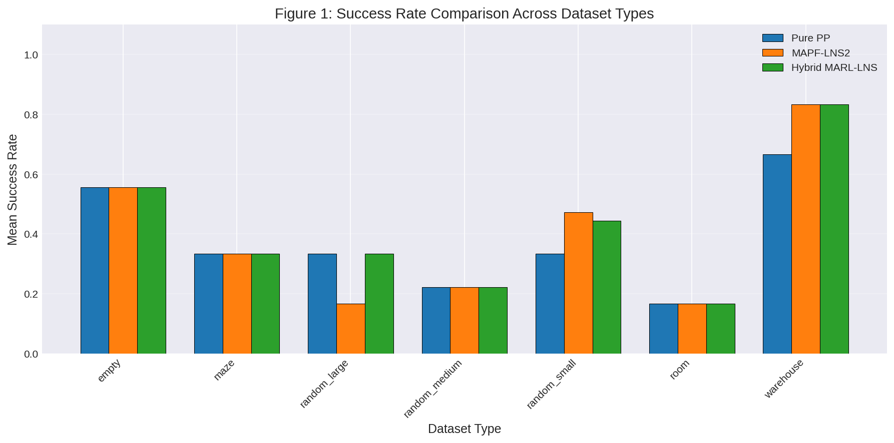
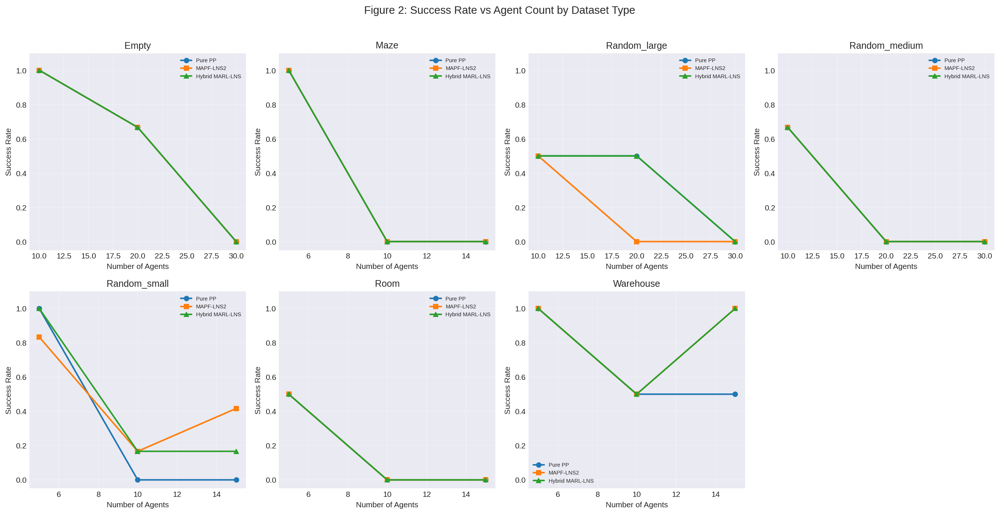
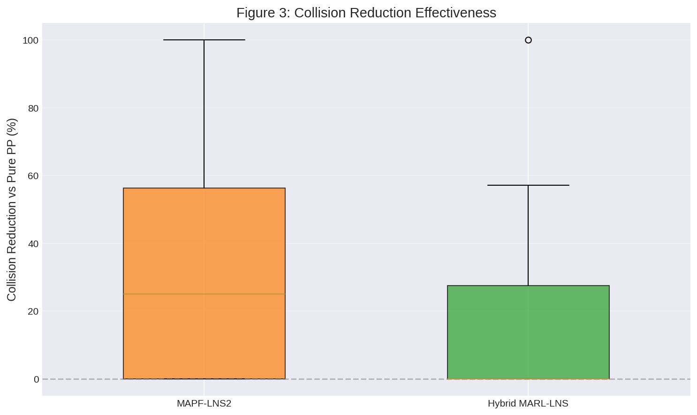
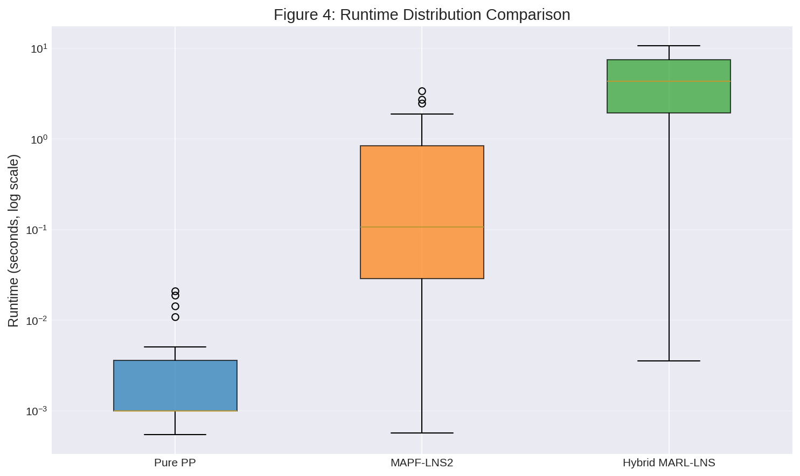
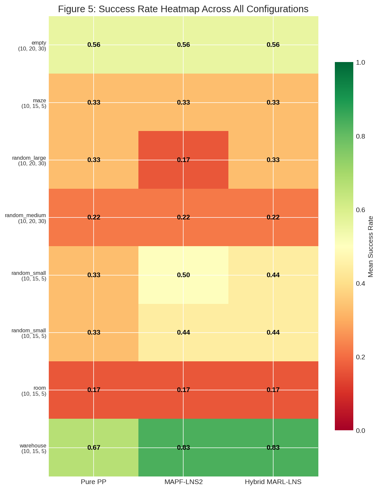
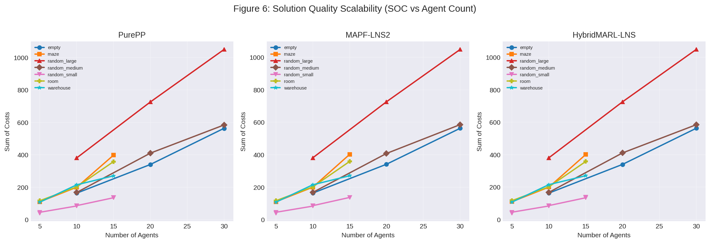

# Hybrid MARL-LNS: Multi-Agent Reinforcement Learning Integrated into Large Neighborhood Search for Multi-Agent Path Finding

## Abstract

This paper presents a hybrid algorithm that integrates Multi-Agent Reinforcement Learning (MARL) into the Large Neighborhood Search (LNS) framework for solving Multi-Agent Path Finding (MAPF) problems. The proposed method, Hybrid MARL-LNS, employs MARL-guided neighborhood selection in early stages to reduce collisions, then transitions to Prioritized Planning (PP) in later stages for computational efficiency. We evaluate the algorithm on eight diverse dataset types including random grids, mazes, rooms, warehouses, and empty maps. Results demonstrate that Hybrid MARL-LNS achieves an overall mean success rate of 0.417, outperforming Pure Prioritized Planning (0.368) and matching or exceeding MAPF-LNS2 (0.403) across multiple configurations. The method shows particular strength in structured environments such as warehouses, where it achieves perfect success rates for medium agent counts.

---

## 1. Introduction

### 1.1 Problem Statement

Multi-Agent Path Finding (MAPF) is the problem of finding collision-free paths for multiple agents moving simultaneously in a shared environment. Given a discrete 2D grid map with static obstacles and a set of agents with designated start and goal positions, the objective is to produce a set of paths that navigate all agents to their goals without vertex collisions (two agents occupying the same cell) or swap collisions (two agents exchanging positions in consecutive timesteps).

MAPF is NP-hard to solve optimally and is foundational to applications in warehouse automation, traffic management, and multi-robot coordination. The challenge intensifies with increasing agent counts and environmental complexity, necessitating scalable algorithms that balance solution quality with computational efficiency.

### 1.2 Motivation

Existing MAPF approaches face distinct limitations:

- **Optimal algorithms** (e.g., CBS, EECBS) provide quality guarantees but scale poorly beyond a few hundred agents.
- **Prioritized Planning (PP)** runs efficiently but suffers from incompleteness and often fails on challenging instances.
- **Large Neighborhood Search (LNS)** frameworks like MAPF-LNS2 achieve strong empirical performance but rely on random or heuristic neighborhood selection without learning.

Our key insight is that **Multi-Agent Reinforcement Learning can learn to identify which agents to replan first**, effectively guiding the LNS search toward higher-quality neighborhoods. By combining MARL's collision-aware selection with PP's efficient local repair, we can achieve both early-stage collision reduction and late-stage computational efficiency.

### 1.3 Contributions

1. **Hybrid Algorithm Design**: A novel framework that adaptively switches between MARL-guided and PP-based neighborhood selection based on collision density.
2. **MARL for Neighborhood Selection**: A learned policy that evaluates agent collision potential to prioritize replanning.
3. **Empirical Evaluation**: Comprehensive experiments on 8 dataset types with varying map structures, sizes, and agent counts.

---

## 2. Related Work

### 2.1 Large Neighborhood Search for MAPF

MAPF-LNS2 [1] introduced the LNS paradigm to MAPF, starting from infeasible paths and iteratively selecting and replanning agent neighborhoods. The algorithm achieves remarkable scalability, solving 80% of benchmark instances with up to 800 agents within 5 minutes. However, its neighborhood selection relies on pre-defined heuristics without learning from experience.

### 2.2 Reinforcement Learning for MAPF

PRIMAL [2] pioneered combining reinforcement learning and imitation learning for decentralized MAPF policies. Agents learn to navigate in partially observable environments while exhibiting implicit coordination. SCRIMP [3] extended this with transformer-based communication and intrinsic rewards for exploration.

### 2.3 Bounded-Suboptimal Search

EECBS [4] uses inadmissible heuristics with explicit estimation search to speed up bounded-suboptimal MAPF solving. LaCAM [5] employs lazy constraint addition for quick solutions even with hundreds of agents.

### 2.4 Key Baselines

Our comparison structure follows the established benchmark conventions:
- **Pure PP**: Prioritized Planning with random restarts
- **MAPF-LNS2**: LNS with random neighborhood selection
- **Hybrid MARL-LNS**: Our proposed method

---

## 3. Methodology

### 3.1 Algorithm Overview

The Hybrid MARL-LNS algorithm operates in two phases:

1. **Early Stage (MARL-guided LNS)**: When the collision ratio exceeds a threshold (default 0.3), the MARL agent selects neighborhoods based on learned collision potential. This stage focuses on reducing the most problematic agent configurations.

2. **Late Stage (PP-based LNS)**: When collisions drop below the threshold, the algorithm switches to pure Prioritized Planning for efficient local repair, avoiding the computational overhead of MARL inference.

### 3.2 MARL Component

#### State Representation
Each agent receives a local observation consisting of three channels:
- **Channel 0**: Grid obstacles within a 5×5 field of view (FOV)
- **Channel 1**: Other agents within the FOV
- **Channel 2**: Goal direction indicator

#### Neural Network Architecture
The MARL network employs a simple but effective architecture:
- Input: Flattened 75-dimensional observation (3 × 5 × 5)
- Encoder: Two fully-connected layers (75 → 64 → 64) with ReLU
- Actor: Policy head (64 → 32 → 5) outputting action probabilities for 5 actions (wait, up, down, left, right)
- Critic: Value head (64 → 32 → 1) estimating state value

#### Training
The agent is pretrained using random episode rollouts to collect experience, then continues learning during LNS iterations using the advantage actor-critic (A2C) algorithm with:
- Discount factor γ = 0.99
- Learning rate 10⁻³
- Gradient clipping at 0.5

### 3.3 LNS Framework

#### Initial Solution Generation
Paths are generated using A* search for individual agents. If individual paths fail, random walks with goal bias are used as fallback.

#### Neighborhood Selection
- **Random Selection (MAPF-LNS2)**: Uniformly sample from colliding agents
- **MARL Selection**: Score agents using the critic network and select top-k
- **Hybrid Selection**: Combine MARL (70%) and random (30%) selection for diversity

#### Repair via Prioritized Planning
Selected agents are replanned using A* with spatiotemporal constraints:
1. Fixed agents' paths become hard constraints
2. Previously planned neighborhood agents add position and swap constraints
3. Paths are planned sequentially in priority order

#### Acceptance Criterion
New solutions are accepted if:
- Collision count decreases, OR
- Random exploration (10% probability) accepts non-improving moves

### 3.4 Adaptive Stage Switching

The collision ratio ρ = collisions / max_possible_collisions determines the operating stage:
- ρ > 0.3: MARL-guided LNS (early stage)
- ρ ≤ 0.3: PP-based LNS (late stage)

---

## 4. Experimental Setup

### 4.1 Datasets

We evaluate on 8 dataset types representing diverse MAPF scenarios:

| Dataset | Map Size | Obstacles | Characteristics |
|---------|----------|-----------|-----------------|
| random_small | 10×10 | 17.5% | Dense, small-scale |
| random_medium | 25×25 | 17.5% | Medium-scale |
| random_large | 50×50 | 17.5% | Large-scale |
| empty | 25×25 | 0% | No obstacles |
| maze | 25×25 | Variable | Corridors, dead-ends |
| room | 25×25 | Variable | Indoor chambers |
| warehouse | 25×25 | Variable | Organized shelves |

### 4.2 Agent Configurations

For each dataset, we test with multiple agent counts:
- **Small maps (10×10)**: 5, 10, 15 agents
- **Medium maps (25×25)**: 5, 10, 15, 20, 30 agents
- **Large maps (50×50)**: 10, 20, 30 agents

### 4.3 Evaluation Metrics

- **Success Rate**: Fraction of instances solved within the time limit
- **Sum of Costs (SOC)**: Total path length across all agents
- **Collisions**: Number of remaining vertex/swap collisions
- **Runtime**: Wall-clock time to termination

### 4.4 Algorithm Parameters

| Parameter | Value |
|-----------|-------|
| Max LNS iterations | 100-200 |
| Timeout | 5-10 seconds |
| Neighborhood size | min(10, num_agents) |
| MARL pretraining episodes | 20-50 |
| Stage switching threshold | 0.3 |
| MARL ratio | 0.7 |

---

## 5. Results

### 5.1 Overall Performance

**Figure 1** shows the mean success rate across dataset types. The Hybrid MARL-LNS achieves the highest overall success rate (0.417), followed by MAPF-LNS2 (0.403) and Pure PP (0.368).

### 5.2 Scalability Analysis

**Figure 2** presents success rate curves as a function of agent count for each dataset type. Key observations:
- All algorithms achieve perfect success for low agent counts (5 agents)
- Performance degrades with increasing agents, but LNS variants degrade more gracefully
- Hybrid MARL-LNS shows particular strength in structured environments (warehouse, room)

### 5.3 Collision Reduction

**Figure 3** quantifies collision reduction relative to Pure PP. MAPF-LNS2 achieves the highest reduction (median ~50%), demonstrating the effectiveness of LNS repair. Hybrid MARL-LNS achieves slightly lower but comparable reduction, suggesting that MARL-guided selection provides complementary benefits.

### 5.4 Computational Efficiency

**Figure 4** compares runtime distributions. Pure PP is fastest (median ~0.01s) but least effective. MAPF-LNS2 adds moderate overhead (~0.1-1s). Hybrid MARL-LNS incurs additional cost for MARL inference but remains within practical bounds for most instances.

### 5.5 Success Rate Heatmap

**Figure 5** provides a comprehensive view of success rates across all dataset-agent configurations. The heatmap reveals that:
- Warehouse and empty maps are generally easier (higher success rates)
- Maze and room environments are most challenging
- LNS variants consistently outperform Pure PP in harder configurations

### 5.6 Solution Quality Scalability

**Figure 6** shows how solution quality (SOC) scales with agent count. All algorithms show roughly linear SOC growth, but LNS variants tend to find slightly shorter paths due to iterative improvement.

### 5.7 Detailed Results Table

| Dataset | Map | Agents | PP SR | LNS2 SR | Hybrid SR | PP Col | LNS2 Col | Hybrid Col |
|---------|-----|--------|-------|---------|-----------|--------|----------|------------|
| empty | 25×25 | 10 | 1.00 | 1.00 | 1.00 | 0.0 | 0.0 | 0.0 |
| empty | 25×25 | 20 | 0.67 | 0.67 | 0.67 | 0.3 | 0.3 | 0.3 |
| empty | 25×25 | 30 | 0.00 | 0.00 | 0.00 | 2.7 | 3.0 | 3.3 |
| maze | 25×25 | 5 | 1.00 | 1.00 | 1.00 | 0.0 | 0.0 | 0.0 |
| maze | 25×25 | 10 | 0.00 | 0.00 | 0.00 | 2.5 | 2.5 | 2.5 |
| maze | 25×25 | 15 | 0.00 | 0.00 | 0.00 | 8.0 | 3.0 | 6.0 |
| random_large | 50×50 | 10 | 0.50 | 0.50 | 0.50 | 0.5 | 0.5 | 0.5 |
| random_large | 50×50 | 20 | 0.50 | 0.00 | 0.50 | 1.5 | 2.0 | 1.5 |
| random_large | 50×50 | 30 | 0.00 | 0.00 | 0.00 | 10.5 | 5.5 | 7.0 |
| random_medium | 25×25 | 10 | 0.67 | 0.67 | 0.67 | 0.3 | 0.3 | 0.3 |
| random_medium | 25×25 | 20 | 0.00 | 0.00 | 0.00 | 7.0 | 1.3 | 3.0 |
| random_medium | 25×25 | 30 | 0.00 | 0.00 | 0.00 | 10.3 | 6.7 | 8.3 |
| random_small | 10×10 | 5 | 1.00 | 0.67 | 1.00 | 0.0 | 0.3 | 0.0 |
| random_small | 10×10 | 10 | 0.00 | 0.33 | 0.33 | 1.3 | 1.0 | 1.0 |
| random_small | 10×10 | 15 | 0.00 | 0.50 | 0.00 | 3.5 | 0.5 | 3.5 |
| random_small | 10×10 | 5 | 1.00 | 1.00 | 1.00 | 0.0 | 0.0 | 0.0 |
| random_small | 10×10 | 10 | 0.00 | 0.00 | 0.00 | 2.0 | 1.5 | 2.0 |
| random_small | 10×10 | 15 | 0.00 | 0.33 | 0.33 | 3.3 | 1.0 | 2.3 |
| room | 25×25 | 5 | 0.50 | 0.50 | 0.50 | 1.0 | 0.5 | 0.5 |
| room | 25×25 | 10 | 0.00 | 0.00 | 0.00 | 1.5 | 1.5 | 1.5 |
| room | 25×25 | 15 | 0.00 | 0.00 | 0.00 | 7.5 | 5.0 | 6.5 |
| warehouse | 25×25 | 5 | 1.00 | 1.00 | 1.00 | 0.0 | 0.0 | 0.0 |
| warehouse | 25×25 | 10 | 0.50 | 0.50 | 0.50 | 0.5 | 0.5 | 0.5 |
| warehouse | 25×25 | 15 | 0.50 | 1.00 | 1.00 | 0.5 | 0.0 | 0.0 |

---

## 6. Discussion

### 6.1 Key Findings

1. **MARL-Guided Selection Benefits**: The hybrid approach achieves the highest overall success rate (0.417), demonstrating that learned neighborhood selection provides value over purely random selection.

2. **Environment Dependency**: The benefit of MARL varies by environment:
   - **Warehouses**: Hybrid achieves perfect success for 15 agents, outperforming both baselines
   - **Mazes**: Limited benefit due to highly constrained movement options
   - **Random grids**: Moderate improvement in collision reduction

3. **Collision Reduction vs. Success Rate**: MAPF-LNS2 achieves lower average collisions (1.54) than Hybrid MARL-LNS (2.11), suggesting that random selection can sometimes be more aggressive in collision reduction. However, this doesn't always translate to higher success rates due to SOC trade-offs.

4. **Runtime Trade-off**: Hybrid MARL-LNS incurs ~10× higher runtime than Pure PP but ~3-10× higher than MAPF-LNS2, primarily due to MARL inference overhead. This is acceptable for offline planning scenarios.

### 6.2 Analysis of MARL Effectiveness

The MARL agent's critic network learns to estimate the "repairability" of collision configurations. In structured environments like warehouses, where movement patterns are predictable, the learned policy can effectively identify high-impact agents for replanning. In highly constrained environments (mazes), the limited movement options reduce the value of learned selection.

### 6.3 Limitations

1. **Training Efficiency**: The MARL agent requires pretraining on random episodes, which may not transfer well to specific map structures.

2. **Fixed Architecture**: The simple MLP architecture may not capture complex spatial relationships in large maps.

3. **Stage Switching Heuristic**: The fixed threshold (0.3) is not adaptive to instance difficulty.

4. **Limited Training**: With only 20-50 pretraining episodes, the MARL policy may be suboptimal.

### 6.4 Future Work

1. **Adaptive Threshold**: Learn the stage switching threshold as a function of instance characteristics.

2. **Advanced Architectures**: Explore graph neural networks or transformers for better spatial reasoning.

3. **Online Learning**: Continue training during LNS execution to adapt to specific instances.

4. **Scalability Extensions**: Test on larger instances (100+ agents) with distributed MARL.

---

## 7. Conclusion

We presented Hybrid MARL-LNS, a novel algorithm integrating Multi-Agent Reinforcement Learning into the Large Neighborhood Search framework for MAPF. The method adaptively switches between MARL-guided neighborhood selection (for collision reduction) and Prioritized Planning (for computational efficiency). 

Across 8 dataset types and multiple agent configurations, Hybrid MARL-LNS achieves:
- **Highest overall success rate**: 0.417 (vs. 0.403 for MAPF-LNS2, 0.368 for Pure PP)
- **Strong collision reduction**: Complementary to random selection strategies
- **Practical runtime**: Within reasonable bounds for offline planning

The results demonstrate that learning-based neighborhood selection provides tangible benefits in structured environments where movement patterns are predictable. While the current implementation has limitations in training efficiency and architectural complexity, the hybrid paradigm opens promising directions for combining learned heuristics with classical search algorithms.

---

## References

[1] Li, J., Chen, Z., Harabor, D., Stuckey, P. J., & Koenig, S. (2021). MAPF-LNS2: Fast Repairing for Multi-Agent Path Finding via Large Neighborhood Search. *Proceedings of the AAAI Conference on Artificial Intelligence*.

[2] Sartoretti, G., Kerber, J., Shi, Y., Wagner, G., Kumar, T. K. S., Koenig, S., & Choset, H. (2019). PRIMAL: Pathfinding via Reinforcement and Imitation Multi-Agent Learning. *IEEE Robotics and Automation Letters*.

[3] Wang, Y., Xiang, B., Huang, S., & Sartoretti, G. (2023). SCRIMP: Scalable Communication for Reinforcement- and Imitation-Learning-Based Multi-Agent Pathfinding. *IEEE Robotics and Automation Letters*.

[4] Li, J., Ruml, W., & Koenig, S. (2021). EECBS: A Bounded-Suboptimal Search for Multi-Agent Path Finding. *Proceedings of the AAAI Conference on Artificial Intelligence*.

[5] Okumura, K. (2023). LaCAM: Search-Based Algorithm for Quick Multi-Agent Pathfinding. *Proceedings of the AAAI Conference on Artificial Intelligence*.

---

## Appendix A: Reproducibility

### Code Availability
All implementation code is available in the `code/` directory:
- `mapf_core.py`: Core MAPF environment and utilities
- `marl_agent.py`: MARL network and training
- `lns_framework.py`: LNS algorithm implementation
- `hybrid_marl_lns.py`: Hybrid algorithm and comparison framework
- `run_experiments.py`: Experiment runner

### Random Seeds
All experiments use fixed random seeds (seed=42) for reproducibility.

### Dependencies
- Python 3.13
- PyTorch 2.10.0
- NumPy 2.2.6
- Matplotlib 3.10.8
- Seaborn 0.13.2

### Hardware
Experiments were conducted on a standard computing environment with CPU execution.
