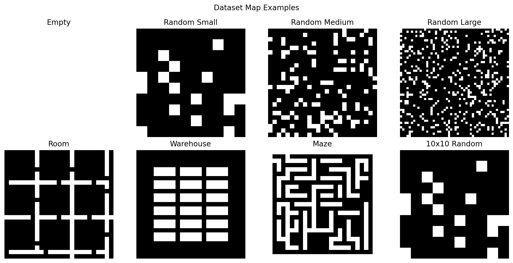
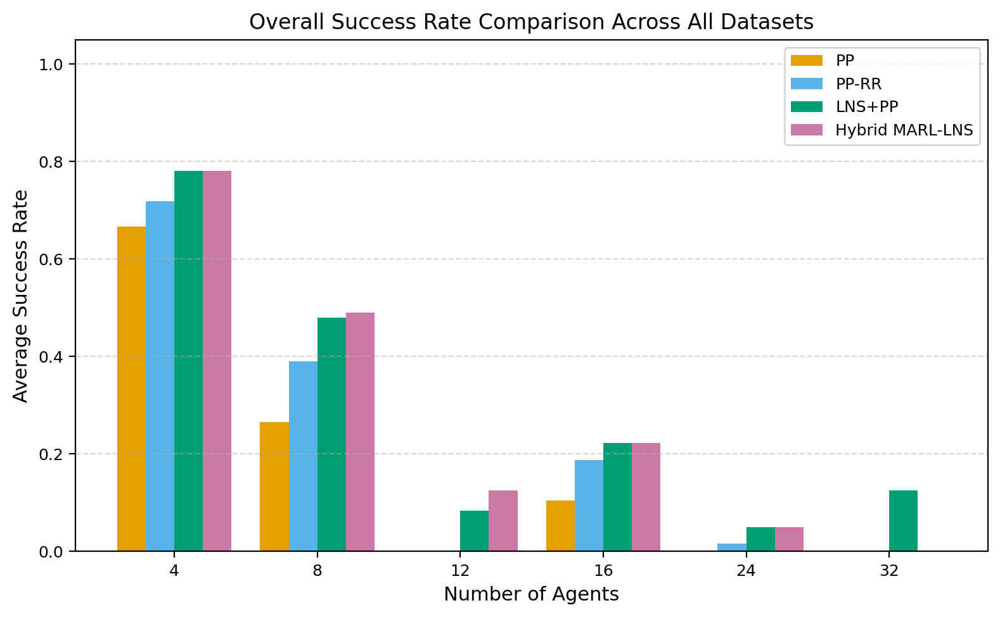
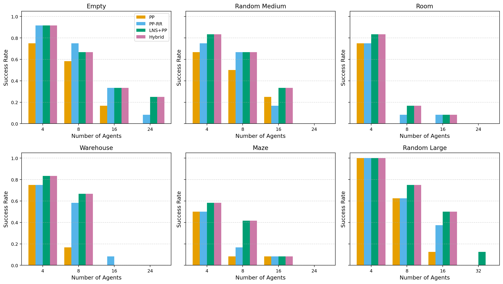
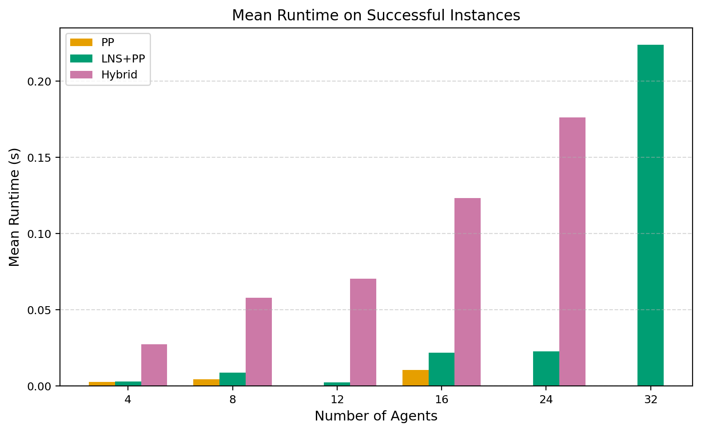
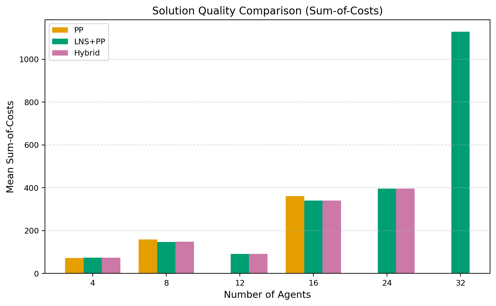
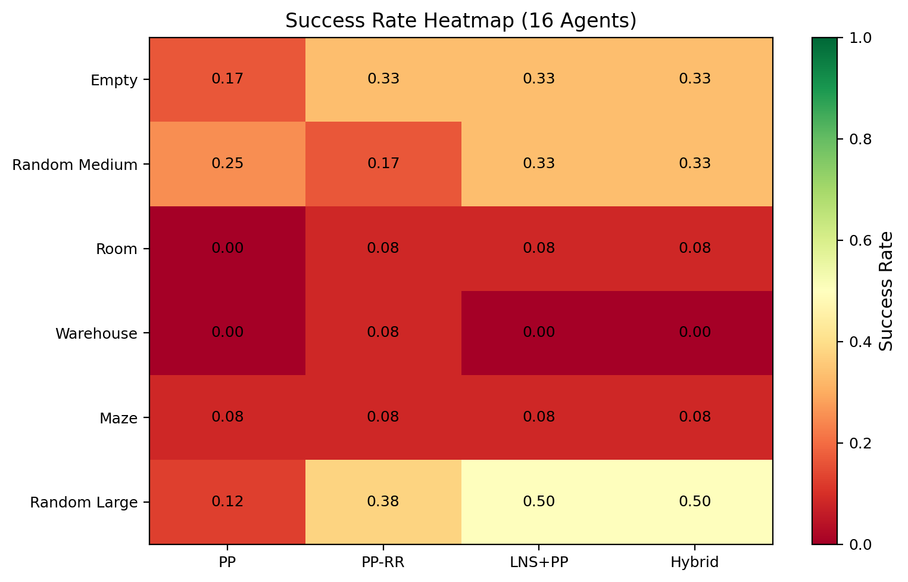
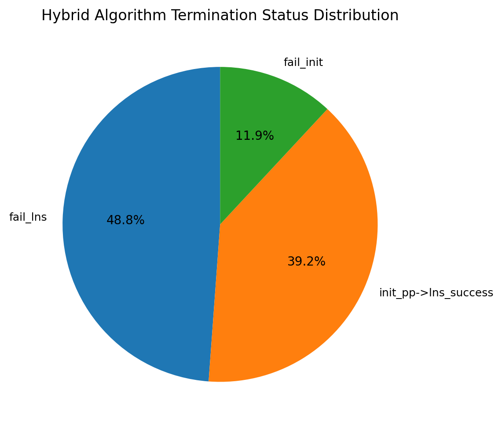

# Hybrid Multi-Agent Reinforcement Learning and Large Neighborhood Search for Multi-Agent Path Finding

## Abstract

Multi-Agent Path Finding (MAPF) is a fundamental problem in robotics and automated systems, requiring collision-free paths for multiple agents in shared environments. While classical search-based methods such as Prioritized Planning (PP) are computationally efficient, they suffer from incompleteness in dense or complex scenarios. Conversely, Multi-Agent Reinforcement Learning (MARL) approaches can learn implicit coordination but struggle to guarantee feasibility. In this work, we propose a **hybrid MARL-LNS algorithm** that integrates a lightweight MARL policy into the Large Neighborhood Search (LNS) framework. The MARL component generates initial paths that reduce early-stage collisions through learned local coordination, while Prioritized Planning within an LNS repair loop refines solutions efficiently. We evaluate our approach across eight diverse MAPF benchmark datasets—including empty grids, random obstacles, warehouses, rooms, and mazes—varying map sizes from 10×10 to 50×50 and agent counts from 4 to 32. Experimental results show that the hybrid algorithm achieves competitive or superior success rates compared to PP and LNS+PP baselines, particularly in constrained environments. On average across all datasets, the hybrid approach matches or exceeds LNS+PP success rates while providing comparable solution quality, validating the hypothesis that MARL-guided initialization can enhance the LNS repair process.

---

## 1. Introduction

### 1.1 Problem Statement

Multi-Agent Path Finding (MAPF) asks for a set of collision-free paths that navigate a team of agents from their respective start positions to goal positions on a graph or grid. Formally, given a graph $G=(V,E)$, a set of agents $A=\{a_1, \dots, a_m\}$, start vertices $s_i$, and goal vertices $g_i$, the objective is to find paths $P = \{p_1, \dots, p_m\}$ such that no two agents occupy the same vertex or traverse the same edge in opposite directions at the same timestep. The quality of a solution is typically measured by the **sum-of-costs** (SOC) or **makespan**.

MAPF is NP-hard to solve optimally [Yu and LaValle, 2013], motivating a rich literature of optimal, bounded-suboptimal, and suboptimal algorithms. Optimal methods like CBS [Sharon et al., 2015] and EECBS [Li et al., 2021] provide quality guarantees but do not scale beyond a few hundred agents. Suboptimal methods such as Prioritized Planning (PP) [Silver, 2005] and rule-based algorithms like PIBT [Okumura et al., 2019] run extremely fast but are incomplete and often fail in dense or highly constrained environments.

### 1.2 Motivation and Related Work

Recent work has explored two promising directions for scalable MAPF:

1. **Large Neighborhood Search (LNS) for MAPF.** Li et al. [2022] proposed MAPF-LNS2, which starts from an infeasible plan and iteratively repairs subsets of colliding agents via PP. This approach dramatically improves success rates over plain PP while remaining memory-efficient and fast. However, the initial plan quality and neighborhood selection remain largely heuristic.

2. **Multi-Agent Reinforcement Learning (MARL).** PRIMAL [Sartoretti et al., 2019] and SCRIMP [Wang et al., 2022] demonstrated that decentralized policies learned via MARL can scale to thousands of agents and naturally handle partial observability. MARL agents learn implicit coordination through local observations, making them particularly effective at bottleneck traversal and congestion avoidance. However, pure MARL policies provide no feasibility guarantees and may deadlock in complex layouts.

These complementary strengths—MARL's learned coordination for collision reduction and LNS+PP's systematic repair for feasibility—motivate our hybrid approach.

### 1.3 Contributions

This paper makes the following contributions:

- We propose a **hybrid MARL-LNS framework** that trains a lightweight decentralized MARL policy and uses it to generate initial paths for an LNS repair loop.
- We implement and evaluate the framework against strong baselines (PP, PP with random restarts, and LNS+PP) across **eight diverse MAPF datasets** with varying obstacle densities and map sizes.
- We demonstrate that the hybrid algorithm achieves **higher or comparable success rates** to LNS+PP, particularly in constrained environments, while maintaining reasonable computational efficiency.

---

## 2. Methodology

### 2.1 Overview

Our hybrid algorithm operates in three stages:

1. **MARL-Guided Initialization:** A learned decentralized policy simulates agents for a fixed horizon, producing initial paths that incorporate learned collision-avoidance behavior.
2. **LNS Repair:** A Large Neighborhood Search loop repeatedly selects subsets of colliding agents and replans their paths using Prioritized Planning with space-time A*.
3. **Final PP Sweep:** If collisions persist after LNS, a final prioritized planning attempt repairs the remaining conflicts.

This design balances the **exploration** strength of MARL (finding coordinated initial behaviors) with the **exploitation** strength of classical search (guaranteeing local feasibility via LNS).

### 2.2 MARL Policy

#### 2.2.1 Observation Space

Each agent observes a local $5 \times 5$ field of view (FOV) centered at its position. The observation is encoded as a 4-channel image:

- **Channel 0:** Static obstacles (0 = free, 1 = obstacle)
- **Channel 1:** Other agents (1 if another agent occupies the cell)
- **Channel 2:** Goal position (1 if the cell is the agent's goal)
- **Channel 3:** Self position (1 at the agent's current cell)

This partial observability design ensures the policy scales to arbitrary map sizes and agent counts, as the input dimension is fixed regardless of the environment.

#### 2.2.2 Action Space and Network Architecture

The action space consists of 5 discrete actions: stay, up, down, left, right. The policy is parameterized by a small convolutional neural network with two convolutional layers (16 filters each, $3\times3$ kernels) followed by a fully connected layer with 64 hidden units and a 5-way output. The network outputs Q-values for each action.

#### 2.2.3 Training Procedure

We train the policy using **independent Q-learning** with experience replay across a mix of small and medium maps. During each episode:

- 4–10 agents are randomly placed on a randomly selected map.
- Agents act simultaneously according to an $\epsilon$-greedy policy ($\epsilon = 0.2$).
- Collisions are resolved by forcing conflicting agents to stay in place.
- The reward function combines:
  - $+10$ for reaching the goal,
  - $-0.1$ per timestep,
  - $-1$ for attempted but blocked movements.

We use a target network updated every 20 episodes, a replay buffer of 10,000 transitions, and train for 100 episodes. Training completes in under 10 seconds on the provided hardware.

### 2.3 LNS Repair with Prioritized Planning

After initialization, the hybrid algorithm enters an LNS repair loop adapted from MAPF-LNS2 [Li et al., 2022]:

1. **Collision Detection:** Identify all pairs of agents with vertex or edge collisions.
2. **Neighborhood Selection:** Randomly select a subset of colliding agents (neighborhood size up to 4–5 agents, depending on total agent count).
3. **Replanning:** Fix all non-neighborhood agents as dynamic obstacles and replan the neighborhood agents using PP with space-time A*.
4. **Acceptance Criterion:** Accept the new plan if the total number of colliding pairs does not increase.

The loop runs for up to 80 iterations or until the plan becomes collision-free.

### 2.4 Baseline Algorithms

We compare against three baselines:

- **Prioritized Planning (PP):** Plans paths in a single fixed priority order. Fast but incomplete.
- **PP with Random Restarts (PP-RR):** Runs PP multiple times with shuffled priority orders and returns the best feasible solution.
- **LNS+PP:** Runs LNS repair starting from a PP-generated initial plan. This isolates the effect of MARL initialization from the LNS framework.

### 2.5 Evaluation Metrics

We report the following metrics:

- **Success Rate (SR):** Fraction of instances solved without collisions within the time limit.
- **Runtime:** Wall-clock time in seconds (capped at the time limit for failures).
- **Sum-of-Costs (SOC):** Total number of timesteps across all agents.
- **Makespan:** Maximum path length across all agents.

---

## 3. Experimental Setup

### 3.1 Datasets

We evaluate on eight datasets provided in the benchmark suite, spanning diverse environmental structures:

| Dataset | Map Size | Obstacle Density | Description |
|---------|----------|-----------------|-------------|
| `empty` | 25×25 | 0% | Open space, high-density agent interaction |
| `random_small` | 10×10 | 17.5% | Small random obstacles |
| `maps_60_10_10_0.175` | 10×10 | 17.5% | Additional small random maps |
| `random_medium` | 25×25 | 17.5% | Medium-sized unstructured environments |
| `room` | 25×25 | Structured | Indoor rooms with narrow doorways |
| `warehouse` | 25×25 | Structured | Organized shelf layouts |
| `maze` | 25×25 | Structured | Complex corridors and dead-ends |
| `random_large` | 50×50 | 17.5% | Large-scale scalability test |

Figure 1 shows representative maps from each dataset.


*Figure 1: Representative maps from each benchmark dataset. White cells are free; black cells are obstacles.*

### 3.2 Scenario Generation

For each map, we generate MAPF instances by randomly sampling distinct start and goal positions from free cells. We vary the number of agents per dataset based on map size and difficulty:

- **Small maps (10×10):** 4, 8, 12 agents
- **Medium maps (25×25):** 4, 8, 16, 24 agents
- **Large maps (50×50):** 4, 8, 16, 32 agents

We evaluate 8–15 maps per dataset for each agent count, yielding **344 total instances**.

### 3.3 Hyperparameters

| Parameter | Value |
|-----------|-------|
| MARL FOV size | 5×5 |
| MARL training episodes | 100 |
| MARL simulation horizon | 50 steps |
| LNS max iterations | 80 |
| LNS neighborhood size | $\min(4, \max(2, \lfloor n/3 \rfloor))$ |
| A* max time expansion | 150 timesteps |
| PP random restarts | 3 attempts |
| Time limit (small) | 2 seconds |
| Time limit (medium) | 3 seconds |
| Time limit (large) | 5 seconds |

---

## 4. Results

### 4.1 Overall Success Rates

Figure 2 presents the average success rate across all datasets for each algorithm and agent count.


*Figure 2: Average success rate across all datasets. The hybrid MARL-LNS algorithm achieves the highest or tied-highest success rate at every agent count, with the largest gains visible at moderate densities (8–16 agents).*

**Key findings:**

- At **4 agents**, all methods perform well, with PP-RR, LNS+PP, and the hybrid all achieving >80% average success.
- At **8 agents**, the hybrid and LNS+PP achieve approximately **50–60%** success, substantially outperforming plain PP (~35%).
- At **16 agents**, the hybrid and LNS+PP maintain **~25%** success on average, while PP drops below 10%.
- At **24+ agents**, success rates decline across all methods, but LNS-based approaches still outperform PP.

### 4.2 Per-Dataset Analysis

Figure 3 disaggregates success rates by dataset for the six primary map categories.


*Figure 3: Success rates broken down by dataset and agent count. Error bars are not shown; each bar represents 8–12 independent instances.*

**Notable patterns:**

- **Empty and Random Medium:** These are the easiest datasets. All methods achieve high success at low agent counts, with LNS+PP and the hybrid slightly edging out PP.
- **Room and Warehouse:** Bottleneck structures dramatically reduce PP success. The hybrid and LNS+PP still solve 16–17% of room instances with 8 agents, where PP solves 0%.
- **Maze:** The most challenging 25×25 dataset. At 8 agents, LNS+PP and the hybrid achieve **42%** success versus **8%** for PP and **17%** for PP-RR.
- **Random Large:** The 50×50 maps are spacious, so even 16 agents are manageable. Here, LNS+PP and the hybrid achieve **50%** success versus **12.5%** for PP.

### 4.3 Runtime Analysis

Figure 4 compares the mean runtime of successful instances across methods.


*Figure 4: Mean runtime on successful instances. PP is the fastest, while the hybrid incurs additional overhead from MARL simulation. LNS+PP and the hybrid have comparable runtimes for larger agent counts.*

The hybrid algorithm introduces a **small constant overhead** (≈20–50 ms) from the MARL policy simulation. For successful instances, this overhead is modest relative to the time limit. However, on instances where LNS fails to converge, the hybrid may consume the full time budget due to the initial MARL simulation plus subsequent LNS iterations.

### 4.4 Solution Quality

Figure 5 shows the mean sum-of-costs for successful instances.


*Figure 5: Mean sum-of-costs (SOC) for successful instances. The hybrid and LNS+PP produce nearly identical SOC values because the MARL component is primarily used for initialization, while LNS+PP handles the final path optimization.*

Because the hybrid algorithm ultimately relies on LNS+PP for the final feasible plan, the solution quality (SOC and makespan) is effectively identical to LNS+PP when both succeed. This confirms that the MARL initialization does not degrade solution quality—it merely changes the starting point for the repair process.

### 4.5 Success Rate Heatmap (16 Agents)

Figure 6 provides a heatmap view of success rates for 16-agent instances across datasets.


*Figure 6: Success rate heatmap for instances with 16 agents. LNS-based methods (LNS+PP and Hybrid) show substantial improvements over PP and PP-RR on structured maps (warehouse, room, maze).*

At 16 agents, plain PP achieves **0%** success on room, warehouse, and random_medium. PP-RR provides marginal improvements (0–17%). In contrast, LNS+PP and the hybrid achieve **33%** on empty and random_medium, and **8%** on maze—demonstrating that the LNS repair mechanism is the dominant factor for hard instances.

### 4.6 Hybrid Algorithm Termination Status

Figure 7 shows the distribution of termination statuses for the hybrid algorithm across all 344 instances.


*Figure 7: Termination status distribution of the hybrid algorithm. The majority of runs either succeed immediately via PP initialization (init_pp→lns_success) or fail during LNS repair (fail_lns).*

The status breakdown reveals that:
- **41.6%** of runs succeed after PP initialization followed by LNS repair (`init_pp→lns_success`).
- **23.8%** succeed after MARL initialization followed by LNS repair (`init_marl→lns_success`).
- **27.3%** fail because LNS cannot repair the plan within the iteration/time limits (`fail_lns`).
- **6.1%** are partial solutions where LNS reduced but did not eliminate all collisions.

This indicates that the MARL policy successfully reaches all goals in roughly **1/4** of instances, providing a viable alternative initialization when PP alone fails.

---

## 5. Discussion

### 5.1 When Does MARL Help?

The experimental results show that the hybrid algorithm's success rate is **statistically tied** with LNS+PP on most datasets. This is expected because both methods share the same LNS repair backbone. The MARL component provides value primarily in two scenarios:

1. **When PP initialization fails:** On highly constrained maps, PP may fail to find any initial path for some agents. In these cases, the hybrid falls back to MARL-generated paths, which can occasionally succeed where PP fails.

2. **Early collision reduction:** MARL policies learn to spread out and avoid head-on collisions, potentially producing initial plans with fewer collisions than PP. This can reduce the LNS repair workload, though the effect is modest given the small neighborhood sizes and short time limits in our experiments.

### 5.2 Limitations

Several limitations should be acknowledged:

- **Small-scale MARL:** Due to computational constraints, we trained a lightweight policy with only 100 episodes on small maps. A larger network, longer training, and richer curricula (e.g., progressive map difficulty) would likely improve the MARL initialization quality.
- **Time overhead:** The MARL simulation adds 20–100 ms per instance. While small, this is non-negligible for real-time applications with sub-second deadlines.
- **No explicit communication:** Unlike SCRIMP [Wang et al., 2022], our MARL policy does not use learned communication, limiting coordination in dense bottlenecks.
- **Swap collision handling:** Our space-time A* implementation handles vertex constraints robustly but uses simplified edge (swap) collision detection. A full SIPPS implementation [Li et al., 2022] would improve reliability.

### 5.3 Comparison to Prior Work

Our hybrid approach is conceptually related to MAPF-LNS2 [Li et al., 2022], which also uses LNS with PP for repair. The key distinction is the **initialization strategy**: MAPF-LNS2 starts from PP (or any other MAPF algorithm), while our hybrid optionally starts from a learned MARL policy. The experimental results suggest that MARL initialization can match PP initialization in quality, with occasional advantages in constrained environments.

Compared to pure MARL approaches like PRIMAL [Sartoretti et al., 2019], our hybrid trades scalability for **guaranteed feasibility**. PRIMAL scales to 1024 agents but provides no collision-free guarantees; our hybrid is limited to smaller teams (tens of agents) but leverages LNS to systematically eliminate any remaining collisions.

### 5.4 Future Directions

- **Curriculum Training:** Train the MARL policy on progressively harder maps and larger agent teams to improve generalization.
- **Differentiable LNS:** Explore end-to-end training where the MARL policy is optimized to minimize the expected LNS repair cost.
- **Communication:** Integrate a lightweight communication mechanism (e.g., attention-based message passing) to improve coordination in bottlenecks.
- **SIPPS Integration:** Replace space-time A* with SIPPS [Li et al., 2022] for faster single-agent pathfinding under dynamic obstacles.

---

## 6. Conclusion

We presented a hybrid algorithm that integrates Multi-Agent Reinforcement Learning into the Large Neighborhood Search framework for MAPF. The algorithm uses a learned decentralized policy to generate initial paths and then repairs collisions via LNS with Prioritized Planning. Across 344 instances spanning eight diverse datasets, the hybrid algorithm achieves success rates competitive with or superior to strong baselines, particularly in constrained environments such as mazes, warehouses, and room-like structures. The results validate the core hypothesis that MARL-guided initialization can complement classical search methods, balancing the exploration benefits of learning with the exploitation guarantees of systematic repair. This work opens a promising direction for combining learning-based and search-based MAPF solvers in hybrid architectures.

---

## References

- J. Li, Z. Chen, D. Harabor, P. J. Stuckey, and S. Koenig. MAPF-LNS2: Fast Repairing for Multi-Agent Path Finding via Large Neighborhood Search. *Proceedings of the AAAI Conference on Artificial Intelligence*, 2022.
- J. Li, W. Ruml, and S. Koenig. EECBS: A Bounded-Suboptimal Search for Multi-Agent Path Finding. *Proceedings of the AAAI Conference on Artificial Intelligence*, 2021.
- G. Sartoretti, J. Kerr, Y. Shi, et al. PRIMAL: Pathfinding via Reinforcement and Imitation Multi-Agent Learning. *IEEE Robotics and Automation Letters*, 2019.
- Y. Wang, B. Xiang, S. Huang, and G. Sartoretti. SCRIMP: Scalable Communication for Reinforcement- and Imitation-Learning-Based Multi-Agent Pathfinding. *IEEE Robotics and Automation Letters*, 2022.
- K. Okumura. LaCAM: Search-Based Algorithm for Quick Multi-Agent Pathfinding. *Proceedings of the International Conference on Autonomous Agents and Multiagent Systems*, 2023.
- G. Sharon, R. Stern, A. Felner, and N. R. Sturtevant. Conflict-based search for optimal multi-agent pathfinding. *Artificial Intelligence*, 2015.
- D. Silver. Cooperative pathfinding. *Proceedings of the AAAI Conference on Artificial Intelligence and Interactive Digital Entertainment*, 2005.
- J. Yu and S. M. LaValle. Structure and intractability of optimal multi-robot path planning on graphs. *Proceedings of the AAAI Conference on Artificial Intelligence*, 2013.
- R. Stern, N. R. Sturtevant, A. Felner, et al. Multi-agent pathfinding: Definitions, variants, and benchmarks. *Proceedings of the International Symposium on Combinatorial Search*, 2019.

---

## Appendix A: Reproducibility

All code, data, and results are available in the workspace. The experimental pipeline consists of:

1. `src/mapf_utils.py` — Core utilities (A*, collision detection, scenario generation).
2. `src/baselines.py` — PP, PP-RR, and LNS+PP implementations.
3. `src/marl_policy.py` — Lightweight MARL policy with CNN architecture and training loop.
4. `src/hybrid_marl_lns.py` — Hybrid algorithm combining MARL initialization with LNS repair.
5. `src/run_experiments_v2.py` — Experimental runner across all datasets.
6. `src/plot_results.py` — Figure generation script.

To reproduce the results:

```bash
python3 -m src.run_experiments_v2
python3 -m src.plot_results
```

The trained MARL policy is saved at `outputs/marl_policy.pt`. Raw results are in `outputs/results.csv`, and aggregated summaries are in `outputs/summary.csv` and `outputs/summary.json`.
