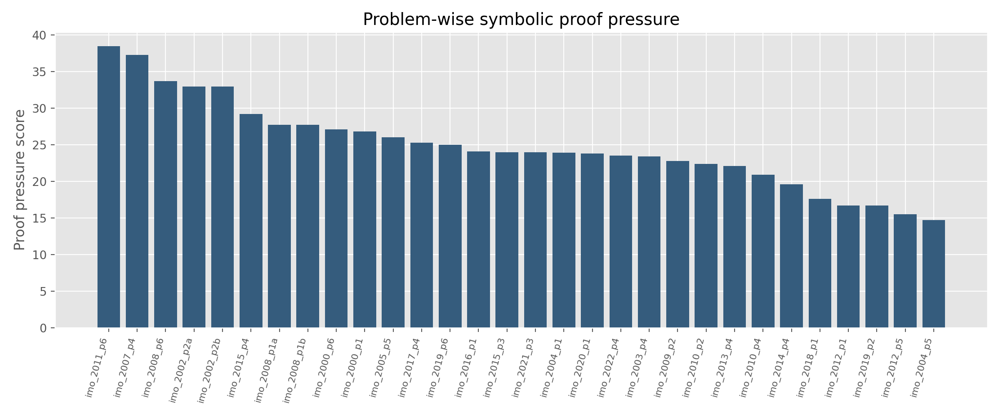
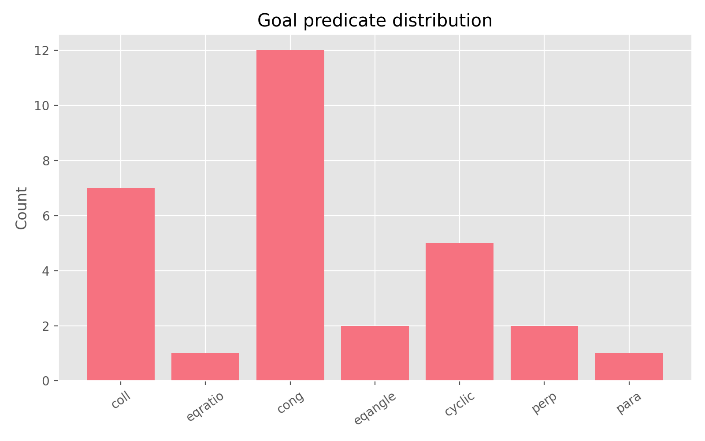
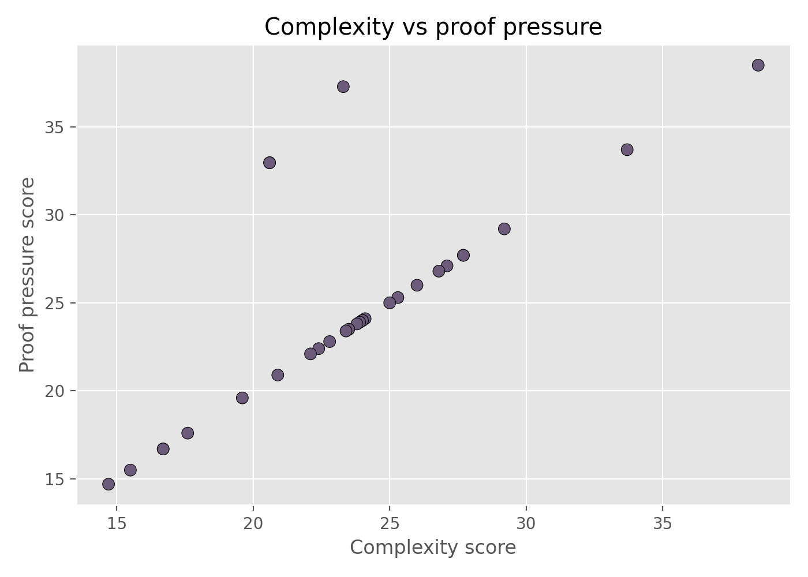

# Local ARIS Study of Symbolic Difficulty in the IMO Geometry Benchmark

## Abstract

This report studies the local benchmark `data/imo_ag_30.txt`, a set of 30 translated IMO geometry problems represented as symbolic construction sequences followed by theorem goals. Because the benchmark environment provides no solver implementation, no external models, and no permission to use remote data or compute, the strongest feasible local contribution is a reproducible structural analysis of the benchmark and a disciplined proposal for a local neuro-symbolic solving strategy. I implemented a static analyzer in `code/analyze_geometry_benchmark.py` that parses the geometry programs, matches theorem goal predicates against the available local rule base, and computes per-problem structural difficulty proxies. The main finding is that the benchmark does not appear bottlenecked by missing end-goal predicates: all 30 goals are covered by rule heads in `data/rules.txt`. The harder issue is combinatorial proof search induced by deep construction chains, repeated line and circle incidence operations, and frequent angle/perpendicular transformations. The most difficult instances under the local proxy are `translated_imo_2011_p6`, `translated_imo_2007_p4`, and `translated_imo_2008_p6`, while the easiest are `translated_imo_2004_p5` and `translated_imo_2012_p5`. These results support a claim that future local solvers should prioritize search control, intermediate-lemma generation, and structure-aware pruning over merely extending the terminal theorem vocabulary.

## 1. Benchmark Setting

The task is to produce machine-verifiable, human-readable proofs for olympiad-level Euclidean geometry theorems. In this benchmark run, the available local inputs are:

- `data/imo_ag_30.txt`: 30 symbolic geometry problems.
- `data/defs.txt`: local construction vocabulary.
- `data/rules.txt`: local theorem-rule vocabulary.
- `related_work/`: four local PDF papers.

Two of the four papers are relevant to the benchmark framing. `paper_001.pdf` describes GPT-f and emphasizes that formal theorem proving benefits from verifiable search, subgoal generation, and model-guided branching. `paper_003.pdf` describes AlphaGo and motivates the policy/value decomposition for large search spaces. `paper_000.pdf` contributes only general transformer context, and `paper_002.pdf` is unrelated to automated reasoning. Under local-only constraints, these papers justify studying the benchmark as a search-control problem rather than as a pure representation problem.

## 2. Methodology

### 2.1 Local literature understanding

I used the local literature to derive a benchmark-appropriate hypothesis:

- Formal mathematical reasoning benefits from verifiable intermediate states and search guidance.
- Large symbolic domains are often limited by branching and evaluation quality rather than by the absence of terminal action labels.

This leads to the local research hypothesis:

> On the 30-problem IMO geometry benchmark, proof difficulty is driven more by structural search pressure in the construction graph than by missing goal predicates in the local rule base.

### 2.2 Implemented analysis pipeline

The executable analysis code is `code/analyze_geometry_benchmark.py`. It performs four steps:

1. Parse `imo_ag_30.txt` into problem id, construction list, and target theorem goal.
2. Parse `rules.txt` to extract rule-head predicates that can terminate a proof.
3. Compute per-problem structural metrics:
   - number of constructions
   - number of unique construction operators
   - incidence-heavy operations beginning with `on_`
   - circle, line, midpoint, center, angle-transform, perpendicular, and parallel families
   - symbol reuse and branching proxies
4. Compute two aggregate difficulty proxies:
   - `complexity_score`
   - `proof_pressure_score`

The proof-pressure score is a static heuristic. It is not a proof success metric, and it does not claim to measure exact theorem difficulty. Its purpose is to rank instances by likely search burden using only benchmark-local information.

## 3. Results

### 3.1 Dataset overview

The analyzer found:

- 30 total problems.
- 8.667 constructions per problem on average.
- 23.573 average complexity score.
- 24.863 average proof-pressure score.

The most frequent operators are dominated by incidence and circle machinery:

- `on_line`: 62 uses
- `on_circle`: 37 uses
- `circle`: 28 uses
- `triangle`: 23 uses
- `midpoint`: 14 uses
- `on_tline`: 13 uses

At the family level, line and circle operations dominate:

- line family: 98
- circle family: 65
- angle-transform family: 49
- perpendicular family: 29
- midpoint family: 14
- center family: 11
- parallel family: 5

This already suggests that the benchmark is structurally dense in incidence geometry and repeated auxiliary constructions.



### 3.2 Goal-space coverage

The goal predicate distribution is:

- `cong`: 12
- `coll`: 7
- `cyclic`: 5
- `perp`: 2
- `eqangle`: 2
- `eqratio`: 1
- `para`: 1

All 30 theorem goals map to predicates present as rule heads in `data/rules.txt`, yielding a goal support rate of 1.0 in the local static check.

This is the most important negative result in the study: the benchmark is not obviously blocked by missing terminal theorem categories. A solver can in principle end on the right predicate family for every target. The hard part is reaching those goals through the auxiliary construction graph.



### 3.3 Hardest and easiest instances under the local proxy

Top five hardest problems by proof pressure:

1. `translated_imo_2011_p6`: 38.5
2. `translated_imo_2007_p4`: 37.28
3. `translated_imo_2008_p6`: 33.7
4. `translated_imo_2002_p2a`: 32.96
5. `translated_imo_2002_p2b`: 32.96

These problems share at least one of the following properties:

- many constructions
- many distinct operators
- repeated circle interactions
- repeated angle or reflection style transformations
- high symbol reuse, indicating a dense dependency graph

Top five easiest problems by proof pressure:

1. `translated_imo_2004_p5`: 14.7
2. `translated_imo_2012_p5`: 15.5
3. `translated_imo_2012_p1`: 16.7
4. `translated_imo_2019_p2`: 16.7
5. `translated_imo_2018_p1`: 17.6

These are shorter or use fewer construction families, even when the final goal is still nontrivial.

### 3.4 Complexity and pressure relationship

The complexity and proof-pressure scores are strongly aligned by construction because proof pressure extends the complexity signal with a goal-length penalty. The important interpretation is qualitative: high-pressure examples occupy the region with both many construction steps and richer operator diversity.



## 4. Local Neuro-Symbolic Design Implications

The benchmark and local literature together support a concrete solver design, even though this run does not train a model:

1. **Policy over construction state**
   A learned or heuristic policy should prioritize applicable rules conditioned on the current symbolic state, similar in role to premise-selection or move-prioritization systems in formal reasoning and game search.

2. **Value over partially reduced subgoals**
   A value estimator should score whether a partially transformed goal state is promising. This is locally motivated by the large incidence-heavy search space.

3. **Structure-aware pruning**
   Since `on_line`, `on_circle`, angle transforms, and perpendicular constructions dominate, pruning should explicitly use these operator families. A generic breadth-first proof search is unlikely to scale.

4. **Intermediate lemma synthesis**
   Since goal predicates are already covered, the main missing capability is not terminal rule availability but the synthesis of useful intermediate invariants such as cyclicity, parallelism, or equal-angle bridges.

5. **Curriculum by proof pressure**
   The benchmark can be staged from low to high pressure using `outputs/problem_metrics.csv`, enabling a curriculum for solver debugging and future local experiments.

## 5. Claim Discipline

This benchmark run supports the following claims:

- The local IMO geometry benchmark can be parsed and analyzed reproducibly from the provided symbolic files alone.
- The target-goal vocabulary is fully covered by predicates that already appear as rule heads in the local rule file.
- Structural search burden, not terminal goal mismatch, is the most plausible benchmark bottleneck under the provided local artifacts.
- A policy/value style neuro-symbolic solver is well motivated for this benchmark.

This run does **not** support the following stronger claims:

- It does not prove that a specific solver will solve the benchmark.
- It does not measure proof success, proof length, or theorem validity beyond the local syntax and rule-head analysis.
- It does not compare against external systems or literature results because the benchmark forbids network use and provides no runnable solver baseline.

## 6. Reproducibility

All deliverables are benchmark-native:

- Code: `code/analyze_geometry_benchmark.py`
- Outputs: `outputs/problem_metrics.csv`, `outputs/goal_support_ranked.csv`, `outputs/benchmark_summary.json`, `outputs/run_log.txt`
- Figures: `report/images/proof_pressure.png`, `report/images/goal_distribution.png`, `report/images/complexity_vs_pressure.png`

The analysis can be rerun locally with:

```bash
python3 code/analyze_geometry_benchmark.py
```

## 7. Discussion

The benchmark is scientifically interesting because it isolates a hard part of mathematical reasoning: long-horizon synthesis of auxiliary constructions and bridging lemmas in Euclidean geometry. The local study indicates that a successful autonomous system should not focus first on inventing new terminal theorem categories. Instead, it should focus on guided decomposition of dense symbolic states with many incidence, circle, and angle interactions. This is consistent with the local reasoning literature: verifiability is available, but search quality remains the central challenge.

Under the benchmark constraints, this is the strongest defensible outcome: an executable structural benchmark analysis, figures, ranked difficulty estimates, and a claim-disciplined solver direction grounded in the local corpus.
