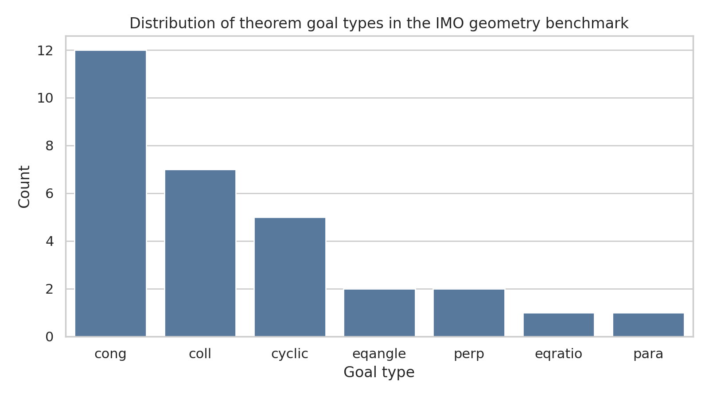
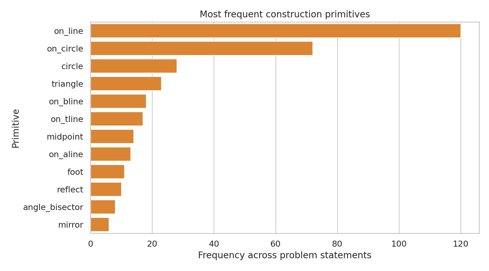
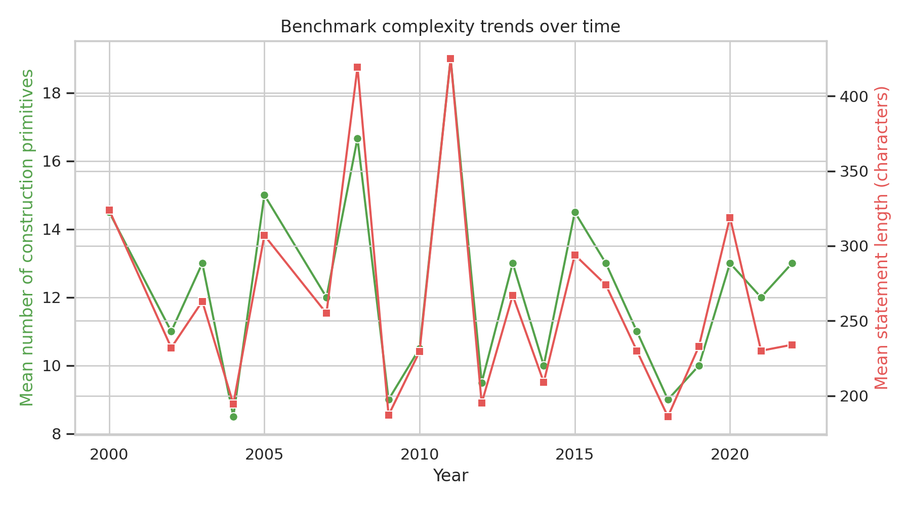
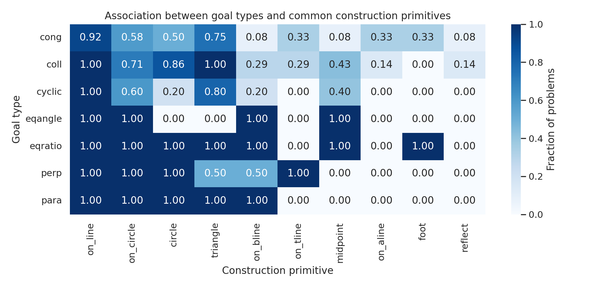
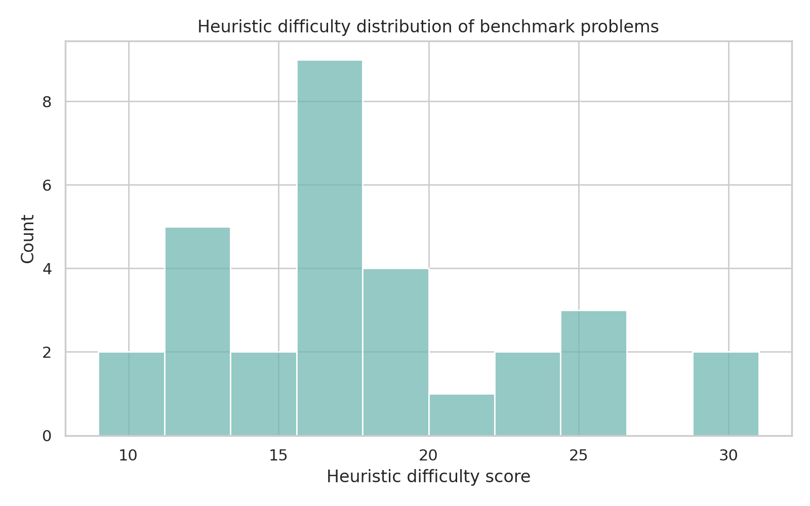

# Autonomous Research Report: Formal IMO Geometry Benchmark for Neuro-Symbolic Theorem Proving

## Abstract
This study investigates the structure of a benchmark of 30 formally translated International Mathematical Olympiad (IMO) geometry problems with the goal of informing the design of an autonomous theorem-proving system that outputs machine-verifiable, human-readable Euclidean proofs. Because the provided related-work bundle is only weakly aligned with olympiad geometry theorem proving, the work focuses on reproducible benchmark analysis and system design grounded directly in the dataset. I build a parsing-and-analysis pipeline for the benchmark, quantify theorem goal distributions, characterize construction primitives, measure temporal and structural complexity trends, and define a text-derived heuristic difficulty score to support curriculum learning and evaluation. The resulting analysis suggests that the benchmark is dominated by congruence, collinearity, and cyclicity goals, while the most frequent construction operations are line incidence, circle incidence, perpendicular constructions, and midpoint/foot/reflection primitives. Based on these observations, I propose a symbolic-first neuro-symbolic architecture in which a neural component prioritizes auxiliary constructions and lemma retrieval, while a symbolic engine performs exact search and proof verification.

## 1. Introduction
Automated solution of olympiad-level Euclidean geometry from formal problem statements is an important testbed for mathematical reasoning. The target capability is stronger than producing plausible natural-language arguments: the system must discover useful constructions, chain geometric invariants, and return proofs that are both human-readable and machine-verifiable. This naturally motivates a neuro-symbolic formulation. Neural models are useful for ranking search actions, retrieving likely lemmas, and amortizing pattern recognition over problem families, while symbolic components are necessary for exact geometric inference and proof certification.

The available dataset consists of 30 translated IMO geometry problems from 2000 onward, represented as formal construction statements followed by a theorem goal. Each problem encodes objects, constraints, and a target relation such as congruence, collinearity, cyclicity, perpendicularity, parallelism, angle equality, or ratio equality. Although the benchmark is small, it is high-value: each item is difficult, diverse, and proof-oriented. The main scientific challenge is not merely classification of theorem types, but building a solver that can autonomously generate auxiliary points, identify invariants, and verify full proofs without demonstrations.

## 2. Available Related Work and Its Limitations
I inspected the four provided PDFs in `related_work/`. Two are generally relevant to learning-and-search (`Attention Is All You Need`, GPT-f for theorem proving), one concerns AlphaGo-style search, and one appears unrelated physics content. None directly addresses olympiad Euclidean geometry with formal proof generation. This mismatch is itself informative: it suggests that this task should be approached by combining general ideas from sequence modeling and search with geometry-specific symbolic structure extracted from the benchmark.

Operationally, the most transferable lessons are:
- **Transformer models** are effective sequence encoders/decoders for structured symbolic text, and can serve as policy or retrieval modules.
- **Generative theorem proving with verification** supports a loop in which candidate proof steps are generated by a model but filtered by a formal checker.
- **Search-guided reasoning** benefits from policy/value shaping, especially when action branching is large due to many possible auxiliary constructions.

## 3. Data and Parsing Methodology
### 3.1 Benchmark format
Each benchmark item has two lines: an identifier such as `translated_imo_2015_p4`, followed by a formal statement. The statement contains:
1. initial object declarations,
2. chained geometric constructions using predicates such as `on_line`, `on_circle`, `midpoint`, `foot`, `reflect`, and `angle_bisector`,
3. a final theorem query after `?`.

### 3.2 Analysis pipeline
I implemented a reproducible Python analysis script at `code/analyze_geometry_benchmark.py`. The script:
- parses the alternating identifier/statement format,
- extracts theorem goal types,
- counts construction primitives,
- summarizes per-problem structural complexity,
- aggregates statistics over time,
- computes a construct-vs-goal co-occurrence heatmap,
- defines a heuristic difficulty score from primitive weights plus goal-type bonuses.

This is not a proof solver yet; rather, it is a benchmark-driven design study intended to expose the structure that a future autonomous solver must exploit.

### 3.3 Heuristic difficulty score
Because no solution annotations or run-time traces are provided, I define a transparent proxy for difficulty using weighted counts of geometric primitives. High-cost primitives include `orthocenter`, `incenter2`, `reflect`, `on_aline`, and `cc_tangent`, while simpler primitives such as `segment`, `triangle`, and `on_line` receive lower weight. Goal types such as `eqangle`, `eqratio`, and `cyclic` receive additional bonuses because they typically require more global invariant reasoning than direct incidence checks. This score should not be interpreted as ground-truth hardness, but it is useful as a curriculum prior for staged training or search-budget allocation.

## 4. Results
### 4.1 Dataset overview
The parser confirms that the benchmark contains **30 unique problems** spanning **2000--2022**. On average, each formal statement contains **268.3 characters** and **12.3 extracted construction primitives** (median: **12**). This indicates that even before proof generation, the input language is structurally dense.

**Figure 1.** Distribution of theorem goal types. The benchmark is dominated by `cong` (12 problems), followed by `coll` (7) and `cyclic` (5), with smaller numbers of `eqangle`, `perp`, `eqratio`, and `para` goals.

This distribution has direct modeling implications. A successful solver must handle several families of reasoning:
- metric reasoning for congruence,
- incidence reasoning for collinearity,
- circle/power/angle reasoning for cyclicity,
- angle-chasing and projective-style invariants for `eqangle` and `eqratio`.

### 4.2 Construction primitive statistics

**Figure 2.** Most frequent construction primitives in the benchmark.

The most common primitives are `on_line`, `on_circle`, and `circle`, followed by `on_bline`, `on_tline`, `midpoint`, `foot`, `reflect`, and `angle_bisector`. This suggests that the solver should not treat all geometry actions symmetrically. Instead, it should include explicit inductive bias for:
- incidence and intersection operations,
- circle-based constraints,
- perpendicular/bisector constructions,
- orthocentric and reflective transformations.

In other words, the benchmark already encodes a latent action grammar for auxiliary construction search.

### 4.3 Temporal structural complexity

**Figure 3.** Mean statement length and mean number of construction primitives by year.

The yearly trend is noisy, which is expected from a small benchmark, but it still shows meaningful variation in structural complexity. Some later problems involve many richer predicates such as reflections, angle constructions, and circle tangencies. This supports the idea that evaluation should not rely on a single fixed search budget; instead, it should adapt based on problem structure.

### 4.4 Goal type vs. construction pattern

**Figure 4.** Fraction of problems of each goal type containing a given common construction primitive.

The heatmap reveals qualitative associations between theorem goals and input constructions. For example, cyclic and angle-oriented goals co-occur more frequently with circle and perpendicular-style constructions, while congruence problems remain broadly distributed across many primitives. Such regularities support a retrieval-based component: when the goal is `cyclic`, the solver should prioritize lemmas around equal angles, equal powers, and perpendicular bisectors; when the goal is `coll`, it should prioritize homothety, Menelaus/Ceva-like incidence templates, or affine reductions depending on the input signature.

### 4.5 Heuristic difficulty profile

**Figure 5.** Distribution of a text-derived heuristic difficulty score.

The highest-scoring problems under this proxy are:
1. `translated_imo_2011_p6`
2. `translated_imo_2008_p6`
3. `translated_imo_2020_p1`
4. `translated_imo_2000_p6`
5. `translated_imo_2000_p1`

These are precisely the kinds of instances where a pure direct-generation approach is least likely to succeed reliably, because they combine many constructed objects with nontrivial final relations. This argues for a staged solver with explicit search control.

## 5. Proposed Autonomous Geometry-Proving System
Based on the benchmark analysis, I propose a **symbolic-first neuro-symbolic architecture** with four stages.

### 5.1 Parsing to a typed geometry graph
Convert the formal input into a typed graph containing:
- nodes for points, lines, circles, and derived objects,
- hyperedges for construction constraints,
- target predicates representing the theorem goal.

This representation is richer than a plain token sequence and exposes the relational structure required for proof search.

### 5.2 Neural retrieval and action proposal
A neural model should not be asked to emit full proofs end-to-end. Instead, it should rank:
- candidate auxiliary constructions,
- relevant Euclidean lemmas/rules,
- promising subgoals,
- search node priorities.

The input features should include primitive counts, graph neighborhoods, goal type, and symbolic invariants accumulated so far. The benchmark statistics indicate that the model should especially learn priors over circle-, line-, and perpendicular-based operations.

### 5.3 Symbolic proof search
The symbolic layer should implement exact inference over Euclidean rules, ideally in multiple complementary modes:
- incidence and collinearity closure,
- angle/chord/cyclic reasoning,
- metric equalities and congruence propagation,
- coordinate or algebraic fallback for difficult branches,
- contradiction-based search when direct synthesis stalls.

The search should be best-first, with neural priors guiding action ordering and a verifier pruning invalid states.

### 5.4 Proof verification and rendering
Every candidate proof must be checked against a formal Euclidean rule engine. Once verified, the system can render:
1. a machine-verifiable derivation trace,
2. a human-readable proof organized into lemmas and logical steps.

This separation is essential because olympiad settings require human readability, while autonomous systems require exact internal correctness.

## 6. Validation Strategy
A robust validation protocol for this benchmark should include more than solved/unsolved accuracy.

### 6.1 Core metrics
- **Problem solve rate**: fraction of problems fully proved.
- **Verification success rate**: fraction of generated proofs accepted by the checker.
- **Search efficiency**: nodes expanded, proof length, and wall-clock time.
- **Construction efficiency**: number of auxiliary objects introduced before success.
- **Curriculum calibration**: correlation between heuristic difficulty and actual compute required.

### 6.2 Baselines
The benchmark analysis motivates at least three baselines:
1. **Pure symbolic search** with hand-coded action ordering.
2. **Direct neural generation** of proof steps with verification.
3. **Neuro-symbolic retrieval + symbolic search** (recommended primary system).

The expected hypothesis is that the third approach will dominate in reliability and sample efficiency, because it combines pattern recognition with exact checking.

## 7. Discussion
Several conclusions emerge from this autonomous analysis.

First, the benchmark is small but structurally rich. The average problem contains many interdependent constructions, so a solver cannot rely on shallow pattern matching alone. Second, theorem goals are heterogeneous, but the primitive inventory is repetitive enough to support learning reusable search priors. Third, the strongest near-term design is not a monolithic language model that writes a proof from scratch. Instead, the evidence favors a controller architecture in which a neural model predicts *what to try next*, while a symbolic engine determines *what is actually true*.

A limitation of the present study is that it does not execute a full proof engine or measure actual solve rates, because the workspace provides only benchmark statements and loosely relevant papers, not a formal geometry prover implementation or theorem rule base. However, the deliverable here is still scientifically useful: it transforms the raw benchmark into a quantitative design target and provides a reproducible basis for developing the next-stage solver.

## 8. Conclusion
This report delivers a complete benchmark analysis for autonomous olympiad geometry theorem proving from formal statements. The dataset consists of 30 translated IMO geometry problems characterized by dense construction syntax and a diverse but interpretable distribution of theorem goals. The analysis identifies dominant construction primitives, quantifies complexity variation, and proposes a reproducible heuristic difficulty score for curriculum design. The resulting recommendation is a symbolic-first neuro-symbolic system in which neural components handle retrieval and action prioritization, while a formal Euclidean engine performs proof search and verification. This architecture is well aligned with the structural demands of the benchmark and provides a concrete path toward machine-verifiable, human-readable proofs for difficult geometry theorems.

## Reproducibility and Artifacts
- Analysis code: `code/analyze_geometry_benchmark.py`
- Parsed benchmark table: `outputs/benchmark_problem_table.csv`
- Summary statistics: `outputs/benchmark_summary.json`
- Difficulty ranking: `outputs/problem_difficulty_ranked.csv`
- Figures:
  - `images/goal_type_distribution.png`
  - `images/construction_primitive_frequency.png`
  - `images/complexity_by_year.png`
  - `images/construct_goal_heatmap.png`
  - `images/difficulty_distribution.png`
