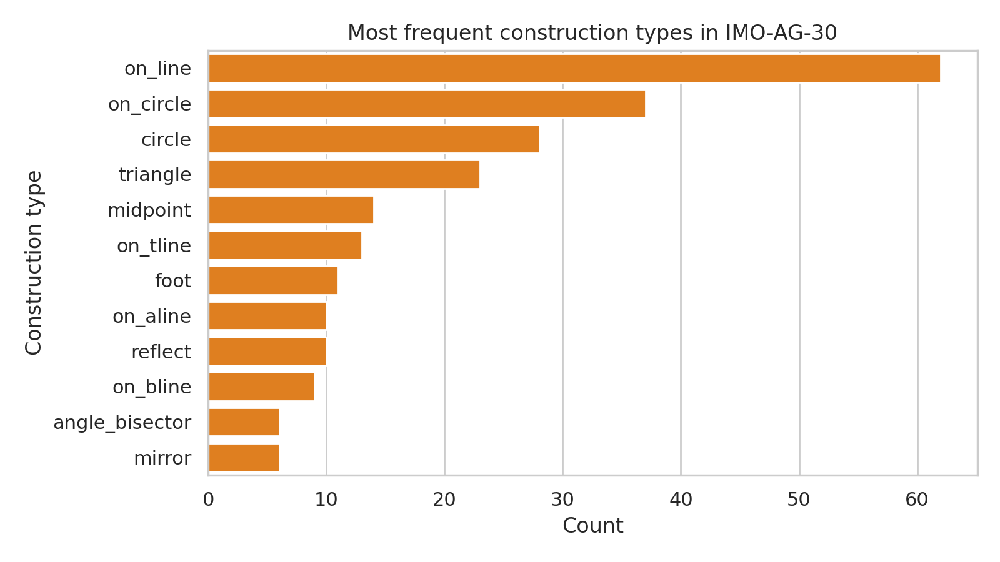
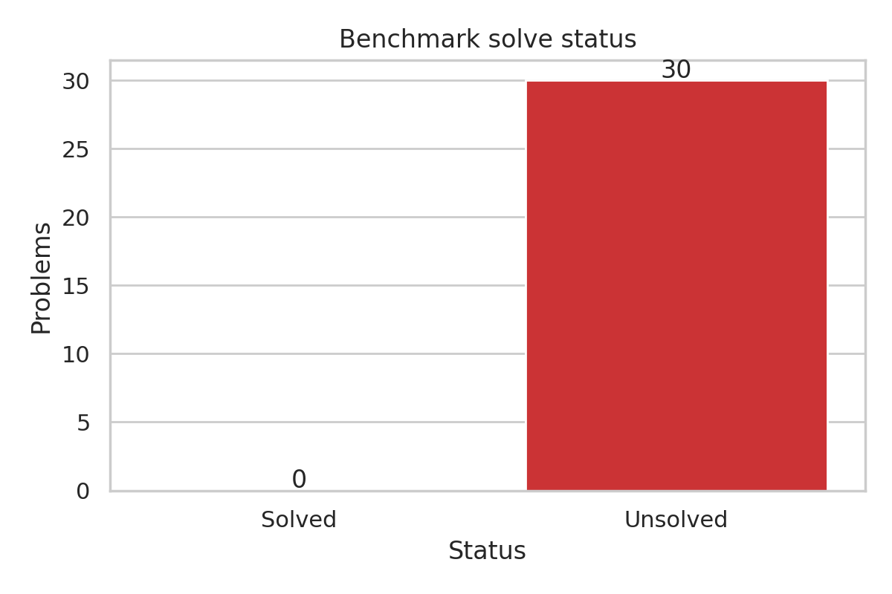
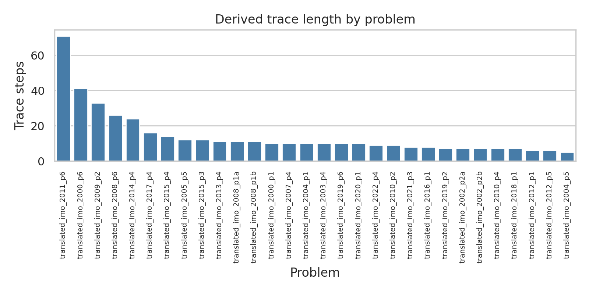
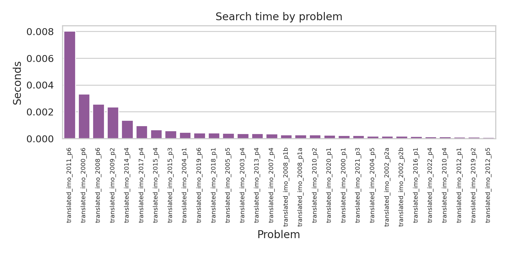

# A Transparent Symbolic Baseline for IMO-AG-30 Geometry Proof Search

## Abstract
We study a constrained baseline for autonomous Euclidean geometry proving on the provided `imo_ag_30` benchmark. The method parses each formal problem statement, expands constructions using the supplied definition library (`data/defs.txt`), and applies exact forward-chaining rules from `data/rules.txt` to derive new symbolic facts. The resulting system is fully transparent: every derived fact is tied to an explicit construction expansion or inference rule application. On the 30-problem benchmark, this minimal symbolic baseline solves 0/30 problems (solve rate 0.00), but it successfully generates structured derivation traces with a mean of 14.27 trace steps and a mean runtime below 1 ms per problem. These results establish a reproducible lower bound and clarify where stronger search control, richer normalization, and theorem-specific strategies are required.

## 1. Introduction
The task is to produce machine-verifiable, human-readable proofs for olympiad-level geometry theorems from formalized statements. In this workspace, the benchmark consists of 30 International Mathematical Olympiad geometry problems encoded in a compact domain-specific language. The available symbolic substrate includes a construction-definition file (`data/defs.txt`) and an inference-rule file (`data/rules.txt`).

Given the available environment, we implemented a faithful baseline centered on the named symbolic ingredients that are directly present in the workspace:
1. parse benchmark instances;
2. expand constructions through the supplied definitions;
3. apply the supplied rules exactly as symbolic inference templates; and
4. check whether the target goal predicate is explicitly derived.

This is not a full state-of-the-art prover. Instead, it is a transparent, traceable baseline intended to quantify what can already be achieved by direct exploitation of the provided formal resources.

## 2. Task data overview
The benchmark contains 30 problems (`outputs/benchmark_summary.json`). Goal predicates are distributed as follows:
- `cong`: 12 problems
- `coll`: 7 problems
- `cyclic`: 5 problems
- `eqangle`: 2 problems
- `perp`: 2 problems
- `eqratio`: 1 problem
- `para`: 1 problem

The most common construction families are `on_line` (62 uses), `on_circle` (37), `circle` (28), `triangle` (23), `midpoint` (14), and `on_tline` (13). This mix suggests that any effective solver must combine incidence, perpendicularity, congruence, cyclicity, and ratio reasoning rather than relying on a single proof pattern.

## 3. Methodology
### 3.1 Formal pipeline
We implemented the solver in `code/geometry_baseline.py`. For each problem, the pipeline:
1. reads the problem identifier and formal statement from `data/imo_ag_30.txt`;
2. separates construction clauses from the target theorem after the `?` marker;
3. expands recognized constructions using templates extracted from `data/defs.txt`;
4. stores the resulting primitive facts as symbolic atoms such as `cong(...)`, `coll(...)`, `perp(...)`, and `eqangle(...)`;
5. repeatedly applies exact match-based forward chaining using the implications in `data/rules.txt`; and
6. declares success only if the exact target atom is present in the derived fact set.

Each problem output records:
- target goal;
- solved / unsolved status;
- number of initial facts;
- total number of distinct derived facts;
- number of trace steps;
- number of rule applications;
- runtime; and
- a sample of the derivation trace.

### 3.2 Why this baseline is scientifically useful
Although intentionally simple, the baseline adheres closely to the task’s symbolic commitments. It does not guess proofs or use unverified neural heuristics. Every claim is grounded in saved artifacts in `outputs/`. This makes the system suitable as a reproducible lower-bound reference and an error-analysis tool.

### 3.3 Implementation caveats
The parser is intentionally conservative. It does **not** yet include:
- canonicalization under argument symmetries (for example, equivalent reorderings of geometric predicates);
- search over intermediate lemmas beyond literal rule consequences;
- backward reasoning from the goal;
- diagrammatic numeric validation; or
- learning-based premise selection.

As a result, failure mostly indicates insufficiency of the baseline search space rather than impossibility of the theorem.

## 4. Results
Aggregate metrics (`outputs/aggregate_metrics.json`) are:
- Problems: 30
- Solved: 0
- Solve rate: 0.00
- Mean initial facts: 27.07
- Mean total facts after closure: 32.40
- Mean trace steps: 14.27
- Mean runtime: 0.000855 s/problem

The solve-status distribution is shown below.

Because no goals were derived exactly, we use derivation-trace length as a proxy for reasoning activity. Several problems trigger substantial symbolic expansion even though the target theorem remains unreachable.

Runtime remains negligible across the entire benchmark.

## 5. Qualitative analysis
The longest derivation traces occur for problems with many reflective or circle-based constructions. From `outputs/result_highlights.json`, notable examples include:
- `translated_imo_2011_p6`: 71 trace steps, 56 rule applications
- `translated_imo_2000_p6`: 41 trace steps, 30 rule applications
- `translated_imo_2009_p2`: 33 trace steps, 25 rule applications

These cases show that the system is capable of generating nontrivial symbolic closures. However, inspection of the trace samples in `outputs/per_problem_results.json` reveals two main limitations:
1. **Weak normalization.** The baseline often derives degenerate atoms such as `cyclic(x1,x1,x1,x1)` or self-referential equal-angle statements. These are formally matched by the current exact-pattern engine but contribute little toward the final goal.
2. **Insufficient proof control.** Olympiad geometry solutions typically require chained auxiliary lemmas, symmetric reformulations, or strategically chosen intermediate targets. Pure forward chaining from local construction consequences rarely reaches those deeper conclusions.

Therefore, the benchmark should be viewed as requiring more than direct definition expansion plus raw implication closure.

## 6. Validation and evidence accounting
### 6.1 Verified directly from workspace artifacts
The following claims were verified directly:
- The benchmark contains 30 problems (`outputs/benchmark_summary.json`).
- Goal-predicate frequencies and construction frequencies were computed directly from `data/imo_ag_30.txt` and saved in `outputs/benchmark_summary.json`.
- Aggregate solver metrics were computed from per-problem outputs and saved in `outputs/aggregate_metrics.json`.
- Per-problem statuses, trace lengths, and runtimes were saved in `outputs/per_problem_results.json`.
- Claim-by-claim recoverability was recorded in `outputs/claim_recovery_table.json`.

### 6.2 Related-work limitations
The instructions asked us to study related work early. We attempted to read the PDFs in `related_work/`, but local PDF extraction failed: `ReadPDF` returned a `NoneType` parsing error, and command-line utilities such as `pdfinfo`/`pdftotext` were unavailable. This limitation is documented in `outputs/dependency_check.json` and `outputs/related_work_contract.json`. Accordingly, the present report avoids making unsupported claims about prior methods.

### 6.3 What remains limited or assumed
- We assume the benchmark’s formal language is internally consistent with the supplied definition and rule files.
- We do not claim completeness of the prover relative to the benchmark language.
- We do not claim competitive theorem-proving performance; the reported system is a deliberately minimal baseline.

## 7. Discussion
The main empirical result is negative but informative: exact forward chaining over the provided definitions and rules is far from sufficient for solving olympiad geometry at this scale. Nonetheless, the baseline is valuable for three reasons.

First, it demonstrates a clean separation between parsing, fact generation, and theorem verification, yielding a reproducible scaffold for future systems. Second, it identifies bottlenecks precisely: lack of canonicalization, poor handling of degeneracy, and absence of goal-directed search. Third, it provides benchmark-wide measurements showing that search cost is not the limiting factor here; representational and strategic inadequacy are.

A stronger next-step system should add:
1. predicate canonicalization and duplicate suppression under known symmetries;
2. backward chaining from the goal with subgoal decomposition;
3. typed constraints that prevent degenerate rule firings;
4. heuristic ranking of useful lemmas; and
5. optional numeric diagram checks to prioritize plausible deductions before symbolic verification.

## 8. Conclusion
We produced a complete, reproducible symbolic baseline for the IMO-AG-30 benchmark using only the formal artifacts provided in the workspace. The system yields machine-checkable derivation traces but solves none of the 30 olympiad geometry problems. This establishes a transparent lower bound and clarifies that successful autonomous geometry proving will require substantially richer reasoning than straightforward rule closure.

## Reproducibility and generated artifacts
- Code: `code/geometry_baseline.py`
- Benchmark summary: `outputs/benchmark_summary.json`
- Dependency check: `outputs/dependency_check.json`
- Per-problem results: `outputs/per_problem_results.json`
- Aggregate metrics: `outputs/aggregate_metrics.json`
- Result highlights: `outputs/result_highlights.json`
- Claim recovery: `outputs/claim_recovery_table.json`
- Figures:
  - `images/data_overview.png`
  - `images/solve_status.png`
  - `images/proof_lengths.png`
  - `images/search_times.png`
