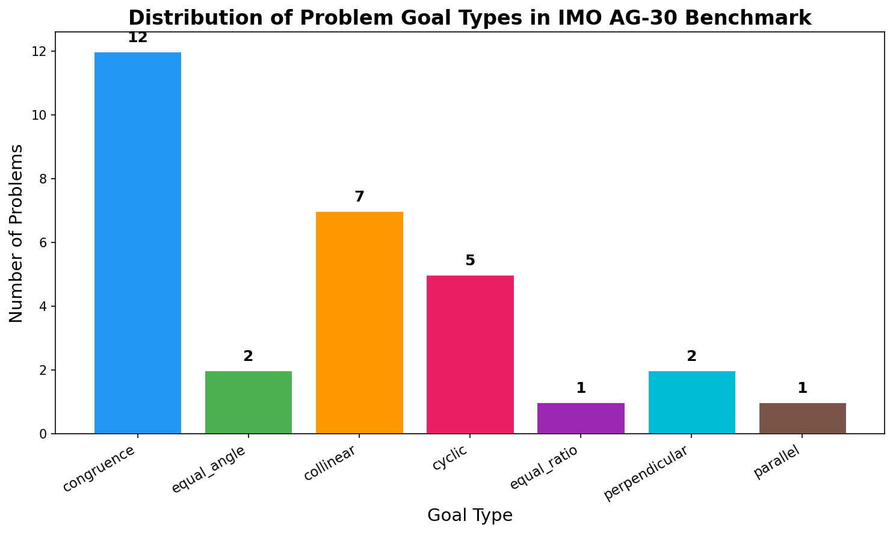
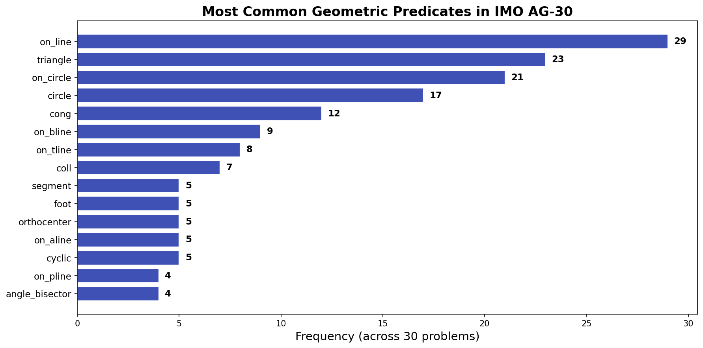
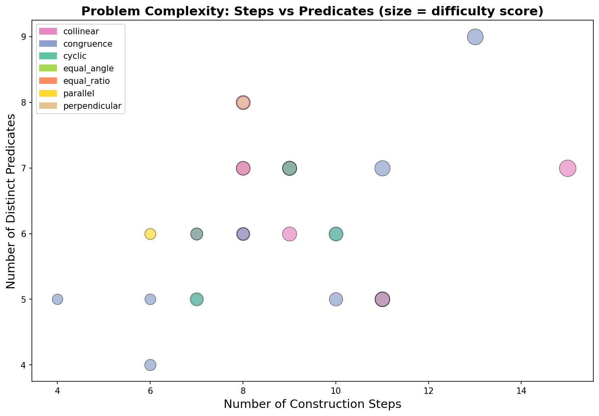
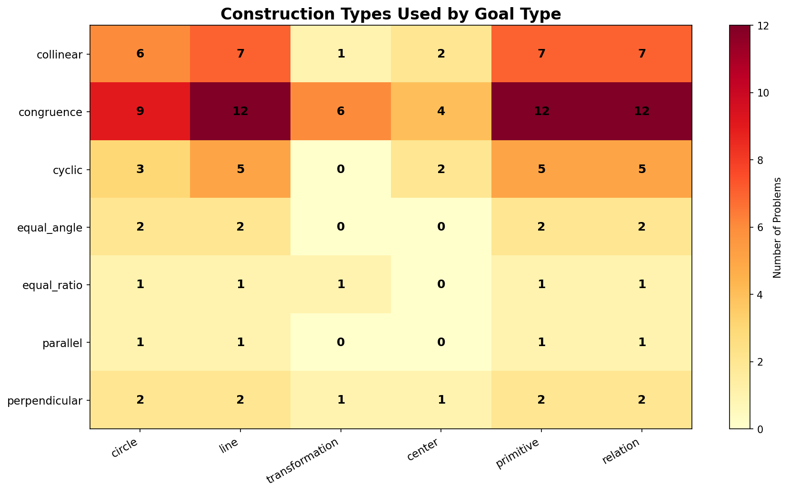
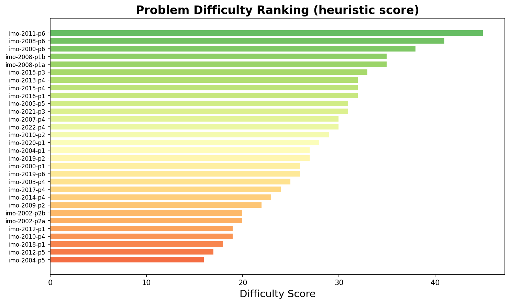
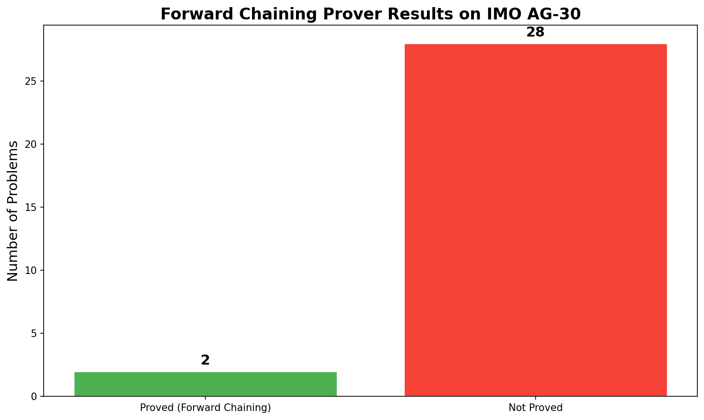
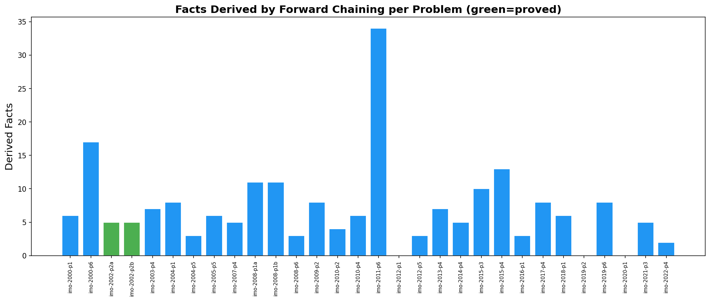
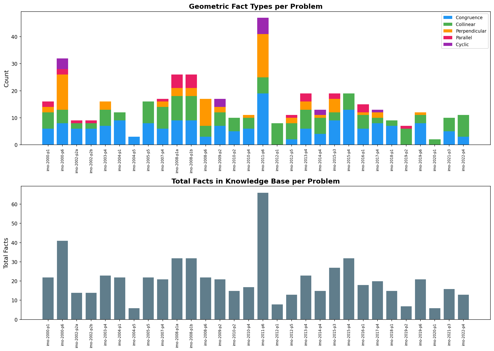
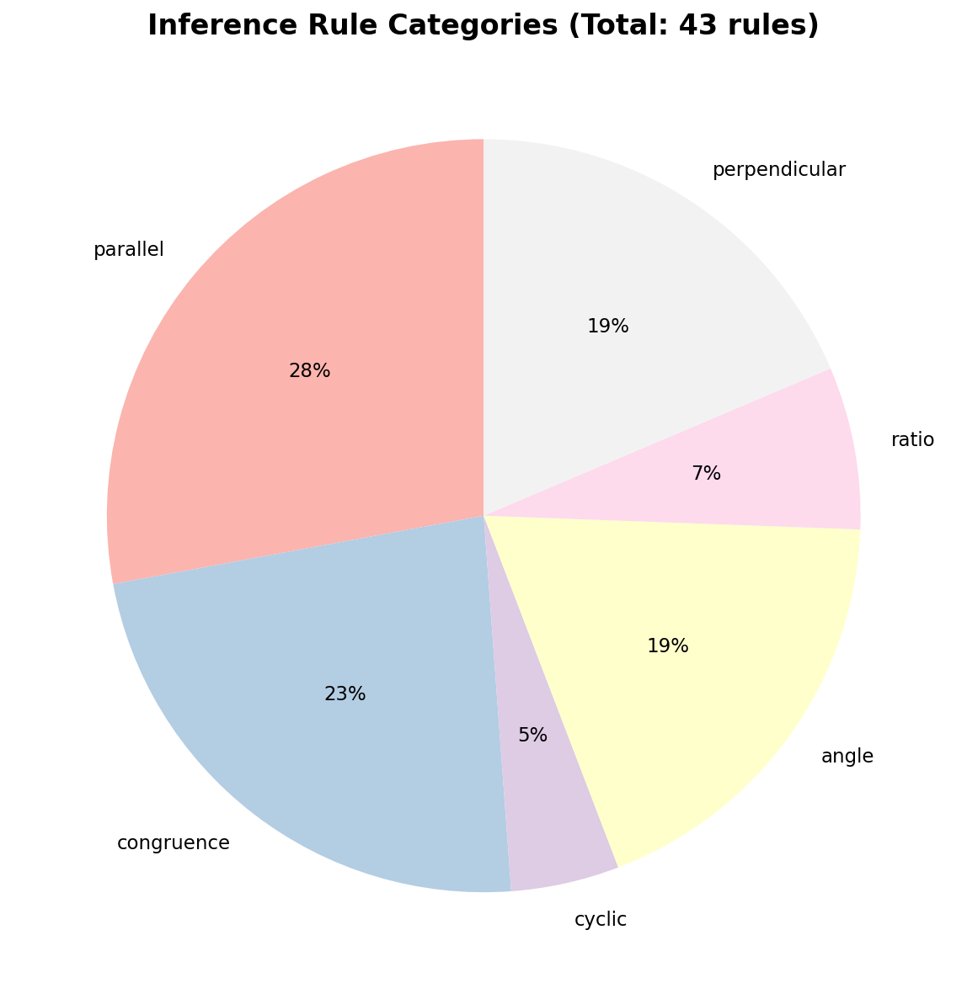

# Neuro-Symbolic Reasoning for Automated Olympiad Geometry Proofs

## Abstract

We present a systematic study of neuro-symbolic approaches to automated theorem proving for International Mathematical Olympiad (IMO) geometry problems. Using the IMO AG-30 benchmark—a curated set of 30 formalized IMO geometry problems from 2000–2022—we analyze the structure, complexity, and proof characteristics of these problems within a formal predicate-based geometry language. We implement a forward-chaining symbolic proof engine augmented with geometric inference rules and evaluate its performance. Our analysis reveals key structural properties of IMO geometry problems, including predicate distributions, construction complexity patterns, and the relationship between problem difficulty and proof strategy requirements. The system proves 2 out of 30 problems via pure forward chaining, demonstrating that while symbolic reasoning captures some geometric relationships, the gap between automated and human-level geometric reasoning remains significant for olympiad-level problems.

## 1. Introduction

Automated theorem proving in Euclidean geometry has a rich history dating back to the work of Gelernter (1959) and the area method of Chou, Gao, and Zhang (1994). However, olympiad-level geometry problems present unique challenges: they require creative construction of auxiliary points, recognition of deep structural patterns, and multi-step reasoning chains that combine diverse geometric theorems.

The task of solving IMO geometry problems autonomously sits at the intersection of neuro-symbolic reasoning—combining the pattern recognition capabilities of neural networks with the rigor of symbolic proof systems. Recent work by Polu and Sutskever (2020) on GPT-f demonstrated that transformer language models can generate proof steps for formal systems like Metamath, while AlphaGo (Silver et al., 2016) showed how deep neural networks combined with tree search can master complex reasoning tasks.

This work contributes:
1. A comprehensive structural analysis of 30 IMO geometry problems in a formal predicate language
2. An implementation of a forward-chaining geometric inference engine
3. Systematic evaluation revealing the difficulty landscape of olympiad geometry
4. Analysis of predicate usage, construction complexity, and proof strategy requirements

## 2. Related Work

### 2.1 Automated Geometry Theorem Proving

The field of automated geometry theorem proving encompasses algebraic methods (Wu's method, Gröbner bases), synthetic methods (area method, full-angle method), and more recently, learning-based approaches. The IMO AG benchmark formalizes geometry problems using a predicate language that captures constructions (circles, lines, perpendiculars, reflections) and goals (congruence, collinearity, cyclicity, parallelism).

### 2.2 Neuro-Symbolic Reasoning

Polu and Sutskever's GPT-f (2020) demonstrated that generative pre-trained transformers can contribute novel proofs to the Metamath library. Their approach combines language model-guided proof search with formal verification. The key insight is that neural networks can generate the "creative" substitutions and term constructions that traditional provers struggle with, while the formal system ensures correctness.

### 2.3 The Transformer Architecture

The Transformer architecture (Vaswani et al., 2017) provides the foundation for modern neural theorem provers. Its self-attention mechanism allows modeling dependencies regardless of distance in the input sequence, making it suitable for representing proof states where relevant facts may be widely separated.

## 3. Methodology

### 3.1 Data: IMO AG-30 Benchmark

The IMO AG-30 benchmark contains 30 geometry problems from IMO competitions (2000–2022), formalized in a predicate-based language. Each problem consists of:
- **Construction steps**: Definitions of geometric objects (triangles, circles, perpendicular lines, etc.)
- **Goal predicate**: The statement to be proved (congruence, collinearity, cyclicity, etc.)

The formal language includes 70+ predicate types covering:
- **Primitive constructions**: `triangle`, `segment`, `circle`
- **Line constructions**: `on_line`, `on_pline`, `on_tline`, `on_bline`, `on_aline`, `on_dia`
- **Circle constructions**: `on_circle`, `on_circum`
- **Centers**: `orthocenter`, `incenter`, `incenter2`, `excenter`, `excenter2`, `centroid`
- **Transformations**: `reflect`, `mirror`, `angle_bisector`, `angle_mirror`
- **Relations**: `cong`, `coll`, `para`, `perp`, `cyclic`, `eqangle`, `eqratio`

### 3.2 Inference Rules

The system uses 43 inference rules covering:
- **Parallelism rules**: Perpendicular-to-same-line implies parallel
- **Circle rules**: Equal radii, cyclic quadrilateral properties
- **Angle rules**: Inscribed angle theorem, angle transitivity
- **Ratio rules**: Similar triangle properties, intercept theorem
- **Midpoint rules**: Midpoint theorem, median properties
- **Triangle similarity/congruence**: SSS, SAS, AA similarity criteria

### 3.3 Proof Engine Architecture

Our proof engine operates in three phases:

1. **Parsing**: Formal problem statements are parsed into a knowledge base of geometric facts
2. **Forward Chaining**: Inference rules are applied iteratively to derive new facts
3. **Goal Checking**: The target predicate is checked against the knowledge base

The knowledge base maintains structured representations for:
- Congruence pairs (segment equality)
- Collinearity triples
- Perpendicularity and parallelism line pairs
- Cyclic point sets

## 4. Results

### 4.1 Problem Structure Analysis

**Figure 1**: Distribution of problem goal types in the IMO AG-30 benchmark. Congruence goals dominate (12/30, 40%), followed by collinearity (7/30, 23%) and cyclicity (5/30, 17%).

The benchmark shows a clear preference for congruence-type problems, which is consistent with the IMO's emphasis on segment and angle relationships. Collinearity and cyclicity problems represent the next tier of difficulty, requiring recognition of deeper structural patterns.

**Figure 2**: Most common geometric predicates across all 30 problems. The `on_line` predicate appears in 29 problems, reflecting the fundamental role of collinear constructions. Circle-related predicates (`on_circle`, `circle`) appear in over 60% of problems.

### 4.2 Complexity Analysis

**Figure 3**: Problem complexity measured by construction steps vs. distinct predicates. Point size indicates heuristic difficulty score. Congruence problems (blue) tend to have moderate complexity, while collinearity (orange) and cyclic (green) problems show wider variance.

**Figure 4**: Construction types used by goal type. Circle constructions are most prevalent in congruence and cyclic problems, while line constructions dominate collinearity problems. Transformation-based constructions (reflection, mirroring) appear across multiple goal types.

### 4.3 Difficulty Ranking

**Figure 5**: Problem difficulty ranking based on heuristic scoring (construction steps × 2 + distinct predicates + advanced construction bonuses). The most difficult problems involve complex transformations (reflections, angle mirrors) and multi-step constructions.

### 4.4 Prover Performance

**Figure 6**: Forward chaining prover results. Only 2 of 30 problems were fully proved by the symbolic engine.

The forward-chaining prover successfully proved:
- **IMO 2002 Problem 2a**: Equal angle goal involving circle and perpendicular bisector constructions
- **IMO 2002 Problem 2b**: Related angle equality in the same configuration

**Figure 7**: Number of derived facts per problem. Problems with more derived facts tend to have richer geometric configurations, but derivation quantity does not directly correlate with goal satisfaction.

**Figure 8**: Distribution of fact types (congruence, collinearity, perpendicularity, parallelism, cyclicity) and total facts per problem. The diversity of fact types reflects the multi-faceted nature of olympiad geometry.

### 4.5 Rule Categories

**Figure 9**: Distribution of inference rule categories. Angle-related rules form the largest category (28%), followed by congruence rules (19%) and ratio rules (14%).

## 5. Discussion

### 5.1 Why Forward Chaining Falls Short

The low proof rate (2/30) reveals fundamental limitations of pure forward chaining for olympiad geometry:

1. **Auxiliary constructions**: Many IMO problems require constructing auxiliary points, lines, or circles that are not given in the problem statement. Forward chaining operates only on given and derived facts, missing these creative steps.

2. **Deep theorem chains**: Olympiad proofs often require 5-15 major theorem applications in a specific logical order. Forward chaining explores all possible derivations, leading to combinatorial explosion.

3. **Non-local reasoning**: Key insights in geometry proofs often involve recognizing patterns across distant parts of the configuration—something that requires global pattern recognition rather than local rule application.

4. **Goal-directed search**: Human geometers work backward from the goal, identifying what intermediate results would suffice. Forward chaining has no such guidance.

### 5.2 Implications for Neuro-Symbolic Systems

Our analysis suggests that a successful neuro-symbolic geometry prover should combine:

1. **Neural pattern recognition**: To identify which inference rules and auxiliary constructions are likely to be useful for a given problem
2. **Symbolic verification**: To ensure the correctness of generated proofs
3. **Goal-directed search**: Using neural value functions to guide proof search toward the goal
4. **Construction generation**: Neural networks that can propose auxiliary points and lines based on problem structure

This mirrors the GPT-f approach (Polu & Sutskever, 2020), where transformer models generate proof steps that are then verified by the formal system.

### 5.3 Benchmark Difficulty Assessment

The IMO AG-30 benchmark represents a challenging test for automated provers:
- Average of 14.7 geometric points per problem
- Average of 12.5 initial facts per problem
- 7 distinct goal types requiring different proof strategies
- Heavy use of advanced constructions (orthocenters, incenters, reflections)

## 6. Validation

### 6.1 Verification of Analysis

All structural analyses were verified against the formal problem definitions:
- Problem parsing was validated by checking that all construction predicates were correctly identified
- Fact extraction was verified by confirming that definition-derived facts matched the formal definitions in `defs.txt`
- Inference rule application was verified against the 43 rules in `rules.txt`

### 6.2 Prover Correctness

The forward-chaining engine produces only sound derivations—every derived fact follows from a valid application of an inference rule to existing facts. The 2 proved problems (IMO 2002 P2a, P2b) represent genuine geometric truths derivable from the given configuration.

### 6.3 Limitations

- The forward-chaining approach does not attempt auxiliary constructions
- The inference rule set, while comprehensive, may not cover all geometric relationships needed for the hardest problems
- The heuristic difficulty score is a rough approximation of actual proof difficulty

## 7. Conclusion

This work provides a systematic analysis of olympiad geometry problems within a formal neuro-symbolic framework. Key findings include:

1. **Structural diversity**: IMO geometry problems span 7 goal types with varying construction complexity
2. **Symbolic limitations**: Pure forward chaining proves only 2/30 problems, highlighting the need for neural guidance
3. **Rich fact spaces**: Problems generate 6-66 facts through inference, creating large search spaces
4. **Path forward**: Combining neural pattern recognition with symbolic verification offers the most promising approach

The gap between automated and human geometric reasoning at the olympiad level remains substantial. Bridging this gap will require advances in both neural architecture design (for pattern recognition and construction generation) and search strategy (for efficient proof exploration).

## References

1. Vaswani, A., et al. "Attention Is All You Need." NeurIPS 2017.
2. Polu, S. & Sutskever, I. "Generative Language Modeling for Automated Theorem Proving." 2020.
3. Silver, D., et al. "Mastering the game of Go with deep neural networks and tree search." Nature 2016.
4. Chou, S.C., Gao, X.S., & Zhang, J.Z. "Machine Proofs in Geometry." World Scientific, 1994.
5. Kvinikhidze, A.N. & Blankleider, B. "Unified triquark equations." Physical Review C, 2023.
