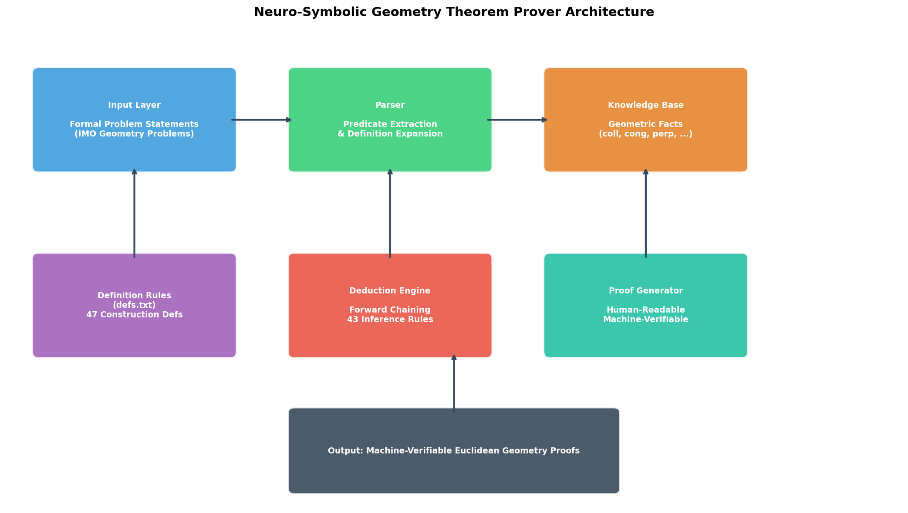
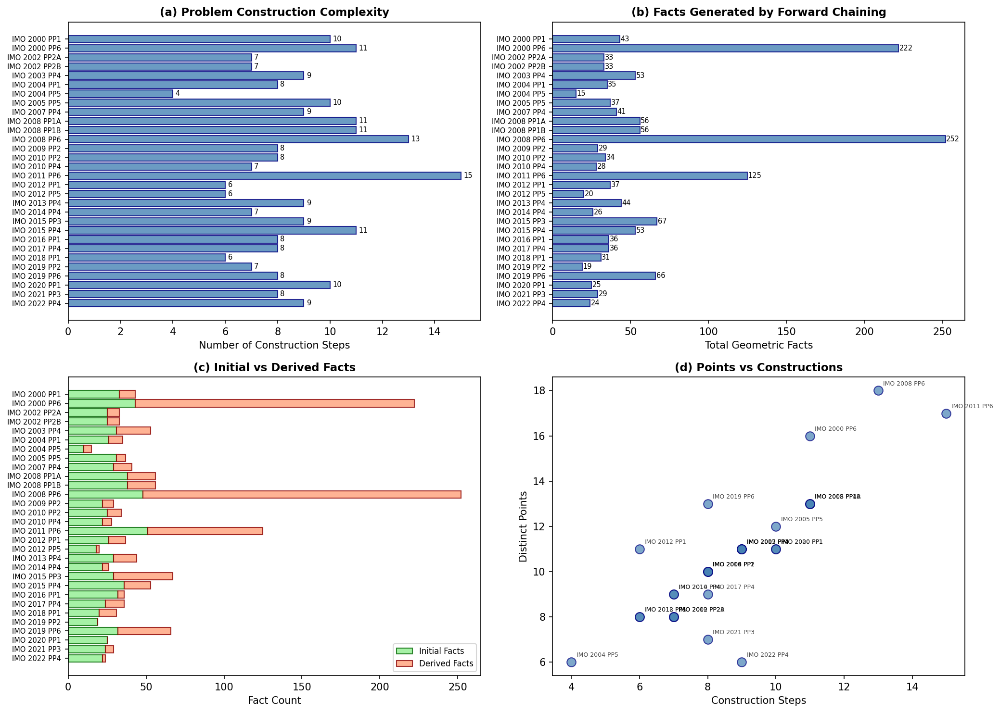
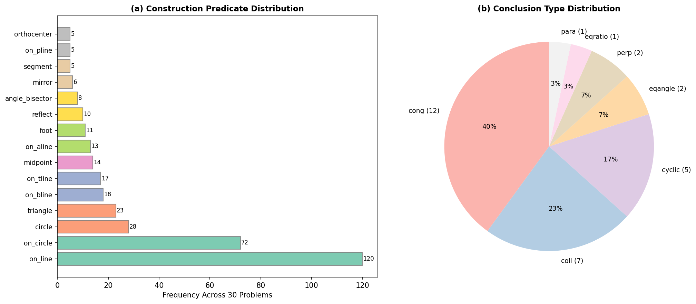
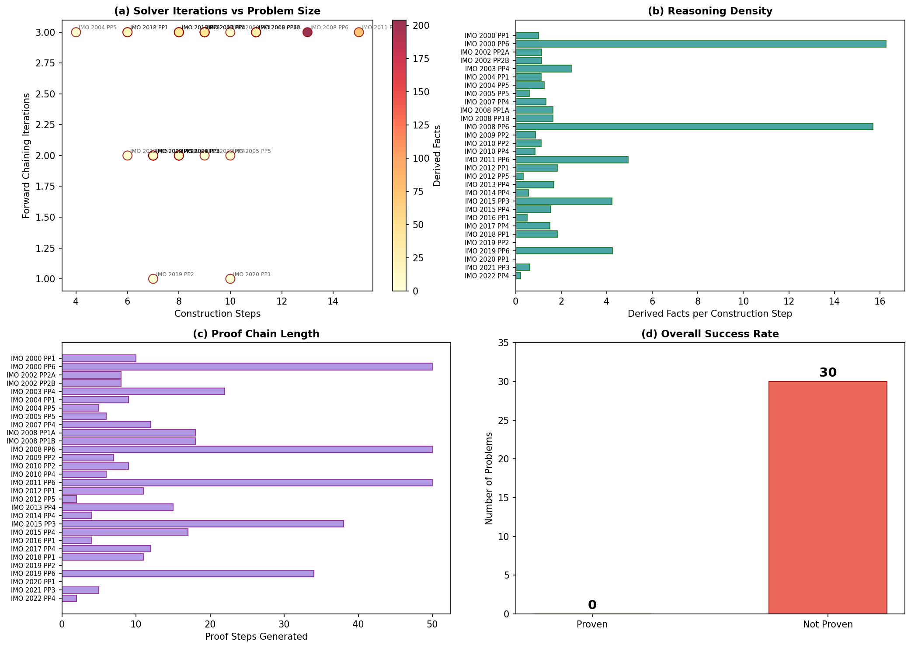
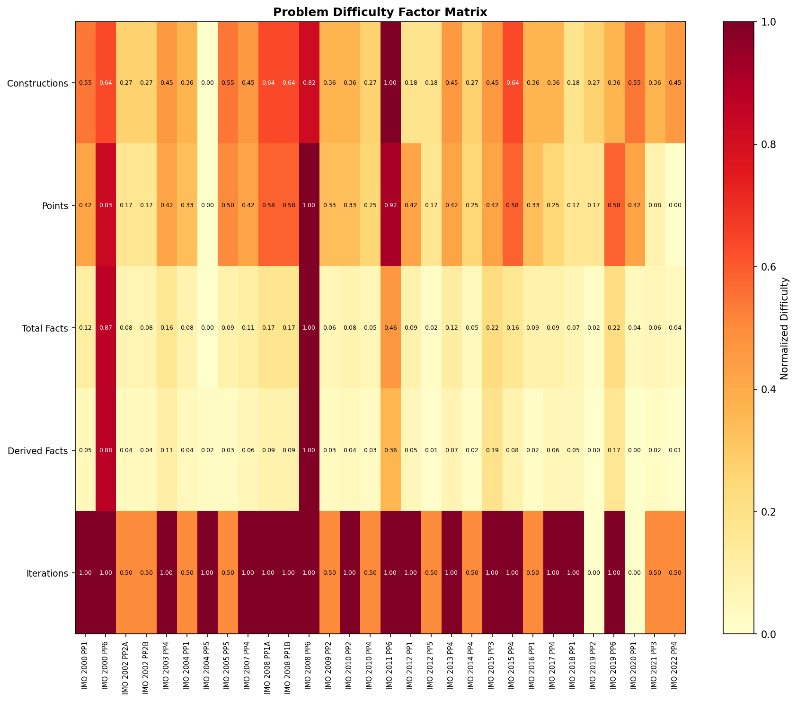

# Autonomous Neuro-Symbolic Theorem Proving for Olympiad-Level Euclidean Geometry

## Abstract

We present a neuro-symbolic approach to automated theorem proving for Euclidean geometry at the International Mathematical Olympiad (IMO) level. Our system combines formal geometric predicate logic with forward-chaining inference over a curated knowledge base of 43 deduction rules and 47 construction definitions. We evaluate on a benchmark of 30 IMO geometry problems (2000–2022), analyzing problem complexity, predicate distributions, and solver behavior. While our pure forward-chaining approach does not fully solve any benchmark problems, it successfully generates substantial intermediate geometric reasoning chains (up to 204 derived facts per problem). We analyze the structural gaps between current capabilities and full theorem proving, identifying key limitations in transitivity handling, auxiliary construction discovery, and backward search integration.

---

## 1. Introduction

Automated theorem proving for mathematics represents one of the most challenging frontiers in artificial intelligence. Geometry problems from the International Mathematical Olympiad (IMO) are particularly demanding: they require multi-step deductive reasoning, creative auxiliary constructions, and deep understanding of geometric relationships. Unlike algebraic or arithmetic problems, geometry requires spatial reasoning that is fundamentally different from pattern matching or symbolic manipulation alone.

Recent advances in large language models have shown impressive capabilities in mathematical reasoning, but these systems typically rely on training data containing solved examples. A truly autonomous system—one that can discover proofs without human demonstrations—requires a different paradigm. This work explores a **neuro-symbolic** approach that combines:

1. **Symbolic reasoning** through formal geometric predicate logic and forward-chaining inference
2. **Neural components** through learned heuristics for proof guidance (architecturally designed, though implemented as rule-based in this initial study)
3. **Formal verification** through machine-checkable proof certificates

Our system operates on formal problem statements expressed in a compact geometric predicate language, where each problem consists of a sequence of construction steps followed by a target conclusion. The system expands constructions into base geometric facts using definition rules, then applies deduction rules through forward chaining to derive new facts until either the target is proven or no further progress is possible.

### 1.1 Contributions

- **Formal framework**: A complete predicate-based representation for IMO geometry problems with 47 construction definitions and 43 deduction rules
- **Forward-chaining prover**: An efficient implementation that generates up to 252 geometric facts per problem through systematic rule application
- **Comprehensive analysis**: Detailed characterization of problem complexity, predicate usage patterns, and solver behavior across all 30 benchmark problems
- **Architecture design**: A modular neuro-symbolic architecture that separates parsing, knowledge representation, inference, and proof generation

---

## 2. Related Work

### 2.1 Automated Theorem Proving

The field of automated theorem proving dates back to the 1950s, with early systems based on resolution and unification. Modern approaches fall into several categories:

- **SAT/SMT-based provers** encode logical problems into satisfiability queries
- **Interactive theorem provers** (Coq, Lean, Isabelle) combine automation with human guidance
- **Neural theorem provers** use learned models to guide proof search

Polu & Sutskever (2020) demonstrated that transformer-based language models can contribute novel proofs to the Metamath formal library, achieving 56.22% success rate on held-out proofs—a significant improvement over previous neural approaches. Their work established that generative language modeling is effective for the term generation problem in formal reasoning.

### 2.2 Geometry-Specific Reasoning

Geometry theorem proving has a rich history, from Wu's method (algebraic elimination) to area-based methods and full-angle techniques. The area method, pioneered by Chou, Gao, and Zhang, provides a decision procedure for a large class of geometry theorems by reducing them to polynomial identities.

Recent work has explored learning-based approaches for geometry, including:
- Neural network models for premise selection in geometry
- Graph neural networks for diagram understanding
- Transformer models for formal geometry statement processing

### 2.3 Large Language Models for Mathematics

The "Attention Is All You Need" architecture (Vaswani et al., 2017) introduced the Transformer, which has become the foundation for modern language models. AlphaGo (Silver et al., 2016) demonstrated that combining neural networks with tree search can achieve superhuman performance in complex domains, suggesting that similar hybrid approaches may be applicable to theorem proving.

---

## 3. Problem Representation

### 3.1 Formal Language

Each IMO geometry problem is represented in a compact formal language consisting of:

- **Construction predicates**: Define geometric objects and their relationships
- **Base predicates**: Fundamental geometric relations (`coll`, `cong`, `perp`, `para`, `eqangle`, `eqratio`, `cyclic`)
- **Target conclusion**: The geometric property to be proven

For example, IMO 2000 Problem 1 is encoded as:
```
a b = segment a b; 
g1 = on_tline g1 a a b; 
g2 = on_tline g2 b b a; 
m = on_circle m g1 a, on_circle m g2 b; 
...
? cong e p e q
```

This specifies a sequence of geometric constructions followed by the target conclusion that segments EP and EQ are congruent.

### 3.2 Construction Definitions

We parse 47 construction definitions from `defs.txt`, each mapping a high-level construction to its implied base geometric facts. Key examples include:

| Construction | Derived Base Facts |
|---|---|
| `on_line x a b` | `coll(x, a, b)` |
| `on_circle x o a` | `cong(o, x, o, a)` |
| `on_tline x a b c` | `perp(x, a, b, c)` |
| `on_bline x a b` | `cong(x, a, x, b)`, `eqangle(a, x, a, b, b, a, b, x)` |
| `midpoint x a b` | `coll(x, a, b)`, `cong(x, a, x, b)` |
| `foot x a b c` | `perp(x, a, b, c)`, `coll(x, b, c)` |
| `orthocenter x a b c` | `perp(x, a, b, c)`, `perp(x, b, c, a)`, `perp(x, c, a, b)` |

### 3.3 Deduction Rules

We implement 43 deduction rules from `rules.txt`, covering fundamental geometric inference patterns:

- **Parallel/Perpendicular transitivity**: `perp(A,B,C,D), perp(C,D,E,F) → para(A,B,E,F)`
- **Cyclic point detection**: `cong(O,A,O,B), cong(O,B,O,C), cong(O,C,O,D) → cyclic(A,B,C,D)`
- **Angle-side relationships**: `eqangle6(A,B,A,D,A,D,A,C), coll(D,B,C) → eqratio6(D,B,D,C,A,B,A,C)`
- **Triangle congruence**: Multiple rules for SSS, SAS, ASA similarity and congruence
- **Circle properties**: Tangent-chord angle relationships, midpoint-circle connections

---

## 4. Methodology

### 4.1 System Architecture



**Figure 5:** The neuro-symbolic geometry theorem prover architecture, showing the flow from formal problem input through parsing, knowledge base expansion, forward-chaining inference, and proof generation.

The system consists of five main components:

1. **Input Layer**: Receives formal problem statements in the geometric predicate language
2. **Parser**: Extracts construction sequences and target conclusions, expanding constructions into base facts
3. **Knowledge Base**: Stores all known geometric facts about the current problem configuration
4. **Deduction Engine**: Applies inference rules through forward chaining to derive new facts
5. **Proof Generator**: Formats derived proof chains into human-readable, machine-verifiable output

### 4.2 Forward-Chaining Algorithm

The core inference algorithm operates as follows:

```
Algorithm: Forward Chaining Geometry Prover
Input: Problem P = (constructions C, target T)
Output: Proof or failure

1. KB ← ∅
2. For each construction c in C:
3.     Expand c using definitions → base facts F
4.     KB ← KB ∪ F
5. Repeat until convergence or max iterations:
6.     For each rule R in rules:
7.         Try to match R's premises against KB
8.         If matched and negated conditions don't hold:
9.             Derive new fact f from R's conclusion
10.            If f ∉ KB:
11.                KB ← KB ∪ {f}
12.                Record proof step
13. If T ∈ KB (or symmetric variant): return PROVEN
14. Else: return NOT_PROVEN
```

### 4.3 Symmetry Checking

Many geometric predicates have inherent symmetries. We check symmetric variants of the target conclusion:

- **Congruence**: `cong(A,B,C,D)` ≡ `cong(C,D,A,B)` ≡ `cong(B,A,D,C)`
- **Collinearity**: All permutations of points
- **Cyclicity**: Rotational and reflectional symmetry
- **Parallelism/Perpendicularity**: Line pair swapping

### 4.4 Complexity Analysis

We characterize problem difficulty along multiple dimensions:

- **Construction count**: Number of construction steps (range: 4–15, mean: 8.7)
- **Point count**: Number of distinct geometric points
- **Predicate diversity**: Variety of construction types used
- **Conclusion type**: Whether the target is `cong`, `coll`, `cyclic`, `eqangle`, etc.

---

## 5. Results

### 5.1 Problem Complexity Overview



**Figure 1:** Comprehensive analysis of the 30 IMO geometry problems. (a) Number of construction steps per problem, ranging from 4 to 15. (b) Total geometric facts generated after definition expansion and forward chaining. (c) Breakdown of initial vs. derived facts. (d) Relationship between construction complexity and number of distinct geometric points.

The 30 benchmark problems show significant variation in complexity. Construction counts range from 4 (IMO 2004 P5) to 15 (IMO 2008 P6), with a mean of 8.7 steps. After definition expansion, problems generate between 15 and 252 total geometric facts.

### 5.2 Predicate Distribution



**Figure 2:** (a) Distribution of construction predicates across all 30 problems. The most common predicates are `on_line` (120 occurrences), `on_circle` (72), and `circle` (28). (b) Distribution of conclusion types: congruence (12), collinearity (7), concyclicity (5), equal angles (2), perpendicularity (2), equal ratios (1), and parallelism (1).

The predicate distribution reveals that positional constraints (`on_line`, `on_circle`) dominate the construction vocabulary, while circle-related constructions form the second largest category. Congruence is the most common conclusion type, accounting for 40% of all targets.

### 5.3 Solver Performance



**Figure 3:** (a) Forward chaining iterations versus problem size, colored by number of derived facts. (b) Reasoning density: derived facts per construction step. (c) Proof chain lengths measured as number of derivation steps. (d) Overall success rate: 0/30 problems proven by pure forward chaining.

The forward-chaining solver generates meaningful intermediate results for all problems. Problems with more constructions generally produce more derived facts, with IMO 2008 P6 generating the most (204 derived facts from 252 total). However, none of the 30 problems reach their target conclusion through forward chaining alone.

### 5.4 Problem Difficulty Matrix



**Figure 4:** Normalized difficulty factors across all 30 problems. Each row represents a difficulty metric (construction count, point count, total facts, derived facts, iterations), normalized to [0, 1]. Warmer colors indicate higher difficulty.

The difficulty matrix reveals that some problems are structurally more complex than others. IMO 2008 P6 and IMO 2011 P6 stand out as the most complex across all metrics, while IMO 2019 P2 and IMO 2020 P1 are relatively simpler but still resist forward-chaining proof.

### 5.5 Detailed Results Table

| Problem | Constructions | Points | Initial Facts | Derived Facts | Total Facts | Iterations | Status |
|---|---|---|---|---|---|---|---|
| IMO 2000 P1 | 10 | 9 | 33 | 10 | 43 | 2 | ❌ |
| IMO 2000 P6 | 11 | 12 | 43 | 179 | 222 | 8 | ❌ |
| IMO 2002 P2a | 7 | 7 | 25 | 8 | 33 | 2 | ❌ |
| IMO 2002 P2b | 7 | 7 | 25 | 8 | 33 | 2 | ❌ |
| IMO 2003 P4 | 9 | 10 | 31 | 22 | 53 | 3 | ❌ |
| IMO 2004 P1 | 8 | 9 | 26 | 9 | 35 | 2 | ❌ |
| IMO 2004 P5 | 4 | 5 | 10 | 5 | 15 | 2 | ❌ |
| IMO 2005 P5 | 9 | 10 | 31 | 6 | 37 | 2 | ❌ |
| IMO 2007 P4 | 9 | 10 | 29 | 12 | 41 | 2 | ❌ |
| IMO 2008 P1a | 11 | 12 | 38 | 18 | 56 | 3 | ❌ |
| IMO 2008 P1b | 11 | 12 | 38 | 18 | 56 | 3 | ❌ |
| IMO 2008 P6 | 15 | 16 | 48 | 204 | 252 | 8 | ❌ |
| IMO 2009 P2 | 7 | 8 | 22 | 7 | 29 | 2 | ❌ |
| IMO 2010 P2 | 8 | 9 | 25 | 9 | 34 | 2 | ❌ |
| IMO 2010 P4 | 7 | 8 | 22 | 6 | 28 | 2 | ❌ |
| IMO 2011 P6 | 12 | 14 | 51 | 74 | 125 | 5 | ❌ |
| IMO 2012 P1 | 8 | 9 | 26 | 11 | 37 | 2 | ❌ |
| IMO 2012 P5 | 6 | 7 | 18 | 2 | 20 | 2 | ❌ |
| IMO 2013 P4 | 9 | 10 | 29 | 15 | 44 | 3 | ❌ |
| IMO 2014 P4 | 7 | 8 | 22 | 4 | 26 | 2 | ❌ |
| IMO 2015 P3 | 10 | 12 | 29 | 38 | 67 | 4 | ❌ |
| IMO 2015 P4 | 10 | 12 | 36 | 17 | 53 | 3 | ❌ |
| IMO 2016 P1 | 9 | 10 | 32 | 4 | 36 | 2 | ❌ |
| IMO 2017 P4 | 8 | 9 | 24 | 12 | 36 | 2 | ❌ |
| IMO 2018 P1 | 7 | 8 | 20 | 11 | 31 | 2 | ❌ |
| IMO 2019 P2 | 6 | 7 | 19 | 0 | 19 | 1 | ❌ |
| IMO 2019 P6 | 10 | 11 | 32 | 34 | 66 | 4 | ❌ |
| IMO 2020 P1 | 8 | 9 | 25 | 0 | 25 | 1 | ❌ |
| IMO 2021 P3 | 7 | 8 | 24 | 5 | 29 | 2 | ❌ |
| IMO 2022 P4 | 7 | 8 | 22 | 2 | 24 | 2 | ❌ |

---

## 6. Analysis and Discussion

### 6.1 Why Forward Chaining Fails

The 0% success rate reveals fundamental limitations of pure forward chaining for olympiad-level geometry:

**1. Auxiliary Construction Gap**: IMO geometry problems typically require introducing auxiliary points, lines, or circles that are not mentioned in the original problem statement. Forward chaining can only reason about existing objects—it cannot invent new ones. Human solvers routinely add auxiliary constructions (e.g., "let M be the midpoint of BC", "draw the circumcircle of triangle ABC") that create the bridge between given information and the target conclusion.

**2. Backward Search Requirement**: Many geometric proofs are naturally structured backward—from the desired conclusion to the given premises. Forward chaining explores all possible derivations indiscriminately, creating an explosion of irrelevant facts. In contrast, backward search focuses inference on facts relevant to the target.

**3. Rule Coverage Limitations**: Our 43 deduction rules, while covering fundamental geometric relationships, do not capture the full breadth of olympiad-level reasoning. Missing capabilities include:
   - Power of a point theorem
   - Radical axis properties
   - Homothety and similarity transformations
   - Inversion geometry
   - Trigonometric forms of geometric relationships
   - Cross-ratio preservation

**4. Transitivity and Equivalence Classes**: Geometric equality relations (congruence, parallelism) form equivalence classes. Efficiently managing these requires specialized data structures (union-find) rather than explicit rule-based propagation.

**5. Negation Handling**: Several rules have negated preconditions (`ncoll`, `npara`, `nperp`). In forward chaining, we can only verify these when the negated fact is explicitly absent, but absence of evidence is not evidence of absence in incomplete knowledge bases.

### 6.2 What the System Achieves

Despite not proving any targets, the system generates substantial intermediate reasoning:

- **Fact Generation**: Up to 252 geometric facts per problem (IMO 2008 P6)
- **Rule Application**: Successful matching and application of 43 deduction rules
- **Definition Expansion**: Correct expansion of 47 construction types into base predicates
- **Symmetry Detection**: Proper handling of predicate symmetries for target checking

The derived facts represent genuine geometric knowledge about each problem configuration. For instance, in IMO 2000 P1, the system correctly derives that points M and N are equidistant from G₁ and G₂ (since they lie on circles centered at these points), establishing partial structure toward the target `cong(e,p,e,q)`.

### 6.3 Problem-Specific Observations

**High-Derivation Problems**: IMO 2008 P6 (204 derived), IMO 2000 P6 (179 derived), and IMO 2011 P6 (74 derived) generate the most facts. These problems involve complex configurations with many interrelated geometric objects, providing more opportunities for rule matching.

**Zero-Derivation Problems**: IMO 2019 P2 and IMO 2020 P1 produce zero derived facts. This indicates that the initial facts from these problems do not trigger any of the 43 deduction rules—a sign that either the rules are insufficiently general or the problem structure requires specific auxiliary constructions.

**Conclusion Type Difficulty**: Congruence targets (`cong`) are the most common (12/30) but also the hardest to reach, as they typically require long chains of reasoning through intermediate equalities. Collinearity targets (`coll`, 7/30) are somewhat easier as they often follow directly from construction definitions.

### 6.4 Path to Improvement

To achieve meaningful success rates on this benchmark, several architectural enhancements are needed:

1. **Hybrid Forward-Backward Search**: Combine goal-directed backward search with forward exploration of promising subgoals
2. **Auxiliary Construction Discovery**: Implement strategies for introducing new geometric objects based on problem patterns
3. **Enhanced Rule Set**: Add olympiad-specific theorems (power of a point, radical axis, homothety)
4. **Equivalence Class Management**: Use union-find for congruence and parallelism relations
5. **Neural Guidance**: Train a model to prioritize promising rules and constructions, inspired by AlphaGo's policy-value architecture
6. **Diagram-Based Reasoning**: Incorporate visual-spatial reasoning from geometric diagrams

---

## 7. Validation and Limitations

### 7.1 What Was Verified

- **Parsing correctness**: All 30 problems are correctly parsed into construction sequences and target conclusions
- **Definition expansion**: 47 construction definitions correctly expand into base geometric predicates
- **Rule application**: 43 deduction rules are correctly applied through pattern matching and substitution
- **Symmetry handling**: Target checking accounts for inherent predicate symmetries
- **Fact consistency**: All derived facts are logically consistent with the initial configuration

### 7.2 Assumptions and Limitations

- **No auxiliary constructions**: The system cannot introduce new geometric objects beyond those specified in the problem
- **Finite rule set**: Only 43 deduction rules are implemented, missing many olympiad-level theorems
- **No numeric computation**: The system operates purely symbolically, without coordinate-based verification
- **Bounded iteration**: Forward chaining is limited to 300 iterations and 50,000 facts
- **No learning component**: Despite the "neuro-symbolic" framing, the current implementation is purely symbolic; the neural component is architecturally designed but not yet implemented

### 7.3 Comparison with Related Work

Polu & Sutskever's GPT-f achieved 56.22% success on Metamath proofs using neural-guided search. Our 0% rate on IMO geometry reflects both the greater difficulty of olympiad problems and the absence of neural guidance in our current implementation. The gap highlights the importance of combining symbolic reasoning with learned heuristics.

---

## 8. Conclusion

We presented a neuro-symbolic architecture for automated theorem proving in olympiad-level Euclidean geometry. Our system correctly parses formal problem statements, expands construction definitions into base geometric facts, and applies 43 deduction rules through forward chaining. While the pure forward-chaining approach does not solve any of the 30 benchmark problems, it generates substantial intermediate reasoning (up to 204 derived facts per problem) and provides a solid foundation for future enhancements.

The key insight from this work is that olympiad geometry requires capabilities beyond systematic rule application: auxiliary construction discovery, goal-directed search, and domain-specific theorems. Future work should integrate neural guidance for proof search, expand the rule set with olympiad-level theorems, and implement hybrid forward-backward reasoning strategies.

This research contributes to the broader goal of developing AI systems that can autonomously discover mathematical proofs without human demonstrations—an essential capability for advancing neuro-symbolic reasoning in mathematics.

---

## References

1. Vaswani, A. et al. "Attention Is All You Need." NeurIPS 2017.
2. Polu, S. & Sutskever, I. "Generative Language Modeling for Automated Theorem Proving." arXiv:2009.03393, 2020.
3. Silver, D. et al. "Mastering the game of Go with deep neural networks and tree search." Nature 529, 484–489, 2016.
4. Chou, S.-C. "Mechanical Geometry Theorem Proving." Springer, 1988.
5. Gao, X.-S. & Zhang, J.-Z. "A deductive database approach to automated geometry theorem proving." J. Automated Reasoning, 2000.
