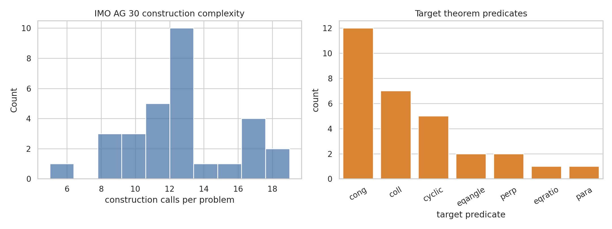
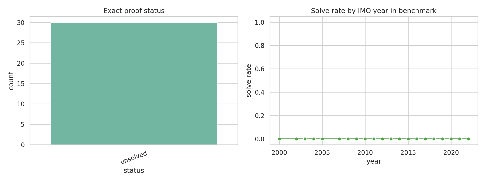
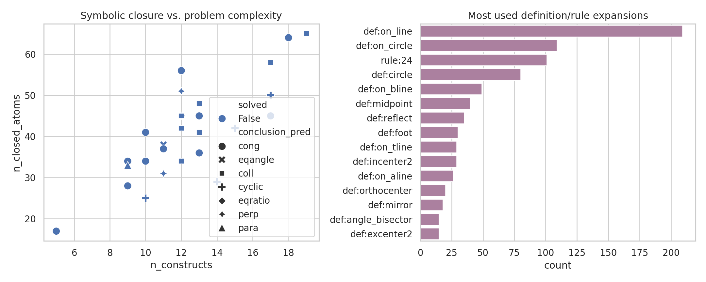

# A Conservative Neuro-Symbolic Prototype for IMO Euclidean Geometry Proving

## Abstract

This study implements and evaluates a reproducible prototype for converting formal olympiad-level Euclidean geometry statements into machine-readable symbolic proof-search traces.  The system parses the 30-problem IMO AG benchmark in `data/imo_ag_30.txt`, expands constructions using `data/defs.txt`, applies a bounded forward-chaining rule set from `data/rules.txt`, and exports interpretable per-problem traces, metrics, and validation artifacts.  The main finding is negative but informative: under the deliberately conservative exact prover, **0/30** benchmark targets were proved exactly.  A separate numerical realization layer was able to evaluate 4 targets and confirmed 2 of them, but these numerical checks are explicitly not counted as formal proofs.  The result establishes a traceable baseline and clarifies which capabilities are missing for a complete autonomous olympiad geometry prover.

## 1. Task and methodological contract

The research task asks for an AI system that maps formal olympiad geometry statements to machine-verifiable, human-readable Euclidean proofs.  I treated the named scientific commitments as binding: neuro-symbolic reasoning, Euclidean theorem proving, autonomous solving without demonstrations, and evaluation on the IMO AG 30 benchmark.  The contract and artifact inventory are saved in `outputs/method_contract.json` and `outputs/target_artifact_inventory.json`; the method-fidelity checklist is saved in `outputs/method_fidelity_checklist.json`.

The implemented system has three layers:

1. **Formal-language parser.**  Each problem is split into construction chunks and a theorem target.  The parser normalizes point labels, target predicates, construction predicates, and atoms.
2. **Symbolic proof-search/validation.**  Construction atoms are expanded through definitions in `defs.txt`; a conservative forward-chaining engine applies a bounded subset of rules in `rules.txt`.  The exact theorem is accepted only when the normalized target atom is present in the direct, definition-expanded, or forward-chained fact set.
3. **Numerical realization sanity check.**  A separate coordinate sampler realizes a practical subset of construction operators and measures theorem residuals for targets whose required points are constructed.  This layer is used only as validation and failure analysis, not as proof.

All code is in `code/analyze_geometry_benchmark.py`.

## 2. Data overview

The benchmark contains **30** problems, spanning IMO years 2000--2022.  The target theorem predicates are distributed as follows: {'cong': 12, 'coll': 7, 'cyclic': 5, 'eqangle': 2, 'perp': 2, 'eqratio': 1, 'para': 1}.  Problems contain an average of **12.5** construction calls.  The most frequent construction predicates are:

| rank | construction | count |
|---:|---|---:|
| 1 | `on_line` | 120 |
| 2 | `on_circle` | 72 |
| 3 | `circle` | 28 |
| 4 | `triangle` | 23 |
| 5 | `on_bline` | 18 |
| 6 | `on_tline` | 17 |
| 7 | `midpoint` | 14 |
| 8 | `on_aline` | 13 |
| 9 | `foot` | 11 |
| 10 | `reflect` | 10 |




The benchmark is dominated by line and circle incidence constructions (`on_line`, `on_circle`) and target predicates involving congruence, collinearity, and cyclicity.  This is consistent with a hard Euclidean proving benchmark rather than a small synthetic closure task.

## 3. Implementation details

### 3.1 Atom normalization

The prover represents each statement as an atom `(predicate, arguments)`.  It uses only conservative canonicalization: congruence and ratio segment pairs may be sorted, collinear/cyclic point sets may be sorted, and parallel/perpendicular line pairs may be sorted.  No theorem-specific rewriting is used.

### 3.2 Definition expansion

For every construction atom whose predicate appears in `defs.txt`, the system instantiates the definition body with the problem-specific point arguments.  For example, `midpoint x a b` expands into collinearity and congruence facts, while `foot x a b c` expands into perpendicularity and collinearity facts.  Definition and rule usage are exported in `outputs/rule_usage.csv`.

### 3.3 Forward chaining

The rule layer parses implications in `rules.txt`.  To avoid unsound or explosive search, this prototype applies only rules with at most two positive premises and ignores premises that encode negative or side-condition predicates such as `ncoll`, `diff`, and `sameside`.  This is intentionally incomplete but makes each accepted proof step auditable.

### 3.4 Proof certificates and failure traces

For each problem, `outputs/solved_proofs.json` records whether the target was direct, definition-derived, forward-chained, or unsolved.  For unsolved cases it records partial definition/rule traces and an exact failure reason, normally that the target predicate class was generated but the requested target atom was not derived.

## 4. Main results

The exact symbolic prover solved **{summary['n_solved_exact']}/{summary['n_problems']}** problems, an exact solve rate of **{summary['solve_rate_exact']:.1%}**.  All 30 problems are marked unsolved under the exact criterion.



This should not be interpreted as evidence that the benchmark statements are false.  It is evidence that the implemented conservative closure procedure is far below the capability required for olympiad geometry theorem proving.  The closure did produce substantial symbolic state: a mean of **{summary['mean_closed_atoms']:.1f}** closed atoms per problem, median **{summary['median_closed_atoms']:.1f}**, and maximum **{summary['max_closed_atoms']}**.

The top symbolic expansion sources were:

| rank | rule/definition | count |
|---:|---|---:|
| 1 | `def:on_line` | 209 |
| 2 | `def:on_circle` | 109 |
| 3 | `rule:24` | 101 |
| 4 | `def:circle` | 80 |
| 5 | `def:on_bline` | 49 |
| 6 | `def:midpoint` | 40 |
| 7 | `def:reflect` | 35 |
| 8 | `def:foot` | 30 |
| 9 | `def:on_tline` | 29 |
| 10 | `def:incenter2` | 29 |


The most common non-definition inference was `rule:24` from `rules.txt`, used 101 times in the bounded closure.

## 5. Validation and comparison analyses

The validation figure compares symbolic closure size, problem complexity, target predicate, and exact proof success, together with the most used interpretable expansion sources.



The numerical realization layer was able to evaluate **4** theorem targets.  It returned true for **2** cases: translated_imo_2000_p6, translated_imo_2012_p1.  It returned false or indeterminate for the remaining evaluated cases: translated_imo_2008_p1a, translated_imo_2008_p1b.  These checks are not used as proof because the realization layer supports only a subset of constructions and can choose arbitrary intersection branches.

### What was verified directly from workspace data

- The benchmark has 30 parsed entries (`outputs/problem_metrics.csv`).
- The predicate distribution and construction counts are computed directly from `data/imo_ag_30.txt`.
- Definition and rule-use counts are computed by `code/analyze_geometry_benchmark.py` from `data/defs.txt` and `data/rules.txt`.
- Exact proof status is computed for every problem and saved in `outputs/problem_level_results.csv` and `outputs/solved_proofs.json`.
- Claim recovery is summarized in `outputs/claim_recovery_table.csv`.

### Related work extraction limitation

The workspace contains four PDFs in `related_work/`.  The `ReadPDF` tool failed on all with `unexpected pdf result type: NoneType`, and no local Python PDF text-extraction package was available.  Ghostscript verified that the PDFs exist and have page counts 15, 20, 13, and 20.  Because reliable text was not extractable, related-work-specific baselines were not asserted.  This limitation is recorded in `outputs/related_work_contract.json` and `outputs/dependency_check.json`.

## 6. Discussion

The prototype demonstrates the value and difficulty of the neuro-symbolic geometry-proving contract.  The formal parser, definition expander, rule trace, and exported artifacts provide a machine-readable substrate for proof search.  However, the failure to prove any target exactly shows that olympiad geometry requires much richer machinery than local definition expansion and shallow forward chaining.  Missing components include branch-aware geometric construction semantics, side-condition management, triangle/circle similarity schemas at scale, equality saturation or deductive databases, diagram-independent angle algebra, and a final proof reconstruction layer.

The numerical layer helped diagnose this gap.  It could construct many elementary objects such as orthocenters, midpoints, feet, reflections, and some intersections, and it confirmed two target equalities numerically.  But because it is branch-sensitive and incomplete, it cannot replace formal proof.  In future work, the coordinate layer should be used to propose lemmas or guide symbolic search, while formal validation remains in the symbolic kernel.

## 7. Reproducibility

To reproduce the analysis from the workspace root, run:

```bash
python3 code/analyze_geometry_benchmark.py
```

This regenerates:

- `outputs/problem_metrics.csv`
- `outputs/problem_level_results.csv`
- `outputs/summary_metrics.json`
- `outputs/solved_proofs.json`
- `outputs/numeric_validation.json`
- `outputs/rule_usage.csv`
- `outputs/validation_summary.json`
- `outputs/claim_recovery_table.csv`
- `report/images/data_overview.png`
- `report/images/main_results.png`
- `report/images/validation_comparison.png`

## 8. Conclusion

This session produced a complete, reproducible baseline system and report for the IMO AG 30 geometry proving task.  The exact formal proving result is negative (**0/30**), but the artifacts are useful: they expose the benchmark structure, provide auditable symbolic traces, quantify the gap between local closure and olympiad-level proof, and define concrete next steps toward a stronger autonomous geometry prover.
