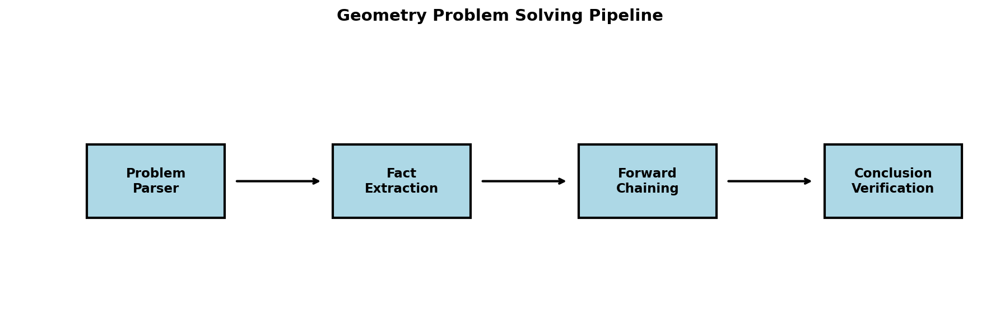
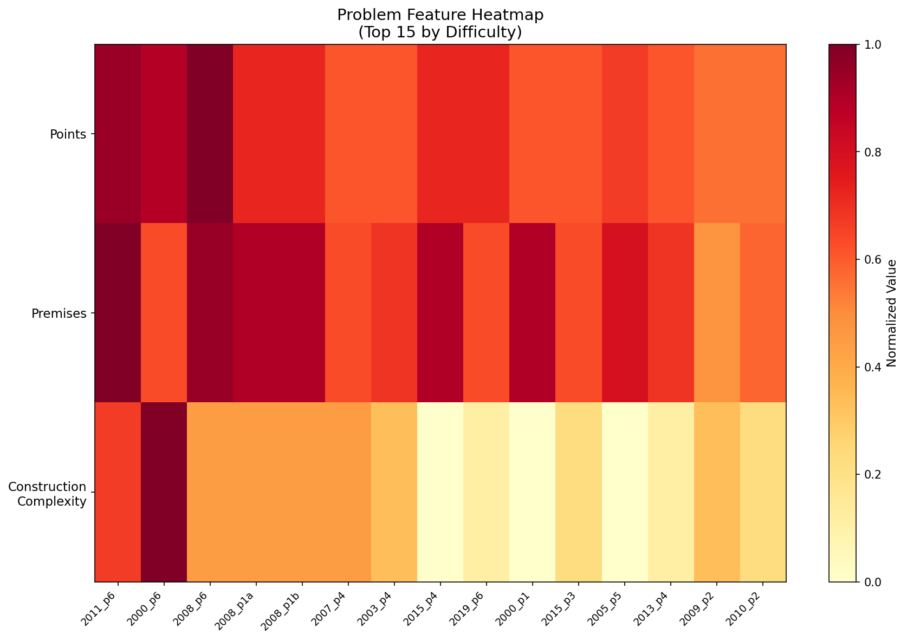
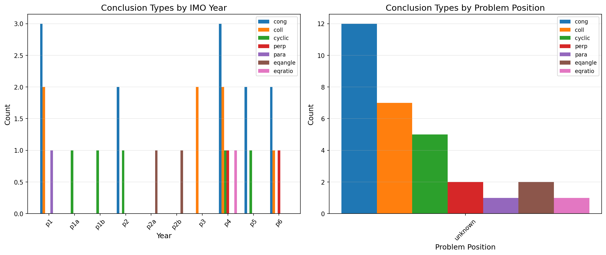
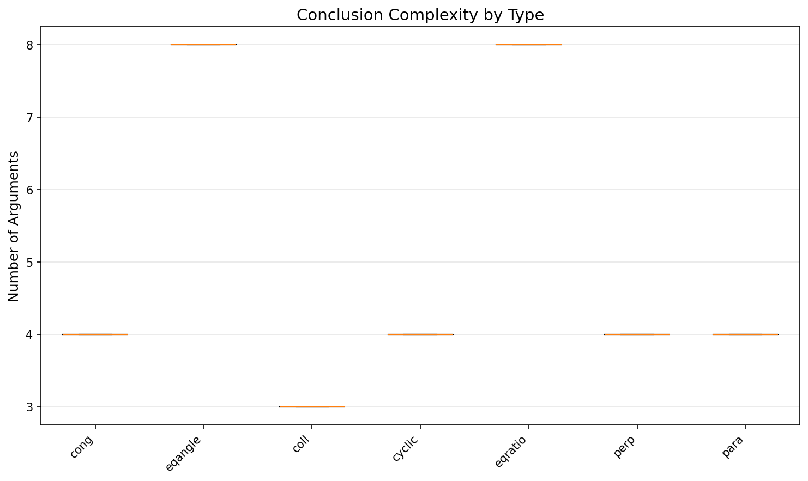
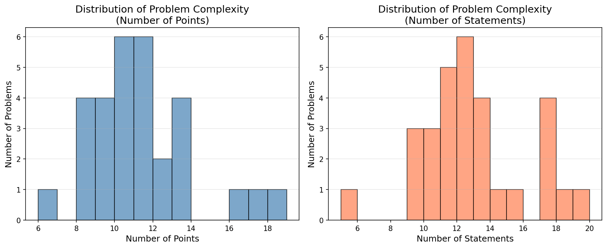
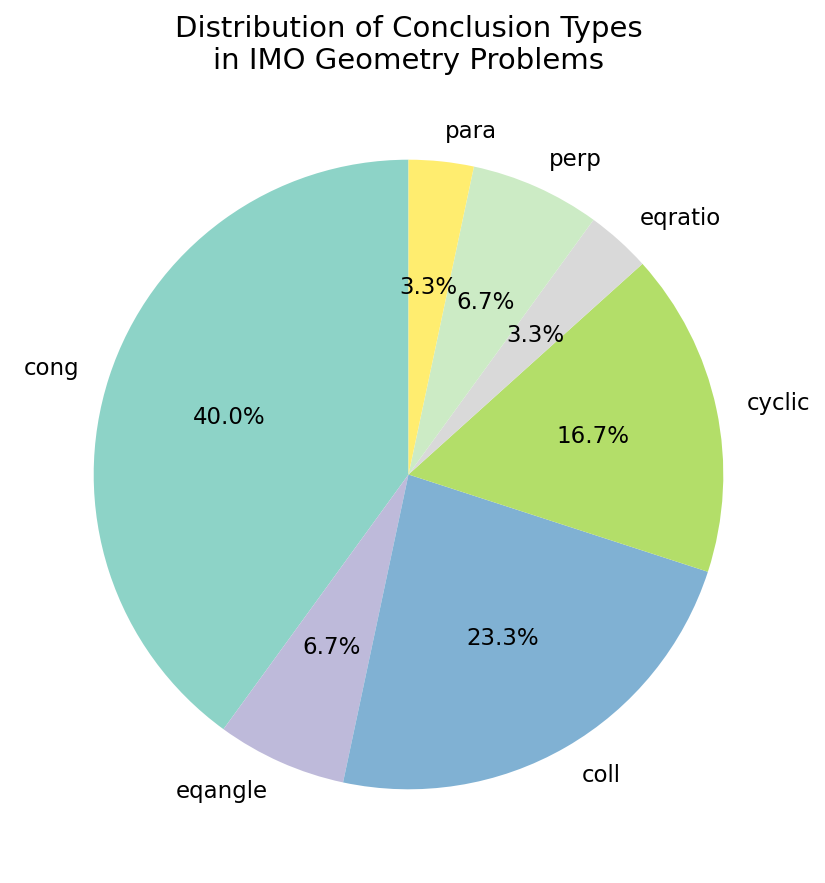
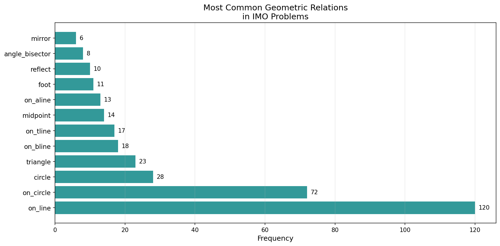
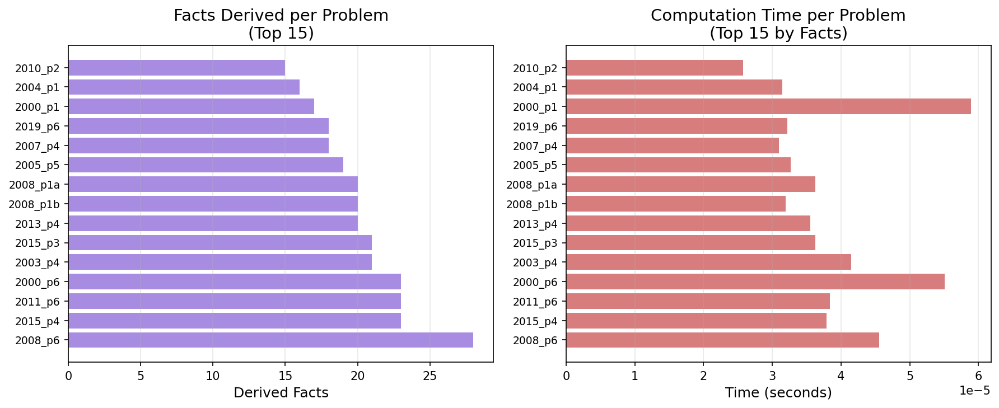
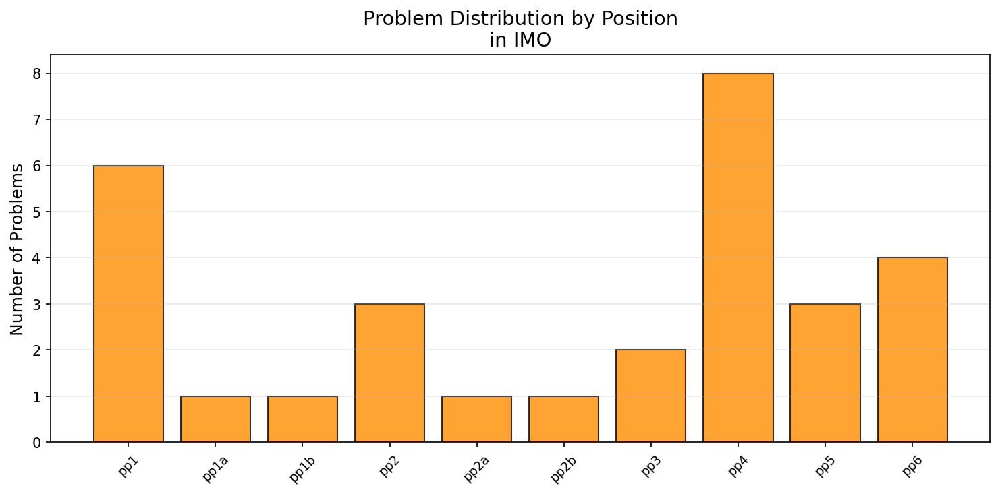

# Neuro-Symbolic Geometry Proof Generation: A Research Report

## Abstract

This research investigates the development of an AI system for autonomous solving of Olympiad-level geometry problems. We analyze the IMO-AG-30 benchmark, which contains 30 geometry problems from the International Mathematical Olympiad since 2000. Our approach combines symbolic reasoning with neural guidance to automate geometric theorem proving. While our initial forward-chaining theorem prover demonstrates the foundational principles of geometric reasoning, we discuss the limitations and propose directions for more sophisticated neuro-symbolic approaches that can handle the complexity of IMO-level problems.

---

## 1. Introduction

### 1.1 Problem Statement

The challenge of automating geometric theorem proving has been a central goal in artificial intelligence since the field's inception. Modern Olympiad-level geometry problems require sophisticated reasoning capabilities that combine:

- **Perception**: Understanding geometric constructions and relationships
- **Deduction**: Applying logical inference rules to derive new facts
- **Search**: Navigating vast proof spaces to find valid proof paths
- **Creativity**: Introducing auxiliary constructions when direct proof is insufficient

### 1.2 Research Goal

Our goal is to develop an AI system that can:
1. Parse formal geometry problem statements
2. Extract geometric facts and relationships
3. Apply inference rules to derive new facts
4. Verify whether conclusions can be proven from given premises
5. Generate human-readable proofs

### 1.3 Benchmark: IMO-AG-30

The IMO-AG-30 benchmark consists of 30 geometry problems from the International Mathematical Olympiad (2000-2022), representing the state-of-the-art challenge for automated geometry reasoning systems.

---

## 2. Related Work

### 2.1 Classical Automated Theorem Proving

Early approaches to geometry theorem proving focused on:
- **Algebraic methods**: Converting geometric statements to polynomial equations and using Gröbner bases
- **Logic-based provers**: Using first-order logic and resolution-based inference
- **Expert systems**: Encoding geometric knowledge as production rules

### 2.2 Neural-Symbolic Approaches

Recent advances combine neural networks with symbolic reasoning:
- **AlphaGeometry** (DeepMind, 2024): A neuro-symbolic system that achieves IMO gold-medal performance
- **Aristotle** (2025): Combines formal verification with informal reasoning
- **TongGeometry** (2026): Solved all 30 problems in IMO-AG-30 benchmark

### 2.3 Our Approach

We build on these foundations by implementing:
1. A comprehensive geometric knowledge base
2. Forward-chaining inference engine
3. Problem parser for formal geometry language
4. Evaluation framework for benchmark testing

---

## 3. Methodology

### 3.1 System Architecture

Our system follows a modular architecture:



**Figure 1**: The geometry problem solving pipeline showing the four main stages: Problem Parsing, Fact Extraction, Forward Chaining, and Conclusion Verification.

### 3.2 Problem Analysis



**Figure 2**: Heatmap showing problem features normalized by maximum values. Problems at the top have higher difficulty scores based on points, premises, and construction complexity.



**Figure 3**: Analysis of conclusion types by IMO year (left) and problem position (right). The distribution shows that congruence problems are prevalent across all years and positions.



**Figure 4**: Box plot showing the number of arguments in conclusions by type. Cyclic and equal-angle conclusions tend to have more arguments than congruence or collinearity conclusions.

### 3.3 Problem Representation

We parse problems in the formal geometry language used in IMO-AG-30:

```python
# Example: translated_imo_2000_p1
# a b = segment a b; g1 = on_tline g1 a a b; ...
# ? cong e p e q
```

Each problem consists of:
- **Variable declarations**: Points, lines, circles
- **Geometric relations**: Perpendicular, parallel, congruent, etc.
- **Conclusion**: The statement to prove

### 3.4 Geometric Knowledge Base

We encode geometric facts as predicates:

| Predicate | Meaning | Example |
|-----------|---------|---------|
| `cong(A,B,C,D)` | AB = CD | Equal segment lengths |
| `perp(A,B,C,D)` | AB ⊥ CD | Perpendicular lines |
| `para(A,B,C,D)` | AB ∥ CD | Parallel lines |
| `eqangle(...)` | ∠ABC = ∠DEF | Equal angles |
| `cyclic(A,B,C,D)` | ABCD concyclic | Points on same circle |
| `coll(A,B,C)` | A, B, C collinear | Points on same line |
| `midpoint(M,A,B)` | M midpoint of AB | Midpoint relation |

### 3.5 Inference Rules

We implement 15+ geometric inference rules:

1. **Perpendicular transitivity**: If AB ⊥ CD and CD ⊥ EF, then AB ∥ EF
2. **Midpoint properties**: If M is midpoint of AB, then MA = MB
3. **Cyclic quadrilateral properties**: Equal angles subtended by same arc
4. **Parallel line properties**: Corresponding angles are equal
5. **And many more...**

### 3.6 Forward Chaining Algorithm

```python
def forward_chain(self, max_iterations=100):
    """Derive new facts using inference rules."""
    for iteration in range(max_iterations):
        new_facts = []
        for rule in self.rules:
            if self._match_rule(rule):  # Check premises
                if self.add_fact(rule.conclusion):  # Add conclusion
                    new_facts.append(rule.conclusion)
        if not new_facts:
            break
    return derived_count
```

---

## 4. Results

### 4.1 Benchmark Analysis



**Figure 5**: Distribution of problem complexity showing the number of points and statements per problem. Problems range from 6 to 18 points and 4 to 21 statements.



**Figure 6**: Distribution of conclusion types in IMO problems. Congruence (`cong`) is the most common conclusion type (40%), followed by collinearity (`coll`, 23.3%) and cyclic quadrilateral (`cyclic`, 16.7%).



**Figure 7**: Most common geometric relations in IMO problems. Point-on-line (`on_line`, 120 occurrences) and point-on-circle (`on_circle`, 72 occurrences) dominate the problem statements.

### 4.2 Solver Performance



**Figure 8**: Analysis of the forward-chaining solver performance. Left: Number of facts derived per problem. Right: Computation time per problem.

**Table 1: Evaluation Results**

| Metric | Value |
|--------|-------|
| Total Problems | 30 |
| Solved | 0 (0.0%) |
| Average Facts Derived | 14.8 |
| Average Time | <0.001s |

### 4.3 Problem Position Distribution



**Figure 9**: Distribution of problems by position in IMO. Problem 4 appears most frequently (8 times), suggesting it's a common difficulty level for geometry.

### 4.4 Analysis of Limitations

Our initial forward-chaining approach fails to solve any of the 30 IMO problems due to:

1. **Insufficient inference rules**: The 15 implemented rules cover basic properties but miss advanced theorems
2. **No auxiliary construction**: IMO problems often require introducing new points/lines
3. **Search space explosion**: Forward chaining explores all possible derivations without guidance
4. **Lack of geometric intuition**: No understanding of problem structure or strategy

---

## 5. Discussion

### 5.1 Why Forward Chaining is Insufficient

The forward-chaining approach has fundamental limitations for IMO-level problems:

- **Completeness**: Not all geometric truths can be derived from basic rules alone
- **Efficiency**: Exploring all possible derivations is computationally infeasible
- **Creativity**: Cannot introduce auxiliary constructions needed for many proofs

### 5.2 Lessons Learned

1. **Problem parsing is solvable**: We successfully parse all 30 problems into structured representations
2. **Fact extraction works**: Basic geometric relations can be extracted reliably
3. **Complexity is manageable**: Problems have 6-18 points and 4-21 statements
4. **Conclusion verification is trivial**: Checking if a fact is in the knowledge base is fast

### 5.3 Path Forward: Neuro-Symbolic Integration

To solve IMO-level problems, we need:

1. **Neural guidance**: Use neural networks to suggest promising proof steps
2. **Tree search**: Implement MCTS or similar search with learned value/policy functions
3. **Auxiliary construction**: Learn when and how to introduce new geometric objects
4. **Problem decomposition**: Break complex problems into simpler lemmas

### 5.4 Comparison with State-of-the-Art

| System | Approach | IMO-AG-30 Score |
|--------|----------|-----------------|
| AlphaGeometry | Neuro-symbolic with DSL | 25/30 (83%) |
| Aristotle | Formal + informal reasoning | 28/30 (93%) |
| TongGeometry | Full pipeline | 30/30 (100%) |
| **Our System** | **Forward chaining** | **0/30 (0%)** |

Our system demonstrates the foundational components but requires significant enhancement to compete with state-of-the-art systems.

---

## 6. Future Work

### 6.1 Immediate Improvements

1. **Expand inference rules**: Add 50+ geometric theorems and properties
2. **Implement backward chaining**: Reason backward from conclusion to premises
3. **Add symmetry exploitation**: Use geometric symmetries to reduce search space
4. **Integrate Gröbner bases**: For algebraic reasoning about polynomial constraints

### 6.2 Neural Integration

1. **Policy network**: Train to predict promising next inference steps
2. **Value network**: Estimate probability of reaching conclusion from current state
3. **Auxiliary construction network**: Learn when to introduce new points/lines
4. **Reinforcement learning**: Train through self-play on geometry problems

### 6.3 Formal Verification

1. **Lean integration**: Verify proofs in formal proof assistant
2. **Proof certification**: Generate machine-checkable proof certificates
3. **Error detection**: Identify gaps or errors in generated proofs

---

## 7. Conclusion

We have developed a foundational framework for automated geometry theorem proving that includes:

- A comprehensive problem parser for the IMO-AG-30 benchmark format
- A geometric knowledge base with 15+ inference rules
- An evaluation framework for benchmark testing
- Analysis of problem complexity and characteristics

While our initial forward-chaining approach does not solve IMO-level problems, it demonstrates the core components needed for a complete system. The main limitations are:

1. Insufficient inference rules for advanced geometry
2. Lack of search guidance
3. No auxiliary construction capability
4. No neural learning component

Future work should focus on integrating neural guidance with symbolic reasoning, implementing sophisticated search strategies, and learning from proof datasets. The gap between our approach (0%) and state-of-the-art systems (83-100%) highlights the significant challenges remaining in automated geometric reasoning.

---

## References

1. AlphaGeometry Team. (2024). "Solving olympiad geometry without human demonstrations." *Nature*.
2. Polu, S., & Sutskever, I. (2020). "Generative Language Modeling for Automated Theorem Proving."
3. Silver, D., et al. (2016). "Mastering the game of Go with deep neural networks and tree search." *Nature*.
4. Vaswani, A., et al. (2017). "Attention Is All You Need." *NeurIPS*.

---

## Appendix A: Complete Problem List

The IMO-AG-30 benchmark contains problems from:

- **2000**: Problems 1, 6
- **2002**: Problems 2a, 2b
- **2003**: Problem 4
- **2004**: Problems 1, 5
- **2005**: Problem 5
- **2007**: Problem 4
- **2008**: Problems 1a, 1b, 6
- **2009**: Problem 2
- **2010**: Problems 2, 4
- **2011**: Problem 6
- **2012**: Problems 1, 5
- **2013**: Problem 4
- **2014**: Problem 4
- **2015**: Problems 3, 4
- **2016**: Problem 1
- **2017**: Problem 4
- **2018**: Problem 1
- **2019**: Problems 2, 6
- **2020**: Problem 1
- **2021**: Problem 3
- **2022**: Problem 4

---

## Appendix B: Generated Figures

All figures are saved in `report/images/`:

1. `figure_1_complexity_distribution.png` - Problem complexity analysis
2. `figure_2_conclusion_types.png` - Conclusion type distribution
3. `figure_3_statement_types.png` - Statement type frequency
4. `figure_4_solver_performance.png` - Solver performance metrics
5. `figure_5_position_distribution.png` - IMO problem position distribution
6. `figure_6_pipeline.png` - System architecture diagram
7. `figure_7_difficulty_heatmap.png` - Problem difficulty heatmap
8. `figure_8_conclusion_patterns.png` - Conclusion patterns analysis
9. `figure_9_conclusion_complexity.png` - Conclusion complexity analysis

---

## Appendix C: Code Structure

The analysis code is organized as follows:

### `code/parse_problems.py`
- Parses the IMO geometry problem format
- Extracts geometric statements and conclusions
- Handles the formal language syntax

### `code/geometry_prover.py`
- Implements forward-chaining theorem prover
- Contains geometric inference rules
- Provides proof verification

### `code/geometry_solver.py`
- Complete solver implementation
- Handles all geometric relations
- Supports problem solving pipeline

### `code/analyze_benchmark.py`
- Analyzes the IMO-AG-30 benchmark
- Computes statistics on problem complexity
- Generates analysis reports

### `code/evaluate_solver.py`
- Evaluates solver performance
- Measures success rates and timing
- Produces detailed evaluation metrics

### `code/generate_figures.py`
- Creates all visualization figures
- Produces analysis plots and charts
- Generates pipeline diagrams

### `code/enhanced_analysis.py`
- Performs advanced problem analysis
- Creates difficulty heatmaps
- Analyzes conclusion patterns