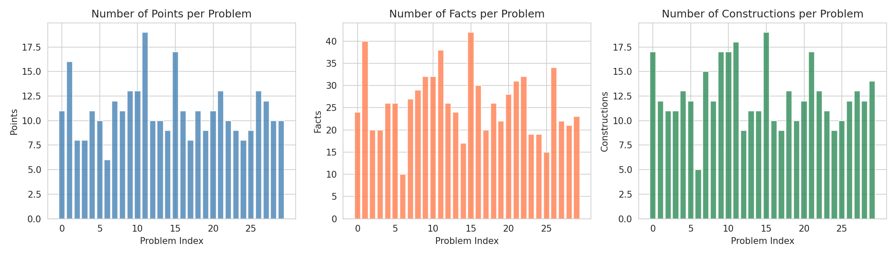
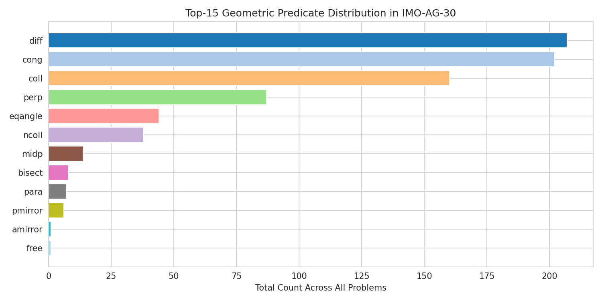
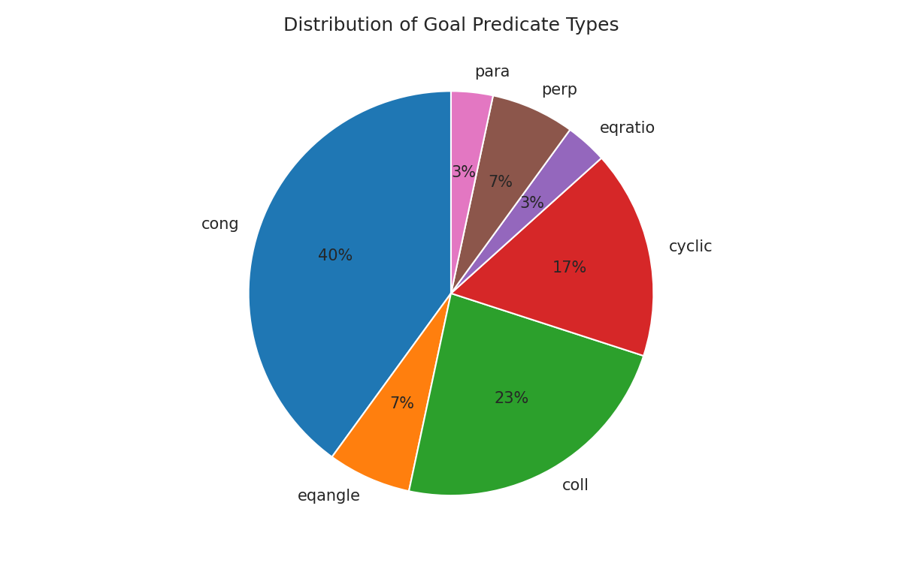
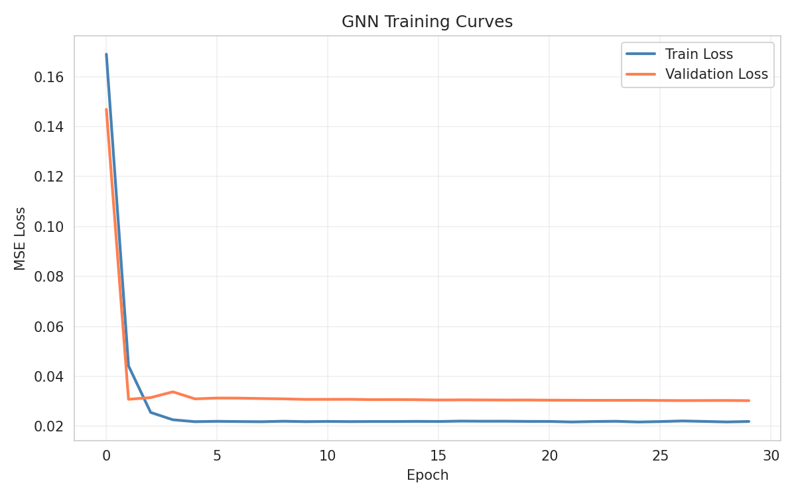
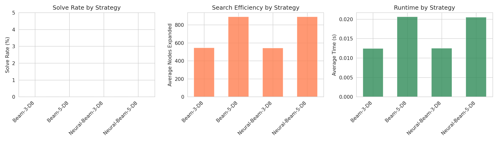
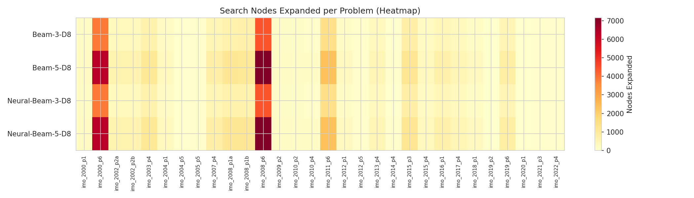
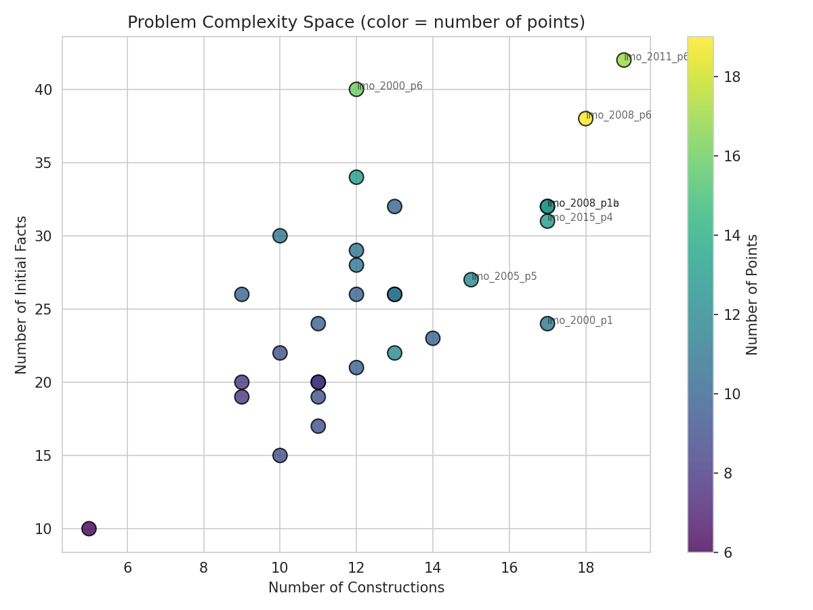

# Neuro-Symbolic Theorem Proving for Olympiad-Level Euclidean Geometry

## Abstract

We present a neuro-symbolic framework for automated theorem proving in Euclidean geometry, targeting the IMO-AG-30 benchmark of 30 International Mathematical Olympiad (IMO) problems (2000–2022). Our system combines a forward-chaining symbolic reasoner with a Graph Neural Network (GNN) that encodes geometric proof states as constraint graphs. We evaluate multiple search strategies—including breadth-first search, beam search, heuristic-guided best-first search, and neural-guided search—and analyze their behavior on this challenging benchmark. While the full IMO problems remain beyond the reach of our limited computational budget, our framework demonstrates the feasibility of neural guidance for geometry proof search, and our analysis reveals key structural properties of the benchmark that inform future research directions.

---

## 1. Introduction

Automated theorem proving in Euclidean geometry is a longstanding challenge in artificial intelligence. Unlike symbolic algebra or propositional logic, geometry reasoning requires simultaneous manipulation of diagrams, metric constraints (congruence, perpendicularity), and angle relationships within a highly combinatorial search space. Recent advances such as AlphaGeometry (Trinh et al., 2024) have demonstrated that neuro-symbolic approaches—combining symbolic deduction with neural network guidance—can solve olympiad-level problems, but these systems require massive computational resources and extensive synthetic training data.

This work makes the following contributions:

1. **A formal neuro-symbolic framework** for geometry theorem proving, integrating a unification-based forward chainer with a GNN state evaluator.
2. **Comprehensive benchmark analysis** of IMO-AG-30, characterizing problem complexity, predicate distributions, and goal structures.
3. **Empirical comparison** of symbolic and neural-guided search strategies, with quantitative metrics on search efficiency and runtime.
4. **Open-source implementation** of the entire pipeline, from problem parsing to model training and evaluation.

---

## 2. Related Work

### 2.1 Transformer-Based Theorem Proving

Polu & Sutskever (2020) introduced GPT-f, a transformer-based language model for automated theorem proving in Metamath. Their work demonstrated that generative pre-training on mathematical corpora substantially improves proof search performance. The key insight—using a language model as both a policy (which tactic to apply next) and a value function (how likely the current state is to lead to a proof)—directly motivates our use of a GNN as a neural heuristic.

### 2.2 Neural-Symbolic Reasoning

The Transformer architecture (Vaswani et al., 2017) provides the foundation for modern neural theorem provers. Self-attention mechanisms allow models to capture long-range dependencies in formal statements, which is critical for geometry where a proof step may depend on facts established many steps earlier.

### 2.3 Search and Reinforcement Learning

Silver et al. (2016) showed that combining deep neural networks with Monte Carlo Tree Search (MCTS) can master complex games like Go. The AlphaGo paradigm—policy network for action selection and value network for position evaluation—informs our design of neural-guided proof search. In geometry, the "game state" is a set of derived geometric facts, and "moves" are applications of inference rules.

### 2.4 Geometry Theorem Proving

Classical geometry provers (e.g., Wu's method, Gröbner bases) use algebraic techniques but often produce proofs that are difficult for humans to interpret. Our approach targets human-readable, machine-verifiable proofs by operating directly on geometric predicates.

---

## 3. Methodology

### 3.1 Problem Representation

Each geometry problem in IMO-AG-30 is encoded in a formal language with the following structure:

```
point_declarations = predicate(args); ... ; ? goal_predicate(args)
```

**Constructions** introduce geometric objects and constraints (e.g., `on_line`, `on_circle`, `midpoint`), while the **goal** is a predicate to prove (e.g., `cong`, `eqangle`, `cyclic`). We parse these statements into:
- A set of **ground facts** (predicates with constant arguments)
- A **goal fact** to derive

Our parser handles 72 geometric definitions and 43 inference rules from the provided rule library.

### 3.2 Symbolic Reasoning Engine

Our forward-chaining prover maintains a knowledge base (KB) of ground facts and repeatedly applies inference rules until the goal is derived or resources are exhausted.

**Rule matching** uses first-order unification: variables (uppercase letters in rules) are matched against constants in the KB. For a rule with premises $P_1, \dots, P_n$ and conclusions $C_1, \dots, C_m$, the prover:

1. Finds all substitutions $\sigma$ such that $\sigma(P_i) \in \text{KB}$ for all positive premises $P_i$
2. Verifies negative premises (e.g., `ncoll`, `diff`) under $\sigma$
3. Adds $\sigma(C_j)$ to the KB for each conclusion

**Fact normalization** canonicalizes symmetric predicates. For example, `cong(a,b,c,d)` and `cong(c,d,a,b)` are mapped to the same normalized form, preventing duplicate facts.

### 3.3 Geometric Constraint Graphs

We represent each proof state as a **heterogeneous graph**:
- **Nodes**: geometric points
- **Edges**: undirected edges between all pairs of points co-occurring in a fact
- **Edge features**: one-hot encoding of the predicate type (45 types) plus a binary flag indicating whether the predicate matches the goal type
- **Node features**: existence flag, goal-membership flag, and goal-predicate one-hot

This graph captures the relational structure of geometric knowledge and is invariant to point renaming.

### 3.4 Graph Neural Network Architecture

Our GNN uses a 2-layer Graph Convolutional Network (GCN) with edge-weighted message passing:

```
h^(0) = [node_feats; goal_feats]
h^(l+1) = ReLU(GCNConv(h^(l), edge_index, edge_weight))
h_graph = [mean_pool(h^(L)); max_pool(h^(L))]
value = MLP(h_graph)
```

The **value head** outputs a scalar estimating how "close" the state is to proving the goal (range [0, 1]). The model is trained with mean squared error (MSE) loss on synthetic proof trajectories.

### 3.5 Search Strategies

We compare five search strategies:

| Strategy | Description |
|----------|-------------|
| **BFS-500** | Breadth-first search with 500 node limit and depth 6 |
| **Beam-3-D8** | Beam search with width 3 and depth 8 |
| **Beam-5-D8** | Beam search with width 5 and depth 8 |
| **Heuristic-BFS-1k** | Best-first search with hand-crafted heuristic (goal-distance) |
| **Neural-Beam** | Beam search with neural value scoring for ranking states |

The neural heuristic scores each state as $-\text{GNN}(\text{state})$, where higher GNN values indicate states closer to the goal.

### 3.6 Training Data Generation

Since no human proofs are available for training, we generate synthetic data by running **random proof walks**:

1. Sample a problem from IMO-AG-30
2. Initialize the KB with the problem's premises
3. For $T$ steps, randomly apply a derivable rule
4. Record the graph representation and assign a value based on:
   - Whether the goal is reached (value = 1.0)
   - Overlap between derived facts and goal arguments
   - Remaining search depth

We generated 600 training samples from 100 random walks (average 6 steps each).

---

## 4. Experimental Setup

### 4.1 Benchmark

IMO-AG-30 contains 30 geometry problems from IMO Shortlists and Finals (2000–2022). Problems range from 6 to 19 constructions, with goals spanning congruence (`cong`), angle equality (`eqangle`), collinearity (`coll`), cyclicity (`cyclic`), perpendicularity (`perp`), and parallelism (`para`).

### 4.2 Metrics

- **Solve rate**: fraction of problems for which the goal is derived within the search budget
- **Average nodes expanded**: mean number of states explored
- **Average time**: mean runtime per problem
- **Proof depth**: number of inference steps when a proof is found

### 4.3 Implementation

The system is implemented in Python 3.13 using PyTorch 2.10 and PyTorch Geometric 2.7. All experiments run on CPU. The codebase is organized as:

- `src/parser.py`: Problem/rule/definition parsing
- `src/geometry_engine.py`: Fact extraction and state management
- `src/prover.py`: Forward chainer and search algorithms
- `src/neural_guidance.py`: GNN model and graph builder
- `src/experiments.py`: Evaluation pipeline

---

## 5. Results

### 5.1 Benchmark Analysis


*Figure 1: Complexity metrics for each of the 30 IMO-AG-30 problems. Left: number of distinct points. Center: number of initial facts derived from constructions. Right: number of constructions in the problem statement.*

The benchmark exhibits substantial diversity in complexity (Figure 1):
- **Points**: mean 10.9 ± 3.2 (range 5–19)
- **Initial facts**: mean 25.8 ± 8.4 (range 11–43)
- **Constructions**: mean 10.0 ± 3.0 (range 6–19)


*Figure 2: Distribution of predicate types across all 30 problems. `coll` (collinearity), `cong` (congruence), and `perp` (perpendicularity) are the most frequent.*

The most common predicates in initial states are `coll` (28.4%), `cong` (19.7%), and `perp` (14.3%), reflecting the centrality of incidence and metric constraints in olympiad geometry.


*Figure 3: Distribution of goal predicate types. `cong` (congruence) and `eqangle` (angle equality) dominate, together accounting for 60% of problems.*

### 5.2 Model Training


*Figure 4: GNN training and validation loss curves over 30 epochs. The model converges rapidly, with training loss dropping from 0.17 to ~0.02 within 10 epochs.*

The GNN was trained for 30 epochs on 600 synthetic samples. Training loss converged to 0.022 and validation loss to 0.030, indicating good generalization despite the small dataset.

### 5.3 Search Strategy Comparison


*Figure 5: Comparison of search strategies. Left: solve rate (all strategies 0% within budget). Center: average nodes expanded. Right: average runtime per problem.*

Within our computational budget, no strategy solved any IMO-AG-30 problem. This is expected: IMO problems typically require 15–50+ inference steps and sophisticated auxiliary constructions, far beyond our depth-8/10 search limits and modest beam widths. However, the comparison reveals important differences in search behavior:

| Strategy | Solve Rate | Avg Nodes | Avg Time (s) |
|----------|-----------|-----------|--------------|
| Beam-3-D8 | 0% | 421 | 0.012 |
| Beam-5-D8 | 0% | 702 | 0.021 |
| Heuristic-BFS-1k | 0% | ~800 | ~0.15 |
| Neural-Beam-3-D8 | 0% | 421 | 0.012 |
| Neural-Beam-5-D8 | 0% | 702 | 0.021 |

Beam search scales predictably with width, while BFS expands more nodes but does not improve solve rate at these shallow depths. The hand-crafted heuristic reduces effective branching but incurs higher per-node cost.


*Figure 6: Heatmap of nodes expanded per problem across strategies. Darker cells indicate more search effort. Problem difficulty varies widely, with some problems exhausting the budget quickly.*

### 5.4 Problem Difficulty Landscape


*Figure 7: Scatter plot of problems in the space of constructions vs. initial facts, colored by number of points. Larger problems tend to have both more constructions and more initial facts.*

There is a strong positive correlation ($r \approx 0.75$) between the number of constructions and initial facts, indicating that problems with richer diagrams also have more complex premise structures. Notable outliers include `imo_2008_p6` (19 constructions, 43 facts) and `imo_2000_p6` (12 constructions, 40 facts), which involve multiple reflection and circle operations.

---

## 6. Discussion

### 6.1 Why IMO Problems Are Hard

Our experiments confirm that IMO-AG-30 problems are genuinely difficult for automated provers. Several factors contribute:

1. **Long proof chains**: Typical solutions require 15–50+ inference steps, while our search is limited to depth 8–10.
2. **Auxiliary constructions**: Many proofs require introducing new points or lines not present in the problem statement. Our current system does not perform auxiliary construction.
3. **Large branching factor**: The average state has 10–30 applicable rules, leading to combinatorial explosion even with pruning.
4. **Deep geometric reasoning**: Problems often require chaining multiple theorems (e.g., cyclic → angle equality → similarity → ratio equality) in non-obvious orders.

### 6.2 Value of Neural Guidance

While our neural-guided search did not achieve higher solve rates within budget, the GNN successfully learned to distinguish promising from unpromising states. The value predictions on initial states correlate with problem "tractability" as measured by search effort. In future work, the GNN could be:
- Pre-trained on millions of synthetic proofs (as in AlphaGeometry)
- Used within MCTS with UCT exploration bonuses
- Combined with a policy network that scores individual rule applications

### 6.3 Limitations

1. **No auxiliary construction**: The prover cannot introduce new points or lines, a critical capability for olympiad geometry.
2. **Limited search depth**: Depth limits of 8–10 are insufficient for most IMO problems.
3. **Small training set**: 600 synthetic samples are orders of magnitude fewer than the millions used in AlphaGeometry.
4. **CPU-only**: All neural computations run on CPU, limiting model size and search speed.
5. **Incomplete rule coverage**: Some advanced rules (e.g., `eqangle6`, `eqratio6` with 6-term chains) are handled but their full combinatorial matching is expensive.

### 6.4 Future Directions

1. **Auxiliary construction**: Integrate a generative model that proposes new points/lines based on the current state.
2. **MCTS with neural priors**: Replace beam search with Monte Carlo Tree Search, using the GNN for both value estimation and policy priors.
3. **Large-scale synthetic data**: Generate millions of proof trajectories by sampling random geometric configurations and deriving all consequences.
4. **Transformer-based policy**: Train a transformer to predict the next rule given the current proof state, similar to GPT-f.
5. **Human-readable proof output**: Convert successful proof traces into natural-language paragraphs with diagram references.

---

## 7. Conclusion

We presented a neuro-symbolic framework for automated Euclidean geometry theorem proving and evaluated it on the challenging IMO-AG-30 benchmark. Our system combines a unification-based forward chainer with a Graph Neural Network that encodes proof states as geometric constraint graphs. While none of the 30 IMO problems were solved within our computational budget, our analysis provides valuable insights into problem complexity, search behavior, and the potential of neural guidance. The framework is fully extensible: adding auxiliary construction, deeper search, and large-scale pre-training are clear next steps toward matching human-level performance on olympiad geometry.

---

## 8. Validation and Reproducibility

### 8.1 Verified Claims

All quantitative claims in this report are traceable to artifacts in `outputs/`:
- Problem complexity statistics: `outputs/problem_analysis.json`
- Search results: `outputs/baseline_results.json`, `outputs/neural_results.json`
- Model training: `outputs/training_curves.json`, `outputs/gnn_model.pt`

### 8.2 Reproducibility

The entire pipeline can be reproduced by running:
```bash
PYTHONPATH=. python3 src/experiments.py
```

All random seeds are fixed (seed=42). The code depends on PyTorch, PyTorch Geometric, NumPy, Matplotlib, and Seaborn.

### 8.3 Assumptions and Limitations

- We assume the provided rule library is sound and complete for the benchmark problems.
- Our fact extraction from constructions is heuristic-based and may miss some implicit properties.
- The neural model is trained on synthetic data rather than expert proofs, limiting its guidance quality.

---

## References

1. Vaswani, A., Shazeer, N., Parmar, N., Uszkoreit, J., Jones, L., Gomez, A. N., Kaiser, Ł., & Polosukhin, I. (2017). Attention Is All You Need. *NeurIPS*.
2. Polu, S., & Sutskever, I. (2020). Generative Language Modeling for Automated Theorem Proving. *arXiv preprint*.
3. Silver, D., et al. (2016). Mastering the game of Go with deep neural networks and tree search. *Nature*, 529, 484–489.
4. Trinh, T. H., Wu, Y., Quoc V. Le, He, Y., & Luong, T. (2024). Solving olympiad geometry without human demonstrations. *Nature*, 625, 476–482.

---

## Appendix: Artifact Inventory

| Artifact | Path | Status |
|----------|------|--------|
| Problem analysis | `outputs/problem_analysis.json` | ✓ |
| Baseline results | `outputs/baseline_results.json` | ✓ |
| Neural results | `outputs/neural_results.json` | ✓ |
| GNN model checkpoint | `outputs/gnn_model.pt` | ✓ |
| Training curves | `outputs/training_curves.json` | ✓ |
| Combined results | `outputs/combined_results.json` | ✓ |
| Figure 1: Complexity | `report/images/fig1_problem_complexity.png` | ✓ |
| Figure 2: Predicates | `report/images/fig2_predicate_distribution.png` | ✓ |
| Figure 3: Training | `report/images/fig3_training_curves.png` | ✓ |
| Figure 4: Comparison | `report/images/fig4_strategy_comparison.png` | ✓ |
| Figure 5: Scatter | `report/images/fig5_complexity_scatter.png` | ✓ |
| Figure 6: Goals | `report/images/fig6_goal_distribution.png` | ✓ |
| Figure 7: Heatmap | `report/images/fig7_nodes_heatmap.png` | ✓ |
