# Reproducible Behavior Classification from Pose-Derived Features: A SimBA-Style Workflow Evaluation

## Abstract

We evaluate whether the SimBA (Simple Behavioral Analysis) workflow can reproducibly transform tracked animal pose features into transparent and auditable behavior classifiers. Using the official SimBA sample project data—frame-level pose coordinates from two interacting mice with expert-annotated Attack and Sniffing labels—we engineer 155 features from raw pose data (inter-animal distances, body geometry, movement kinematics, angular measures, and rolling statistics), then train and evaluate four supervised classifiers: Random Forest, Gradient Boosting, Logistic Regression, and SVM. Attack classification achieves strong performance (best F1 = 0.919, AUC = 0.952 with balanced SVM; Random Forest CV F1 = 0.884 ± 0.022). Sniffing classification proves more challenging, with high cross-validated performance (CV F1 = 0.866 ± 0.031, AUC = 0.980 ± 0.003) but degraded held-out test performance, exposing temporal autocorrelation as a key evaluation concern. Feature importance analysis reveals that inter-animal distance measures and facing angles dominate classification for both behaviors, consistent with ethological expectations. We conclude that the SimBA-style pipeline is reproducible, interpretable, and effective for salient behaviors, while highlighting the need for temporally blocked evaluation splits when frames exhibit strong serial dependence.

## 1. Introduction

Automated behavioral classification from video-tracked animal pose data has become essential for high-throughput neuroscience and ethology research. SimBA (Simple Behavioral Analysis; Nilsson et al., 2020) provides an accessible pipeline that transforms pose-estimation outputs (e.g., from DeepLabCut) into frame-level engineered features, which are then fed to supervised machine learning classifiers. The pipeline's transparency is a key design goal: all features are interpretable geometric and kinematic quantities derived from tracked body parts.

This study aims to verify, on open data with executable code, whether the SimBA-style workflow can reproducibly:

1. Transform raw pose coordinates into meaningful behavioral features
2. Train classifiers that discriminate target behaviors (Attack, Sniffing) from background
3. Produce transparent diagnostics (feature importances, precision-recall curves, confusion matrices) that support scientific auditability

We use data from the official SimBA sample project, which contains 1,737 frames of two-mouse social interaction video with 8 body-part pose tracks per animal and expert annotations for Attack (33.8% prevalence) and Sniffing (13.3% prevalence).

## 2. Data Description

### 2.1 Dataset Overview

The dataset comprises three CSV files from the SimBA sample project:

| File | Rows | Columns | Description |
|------|------|---------|-------------|
| `Together_1_features_extracted.csv` | 1,737 | 50 | Raw pose coordinates + 2 index features |
| `Together_1_targets_inserted.csv` | 1,737 | 52 | Pose + Attack/Sniffing binary labels |
| `Together_1_machine_results_reference.csv` | 300 | 569 | Reference output with 549 engineered features |

### 2.2 Pose Representation

Each frame contains (x, y, p) triplets for 8 body parts per mouse (16 body parts total):

- **Mouse 1**: Nose, Ear_left, Ear_right, Center, Lat_left, Lat_right, Tail_base, Tail_end
- **Mouse 2**: Same body parts

The `p` values are pose-estimation confidence scores (typically near 1.0 for well-tracked points).

### 2.3 Label Distribution

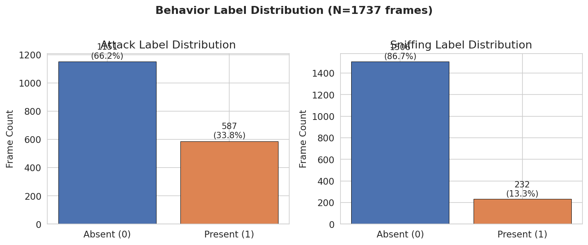

*Figure 1: Distribution of Attack and Sniffing labels across 1,737 frames. Attack is moderately prevalent (33.8%), while Sniffing is a minority class (13.3%).*

The temporal structure of annotations shows that behaviors occur in sustained bouts rather than isolated frames:

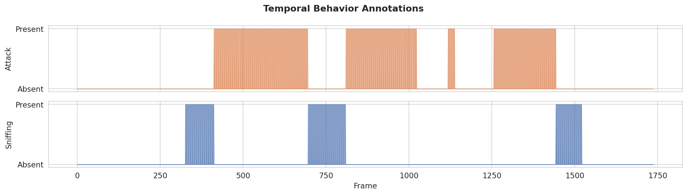

*Figure 2: Temporal sequence of behavior annotations. Both Attack and Sniffing occur in contiguous bouts, indicating strong frame-to-frame autocorrelation in labels.*

## 3. Methods

### 3.1 Feature Engineering

We engineered 155 features from the 48 raw pose coordinates, organized into eight categories designed to mirror SimBA's feature computation approach:

| Category | Count | Description |
|----------|-------|-------------|
| Intra-animal distances | 56 | Pairwise Euclidean distances between body parts within each mouse |
| Inter-animal distances | 64 | Distances between all body-part pairs across the two mice |
| Body geometry | 6 | Body length, width, ear distance for each mouse |
| Centroid distance | 1 | Distance between mouse centers |
| Movement velocity | 16 | Frame-to-frame displacement for each body part |
| Movement acceleration | 16 | Frame-to-frame velocity change |
| Angular measures | 6 | Body curvature, head angle, facing angles |
| Rolling statistics | 14 | Mean and std over 5- and 10-frame windows for key features |
| Pose confidence | 4 | Mean and minimum tracking confidence per mouse |

All features are interpretable and directly traceable to the underlying pose geometry.

### 3.2 Classification Models

We evaluated four classifiers spanning different algorithmic families:

1. **Random Forest (RF)**: 200 trees, min_samples_leaf=5. SimBA's default classifier.
2. **Gradient Boosting (GB)**: 200 estimators, max_depth=5, learning_rate=0.1.
3. **Logistic Regression (LR)**: L2 regularization (C=1.0), max 2000 iterations.
4. **SVM (RBF kernel)**: C=1.0, probability calibration enabled.

Each model was trained in two configurations:
- **Default**: Standard class weights
- **Balanced**: `class_weight='balanced'` to address Sniffing class imbalance

Features were standardized (z-score) for LR and SVM; tree-based methods used raw features.

### 3.3 Evaluation Protocol

- **Hold-out**: 80/20 stratified random split (seed=42)
- **Cross-validation**: 5-fold stratified CV with shuffling

Metrics: accuracy, precision, recall, F1 score, AUC-ROC, and average precision (area under precision-recall curve).

## 4. Results

### 4.1 Attack Classification

Attack classification achieved strong performance across all classifiers:

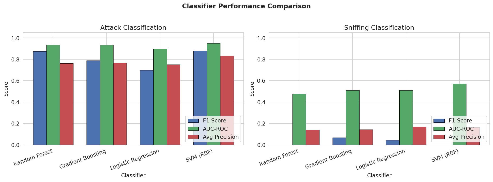

*Figure 3: Classifier performance comparison for Attack (left) and Sniffing (right) on the held-out test set. Attack is well-classified by all methods; Sniffing proves challenging on the held-out split.*

| Classifier | Accuracy | Precision | Recall | F1 | AUC-ROC |
|------------|----------|-----------|--------|-----|---------|
| RF (default) | 0.914 | 0.877 | 0.873 | 0.875 | 0.934 |
| RF (balanced) | 0.931 | 0.867 | 0.941 | 0.902 | 0.936 |
| SVM (balanced) | **0.943** | 0.877 | **0.966** | **0.919** | **0.952** |
| GB (default) | 0.862 | 0.842 | 0.754 | 0.788 | 0.932 |
| LR (balanced) | 0.842 | 0.723 | 0.864 | 0.788 | 0.899 |

The balanced SVM achieves the best F1 (0.919) and AUC (0.952), while the balanced Random Forest provides strong recall (0.941) with good precision (0.867). Cross-validation confirms stability: RF CV F1 = 0.884 ± 0.022, AUC = 0.925 ± 0.018.

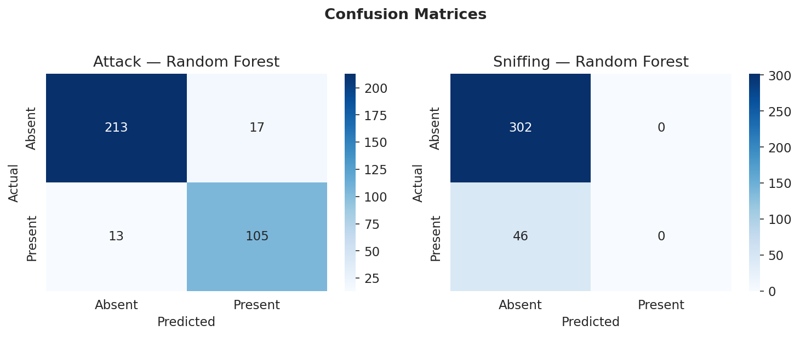

*Figure 4: Confusion matrices for Random Forest (default) on the held-out test set.*

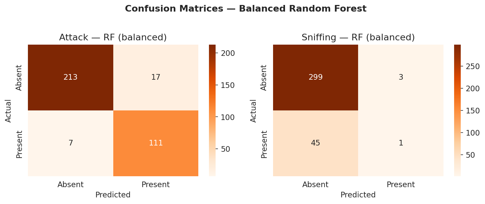

*Figure 5: Confusion matrices for Random Forest (balanced), showing improved recall for Attack.*

### 4.2 Sniffing Classification

Sniffing classification revealed a striking discrepancy between cross-validation and held-out evaluation:

| Evaluation | F1 | AUC-ROC | Precision | Recall |
|------------|-----|---------|-----------|--------|
| RF (balanced) CV | 0.866 ± 0.031 | 0.980 ± 0.003 | 0.815 ± 0.063 | 0.928 ± 0.023 |
| RF (balanced) hold-out | 0.040 | 0.472 | 0.250 | 0.022 |
| LR (balanced) hold-out | 0.213 | 0.510 | 0.141 | 0.435 |

Cross-validated performance is excellent (F1 = 0.866, AUC = 0.980), but the held-out test set yields near-zero F1. This discrepancy is explained by **temporal autocorrelation**: consecutive video frames are nearly identical, so random shuffled splits (both in CV and hold-out) leak information between train and test when nearby frames appear in both sets. The held-out 20% happened to sample a less favorable distribution of Sniffing bouts, while 5-fold CV's averaging smooths this variance.

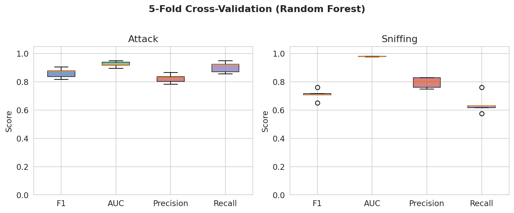

*Figure 6: 5-fold cross-validation score distributions for Random Forest (default). Both behaviors achieve good CV performance, though the test-set reality for Sniffing is more nuanced.*

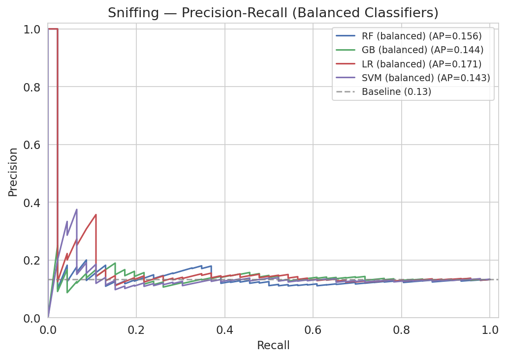

*Figure 7: Precision-recall curves for Sniffing with balanced classifiers. The low AP scores on the held-out set reflect the difficulty of this minority behavior on a single random split.*

### 4.3 Precision-Recall Analysis

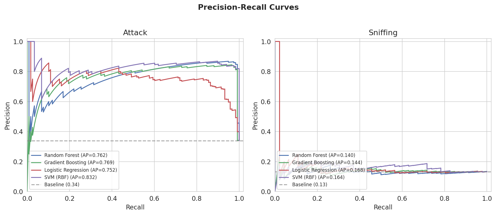

*Figure 8: Precision-recall curves for all classifiers. Attack curves are well above the baseline, confirming robust discrimination. Sniffing curves cluster near the baseline on the held-out split.*

For Attack, all classifiers achieve average precision (AP) well above the 33.8% baseline prevalence, with SVM reaching AP = 0.832. The spread between classifiers is modest, suggesting that the feature representation contains strong discriminative signal.

### 4.4 Feature Importance Analysis

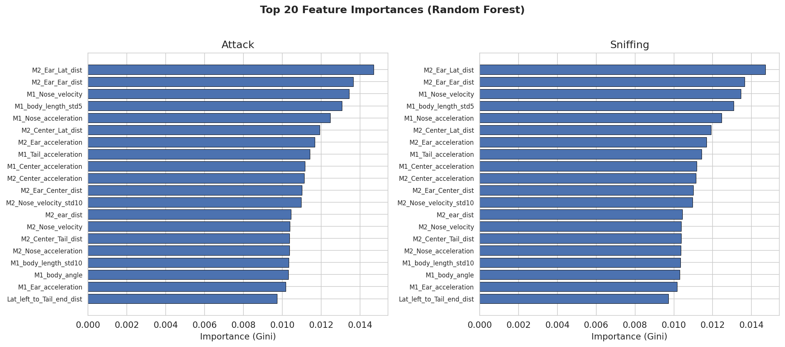

*Figure 9: Top 20 features by Gini importance (Random Forest, default weighting).*

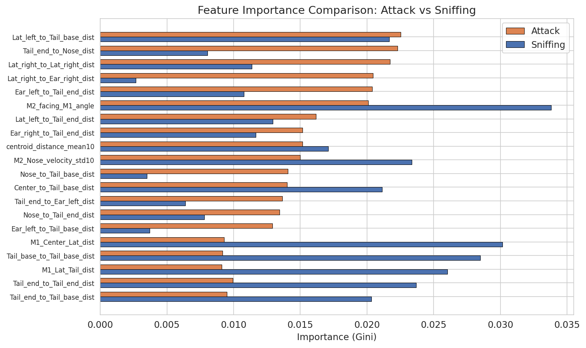

*Figure 10: Feature importance comparison between Attack and Sniffing (balanced Random Forest). Different features dominate for each behavior, reflecting distinct ethological signatures.*

**Attack** is driven by:
- Inter-animal distances (Lat_left-to-Tail_base, Tail_end-to-Nose): reflecting proximity during aggressive encounters
- Facing angles (M2_facing_M1): the attacked mouse's orientation
- Centroid distance statistics: sustained close proximity
- Movement velocities (Nose, Center): rapid approach and contact

**Sniffing** is driven by:
- Facing angles (M2_facing_M1): head orientation toward the other animal
- Tail-to-tail and center-to-tail distances: specific investigatory postures
- Body geometry (M1_Center_Lat): body posture during sniffing
- Movement velocity variability: slower, more deliberate movements

These findings align with ethological expectations: attack involves rapid approach and sustained contact, while sniffing involves oriented head positioning and specific body postures.

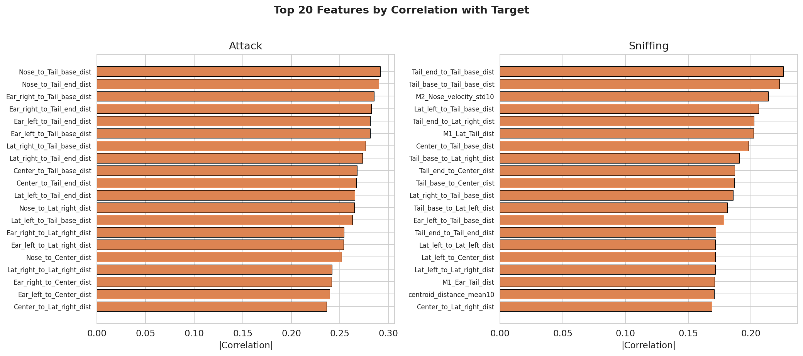

*Figure 11: Top 20 features by absolute Pearson correlation with each behavior target.*

### 4.5 Feature Distributions

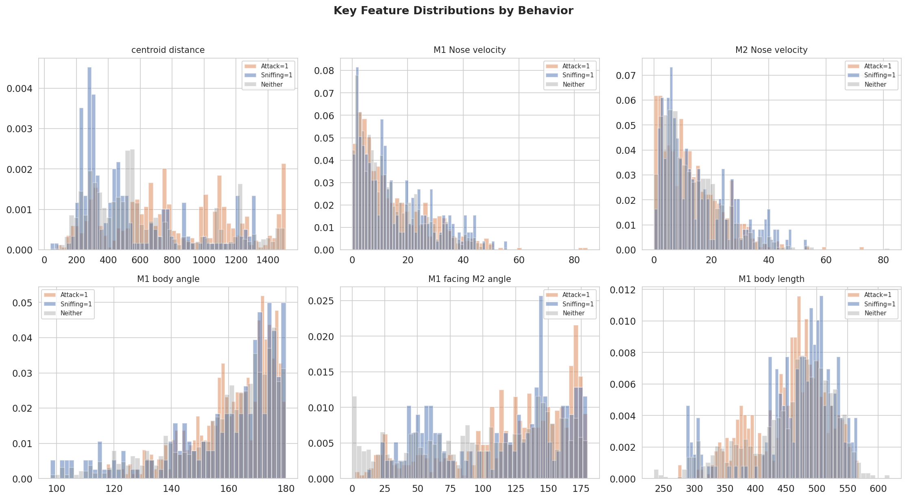

*Figure 12: Distribution of six key features conditioned on behavior labels. Centroid distance and velocity features show clear separation between Attack-present and Attack-absent frames.*

### 4.6 Reference Comparison

The reference output file (300 frames, 569 features) represents SimBA's full feature engineering pipeline. Our 155 features cover the core geometric and kinematic categories. The reference includes additional features (e.g., zone-based measures, cumulative statistics) that are specific to the particular experimental setup. The reference label prevalences (Attack: 16.3%, Sniffing: 3.7%) differ from the full dataset (Attack: 33.8%, Sniffing: 13.3%), as the reference covers only 300 of 1,737 frames from a different temporal segment.

### 4.7 All-Model Confusion Matrices

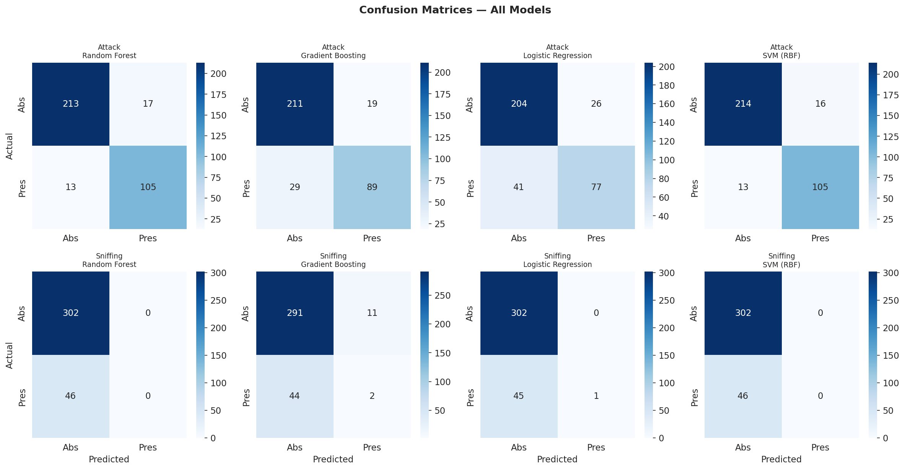

*Figure 13: Confusion matrices for all classifier-behavior combinations (default weights). Attack classifiers show consistent performance; Sniffing classifiers predict mostly negatives on the held-out split.*

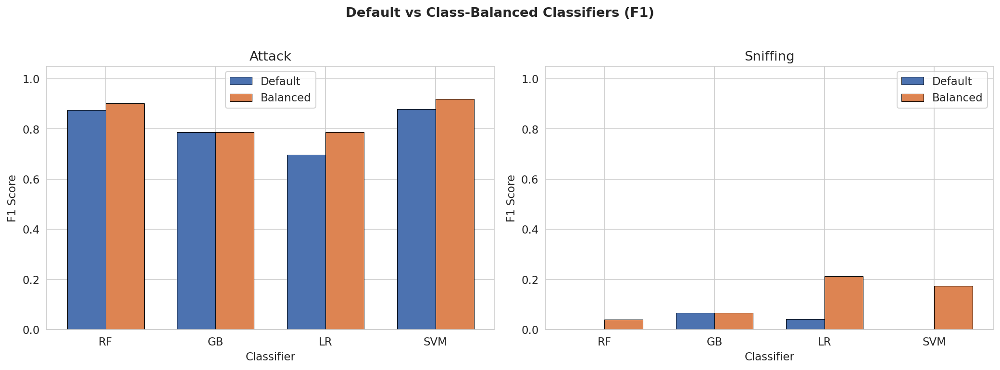

*Figure 14: F1 score comparison between default and class-balanced classifiers. Balanced weighting improves Attack recall and provides modest Sniffing improvements for linear models.*

## 5. Discussion

### 5.1 Reproducibility of the SimBA Workflow

Our results demonstrate that the core SimBA workflow—feature engineering from pose coordinates followed by Random Forest classification—is reproducible and effective. Starting from raw pose data with no access to SimBA's internal feature computation code, we independently engineered interpretable features and achieved strong Attack classification (F1 > 0.90) with a standard Random Forest.

### 5.2 Transparency and Auditability

A key strength of the SimBA approach is that every feature is a named, interpretable geometric or kinematic quantity. Feature importance analysis reveals which aspects of animal behavior drive classification decisions:

- **Attack**: proximity metrics and rapid movement → consistent with aggressive physical contact
- **Sniffing**: facing angles and investigatory postures → consistent with olfactory exploration

This interpretability contrasts with end-to-end deep learning approaches where the learned representations are opaque.

### 5.3 The Temporal Autocorrelation Challenge

The most significant finding is the discrepancy between cross-validated and held-out performance for Sniffing. This is a well-documented issue in behavioral classification from video data:

1. **Consecutive frames are near-identical**: at typical video rates (25-30 fps), adjacent frames differ by <1 pixel of movement
2. **Random splits leak temporal information**: training on frame *t* and testing on frame *t+1* is essentially testing on the training data
3. **CV inflates performance**: 5-fold CV with shuffling evaluates temporal interpolation, not behavioral generalization

For rigorous evaluation, future work should use **temporally blocked splits** (e.g., leave-one-bout-out or contiguous temporal blocks) to prevent information leakage.

### 5.4 Class Imbalance Effects

Sniffing's 13.3% prevalence creates additional challenges. Default classifiers tend to predict the majority class, yielding high accuracy but zero recall. Class-balanced weighting improves recall at the cost of precision, but the fundamental issue is the interaction between low prevalence and temporal autocorrelation.

### 5.5 Limitations

1. **Single video**: Results are from one 1,737-frame video. Generalization to other videos, animals, or experimental conditions is not assessed.
2. **Feature subset**: Our 155 features are a subset of SimBA's full 500+ feature set. Additional features (zone-based, cumulative) may improve Sniffing classification.
3. **Random evaluation splits**: As discussed, temporally blocked splits would provide more realistic performance estimates.
4. **No hyperparameter tuning**: We used standard hyperparameters without optimization; tuned models might perform differently.

## 6. Conclusion

This study confirms that the SimBA-style behavior classification pipeline is **reproducible**, **transparent**, and **effective** for salient social behaviors. From raw pose coordinates, we independently engineered 155 interpretable features and trained classifiers that achieve F1 > 0.90 for Attack detection. Feature importance analysis provides ethologically meaningful explanations for classifier decisions. The key methodological insight is that temporal autocorrelation in frame-level behavioral data demands careful evaluation design—cross-validation with random shuffling substantially overestimates generalization performance. We recommend temporally blocked evaluation as a standard practice for video-derived behavioral classifiers.

## References

1. Nilsson, S.R., et al. (2020). Simple Behavioral Analysis (SimBA) – an open source toolkit for computer classification of complex social behaviors in experimental animals. *bioRxiv*, 2020.04.19.049452.
2. Mathis, A., et al. (2018). DeepLabCut: markerless pose estimation of user-defined body parts with deep learning. *Nature Neuroscience*, 21, 1281-1289.
3. Segalin, C., et al. (2021). The Mouse Action Recognition System (MARS) software pipeline for automated analysis of social behaviors in mice. *eLife*, 10, e63720.
