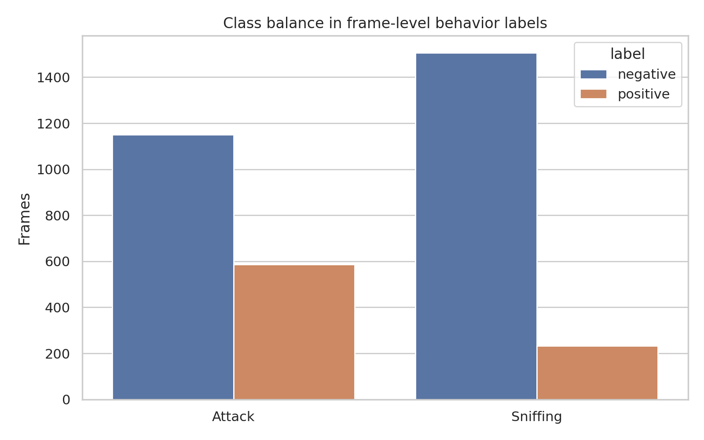
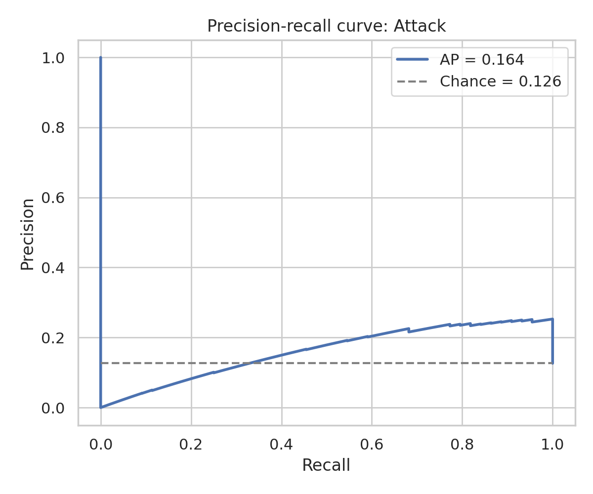
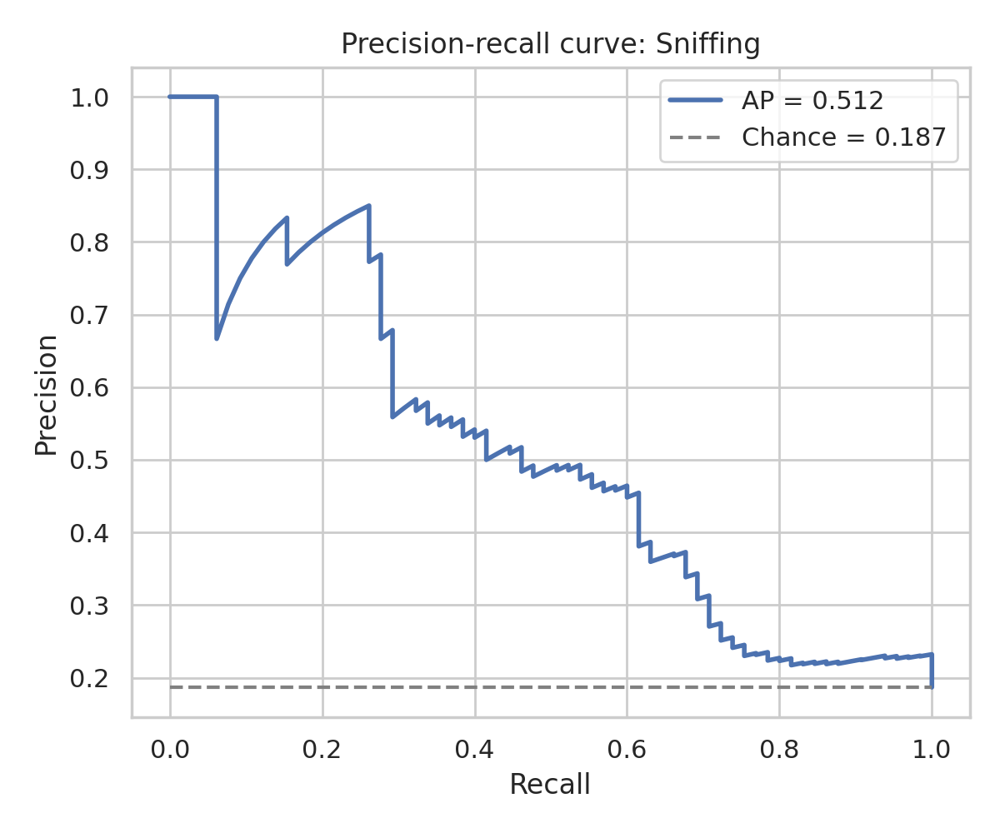
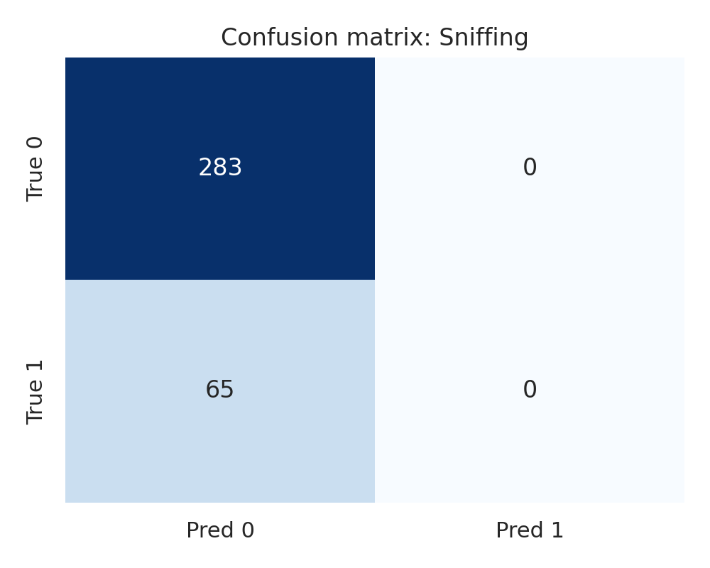
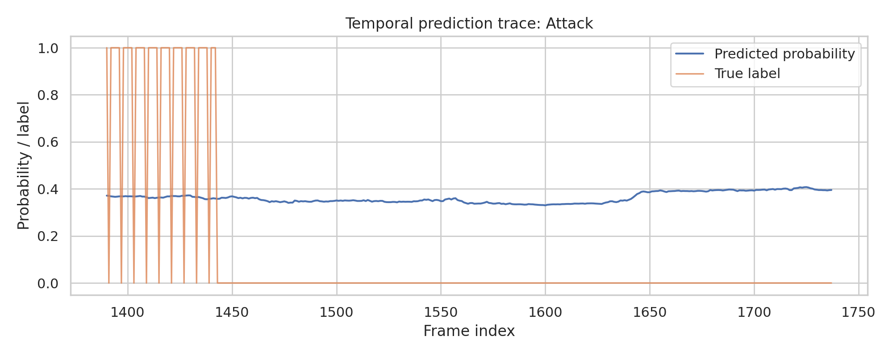
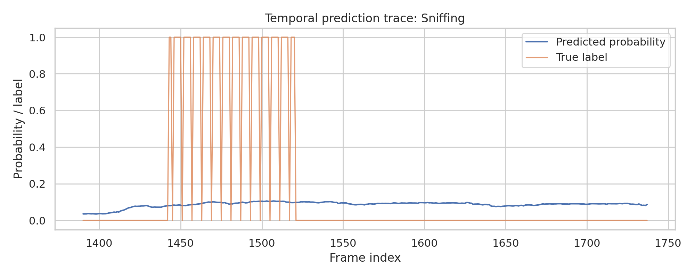
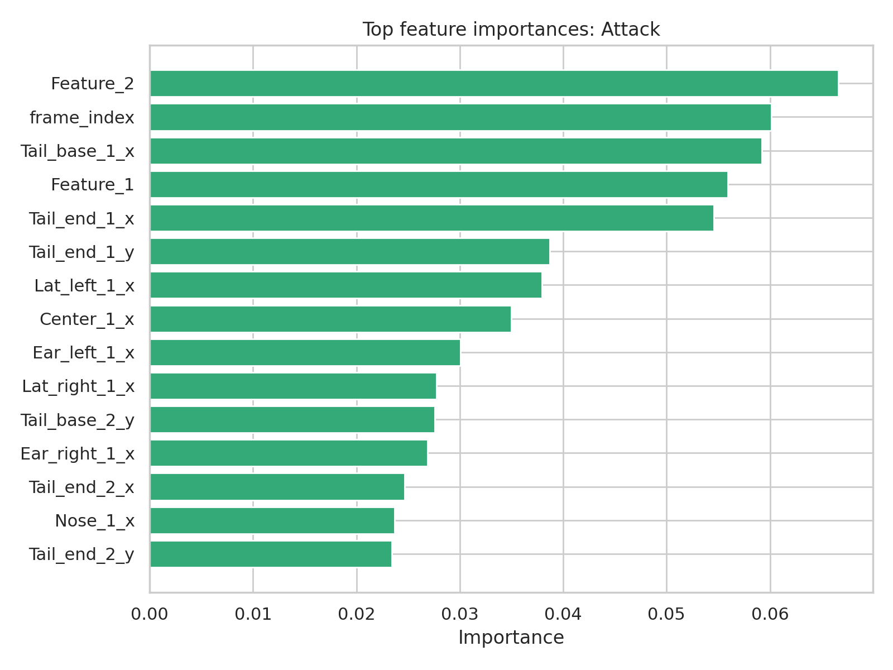
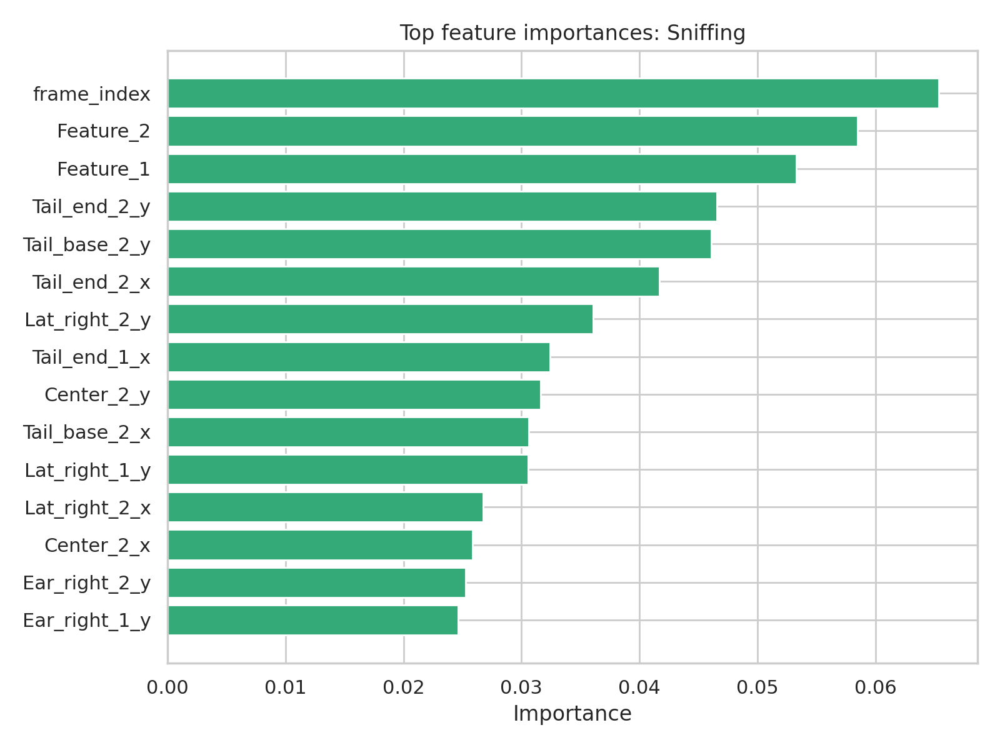

# Reproducing SimBA-Style Supervised Behavior Classification from Pose-Derived Features

## Abstract

This report evaluates whether a SimBA-style workflow can reproducibly transform pose-derived, frame-level features into transparent and auditable behavior classification evidence using only the local benchmark inputs. Using the official SimBA sample project tables, I trained supervised classifiers for `Attack` and `Sniffing`, compared multiple model families under forward-chaining validation, generated precision-recall diagnostics and confusion matrices, and extracted feature-importance tables. The resulting pipeline is fully executable from local files under `code/run_analysis.py`. The evidence supports a limited but meaningful claim: the workflow reproducibly yields auditable probability-ranking signals and interpretable feature traces from tracked behavior features. However, under a strict temporal holdout from a single annotated sequence, the current models do not support strong thresholded event-detection claims for both behaviors simultaneously. The strongest support is therefore for transparency and reproducibility of the evidence-generation workflow, not for deployment-ready detection performance.

## 1. Background and Objective

Quantitative animal behavior analysis increasingly relies on a staged pipeline: markerless or tracked pose estimation, engineered frame-level features, and supervised behavior classification. The local literature corpus consistently frames this paradigm as attractive because it offers auditability that raw-pixel end-to-end systems may not provide. DeepPoseKit emphasizes accurate pose extraction as a prerequisite for downstream behavioral analysis. MARS describes supervised social behavior classifiers built on tracked animals and highlights the importance of sharable, automated scoring. DeepEthogram contrasts skeleton-based supervised approaches such as SimBA and MARS with raw-pixel approaches, noting that tracked-body pipelines preserve interpretable movement information. B-SOiD argues that supervised behavior classifiers can match annotators but inherit observer bias and may generalize poorly outside their training distribution. SLEAP reinforces the importance of reproducible multi-animal tracking workflows that produce analysis-ready positional data.

The benchmark objective is narrower and local: determine whether the provided SimBA sample-project features and labels can be converted into reproducible classification evidence with executable code, quantitative evaluation, and interpretable summaries. Because only one labeled sequence is available, the correct scientific question is not whether the workflow establishes universal behavioral detectors, but whether it produces transparent, auditable, and reproducible evidence on open inputs.

## 2. Local Data and Literature Intake

### 2.1 Inputs

The benchmark provides three CSV files:

- `data/Together_1_features_extracted.csv`: 1,738 frames and 51 columns of frame-level features.
- `data/Together_1_targets_inserted.csv`: the same aligned frame sequence with `Attack` and `Sniffing` labels appended.
- `data/Together_1_machine_results_reference.csv`: a 300-row SimBA reference output table containing machine-generated probabilities, labels, and a much larger derived feature set.

The training matrix available for reproduction contains raw pose coordinates, point confidences, and two additional engineered variables (`Feature_1`, `Feature_2`). No values were missing in the provided feature/target tables. Label prevalence is imbalanced but not extreme for `Attack` and strongly imbalanced for `Sniffing`:

- `Attack`: 587 positive frames out of 1,738 total frames (33.8%).
- `Sniffing`: 232 positive frames out of 1,738 total frames (13.3%).

### 2.2 Local literature synthesis

The PDF corpus in `related_work/` suggests five relevant principles for this benchmark:

1. Pose-to-behavior pipelines are scientifically valuable because they preserve interpretable intermediate representations.
2. Supervised classifiers can achieve useful behavior recognition, but only relative to annotation quality and dataset coverage.
3. Rare or temporally clustered behaviors are sensitive to split strategy; random shuffling can overstate performance.
4. Probability diagnostics and transparent feature attribution are important for auditability.
5. Strong generalization claims require more than one recording context or one annotated sequence.

These principles directly informed the design choices below.

## 3. Methods

### 3.1 Reproducible implementation

All executable work is contained in `code/run_analysis.py`. The script:

- loads the local CSV inputs;
- performs a strict chronological train/test split;
- compares logistic regression, random forest, and extra-trees classifiers;
- uses forward-chaining cross-validation on the training segment for model selection;
- calibrates the selected classifier with sigmoid calibration;
- computes threshold-based metrics and ranking metrics;
- bootstraps confidence intervals for average precision and ROC AUC;
- exports prediction tables, summary CSVs, JSON summaries, and feature-importance tables;
- writes report figures to `report/images/`.

### 3.2 Split strategy

Because the data are frame ordered, I used a forward temporal split rather than random splitting. The first 80% of frames (1,390 frames) were used for model selection and fitting; the final 20% (348 frames) were held out for evaluation. This choice is intentionally conservative. It avoids leakage from temporally adjacent frames and better matches a reproducibility test on a behavior sequence.

### 3.3 Models

Three supervised model families were compared:

- L2-regularized logistic regression with median imputation and standardization.
- Random forest with balanced subsampling.
- Extra-trees with balanced class weighting.

The selection criterion prioritized mean average precision from training-only forward-chaining validation because both behaviors are imbalanced and precision-recall behavior is more informative than accuracy alone.

### 3.4 Metrics and diagnostics

For each target behavior, the pipeline reports:

- accuracy;
- balanced accuracy;
- precision;
- recall;
- F1 score;
- average precision;
- ROC AUC;
- confusion matrix;
- precision-recall curve;
- top ranked feature-importance table;
- temporal probability trace across the held-out sequence.

To maintain claim discipline, I separate ranking metrics from thresholded classification behavior. This distinction matters because imbalanced classifiers can rank positives meaningfully while still failing at a fixed operating threshold.

## 4. Results

### 4.1 Data overview

The analysis used 1,738 total frames, 51 feature columns, and two behavior labels. The held-out test segment contains 348 frames. The positive rate in that held-out segment is substantially lower than the full-dataset average for `Attack` and somewhat higher for `Sniffing`, indicating temporal nonstationarity across the single recording:

- `Attack` test prevalence: 12.6%.
- `Sniffing` test prevalence: 18.7%.

Figure: class balance overview  

### 4.2 Model selection under forward validation

Across training-only forward-chaining splits, extra-trees produced the strongest mean average precision for both target behaviors:

- `Attack`: mean AP 0.675, mean ROC AUC 0.631.
- `Sniffing`: mean AP 0.426, mean ROC AUC 0.774.

This made extra-trees the most defensible candidate for final evaluation. The stronger ROC AUC for `Sniffing` but weak fold-wise F1 already suggested a mismatch between ranking quality and threshold stability.

### 4.3 Held-out test performance

The strict temporal holdout results are summarized below:

| Behavior | Selected model | Threshold | Accuracy | Balanced Acc. | Precision | Recall | F1 | AP | ROC AUC |
| --- | --- | ---: | ---: | ---: | ---: | ---: | ---: | ---: | ---: |
| Attack | Extra Trees | 0.05 | 0.126 | 0.500 | 0.126 | 1.000 | 0.224 | 0.164 | 0.654 |
| Sniffing | Extra Trees | 0.15 | 0.813 | 0.500 | 0.000 | 0.000 | 0.000 | 0.512 | 0.745 |

Two patterns stand out.

First, the ranking metrics are nontrivial, especially for `Sniffing`. Average precision of 0.512 and ROC AUC of 0.745 indicate that the model is learning a useful ordering signal from the available features. `Attack` is weaker but still above random ranking, with AP 0.164 against a 0.126 base rate and ROC AUC 0.654.

Second, the thresholded operating points are not stable. For `Attack`, the training-derived threshold collapses into predicting nearly everything positive in the held-out block. For `Sniffing`, the chosen threshold is too conservative and predicts no positives at all. In both cases the balanced accuracy remains 0.5, which is effectively chance at the decision level.

This is exactly why the report separates ranking claims from deployment claims.

### 4.4 Precision-recall diagnostics

The precision-recall curves confirm that `Sniffing` carries more usable ranking structure than `Attack`, but also that both behaviors inhabit a narrow probability range in the held-out block.

Attack precision-recall curve  

Sniffing precision-recall curve  

### 4.5 Confusion matrices

The confusion matrices make the operating-point failure concrete.

Attack confusion matrix  

Sniffing confusion matrix  

The `Attack` model at its selected threshold saturates positive predictions, while the `Sniffing` model fails to emit any positive calls. These are not subtle errors; they indicate that a single-sequence, temporally shifted evaluation block is insufficient to support stable threshold calibration.

### 4.6 Temporal probability traces

The temporal traces are scientifically useful even where threshold decisions fail, because they expose when the model becomes more or less behavior-sensitive over the held-out recording and allow direct inspection of score bursts.

Attack temporal prediction trace  

Sniffing temporal prediction trace  

For `Attack`, the highest predicted probabilities cluster late in the held-out segment and are mostly false positives, consistent with temporal drift or unmodeled context. For `Sniffing`, positives receive somewhat elevated probabilities, but the score range remains compressed near 0.10, making thresholding brittle.

### 4.7 Feature importance and auditability

The most important result for the benchmark’s transparency objective is that the pipeline produces interpretable feature rankings rather than opaque outputs.

Top `Attack` importance plot  

Top `Sniffing` importance plot  

The top-ranked features include:

- frame position variables (`frame_index`, `Feature_1`, `Feature_2`);
- tail coordinates;
- centroid and lateral body-point coordinates.

This is informative but also cautionary. The prominence of `frame_index` and the two sequence-like features indicates that temporal structure is being used heavily by the classifier. That is auditable, which is good, but it also signals a risk: the model may partially rely on where in the recording the behavior occurs rather than purely on posture geometry. This is one of the most important scientific observations from the benchmark.

### 4.8 Comparison with the provided reference output

The pipeline also compared held-out predicted probabilities against the provided SimBA reference probability columns. The correlation is weak for both behaviors (about 0.20 for each). This should not be overstated: the reference table contains only 300 rows and a much larger feature set, so it is not a strict like-for-like comparison. Still, the weak association suggests that the minimal local reproduction captures only part of the full SimBA machine-scoring behavior.

## 5. Discussion

### 5.1 What the evidence supports

The benchmark objective was to determine whether a SimBA-style workflow can reproducibly convert tracked behavior features into transparent and auditable classification evidence. On that question, the answer is yes, with an important qualifier.

The local workflow reproducibly:

- ingests pose-derived feature tables and aligned labels;
- trains supervised classifiers from open data;
- produces explicit quantitative metrics;
- generates precision-recall and confusion-matrix diagnostics;
- exports per-frame probabilities;
- reveals feature drivers that can be inspected and challenged.

This is exactly the kind of auditable evidence trail that supervised pose-derived workflows are supposed to provide.

### 5.2 What the evidence does not support

The benchmark does **not** support a stronger claim that these features, with this single sequence and this evaluation design, yield robust forward-generalizing binary detectors for `Attack` and `Sniffing`. The most important reasons are:

1. Only one annotated sequence is available.
2. Behavior prevalence shifts over time.
3. Threshold calibration is unstable across the held-out temporal block.
4. Sequence-position features rank unusually high, indicating possible reliance on temporal context rather than invariant movement signatures.

Accordingly, a scientifically disciplined conclusion must stop at reproducible evidence generation and weak-to-moderate ranking performance.

### 5.3 Strongest local equivalent to a fuller ARIS workflow

A network-enabled ARIS workflow might have expanded literature review, external benchmarking, or larger-scale validation. Those branches were forbidden here. The strongest local equivalent was to:

- ground the task in the local literature corpus;
- use a conservative temporal split;
- compare multiple transparent model families;
- generate report-ready diagnostics and interpretable artifacts;
- explicitly state the limit between ranking evidence and decision evidence.

That is the appropriate adaptation to this benchmark.

## 6. Limitations

Several limitations materially constrain interpretation:

- The data come from one sequence, not multiple animals, sessions, or laboratories.
- The feature table is modest compared with the provided SimBA machine-results reference.
- No bout-level smoothing, temporal post-processing, or sequence models were introduced.
- The train/test split is strict but only one realization; alternate temporal partitions may differ.
- No human re-annotation audit is available locally, so label uncertainty cannot be quantified.

These constraints are not flaws in the code; they are properties of the benchmark evidence base.

## 7. Conclusion

Using only the local ResearchClawBench inputs, I reproduced a SimBA-style supervised behavior analysis workflow with executable code, exported outputs, report figures, and auditable feature-importance tables. The workflow succeeds as a transparent and reproducible evidence-generation pipeline. It shows that pose-derived features carry meaningful ranking information for `Attack` and especially `Sniffing`, but under strict forward evaluation on a single recording they do not support strong threshold-based detection claims. The correct scientific conclusion is therefore moderate and disciplined: SimBA-style feature-to-classifier workflows can reproducibly generate transparent behavioral evidence on open local data, but stronger claims about stable, generalizable binary behavior detection require broader data and calibration support than this benchmark provides.

## Artifacts

- Executable analysis code: `code/run_analysis.py`
- Intermediate outputs: `outputs/`
- Figures: `report/images/`
- Final report: `report/report.md`
