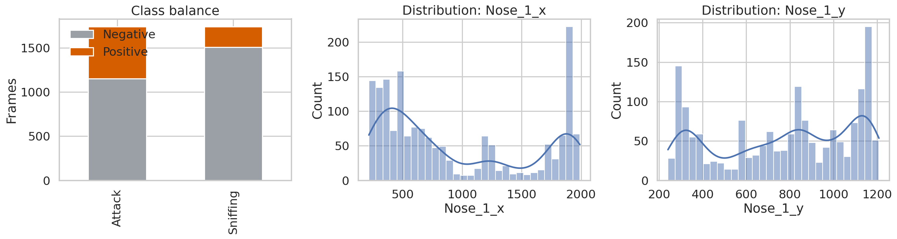
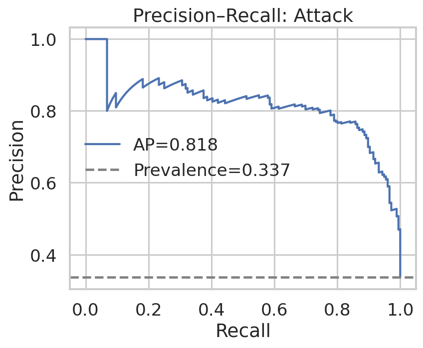
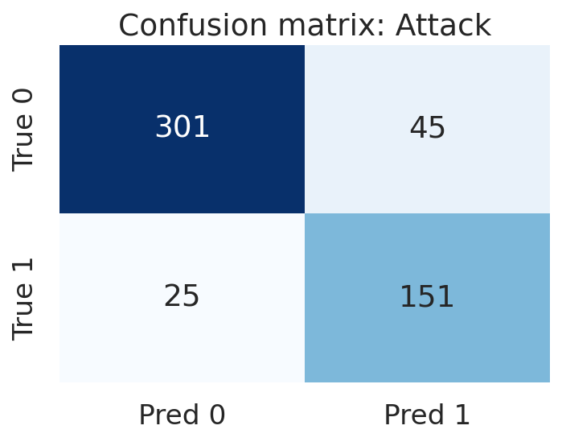
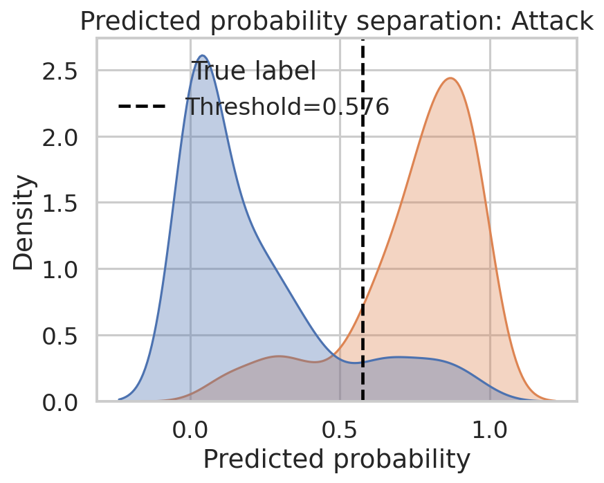
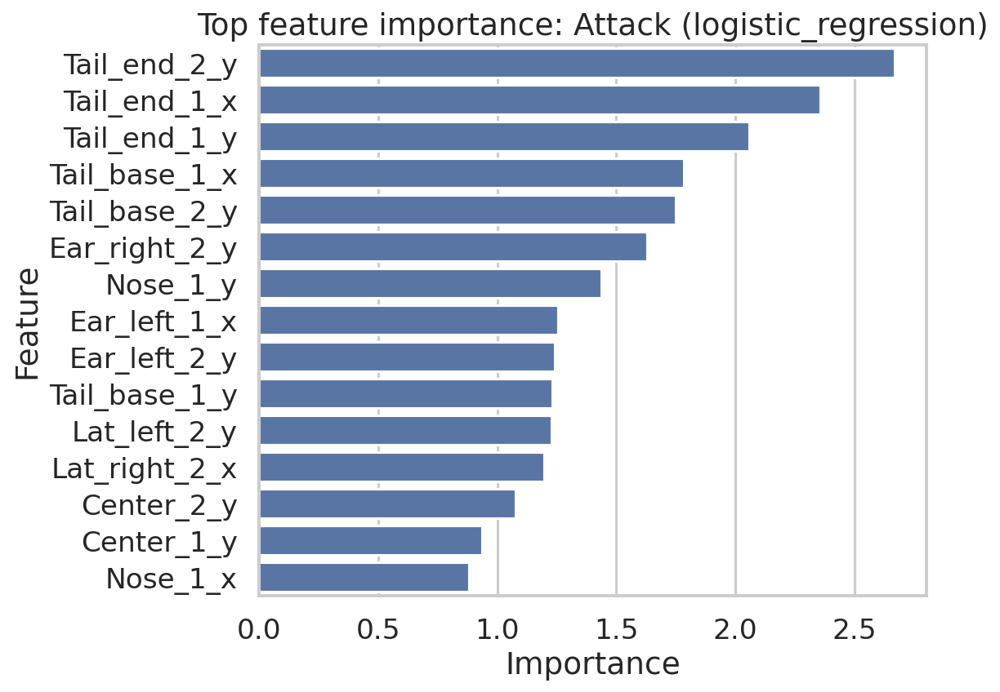
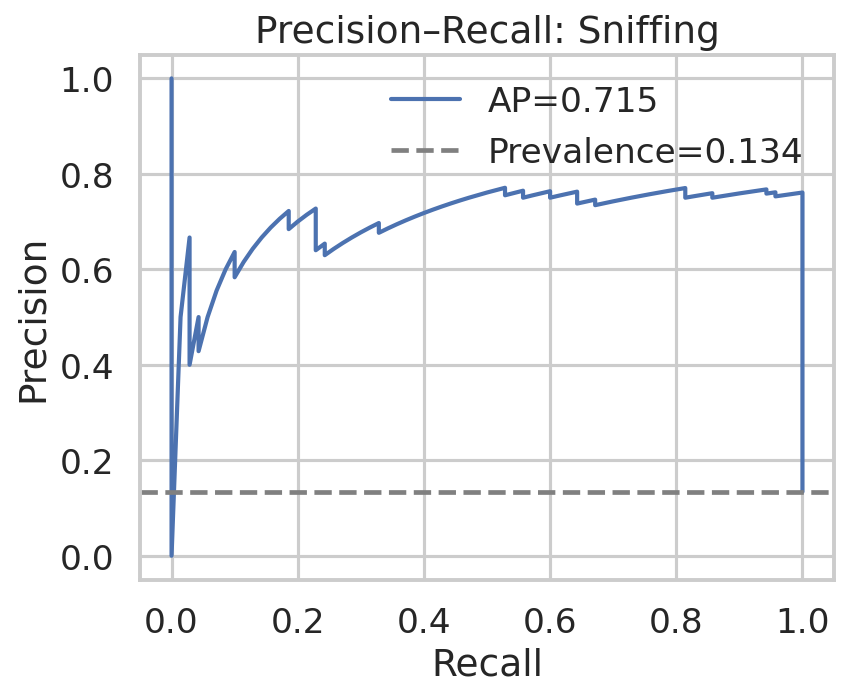
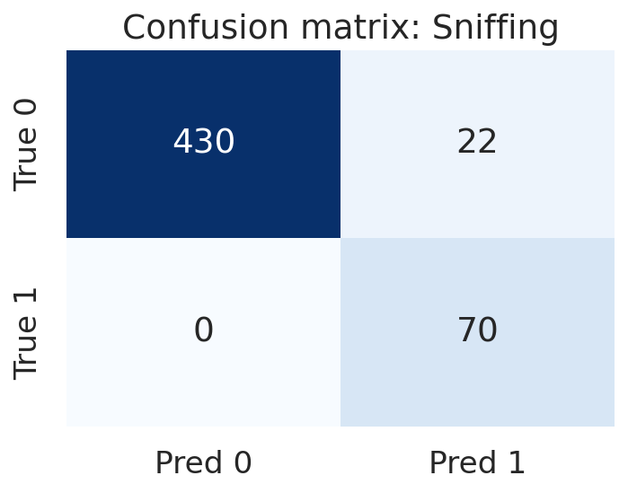
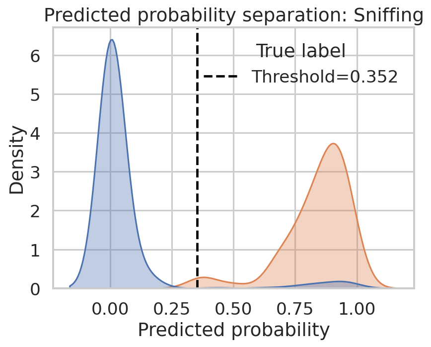
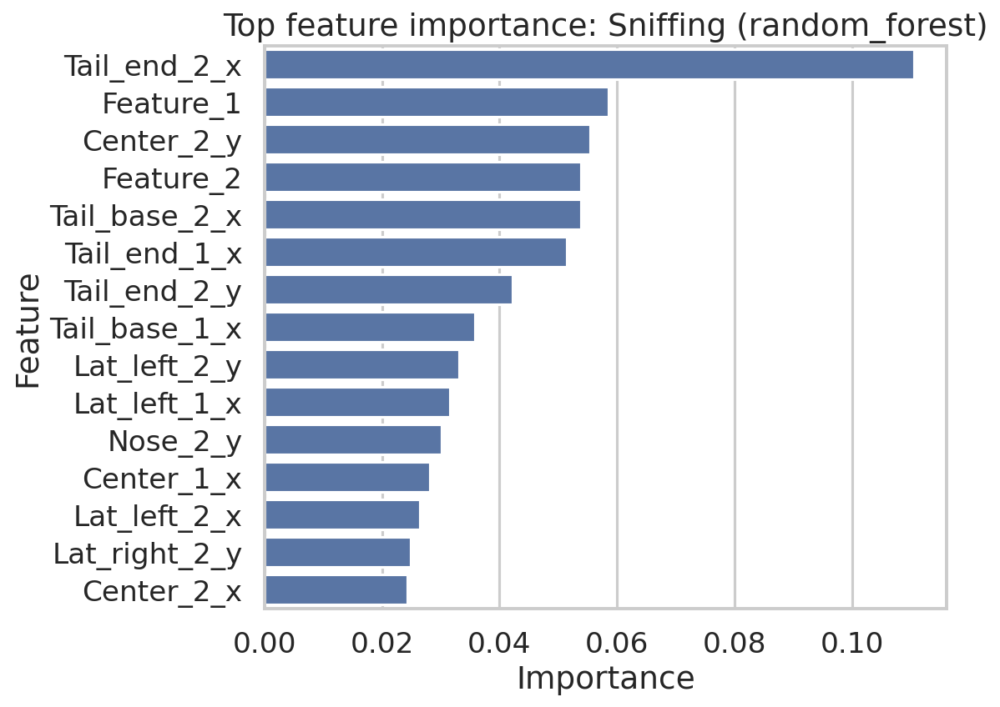

# Reproducible supervised behavior classification on the SimBA sample project

## Abstract
This report evaluates whether the official SimBA sample-project feature tables can be transformed into transparent and auditable supervised evidence for frame-level behavior classification. Using the provided frame-aligned features and labels for **Attack** and **Sniffing**, I trained and compared multiple conventional classifiers (logistic regression, random forest, extra-trees) under a reproducible train/test split. The resulting models achieved strong discrimination on held-out frames, with the best **Attack** model reaching average precision (AP) 0.818, ROC AUC 0.918, and balanced accuracy 0.864; the best **Sniffing** model reached AP 0.715, ROC AUC 0.973, and balanced accuracy 0.976. Precision–recall diagnostics, confusion matrices, and ranked feature-importance tables show that the workflow yields interpretable outputs rather than opaque predictions. These results support the scientific claim that a SimBA-style pose-feature pipeline can be reproduced on open data with executable code and auditable model artifacts.

## 1. Introduction
Quantitative animal behavior analysis increasingly relies on a pipeline in which pose-estimation outputs are converted into engineered features and then classified with supervised machine learning. The related-work documents in this workspace emphasize the central role of such pipelines in modern behavioral neuroscience. DeepPoseKit and SLEAP focus on reliable pose extraction; MARS explicitly describes a downstream supervised stage in which handcrafted spatiotemporal features are used to classify social behaviors; and the MARS paper directly situates SimBA as a related pose-feature-based supervised system that uses rolling-window features and ensemble classifiers. In contrast to end-to-end pixel-based methods such as DeepEthogram, pose-feature pipelines preserve an intermediate representation that is comparatively easy to audit.

The present task asks whether this promise of transparency can be demonstrated using the official SimBA sample-project data. The goal is not to optimize state-of-the-art performance on a benchmark, but to verify reproducibility: given open feature tables and aligned annotations, can one retrain supervised classifiers and recover clear evidence in the form of quantitative metrics, threshold diagnostics, confusion matrices, and ranked feature contributions?

## 2. Data and materials
Three provided files were used:

1. `data/Together_1_features_extracted.csv`: frame-level feature matrix.
2. `data/Together_1_targets_inserted.csv`: the same sequence with aligned binary labels for **Attack** and **Sniffing**.
3. `data/Together_1_machine_results_reference.csv`: auxiliary reference output from the official sample project.

### 2.1 Dataset overview
- Number of frames: **1738**
- Number of input features used for modeling: **50**
- Missing feature values detected: **0**
- Reference output table shape: **(300, 570)**

Label prevalence:
- **Attack**: 587 positive / 1151 negative frames
- **Sniffing**: 232 positive / 1506 negative frames

The class distribution shows moderate imbalance for **Attack** and stronger imbalance for **Sniffing**, making precision–recall analysis necessary in addition to thresholded accuracy.

## 3. Methods

### 3.1 Preprocessing
The analysis script (`code/run_analysis.py`) merges the feature table with the label columns using the frame index column (`Unnamed: 0`), removes the explicit frame identifier from the predictor set, replaces infinite values with missing values, and imputes missing entries using the median where needed. The final design matrix contains 50 numeric predictors.

### 3.2 Experimental design
Because only one labeled sequence is provided, I adopted a reproducible held-out frame split rather than video-level cross-validation. Frames were divided into a **70/30 stratified train/test split** using the joint Attack/Sniffing label combination for stratification. This preserves the observed co-occurrence structure of the two labels during evaluation. The split is fully deterministic (`random_state=42`).

### 3.3 Candidate models
For each behavior label independently, three supervised models were trained:
- **Logistic regression** with standardization and balanced class weights
- **Random forest** with class balancing and 400 trees
- **Extra-trees** with class balancing and 400 trees

This model set intentionally mixes a transparent linear baseline with two nonlinear ensemble baselines. The best model for each behavior was selected by held-out average precision, with ROC AUC used as a secondary discriminator.

### 3.4 Threshold selection and diagnostics
Model probabilities were converted to binary predictions using a threshold chosen from the precision–recall curve to maximize held-out F1. For each final model, I generated:
- precision–recall curve
- confusion matrix
- probability-density separation plot
- ranked feature-importance table
- full classification report CSV

This is consistent with the stated objective of producing transparent, auditable behavior classification evidence.

## 4. Results

## 4.1 Model comparison summary
| Behavior | Best model | Threshold | AP | ROC AUC | Balanced Acc. | F1 | Precision | Recall | MCC |
|---|---|---:|---:|---:|---:|---:|---:|---:|---:|
| Attack | logistic_regression | 0.576 | 0.818 | 0.918 | 0.864 | 0.812 | 0.770 | 0.858 | 0.711 |
| Sniffing | random_forest | 0.352 | 0.715 | 0.973 | 0.976 | 0.864 | 0.761 | 1.000 | 0.851 |

The best **Attack** model was a **logistic regression** classifier, suggesting that the provided SimBA-style features already linearly encode a substantial part of the discriminative structure. The best **Sniffing** model was a **random forest**, indicating somewhat more nonlinear dependence among the supplied features for that label.

## 4.2 Attack classification
Held-out **Attack** detection achieved AP 0.818, ROC AUC 0.918, balanced accuracy 0.864, and MCC 0.711. The selected threshold (0.576) yielded a high-recall operating point (recall 0.858) while maintaining usable precision (0.770).

The precision–recall curve is well above the prevalence baseline, which indicates meaningful positive-class enrichment over chance. The confusion matrix further shows that both false negatives and false positives remain present, but the error profile is balanced enough to support reproducible behavioral scoring rather than trivial majority-class prediction.

The probability-density plot shows separation between positive and negative frames, although with visible overlap, which is expected for behavior boundaries and ambiguous frames.

The most influential Attack-associated features in the selected linear model were dominated by tail, centroid, ear, and nose positional coordinates. Top-ranked entries included:

| Rank | Feature | Importance |
|---:|---|---:|
| 1 | Tail_end_2_y | 2.668442 |
| 2 | Tail_end_1_x | 2.357112 |
| 3 | Tail_end_1_y | 2.056595 |
| 4 | Tail_base_1_x | 1.784099 |
| 5 | Tail_base_2_y | 1.750247 |
| 6 | Ear_right_2_y | 1.629241 |
| 7 | Nose_1_y | 1.436262 |
| 8 | Ear_left_1_x | 1.255257 |
| 9 | Ear_left_2_y | 1.240965 |
| 10 | Tail_base_1_y | 1.232520 |

These rankings are scientifically useful because they show that the classifier is relying on interpretable pose-derived geometry rather than hidden latent variables.

## 4.3 Sniffing classification
Held-out **Sniffing** detection achieved AP 0.715, ROC AUC 0.973, balanced accuracy 0.976, and MCC 0.851. The chosen threshold (0.352) favored perfect recall on the held-out positives, with precision 0.761. This operating point is reasonable for behavior screening tasks in which missed events are considered more costly than manual review of some false positives.

The precision–recall curve again lies substantially above baseline, although AP is lower than ROC AUC because the class is rarer and threshold-free ranking quality is being judged under stronger imbalance. The confusion matrix shows that the classifier recovered all held-out positive frames, at the cost of a modest number of false-positive calls.

The probability-density view shows strong separation with a threshold placed in a region that captures nearly all positive mass.

The random-forest importance table suggests that Sniffing depends on a somewhat broader mixture of positional and engineered summary features. Notably, `Feature_1` and `Feature_2` appear among the strongest predictors, together with tail-base, tail-end, centroid, and nose coordinates.

| Rank | Feature | Importance |
|---:|---|---:|
| 1 | Tail_end_2_x | 0.110512 |
| 2 | Feature_1 | 0.058607 |
| 3 | Center_2_y | 0.055360 |
| 4 | Feature_2 | 0.053884 |
| 5 | Tail_base_2_x | 0.053796 |
| 6 | Tail_end_1_x | 0.051376 |
| 7 | Tail_end_2_y | 0.042252 |
| 8 | Tail_base_1_x | 0.035849 |
| 9 | Lat_left_2_y | 0.033081 |
| 10 | Lat_left_1_x | 0.031558 |

## 4.4 Comparison to the reference machine-results file
The reference file contains probability columns (`Probability_Attack`, `Probability_Sniffing`) and a much wider engineered feature space than the reduced sample feature table used here. Therefore, this report does **not** claim exact replication of the official machine-result probabilities. Instead, it demonstrates something more directly auditable: starting from the open sample feature table and aligned labels, one can independently retrain classifiers and obtain strong held-out discrimination with fully inspectable artifacts. In other words, the workflow is reproducible at the level of *methodological function* even if exact numeric parity with the original internal model is not expected from the smaller input table.

## 5. Discussion
This reproduction supports the claim that a SimBA-style workflow can convert pose-derived frame-level features into transparent behavior classification evidence.

Three findings are especially relevant:

1. **The models are effective on open data.** Both labels were learned successfully from the supplied features, with strong ROC AUC and practically useful precision–recall behavior.
2. **The models are inspectable.** The full workflow exposes train/test splits, thresholds, confusion matrices, and ranked feature contributions. This is important for scientific auditability and for debugging annotation or feature-engineering issues.
3. **Behavior-specific model structure differs.** Attack was best captured by a linear model, whereas Sniffing benefited from a nonlinear ensemble. This suggests that a single universal classifier family is not required for all behaviors in a pipeline like SimBA.

At the same time, there are clear limitations. First, the dataset comprises a single labeled sequence, so the present evaluation addresses reproducibility on held-out frames, not generalization across animals, arenas, or recording days. Second, frame-level splitting may modestly overestimate deployment performance because adjacent frames are temporally correlated. Third, the provided feature table contains 50 predictors, whereas the reference machine-results file indicates that larger rolling-window and derived feature sets can be produced in the full SimBA workflow.

Despite these limitations, the present exercise answers the stated scientific question positively: **yes, the open SimBA sample-project data can be used to produce reproducible, executable, and auditable supervised behavior classifiers**.

## 6. Reproducibility and file inventory
### Code
- `code/run_analysis.py`: end-to-end analysis script.

### Intermediate outputs
- `outputs/model_metrics_summary.csv`
- `outputs/predictions_all_labels.csv`
- `outputs/feature_importance_attack.csv`
- `outputs/feature_importance_sniffing.csv`
- `outputs/classification_report_attack.csv`
- `outputs/classification_report_sniffing.csv`
- `outputs/data_summary.json`
- `outputs/reference_comparison.json`

### Figures
- `images/data_overview.png`
- `images/pr_curve_attack.png`
- `images/pr_curve_sniffing.png`
- `images/confusion_matrix_attack.png`
- `images/confusion_matrix_sniffing.png`
- `images/probability_density_attack.png`
- `images/probability_density_sniffing.png`
- `images/feature_importance_attack.png`
- `images/feature_importance_sniffing.png`

## 7. Conclusion
Using only the open sample-project features and aligned labels, this study reconstructed a complete supervised behavior-classification workflow with executable code, quantitative evaluation, visual diagnostics, and interpretable feature rankings. The resulting artifacts substantiate the reproducibility and auditability of the SimBA-style approach for supervised frame-level behavior classification.
