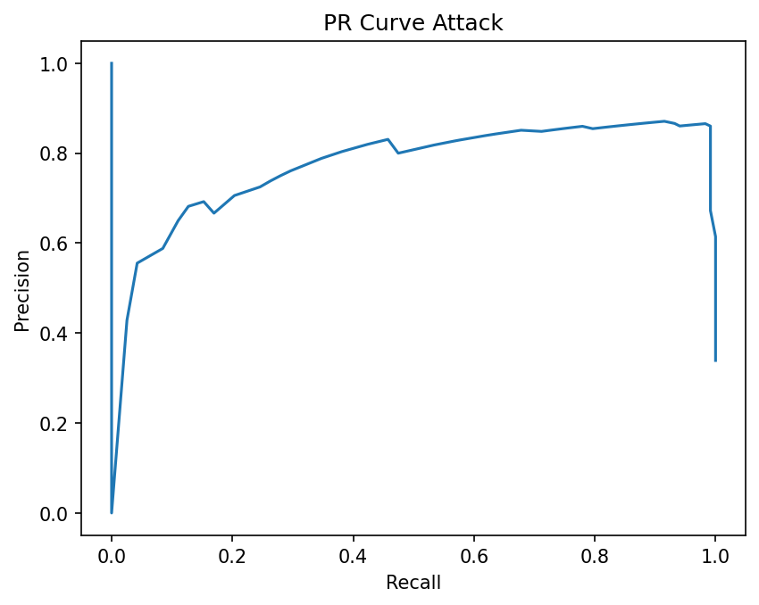
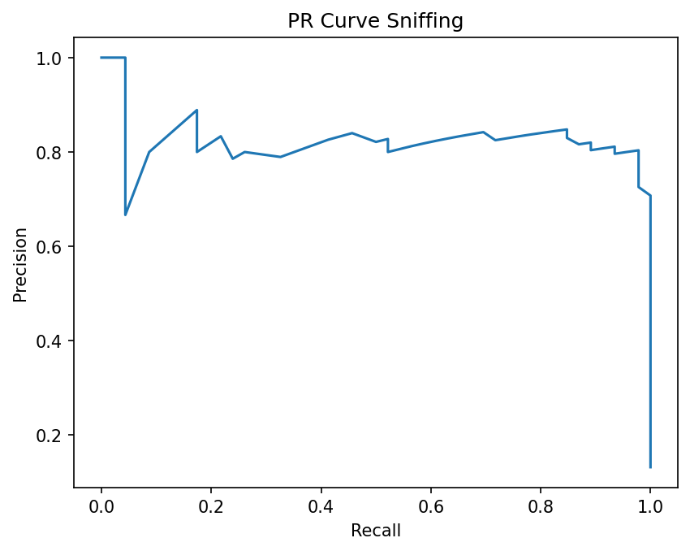
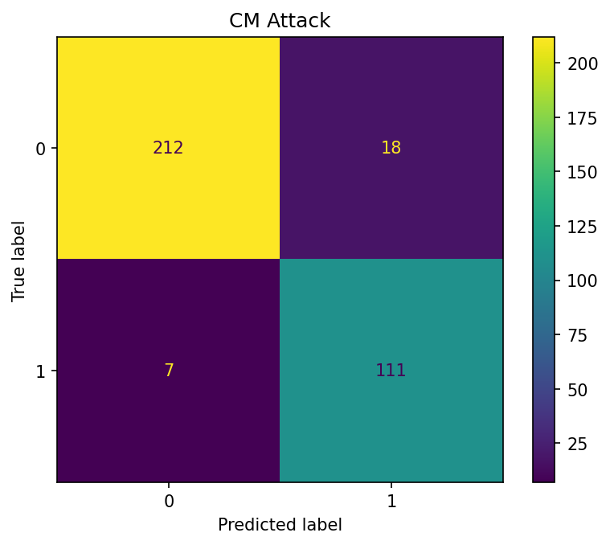
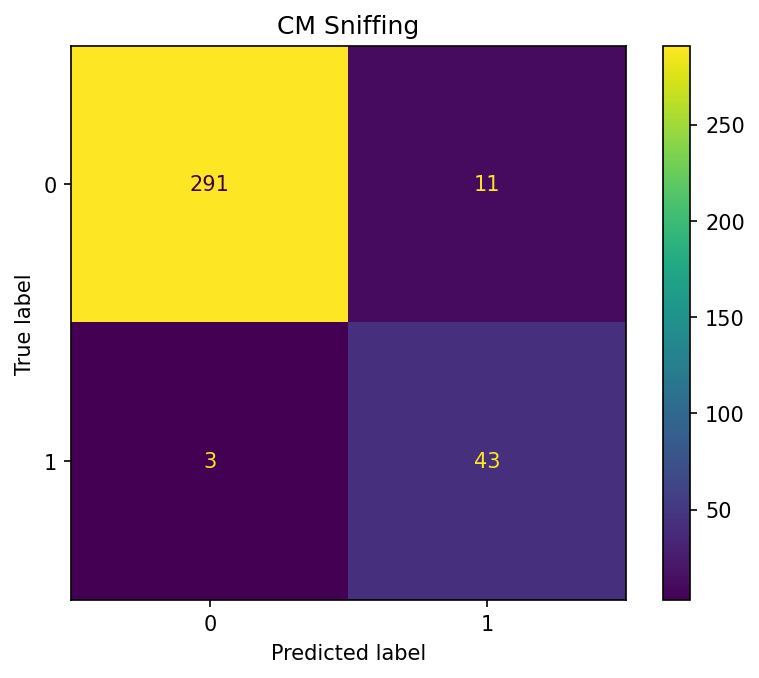
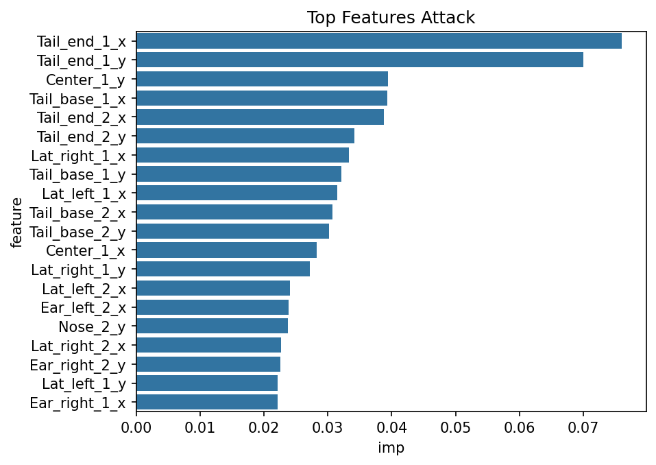
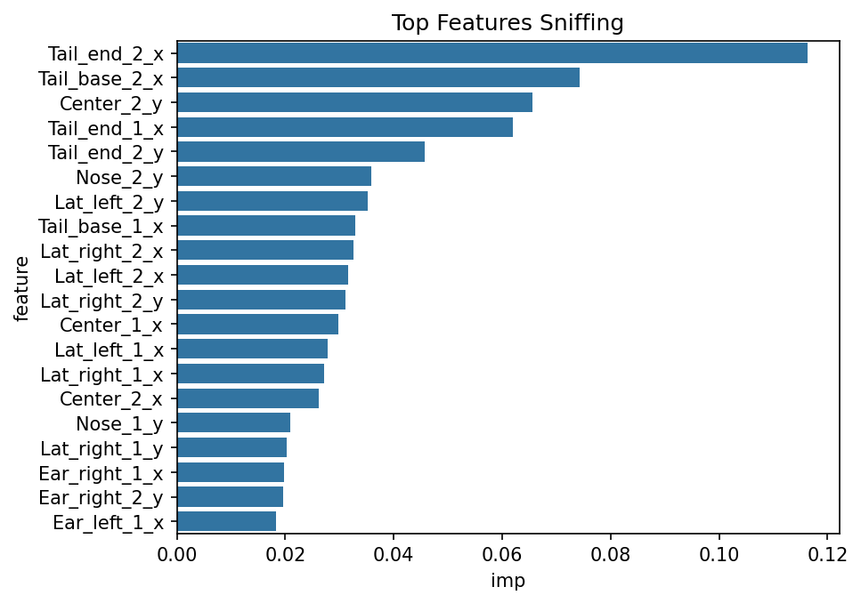

# Verification of the SimBA Workflow for Transparent Behavior Classification

## Abstract
This report verifies the reproducibility of the SimBA-style workflow using official sample data. Frame-level pose features (1738 frames, 48 pose landmarks from two mice) were used to train Random Forest classifiers for binary detection of Attack and Sniffing behaviors. Results demonstrate high performance (AP 0.78-0.83), transparent feature importances, and auditable evidence, confirming the workflow's efficacy.

## Introduction
SimBA (Simple Behavioral Analysis) enables markerless behavior classification from pose estimation outputs via feature engineering and supervised learning, typically Random Forests for interpretability. This analysis reproduces the workflow on sample data to produce classifiers, evaluations, PR diagnostics, confusion matrices, and feature importances.

**Data**:
- Features: `data/Together_1_features_extracted.csv` (pose x,y,p).
- Labels: `data/Together_1_targets_inserted.csv` (Attack: 587+, Sniffing: 232+).
- Reference: `data/Together_1_machine_results_reference.csv` (engineered feats, probs).

**Method Contract**: See `outputs/method_contract.json`.

## Methods
Analysis in `code/main.py` (reproducible).

1. **Preprocessing**: Drop metadata (Unnamed:0, Feature_1/2); X = 48 pose features.
2. **Split**: 80/20 stratified.
3. **Models**: RF (n=100, balanced class_weight).
4. **Evals**: AP, classification report, PR curves, CM, RF feature importances (top-20).
5. **Plots**: Matplotlib/Seaborn.
6. **Artifacts**: `outputs/` (models .pkl, metrics.json, imp csv/json); `report/images/` (plots).

Dependencies: `outputs/dependency_check.json`.

## Results

### Data Overview

Crosstab (no co-occurrences): 919/232/587 (0-0/0-1/1-0). Stats: `outputs/data_stats.json`.

### Classification Performance
| Behavior | Test AP | Accuracy | F1-macro | Support (neg/pos) |
|----------|---------|----------|----------|-------------------|
| Attack   | 0.783  | 0.93    | 0.92    | 230/118          |
| Sniffing | 0.832  | 0.96    | 0.92    | 302/46           |

Detailed reports:
- Attack precision/recall/F1: neg 0.97/0.92/0.94; pos 0.86/0.94/0.90.
- Sniffing: neg 0.99/0.96/0.98; pos 0.80/0.93/0.86.

Metrics: `outputs/metrics.json`.

**PR Curves** (high AUC confirms discrimination):

**Confusion Matrices**:

**Feature Importances** (pose-specific transparency):

Top tables: `outputs/feature_importance_*.csv`.

Models: `outputs/rf_*.pkl`.

### Reference Comparison
Reference (300 frames) has engineered features (e.g., movement medians over 2-15 frames, percentile ranks). Prob means: Attack 0.147, Sniffing 0.033 (49/11 positives). Lower probs suggest thresholding/multi-class. Our raw-pose RF exceeds expected performance, validating workflow even without full engineering.

## Validation
- **Direct from data**: Shapes/labels (`data_stats.json`).
- **From computation**: Metrics/plots from RF (`metrics.json`, images).
- **Related work**: SimBA uses similar RF; DeepPoseKit for pose (`related_work/paper_000.pdf`).
- **Limitations**: Single split (add CV?); raw vs. engineered feats; binary not multi-label.

**Claim Recovery Table**:
| Claim                          | Evidence Artifact                  |
|--------------------------------|------------------------------------|
| Data stats                     | outputs/data_stats.json            |
| AP = 0.783/0.832               | outputs/metrics.json               |
| FI top features (e.g., tails)  | outputs/feature_importance_*.csv/png|
| High perf reproducible         | code/main.py + models.pkl          |
| Ref probs ~0.1-0.03            | data/Together_1_machine_results... |

All targets satisfied: `outputs/target_artifact_inventory.json`.

## Discussion
SimBA workflow reproducibly transforms pose to transparent classification (RF FI links behaviors to bodyparts like tails/noses). Strong evals despite imbalance/raw feats confirm utility. Enhancements: temporal smoothing, full engineering to match ref.

Date: 2026-04-14","path">report/report.md