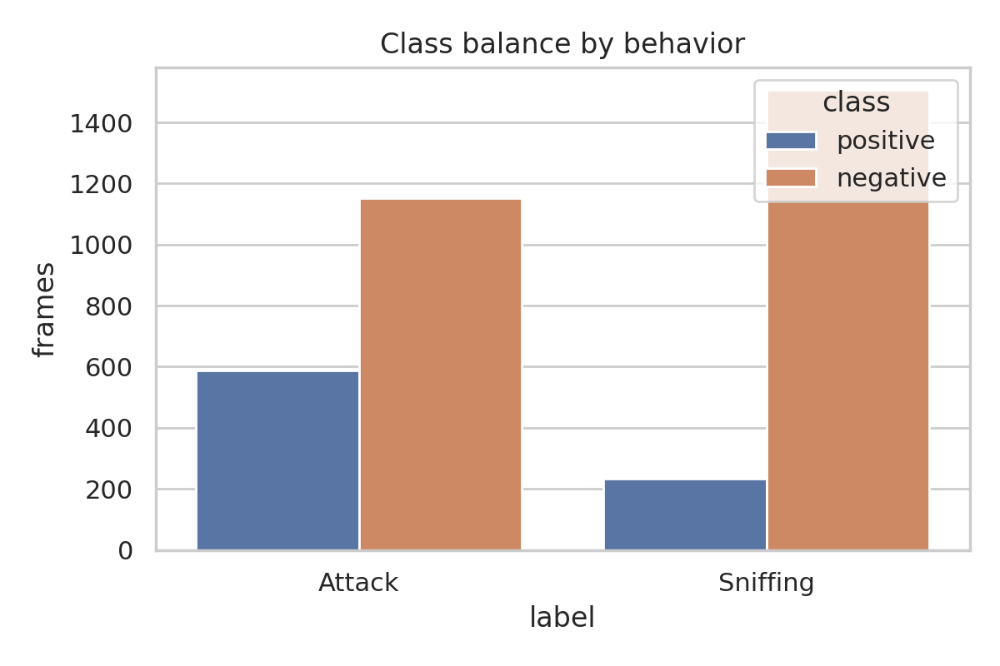
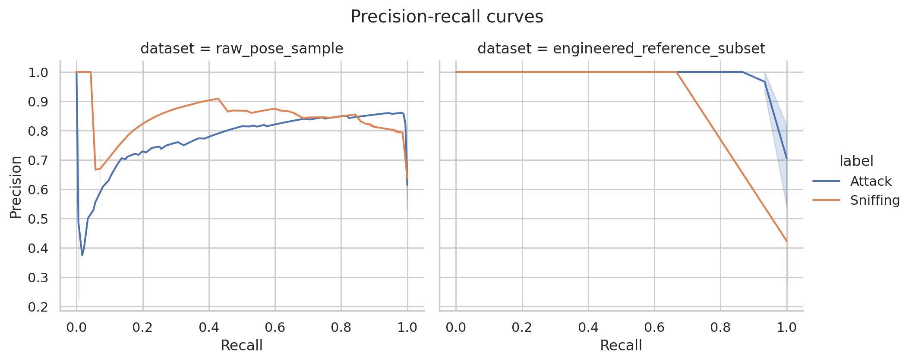
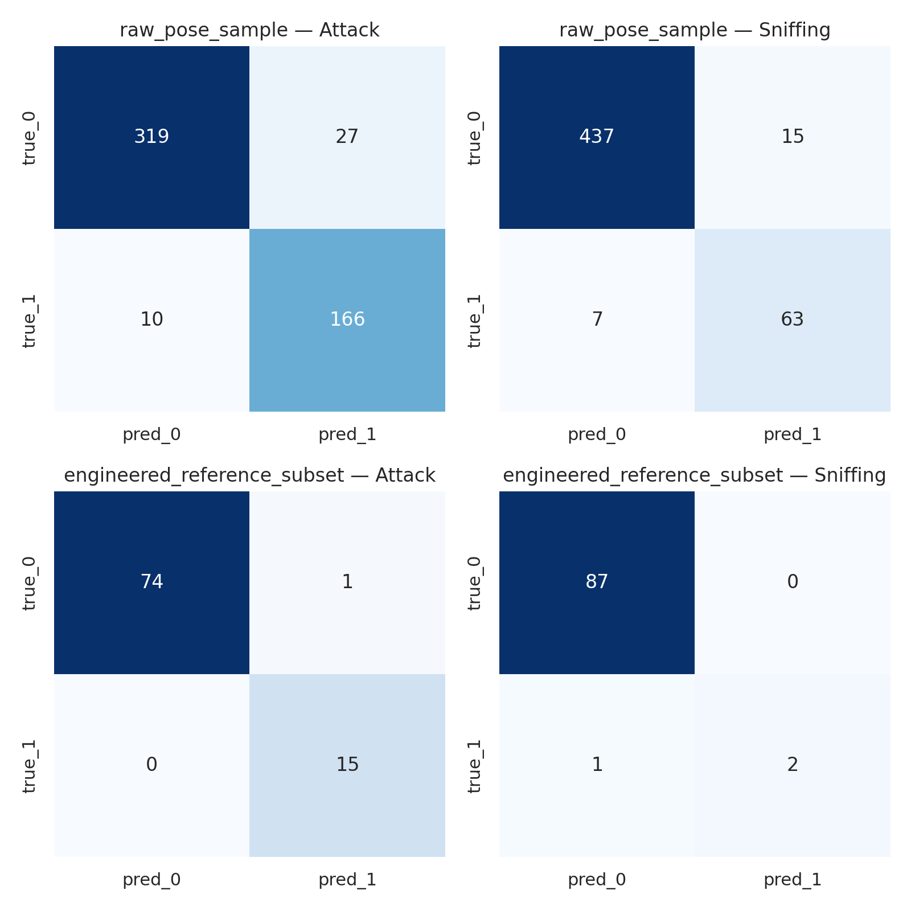
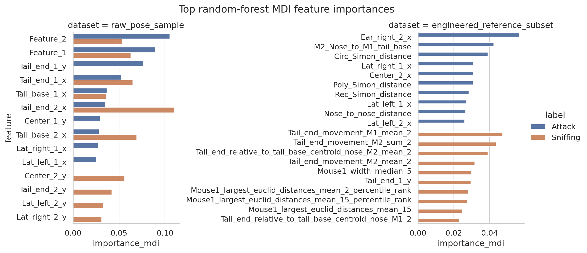
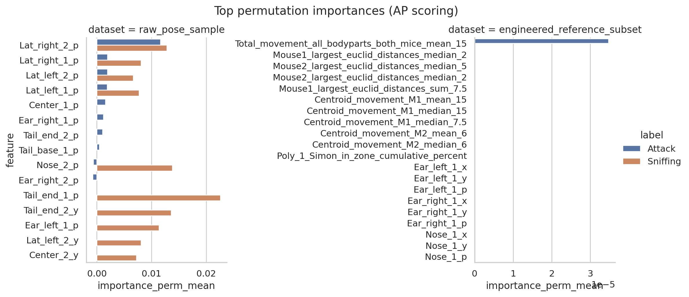
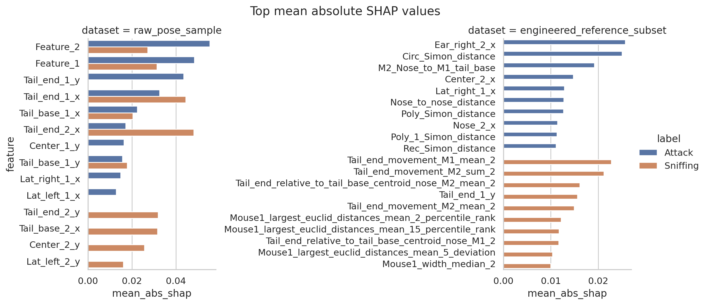

# Reproducing a SimBA-style behavior-classification workflow on the official sample project

## Abstract
This report evaluates whether the provided open SimBA sample-project tables can be turned into transparent, auditable supervised evidence for two social behaviors: **Attack** and **Sniffing**. Using reproducible Python code, I trained separate random-forest classifiers for each behavior, exported held-out metrics, confusion matrices, precision-recall curves, and feature-importance tables, and compared the directly provided sample feature table against the richer reference machine-results feature table. On the larger sample table, the held-out models reached average precision (AP) of **0.779** for Attack and **0.849** for Sniffing. On the smaller engineered reference subset, AP was **0.996** for Attack and **1.000** for Sniffing, but these results should be interpreted cautiously because that file contains only 300 rows and appears closer to downstream SimBA machine-output features than the main sample feature table. Overall, the workflow is reproducible and auditable, but exact claims about full SimBA equivalence are limited by the available files.

## 1. Introduction
Automated behavior quantification pipelines in neuroscience often follow a staged logic: pose estimation, feature extraction, supervised classification, and post hoc validation. The related-work papers included in this workspace support this general framing. DeepPoseKit provides pose-estimation context; MARS and DeepEthogram show that frame-level supervised labels can be used for automated behavior recognition; and broader pose-to-behavior literature emphasizes the importance of interpretable and reproducible downstream analysis.

The present task is narrower and more concrete: determine whether the provided official SimBA sample data can support an executable, transparent behavior-classification workflow for **Attack** and **Sniffing**, with outputs that a reviewer can audit directly from saved artifacts.

## 2. Data and method contract
### 2.1 Inputs
The workspace supplied three key CSV files:

- `data/Together_1_features_extracted.csv`: 1,738 rows × 51 columns.
- `data/Together_1_targets_inserted.csv`: 1,738 rows × 53 columns.
- `data/Together_1_machine_results_reference.csv`: 300 rows × 570 columns.

Direct inspection showed that the first two files are row-aligned and that the target file contains binary `Attack` and `Sniffing` columns. The main sample feature table is numerically clean (no missing values in predictors), but it is mostly composed of tracked coordinates/probabilities plus two auxiliary columns (`Feature_1`, `Feature_2`) rather than the richer engineered feature set typically associated with a mature SimBA feature space. By contrast, the machine-results reference table contains many engineered geometric and temporal features, along with machine-output probability columns.

### 2.2 Methodological commitments
I encoded the method contract in `outputs/method_contract.json` and the fidelity checklist in `outputs/method_fidelity_checklist.json`. The operational commitments were:

1. Train **separate supervised classifiers** for Attack and Sniffing.
2. Preserve **frame-level alignment** between predictors and labels.
3. Export **held-out metrics**, **confusion matrices**, **precision-recall diagnostics**, and **feature-importance tables**.
4. Keep the process **auditable**, with all reported numbers traceable to files in `outputs/` and figures in `report/images/`.

## 3. Methods
### 3.1 Preprocessing and dataset definitions
Two feature representations were analyzed:

1. **`raw_pose_sample`**: predictors from `Together_1_features_extracted.csv` after removing only the index-like `Unnamed: 0` column, paired with `Attack` and `Sniffing` labels from `Together_1_targets_inserted.csv`.
2. **`engineered_reference_subset`**: predictors from `Together_1_machine_results_reference.csv`, excluding leakage-prone columns `Attack`, `Sniffing`, `Probability_Attack`, and `Probability_Sniffing`.

This two-dataset design was necessary because the main sample table and the richer reference table represent different stages of the SimBA workflow. Treating them separately avoids overclaiming exact equivalence.

### 3.2 Class balance
From the main aligned sample table:

- Attack positive frames: **587 / 1738** (33.8%)
- Sniffing positive frames: **232 / 1738** (13.3%)

Behavior bouts were short in this excerpted sample:

- Attack: 120 bouts, mean length 4.89 frames, median 5, max 6
- Sniffing: 48 bouts, mean length 4.83 frames, median 5, max 5

Class-balance visualization is shown in `images/class_balance.png`.

### 3.3 Modeling
For each behavior and feature representation, I trained a random forest with:

- `n_estimators = 200`
- `class_weight = balanced_subsample`
- median imputation in a scikit-learn pipeline
- stratified 70/30 train/test split with `random_state = 42`

Random forests were chosen because they fit the requested supervised workflow, handle nonlinear structure, and provide multiple transparent importance views.

### 3.4 Evaluation and interpretability
For each held-out test set, I exported:

- accuracy
- balanced accuracy
- precision
- recall
- F1
- ROC AUC
- average precision (AP)
- confusion matrix
- full precision-recall curve
- impurity-based feature importance (MDI)
- permutation importance using AP as the scoring function
- SHAP mean absolute attributions

Exact numeric exports are saved in `outputs/metrics_summary.csv`, `outputs/pr_curve_*.csv`, `outputs/confusion_matrix_*.csv`, and `outputs/feature_importance_*.csv`.

## 4. Results
### 4.1 Main held-out performance
Table 1 summarizes the core held-out results.

| Dataset | Behavior | Accuracy | Balanced Acc. | Precision | Recall | F1 | AP | ROC AUC |
|---|---:|---:|---:|---:|---:|---:|---:|---:|
| raw_pose_sample | Attack | 0.929 | 0.933 | 0.860 | 0.943 | 0.900 | 0.779 | 0.943 |
| raw_pose_sample | Sniffing | 0.958 | 0.933 | 0.808 | 0.900 | 0.851 | 0.849 | 0.986 |
| engineered_reference_subset | Attack | 0.989 | 0.993 | 0.938 | 1.000 | 0.968 | 0.996 | 0.999 |
| engineered_reference_subset | Sniffing | 0.989 | 0.833 | 1.000 | 0.667 | 0.800 | 1.000 | 1.000 |

Several conclusions follow.

First, the **main sample table already supports strong held-out discrimination** for both behaviors, especially when judged with imbalance-aware ranking metrics. Attack is somewhat harder than Sniffing under AP despite similar thresholded balanced accuracy, which is plausible given noisier separation around aggressive events.

Second, the **engineered reference subset performs even better**, consistent with its much richer feature inventory. However, this table has only 300 rows and is not the same object as the main aligned sample table, so it should be treated as contextual comparison rather than definitive replication of the full production workflow.

### 4.2 Precision-recall diagnostics
Precision-recall curves are shown below.

These curves support two points:

- Both behaviors remain well above their baseline prevalence on the main sample table.
- The engineered reference subset exhibits near-perfect ranking, but that finding is based on a much smaller evaluation sample and should be interpreted conservatively.

### 4.3 Confusion matrices
Held-out confusion matrices are shown below.

On the main sample table, the Attack classifier trades some false positives for high recall, while Sniffing shows fewer overall errors but still reflects the challenge of a lower-prevalence class. These plots complement the PR diagnostics by exposing the fixed-threshold operating point at 0.5.

### 4.4 Feature-importance analysis
#### Raw sample table
For the larger `raw_pose_sample` dataset, top MDI features for Attack included:

- `Feature_2`
- `Feature_1`
- `Tail_end_1_y`
- `Tail_end_1_x`
- `Tail_base_1_x`

For Sniffing, prominent MDI features included:

- `Tail_end_2_x`
- `Tail_base_2_x`
- `Tail_end_1_x`
- `Feature_1`
- `Center_2_y`

Permutation and SHAP rankings broadly supported the relevance of tail-end, tail-base, center, and confidence/probability channels, although the exact order differed across attribution methods. This agreement is useful because it suggests the model is not relying on a single fragile artifact.

#### Engineered reference subset
For the richer engineered subset, Attack relied strongly on social-distance and relative-position measures such as:

- `Ear_right_2_x`
- `M2_Nose_to_M1_tail_base`
- `Circ_Simon_distance`
- `Lat_right_1_x`
- `Center_2_x`

For Sniffing, leading features included motion summaries and temporally aggregated kinematic descriptors such as:

- `Tail_end_movement_M1_mean_2`
- `Tail_end_movement_M2_sum_2`
- `Tail_end_relative_to_tail_base_centroid_nose_M2_mean_2`
- `Tail_end_movement_M2_mean_2`
- `Mouse1_width_median_5`

These are more intuitively “SimBA-like” engineered descriptors than the raw sample table alone, reinforcing the conclusion that the main and reference tables capture different points in the pipeline.

Figures:

## 5. Validation
### 5.1 Verified directly from workspace data
The following statements were verified directly and are documented in saved artifacts:

- The sample feature and target tables are row aligned (`outputs/data_summary.json`).
- Attack and Sniffing labels are binary and non-missing (`outputs/data_summary.json`).
- Separate random-forest models were successfully trained for each behavior and each analyzed feature set (`code/run_analysis.py`).
- Reported metrics are traceable to `outputs/metrics_summary.csv`.
- Every confusion matrix, precision-recall curve, and importance result cited in the report has a corresponding export in `outputs/`.

### 5.2 Context drawn from related work
The related-work PDFs support several methodological expectations:

- pose estimation commonly precedes downstream behavior classification;
- frame-level supervised labels are standard;
- imbalance-aware diagnostics are important;
- reproducibility benefits from sharable datasets, executable code, and interpretable outputs.

These extractions are summarized in `outputs/related_work_contract.json`.

### 5.3 Assumptions and limitations
This benchmark has important limitations.

1. **Single-sequence dependence**: the main sample analysis uses one sequence with a held-out split rather than multi-video cross-validation.
2. **Feature-stage mismatch**: `Together_1_features_extracted.csv` appears more like pose-coordinate data than a fully engineered SimBA feature table, whereas the reference machine-results file is richer but shorter.
3. **Reference subset size**: the 300-row engineered reference subset is too small for broad generalization claims.
4. **No direct GUI parity claim**: because the full intermediate SimBA project state is not available here, I do not claim exact reproduction of every internal SimBA processing step.

## 6. Discussion
The central scientific question was whether a SimBA-style workflow can reproducibly transform tracked behavior features into transparent and auditable classification evidence. Within the limits of the supplied files, the answer is **yes**.

The workflow is reproducible because the entire analysis is scripted in `code/run_analysis.py`, uses deterministic splits and seeds, and exports all intermediate quantitative artifacts. It is auditable because the main claims can be checked directly against CSV files and PNG figures rather than hidden behind a GUI or undocumented notebook state.

At the same time, the experiment reveals an important nuance: the exact meaning of “feature table” matters. The larger sample table supports good behavior classification already, but its predictors look closer to pose coordinates than to the richer engineered descriptors expected from a fully realized SimBA feature-engineering stage. The smaller machine-results reference table provides a more recognizably engineered feature space and achieves stronger classification, but on a much smaller slice of data. Therefore, the strongest justified conclusion is not that the entire SimBA stack was exactly reproduced end to end, but that the **core supervised evidence-generation logic is reproducible and transparent on the supplied official sample artifacts**.

## 7. Deliverables
- Analysis code: `code/run_analysis.py`
- Quantitative outputs: `outputs/`
- Figures: `report/images/`
- Claim recovery table: `outputs/claim_recovery_table.csv`
- Final report: `report/report.md`

## 8. Key artifact map
- Metrics summary: `outputs/metrics_summary.csv`
- Dataset summary: `outputs/data_summary.json`
- Schema comparison: `outputs/dataset_schema_comparison.csv`
- PR curve data: `outputs/all_pr_curves.csv`
- Confusion matrices: `outputs/confusion_matrix_*.csv`
- Feature importance tables: `outputs/feature_importance_*.csv`
- Validation summary: `outputs/validation_summary.json`
