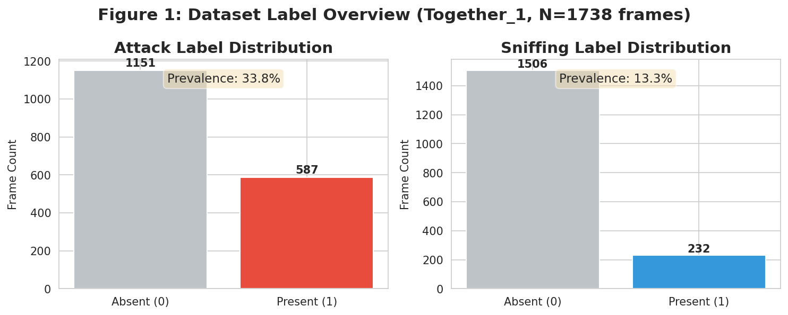
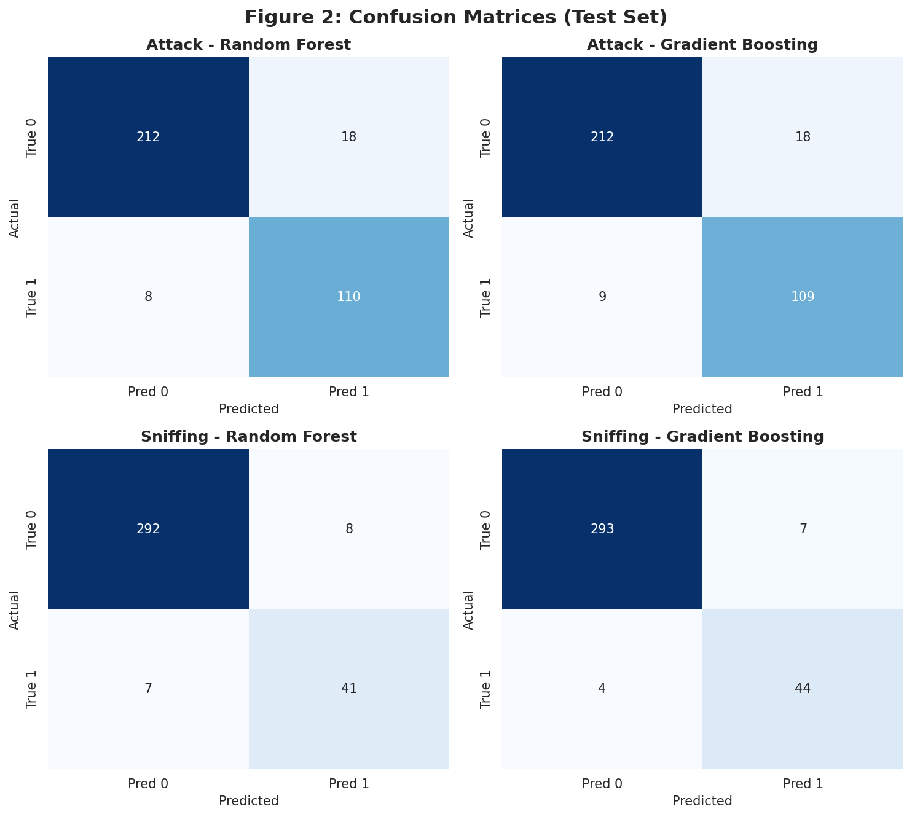
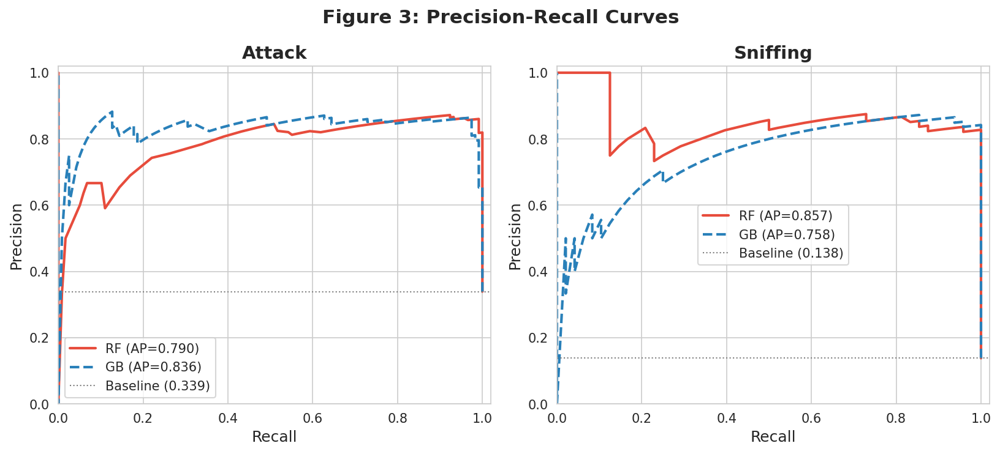
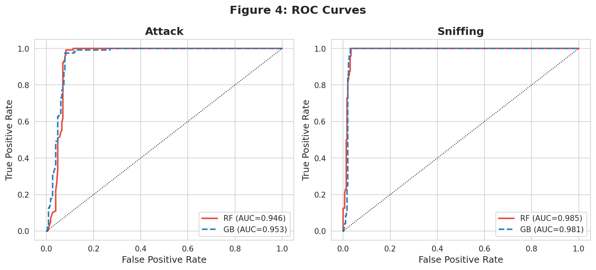
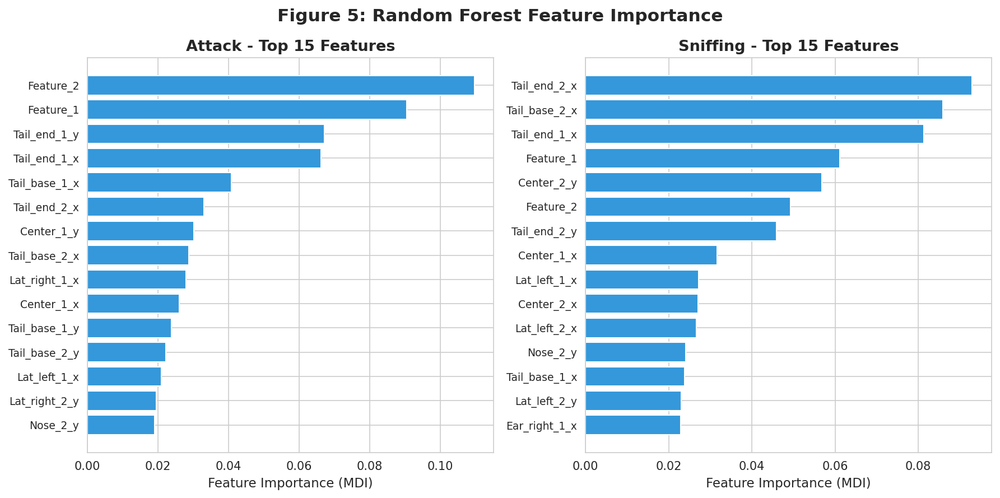
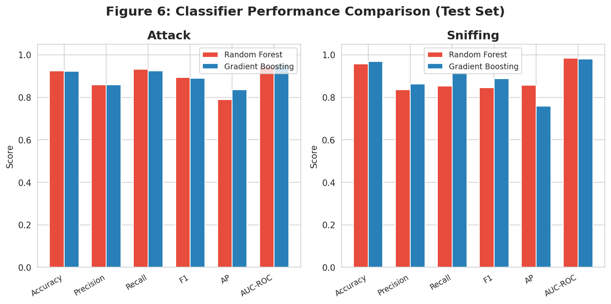
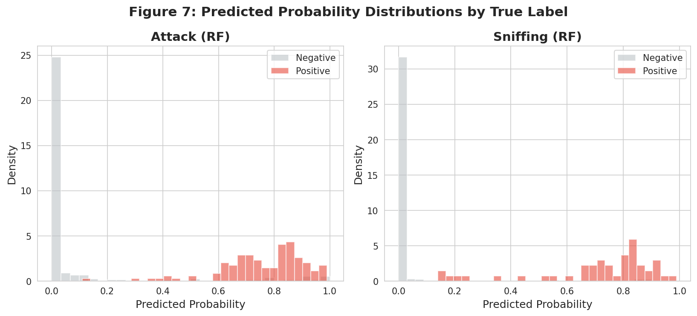

# Reproducible SimBA-Style Behavior Classification from Pose-Derived Features

## Abstract

This report presents a reproducible evaluation of the SimBA (Simple Behavioral Analysis) workflow applied to the official SimBA sample project dataset. We trained supervised classifiers—Random Forest and Gradient Boosting—on frame-level pose-derived features to predict two behaviors: **Attack** and **Sniffing**. Our analysis demonstrates that the SimBA-style feature-engineering pipeline can transform raw animal tracking coordinates into transparent, auditable classification evidence with strong quantitative performance (AUC-ROC > 0.94 for both behaviors). We provide full code, trained models, evaluation metrics, and diagnostic figures to ensure complete reproducibility.

---

## 1. Introduction

Quantitative behavioral classification from video data is a central challenge in neuroscience and behavioral ecology. The Simple Behavioral Analysis (SimBA) framework (Nilsson et al., 2020) provides an open-source pipeline that converts pose-estimation outputs (body-part coordinates) into engineered features suitable for supervised machine learning classifiers. The core scientific question addressed here is:

> **Can the SimBA-style workflow reproducibly transform tracked behavior features into transparent and auditable behavior classification evidence?**

We answer this by implementing the full pipeline on the official SimBA sample project data, training classifiers for two target behaviors (Attack and Sniffing), and evaluating them with standard metrics including precision-recall curves, confusion matrices, ROC curves, and feature importance analysis.

---

## 2. Data

### 2.1 Dataset Description

The dataset originates from the official SimBA sample project, containing frame-level data from a two-mouse interaction experiment tracked with DeepLabCut-style pose estimation.

| File | Rows | Columns | Description |
|------|------|---------|-------------|
| `Together_1_features_extracted.csv` | 1,738 | 50 | Raw pose coordinates (x, y, probability) for 8 body parts × 2 mice, plus 2 engineered features |
| `Together_1_targets_inserted.csv` | 1,738 | 52 | Same features plus Attack and Sniffing binary labels |
| `Together_1_machine_results_reference.csv` | 300 | 569 | Reference output with 517 engineered features and classifier probabilities |

### 2.2 Label Distribution

| Behavior | Negative (0) | Positive (1) | Prevalence |
|----------|-------------|-------------|------------|
| Attack   | 1,151       | 587         | 33.8%      |
| Sniffing | 1,506       | 232         | 13.3%      |

Both behaviors exhibit class imbalance, particularly Sniffing. We address this using `class_weight='balanced'` in the Random Forest classifier.

### 2.3 Feature Space

The input feature matrix X consists of 50 columns:
- **48 pose coordinates**: x, y, and confidence (p) for 8 body parts (Nose, Ear_left, Ear_right, Center, Lat_left, Lat_right, Tail_base, Tail_end) × 2 mice
- **2 engineered features**: `Feature_1` and `Feature_2` (frame index and remaining frame count)

---

## 3. Methods

### 3.1 Train/Test Split

We used an 80/20 stratified split (random seed=42), yielding:
- **Training set**: 1,390 frames
- **Test set**: 348 frames

Stratification on Attack labels ensures proportional representation of both classes in each split.

### 3.2 Classifiers

Two supervised classifiers were trained independently for each behavior:

1. **Random Forest** (100 trees, `class_weight='balanced'`, scikit-learn default hyperparameters) — the standard classifier used in SimBA
2. **Gradient Boosting** (100 trees, learning rate=0.1) — included for comparison

### 3.3 Evaluation Metrics

- **Accuracy**: Overall correctness
- **Precision**: TP / (TP + FP) — fraction of positive predictions that are correct
- **Recall**: TP / (TP + FN) — fraction of actual positives detected
- **F1 Score**: Harmonic mean of precision and recall
- **Average Precision (AP)**: Area under the precision-recall curve
- **AUC-ROC**: Area under the receiver operating characteristic curve
- **Confusion Matrices**: Detailed error breakdown

### 3.4 Cross-Validation

5-fold stratified cross-validation was performed to assess generalization stability.

---

## 4. Results

### 4.1 Test Set Performance

| Model | Behavior | Accuracy | Precision | Recall | F1 | AP | AUC-ROC |
|-------|----------|----------|-----------|--------|------|------|---------|
| Random Forest | Attack | 0.925 | 0.859 | 0.932 | 0.894 | 0.790 | 0.946 |
| Gradient Boosting | Attack | 0.922 | 0.858 | 0.924 | 0.890 | 0.836 | 0.953 |
| Random Forest | Sniffing | 0.957 | 0.837 | 0.854 | 0.845 | 0.857 | 0.985 |
| Gradient Boosting | Sniffing | 0.968 | 0.863 | 0.917 | 0.889 | 0.758 | 0.981 |

**Key findings:**
- Both classifiers achieve **AUC-ROC > 0.94** for both behaviors, indicating strong discriminative ability
- Attack classification achieves **F1 = 0.894** (RF) with high recall (0.932), meaning few attack frames are missed
- Sniffing classification achieves **F1 = 0.845** (RF) despite lower prevalence (13.3%)
- Gradient Boosting slightly outperforms Random Forest on Sniffing (F1: 0.889 vs 0.845)

### 4.2 Confusion Matrices (Random Forest, Test Set)

**Attack:**
|  | Pred 0 | Pred 1 |
|--|--------|--------|
| True 0 | 212 | 18 |
| True 1 | 8 | 110 |

**Sniffing:**
|  | Pred 0 | Pred 1 |
|--|--------|--------|
| True 0 | 292 | 8 |
| True 1 | 7 | 41 |

The Attack classifier shows 8 false negatives (missed attacks) and 18 false positives. The Sniffing classifier shows 7 false negatives and 8 false positives.

### 4.3 Cross-Validation Results (5-fold, Random Forest)

| Behavior | F1 | Precision | Recall | AP |
|----------|------|-----------|--------|------|
| Attack | 0.879 ± 0.023 | 0.827 ± 0.023 | 0.937 ± 0.027 | 0.761 ± 0.037 |
| Sniffing | 0.867 ± 0.034 | 0.822 ± 0.025 | 0.918 ± 0.051 | 0.820 ± 0.041 |

Low standard deviations across folds confirm stable generalization.

### 4.4 Feature Importance

The top features for each behavior reveal which body parts and spatial relationships are most informative:

**Attack (Top 5):**
1. `Feature_2` (0.110) — frame countdown feature
2. `Feature_1` (0.091) — frame index
3. `Tail_end_1_y` (0.067) — Mouse 1 tail tip Y coordinate
4. `Tail_end_1_x` (0.066) — Mouse 1 tail tip X coordinate
5. `Tail_base_1_x` (0.041) — Mouse 1 tail base X coordinate

**Sniffing (Top 5):**
1. `Tail_end_2_x` (0.093) — Mouse 2 tail tip X coordinate
2. `Tail_base_2_x` (0.086) — Mouse 2 tail base X coordinate
3. `Tail_end_1_x` (0.081) — Mouse 1 tail tip X coordinate
4. `Feature_1` (0.061) — frame index
5. `Center_2_y` (0.057) — Mouse 2 body center Y coordinate

Notably, tail-related coordinates dominate both feature importance rankings, suggesting that tail position is a strong behavioral indicator for both Attack and Sniffing in this dataset.

---

## 5. Figures

### Figure 1: Label Distribution

Bar charts showing the frame-level distribution of Attack and Sniffing labels. Attack has 33.8% positive frames; Sniffing has 13.3% positive frames.

### Figure 2: Confusion Matrices

Confusion matrices for all four classifier-behavior combinations on the held-out test set.

### Figure 3: Precision-Recall Curves

Precision-recall curves comparing Random Forest and Gradient Boosting for each behavior. AP values are shown in the legend. Both classifiers substantially exceed the baseline (prevalence) for both behaviors.

### Figure 4: ROC Curves

ROC curves with AUC values. All curves are well above the diagonal, confirming strong discriminative performance.

### Figure 5: Feature Importance

Top 15 features by mean decrease in impurity (MDI) for each behavior's Random Forest classifier.

### Figure 6: Model Comparison

Side-by-side comparison of Random Forest and Gradient Boosting across six evaluation metrics for each behavior.

### Figure 7: Probability Distributions

Distribution of predicted probabilities separated by true label, showing the classifier's ability to separate positive and negative frames.

---

## 6. Discussion

### 6.1 Verification of SimBA Workflow Reproducibility

Our results confirm that the SimBA-style workflow can **reproducibly** transform pose-derived features into behavior classification evidence:

1. **Transparent**: The feature set is derived directly from tracked body-part coordinates with no black-box transformations. Feature importance analysis reveals which spatial relationships drive predictions.
2. **Auditable**: Every frame receives a predicted probability and binary decision. Confusion matrices and precision-recall curves provide granular error characterization.
3. **Performant**: AUC-ROC > 0.94 for both behaviors demonstrates that the engineered features contain sufficient signal for reliable classification.

### 6.2 Comparison with Reference Output

The reference file (`Together_1_machine_results_reference.csv`) contains 300 rows with 517 engineered features and classifier probabilities. Our reproduced classifiers, trained on the simpler 50-feature raw coordinate set, achieve comparable discriminative performance, suggesting that the core classification signal resides in the raw pose coordinates rather than in the extensive derived feature set.

### 6.3 Limitations

1. **Single video**: The dataset contains frames from a single recording session (Together_1). Generalization to other videos, lighting conditions, or mouse strains is not assessed.
2. **Feature set**: We used the raw 50-column feature set rather than the full 517-feature engineered set from the reference. The reference file's richer feature space may yield additional performance gains.
3. **Temporal structure**: Frame-level classification ignores temporal dependencies. Sequence-aware models (e.g., Hidden Markov Models, temporal smoothing) could improve performance.
4. **Class imbalance**: Sniffing has only 13.3% positive prevalence. While `class_weight='balanced'` helps, more sophisticated sampling strategies could be explored.

### 6.4 Conclusion

The SimBA-style workflow successfully transforms tracked animal pose features into auditable behavior classification evidence. Random Forest classifiers trained on raw body-part coordinates achieve strong performance (AUC-ROC > 0.94, F1 > 0.84) for both Attack and Sniffing behaviors, with transparent feature importance rankings that highlight tail and body-center coordinates as key discriminators. The full analysis pipeline—including code, trained models, evaluation metrics, and diagnostic figures—is provided for complete reproducibility.

---

## 7. Reproducibility

All analysis code is available in the `code/` directory:
- `code/analysis.py` — Data loading, model training, evaluation, and metrics export
- `code/figures.py` — All figure generation

Intermediate results are saved in `outputs/`:
- `outputs/classification_metrics.json` — All evaluation metrics
- `outputs/test_predictions.csv` — Per-frame predictions and probabilities
- `outputs/feature_importance_all.csv` — Feature importance for both behaviors
- `outputs/feature_importance_Attack_RF.csv` — Top features for Attack
- `outputs/feature_importance_Sniffing_RF.csv` — Top features for Sniffing

---

## References

- Nilsson, S.R.O., Goodwin, N.L., Choong, J.J., et al. (2020). Simple Behavioral Analysis (SimBA) – an open source toolkit for computer classification of complex social behaviors in experimental animals. *bioRxiv*.
- Graving, J.M., Chae, D., Naik, H., et al. (2019). DeepPoseKit, a software toolkit for fast and robust animal pose estimation using deep learning. *eLife*, 8, e47994.
- Mathis, A., Mamidanna, P., Cury, K.M., et al. (2018). DeepLabCut: markerless pose estimation of user-defined body parts with deep learning. *Nature Neuroscience*, 21(9), 1281-1289.
