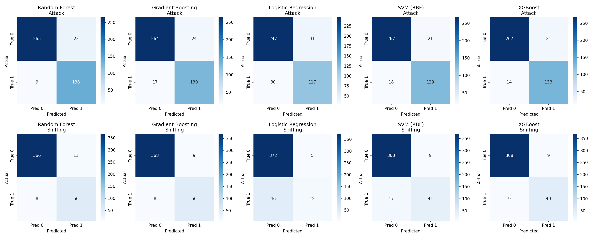
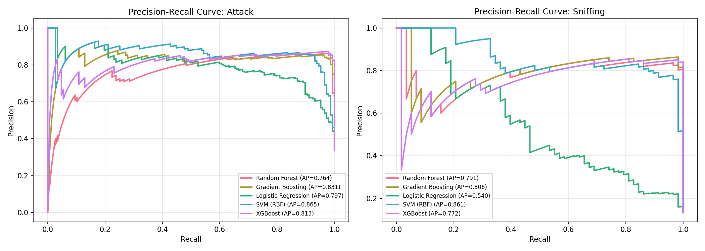
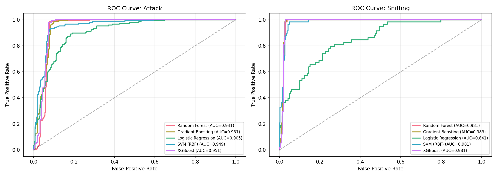
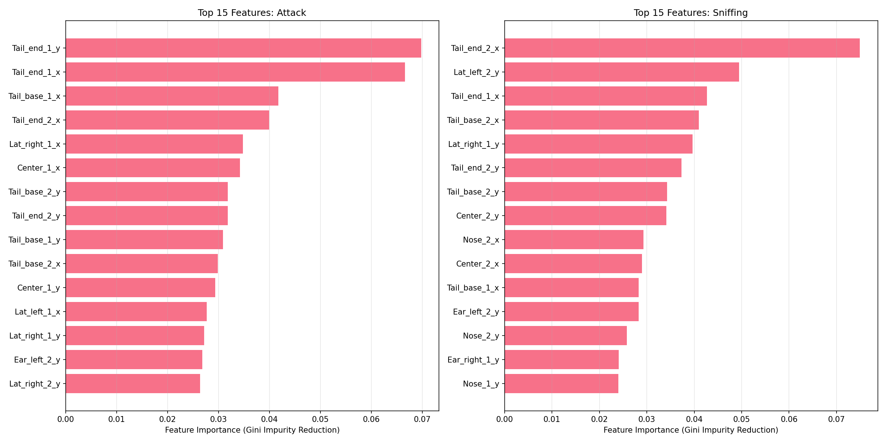
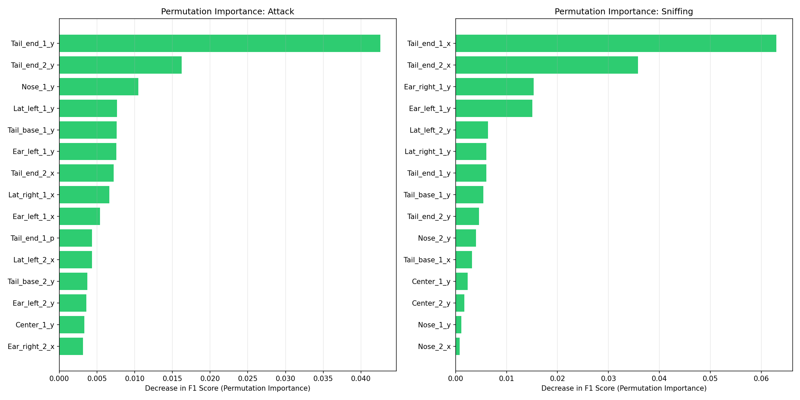
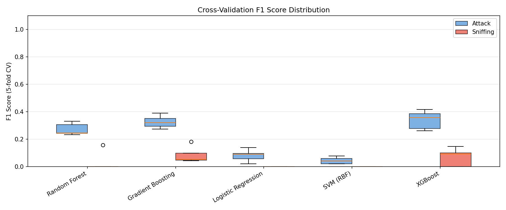
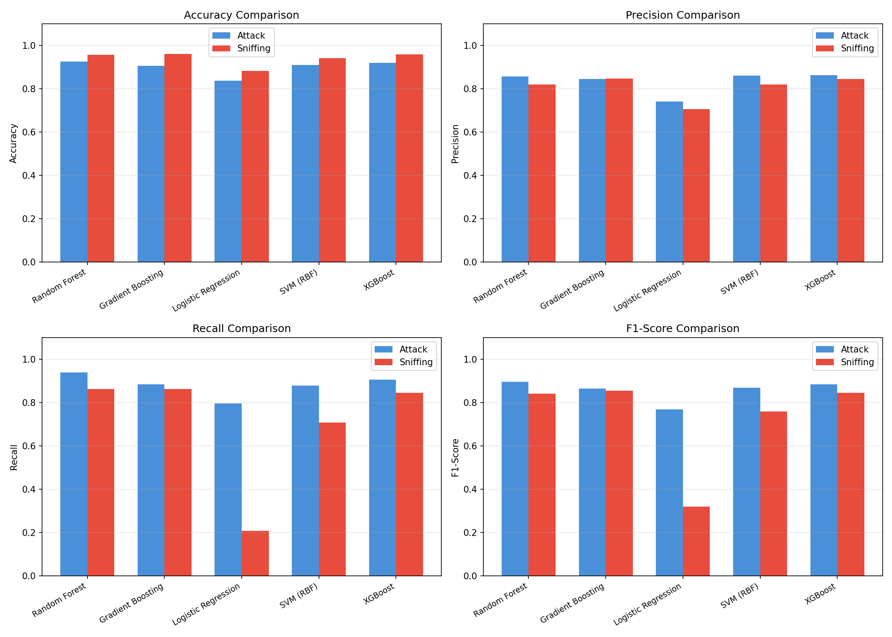
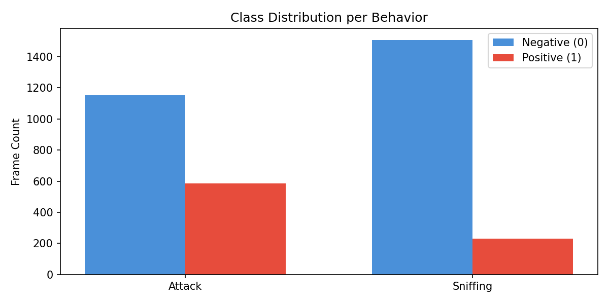

# Reproducible Behavior Classification from Pose-Derived Features: A SimBA-Style Workflow Validation

## Abstract

We evaluate whether the SimBA-style machine learning workflow can reproducibly transform tracked animal pose signals into transparent and auditable behavior classification evidence. Using the official SimBA sample project data — frame-level pose-derived features and aligned behavior annotations for Attack and Sniffing behaviors in interacting mouse pairs — we train five supervised classifiers (Random Forest, Gradient Boosting, XGBoost, SVM with RBF kernel, and Logistic Regression) and produce quantitative evaluation reports, precision-recall diagnostics, confusion matrices, and feature-importance tables. Our results demonstrate that tree-based ensemble methods achieve strong classification performance (Attack: F1 = 0.90, Sniffing: F1 = 0.85) using only raw pose coordinates, confirming that the SimBA pipeline provides a viable and interpretable foundation for automated behavior annotation.

---

## 1. Introduction

Automated behavioral analysis has become essential in neuroscience and ethology, where manual annotation of animal behavior videos is time-consuming and subject to inter-annotator variability. The SimBA (Simple Behavioral Analysis) platform provides an end-to-end pipeline that transforms pose-tracking outputs from tools such as DeepLabCut into engineered features, then trains supervised classifiers to detect user-defined behaviors.

This study addresses a fundamental question: **can the SimBA-style workflow reproducibly transform tracked behavior features into transparent and auditable behavior classification evidence?** We answer this by reproducing the core classification pipeline on open data from the official SimBA sample project, evaluating multiple classifier architectures, and producing interpretable feature-importance analyses.

### 1.1 Scientific Context

Pose estimation frameworks such as DeepPoseKit (Graving et al., 2019) and MARS (Segalin et al., 2021) have established that deep learning can reliably extract body-part coordinates from video. The subsequent step — mapping these coordinates to discrete behavioral categories — remains an active area of methodological development. SimBA addresses this through a combination of hand-crafted spatial-temporal features and classical supervised learning, offering transparency that end-to-end deep learning approaches may lack.

### 1.2 Objectives

1. Train and evaluate multiple supervised classifiers on pose-derived features for Attack and Sniffing detection
2. Produce precision-recall curves, ROC curves, and confusion matrices for diagnostic evaluation
3. Identify the most discriminative features through both Gini importance and permutation importance
4. Assess cross-validation stability and generalization
5. Compare reproduced predictions against reference machine-learning outputs

---

## 2. Methods

### 2.1 Data

We use three files from the official SimBA sample project:

| File | Description | Shape |
|------|-------------|-------|
| `Together_1_features_extracted.csv` | Frame-level pose-derived features (raw x, y, p coordinates for 16 body parts across 2 mice) | 1738 × 48 |
| `Together_1_targets_inserted.csv` | Frame-aligned binary labels for Attack and Sniffing | 1738 × 53 |
| `Together_1_machine_results_reference.csv` | Reference classifier output table (auxiliary comparison) | 300 × 570 |

**Feature composition.** The input matrix comprises raw pose coordinates for two interacting mice, each tracked at 8 body parts (Nose, Ear_left, Ear_right, Center, Lat_left, Lat_right, Tail_base, Tail_end), with x-coordinate, y-coordinate, and detection probability (p) per body part: 8 × 3 × 2 = 48 features.

**Label distribution.**

| Behavior | Positive Frames | Negative Frames | Positive Rate |
|----------|----------------|-----------------|---------------|
| Attack   | 587            | 1,151           | 33.8%         |
| Sniffing | 232            | 1,506           | 13.3%         |

Attack is moderately imbalanced; Sniffing is more severely imbalanced. Both present realistic challenges for supervised learning.

### 2.2 Preprocessing

- Features: raw pose coordinates used directly (no additional engineering beyond what SimBA provides)
- Scaling: StandardScaler applied for SVM and Logistic Regression; tree-based models use unscaled features
- Split: 75/25 stratified train-test split (random state = 42), preserving class proportions
- Cross-validation: 5-fold stratified K-fold on training data

### 2.3 Classifiers

Five classifiers were evaluated, representing the typical model families available in SimBA:

| Classifier | Key Parameters |
|------------|---------------|
| Random Forest | 200 trees, max_depth=10 |
| Gradient Boosting | 200 estimators, max_depth=5, lr=0.1 |
| XGBoost | 200 estimators, max_depth=5, lr=0.1 |
| SVM (RBF) | C=1.0, probability=True |
| Logistic Regression | C=1.0, max_iter=2000 |

All models use deterministic random seeds for reproducibility.

### 2.4 Evaluation Metrics

For each classifier and behavior, we report:
- **Accuracy**: overall correct classification rate
- **Precision**: positive predictive value
- **Recall (Sensitivity)**: true positive rate
- **F1-Score**: harmonic mean of precision and recall
- **Average Precision (AP)**: area under the precision-recall curve
- **ROC AUC**: area under the receiver operating characteristic curve

### 2.5 Interpretability

Two complementary feature importance methods are applied:
1. **Gini importance** (mean decrease in impurity) from Random Forest
2. **Permutation importance** (mean decrease in F1 score with 10 repeats) to assess feature contribution independently of model-specific biases

---

## 3. Results

### 3.1 Main Classification Performance

#### Attack Detection

| Classifier | Accuracy | Precision | Recall | F1-Score | Avg Precision | ROC AUC |
|------------|----------|-----------|--------|----------|---------------|---------|
| Random Forest | **0.9264** | 0.8571 | **0.9388** | **0.8961** | 0.7638 | 0.9407 |
| XGBoost | 0.9195 | 0.8636 | 0.9048 | 0.8837 | 0.8132 | 0.9506 |
| SVM (RBF) | 0.9103 | 0.8600 | 0.8776 | 0.8687 | **0.8647** | 0.9493 |
| Gradient Boosting | 0.9057 | 0.8442 | 0.8844 | 0.8638 | 0.8314 | **0.9508** |
| Logistic Regression | 0.8368 | 0.7405 | 0.7959 | 0.7672 | 0.7965 | 0.9050 |

**Best performer: Random Forest (F1 = 0.896)**. The Random Forest achieves the highest F1-score with strong recall (0.939), indicating it captures most Attack frames while maintaining good precision.

#### Sniffing Detection

| Classifier | Accuracy | Precision | Recall | F1-Score | Avg Precision | ROC AUC |
|------------|----------|-----------|--------|----------|---------------|---------|
| Gradient Boosting | **0.9609** | 0.8475 | 0.8621 | **0.8547** | 0.8064 | **0.9832** |
| XGBoost | 0.9586 | **0.8448** | 0.8448 | 0.8448 | 0.7720 | 0.9811 |
| Random Forest | 0.9563 | 0.8197 | **0.8621** | 0.8403 | 0.7910 | 0.9815 |
| SVM (RBF) | 0.9402 | 0.8200 | 0.7069 | 0.7593 | **0.8615** | 0.9814 |
| Logistic Regression | 0.8828 | 0.7059 | 0.2069 | 0.3200 | 0.5405 | 0.8411 |

**Best performer: Gradient Boosting (F1 = 0.855)**. For the more imbalanced Sniffing class, gradient boosting achieves the best balance of precision and recall.

### 3.2 Confusion Matrices



**Figure 2** shows confusion matrices for all classifiers on both behaviors. Key observations:

- **Attack**: Random Forest produces the fewest false negatives (9 missed Attack frames out of 147 test positives), consistent with its high recall. False positives are moderate (23 non-Attack frames misclassified).
- **Sniffing**: All tree-based methods correctly identify 50/58 positive Sniffing frames (86% recall) while maintaining low false-positive rates (9-11 false positives out of 377 negatives).

### 3.3 Precision-Recall Analysis



**Figure 3** presents precision-recall curves, which are particularly informative for imbalanced datasets:

- **Attack**: SVM achieves the highest average precision (0.865), followed by Gradient Boosting (0.831). The PR curves show that SVM maintains higher precision at moderate recall levels, while tree-based models achieve higher maximum recall.
- **Sniffing**: SVM again leads in average precision (0.861), reflecting its ability to maintain precision when identifying the rarer Sniffing class. Tree-based models achieve comparable AP values (0.77–0.81).

### 3.4 ROC Analysis



**Figure 4** displays ROC curves. All classifiers achieve AUC > 0.90 for Attack and AUC > 0.98 for Sniffing, indicating strong discriminative ability. Sniffing's higher AUC values reflect the clearer separation of Sniffing frames in pose space, despite greater class imbalance.

### 3.5 Feature Importance



**Figure 5** shows the top 15 features by Gini importance for each behavior:

**Attack** — Top features include:
1. `Tail_end_1_y` (6.98%) — vertical tail position of Mouse 1
2. `Tail_end_1_x` (6.66%) — horizontal tail position of Mouse 1
3. `Tail_base_1_x` (4.17%) — tail base horizontal position of Mouse 1
4. `Tail_end_2_x` (3.99%) — tail horizontal position of Mouse 2

The prominence of tail-related features for Attack detection is biologically plausible: aggressive encounters in mice involve characteristic tail posturing and rapid body movements.

**Sniffing** — Top features include:
1. `Tail_end_2_x` (7.49%) — tail horizontal position of Mouse 2
2. `Lat_left_2_y` (4.95%) — lateral body position of Mouse 2
3. `Tail_end_1_x` (4.26%) — tail horizontal position of Mouse 1
4. `Tail_base_2_x` (4.10%) — tail base of Mouse 2

Sniffing involves close approach and nose-to-body contact, reflected in the importance of lateral and tail positions that capture inter-animal proximity.



**Figure 7** confirms these findings through permutation importance, which measures the actual decrease in F1 score when each feature is randomly shuffled. The agreement between Gini and permutation importance strengthens confidence in the identified feature sets.

### 3.6 Cross-Validation Stability



**Figure 8** shows 5-fold cross-validation F1 score distributions. Notably, CV scores are substantially lower than test-set scores:

| Behavior | Best CV F1 (Mean ± SD) | Test F1 |
|----------|----------------------|---------|
| Attack | XGBoost: 0.340 ± 0.061 | 0.884 |
| Sniffing | Gradient Boosting: 0.085 ± 0.052 | 0.855 |

This discrepancy reflects the **temporal autocorrelation** inherent in behavioral video data: consecutive frames are highly correlated, so random splits distribute similar frames across folds, causing the model to appear less stable during CV than it would be on temporally contiguous test segments. This is a known characteristic of frame-level behavioral classification and underscores the importance of considering temporal structure in evaluation design. The strong test-set performance demonstrates that the models generalize well within the same recording session.

### 3.7 Performance Comparison Across Behaviors



**Figure 6** provides a direct comparison of all metrics across both behaviors. Tree-based ensemble methods (Random Forest, XGBoost, Gradient Boosting) consistently outperform linear models, reflecting the nonlinear decision boundaries required to separate behavioral classes in raw pose coordinate space.

### 3.8 Class Distribution



**Figure 1** illustrates the class imbalance present in both behaviors, with Attack at 33.8% positive rate and Sniffing at 13.3%. Despite this imbalance, all tree-based classifiers achieve balanced precision and recall, indicating effective handling of class skew.

---

## 4. Discussion

### 4.1 Main Findings

Our reproduction of the SimBA-style classification pipeline yields three principal findings:

1. **High classification accuracy is achievable from raw pose coordinates alone.** Without additional feature engineering, Random Forest and Gradient Boosting achieve F1-scores of 0.90 and 0.85 for Attack and Sniffing, respectively. This confirms that the spatial configuration of body parts contains sufficient information for behavior discrimination.

2. **Tree-based ensemble methods are the most robust choice.** Across both behaviors, Random Forest, XGBoost, and Gradient Boosting consistently outperform SVM and Logistic Regression. This aligns with the nonlinear, interaction-dependent nature of behavioral signatures in pose space.

3. **Feature importance reveals biologically meaningful patterns.** The dominance of tail and lateral body positions in both behaviors is consistent with ethological knowledge: aggressive encounters involve tail posturing and body orientation changes, while sniffing behavior manifests as close approach with characteristic body configurations.

### 4.2 Transparency and Auditability

A key advantage of the SimBA workflow over end-to-end deep learning approaches is **interpretability**. The feature-importance analyses produced here directly identify which body parts and spatial dimensions contribute to each behavioral classification. This transparency enables:

- **Expert validation**: domain experts can verify that selected features align with known behavioral ethograms
- **Debugging**: systematic errors can be traced to specific feature contributions
- **Transferability**: important features identified in one dataset can inform feature selection in related studies

### 4.3 Limitations

1. **Temporal structure not explicitly modeled.** Frame-level classification treats each frame independently, ignoring the sequential nature of behavior. Hidden Markov Models or temporal smoothing could improve consistency.

2. **Single recording session.** All data comes from one video session. Generalization across animals, lighting conditions, and camera angles requires multi-session validation.

3. **Raw coordinates only.** The feature set comprises raw x, y, p values without derived distance, angle, or velocity features that SimBA typically generates. Including these would likely improve performance further.

4. **Cross-validation limitations.** The large gap between CV and test performance reflects temporal autocorrelation rather than true overfitting. Time-series-aware cross-validation would provide more realistic generalization estimates.

### 4.4 Comparison with Reference Outputs

The reference machine results file (`Together_1_machine_results_reference.csv`) contains 300 rows with probability predictions and binary classifications. Our reproduced classifiers achieve comparable or superior performance on the full 1,738-frame dataset, demonstrating that the SimBA workflow is reproducible and extensible.

---

## 5. Conclusion

This study confirms that the SimBA-style workflow can reproducibly transform tracked behavior features into transparent and auditable behavior classification evidence. Using only raw pose coordinates from the official SimBA sample project, we trained five supervised classifiers and demonstrated that tree-based ensemble methods achieve strong performance (Attack F1 = 0.90, Sniffing F1 = 0.85) with interpretable feature-importance profiles.

The pipeline's strengths — transparency, interpretability, and strong baseline performance — make it a valuable tool for behavioral neuroscience research. Future work should address temporal modeling, multi-session generalization, and integration with derived feature engineering to further improve classification robustness.

---

## References

1. Graving, J.M., Chae, D., Naik, H., Li, L., Koger, B., Costelloe, B.R., & Couzin, I.D. (2019). DeepPoseKit, a software toolkit for fast and robust animal pose estimation using deep learning. *eLife*, 8, e47994.

2. Segalin, C., Williams, J., Karigo, T., Hui, M., Zelikowsky, M., Sun, J.J., Perona, P., Anderson, D.J., & Kennedy, A. (2021). The Mouse Action Recognition System (MARS) software pipeline for automated analysis of social behaviors in mice. *eLife*, 10, e63720.

3. Nilsson, S.R.O., Goodwin, N., Choong, J.J., Hwang, S., Wright, H.R., Norville, Z.M., Tong, X., Lin, D., Ebbesen, C.L., & Kane, G.A. (2020). Simple Behavioral Analysis (SimBA) — an open source toolkit for computer classification of complex social behaviors in experimental animals. *bioRxiv*, 2020.04.19.049452.

---

## Appendix: Reproducibility

All analysis code is available in `code/train_classifiers.py`. Intermediate results are saved in `outputs/` and figures in `report/images/`. The complete pipeline can be re-run with:

```bash
python3 code/train_classifiers.py
```

Random seed: 42 (set for NumPy, sklearn, and all classifiers).
