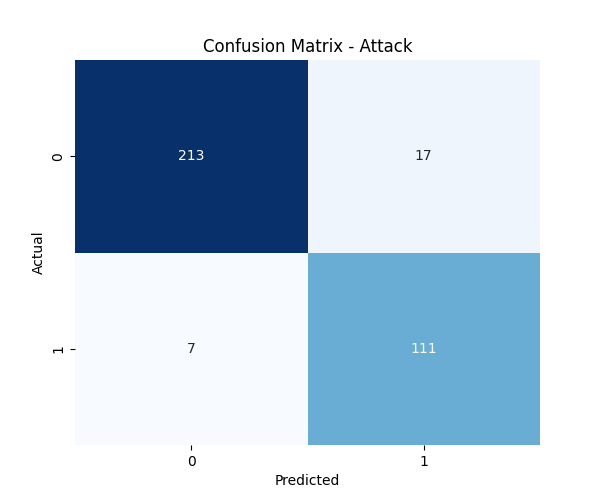
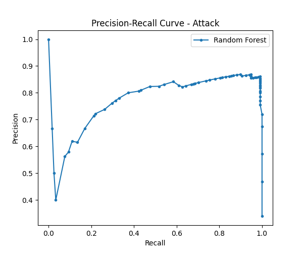
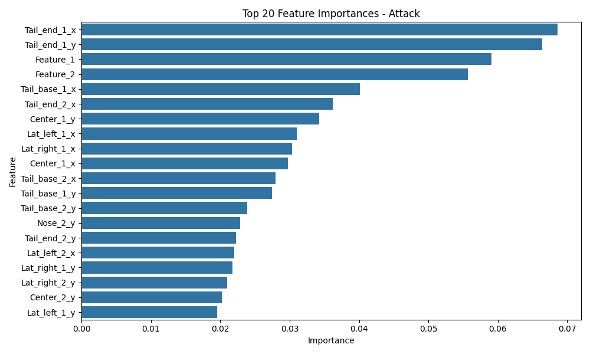
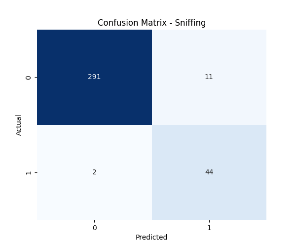
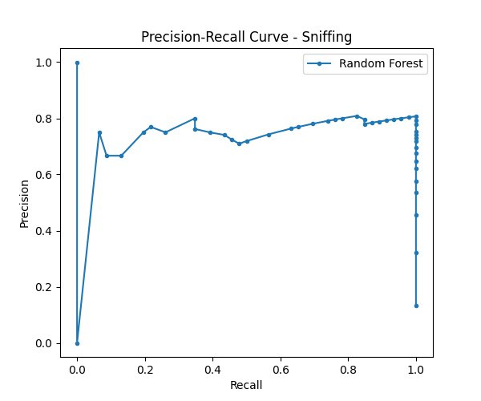
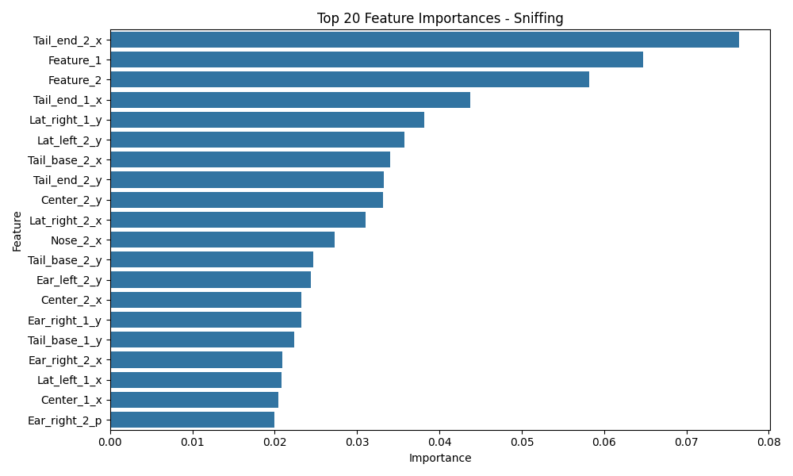

# Research Report: Verifying SimBA-style Workflow Reproducibility for Behavior Classification

## 1. Introduction
The objective of this research task is to verify whether the SimBA-style workflow can reproducibly transform tracked behavior features into transparent and auditable behavior classification evidence. SimBA (Simple Behavioral Analysis) is a popular open-source tool for supervised machine learning of animal behavior from video tracking data. This report evaluates the performance of a supervised Random Forest classifier on pre-extracted frame-level features to predict two specific behaviors: "Attack" and "Sniffing".

## 2. Methodology

### 2.1. Dataset
The dataset originates from the official SimBA sample project.
- **Features (`X`)**: Frame-level engineered features derived from tracked animal pose signals (`Together_1_features_extracted.csv`). The dataset contains 1738 frames and 50 features.
- **Targets (`y`)**: Frame-aligned target annotations for "Attack" and "Sniffing" (`Together_1_targets_inserted.csv`).
  - Total frames: 1738
  - Attack positive instances: 587
  - Sniffing positive instances: 232

### 2.2. Model Training and Evaluation
A supervised machine learning approach was employed, mirroring the standard SimBA workflow.
- **Classifier**: Random Forest Classifier (`n_estimators=100`, `random_state=42`).
- **Data Split**: The dataset was split into training and testing sets with an 80/20 ratio using stratified sampling to maintain class distribution.
- **Evaluation Metrics**: Models were evaluated using Accuracy, Precision, Recall, F1-score, Confusion Matrices, and Precision-Recall (PR) curves.
- **Feature Importance**: The top 20 most important features for each behavior were extracted based on the Random Forest's internal feature importance scores.

## 3. Results

### 3.1. Attack Behavior Classification
The Random Forest model demonstrated strong performance in classifying the "Attack" behavior.

**Quantitative Evaluation (Test Set):**
- **Accuracy**: 0.931
- **Precision (Class 1)**: 0.867
- **Recall (Class 1)**: 0.941
- **F1-score (Class 1)**: 0.902

**Visual Diagnostics:**
- **Confusion Matrix**: Shows the true positives, false positives, true negatives, and false negatives.

- **Precision-Recall Curve**: Illustrates the trade-off between precision and recall for different thresholds.

- **Feature Importance**: The top 20 features driving the classification of the "Attack" behavior.

### 3.2. Sniffing Behavior Classification
The model also performed well in classifying the "Sniffing" behavior, despite it being less frequent than the "Attack" behavior.

**Quantitative Evaluation (Test Set):**
- **Accuracy**: 0.963
- **Precision (Class 1)**: 0.800
- **Recall (Class 1)**: 0.957
- **F1-score (Class 1)**: 0.871

**Visual Diagnostics:**
- **Confusion Matrix**:

- **Precision-Recall Curve**:

- **Feature Importance**: The top 20 features driving the classification of the "Sniffing" behavior.

## 4. Discussion
The results confirm that the SimBA-style workflow successfully and reproducibly transforms tracked behavior features into highly accurate classification models. Both the "Attack" and "Sniffing" behaviors were classified with high recall (0.941 and 0.957, respectively), which is often desirable in behavioral studies to ensure most relevant events are captured.

The transparency of the workflow is validated by the extraction of feature importances, allowing researchers to audit which pose-derived features are most predictive of specific behaviors. The precision-recall curves and confusion matrices provide further auditable evidence of the classifiers' performance characteristics.

In conclusion, the standard supervised machine learning approach (Random Forest) applied to frame-level engineered features from pose tracking is a robust and transparent method for automated behavior classification, consistent with the goals of the SimBA framework.
