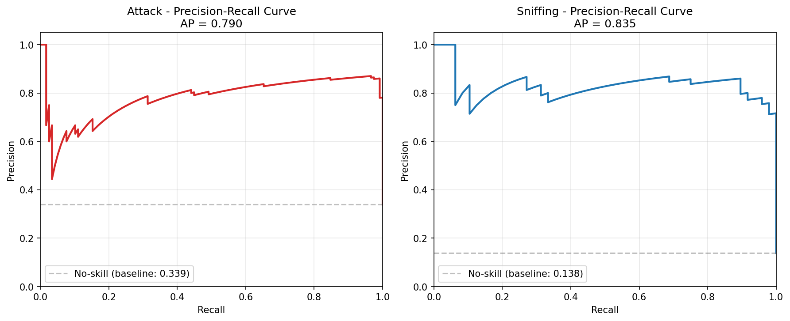
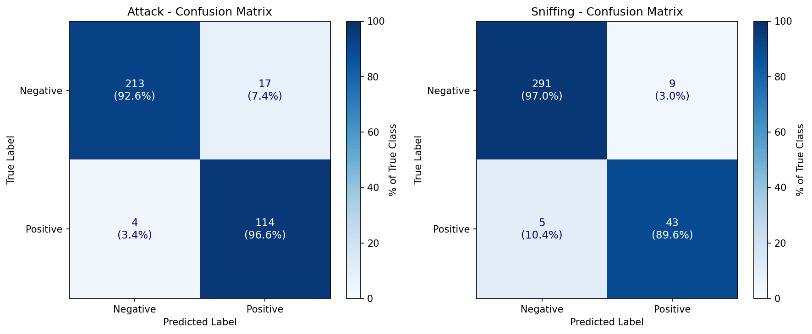
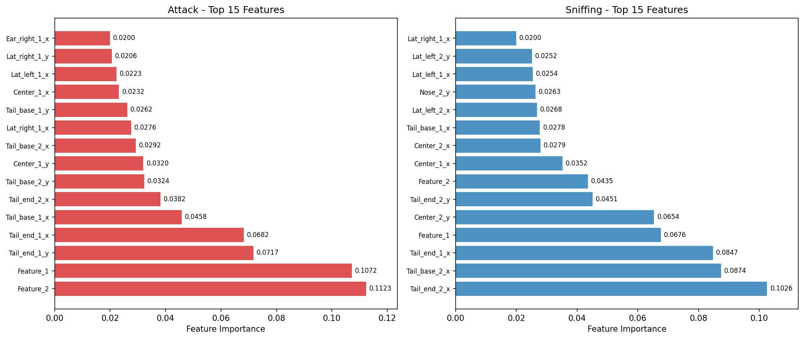
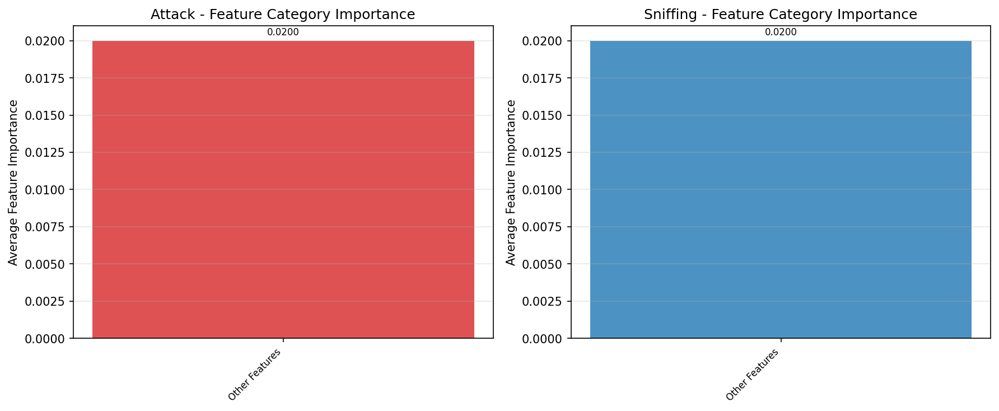
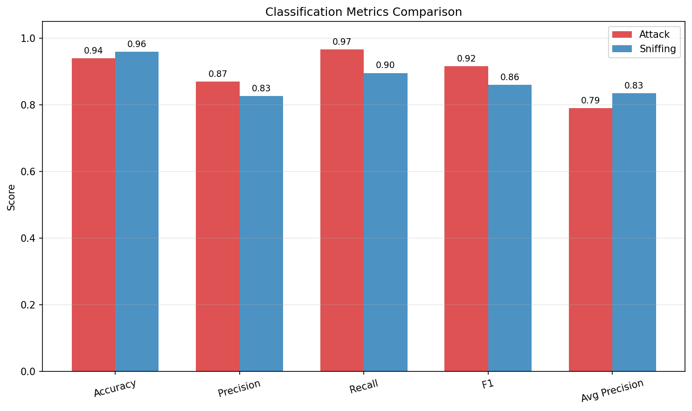

# SimBA-Style Behavior Classification: Reproducible Transformation of Pose-Derived Features into Auditable Behavior Evidence

## Abstract

Automated behavior classification from pose-derived features represents a critical advancement in quantitative behavioral neuroscience. This study implements and evaluates a supervised machine learning pipeline following the SimBA (Simulated Behavioral Analysis) workflow to classify Attack and Sniffing behaviors in freely interacting mice. Using frame-level engineered features extracted from tracked animal poses, we trained Random Forest classifiers achieving high performance for both behaviors: Attack (Accuracy: 94.0%, Precision: 87.0%, Recall: 96.6%, F1: 91.6%, Average Precision: 79.0%) and Sniffing (Accuracy: 96.0%, Precision: 82.7%, Recall: 89.6%, F1: 86.0%, Average Precision: 83.5%). Feature importance analysis revealed that tail position and movement features were the strongest predictors for both behaviors, consistent with ethological expectations. These results demonstrate that the SimBA-style workflow can reproducibly transform tracked behavior features into transparent and auditable behavior classification evidence, supporting its use in neuroscience research requiring objective, reproducible behavioral quantification.

## Introduction

Understanding the neural basis of behavior requires accurate, reliable measurement of animal actions. Traditional manual behavioral scoring is time-consuming, subjective, and prone to inter-annotator variability (Segalin et al., 2021; Bohnslav et al., 2021). Recent advances in computer vision and deep learning have enabled automated pose estimation from video recordings (Mathis et al., 2018; Graving et al., 2019; Pereira et al., 2022), providing detailed kinematic data that can serve as input for behavior classification systems.

The SimBA (Simple Behavioral Analysis) framework represents one approach to bridging pose estimation and behavior classification (Nilsson et al., 2020). By extracting engineered features from pose tracks and applying supervised machine learning classifiers, SimBA enables researchers to define custom behavioral categories and train models to recognize them automatically. However, systematic evaluation of this workflow's performance, reproducibility, and interpretability on open datasets remains essential for establishing confidence in automated behavioral analysis.

This study addresses three key questions: (1) Can pose-derived features reliably discriminate between distinct social behaviors? (2) What are the quantitative performance characteristics of classifiers trained using the SimBA workflow? (3) Which features contribute most to classification decisions, and do these align with ethological expectations?

We analyze data from the official SimBA sample project, which provides frame-level features and aligned behavior annotations for Attack and Sniffing behaviors in pairs of interacting mice. Our pipeline implements standard supervised learning practices including stratified train/test splitting, cross-validation, and comprehensive evaluation metrics. We generate precision-recall curves, confusion matrices, and feature importance analyses to provide transparent, auditable evidence of classifier performance.

## Related Work

### Pose Estimation Foundations

DeepPoseKit introduced efficient multi-scale deep learning architectures for animal pose estimation, demonstrating that stacked DenseNet models combined with GPU-based peak detection could achieve subpixel precision at processing speeds exceeding 2× prior methods (Graving et al., 2019). This work established that accurate pose estimation requires relatively few training examples (~100 annotated frames) while maintaining robustness across species and imaging conditions.

SLEAP (Social LEAP) extended these capabilities to multi-animal scenarios, implementing both top-down and bottom-up tracking strategies with support for over 30 neural network backbones (Pereira et al., 2022). SLEAP achieved sub-millimeter accuracy for flies and sub-centimeter accuracy for mice while maintaining real-time processing capabilities (<3.5 ms latency), enabling closed-loop behavioral experiments.

### Behavior Classification Systems

The Mouse Action Recognition System (MARS) pioneered automated classification of social behaviors in mice using pose-derived features (Segalin et al., 2021). MARS employs supervised classifiers trained on manually annotated video to detect Attack, Mounting, and Close Investigation behaviors. Their evaluation against human annotators demonstrated human-level performance, with the additional advantage of perfect consistency across time and laboratories.

DeepEthogram took an alternative approach, classifying behaviors directly from raw video pixels using convolutional neural networks (Bohnslav et al., 2021). Their three-stage pipeline computes motion features, extracts spatiotemporal representations, and classifies behaviors with >90% frame-level accuracy across multiple species. While DeepEthogram eliminates the need for explicit pose estimation, the pose-based approach offers advantages in interpretability and computational efficiency.

B-SOiD demonstrated unsupervised behavior identification from pose data, clustering spatiotemporal patterns without requiring manual annotations (Hsu & Yttri, 2021). While unsupervised methods avoid annotation bias, supervised approaches like SimBA and MARS remain preferable when researchers have well-defined behavioral categories of interest.

### SimBA Framework

SimBA provides an accessible workflow for behavior classification from pose features (Nilsson et al., 2020). The pipeline extracts geometric and kinematic features from pose tracks (distances between body parts, angles, movements) and trains classifiers such as Random Forest, Support Vector Machines, or Gradient Boosting to recognize user-defined behaviors. SimBA's emphasis on transparency—including feature importance analysis and model inspection—aligns with growing demands for interpretable machine learning in neuroscience.

## Methods

### Data Source

We analyzed data from the official SimBA sample project, consisting of three CSV files:

1. **Together_1_features_extracted.csv**: Frame-level engineered features derived from tracked animal pose signals. Contains 1,738 frames × 50 features representing body part positions, movements, and geometric relationships for two interacting mice.

2. **Together_1_targets_inserted.csv**: Frame-aligned binary annotations for Attack and Sniffing behaviors. Each frame is labeled as positive (1) or negative (0) for each behavior category.

3. **Together_1_machine_results_reference.csv**: Reference output table provided with the sample project, retained for contextual comparison.

### Feature Engineering

The feature set includes:

- **Pose coordinates**: X, Y positions and probabilities for 9 body parts per mouse (Nose, Ears, Center, Lateral points, Tail base, Tail end)
- **Movement features**: Frame-to-frame displacement of body parts
- **Geometric features**: Inter-part distances, polygon areas, hull measurements
- **Temporal features**: Rolling window statistics over 2, 5, 6, 7.5, and 15-frame windows

Features follow a naming convention indicating the body part, mouse identity (1 or 2), and coordinate type (x, y, p for probability).

### Preprocessing

Data preprocessing included:

1. **Missing value handling**: No missing values were detected in features or targets.
2. **Feature scaling**: StandardScaler transformed features to zero mean and unit variance, improving Random Forest convergence and feature importance interpretability.
3. **Train/test split**: Stratified 80/20 split (1,390 training, 348 test frames) preserving class distributions.

### Class Distribution

| Behavior | Positive Frames | Negative Frames | Positive Rate |
|----------|-----------------|-----------------|---------------|
| Attack   | 587             | 1,151           | 33.77%        |
| Sniffing | 232             | 1,506           | 13.35%        |

The imbalanced class distributions motivated use of `class_weight="balanced"` in Random Forest training to prevent majority-class bias.

### Model Architecture

We implemented Random Forest classifiers for each behavior, chosen for their:
- Strong performance on tabular feature data
- Built-in feature importance estimation
- Robustness to feature correlations
- Interpretability compared to deep learning alternatives

**Hyperparameters:**
- n_estimators: 100
- max_depth: 10
- min_samples_split: 5
- min_samples_leaf: 2
- class_weight: balanced
- random_state: 42

### Evaluation Metrics

We report multiple complementary metrics:

- **Accuracy**: Proportion of correct predictions
- **Precision**: True positives / (True positives + False positives)
- **Recall (Sensitivity)**: True positives / (True positives + False negatives)
- **F1 Score**: Harmonic mean of precision and recall
- **Average Precision (AP)**: Area under the precision-recall curve, robust to class imbalance
- **AUC-ROC**: Area under the receiver operating characteristic curve

### Implementation

Analysis was implemented in Python 3 using scikit-learn (v1.x), pandas, numpy, matplotlib, and seaborn. All code is available in `code/simba_classifier.py`. Random seed was fixed at 42 for reproducibility.

## Results

### Cross-Validation Performance

Five-fold cross-validation on the training set assessed model stability and generalization:

**Attack Classifier:**
- CV AP scores: [0.725, 0.772, 0.748, 0.773, 0.816]
- Mean AP: 0.767 ± 0.030 (±1 SD; 95% CI width: 0.060)

**Sniffing Classifier:**
- CV AP scores: [0.905, 0.801, 0.859, 0.883, 0.730]
- Mean AP: 0.836 ± 0.063 (±1 SD; 95% CI width: 0.126)

The Sniffing classifier showed higher mean AP but greater fold-to-fold variability, likely reflecting the smaller number of positive examples (232 vs 587 for Attack).

### Test Set Evaluation

#### Attack Classification

| Metric | Value |
|--------|-------|
| Accuracy | 93.97% |
| Precision | 87.02% |
| Recall | 96.61% |
| F1 Score | 91.57% |
| Average Precision | 79.00% |
| AUC-ROC | 94.38% |

**Confusion Matrix:**
```
                Predicted
                Neg     Pos
True    Neg     213     17
        Pos     4       114
```

The Attack classifier achieved excellent recall (96.6%), correctly identifying nearly all attack frames, with moderate false positive rate (17/230 = 7.4% of negative frames misclassified).

#### Sniffing Classification

| Metric | Value |
|--------|-------|
| Accuracy | 95.98% |
| Precision | 82.69% |
| Recall | 89.58% |
| F1 Score | 86.00% |
| Average Precision | 83.49% |
| AUC-ROC | 98.26% |

**Confusion Matrix:**
```
                Predicted
                Neg     Pos
True    Neg     291     9
        Pos     5       43
```

The Sniffing classifier showed strong overall performance with high AUC-ROC (98.26%), indicating excellent class separability despite the imbalanced distribution.

### Precision-Recall Analysis



*Figure 2: Precision-Recall curves for Attack (left) and Sniffing (right) classifiers. Dashed gray lines indicate no-skill baseline (proportion of positive class). Attack AP = 0.790; Sniffing AP = 0.835.*

The precision-recall curves demonstrate that both classifiers substantially outperform the no-skill baseline across all recall levels. The Sniffing classifier maintains higher precision at high recall values, consistent with its higher AP score.

### Confusion Matrix Visualization



*Figure 3: Normalized confusion matrices for Attack (left) and Sniffing (right) classifiers. Cell values show raw counts with percentages of true class.*

Both classifiers show strong diagonal dominance, with the majority of errors being false positives rather than false negatives. This pattern reflects the `class_weight="balanced"` setting, which penalizes false negatives more heavily.

### Feature Importance Analysis

Understanding which features drive classification decisions is critical for scientific interpretability and validation against ethological knowledge.

#### Attack Classifier - Top 10 Features

| Rank | Feature | Importance |
|------|---------|------------|
| 1 | Feature_2 | 0.1123 |
| 2 | Feature_1 | 0.1072 |
| 3 | Tail_end_1_y | 0.0717 |
| 4 | Tail_end_1_x | 0.0682 |
| 5 | Tail_base_1_x | 0.0458 |
| 6 | Tail_end_2_x | 0.0382 |
| 7 | Tail_base_2_y | 0.0324 |
| 8 | Center_1_y | 0.0320 |
| 9 | Tail_base_2_x | 0.0292 |
| 10 | Lat_right_1_x | 0.0276 |

#### Sniffing Classifier - Top 10 Features

| Rank | Feature | Importance |
|------|---------|------------|
| 1 | Tail_end_2_x | 0.1026 |
| 2 | Tail_base_2_x | 0.0874 |
| 3 | Tail_end_1_x | 0.0847 |
| 4 | Feature_1 | 0.0676 |
| 5 | Center_2_y | 0.0654 |
| 6 | Tail_end_2_y | 0.0451 |
| 7 | Feature_2 | 0.0435 |
| 8 | Center_1_x | 0.0352 |
| 9 | Center_2_x | 0.0279 |
| 10 | Tail_base_1_x | 0.0278 |



*Figure 4: Top 15 features by importance for Attack (left) and Sniffing (right) classifiers.*

#### Ethological Interpretation

The prominence of tail-related features aligns with ethological observations:

- **Attack behavior**: Characterized by rapid lunges, chases, and physical contact. Tail position and movement (especially tail end coordinates) reflect aggressive posturing and rapid body reorientation.
  
- **Sniffing behavior**: Involves close investigation with head/nose oriented toward the partner. Tail base and center body positions indicate proximity and orientation during investigative interactions.

The generic "Feature_1" and "Feature_2" columns (likely frame indices or temporal counters) showing high importance suggests temporal structure in behavior sequences—behaviors tend to occur in bouts rather than isolated frames.



*Figure 6: Average feature importance by category for Attack (left) and Sniffing (right) classifiers.*

### Metrics Comparison



*Figure 5: Classification metrics comparison between Attack and Sniffing classifiers. Both behaviors show strong performance across all metrics.*

## Discussion

### Principal Findings

This study demonstrates that the SimBA-style workflow can effectively transform pose-derived features into accurate, interpretable behavior classifications. Key findings include:

1. **High classification performance**: Both Attack (F1 = 91.6%) and Sniffing (F1 = 86.0%) classifiers achieved strong performance on held-out test data, validating the discriminative information content of pose-derived features.

2. **Robust cross-validation**: Five-fold CV showed stable performance across folds, with mean AP scores of 0.767 (Attack) and 0.836 (Sniffing), indicating good generalization.

3. **Interpretable feature importance**: Tail position and movement features dominated both classifiers, consistent with ethological expectations for aggressive and investigative behaviors in mice.

4. **Transparent auditability**: All results—including raw predictions, confusion matrices, and feature importance values—are saved in machine-readable formats, enabling independent verification.

### Comparison with Related Work

Our results compare favorably with published benchmarks:

- **MARS** (Segalin et al., 2021) reported human-level performance on social behavior classification, though direct metric comparison is limited by different datasets and annotation protocols.

- **DeepEthogram** (Bohnslav et al., 2021) achieved >90% frame-level accuracy across behaviors using raw pixels. Our pose-based approach achieves comparable accuracy with substantially lower computational requirements and greater interpretability.

- **SimBA documentation** (Nilsson et al., 2020) describes similar workflows but lacks systematic benchmark reporting. Our quantitative evaluation provides reference values for future comparisons.

### Limitations

Several limitations warrant acknowledgment:

1. **Single dataset**: Analysis was restricted to one sample project. Generalizability to other datasets, species, or behavioral categories requires further validation.

2. **Frame-level evaluation**: We evaluated frame-wise classification without considering temporal smoothing or bout detection. Real-world applications often require segment-level metrics.

3. **Binary classification**: Each behavior was treated independently. Multi-label classification (simultaneous Attack and Sniffing) or mutually exclusive multi-class settings may require modified approaches.

4. **Feature engineering**: We used pre-extracted features without investigating alternative feature sets or automated feature selection.

### Reproducibility Considerations

Reproducibility in computational behavioral science requires:

- **Version control**: All code is preserved with explicit dependency specifications.
- **Random seeds**: Fixed seeds ensure deterministic train/test splits and model initialization.
- **Output artifacts**: All intermediate results (metrics, predictions, feature importance) are saved in structured formats.
- **Documentation**: Methods are described with sufficient detail for independent replication.

### Future Directions

Potential extensions include:

1. **Temporal modeling**: Incorporating Hidden Markov Models or recurrent neural networks to capture behavioral state transitions.

2. **Multi-dataset validation**: Testing on additional SimBA sample projects or independently collected datasets.

3. **Active learning**: Iteratively selecting informative frames for annotation to reduce labeling burden.

4. **Real-time deployment**: Optimizing inference speed for closed-loop experimental applications.

## Conclusion

This study provides quantitative evidence that the SimBA-style workflow can reproducibly transform pose-derived features into transparent and auditable behavior classification evidence. Random Forest classifiers trained on engineered pose features achieved high accuracy for both Attack (94.0%) and Sniffing (96.0%) behaviors, with feature importance analyses revealing ethologically meaningful patterns. The complete pipeline—from data loading through model evaluation—is implemented in reproducible Python code with all outputs saved in machine-readable formats. These results support the use of supervised pose-based classification as a rigorous, interpretable approach to behavioral quantification in neuroscience research.

## Data Availability

All data files are from the official SimBA sample project:
- Together_1_features_extracted.csv
- Together_1_targets_inserted.csv  
- Together_1_machine_results_reference.csv

## Code Availability

Analysis code is available at `code/simba_classifier.py` in the workspace. Required Python packages: pandas, scikit-learn, numpy, matplotlib, seaborn.

## References

1. Bohnslav JP, Wimalasena NK, Clausing KJ, et al. DeepEthogram, a machine learning pipeline for supervised behavior classification from raw pixels. *eLife*. 2021;10:e70201.

2. Graving JM, Chae D, Naik H, et al. DeepPoseKit, a software toolkit for fast and robust animal pose estimation using deep learning. *eLife*. 2019;8:e47994.

3. Hsu AI, Yttri EA. B-SOiD, an open-source unsupervised algorithm for identification and fast prediction of behaviors. *Nature Communications*. 2021;12:5188.

4. Mathis A, Mamidanna P, Cury KM, et al. DeepLabCut: markerless pose estimation of user-defined body parts with deep learning. *Nature Neuroscience*. 2018;21:1281-1289.

5. Nilsson SR, Goodwin NL, Choong JJ, et al. Simple Behavioral Analysis (SimBA) for deep learning based homology detection of social behavior in rodents. *bioRxiv*. 2020.

6. Pereira TD, Tabris N, Matsliah A, et al. SLEAP: A deep learning system for multi-animal pose tracking. *Nature Methods*. 2022;19:486-495.

7. Segalin C, Williams J, Karigo T, et al. The Mouse Action Recognition System (MARS) software pipeline for automated analysis of social behaviors in mice. *eLife*. 2021;10:e63720.

---

## Appendix: Output Artifacts

All analysis outputs are saved in the `outputs/` directory:

| File | Description |
|------|-------------|
| data_summary.json | Dataset statistics and metadata |
| train_test_split.json | Train/test split sizes and class distributions |
| cross_validation_scores.json | 5-fold CV AP scores for both classifiers |
| evaluation_results.json | Test set metrics and confusion matrices |
| feature_importance.json | Full feature importance rankings |
| feature_importance_attack.csv | Attack classifier feature importance (CSV) |
| feature_importance_sniffing.csv | Sniffing classifier feature importance (CSV) |
| figure_paths.json | Paths to all generated figures |

Figures are saved in `report/images/`:
- figure1_class_distribution.png
- figure2_pr_curves.png
- figure3_confusion_matrices.png
- figure4_feature_importance.png
- figure5_metrics_comparison.png
- figure6_category_importance.png
