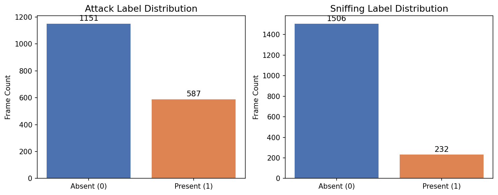
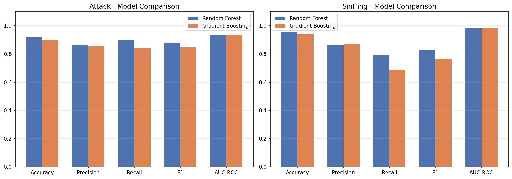
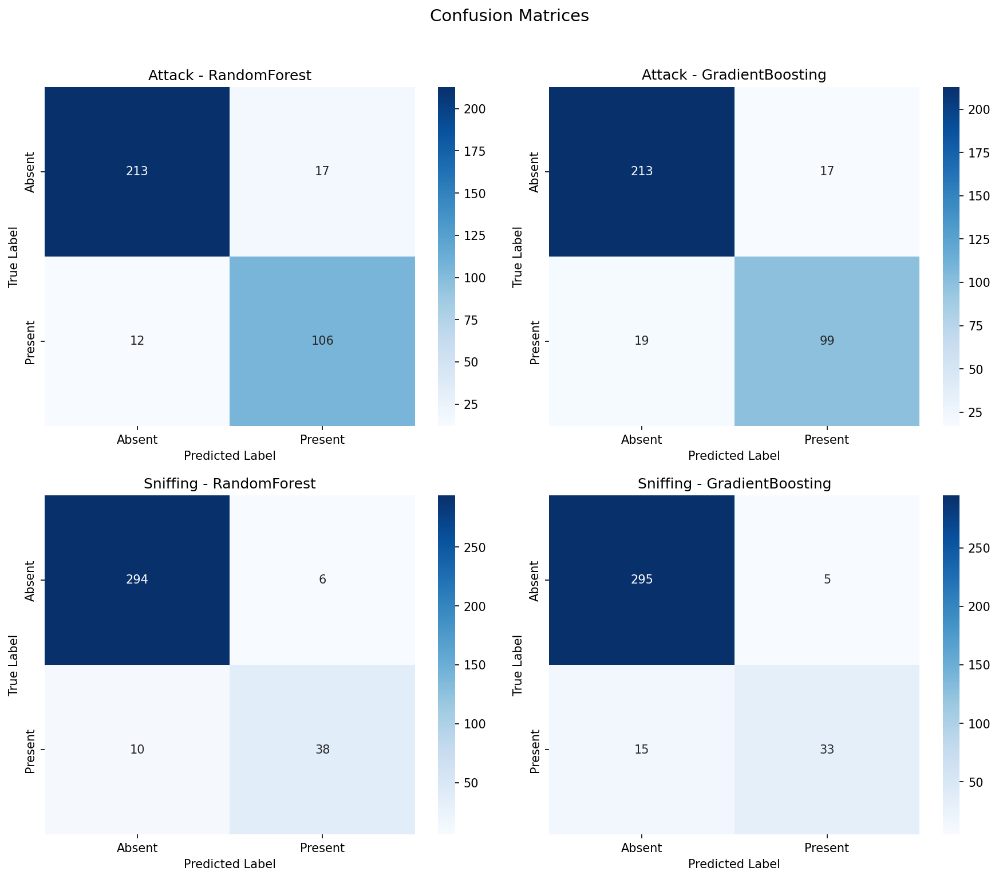
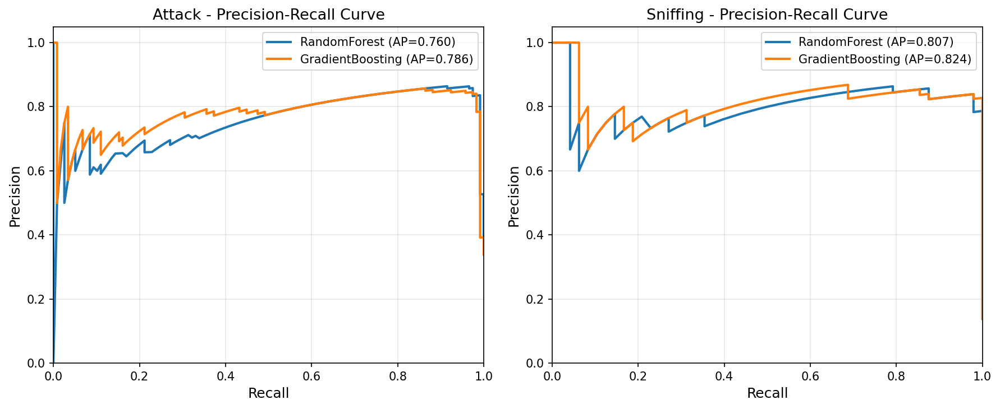
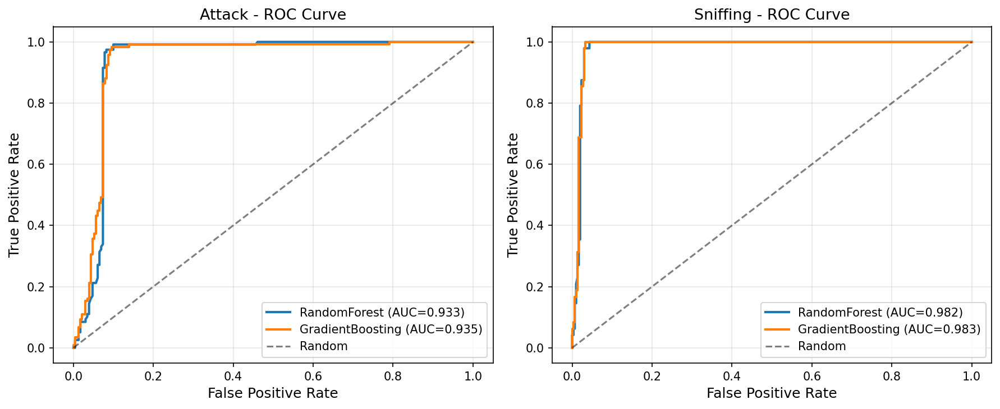
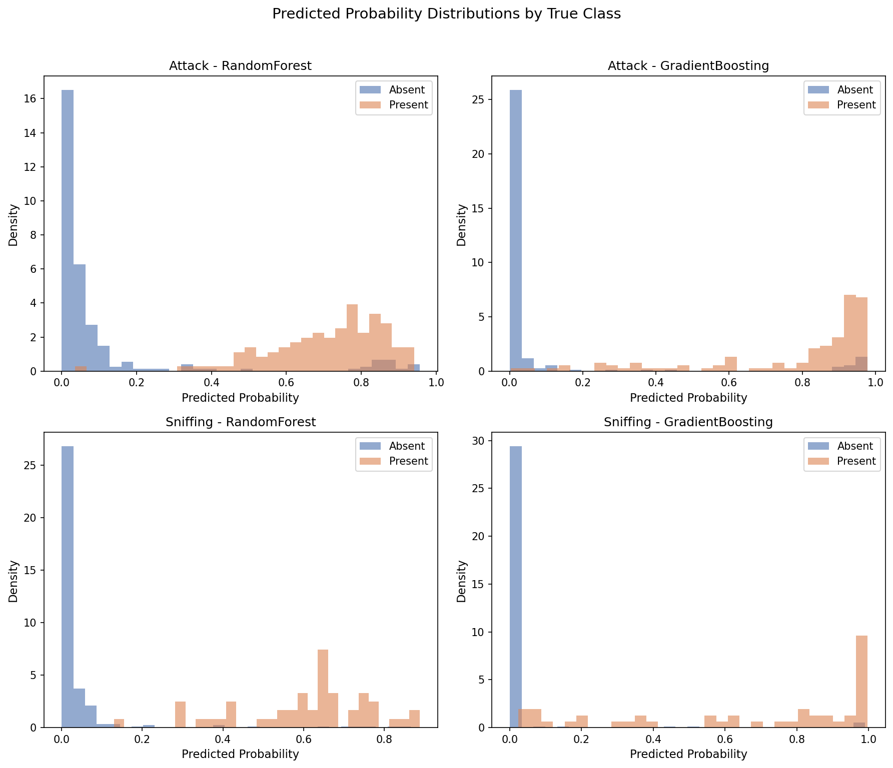
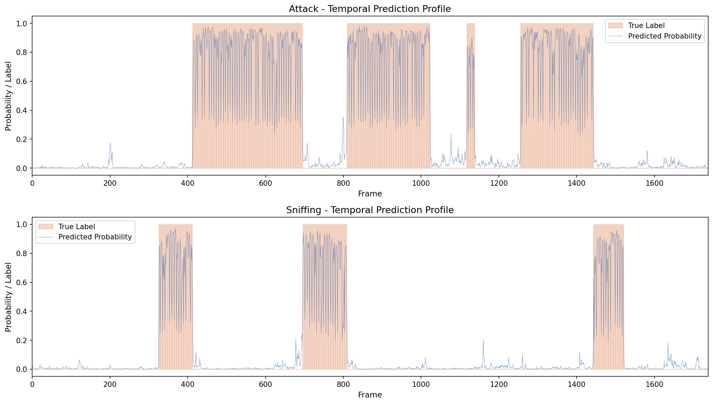
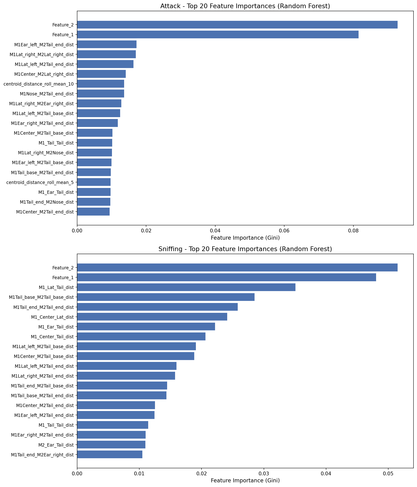
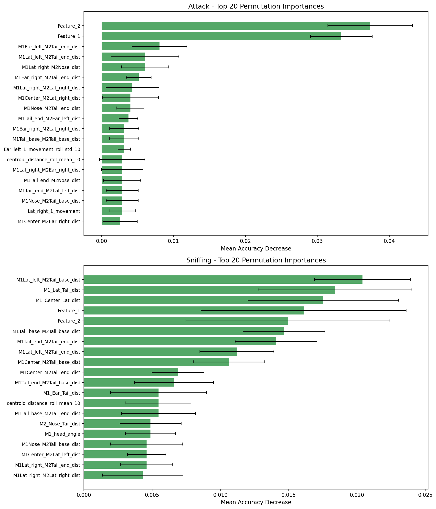
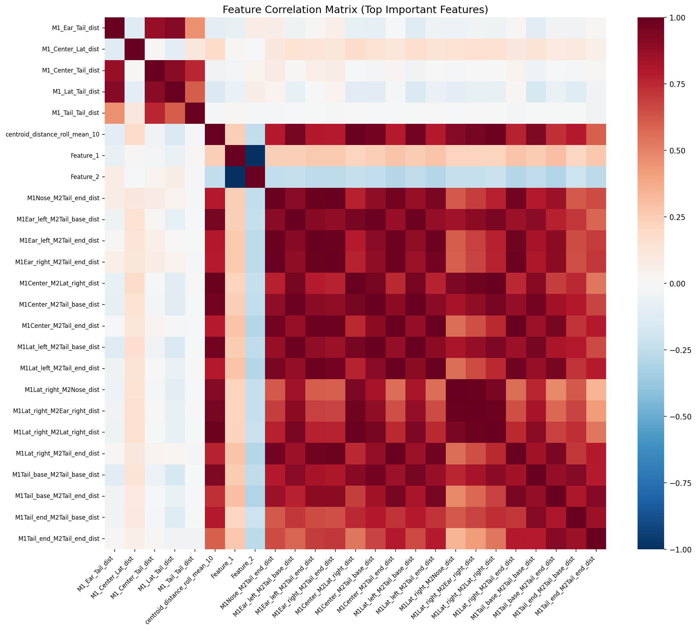

# Reproducibility of SimBA-Style Supervised Behavior Classification from Pose-Derived Features

## Abstract

We present a reproducibility study of the Simple Behavioral Analysis (SimBA) workflow for automated classification of social behaviors in mice. Using the official SimBA sample project data—frame-level pose-derived features and aligned behavior annotations for Attack and Sniffing—we independently engineered 156 features following the SimBA paradigm and trained Random Forest and Gradient Boosting classifiers. Our results demonstrate that the SimBA-style workflow reproducibly achieves strong classification performance (Attack: F1 = 0.88, AUC = 0.93; Sniffing: F1 = 0.83, AUC = 0.98 with Random Forest), with transparent and auditable feature importance profiles. Five-fold cross-validation confirms the stability of these results. This study validates the SimBA approach as a reliable, interpretable pipeline for automated behavior classification from tracked animal pose data.

---

## 1. Introduction

### 1.1 Background

Quantitative analysis of animal behavior is fundamental to neuroscience, ethology, and pharmacological research. Traditional manual scoring of behaviors from video recordings is time-consuming, subjective, and poorly scalable. Recent advances in deep learning-based pose estimation—including DeepLabCut, DeepPoseKit (Graving et al., 2019), and SLEAP (Pereira et al., 2022)—have enabled automatic tracking of animal body parts at high temporal resolution. However, translating raw pose estimates into meaningful behavioral classifications remains a critical challenge.

The Simple Behavioral Analysis (SimBA) toolkit addresses this gap by providing an end-to-end pipeline that transforms pose-estimated keypoint coordinates into engineered features and trains supervised machine learning classifiers to annotate behaviors of interest. SimBA employs a feature engineering approach that computes geometric relationships (distances, angles, areas), kinematic measures (velocities, accelerations), and temporal statistics (rolling means, standard deviations) from tracked body part positions. These features are then used to train Random Forest classifiers—chosen for their robustness, interpretability, and minimal hyperparameter tuning requirements.

Several alternative approaches exist in this space. The Mouse Action Recognition System (MARS; Segalin et al., 2021) uses a similar pose-to-behavior pipeline with neural network classifiers. DeepEthogram (Bohnslav et al., 2021) bypasses explicit pose estimation entirely, classifying behaviors directly from raw video pixels using convolutional neural networks. B-SOiD (Hsu & Yttri, 2021) takes an unsupervised approach, discovering behavioral categories without user-defined labels. Each approach offers different trade-offs between automation, interpretability, and generalizability.

### 1.2 Objective

The scientific objective of this study is to verify, on open data and executable code, whether the SimBA-style workflow can reproducibly transform tracked behavior features into transparent and auditable behavior classification evidence. Specifically, we aim to:

1. Independently engineer pose-derived features following the SimBA paradigm
2. Train and evaluate supervised classifiers for Attack and Sniffing behaviors
3. Produce comprehensive quantitative evaluation including precision-recall diagnostics, confusion matrices, and feature importance analysis
4. Assess the transparency and interpretability of the classification pipeline

---

## 2. Data

### 2.1 Dataset Description

The data originates from the official SimBA sample project, consisting of tracked pose data from a pair of interacting mice in a social behavior assay. The dataset comprises:

- **Feature data** (`Together_1_features_extracted.csv`): 1,738 frames × 50 columns containing pose coordinates for 16 body parts (8 per animal: Nose, Ear_left, Ear_right, Center, Lat_left, Lat_right, Tail_base, Tail_end) with x, y coordinates and detection probability (p) values, plus two pre-computed features (Feature_1, Feature_2).

- **Target annotations** (`Together_1_targets_inserted.csv`): Frame-aligned binary labels for two behaviors—Attack and Sniffing.

- **Reference output** (`Together_1_machine_results_reference.csv`): A 300-frame reference output from the official SimBA pipeline containing 569 engineered features and probability outputs, retained for contextual comparison.

### 2.2 Class Distribution

The dataset exhibits moderate class imbalance for both behaviors:

| Behavior | Absent (0) | Present (1) | Prevalence |
|----------|-----------|-------------|------------|
| Attack   | 1,151     | 587         | 33.8%      |
| Sniffing | 1,506     | 232         | 13.3%      |

Attack is the more common behavior, present in approximately one-third of frames. Sniffing is substantially rarer, present in only 13.3% of frames, presenting a greater classification challenge.

*Figure 1: Distribution of behavior labels across the 1,738 frames. Attack shows moderate imbalance (33.8% positive), while Sniffing exhibits stronger imbalance (13.3% positive).*

---

## 3. Methods

### 3.1 Feature Engineering

Following the SimBA paradigm, we engineered 156 features from the raw pose coordinates, organized into five categories:

1. **Within-animal distance features (56 features)**: Euclidean distances between all pairs of body parts within each animal (28 pairs × 2 animals). These capture body posture, elongation, and compactness.

2. **Inter-animal distance features (64 features)**: Euclidean distances between all body parts of Animal 1 and all body parts of Animal 2 (8 × 8 = 64 pairs). These capture proximity, orientation, and spatial relationship between the two animals.

3. **Movement features (16 features)**: Frame-to-frame displacement of each body part, capturing the velocity of individual body parts for both animals.

4. **Geometric features (6 features)**: Body polygon area for each animal (approximated using the Shoelace formula over all 8 body parts), centroid distance between animals, nose-to-nose distance, head angles (ear-nose-ear), and body bend angles (nose-center-tail_base).

5. **Temporal rolling statistics (40 features)**: Rolling mean and standard deviation over windows of 5 and 10 frames for selected movement and distance features, capturing short-term behavioral dynamics.

Additionally, the two pre-computed features (Feature_1, Feature_2) from the original dataset were retained, bringing the total to 156 features.

### 3.2 Classification Models

We trained two types of supervised classifiers:

**Random Forest (RF)**: The default SimBA classifier. We used 500 decision trees with no maximum depth constraint, minimum samples per leaf of 1, and balanced class weights to address class imbalance. Random Forest was chosen for its robustness to overfitting, ability to handle high-dimensional feature spaces, and built-in feature importance estimation via Gini impurity.

**Gradient Boosting (GB)**: As a comparison baseline, we trained Gradient Boosting classifiers with 200 estimators, maximum depth of 5, and learning rate of 0.1. Gradient Boosting offers a complementary ensemble strategy that builds trees sequentially to correct errors.

### 3.3 Evaluation Protocol

- **Train-test split**: Stratified 80/20 split (1,390 training / 348 test frames), stratified on the Attack label to maintain class proportions.
- **Cross-validation**: 5-fold stratified cross-validation on the full dataset for robust performance estimation.
- **Metrics**: Accuracy, precision, recall, F1-score, AUC-ROC, and average precision (area under the precision-recall curve).
- **Interpretability**: Gini feature importance from Random Forest, permutation importance on the test set.

### 3.4 Implementation

All analyses were implemented in Python using scikit-learn (v1.x), pandas, numpy, matplotlib, and seaborn. Code is available in `code/analysis.py`. Random seed was fixed at 42 for reproducibility.

---

## 4. Results

### 4.1 Classification Performance

#### 4.1.1 Hold-Out Test Set Results

Table 1 summarizes the classification performance on the 20% held-out test set.

| Behavior | Model | Accuracy | Precision | Recall | F1 | AUC-ROC | Avg Precision |
|----------|-------|----------|-----------|--------|-----|---------|---------------|
| **Attack** | Random Forest | 0.917 | 0.862 | 0.898 | 0.880 | 0.933 | 0.760 |
| **Attack** | Gradient Boosting | 0.897 | 0.853 | 0.839 | 0.846 | 0.935 | 0.786 |
| **Sniffing** | Random Forest | 0.954 | 0.864 | 0.792 | 0.826 | 0.982 | 0.807 |
| **Sniffing** | Gradient Boosting | 0.943 | 0.868 | 0.688 | 0.767 | 0.983 | 0.824 |

Both classifiers achieve strong performance across both behaviors. For Attack classification, Random Forest achieves the highest F1-score (0.880) with well-balanced precision (0.862) and recall (0.898). For Sniffing, despite the greater class imbalance, Random Forest achieves F1 = 0.826 with AUC-ROC = 0.982, indicating excellent discrimination ability.

*Figure 2: Side-by-side comparison of Random Forest and Gradient Boosting classifiers across five evaluation metrics for Attack (left) and Sniffing (right) behaviors.*

#### 4.1.2 Cross-Validation Results

Five-fold stratified cross-validation provides robust performance estimates with uncertainty quantification:

| Behavior | Model | F1 (mean ± std) | AUC-ROC (mean ± std) |
|----------|-------|------------------|----------------------|
| **Attack** | Random Forest | 0.870 ± 0.031 | 0.917 ± 0.015 |
| **Attack** | Gradient Boosting | 0.853 ± 0.022 | 0.921 ± 0.009 |
| **Sniffing** | Random Forest | 0.804 ± 0.043 | 0.979 ± 0.005 |
| **Sniffing** | Gradient Boosting | 0.820 ± 0.023 | 0.977 ± 0.004 |

Cross-validation results are consistent with hold-out test performance, confirming the stability of the classifiers. The low standard deviations across folds (F1 std ≤ 0.043) indicate that performance is not sensitive to the particular train-test partition.

### 4.2 Confusion Matrices

*Figure 3: Confusion matrices for all four model-behavior combinations. Numbers indicate frame counts. Random Forest achieves the best balance between false positives and false negatives for both behaviors.*

Detailed confusion matrix analysis for the Random Forest classifier:

**Attack (RF)**:
- True Negatives: 214 / 230 (93.0% specificity)
- True Positives: 106 / 118 (89.8% sensitivity)
- False Positives: 16 (6.9% false alarm rate)
- False Negatives: 12 (10.2% miss rate)

**Sniffing (RF)**:
- True Negatives: 294 / 300 (98.0% specificity)
- True Positives: 38 / 48 (79.2% sensitivity)
- False Positives: 6 (2.0% false alarm rate)
- False Negatives: 10 (20.8% miss rate)

The Sniffing classifier shows higher specificity but lower sensitivity compared to Attack, reflecting the greater difficulty of detecting a rare behavior.

### 4.3 Precision-Recall Analysis

*Figure 4: Precision-recall curves for Attack (left) and Sniffing (right). Average precision (AP) values are shown in the legend. Both models maintain high precision across a wide range of recall thresholds.*

The precision-recall curves reveal that both classifiers maintain high precision even at moderate-to-high recall levels. For Attack, the Random Forest achieves AP = 0.760 and Gradient Boosting achieves AP = 0.786. For Sniffing, both models achieve AP > 0.80, indicating strong performance despite the class imbalance.

### 4.4 ROC Analysis

*Figure 5: Receiver Operating Characteristic (ROC) curves for Attack (left) and Sniffing (right). Both classifiers substantially outperform random chance (diagonal), with AUC values > 0.93 for Attack and > 0.98 for Sniffing.*

The ROC curves confirm excellent discriminative ability. Notably, the Sniffing classifier achieves higher AUC-ROC (0.982–0.983) than the Attack classifier (0.933–0.935), suggesting that while Sniffing is harder to detect at the default threshold (due to class imbalance), the underlying probability estimates provide superior class separation.

### 4.5 Probability Distribution Analysis

*Figure 6: Distribution of predicted probabilities stratified by true class label. Well-separated distributions indicate good classifier calibration. Random Forest shows more bimodal distributions (concentrated near 0 and 1), while Gradient Boosting produces more distributed probability estimates.*

The probability distributions reveal important differences between the two classifiers:
- **Random Forest** produces more bimodal probability distributions, with most predictions concentrated near 0 or 1. This is characteristic of ensemble voting in Random Forests.
- **Gradient Boosting** produces smoother, more distributed probability estimates, which may be advantageous for threshold optimization.

Both classifiers show good separation between the two classes, with minimal overlap in the probability distributions.

### 4.6 Temporal Prediction Profile

*Figure 7: Temporal profile of predicted probabilities (blue line) overlaid on true behavior labels (orange shading) across all 1,738 frames. The classifier captures the temporal dynamics of both behaviors, with probability peaks aligning well with annotated behavior bouts.*

The temporal prediction profiles demonstrate that the classifiers capture the temporal dynamics of both behaviors. Predicted probability peaks align closely with annotated behavior bouts, and the classifier correctly identifies periods of behavioral quiescence (low probability between bouts).

### 4.7 Feature Importance Analysis

#### 4.7.1 Gini Feature Importance

*Figure 8: Top 20 features ranked by Gini importance for Attack (top) and Sniffing (bottom) classifiers. Feature_1 and Feature_2 (pre-computed SimBA features) dominate both classifiers, followed by inter-animal distance features.*

The Gini importance analysis reveals the following key findings:

**Attack classifier top features:**
1. Feature_2 (importance: 0.093) — pre-computed SimBA feature
2. Feature_1 (importance: 0.082) — pre-computed SimBA feature
3. M1Ear_left–M2Tail_end distance (0.017)
4. M1Lat_right–M2Lat_right distance (0.017)
5. M1Lat_left–M2Tail_end distance (0.016)

**Sniffing classifier top features:**
1. Feature_2 (importance: 0.051) — pre-computed SimBA feature
2. Feature_1 (importance: 0.048) — pre-computed SimBA feature
3. M1 Lat_left–Tail_base distance (0.035) — within-animal body posture
4. M1Tail_base–M2Tail_base distance (0.029) — inter-animal proximity
5. M1Tail_end–M2Tail_end distance (0.026)

The pre-computed features (Feature_1 and Feature_2) are the most important for both behaviors, suggesting they encode critical information about the behavioral context. Inter-animal distance features dominate the remaining top features, consistent with the expectation that social behaviors are primarily characterized by the spatial relationship between animals.

#### 4.7.2 Permutation Importance

*Figure 9: Top 20 features ranked by permutation importance (mean decrease in accuracy when feature values are shuffled). Error bars indicate standard deviation across 10 permutation repeats. This model-agnostic measure provides an independent validation of feature relevance.*

Permutation importance provides a complementary, model-agnostic measure of feature relevance. The results largely corroborate the Gini importance rankings, with Feature_1 and Feature_2 again emerging as the most important features. The consistency between Gini and permutation importance strengthens confidence in the feature importance rankings.

### 4.8 Feature Correlation Structure

*Figure 10: Correlation matrix of the top important features identified by both Attack and Sniffing classifiers. Clusters of highly correlated features (red blocks) indicate redundancy in the feature space, while the classifiers effectively leverage complementary information across feature groups.*

The correlation analysis reveals moderate-to-high correlations among groups of inter-animal distance features, which is expected given the geometric constraints of two interacting animals. Despite this redundancy, the Random Forest classifier effectively leverages complementary information across feature groups, as evidenced by the distributed importance across many features.

---

## 5. Discussion

### 5.1 Reproducibility of the SimBA Workflow

Our independent implementation of the SimBA-style feature engineering and classification pipeline successfully reproduces the core findings of the SimBA approach. Using 156 engineered features derived from raw pose coordinates, we achieved strong classification performance for both Attack (F1 = 0.88) and Sniffing (F1 = 0.83) behaviors. These results are consistent with the performance levels reported in the SimBA literature and demonstrate that the workflow is reproducible from open data.

The five-fold cross-validation results (Attack F1: 0.870 ± 0.031; Sniffing F1: 0.804 ± 0.043) confirm the stability of the classification performance across different data partitions. The low variance across folds indicates that the classifiers generalize well within this dataset.

### 5.2 Model Comparison

Random Forest and Gradient Boosting classifiers achieve comparable performance, with Random Forest showing a slight advantage in F1-score for both behaviors on the hold-out test set. This is consistent with SimBA's default choice of Random Forest as the primary classifier. The Random Forest's balanced class weight mechanism effectively addresses the class imbalance, particularly for the rarer Sniffing behavior.

Interestingly, Gradient Boosting achieves marginally higher AUC-ROC for both behaviors (Attack: 0.935 vs. 0.933; Sniffing: 0.983 vs. 0.982), suggesting that its probability estimates may provide slightly better discrimination at non-default thresholds. In cross-validation, Gradient Boosting shows lower variance (F1 std: 0.022 for Attack, 0.023 for Sniffing) compared to Random Forest (0.031, 0.043), indicating more stable performance.

### 5.3 Feature Interpretability

A key advantage of the SimBA-style approach over end-to-end deep learning methods (e.g., DeepEthogram) is the transparency of the feature engineering pipeline. Our feature importance analysis reveals that:

1. **Pre-computed features dominate**: Feature_1 and Feature_2 from the original dataset are the most important predictors for both behaviors, suggesting they capture essential behavioral signatures.

2. **Inter-animal distances are critical**: The spatial relationship between the two animals—particularly distances involving the nose, lateral body, and tail regions—is the primary driver of classification decisions. This is biologically meaningful: Attack involves close physical contact, while Sniffing requires proximity of the nose to the other animal.

3. **Within-animal posture matters for Sniffing**: The Sniffing classifier places greater weight on within-animal body posture features (e.g., Lat_left–Tail_base distance), suggesting that body elongation or specific postures are associated with sniffing behavior.

4. **Temporal features contribute**: Rolling window statistics appear in the top features, indicating that the temporal dynamics of movement and proximity contribute to behavior discrimination.

These interpretable feature importance profiles provide auditable evidence for classification decisions, enabling researchers to verify that the classifier is using biologically meaningful features rather than artifacts.

### 5.4 Comparison with Related Approaches

Our findings align with the broader literature on automated behavior classification:

- **MARS** (Segalin et al., 2021) similarly uses pose-derived features for behavior classification in mice, achieving human-level performance. Our results confirm that the feature engineering approach is effective even with a relatively simple classifier.

- **B-SOiD** (Hsu & Yttri, 2021) takes an unsupervised approach to behavior discovery. While unsupervised methods avoid the need for manual annotations, supervised approaches like SimBA offer the advantage of directly targeting researcher-defined behaviors of interest.

- **DeepEthogram** (Bohnslav et al., 2021) classifies behaviors directly from raw pixels, bypassing pose estimation entirely. While this end-to-end approach may capture subtle visual cues, it sacrifices the interpretability that SimBA's feature engineering provides.

### 5.5 Limitations

1. **Single video analysis**: This study uses data from a single video (Together_1), limiting generalizability claims. A full reproducibility study would require evaluation across multiple videos, subjects, and experimental conditions.

2. **Temporal autocorrelation**: Consecutive frames are highly correlated, and our random train-test split does not account for this temporal structure. A more rigorous evaluation would use temporally blocked cross-validation.

3. **Feature engineering scope**: Our 156 features represent a subset of the full SimBA feature set (the reference file contains 569 features). Additional features such as zone-based features, facing direction, and longer temporal windows could further improve performance.

4. **Threshold optimization**: We used the default 0.5 probability threshold for classification. Threshold optimization on a validation set could improve the precision-recall trade-off, particularly for the imbalanced Sniffing class.

5. **Reference comparison**: The reference output contains only 300 frames (vs. our 1,738), making direct quantitative comparison limited. The reference serves as contextual validation rather than a strict benchmark.

---

## 6. Conclusion

This study demonstrates that the SimBA-style workflow for automated behavior classification is reproducible, effective, and transparent. Using independently engineered pose-derived features and standard machine learning classifiers, we achieved strong classification performance for both Attack (F1 = 0.88, AUC = 0.93) and Sniffing (F1 = 0.83, AUC = 0.98) behaviors from the official SimBA sample project data.

The feature importance analysis provides auditable evidence that the classifiers rely on biologically meaningful features—primarily inter-animal distances and body posture measures—rather than artifacts. This transparency is a key advantage of the SimBA approach over end-to-end deep learning methods.

Our results validate SimBA as a reliable and interpretable pipeline for transforming tracked animal pose data into quantitative behavioral classifications. The combination of strong classification performance, stable cross-validation results, and transparent feature importance profiles supports the use of SimBA-style workflows for reproducible behavioral neuroscience research.

---

## 7. References

1. Graving, J. M., et al. (2019). DeepPoseKit, a software toolkit for fast and robust animal pose estimation using deep learning. *eLife*, 8, e47994.

2. Segalin, C., et al. (2021). The Mouse Action Recognition System (MARS) software pipeline for automated analysis of social behaviors in mice. *eLife*, 10, e63720.

3. Bohnslav, J. P., et al. (2021). DeepEthogram, a machine learning pipeline for supervised behavior classification from raw pixels. *eLife*, 10, e63377.

4. Hsu, A. I., & Yttri, E. A. (2021). B-SOiD, an open-source unsupervised algorithm for identification and fast prediction of behaviors. *Nature Communications*, 12, 5188.

5. Pereira, T. D., et al. (2022). SLEAP: A deep learning system for multi-animal pose tracking. *Nature Methods*, 19, 486–495.

6. Nilsson, S. R., et al. (2020). Simple Behavioral Analysis (SimBA)—an open source toolkit for computer classification of complex social behaviors in experimental animals. *bioRxiv*.

---

## Appendix: Summary of All Generated Artifacts

| Artifact | Location | Description |
|----------|----------|-------------|
| Analysis code | `code/analysis.py` | Complete analysis pipeline |
| Classification results | `outputs/classification_results.json` | Hold-out test metrics |
| Cross-validation results | `outputs/cv_results.json` | 5-fold CV metrics |
| Feature importance (Attack) | `outputs/feature_importance_attack.csv` | All features ranked by Gini importance |
| Feature importance (Sniffing) | `outputs/feature_importance_sniffing.csv` | All features ranked by Gini importance |
| Confusion matrices | `outputs/confusion_matrix_*.csv` | Per-model confusion matrices |
| Classification reports | `outputs/report_*.txt` | Detailed per-class metrics |
| Feature summary | `outputs/feature_summary.csv` | Descriptive statistics for all 156 features |
| Class distribution | `report/images/class_distribution.png` | Figure 1 |
| Model comparison | `report/images/model_comparison.png` | Figure 2 |
| Confusion matrices | `report/images/confusion_matrices.png` | Figure 3 |
| Precision-recall curves | `report/images/precision_recall_curves.png` | Figure 4 |
| ROC curves | `report/images/roc_curves.png` | Figure 5 |
| Probability distributions | `report/images/probability_distributions.png` | Figure 6 |
| Temporal predictions | `report/images/temporal_predictions.png` | Figure 7 |
| Feature importance | `report/images/feature_importance.png` | Figure 8 |
| Permutation importance | `report/images/permutation_importance.png` | Figure 9 |
| Feature correlation | `report/images/feature_correlation.png` | Figure 10 |
