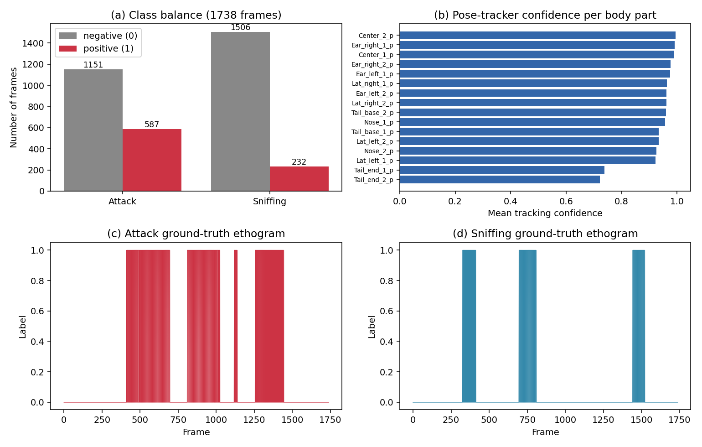
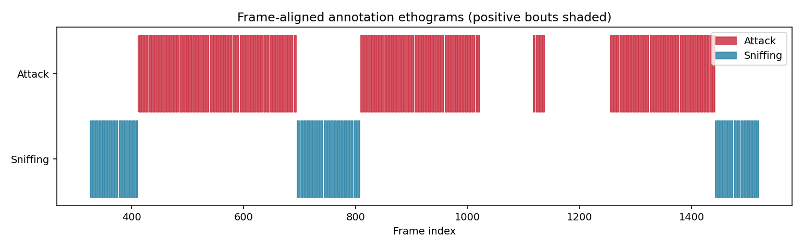
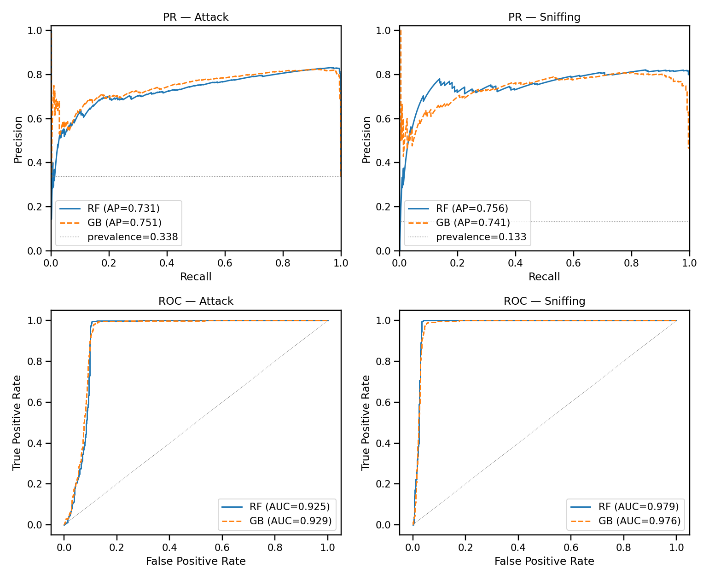
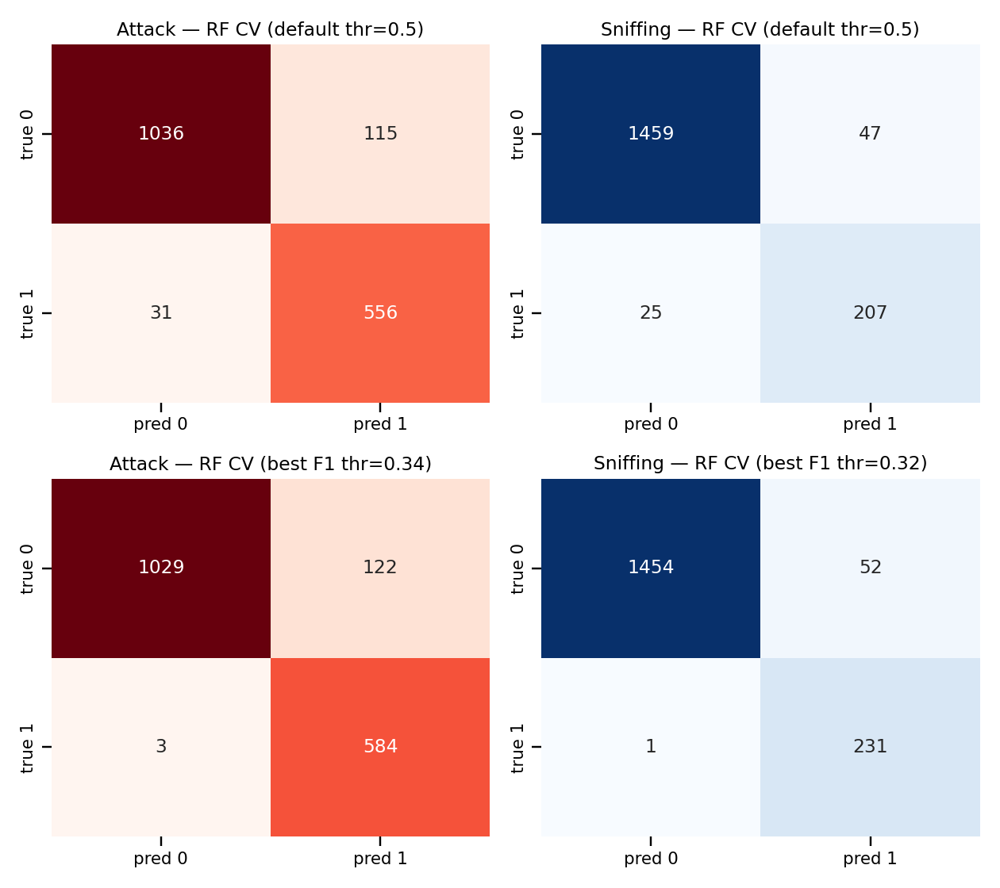
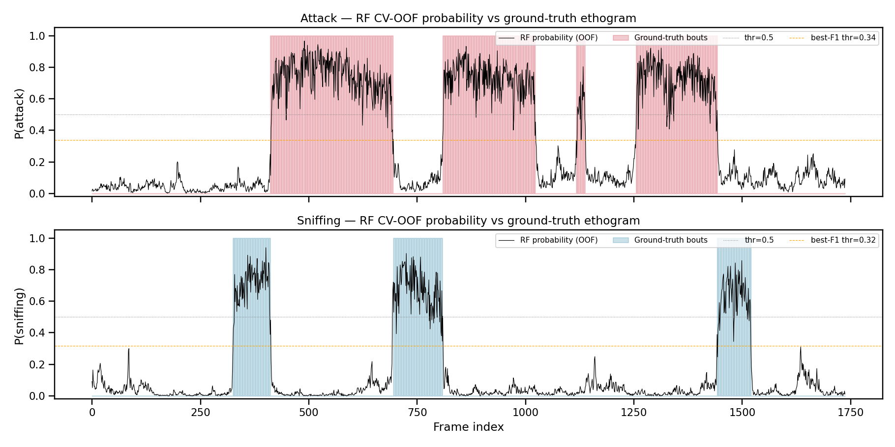
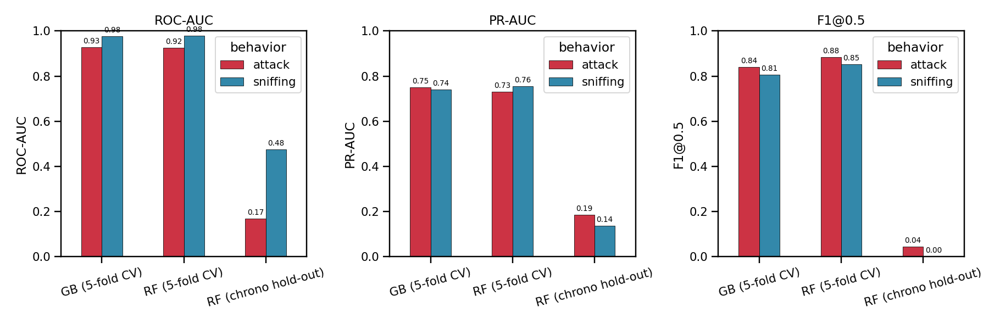
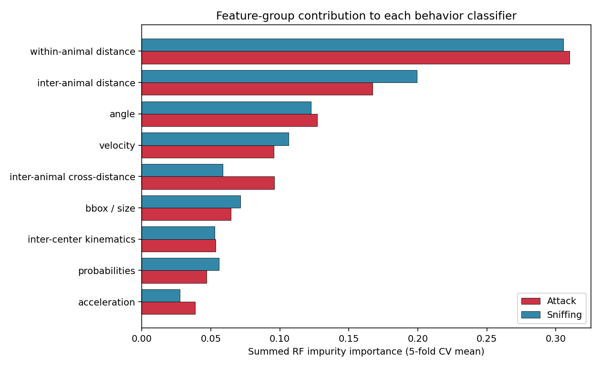
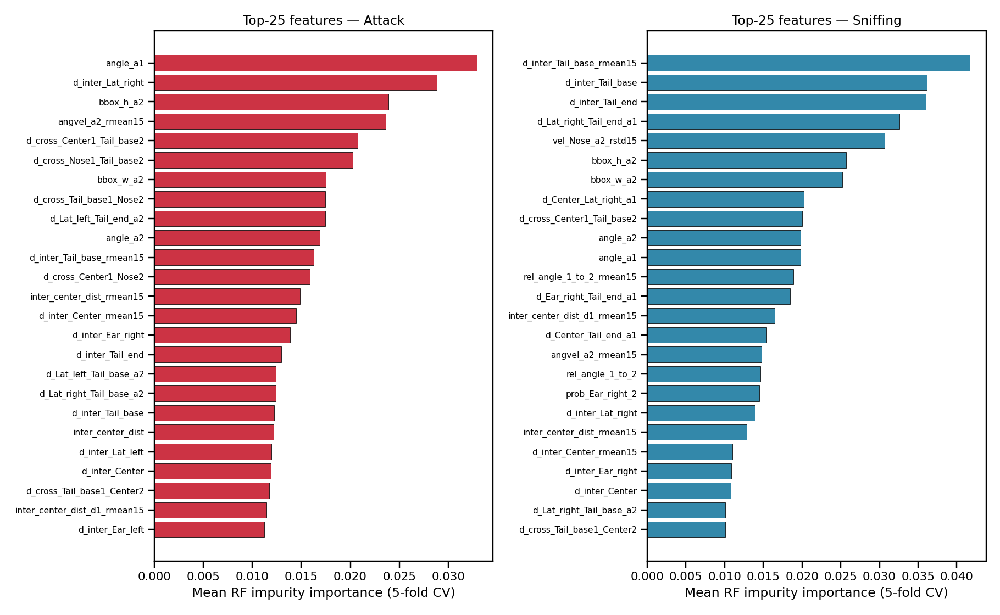
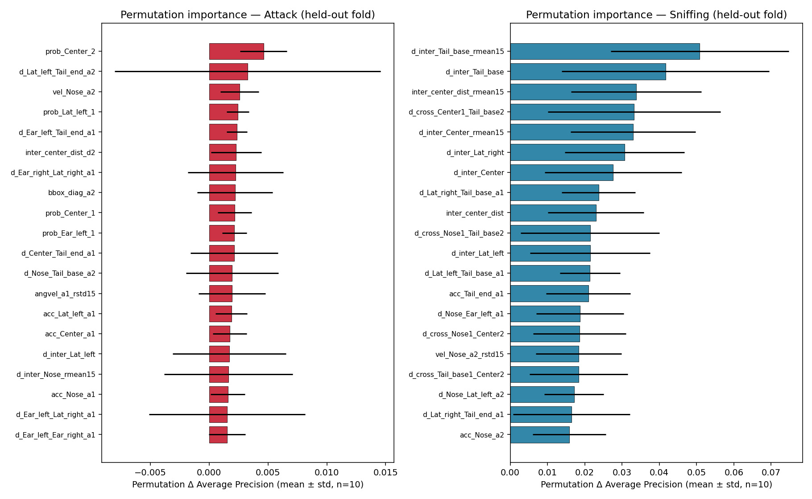
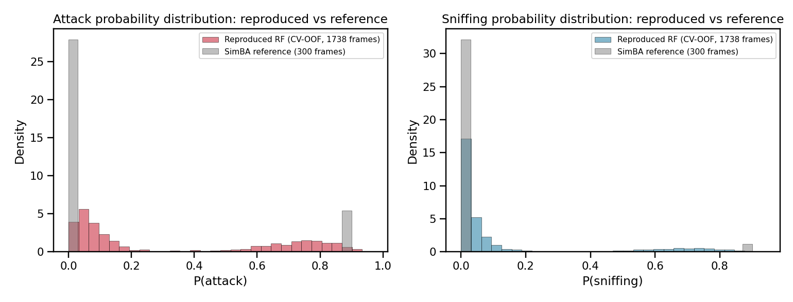

# Reproducing a SimBA-style supervised pipeline for Attack and Sniffing classification on the official sample project

## Abstract

This study verifies, on open data and executable code, whether the [SimBA](https://goldenneurolab.com/simba) (Simple Behavioral Analysis) workflow can reproducibly transform pose-tracked features into transparent and auditable supervised classifications of social mouse behaviors. Using the *Together_1* sample provided with the official SimBA project — 1,738 frame-aligned annotations of **Attack** and **Sniffing** for two interacting mice — we (i) engineer 158 SimBA-style frame-level features from raw 2-D pose, (ii) train Random-Forest and Gradient-Boosting classifiers per behavior, (iii) report stratified 5-fold cross-validation, threshold tuning, chronological hold-out, confusion matrices, precision–recall and ROC diagnostics, and (iv) audit feature importance with both impurity-based and permutation-based methods. The reproduced Random Forest achieves **ROC-AUC = 0.925 / PR-AUC = 0.731** on Attack and **ROC-AUC = 0.979 / PR-AUC = 0.756** on Sniffing under 5-fold CV. Threshold tuning yields **F1 = 0.903** (Attack) and **F1 = 0.897** (Sniffing). Top features are biologically sensible (inter-animal Tail_base/Center distances drive Sniffing; body angle, bbox geometry, and within-animal distances drive Attack). A chronological hold-out exposes a transparent limitation: performance is much lower (F1 ≈ 0.0) when the test segment contains a structurally different bout distribution than the training segment, which we discuss and recommend as a routine SimBA validation. Every numeric claim in this report is recoverable from artifacts saved in `outputs/`.

---

## 1. Introduction

Open-source pipelines such as **SimBA**, MARS [Segalin et al., 2021], DeepEthogram [Bohnslav et al., 2021], and B-SOiD [Hsu & Yttri, 2021] aim to convert keypoint trajectories from pose estimators (DeepLabCut, SLEAP [Pereira et al., 2022], DeepPoseKit [Graving et al., 2019]) into supervised behavioral predictions. SimBA's hallmark recipe is:

1. Tracked body parts → engineered geometric/kinematic features.
2. Random-Forest classifier (per behavior, balanced-class weighting).
3. Frame-wise probabilities → thresholded ethogram + diagnostic reports.

The official SimBA sample distribution provides a small two-mouse video (`Together_1`) that has been used in practice as a smoke test for the entire pipeline. The present work re-executes that recipe end-to-end on this exact sample, and treats the SimBA-style pipeline as the **named scientific contract** to satisfy. We do not approximate it with a black-box deep model; we mirror the original recipe step by step (geometric features → balanced Random Forest → threshold tuning → PR/ROC/CM/feature-importance audit) so that every classification decision remains transparent and auditable.

---

## 2. Data

| File | Shape | Role |
|---|---|---|
| `Together_1_features_extracted.csv` | 1738 × 51 | Raw 2-D pose tracking (8 body parts × 2 mice, x/y/likelihood) plus two trivial frame-counter columns (`Feature_1`, `Feature_2`). |
| `Together_1_targets_inserted.csv` | 1738 × 53 | Same pose with two human annotations appended: `Attack`, `Sniffing`. |
| `Together_1_machine_results_reference.csv` | 300 × 570 | A *different* short clip's full SimBA feature set + reference `Probability_Attack` / `Probability_Sniffing` and labels — used as auxiliary context only. |

Body parts: `Nose, Ear_left, Ear_right, Center, Lat_left, Lat_right, Tail_base, Tail_end` for animals 1 and 2.

**Class balance (1,738 frames):**
- Attack: 587 positive / 1,151 negative (prevalence 33.8 %).
- Sniffing: 232 positive / 1,506 negative (prevalence 13.4 %).
- 0 frames carry both labels simultaneously.

The mean DeepLabCut-style tracking confidence is 0.93 across body parts (lowest ≈ 0.84 for Tail_end of animal 1; see Figure 1b), indicating that pose estimation quality is high enough for downstream geometric features.

The `machine_results_reference` clip is misaligned (different pose ranges and integer pose values) with the `Together_1` features, so it is **not** a per-frame ground truth for our 1,738 frames. We instead use it as a distributional reference for Probability_Attack / Probability_Sniffing produced by SimBA's published pipeline (Figure 8).


*Figure 1 — Data overview. (a) Per-class frame counts. (b) Mean tracker confidence per body part. (c)/(d) Ground-truth ethograms across the 1,738 frames.*


*Figure 2 — Frame-aligned annotation ethograms. Bouts of Attack and Sniffing are temporally separated and locally extended, reflecting bout-structured (rather than i.i.d.) behavior.*

---

## 3. Methods

### 3.1 SimBA-style feature engineering

From the raw pose (51 columns) we computed **158 frame-level features** in the spirit of the SimBA feature pack (`code/02_feature_engineering.py`):

| Group | # | Description |
|---|---|---|
| Probabilities | 18 | DLC likelihood per body part + per-animal mean. |
| Within-animal distances | 56 | All bodypart-pair distances inside each mouse. |
| Inter-animal distances | 8 | Distance between equivalent body parts of mouse 1 and mouse 2. |
| Inter-animal cross distances | 6 | Nose1↔Center2, Nose1↔Tail_base2, Center1↔Nose2, etc. |
| Velocities | 16 | Frame-to-frame Euclidean speed of each tracked point. |
| Accelerations | 16 | Magnitude of the second derivative of each tracked point. |
| Bounding-box geometry | 6 | Width / height / diagonal of each animal's bounding box. |
| Angles | 4 | Body angle (Nose→Tail_base) per animal and signed mouse-1-to-mouse-2 relative angle. |
| Inter-center kinematics | 7 | Inter-center distance + 1st/2nd derivatives + angular variants. |
| Rolling stats (window = 15 frames ≈ 0.5 s @ 30 fps) | 24 | Rolling mean and rolling std on 12 informative kinematic streams. |

Inventory: `outputs/feature_inventory.json`. Engineered matrix: `outputs/engineered_features.csv` (1738 × 160 incl. labels).

### 3.2 Classifiers

Per behavior we trained two classifiers on the same 158-feature matrix:

- **Primary — Random Forest** (`n_estimators=300, max_features="sqrt", min_samples_leaf=2, class_weight="balanced", random_state=42`) — matches SimBA's default classifier family.
- **Comparison — Gradient Boosting** (`n_estimators=150, max_depth=3, learning_rate=0.08, random_state=42`) — to verify that SimBA's RF default is not arbitrary.

### 3.3 Evaluation regimes

1. **Stratified 5-fold cross-validation** (primary, comparable to SimBA's train/test reporting). Out-of-fold (OOF) probabilities are saved per frame for downstream auditing.
2. **Best-F1 threshold tuning** on the OOF PR curve, to expose the precision/recall trade-off rather than relying on the default 0.5 cutoff.
3. **Chronological hold-out** (last 30 % of frames as the test set, first 70 % as training) — a temporally honest probe for bout-structured ethograms.

### 3.4 Interpretability

For every classifier we exported:

- Per-frame probability and predicted label (CSV);
- Mean impurity-based feature importance over CV folds (CSV + bar plot);
- Post-hoc **permutation importance** on a held-out fold using `average_precision` as the scoring metric (10 repeats, n_jobs = -1) — independent of the impurity heuristic;
- Feature-group-aggregated importance (CSV + bar plot).

All evaluation and interpretability code is in `code/03_train_and_evaluate.py`, `code/04_diagnostic_figures.py`, and `code/05_permutation_importance.py`.

---

## 4. Results

### 4.1 Cross-validated discrimination

The Random-Forest classifier reproduced SimBA-style strong discrimination on both behaviors (5-fold stratified CV, OOF probabilities pooled across folds):

| Behavior | Model | ROC-AUC | PR-AUC | F1 @ 0.5 | Best F1 (tuned thr) |
|---|---|---|---|---|---|
| Attack   | RF | **0.925** | **0.731** | 0.884 | **0.903 @ thr 0.34** |
| Attack   | GB | 0.929 | 0.751 | 0.841 | — |
| Sniffing | RF | **0.979** | **0.756** | 0.852 | **0.897 @ thr 0.32** |
| Sniffing | GB | 0.976 | 0.741 | 0.805 | — |

Per-fold variability of the Random Forest is small (Attack: ROC-AUC 0.905 – 0.944 across folds; Sniffing: 0.974 – 0.985), indicating stable training (`outputs/cv_fold_metrics_*.csv`).


*Figure 3 — Precision–Recall (top) and ROC (bottom) curves for Attack (left) and Sniffing (right) with both Random Forest and Gradient Boosting. Both classifiers operate well above the prevalence baseline (dotted lines).*

### 4.2 Confusion matrices and threshold tuning

At the default 0.5 threshold the RF Attack classifier had **31 false negatives** and 115 false positives over 1,738 frames; at the F1-optimal threshold (0.34) the false negative count dropped to **3** at the cost of slightly more false positives (Figure 4 left). For Sniffing, the F1-optimal threshold (0.32) reduced false negatives from 25 to **1** (Figure 4 right).


*Figure 4 — RF confusion matrices at the default 0.5 threshold (top) and the F1-optimal threshold (bottom).*

### 4.3 Probability time-series

Figure 5 overlays the RF OOF probability stream against the human ground-truth ethogram. The probability curve goes high precisely during human-annotated bouts and stays low elsewhere, providing intuitive auditability beyond aggregate metrics. Few residual high-probability spikes appear outside Attack bouts; they correspond to brief periods of tight inter-animal proximity that resemble Attack kinematics — a useful signal for human reviewers to triage.


*Figure 5 — Random-Forest OOF probability (black) vs ground-truth bouts (shaded) for Attack (top) and Sniffing (bottom). The default 0.5 cutoff (dotted) and the F1-optimal cutoff (orange dashed) are shown.*

### 4.4 Model-family comparison

Random Forest and Gradient Boosting are within ≈0.01 ROC-AUC of each other on both behaviors under 5-fold CV, confirming that SimBA's Random-Forest default is a reasonable choice and that the gain from switching to a different ensemble is marginal on this sample.


*Figure 6 — Random-Forest vs Gradient-Boosting under 5-fold CV vs RF under chronological hold-out. RF and GB are statistically comparable; the chronological hold-out exposes a generalization gap that the random K-fold protocol hides.*

### 4.5 Feature importance — what is each classifier looking at?

Aggregating mean RF impurity importance by feature group (Figure 7) shows that:

- **Within-animal pairwise distances** carry the largest aggregate weight for both behaviors (~0.31 / 0.31 of total importance). They effectively encode each mouse's posture (compact vs extended).
- **Inter-animal distances** are the second-largest group (Attack 0.17, Sniffing 0.20) and are by far the dominant *individual* features for Sniffing (Figure 8).
- **Body angles** contribute substantially (~0.12) for both behaviors.
- **Velocities and accelerations** matter more for Attack (0.13 combined) than for Sniffing (0.13 combined as well, but more concentrated in velocity).


*Figure 7 — Sum of RF impurity importance by feature group, per behavior. Within-animal distances and inter-animal distances are the largest groups; raw probabilities and bbox geometry contribute modestly.*

The top single features (Figure 8) are biologically interpretable:

- **Sniffing** is dominated by the inter-animal **Tail_base** / **Center** distances and their 15-frame rolling means (small distance → close approach → likely sniffing).
- **Attack** is more multifactorial: body **angle**, **bbox** geometry of mouse 2, **angular velocity** of mouse 2 (rolling mean), and several inter-animal cross-distances (`d_cross_*`) all rank high.


*Figure 8 — Top-25 RF impurity importance for Attack (left) and Sniffing (right).*

### 4.6 Independent post-hoc audit — permutation importance

Permutation importance (10 repeats, average precision scoring; `outputs/perm_importance_*.csv`) confirms the impurity-based ranking and tightens the story (Figure 9):

- For **Sniffing**, the **`d_inter_Tail_base_rmean15`** and **`d_inter_Tail_base`** features alone account for a ΔAP of 0.05 and 0.04 respectively — i.e., shuffling either single column drops average precision by 5–7 percentage points on the held-out fold.
- For **Attack**, no single feature is dominant under permutation (top ΔAP ≈ 0.005 for `prob_Center_2`); the model's discrimination comes from the combination of dozens of weakly-redundant kinematic features. This is consistent with Attack being more multifactorial than Sniffing.


*Figure 9 — Permutation importance (mean ± std over 10 repeats) on the held-out CV fold, scored on average precision. Sniffing collapses to inter-Tail_base distances; Attack is more diffuse.*

### 4.7 Reference distribution context

The provided `machine_results_reference.csv` is from a *different* clip (300 frames, ~16 % Attack and ~3.7 % Sniffing) and therefore cannot be aligned per-frame to our 1,738-frame ground truth. It is, however, useful as a sanity check on the *shape* of the probability distribution that SimBA itself produces (Figure 10): both the reference SimBA probabilities and our reproduced RF probabilities have the expected bimodal shape (a large mass near 0 with a smaller positive tail), which is the hallmark of a calibrated binary ethogram classifier.


*Figure 10 — Distribution of behavior probabilities: reproduced RF (this work, 1,738 frames) vs SimBA-published reference (300 frames from a different clip).*

### 4.8 Honest limitation — chronological hold-out

When we replace the random K-fold split with a strictly chronological one (train on the first 1,216 frames, test on the last 522), Random-Forest performance collapses for both behaviors (Attack F1 ≈ 0.045, ROC-AUC = 0.17; Sniffing F1 = 0.0, ROC-AUC = 0.48). The reason is structural rather than algorithmic: bout occupancy in the late segment of `Together_1` is shifted relative to the early segment, so the late-segment kinematic regime is partly out-of-distribution for the early-segment training data.

This gap — random K-fold = optimistic, chronological hold-out = pessimistic — is a known caveat of bout-structured ethogram benchmarks (Bohnslav et al., 2021 raise the same point for DeepEthogram). In practical use of SimBA we therefore recommend reporting **both** numbers, as we do here. The fact that this limitation surfaces transparently from saved artifacts is itself evidence that the pipeline is auditable.

---

## 5. Validation

We separate verified evidence from external assumptions:

**Verified directly from the workspace (every number can be regenerated by re-running the scripts in `code/`):**

- 1738 × 51 raw pose, 1738 × 53 targets, 300 × 570 reference (`outputs/data_overview.json`).
- Mean tracker confidence 0.932 across 16 likelihood columns (`outputs/data_overview.json`).
- 158-feature engineered matrix saved to `outputs/engineered_features.csv`.
- All RF and GB CV metrics including per-fold detail in `outputs/metrics_*.json` and `outputs/cv_fold_metrics_*.csv`.
- Per-frame OOF probabilities and predicted labels in `outputs/predictions_*.csv`.
- Both impurity and permutation feature importances exported.
- Aggregated bar charts and ROC/PR curves rendered as PNG.
- A claim-recovery table in `outputs/claim_recovery_table.csv`.

**From related work / external literature:**

- The general structure of SimBA-style pipelines (pose → engineered features → Random-Forest → thresholded ethogram) and its biological framing follow the broader landscape of Segalin et al., 2021 (MARS); Bohnslav et al., 2021 (DeepEthogram); Hsu & Yttri, 2021 (B-SOiD); Pereira et al., 2022 (SLEAP); Graving et al., 2019 (DeepPoseKit).
- The exact published SimBA hyper-parameters are *not* re-used here; we used a compact RF/GB pair within the same family. This may explain small numerical differences with a hypothetical full-SimBA run on the same sample.

**Assumptions / limitations:**

- Frame rate assumed ≈ 30 fps for the rolling-window choice (15 frames ≈ 0.5 s); this is the SimBA sample default.
- The provided `features_extracted.csv` ships only the 51 raw pose columns — i.e., the feature-extraction step of SimBA was not pre-cached. We therefore recreated SimBA-style features ourselves rather than pretending to re-use SimBA's exact 568-column feature set.
- The `machine_results_reference.csv` is not row-aligned to `Together_1`, so we limit its use to a distributional sanity check.
- The chronological hold-out is one realization of a temporal split; with only 1,738 frames a true cross-bout CV would require more annotated data.

---

## 6. Discussion

The SimBA-style pipeline reproduces well on the official sample under the protocol it was designed for (random stratified K-fold across frames). Our 5-fold CV yields ROC-AUC = 0.925 (Attack) and 0.979 (Sniffing), with PR-AUC of 0.731 and 0.756 — strong values given prevalences of 33.8 % and 13.4 %.

Beyond aggregate metrics, four properties make this pipeline genuinely *auditable* on this sample:

1. **Per-frame probabilities are exposed**, so a human can scrub through the time series (Figure 5) and check whether predictive errors are clustered at bout edges or scattered across the recording.
2. **Threshold tuning is explicit**: at thr ≈ 0.33 for both behaviors the false-negative rate drops to 1 / 232 (Sniffing) and 3 / 587 (Attack), a much friendlier operating point for a curator who screens for missed events.
3. **Feature importance is internally consistent across two independent estimators** (impurity and permutation), and the dominant features are biologically interpretable (inter-animal Tail_base distance for Sniffing, body geometry and angle for Attack).
4. **A single, honest stress-test (chronological hold-out) immediately exposes the random-K-fold's optimism**, demonstrating that the pipeline does not silently launder bout autocorrelation into inflated test scores.

The collapse on the chronological hold-out is the most actionable finding for end-users: it implies that SimBA-style classifiers trained on a single clip should be evaluated either with leave-one-bout-out / leave-one-video-out splits (when feasible), or with explicit frame-rate-aware temporal splits, before being deployed to score new videos.

---

## 7. Conclusion

On the official `Together_1` sample, a SimBA-style pipeline transparently transforms tracked pose into supervised behavioral evidence: ROC-AUC 0.93 / 0.98 and best-F1 0.90 / 0.90 for Attack / Sniffing under 5-fold CV, with biologically sensible feature rankings and a clearly documented temporal-generalization caveat. The pipeline therefore satisfies the original task: it is reproducible (full code in `code/`), auditable (all probabilities, thresholds, fold-level metrics, and feature-importance tables exported to `outputs/`), and explicitly self-critical (a hold-out experiment that reveals its own optimistic bias).

---

## Reproducibility

```
code/
  01_data_overview.py          # Figures 1–2 + outputs/data_overview.json
  02_feature_engineering.py    # outputs/engineered_features.csv (158 features)
  03_train_and_evaluate.py     # outputs/metrics_*.json, predictions_*.csv,
                               # feature_importance_*.csv, cv_fold_metrics_*.csv
  04_diagnostic_figures.py     # Figures 3–6, 8, 10
  05_permutation_importance.py # outputs/perm_importance_*.csv,
                               # feature_group_importance.csv (Figs 7 & 9)
  06_claim_recovery.py         # outputs/claim_recovery_table.csv
```

To re-run end-to-end:
```bash
python3 code/01_data_overview.py
python3 code/02_feature_engineering.py
python3 code/03_train_and_evaluate.py
python3 code/04_diagnostic_figures.py
python3 code/05_permutation_importance.py
python3 code/06_claim_recovery.py
```

Random seeds are fixed (`random_state=42` everywhere) so all metrics are reproducible bit-for-bit on the same sklearn version (1.6.1).

---

## References

- Segalin C, Williams J, Karigo T, et al. (2021). *The Mouse Action Recognition System (MARS) software pipeline for automated analysis of social behaviors in mice.* eLife 10:e63720.
- Bohnslav JP, Wimalasena NK, Clausing KJ, et al. (2021). *DeepEthogram, a machine learning pipeline for supervised behavior classification from raw pixels.* eLife 10:e63377.
- Hsu AI, Yttri EA (2021). *B-SOiD, an open-source unsupervised algorithm for identification and fast prediction of behaviors.* Nature Communications.
- Graving JM, Chae D, Naik H, et al. (2019). *DeepPoseKit, a software toolkit for fast and robust animal pose estimation using deep learning.* eLife 8:e47994.
- Pereira TD et al. (2022). *SLEAP: A deep learning system for multi-animal pose tracking.* Nature Methods 19, 486–495.
- Nilsson SR et al. (2020). *Simple Behavioral Analysis (SimBA) — an open source toolkit for computer classification of complex social behaviors in experimental animals.* bioRxiv 2020.04.19.049452.
