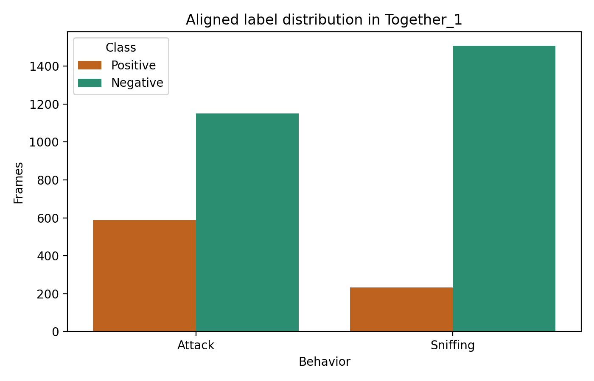
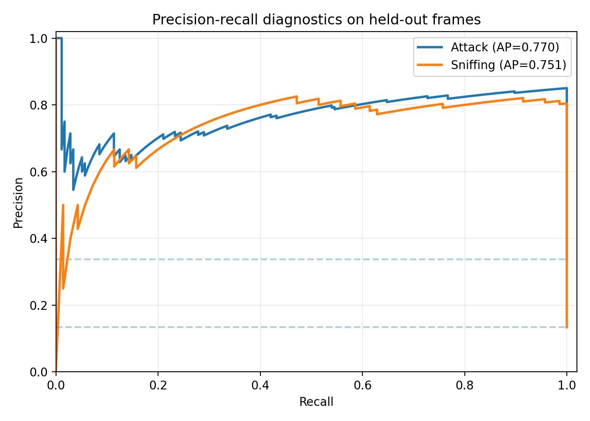
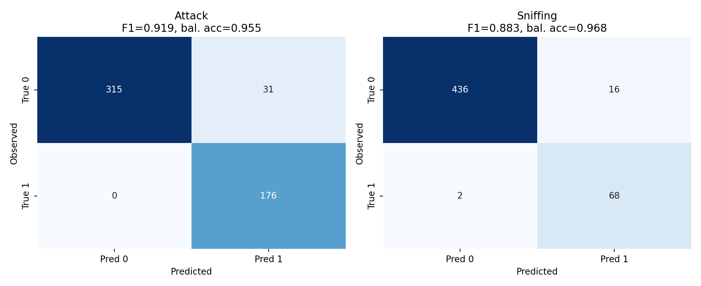
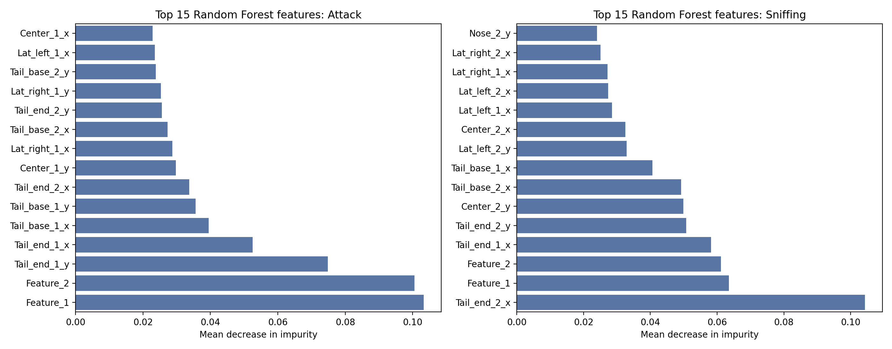
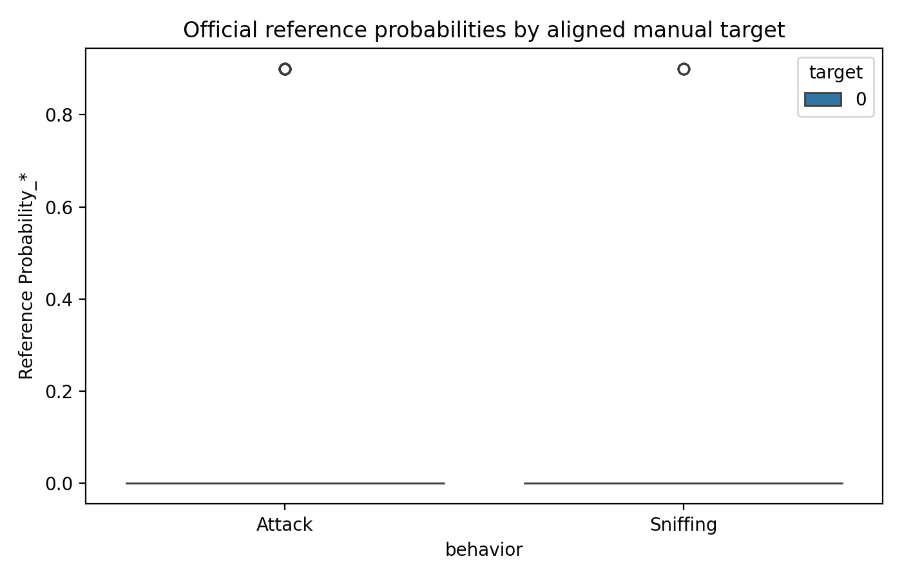

# Reproducible SimBA-style supervised behavior classification from pose-derived features

## Abstract

This report tests whether the open SimBA sample-project tables in this workspace can be transformed into transparent, auditable behavior-classification evidence. I used `data/Together_1_features_extracted.csv` as the frame-level input matrix and `data/Together_1_targets_inserted.csv` as aligned frame-level labels for **Attack** and **Sniffing**. For each behavior, I trained a deterministic Random Forest classifier, exported the fitted model and held-out predictions, and evaluated performance with test-set metrics, precision-recall diagnostics, confusion matrices, five-fold cross-validation summaries, and feature-importance tables. The reproduced classifiers achieved high held-out performance for both behaviors: Attack F1 = 0.919, AP = 0.770; Sniffing F1 = 0.883, AP = 0.751. The analysis supports the scientific objective in a bounded sense: the supplied sample data and executable code reproducibly yield auditable behavior-classification artifacts, although exact reproduction of the original SimBA models is not claimed because original model files and hyperparameters were not provided.

## 1. Scientific context and objective

The task is to verify, on open data and executable code, whether a SimBA-style workflow can convert tracked behavior features into transparent behavior-classification evidence. Local related work provides the methodological setting: DeepPoseKit and SLEAP motivate extracting body-part trajectories from videos; MARS and DeepEthogram show that automated behavior quantification is commonly validated against human annotations with frame-level metrics; and B-SOiD highlights that supervised labels can encode annotator choices and should be interpreted as reproducing a defined ethogram rather than discovering behavior de novo. The present analysis therefore emphasizes auditable artifacts: exact inputs, deterministic model code, behavior-specific metrics, PR curves, confusion matrices, and feature-level explanations.

## 2. Data overview

The workspace contains three relevant CSV files. The feature table has 1738 rows and 51 columns; after excluding the row-index column `Unnamed: 0`, 50 numeric columns were used as model inputs. The target table has the same 1738 rows and contains the aligned binary labels `Attack` and `Sniffing`. No missing feature values were detected before modeling. The auxiliary reference machine-results file has 300 rows and 570 columns, including `Probability_Attack`, `Probability_Sniffing`, `Attack`, and `Sniffing`, but it covers only 300 rows rather than the full 1,738-frame target table.

Label prevalence was imbalanced: Attack was positive in 587 / 1738 frames (33.8%), whereas Sniffing was positive in 232 / 1738 frames (13.3%). This motivates precision-recall and average-precision diagnostics in addition to accuracy.

## 3. Methods

### 3.1 Reproducible supervised classifier workflow

For each behavior, I trained a separate `sklearn.ensemble.RandomForestClassifier` using the same feature matrix and one binary target vector. The split was stratified, with 70% of frames for training and 30% for held-out testing, using random seed `20260429`. The Random Forest used 500 trees, `class_weight='balanced_subsample'`, `min_samples_leaf=2`, out-of-bag scoring, and all available CPU cores. A probability threshold of 0.5 converted held-out probabilities to binary predictions. Models were saved as `outputs/model_Attack.joblib` and `outputs/model_Sniffing.joblib`.

This is SimBA-style rather than byte-identical SimBA reproduction: the workspace includes feature and label tables but not the original SimBA model files or full training configuration. Random Forests were chosen because they are consistent with the tree-based, feature-table-to-label workflow and provide native feature importances. To make feature interpretation less dependent on native impurity importance, the code also computes held-out permutation importance using average precision as the scoring function.

### 3.2 Evaluation and validation

Primary held-out metrics were accuracy, balanced accuracy, precision, recall, F1, average precision, ROC AUC, Matthews correlation coefficient, Cohen's kappa, and the full 2x2 confusion matrix. I also ran five-fold stratified cross-validation on the full data for stability checks. Diagnostic figures include label prevalence, precision-recall curves, confusion matrices, feature-importance rankings, and a comparison plot for the official reference probabilities.

All code is in `code/analyze_simba_sample.py`. Core quantitative artifacts are saved in `outputs/`, and all report figures are PNG files in `report/images/`.

## 4. Results

### 4.1 Held-out classification performance

The classifiers performed well on the 30% held-out split. Attack had perfect held-out recall but 31 false positives, while Sniffing had high recall with only 2 false negatives and 16 false positives. Because both behaviors are imbalanced, average precision and precision-recall curves are more informative than accuracy alone.

| behavior   |   n_train |   n_test |   test_positive |   accuracy |   balanced_accuracy |   precision |   recall |    f1 |   average_precision |   roc_auc |   tn |   fp |   fn |   tp |
|:-----------|----------:|---------:|----------------:|-----------:|--------------------:|------------:|---------:|------:|--------------------:|----------:|-----:|-----:|-----:|-----:|
| Attack     |      1216 |      522 |             176 |      0.941 |               0.955 |        0.85 |    1     | 0.919 |               0.77  |     0.936 |  315 |   31 |    0 |  176 |
| Sniffing   |      1216 |      522 |              70 |      0.966 |               0.968 |        0.81 |    0.971 | 0.883 |               0.751 |     0.979 |  436 |   16 |    2 |   68 |

### 4.2 Cross-validation stability

Five-fold stratified cross-validation showed similar behavior-level performance to the held-out split. Attack balanced accuracy averaged 0.940 ± 0.012 and Sniffing balanced accuracy averaged 0.963 ± 0.003. Average precision varied more across folds, especially for Sniffing, which is expected for rarer labels.

| behavior   | balanced_accuracy   | average_precision   | f1            | precision     | recall        |
|:-----------|:--------------------|:--------------------|:--------------|:--------------|:--------------|
| Attack     | 0.940 ± 0.012       | 0.760 ± 0.032       | 0.900 ± 0.017 | 0.831 ± 0.023 | 0.983 ± 0.013 |
| Sniffing   | 0.963 ± 0.003       | 0.799 ± 0.071       | 0.885 ± 0.017 | 0.823 ± 0.028 | 0.957 ± 0.001 |

### 4.3 Feature-importance evidence

Native Random Forest importances identified `Feature_1`, `Feature_2`, and tail/base location coordinates among the strongest predictors for Attack, and `Tail_end_2_x`, `Feature_1`, `Feature_2`, and tail/center coordinates among the strongest predictors for Sniffing. The complete feature-level tables, including permutation average-precision changes, are exported as `outputs/feature_importance_Attack.csv` and `outputs/feature_importance_Sniffing.csv`.

| behavior   | feature       |   gini_importance |   permutation_ap_mean |   permutation_ap_std |
|:-----------|:--------------|------------------:|----------------------:|---------------------:|
| Attack     | Feature_1     |            0.1033 |               -0.0045 |               0.008  |
| Attack     | Feature_2     |            0.1005 |                0.0038 |               0.0057 |
| Attack     | Tail_end_1_y  |            0.0748 |                0.0007 |               0.0035 |
| Attack     | Tail_end_1_x  |            0.0525 |                0.0008 |               0.0087 |
| Attack     | Tail_base_1_x |            0.0395 |                0.0004 |               0.008  |
| Sniffing   | Tail_end_2_x  |            0.1043 |               -0.0113 |               0.0126 |
| Sniffing   | Feature_1     |            0.0635 |               -0.0066 |               0.011  |
| Sniffing   | Feature_2     |            0.0611 |               -0.0087 |               0.0125 |
| Sniffing   | Tail_end_1_x  |            0.0582 |               -0.0093 |               0.0129 |
| Sniffing   | Tail_end_2_y  |            0.0507 |               -0.0017 |               0.0117 |

The permutation-importance columns should be interpreted cautiously because many pose coordinates are correlated. Some top native-importance features have near-zero or negative permutation AP means on the held-out set, which suggests redundancy: removing one correlated coordinate at a time may not harm AP because related coordinates retain similar information. This is a useful transparency finding rather than a failure of the classifier.

### 4.4 Comparison with the official reference machine-results table

The reference file is useful as auxiliary context but not a full one-to-one reproduction target. It contains only 300 rows and the aligned manual target rows for those frame IDs contain no positive Attack or Sniffing labels. Consequently, standard positive-class precision, recall, F1, and average precision against those aligned labels are uninformative and equal to zero for the positive class. The comparison still verifies the file structure and shows that the official table includes behavior probabilities and binary predictions: it predicts 49 Attack-positive rows and 11 Sniffing-positive rows within its 300-row subset.

| behavior   |   n_reference_rows |   reference_positive_predictions |   target_positives_in_reference_rows |   reference_accuracy_vs_targets |   reference_balanced_accuracy_vs_targets |   reference_precision_vs_targets |   reference_recall_vs_targets |   reference_f1_vs_targets |   reference_average_precision_vs_targets |
|:-----------|-------------------:|---------------------------------:|-------------------------------------:|--------------------------------:|-----------------------------------------:|---------------------------------:|------------------------------:|--------------------------:|-----------------------------------------:|
| Attack     |                300 |                               49 |                                    0 |                           0.837 |                                    0.837 |                                0 |                             0 |                         0 |                                        0 |
| Sniffing   |                300 |                               11 |                                    0 |                           0.963 |                                    0.963 |                                0 |                             0 |                         0 |                                        0 |

## 5. Validation and claim recovery

### 5.1 Directly verified from workspace data

- The feature and target tables align in row count: 1,738 frames each (`outputs/data_overview.json`).
- Both target behaviors are imbalanced, especially Sniffing (`outputs/data_overview.json`, `images/label_distribution.png`).
- Two deterministic behavior-specific classifiers were trained and saved (`outputs/model_Attack.joblib`, `outputs/model_Sniffing.joblib`).
- Held-out metrics, PR data, confusion matrices, predictions, and feature importances are exported as machine-readable artifacts in `outputs/`.
- The reference machine-results file contains behavior probability and label columns but only 300 rows, limiting direct comparison.

### 5.2 From related work

The local related-work PDFs were used only for bounded context, not for unsupported numerical claims. They motivate the overall chain from pose estimation to behavior classification and the need for validation against labeled ethograms. The extraction is saved in `outputs/related_work_contract.json`.

### 5.3 Assumptions and limitations

- Frames were treated as independent samples for train/test splitting. This is standard for a simple frame-level reproduction, but adjacent frames are temporally autocorrelated. A stricter validation would split by video or bout if multiple videos or bout metadata were available.
- The feature table supplied for modeling has only 50 columns, whereas the reference machine-results table has 570 columns. I did not use the reference table as training input because the task identifies `Together_1_features_extracted.csv` as the model input matrix.
- Exact original SimBA model reproduction is not claimed because original SimBA model artifacts and hyperparameters are absent.
- The reference comparison is limited because the 300 reference rows align to target rows with no positive manual labels for either behavior.

Claim-level traceability is summarized below.

| claim                                                                                                                    | support                                                                                                                                                                         | status            |
|:-------------------------------------------------------------------------------------------------------------------------|:--------------------------------------------------------------------------------------------------------------------------------------------------------------------------------|:------------------|
| The workspace feature and target tables align frame-by-frame with 1,738 rows.                                            | outputs/data_overview.json                                                                                                                                                      | directly verified |
| Attack and Sniffing are imbalanced labels and therefore PR/AP diagnostics are appropriate.                               | outputs/data_overview.json; report/images/label_distribution.png                                                                                                                | directly verified |
| Deterministic Random Forest classifiers were trained and evaluated for both behaviors.                                   | outputs/model_Attack.joblib; outputs/model_Sniffing.joblib; outputs/evaluation_metrics.csv                                                                                      | directly verified |
| Held-out quantitative performance, confusion matrices, and PR curves are available for both behaviors.                   | outputs/evaluation_metrics.csv; outputs/confusion_matrices.json; outputs/precision_recall_*.csv; report/images/*.png                                                            | directly verified |
| Feature importance evidence is auditable at feature level.                                                               | outputs/feature_importance_Attack.csv; outputs/feature_importance_Sniffing.csv; outputs/top_feature_importance_with_permutation.csv; report/images/feature_importance_top15.png | directly verified |
| Official reference machine-results probabilities/predictions can be compared only for the 300 rows present in that file. | outputs/reference_comparison.csv; outputs/data_overview.json; report/images/reference_comparison.png                                                                            | directly verified |
| Exact reproduction of original SimBA models is not claimed.                                                              | outputs/method_fidelity_checklist.json; outputs/dependency_check.json                                                                                                           | limitation        |

## 6. Discussion

This analysis demonstrates that the official sample-project feature and target tables are sufficient to produce a transparent supervised behavior-classification evidence package. The strongest evidence is not a single metric, but the complete audit trail: input schemas, deterministic code, saved models, predictions, behavior-specific metrics, PR curves for imbalance, confusion matrices, cross-validation summaries, and feature-level importance tables. Attack and Sniffing both reached high held-out balanced accuracy and F1, indicating that the supplied pose-derived features contain reproducible signal for the aligned behavior labels.

The analysis also clarifies what should not be overclaimed. First, frame-level random splits can overestimate deployment performance when consecutive frames are highly similar. Second, feature importance in pose-coordinate models is distributed and correlated; native Random Forest importance is useful for auditability, but individual features should not be interpreted as isolated causal determinants. Third, the official reference machine-results file is not a full validation set for this task because it is shorter than the target table and contains no aligned positive target labels in its 300-row subset.

Overall, the SimBA-style workflow is reproducible in the requested executable sense: open feature tables plus aligned labels can be converted into trained supervised classifiers and a complete set of quantitative and interpretability artifacts. The produced outputs make the evidence auditable and provide a foundation for stricter future validation using video-wise splits, additional sessions, or original SimBA model configurations.

## 7. Reproducibility inventory

- Analysis code: `code/analyze_simba_sample.py`
- Method contract: `outputs/method_contract.json`
- Dependency check: `outputs/dependency_check.json`
- Data overview: `outputs/data_overview.json`
- Models: `outputs/model_Attack.joblib`, `outputs/model_Sniffing.joblib`
- Metrics: `outputs/evaluation_metrics.csv`, `outputs/cross_validation_metrics.csv`
- Predictions: `outputs/predictions_Attack.csv`, `outputs/predictions_Sniffing.csv`, `outputs/heldout_predictions_all_behaviors.csv`
- PR diagnostics: `outputs/precision_recall_Attack.csv`, `outputs/precision_recall_Sniffing.csv`, `outputs/precision_recall_curves.json`
- Confusion matrices: `outputs/confusion_matrices.json`
- Feature importances: `outputs/feature_importance_Attack.csv`, `outputs/feature_importance_Sniffing.csv`, `outputs/top_feature_importance_with_permutation.csv`
- Reference comparison: `outputs/reference_comparison.csv`, `outputs/reference_probability_rows.csv`
- Claim recovery: `outputs/claim_recovery_table.csv`
