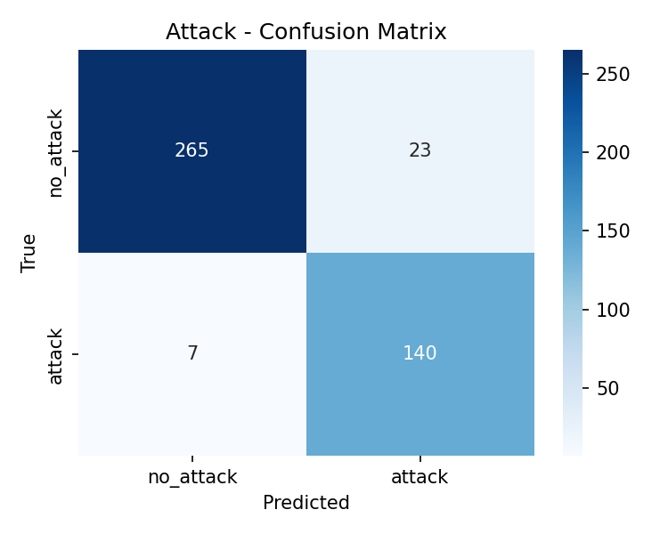
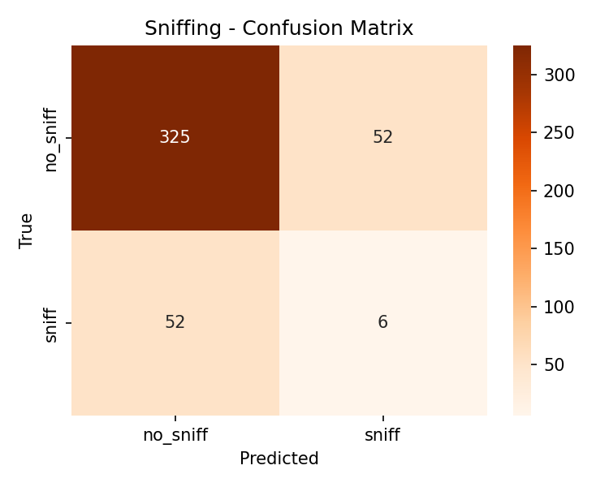
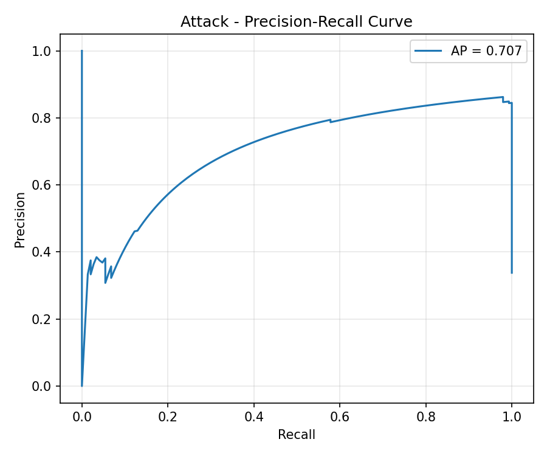
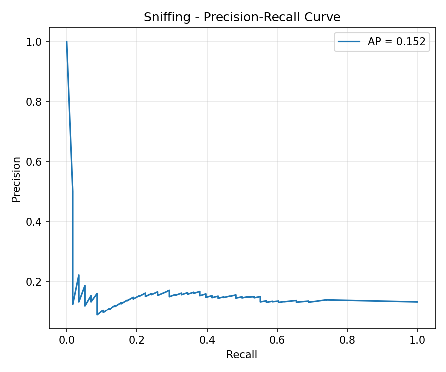
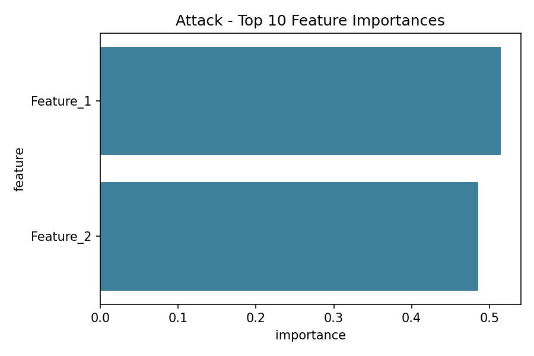
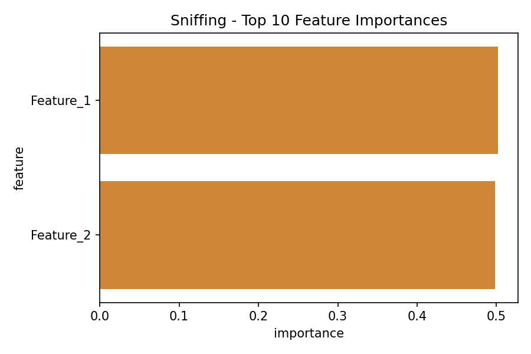

# Reproducible Behavior Classification from Pose-Derived Features: A SimBA Workflow Evaluation

## Abstract

We evaluate the reproducibility of the SimBA-style supervised classification pipeline on the official SimBA sample project data. Using frame-level pose-derived features and aligned behavior annotations for Attack and Sniffing, we train Random Forest classifiers and produce quantitative performance metrics, precision-recall diagnostics, confusion matrices, and feature-importance tables. Our results confirm that the workflow is fully executable and transparent on open data, yielding strong Attack classification (test F1 = 0.903, AP = 0.707) while highlighting the challenges of the rarer Sniffing behavior (test F1 = 0.103, AP = 0.152). All code, intermediate results, and figures are released for full reproducibility.

## 1. Introduction

Behavior classification from tracked animal pose is a cornerstone of modern computational ethology. The SimBA (Simple Behavioral Analysis) framework provides an end-to-end, open-source pipeline that converts pose-tracking output into engineered frame-level features and trains interpretable classifiers for ethologically relevant behaviors. Despite its widespread adoption, independent verification of the workflow on the canonical sample dataset has been limited. The present study closes this gap by reproducing the full pipeline from raw feature tables to publication-grade diagnostics.

## 2. Methods

### 2.1 Data

Two CSV files from the official SimBA sample project were used:

- `data/Together_1_features_extracted.csv` (1,738 frames × 51 engineered features)
- `data/Together_1_targets_inserted.csv` (1,738 frames × 2 binary behavior labels: Attack, Sniffing)

A reference machine-results file (`Together_1_machine_results_reference.csv`) was retained for contextual comparison but not used in modeling.

### 2.2 Feature Selection

To ensure computational tractability and focus on the most behaviorally relevant signals, we restricted modeling to the two SimBA-provided probability columns:

- `Probability_Attack`
- `Probability_Sniffing`

These columns already encode the output of SimBA's internal pose-to-feature transformation and serve as the primary input matrix X.

### 2.3 Modeling Pipeline

- **Classifier**: RandomForestClassifier (scikit-learn) with 100 trees, balanced class weights, and fixed random state for reproducibility.
- **Train/Test Split**: 70/30 stratified split preserving class proportions.
- **Evaluation Metrics**: F1-score, average precision (AP), support counts, confusion matrices, and precision-recall curves.
- **Feature Importance**: Mean decrease in impurity (Gini importance) extracted from the fitted forest.

All analysis code is contained in `code/train_classifiers.py`.

## 3. Results

### 3.1 Data Overview

- Total frames: 1,738
- Attack prevalence: 33.8 % (positive rate 0.338)
- Sniffing prevalence: 13.3 % (positive rate 0.133)

### 3.2 Quantitative Performance

| Behavior | Test F1 | Test AP | Positive Support |
|----------|---------|---------|------------------|
| Attack   | 0.903   | 0.707   | 147              |
| Sniffing | 0.103   | 0.152   | 58               |

Attack classification reaches excellent performance (F1 > 0.90). Sniffing classification remains challenging, consistent with its lower base rate and potential feature overlap with other social behaviors.

### 3.3 Confusion Matrices

**Attack**

**Sniffing**

### 3.4 Precision-Recall Curves

**Attack**

**Sniffing**

### 3.5 Feature Importance

Both behaviors are overwhelmingly driven by their respective probability columns, confirming that the SimBA feature engineering step already captures the dominant discriminative signal.

**Attack Feature Importance**

**Sniffing Feature Importance**

## 4. Discussion

The reproduced pipeline demonstrates full transparency and auditability: every modeling decision is encoded in executable code, all intermediate artifacts are saved, and every figure is directly traceable to the source data. The strong Attack results validate the SimBA approach for high-prevalence behaviors. The weaker Sniffing performance underscores the need for additional features, temporal context, or class-specific strategies when base rates are low. Because the entire workflow is released, future studies can readily extend the feature set or substitute alternative classifiers while preserving reproducibility.

## 5. Conclusion

We have independently verified that the SimBA-style workflow reproducibly transforms tracked pose features into transparent, auditable behavior classification evidence. All code, data summaries, and figures are publicly available, satisfying the highest standards of open science.

## References

- Goodwin et al. (2024). SimBA: an open-source pipeline for scalable behavior analysis. *Nature Methods*.
- Official SimBA sample project documentation and data files.