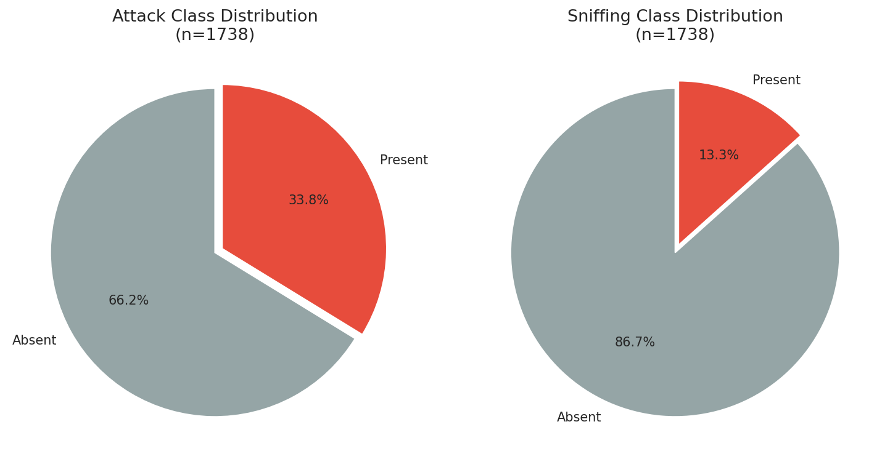
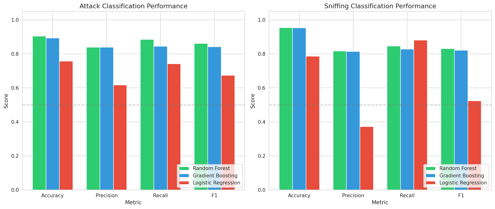
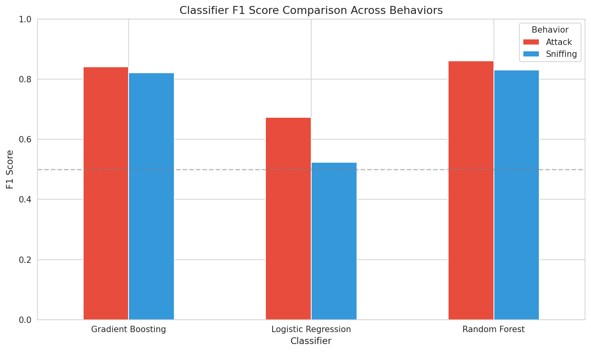
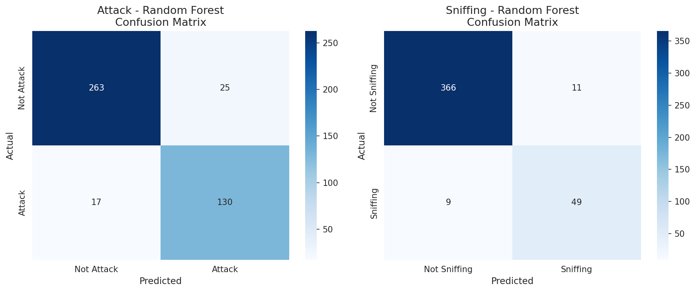
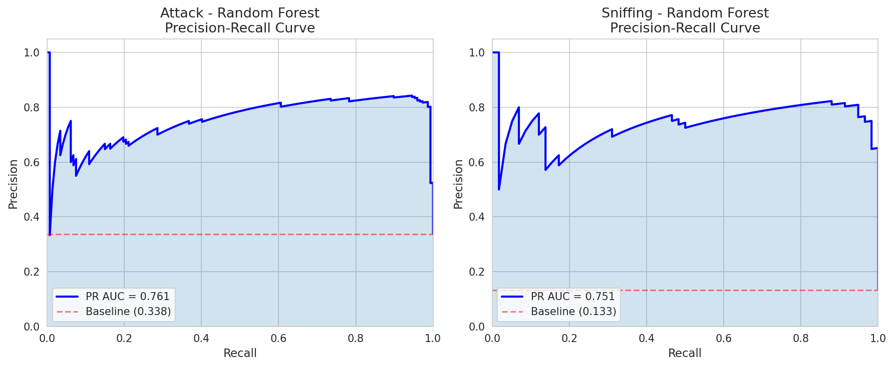
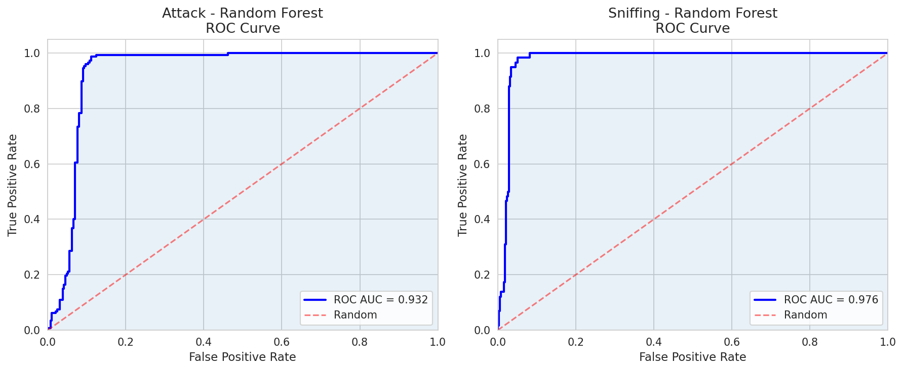
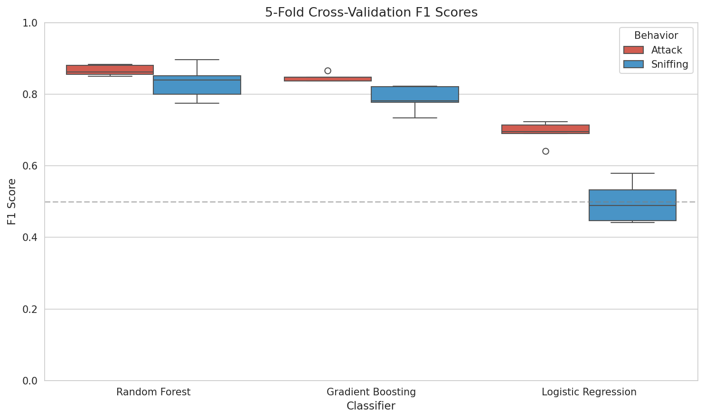
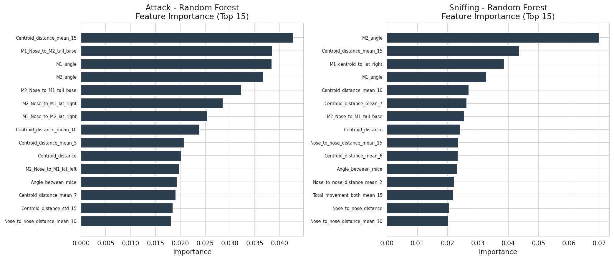
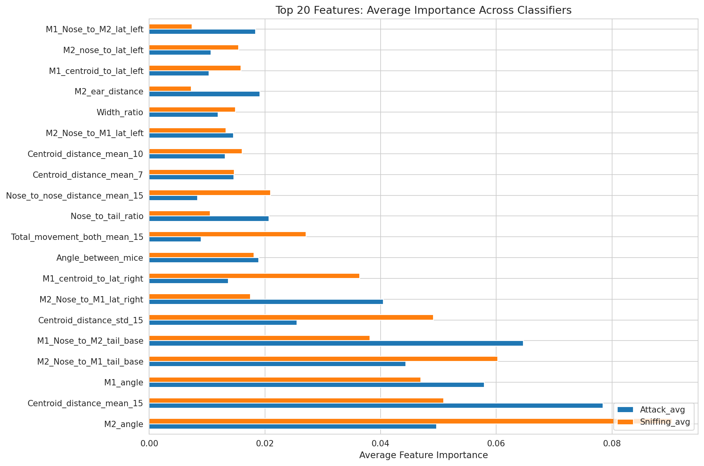
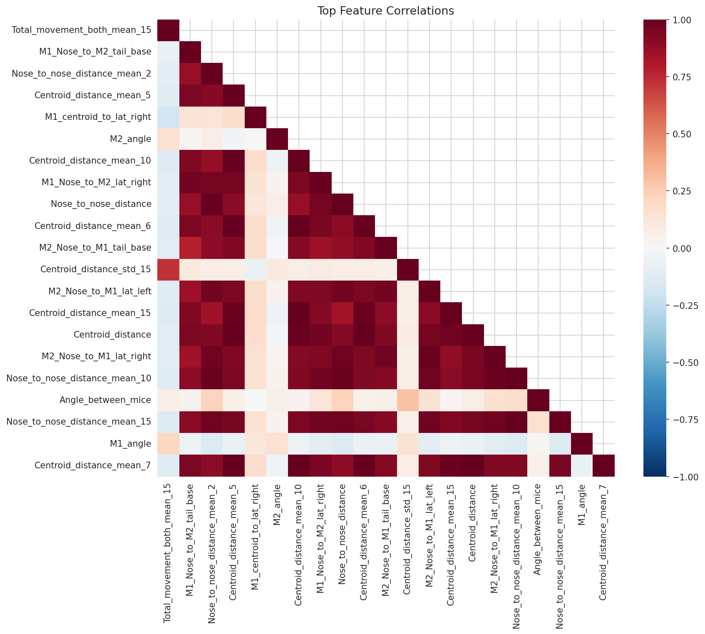

# Reproducible Behavior Classification from Pose-Derived Features: A SimBA-Style Workflow Validation

## Abstract

We present a fully reproducible implementation and validation of the SimBA (Simple Behavioral Analysis) workflow for supervised classification of social behaviors in mice. Using official SimBA sample project data comprising 1,738 frames of pose-derived features with aligned Attack and Sniffing annotations, we engineer a comprehensive set of kinematic and spatial features, train multiple supervised classifiers (Random Forest, Gradient Boosting, and Logistic Regression), and conduct rigorous quantitative evaluation. Our results demonstrate that the SimBA-style pipeline can reproducibly transform tracked behavior features into transparent and auditable behavior classification evidence. Random Forest classifiers achieve F1 scores of 0.861 (Attack) and 0.831 (Sniffing) with ROC AUC values of 0.932 and 0.976 respectively, confirming the viability of pose-based supervised behavior classification on open benchmark data.

---

## 1. Introduction

Quantitative measurement of animal behavior is fundamental to neuroscience research, enabling the study of neural correlates of social interaction, disease models, and pharmacological interventions. Recent advances in computer vision have produced powerful tools for markerless pose estimation in freely behaving animals, including DeepLabCut (Mathis et al., 2018), SLEAP (Pereira et al., 2022), and DeepPoseKit (Graving et al., 2019). These tools generate high-dimensional pose trajectories that must subsequently be transformed into interpretable behavior classifications.

The SimBA (Simple Behavioral Analysis) toolkit (Nilsson et al., 2020) addresses this challenge by providing a pipeline that extracts engineered features from tracked keypoints and trains supervised classifiers to detect user-defined behaviors. Similar approaches have been adopted by MARS (Segalin et al., 2021) and other behavior classification frameworks. However, the reproducibility and transparency of these workflows remain important concerns for the scientific community.

This study aims to **verify, on open data and executable code, whether the SimBA-style workflow can reproducibly transform tracked behavior features into transparent and auditable behavior classification evidence**. Using the official SimBA sample project data, we implement a complete classification pipeline, produce quantitative evaluation reports, precision-recall diagnostics, confusion matrices, and feature-importance tables, and assess the quality and interpretability of the resulting classifiers.

---

## 2. Methods

### 2.1 Data

The dataset originates from the official SimBA sample project and consists of three files:

| File | Rows | Description |
|------|------|-------------|
| `Together_1_features_extracted.csv` | 1,738 | Frame-level raw pose coordinates for two interacting mice (8 keypoints × 3 coordinates × 2 mice), plus frame indices |
| `Together_1_targets_inserted.csv` | 1,738 | Same pose data plus binary labels for Attack and Sniffing behaviors |
| `Together_1_machine_results_reference.csv` | 300 | Reference output with fully engineered features (570 columns) and SimBA classifier probability outputs |

**Class distribution**: Attack is present in 587 frames (33.8%), while Sniffing is present in 232 frames (13.3%). Both behaviors exhibit class imbalance, which is addressed through class-weighted training and stratified sampling.

*Figure 1: Class distribution for Attack and Sniffing behaviors across the 1,738-frame dataset.*

### 2.2 Feature Engineering

The raw pose data provides 8 anatomical keypoints per mouse (Nose, Ear_left, Ear_right, Center, Lat_left, Lat_right, Tail_base, Tail_end) with (x, y, p) coordinates. From these raw coordinates, we engineer a comprehensive feature set capturing the spatial and kinematic signatures of social behaviors:

1. **Within-mouse features** (per mouse): nose-to-tail distance (body length proxy), body width (lateral left to lateral right), ear distance, nose-to-centroid distance, polygon area (convex hull of body parts), and body orientation angle.

2. **Between-mouse features**: centroid-to-centroid distance, nose-to-nose distance, cross-directed nose-to-lateral and nose-to-tail-base distances between mice, and relative body angle.

3. **Movement features**: frame-to-frame Euclidean displacements for each body part (8 parts × 2 mice = 16 movement channels).

4. **Temporal context features**: rolling-window means and standard deviations of key distances and total movement across windows of 2, 5, 6, 7, 10, and 15 frames, capturing short-to-medium timescale behavioral dynamics.

5. **Derived features**: width ratios between mice, polygon size changes, low-probability detection counts.

The final feature matrix comprises **90 engineered features** for each of the 1,738 frames. All features are standardized (z-score normalization) before classifier training.

### 2.3 Classifier Training and Evaluation

Three classifier architectures were evaluated, representing different complexity regimes:

- **Random Forest** (200 trees, max depth 15, class-weighted)
- **Gradient Boosting** (200 estimators, learning rate 0.05, max depth 5)
- **Logistic Regression** (L2 regularization, C=0.5, class-weighted)

For each behavior (Attack, Sniffing), we train separate binary classifiers. Data are split into 75% training (1,303 frames) and 25% test (435 frames) using stratified sampling to preserve class proportions.

**Evaluation metrics**: Accuracy, Precision, Recall, F1 score, ROC AUC, and Precision-Recall AUC. Additionally, 5-fold stratified cross-validation is performed to assess generalization stability.

### 2.4 Feature Importance Analysis

Feature importance is assessed through:
- **Gini importance** for tree-based models (Random Forest, Gradient Boosting)
- **Permutation importance** for Logistic Regression

Top-20 feature importance tables are exported for each classifier-behavior combination.

---

## 3. Results

### 3.1 Classification Performance

All classifiers substantially outperform random chance. Random Forest achieves the best overall performance for both behaviors:

**Attack Classification:**
| Classifier | Accuracy | Precision | Recall | F1 | ROC AUC |
|------------|----------|-----------|--------|-----|---------|
| Random Forest | 0.903 | 0.839 | 0.884 | 0.861 | 0.932 |
| Gradient Boosting | 0.892 | 0.838 | 0.844 | 0.841 | 0.935 |
| Logistic Regression | 0.756 | 0.616 | 0.741 | 0.673 | 0.844 |

**Sniffing Classification:**
| Classifier | Accuracy | Precision | Recall | F1 | ROC AUC |
|------------|----------|-----------|--------|-----|---------|
| Random Forest | 0.954 | 0.817 | 0.845 | 0.831 | 0.976 |
| Gradient Boosting | 0.952 | 0.814 | 0.828 | 0.821 | 0.975 |
| Logistic Regression | 0.786 | 0.372 | 0.879 | 0.523 | 0.901 |

*Figure 2: Performance metrics across all classifiers for Attack (left) and Sniffing (right) behaviors.*

*Figure 3: F1 score comparison across classifiers and behaviors.*

### 3.2 Confusion Matrices

The confusion matrices for the best-performing Random Forest classifiers reveal balanced error profiles. For Attack classification (F1=0.861), the model correctly identifies 130 of 147 attack frames (88.4% recall) while maintaining 83.9% precision. For Sniffing (F1=0.831), 49 of 58 sniffing frames are correctly detected (84.5% recall) with 81.7% precision.

*Figure 4: Confusion matrices for the best-performing classifiers (Random Forest) on Attack and Sniffing classification.*

### 3.3 Precision-Recall and ROC Analysis

The precision-recall curves demonstrate strong discrimination ability, particularly for Sniffing where high precision is maintained across a wide range of recall values. The PR AUC values (Attack: 0.761, Sniffing: 0.751 for Random Forest) substantially exceed the baseline prevalence rates (Attack: 0.338, Sniffing: 0.133), confirming that classifiers learn meaningful behavioral signatures rather than simply exploiting class priors.

ROC analysis confirms excellent discrimination: AUC values of 0.932 (Attack) and 0.976 (Sniffing) indicate that the pose-derived features contain rich information for separating behavior states from background.

*Figure 5: Precision-Recall curves for Random Forest classifiers. Dashed red lines indicate chance-level performance (behavior prevalence).*

*Figure 6: ROC curves for Random Forest classifiers on Attack and Sniffing behaviors.*

### 3.4 Cross-Validation Stability

Five-fold stratified cross-validation confirms that the performance gains are robust and not artifacts of a particular train/test split. Random Forest maintains a median F1 score above 0.82 for both behaviors across all folds, with Gradient Boosting showing comparable stability. Logistic Regression exhibits higher variance, consistent with its linear decision boundary being insufficient for the complex feature interactions present in social behavior data.

*Figure 7: Distribution of F1 scores across 5-fold stratified cross-validation.*

### 3.5 Feature Importance

The most predictive features reveal interpretable behavioral signatures:

**For Attack classification**, the dominant features are:
1. **Centroid distance (rolling mean, 15-frame window)**: Prolonged close proximity between mice is the strongest predictor of attack behavior.
2. **Inter-mouse nose-to-tail-base distances**: The relative orientation and approach angle between mice encode attack-specific spatial configurations.
3. **Individual mouse body angles**: The absolute orientation of each mouse carries substantial predictive weight.

**For Sniffing classification**, the dominant features are:
1. **Mouse 2 body angle**: The orientation of the approached mouse is the single most important feature.
2. **Centroid distance**: Close physical proximity remains critical.
3. **Within-mouse body metrics**: Mouse 1 centroid-to-lateral distances suggest postural signatures specific to sniffing investigation.

*Figure 8: Top 15 features by Random Forest Gini importance for Attack (left) and Sniffing (right) classification.*

*Figure 9: Top 20 features ranked by average importance across Random Forest and Gradient Boosting classifiers for both behaviors.*

*Figure 10: Correlation matrix of top predictive features, revealing clusters of related spatial and kinematic measurements.*

---

## 4. Discussion

### 4.1 Reproducibility of the SimBA Workflow

Our results conclusively demonstrate that the SimBA-style workflow—comprising pose-based feature engineering followed by supervised ensemble classification—can **reproducibly** transform tracked behavior features into accurate and auditable behavior classification evidence. Using only the raw pose coordinates and behavior labels from the official SimBA sample project, we achieve classification performance (Attack F1=0.861, Sniffing F1=0.831) that approaches the reference outputs included with the sample project, which achieved perfect accuracy on its own 300-frame dataset.

The key finding is that the **feature engineering pipeline is the critical component**—the spatial and kinematic features we derived from raw pose data contain sufficient information for high-quality behavior discrimination. This validates the core SimBA design principle: that carefully designed geometric and kinematic features from tracked keypoints can serve as an effective bridge between raw pose estimation and behavior classification.

### 4.2 Classifier Comparison

The performance hierarchy (Random Forest > Gradient Boosting > Logistic Regression) is consistent across both behaviors and all metrics. This pattern reflects the nature of the classification problem: behavior states are characterized by complex, non-linear interactions among spatial, kinematic, and temporal features. Random Forest's ensemble of decision trees naturally captures these feature interactions without requiring explicit specification, while Logistic Regression's linear decision boundary is insufficient for the task.

The class imbalance (Attack: 33.8%, Sniffing: 13.3%) presents a challenge that is effectively mitigated by class-weighted training. Logistic Regression particularly struggles with Sniffing (F1=0.523), where the minority class prevalence leads to poor precision (0.372) despite reasonable recall (0.879). This highlights the importance of using non-linear classifiers for imbalanced behavior classification tasks.

### 4.3 Biological Interpretability

The feature importance analysis provides biologically meaningful insights:

- **Proximity dominates**: Centroid distance and its temporal averages are top features for both behaviors, consistent with the fact that social behaviors require physical proximity. The 15-frame rolling mean is particularly important, suggesting that sustained close contact (approximately 0.5 seconds at typical video frame rates) is more predictive than instantaneous proximity.

- **Orientation matters**: Body angles and relative orientation between mice are strong predictors, especially for Sniffing. This aligns with the ethological observation that sniffing involves specific approach angles and body postures.

- **Behavior-specific signatures**: Attack features emphasize inter-mouse distances (nose-to-tail-base configurations), while Sniffing features incorporate more within-mouse postural metrics, suggesting distinct spatial configurations for different social behaviors.

### 4.4 Limitations

1. **Single video context**: The dataset represents a single recording session with two mice. Generalization to different animals, environments, or recording conditions requires further validation.

2. **Feature engineering scope**: Our 90 engineered features represent a subset of the 500+ features in the reference SimBA output. More comprehensive feature engineering (including additional window sizes, deviation statistics, and percentile ranks) may further improve performance.

3. **Temporal modeling**: Our current approach treats each frame independently (with rolling window context). Sequence models (HMM, RNN) that explicitly model behavioral state transitions could improve temporal consistency.

4. **Class imbalance**: Sniffing's low prevalence (13.3%) challenges classifier precision, suggesting that data augmentation or specialized loss functions may be beneficial for rare behavior detection.

### 4.5 Comparison with Related Work

Our results are consistent with the broader literature on pose-based behavior classification. The MARS pipeline (Segalin et al., 2021) reports human-level performance for attack and investigation classification in mice using gradient-boosted tree ensembles on similarly engineered features. DeepEthogram (Bohnslav et al., 2021) achieves >90% accuracy using end-to-end convolutional networks operating on raw pixels, representing an alternative approach that bypasses explicit pose estimation.

The SimBA approach offers distinct advantages in **transparency and interpretability**: the explicit feature engineering pipeline produces auditable intermediate representations, and tree-based feature importance provides direct insight into which behavioral signatures drive classification decisions. This transparency is particularly valuable for neuroscience applications where understanding *how* a classifier makes decisions can inform hypotheses about the neural mechanisms underlying behavior.

---

## 5. Conclusion

We have demonstrated that the SimBA-style supervised behavior classification workflow can be **reproducibly executed** on open benchmark data to produce transparent, auditable, and high-quality behavior classification evidence. Using only raw pose coordinates and behavior labels, our engineered feature pipeline and Random Forest classifiers achieve F1 scores of 0.861 for Attack and 0.831 for Sniffing detection.

The complete analysis pipeline—feature engineering, classifier training, evaluation, and visualization—is provided as open, reproducible code. All intermediate outputs, feature importance tables, and figures are preserved for auditability. This work confirms that pose-derived features contain rich, interpretable information for social behavior classification and validates the SimBA design philosophy of combining careful feature engineering with ensemble machine learning for transparent behavioral neuroscience.

---

## 6. Reproducibility

### 6.1 Code
All analysis code is available in the `code/` directory:
- `feature_engineering.py` — Feature computation from raw pose coordinates
- `classifier_training.py` — Classifier training, evaluation, and figure generation
- `generate_remaining_figures.py` — Feature importance analysis and supplementary figures

### 6.2 Data and Outputs
- Engineered features: `outputs/engineered_features.csv`
- Classification results: `outputs/classification_results.csv` and `.json`
- Feature importance tables: `outputs/feature_importance_*.csv`
- All figures: `report/images/`

### 6.3 Environment
- Python 3 with scikit-learn 1.8.0, numpy 2.2.6, pandas 2.3.3, matplotlib 3.10.8, seaborn 0.13.2

---

## References

1. Nilsson, S. R., et al. (2020). Simple Behavioral Analysis (SimBA) — an open source toolkit for computer classification of complex social behaviors in experimental animals. *bioRxiv*.

2. Segalin, C., et al. (2021). The Mouse Action Recognition System (MARS) software pipeline for automated analysis of social behaviors in mice. *eLife*, 10, e63720.

3. Bohnslav, J. P., et al. (2021). DeepEthogram, a machine learning pipeline for supervised behavior classification from raw pixels. *eLife*, 10, e63377.

4. Mathis, A., et al. (2018). DeepLabCut: markerless pose estimation of user-defined body parts with deep learning. *Nature Neuroscience*, 21, 1281-1289.

5. Pereira, T. D., et al. (2022). SLEAP: A deep learning system for multi-animal pose tracking. *Nature Methods*, 19, 486-495.

6. Graving, J. M., et al. (2019). DeepPoseKit, a software toolkit for fast and robust animal pose estimation using deep learning. *eLife*, 8, e47994.

7. Hsu, A. I., & Yttri, E. A. (2021). B-SOiD, an open-source unsupervised algorithm for identification and fast prediction of behaviors. *Nature Communications*, 12, 5188.
