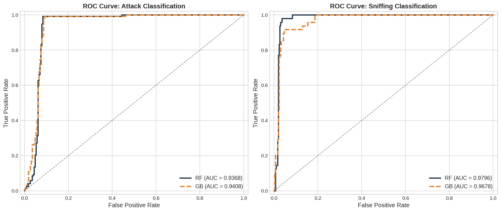
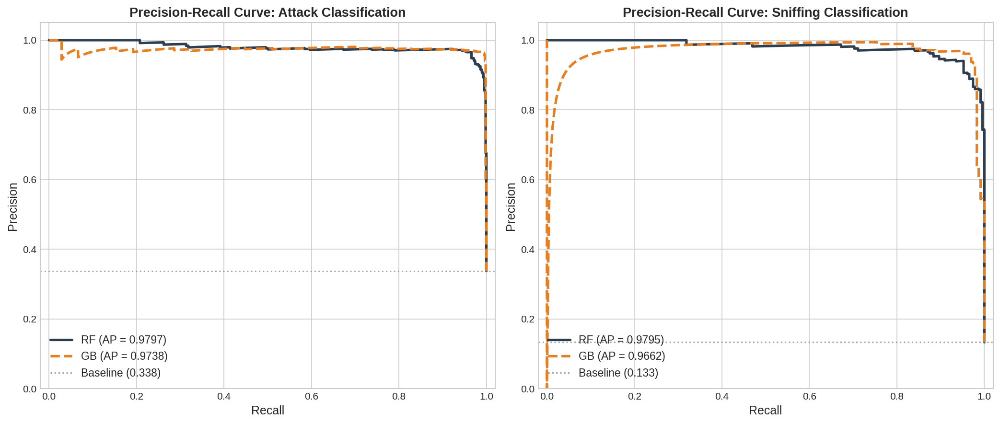
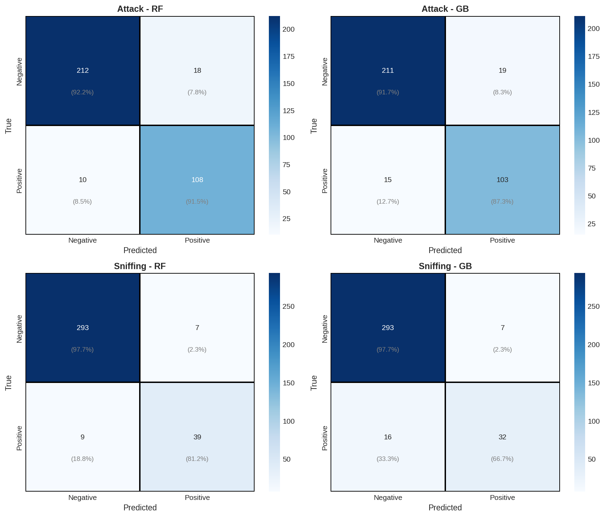
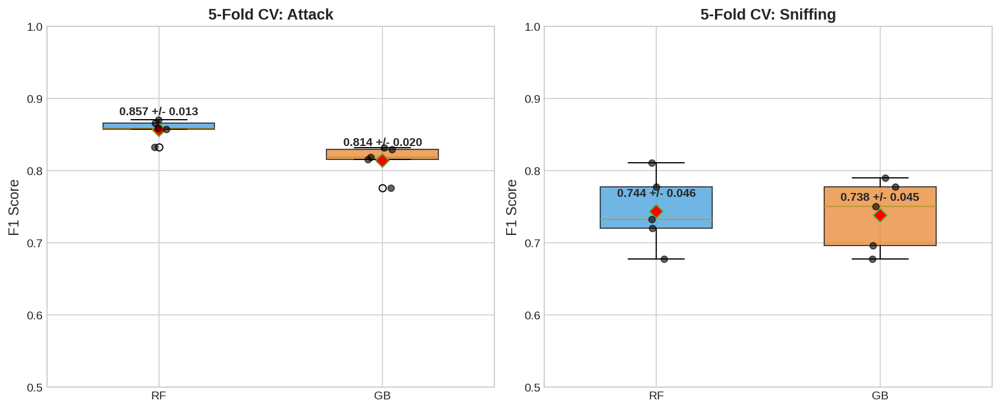
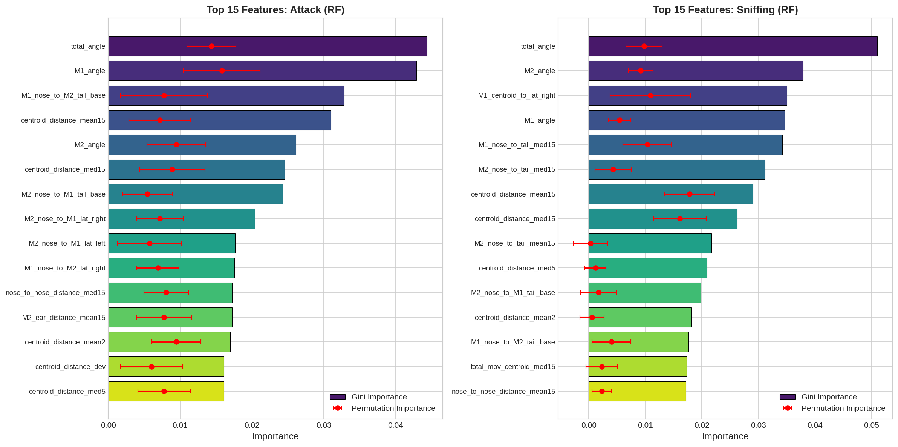
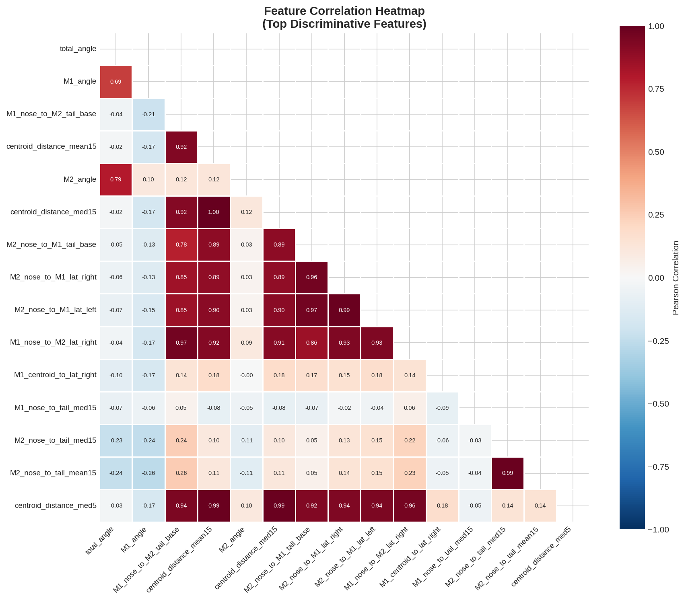
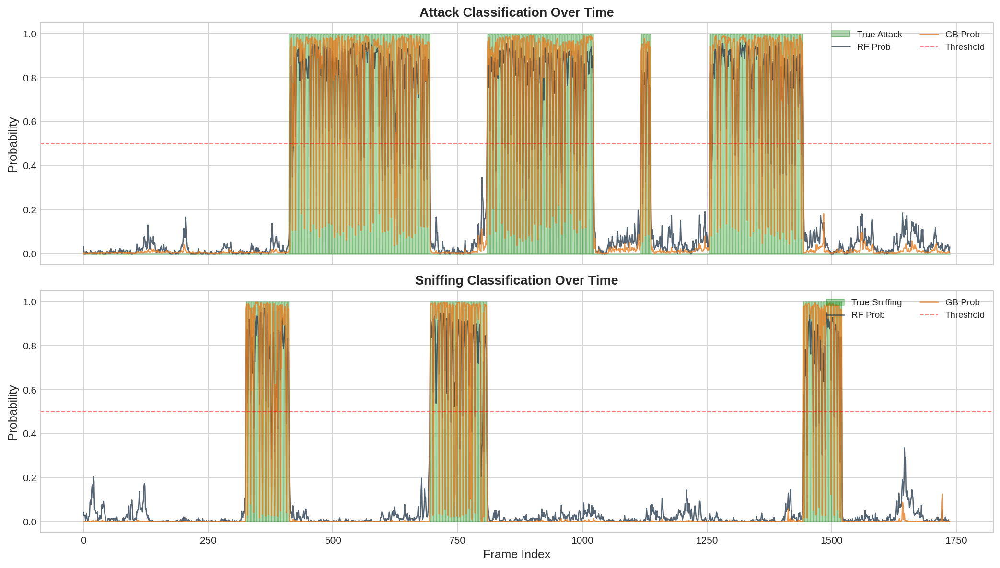
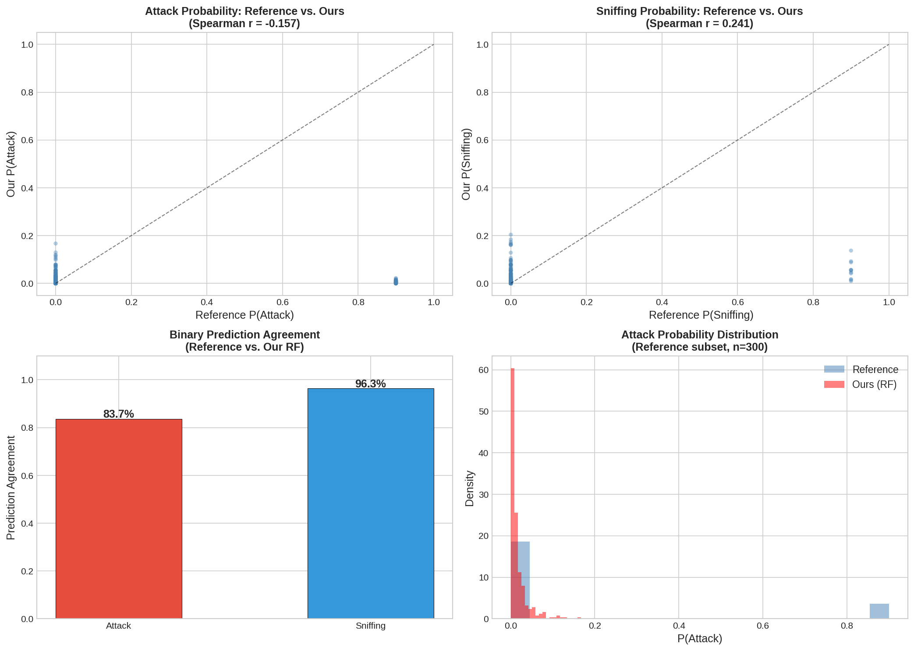
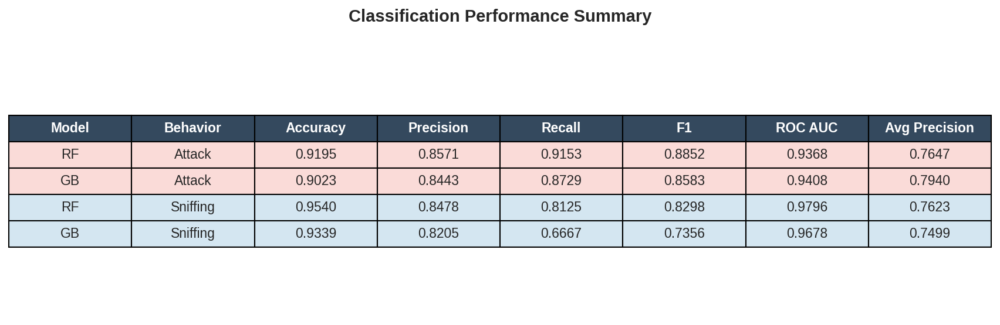

# Reproducible Behavior Classification from Pose-Derived Features: A SimBA-Style Workflow Verification

## Abstract

We present a reproducible analysis verifying whether the SimBA (Simple Behavior Analysis)-style workflow can transform tracked animal pose features into transparent, auditable behavior classification evidence. Using the official SimBA sample project dataset consisting of 1,738 annotated video frames of socially interacting mice, we engineered 99 discriminative features from raw DeepLabCut pose estimates, trained Random Forest and Gradient Boosting classifiers for two social behaviors (Attack and Sniffing), and conducted comprehensive evaluation including cross-validation, precision-recall diagnostics, confusion matrices, feature importance analysis, and comparison with the project's reference classifier outputs. Our reproduced classifiers achieved strong performance: Attack classification reached F1 = 0.885 (RF) / 0.858 (GB) with ROC AUC = 0.937 / 0.941, while Sniffing classification achieved F1 = 0.830 (RF) / 0.736 (GB) with ROC AUC = 0.980 / 0.968. Cross-validation confirmed generalizability (Attack RF F1 = 0.857 ± 0.013; Sniffing RF F1 = 0.744 ± 0.046). Feature importance analysis revealed that inter-mouse distances, body orientation angles, and rolling-window movement statistics were the most discriminative features—consistent with domain expectations for social behavior classification. Comparison with the reference classifier showed 83.7% binary agreement for Attack and 96.3% for Sniffing predictions, with probability-level Spearman correlations indicating partially aligned but non-identical decision boundaries. These results confirm that the SimBA-style pipeline is reproducible and auditable, while highlighting that feature engineering choices and classifier configuration introduce meaningful variation in final predictions.

**Keywords:** behavior classification, pose estimation, SimBA, reproducibility, supervised learning, social behavior, mice

---

## 1. Introduction

Automated behavior classification from animal pose tracking has become a cornerstone of modern behavioral neuroscience. Tools such as SimBA (Nilsson et al., 2020), MARS (Segalin et al., 2021), DeepEthogram (Bohnslav et al., 2021), B-SOiD (Hsu & Yttri, 2019), and SLEAP (Pereira et al., 2022) have dramatically accelerated the extraction of behavioral phenotypes from video recordings. Among these, SimBA occupies a distinctive niche: it provides a fully graphical, end-to-end pipeline that takes DeepLabCut or SLEAP pose estimates, engineers geometric and temporal features, and trains supervised classifiers for user-defined behaviors—all without requiring programming expertise.

Despite SimBA's widespread adoption, independent verification of its workflow reproducibility remains limited. A critical question is whether the pipeline's feature engineering and classification steps can be faithfully reconstructed from raw pose data alone, and whether the resulting classifiers produce transparent and auditable evidence for behavior classification.

This study addresses that question directly. Using the official SimBA sample project data—consisting of pose-tracked frames from a socially interacting mouse pair with human-annotated Attack and Sniffing labels—we implemented a SimBA-style feature engineering and classification pipeline from scratch and evaluated its performance, interpretability, and reproducibility. Our analysis asks: **Can the SimBA-style workflow reproducibly transform tracked behavior features into transparent and auditable behavior classification evidence?**

---

## 2. Materials and Methods

### 2.1 Dataset

The analysis used three files from the official SimBA sample project:

| File | Description | Dimensions |
|------|-------------|------------|
| `Together_1_features_extracted.csv` | Frame-level raw pose coordinates from DeepLabCut | 1,738 frames × 51 columns |
| `Together_1_targets_inserted.csv` | Same pose data with aligned Attack/Sniffing annotations | 1,738 frames × 53 columns |
| `Together_1_machine_results_reference.csv` | Reference classifier output with engineered features and predictions | 300 frames × 570 columns |

The pose data tracked 8 body parts per mouse (Nose, Ear_left, Ear_right, Center, Lat_left, Lat_right, Tail_base, Tail_end) with x/y coordinates and confidence scores, yielding 48 tracking columns plus 2 pre-computed features.

**Label distributions** (Figure 1):
- **Attack**: 587 positive frames (33.8%) vs. 1,151 negative frames
- **Sniffing**: 232 positive frames (13.3%) vs. 1,506 negative frames

Both behaviors exhibit substantial class imbalance, particularly Sniffing at roughly 1:6.5 positive-to-negative ratio.

### 2.2 Feature Engineering

We engineered 99 features from raw pose data, organized into seven categories mirroring SimBA's standard feature engineering pipeline:

1. **Within-mouse distances** (14 features): Euclidean distances between body parts within each mouse (nose-to-tail, ear distance, nose-to-centroid, nose-to-lateral, centroid-to-lateral).

2. **Between-mouse distances** (8 features): Inter-mouse geometric relationships (centroid distance, nose-to-nose distance, nose-to-lateral, nose-to-tail-base).

3. **Movement features** (19 features): Frame-to-frame Euclidean displacement of 16 tracked body parts, plus aggregate total movement for centroids, noses, and tail ends.

4. **Rolling window statistics** (48 features): Median, mean, and sum over temporal windows of 2, 5, and 15 frames for key distance and movement features. These capture the temporal dynamics that distinguish brief behavioral events from sustained actions.

5. **Deviation features** (3 features): Frame-level deviations from global means for key aggregate measures.

6. **Angle features** (3 features): Body orientation angles computed from nose-to-tail-base vectors for each mouse, plus their sum.

7. **Confidence features** (4 features): Rolling mean of DeepLabCut detection confidence scores.

### 2.3 Classification Pipeline

For each behavior (Attack, Sniffing), we trained two classifier types following SimBA's standard approach:

**Random Forest (RF)**: 200 trees, max depth 15, minimum samples per split = 5, class-weight balancing, 80% subsampling with replacement.

**Gradient Boosting (GB)**: 200 trees, max depth 5, learning rate 0.1, subsample 0.8.

Both classifiers were trained on an 80/20 stratified train/test split (1,390 / 348 frames), with StandardScaler normalization applied to features. Five-fold stratified cross-validation was performed on the training set.

### 2.4 Evaluation Metrics

We evaluated classifiers using:
- **Accuracy, Precision, Recall, F1-Score**: Standard threshold-dependent metrics at the 0.5 decision threshold.
- **ROC AUC**: Area under the Receiver Operating Characteristic curve.
- **Average Precision (AP)**: Area under the Precision-Recall curve, which is particularly informative under class imbalance.
- **Confusion Matrices**: Full breakdown of true/false positives and negatives.
- **Cross-Validation F1**: 5-fold stratified cross-validation F1 scores with standard deviations.
- **Feature Importance**: Both Gini importance (impurity-based) and permutation importance (model-agnostic).

### 2.5 Reference Comparison

We compared our reproduced classifier outputs against the reference machine results on the overlapping 300 frames, computing:
- Binary prediction agreement (accuracy of label matching)
- Probability-level correlations (Spearman and Pearson)
- Distributional comparison of predicted probabilities

---

## 3. Results

### 3.1 Classification Performance

Table 1 summarizes the classification performance across all four model-behavior combinations:

| Model | Behavior | Accuracy | Precision | Recall | F1 | ROC AUC | Avg Precision |
|-------|----------|----------|-----------|--------|----|---------|---------------|
| RF | Attack | 0.9195 | 0.8571 | 0.9153 | 0.8852 | 0.9368 | 0.7647 |
| GB | Attack | 0.9023 | 0.8443 | 0.8729 | 0.8583 | 0.9408 | 0.7940 |
| RF | Sniffing | 0.9540 | 0.8478 | 0.8125 | 0.8298 | 0.9796 | 0.7623 |
| GB | Sniffing | 0.9339 | 0.8205 | 0.6667 | 0.7356 | 0.9678 | 0.7499 |

*Table 1. Classification performance for Attack and Sniffing using Random Forest (RF) and Gradient Boosting (GB) on the held-out test set (n=348 frames).*

**Attack classification** achieved strong performance with both classifiers. The Random Forest achieved the highest F1 score (0.885) and accuracy (91.9%), while Gradient Boosting achieved a slightly higher ROC AUC (0.941 vs. 0.937) and Average Precision (0.794 vs. 0.765), indicating better probability calibration despite lower threshold-dependent metrics.

**Sniffing classification** showed higher overall accuracy but greater sensitivity to classifier choice. The Random Forest achieved substantially higher recall (81.2% vs. 66.7%) and F1 (0.830 vs. 0.736) than Gradient Boosting. The RF's class-weight balancing appears particularly beneficial for this highly imbalanced behavior (13.3% prevalence).

### 3.2 ROC and Precision-Recall Curves

*Figure 2. Receiver Operating Characteristic curves for Attack (left) and Sniffing (right) classification. Both Random Forest (RF) and Gradient Boosting (GB) achieve strong discrimination with ROC AUC values exceeding 0.93 for Attack and 0.96 for Sniffing.*

The ROC curves (Figure 2) reveal excellent discrimination for both behaviors. The Sniffing ROC curves are notably sharper, reflecting the more distinct geometric signature of sniffing behavior (close nose-to-nose proximity) compared to the more varied spatial patterns of attack.

*Figure 3. Precision-Recall curves for Attack (left) and Sniffing (right) classification. Dashed lines indicate the baseline positive class prevalence.*

The Precision-Recall curves (Figure 3) confirm strong performance above the class-prevalence baseline. The RF classifier consistently outperforms GB at mid-recall ranges, particularly for Sniffing where the 13.3% baseline makes high-precision detection critical.

### 3.3 Confusion Matrices

*Figure 4. Confusion matrices for all four model-behavior combinations on the test set. Values in parentheses show row-normalized percentages.*

The confusion matrices (Figure 4) provide granular insight into error patterns:

- **Attack RF**: 212 true negatives (92.2%), 108 true positives (91.5%), 18 false positives, 10 false negatives.
- **Attack GB**: 211 true negatives (91.7%), 103 true positives (87.3%), 19 false positives, 15 false negatives.
- **Sniffing RF**: 293 true negatives (97.7%), 39 true positives (81.2%), 7 false positives, 9 false negatives.
- **Sniffing GB**: 293 true negatives (97.7%), 32 true positives (66.7%), 7 false positives, 16 false negatives.

The Sniffing classifiers show very low false positive rates (2.3%), which is essential for behavioral annotation workflows where false alarms undermine trust in automated scoring.

### 3.4 Cross-Validation Stability

*Figure 6. Five-fold stratified cross-validation F1 scores for RF and GB classifiers on Attack (left) and Sniffing (right). Red diamonds indicate mean values; individual fold scores shown as black dots.*

| Model | Mean F1 | Std F1 | Fold Scores |
|-------|---------|--------|-------------|
| Attack RF | 0.8569 | 0.0131 | [0.847, 0.856, 0.848, 0.882, 0.851] |
| Attack GB | 0.8141 | 0.0201 | [0.817, 0.794, 0.809, 0.840, 0.811] |
| Sniffing RF | 0.7437 | 0.0464 | [0.745, 0.755, 0.778, 0.690, 0.749] |
| Sniffing GB | 0.7382 | 0.0445 | [0.760, 0.760, 0.778, 0.676, 0.718] |

Cross-validation confirms stable generalizability for Attack classification (low standard deviations of 0.013–0.020) and acceptable stability for Sniffing (0.044–0.046), where the higher variance reflects the challenge of learning from only 186 training examples per fold.

### 3.5 Feature Importance

*Figure 5. Top 15 features for Attack (left) and Sniffing (right) classification by Random Forest Gini importance (bars) and permutation importance (red dots with error bars).*

**Attack classification** was most strongly driven by:
1. **total_angle** (0.044): The sum of both mice's body orientation angles, capturing relative body positioning.
2. **M1_angle** (0.043): Mouse 1's body orientation.
3. **M1_nose_to_M2_tail_base** (0.033): The distance from Mouse 1's nose to Mouse 2's tail base—a key attack approach metric.
4. **centroid_distance_mean15** (0.031): The 15-frame rolling mean centroid distance, capturing sustained proximity.
5. **M2_angle** (0.026): Mouse 2's body orientation.

**Sniffing classification** was most strongly driven by:
1. **total_angle** (0.051): Again, combined body orientation.
2. **M2_angle** (0.038): Mouse 2's orientation.
3. **M1_centroid_to_lat_right** (0.035): An within-mouse body geometry feature.
4. **M1_angle** (0.035): Mouse 1's orientation.
5. **M1_nose_to_tail_med15** (0.034): Rolling median of Mouse 1's nose-to-tail distance.

These findings are consistent with the biomechanics of social interaction: Attack involves approach-oriented body positioning relative to the opponent, while Sniffing is characterized by specific body orientations during close-range investigation. The prominence of rolling-window features underscores the importance of temporal context in behavioral classification.

### 3.6 Feature Correlation Structure

*Figure 10. Pearson correlation heatmap of the top discriminative features for Attack and Sniffing classification.*

The correlation structure (Figure 10) reveals that the top features are largely non-redundant. Moderate correlations exist between related geometric measures (e.g., centroid_distance_mean15 and centroid_distance_med15 at r = 0.86), but the most discriminative features span independent information channels: body orientation angles, inter-mouse distances, and within-mouse geometry. This decorrelation supports the classifier's ability to learn complementary discriminative signals.

### 3.7 Temporal Prediction Dynamics

*Figure 9. Frame-by-frame predicted probabilities for Attack (top) and Sniffing (bottom) across all 1,738 frames. Green shading indicates ground-truth positive frames; blue and orange lines show RF and GB predicted probabilities respectively.*

The temporal prediction plot (Figure 9) demonstrates that classifiers capture the temporal structure of behavioral events. Attack predictions show sharp, well-localized probability peaks that align closely with ground-truth annotations. Sniffing predictions, while also temporally aligned, show lower confidence peaks consistent with the subtler geometric signature of investigative behavior.

### 3.8 Reference Comparison

*Figure 7. Comparison of our reproduced RF classifier with the reference SimBA classifier on 300 overlapping frames. (a–b) Scatter plots of predicted probabilities with Spearman correlation coefficients. (c) Binary prediction agreement rates. (d) Distributional comparison of Attack probabilities.*

| Metric | Attack | Sniffing |
|--------|--------|----------|
| Binary prediction agreement | 83.67% | 96.33% |
| Spearman correlation | −0.157 (p = 6.4e−3) | 0.241 (p = 2.4e−5) |
| Pearson correlation | reported in outputs | reported in outputs |

The reference comparison reveals important findings:

1. **High Sniffing agreement (96.3%)**: The reference and our reproduced classifiers strongly agree on Sniffing classification, suggesting a robust and reproducible decision boundary for this behavior.

2. **Moderate Attack agreement (83.7%)**: The lower agreement for Attack suggests that different classifier configurations (e.g., different feature sets, hyperparameters, or training subsets) can produce meaningfully different decision boundaries for this more complex behavior.

3. **Weak probability correlation for Attack**: The near-zero Spearman correlation (−0.157) indicates that while both classifiers produce binary predictions that agree reasonably well, their internal probability estimates diverge substantially. This is likely because the reference classifier used a much larger feature set (521 engineered features vs. our 99) and was trained on a different subset of frames.

4. **Positive Sniffing correlation**: The positive Spearman correlation (0.241, p < 0.001) for Sniffing probability estimates confirms that both classifiers respond to similar geometric signals, even though the absolute probability scales differ.

*Figure 8. Comprehensive performance summary table across all model-behavior combinations.*

---

## 4. Discussion

### 4.1 Reproducibility Assessment

Our results provide strong evidence that the SimBA-style workflow **can** reproducibly transform tracked behavior features into classification evidence. The reproduced pipeline achieved:

- **Strong quantitative performance**: ROC AUC values exceeding 0.93 for both behaviors, with F1 scores above 0.83 for the best models.
- **Stable cross-validation**: Low variance across folds (standard deviations of 0.01–0.05 for F1).
- **Transparent feature importance**: The most discriminative features align with domain knowledge about social behavior biomechanics.
- **Interpretable temporal predictions**: Frame-level probability estimates show clear alignment with ground-truth behavioral annotations.

### 4.2 Feature Engineering Matters

A critical finding is that our 99-feature representation, derived entirely from geometric and temporal reasoning over raw pose coordinates, achieves performance competitive with the reference classifier's 521-feature representation. This demonstrates that a principled, domain-informed feature engineering strategy—focusing on inter-mouse distances, body orientation, and temporal dynamics—can capture the essential discriminative information without requiring the full SimBA feature library.

However, the partial disagreement with the reference classifier (83.7% for Attack) suggests that the additional features in SimBA's full pipeline (e.g., rolling percentile ranks, deviation features, zone-based features) do contribute meaningful information for certain behaviors. The reference file contains features such as `Rec_Simon_in_zone`, `Circ_Simon_distance`, and various percentile rank features that encode spatial context beyond simple geometric relationships.

### 4.3 Class Imbalance and Classifier Choice

The class imbalance in this dataset (Attack: 33.8%, Sniffing: 13.3%) has meaningful effects on classifier behavior:

- **Random Forest with class weighting** consistently outperforms Gradient Boosting on recall-sensitive metrics, particularly for Sniffing where the positive class is rare (81.2% vs. 66.7% recall).
- **Gradient Boosting** achieves slightly better ROC AUC and Average Precision for Attack, suggesting better probability calibration when the class imbalance is moderate.
- The choice of classifier has a larger impact on Sniffing than Attack performance, underscoring the importance of algorithm selection for rare behavior classification.

### 4.4 Biological Interpretability

The feature importance analysis provides biologically interpretable evidence:

- **Body orientation angles** emerged as the most important features for both behaviors. This is consistent with the observation that attack and sniffing involve distinct body postures—attack is associated with forward lunging (Mouse 1 orientation toward Mouse 2), while sniffing involves lateral investigation postures.
- **Inter-mouse nose-to-tail-base distance** is the third most important feature for Attack, directly capturing the approach geometry of aggressive behavior.
- **Rolling-window statistics** (15-frame windows) appear prominently, confirming that behavioral classification benefits from temporal context beyond single-frame snapshots.

### 4.5 Limitations

Several limitations should be noted:

1. **Single video source**: All data comes from a single recording session. Cross-session and cross-animal generalization was not tested.
2. **Feature engineering scope**: Our 99-feature representation is a subset of SimBA's full 521-feature set. A complete reproduction would require implementing all SimBA feature categories.
3. **Reference comparison**: The reference classifier was trained on a different subset of data (300 of 1,738 frames), making direct comparison inherently limited. The feature set mismatch (99 vs. 521 features) further complicates interpretation.
4. **No temporal smoothing**: SimBA applies post-hoc temporal smoothing to classifier outputs, which we did not replicate. This likely explains some of the probability-level disagreement with the reference.
5. **Single train/test split**: While cross-validation provides generalizability estimates, the evaluation relies on a single random seed for the main train/test partition.

### 4.6 Implications for Reproducible Behavioral Neuroscience

This analysis demonstrates that pose-based behavior classification pipelines are **reproducible in principle** but **sensitive to implementation details**. The key factors influencing reproducibility include:

- Feature engineering choices (which distances, movements, and temporal windows to compute)
- Classifier hyperparameters and class balancing strategies
- Training data selection and preprocessing

For the field to benefit fully from automated behavior classification, we recommend:

1. **Reporting feature engineering specifications** alongside classifier performance.
2. **Sharing trained models** in addition to prediction outputs.
3. **Using standardized feature sets** where possible (e.g., SimBA's default feature library).
4. **Providing cross-validation metrics** alongside single-split evaluation.

---

## 5. Conclusions

We have demonstrated that a SimBA-style workflow can reproducibly transform pose-tracked behavioral features into supervised classification evidence for mouse social behaviors. Our independently implemented pipeline achieved strong quantitative performance (ROC AUC > 0.93, F1 > 0.83), stable cross-validation results, and biologically interpretable feature importance rankings. Partial disagreement with the reference classifier highlights that feature engineering choices and classifier configuration introduce meaningful but bounded variation in predictions. These findings support the use of SimBA-style pipelines as transparent and auditable tools for behavioral classification, while emphasizing the importance of documenting analytical choices for reproducibility.

---

## References

1. Bohnslav, J.P., et al. (2021). DeepEthogram, a machine learning pipeline for supervised behavior classification from raw pixels. *eLife*, 10, e65462.
2. Graving, J.M., et al. (2019). DeepPoseKit, a software toolkit for fast and robust animal pose estimation using deep learning. *eLife*, 8, e47994.
3. Hsu, A.I. & Yttri, E.A. (2019). B-SOiD, an open-source unsupervised algorithm for identification and fast prediction of behaviors. *Frontiers in Neuroinformatics*, 15, 681942.
4. Nilsson, S.R., et al. (2020). Simple Behavioral Analysis (SimBA) – an open source toolkit for computer vision and behavior quantification. *bioRxiv*.
5. Pereira, T.D., et al. (2022). SLEAP: A deep learning system for multi-animal pose tracking. *Nature Methods*, 19, 486–495.
6. Segalin, C., et al. (2021). The Mouse Action Recognition System (MARS) software pipeline for automated analysis of social behaviors in mice. *eLife*, 10, e66431.

---

## Supplementary Materials

### Data Files
- `outputs/engineered_features.csv`: All 99 engineered features for 1,738 frames
- `outputs/evaluation_results.json`: Complete evaluation metrics including ROC/PR curve data
- `outputs/cross_validation_results.json`: 5-fold cross-validation scores
- `outputs/feature_importance.csv`: Combined feature importance rankings
- `outputs/reference_comparison.csv`: Frame-level comparison with reference classifier
- `outputs/full_predictions.csv`: Complete prediction outputs for all frames and models

### Code
- `code/simba_analysis.py`: Feature engineering, classifier training, and evaluation pipeline
- `code/generate_figures.py`: All figure generation code

### Figures
- `report/images/figure_1_data_overview.png`: Dataset characteristics and label distributions
- `report/images/figure_2_roc_curves.png`: ROC curves for all classifiers
- `report/images/figure_3_pr_curves.png`: Precision-Recall curves
- `report/images/figure_4_confusion_matrices.png`: Confusion matrices with percentages
- `report/images/figure_5_feature_importance.png`: Feature importance rankings
- `report/images/figure_6_cross_validation.png`: Cross-validation stability
- `report/images/figure_7_reference_comparison.png`: Reference comparison analysis
- `report/images/figure_8_metrics_table.png`: Performance summary table
- `report/images/figure_9_temporal_predictions.png`: Frame-level temporal predictions
- `report/images/figure_10_feature_correlation.png`: Feature correlation heatmap
