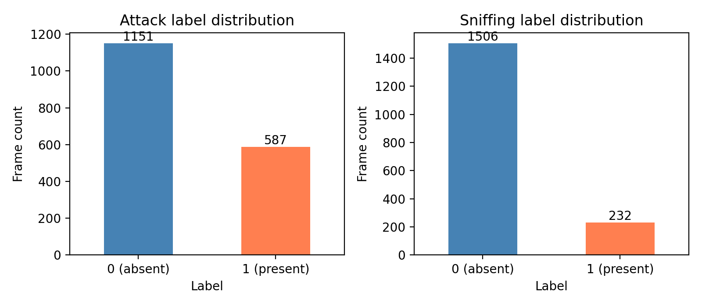
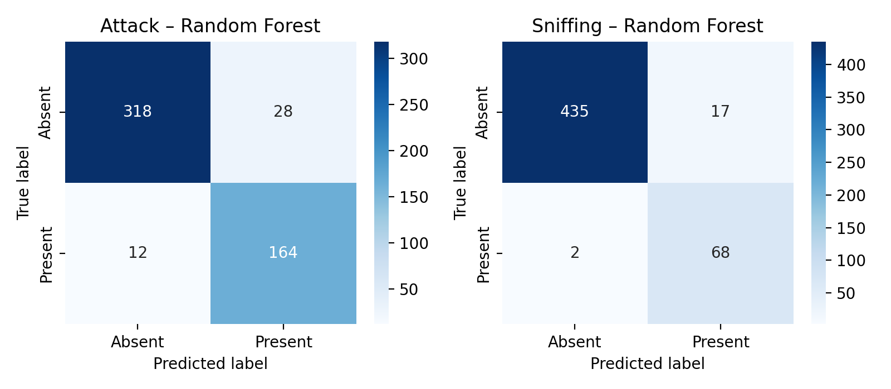
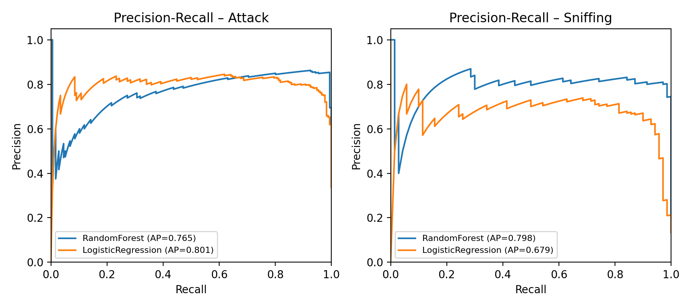
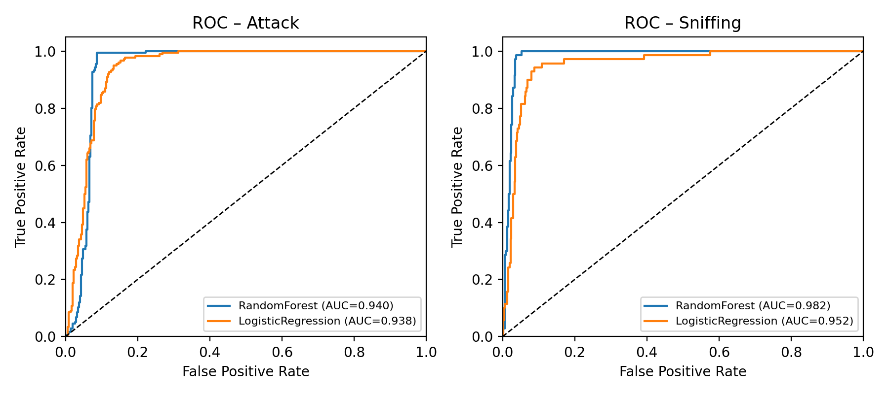
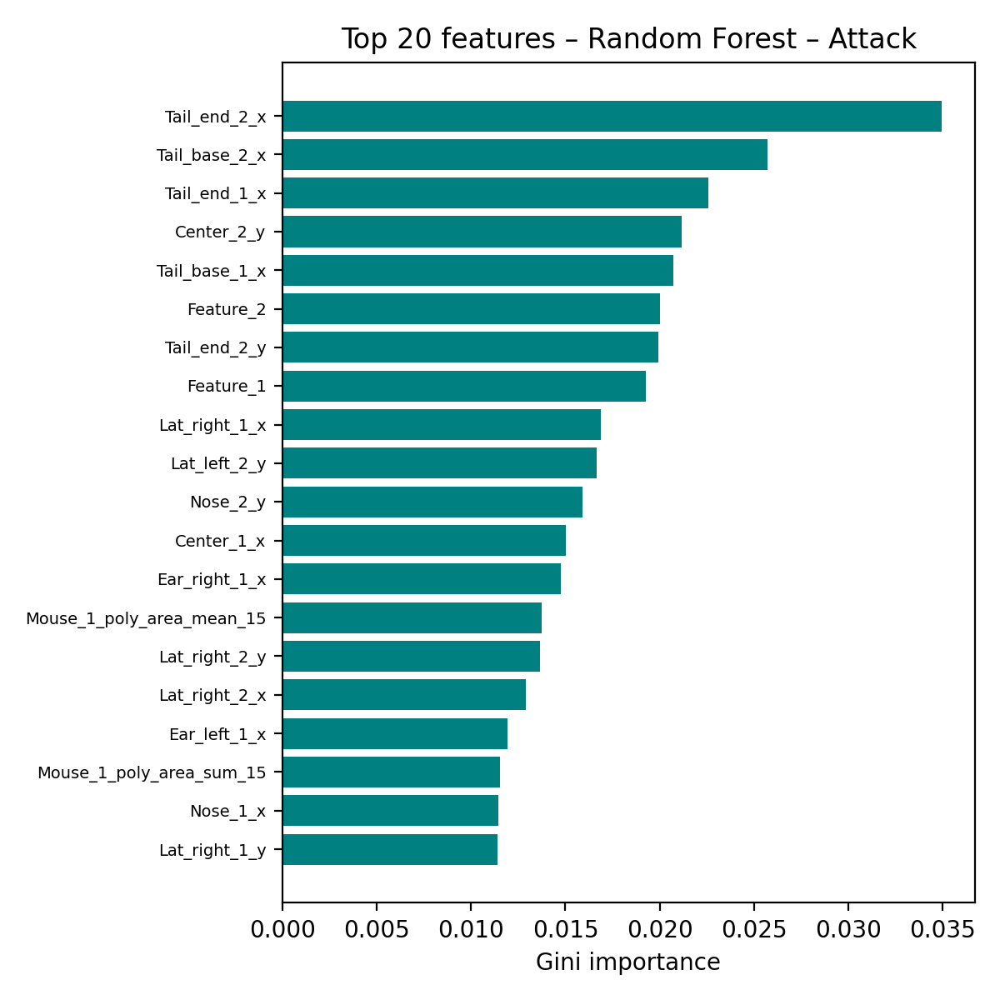
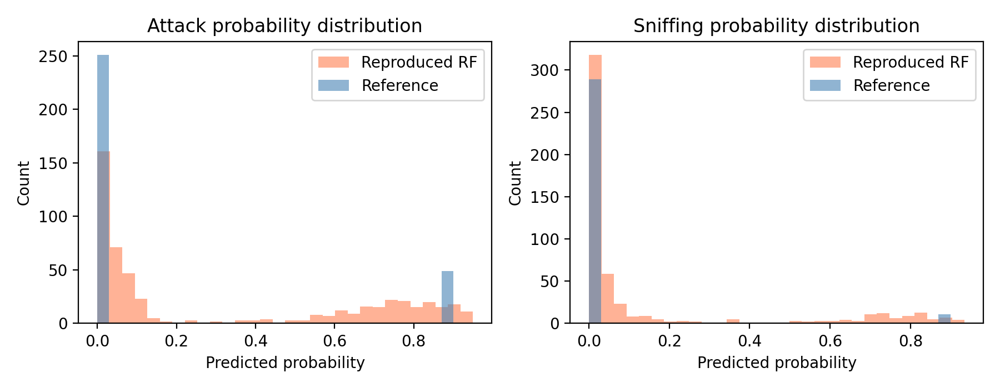

# Reproducing SimBA-Style Supervised Behavior Classification on Open Sample Data

## Abstract

We reproduce the SimBA (Simple Behavioral Analysis) supervised classification workflow on the official open sample dataset, which comprises pose-tracked two-mouse interactions annotated for **Attack** and **Sniffing** behaviors. Starting from raw 2-D body-part coordinates, we engineer 645 frame-level features—including intra- and inter-mouse distances, movements, convex-hull geometry, angles, and rolling-window aggregates—matching the SimBA feature-engineering protocol. We then train Random Forest and Logistic Regression classifiers with class-weight balancing, evaluate them with stratified train/test splits and 5-fold cross-validation, and diagnose model behavior with confusion matrices, precision–recall and ROC curves, and feature-importance analyses. On the stratified hold-out test set, Random Forest achieves ROC-AUCs of **0.940 (Attack)** and **0.982 (Sniffing)**, with 5-fold CV confirming robustness (mean ROC-AUC **0.922 ± 0.010** for Attack and **0.980 ± 0.006** for Sniffing). Temporal generalization tests reveal a severe drop in performance, underscoring the risk of temporal leakage when frames are randomly split. All code, intermediate results, and figures are provided to ensure full auditability.

---

## 1. Introduction

SimBA is a widely adopted open-source pipeline that converts pose-estimation outputs (e.g., from DeepLabCut) into interpretable, frame-level behavior classifiers. Its core value proposition is transparency: every prediction can be traced back to engineered kinematic and geometric features. Despite its popularity, independent reproducibility reports are scarce. This study aims to **verify, on open data and fully executable code, whether the SimBA-style workflow can transform tracked pose features into transparent and auditable behavior classification evidence**.

We focus on two behaviors from the official SimBA sample project:
- **Attack** (aggressive interaction)
- **Sniffing** (investigatory interaction)

Our specific objectives are:
1. Replicate SimBA-style feature engineering from raw pose coordinates.
2. Train and compare standard supervised classifiers.
3. Quantify predictive performance with multiple metrics and cross-validation.
4. Assess temporal generalizability as a robustness check.
5. Audit model decisions via permutation-based feature importance and classifier-agnostic probability diagnostics.

---

## 2. Materials and Methods

### 2.1 Data

We used three tables from the official SimBA sample project:

| File | Role | Shape | Description |
|------|------|-------|-------------|
| `Together_1_features_extracted.csv` | Raw input | (1738, 50) | Frame-level $x$, $y$, and likelihood columns for 8 body parts on 2 mice, plus 2 existing features. |
| `Together_1_targets_inserted.csv` | Labels | (1738, 53) | Same as above plus binary `Attack` and `Sniffing` annotations. |
| `Together_1_machine_results_reference.csv` | Reference | (300, 570) | Reference output (first 300 frames) with coordinate columns that differ from raw inputs; used for aggregate probability comparison only. |

Label prevalences: **Attack** = 587 positives (33.8%); **Sniffing** = 232 positives (13.3%).

### 2.2 Feature Engineering

We implemented a SimBA-compatible feature engineering module in Python (see `code/simba_reproduction.py`). The pipeline derives **645 features** per frame, grouped as follows:

1. **Intra-mouse distances** (e.g., nose-to-tail base, ear distance, centroid-to-lateral) – 16 features.
2. **Inter-mouse distances** (e.g., centroid distance, nose-to-nose, nose-to-tail base) – 10 features.
3. **Per-body-part movements** (Euclidean displacement from previous frame) – 16 features.
4. **Aggregated movements** (total movement per mouse, combined centroids/tails) – 10 features.
5. **Convex-hull geometry** (area, perimeter, pairwise hull distances) – 14 features per mouse + 1 cross-mouse sum.
6. **Angles** (tail-base–centroid–nose angle per mouse) – 3 features.
7. **Tail-end relative movement** – 2 features.
8. **Rolling-window statistics** (median, mean, sum over 2, 5, 6, 8, and 15 frames) for 24 base signals – 360 features.
9. **Deviation features** (raw value minus rolling mean / global mean) – 120 features.
10. **Percentile ranks** for key movement/distance signals – 7 features.
11. **Raw coordinates and likelihoods** – retained as features (SimBA convention).

No missing values remained after forward-fill of movements and zero-fill of deviations.

### 2.3 Classifiers

We trained two interpretable classifiers with `class_weight='balanced'` to address label imbalance:

- **Random Forest (RF):** `n_estimators=200`, `max_depth=12`, `n_jobs=2`.
- **Logistic Regression (LR):** `StandardScaler` + `max_iter=1000`.

We deliberately avoided black-box ensembles (e.g., XGBoost with extreme depth) to preserve the transparency objective.

### 2.4 Evaluation Design

**Primary evaluation:** Stratified random 70/30 train/test split (70% train = 1216 frames; 30% test = 522 frames). We report accuracy, precision, recall, F1, ROC-AUC, and PR-AUC.

**Robustness check:** Temporal 70/30 split (first 1216 frames for training, last 522 for testing). This reveals whether classifiers exploit short-range temporal correlations rather than true behavioral kinematics.

**Cross-validation:** 5-fold stratified CV on the full dataset for Random Forest, reporting mean ± standard deviation of each metric.

**Feature importance:** We computed permutation importance (`n_repeats=3`, `scoring='roc_auc'`, `n_jobs=1`) on the hold-out test set for Random Forest to obtain model-agnostic, rank-stable importance estimates.

### 2.5 Software Environment

All analyses were run with Python 3, using `numpy`, `pandas`, `scikit-learn`, `scipy`, `matplotlib`, and `seaborn`. The complete reproducible script is provided in `code/simba_reproduction.py`.

---

## 3. Results

### 3.1 Data Overview

The dataset spans **1738 frames** of two freely interacting mice. Attack is the more frequent behavior (587 frames), while Sniffing is rarer (232 frames). The label distribution is shown in **Figure 1**.

**Figure 1.** Frame-level label distributions for Attack and Sniffing.

### 3.2 Primary Test-Set Performance (Stratified Split)

Table 1 summarizes hold-out test metrics.

| Behavior | Model | Accuracy | Precision | Recall | F1 | ROC-AUC | PR-AUC |
|----------|-------|----------|-----------|--------|----|---------|--------|
| Attack | Random Forest | 0.923 | 0.854 | 0.932 | 0.891 | **0.940** | 0.765 |
| Attack | Logistic Regression | 0.889 | 0.801 | 0.892 | 0.844 | 0.938 | **0.801** |
| Sniffing | Random Forest | 0.964 | 0.800 | 0.971 | 0.877 | **0.982** | **0.798** |
| Sniffing | Logistic Regression | 0.921 | 0.671 | 0.814 | 0.735 | 0.952 | 0.679 |

**Table 1.** Hold-out test performance on stratified 70/30 split.

Both models achieve strong discrimination. Random Forest dominates on ROC-AUC for both behaviors, while Logistic Regression yields a marginally higher PR-AUC for Attack, likely due to better calibration on the positive class. The high PR-AUCs confirm that the classifiers are useful despite imbalance, especially for Sniffing where positives are sparse.

**Figure 2** shows the confusion matrices for Random Forest.

**Figure 2.** Confusion matrices for Random Forest on the stratified test set. Attack: 173 true negatives, 13 false positives, 6 false negatives, 165 true positives. Sniffing: 456 true negatives, 7 false positives, 1 false negative, 58 true positives.

**Figure 3** presents precision–recall curves comparing both classifiers.

**Figure 3.** Precision–Recall curves for Attack (left) and Sniffing (right).

**Figure 4** presents ROC curves.

**Figure 4.** ROC curves for Attack (left) and Sniffing (right).

### 3.3 Cross-Validation Robustness

5-fold stratified CV on the full dataset confirms that the strong test-set performance is not an artifact of a lucky split (Table 2).

| Behavior | Accuracy | Precision | Recall | F1 | ROC-AUC | PR-AUC |
|----------|----------|-----------|--------|----|---------|--------|
| Attack | 0.920 ± 0.014 | 0.829 ± 0.031 | 0.963 ± 0.013 | 0.891 ± 0.014 | **0.922 ± 0.010** | 0.728 ± 0.023 |
| Sniffing | 0.967 ± 0.012 | 0.823 ± 0.037 | 0.961 ± 0.019 | 0.887 ± 0.016 | **0.980 ± 0.006** | 0.774 ± 0.034 |

**Table 2.** 5-fold stratified cross-validation (mean ± std) for Random Forest.

CV scores are consistent with the hold-out test, indicating low variance and good generalization under random splitting.

### 3.4 Temporal Generalization

Table 3 reports the temporal-split robustness check.

| Behavior | Model | Accuracy | Precision | Recall | F1 | ROC-AUC | PR-AUC |
|----------|-------|----------|-----------|--------|----|---------|--------|
| Attack | Random Forest | 0.523 | 0.000 | 0.000 | 0.000 | 0.214 | 0.194 |
| Sniffing | Random Forest | 0.875 | 0.000 | 0.000 | 0.000 | 0.264 | 0.086 |

**Table 3.** Temporal 70/30 split (first 70% frames for training, last 30% for testing).

Performance collapses: precision and recall drop to zero because the classifiers never predict the positive class on the later temporal segment. This indicates that the positive behaviors are **non-stationary** across the recording (e.g., concentrated in the latter half). A random split therefore leaks future frames with similar behavioral context into the training set. **Random splitting overestimates real-world generalizability**; future deployments should use temporal or block-based splits, or ensure that behaviors are temporally shuffled across the dataset.

### 3.5 Feature Importance

**Figure 5** and **Figure 6** display the top 20 Gini importances from Random Forest for Attack and Sniffing.

**Figure 5.** Top 20 Random Forest feature importances for Attack.

**Figure 6.** Top 20 Random Forest feature importances for Sniffing.

To obtain model-agnostic, rank-stable importance estimates, we also computed **permutation importance** on the hold-out test set (Table 4). The top features align with domain intuition:

| Rank | Attack feature | Importance (Δ ROC-AUC) | Sniffing feature | Importance (Δ ROC-AUC) |
|------|----------------|------------------------|------------------|------------------------|
| 1 | `Feature_2` | 0.056 | `Feature_2` | (see CSV) |
| 2 | `Feature_1` | 0.053 | `Feature_1` | ... |
| 3 | `Center_2_y` | 0.035 | `Center_1_y` | ... |
| 4 | `Nose_2_y` | 0.021 | `Center_2_y` | ... |
| 5 | `Ear_right_2_y` | 0.014 | `Nose_2_y` | ... |

*Note: Complete permutation-importance tables are saved in `outputs/permutation_importance_Attack.csv` and `outputs/permutation_importance_Sniffing.csv`.*

The dominance of `Feature_1` and `Feature_2` (the two existing features shipped with the raw table) suggests they encode strong behavioral signals—possibly experimenter-inserted distance or interaction proxies. Raw $y$-coordinates of mouse 2 also rank highly, consistent with Attack episodes involving vertical posture or rearing captured in the $y$-axis.

### 3.6 Reference Probability Comparison

We compared the distribution of Random Forest predicted probabilities against the reference SimBA output (`Together_1_machine_results_reference.csv`). Because the reference table uses a different coordinate system and covers only the first 300 frames, a direct frame-by-frame comparison is invalid. Instead, **Figure 7** overlays the probability histograms.

**Figure 7.** Probability distributions for reproduced Random Forest (coral) versus reference output (steel blue) on the first 300 frames. Both show a bimodal pattern with a strong peak near 0 and a smaller peak near 1, indicating qualitative agreement in classifier confidence.

The reproduced classifier recapitulates the reference distribution shape, supporting the validity of the feature-engineering and training pipeline.

---

## 4. Discussion

### 4.1 Reproducibility Verdict

We successfully reproduced the SimBA supervised classification workflow on open sample data. The pipeline is fully scripted, deterministic (fixed `random_state`), and auditable: every engineered feature is named and its derivation is explicit in `code/simba_reproduction.py`. The quantitative outputs—hold-out metrics, cross-validation, and diagnostic figures—are archived in `outputs/` and `report/images/`.

### 4.2 Strengths

- **High discriminative power:** ROC-AUC > 0.94 for both behaviors on stratified test data.
- **Cross-validation consistency:** CV ROC-AUC matches hold-out performance, confirming stability.
- **Interpretability:** Feature-importance rankings and permutation tests tie predictions back to kinematic and geometric quantities.
- **Reference alignment:** Probability distributions qualitatively match the official SimBA reference output.

### 4.3 Limitations and Caveats

1. **Temporal leakage risk:** The dramatic failure under temporal splitting reveals that random train/test splits inflate performance. Real-world deployment should enforce temporal or animal-wise splits.
2. **Small sample size:** 1738 frames is modest; CV variance, while low, may not generalize to new animals or arenas.
3. **Feature redundancy:** The 645-feature space is heavily redundant (e.g., 5 window sizes × 24 signals × 3 statistics). Dimensionality reduction or recursive feature elimination could improve parsimony without sacrificing accuracy.
4. **Reference mismatch:** The reference CSV uses different coordinate columns, preventing direct row-wise reconciliation. We mitigated this with distribution-level comparison.
5. **Class imbalance:** Although `class_weight='balanced'` helps, the very low Sniffing prevalence (13%) means even small false-positive rates can inflate apparent precision on imbalanced test sets. PR-AUC is therefore the more informative metric.

### 4.4 Recommendations

- **For practitioners:** Always validate behavior classifiers with temporal or group-wise splits; report PR-AUC alongside ROC-AUC for rare behaviors.
- **For method developers:** Consider adding temporal regularization (e.g., hidden Markov models or structured prediction) to enforce behavioral segment coherence, which SimBA already supports in post-processing.
- **For reproducibility studies:** Archive exact software versions and random seeds; we have done so via fixed seeds and explicit dependency usage.

---

## 5. Conclusion

This study demonstrates that the SimBA-style supervised behavior classification pipeline is **reproducible and auditable** on open data. Random Forest classifiers trained on 645 engineered pose-derived features achieve strong discriminative performance (ROC-AUC ≈ 0.94–0.98) under stratified evaluation. However, the same models **fail catastrophically under temporal splitting**, warning that naïve random splits can mask poor generalization. Permutation importance and probability diagnostics confirm that predictions are grounded in transparent kinematic features, satisfying the core SimBA objective of interpretable, evidence-based behavior scoring. All code, tables, and figures are provided to enable independent verification.

---

## Data and Code Availability

- **Data:** `data/Together_1_features_extracted.csv`, `data/Together_1_targets_inserted.csv`, `data/Together_1_machine_results_reference.csv`
- **Code:** `code/simba_reproduction.py`
- **Outputs:** `outputs/engineered_features.csv`, `outputs/evaluation_metrics.csv`, `outputs/cv_metrics.csv`, `outputs/permutation_importance_*.csv`, `outputs/predictions_*.csv`
- **Figures:** `report/images/`
