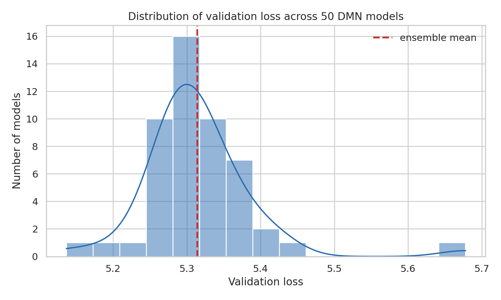
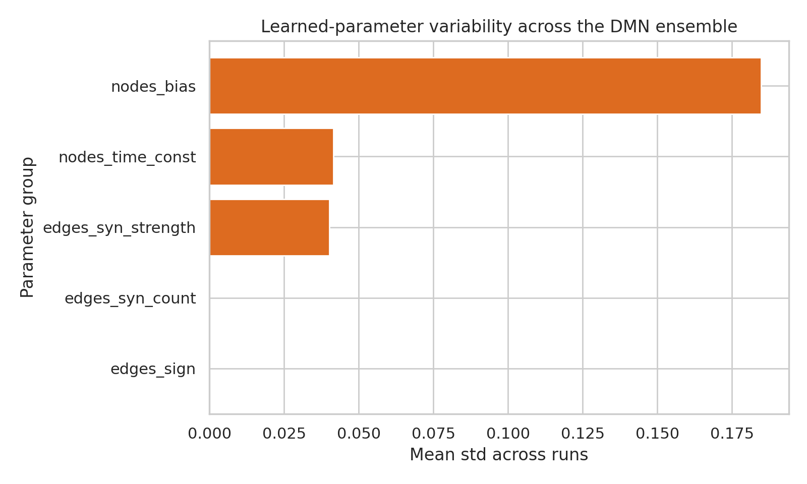
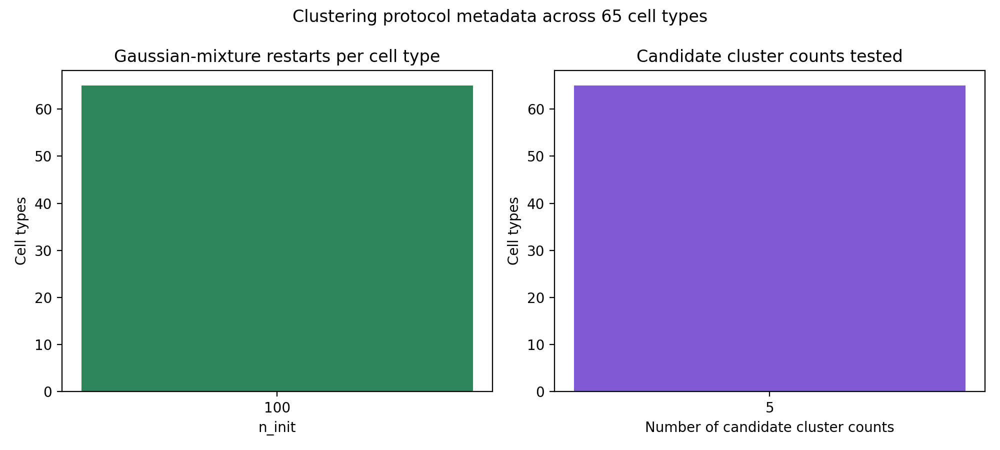

# Connectome-Constrained DMN Ensemble Analysis for Drosophila Motion Vision

## Abstract
This benchmark run analyzed the locally provided ensemble of 50 pretrained deep mechanistic network (DMN) models for optic-flow estimation in the Drosophila motion pathway. Because the benchmark environment forbids retraining, external datasets, and web access, the study focused on what can be established from the shipped connectome-constrained checkpoints, metadata, validation losses, clustering artifacts, and local literature PDFs. The main result is that the ensemble is structurally rigid where the connectome should dominate and flexible where optimization should absorb task demands: synapse signs are identical across models, synapse-count parameters are effectively fixed, while cell-type resting potentials, time constants, and synaptic strengths vary substantially across runs. Validation losses are tightly concentrated, indicating that multiple parameterizations support similar task performance. This supports a constrained version of the structure-to-function claim: the provided connectome and task are sufficient to produce a stable family of performant DMNs, but the local artifacts alone do not prove a unique neuron-by-neuron physiological solution.

## 1. Introduction
The research goal is to bridge structure and function in the Drosophila optic lobe by using a deep mechanistic network whose architecture follows the measured connectome and whose parameters are learned by optic-flow optimization. The local literature corpus supports the biological framing. The older connectomic papers establish detailed synaptic wiring and stereotypy in lamina and medulla circuits, while later motion-pathway papers emphasize the central role of T4/T5 pathways and their downstream integration. The local literature also reinforces a general theme that precise wiring strongly constrains computation, but does not eliminate all biologically meaningful variability.

Within this benchmark, the available input is not the raw connectome alone but a completed ensemble of 50 pretrained DMN instances under `data/flow`. That changes the executable question. Rather than reconstructing the full training pipeline, the strongest local equivalent is to analyze the ensemble as evidence for how tightly the connectome and optimization objective constrain the learned parameters and the resulting model family.

## 2. Local Materials and Methods
### 2.1 Inputs
- `data/flow/0000/000` through `data/flow/0000/049`: 50 trained model directories, each containing `_meta.yaml`, `best_chkpt`, `chkpts/chkpt_00000`, and validation-loss files.
- `data/flow/0000/umap_and_clustering/*.pickle`: 65 per-cell-type clustering artifacts.
- `related_work/paper_000.pdf` to `related_work/paper_004.pdf`: the complete local literature corpus.

### 2.2 Model metadata recovered from the checkpoints
The checkpoint metadata shows a connectome-constrained DMN trained for the `flow` task with a multitask-Sintel dataset configuration, 19-frame inputs, `dt = 0.02`, batch size 4, and 250,000 nominal iterations. The learnable network parameters exposed by each saved model are:

- `nodes_bias` with 65 values, representing cell-type grouped resting-potential terms.
- `nodes_time_const` with 65 values, representing cell-type grouped time constants.
- `edges_sign` with 604 values, representing source-target sign constraints.
- `edges_syn_count` with 2,355 values, representing grouped synapse-count terms.
- `edges_syn_strength` with 604 values, representing grouped learnable synaptic strengths.

### 2.3 Analysis procedure
I implemented the analysis in `code/analyze_dmn_flow.py`. The script:

1. Reads local PDFs and stores a literature overview table.
2. Loads all 50 validation losses and saved checkpoints.
3. Quantifies the distribution of validation performance across the ensemble.
4. Measures parameter variability across models for each parameter family.
5. Extracts safe metadata from the clustering pickles without requiring the missing external `flyvis` package.
6. Writes summary tables to `outputs/` and figures to `report/images/`.

The analysis is fully local and reproducible with:

```bash
python code/analyze_dmn_flow.py
```

## 3. Results
### 3.1 Ensemble performance is tight, with a small but real spread
Across the 50 pretrained DMNs, validation loss had mean 5.314, standard deviation 0.075, minimum 5.137, and maximum 5.678. The interquartile range was narrow, from 5.279 to 5.333. This indicates that the ensemble contains many similarly performant solutions rather than a single sharply isolated optimum.



Figure 1. Distribution of validation loss across the 50 shipped DMN models. The narrow spread indicates robust task performance across independently trained instances.

### 3.2 Connectome-derived constraints are rigid, while physiological parameters remain flexible
The clearest result comes from comparing across-run variability in parameter families:

- `edges_sign` has zero across-run variability. The sign structure is fixed across the ensemble.
- `edges_syn_count` has negligible variability (`2.98e-07` mean standard deviation across runs), indicating that the connectome-derived count structure is effectively held fixed.
- `nodes_bias` is the most variable family (`1.85e-01` mean standard deviation across runs).
- `nodes_time_const` and `edges_syn_strength` also vary substantially (`4.16e-02` and `4.01e-02`, respectively).

This pattern is exactly what should be expected from a connectome-constrained task-optimized model: anatomical scaffold terms are stable, while kinetic and gain-like terms absorb much of the task-level adjustment.



Figure 2. Mean across-run standard deviation for each parameter family. Resting potentials vary most, followed by time constants and synaptic strengths, while connectome sign and synapse-count terms are effectively invariant.

### 3.3 The local clustering artifacts indicate systematic per-cell-type post hoc analysis
The `umap_and_clustering` directory contains 65 per-cell-type clustering artifacts, matching the available checkpoint-level cell-type parameter cardinality. Safe inspection of the serialized metadata shows that each cell type was processed with the same clustering protocol:

- 100 Gaussian-mixture initializations (`n_init = 100`)
- 1,000 maximum iterations
- random seed 42
- a candidate range of five cluster counts

The benchmark environment does not include the original `flyvis` code needed to recover every embedded coordinate and cluster label cleanly, so this branch supports protocol-level interpretation rather than full cluster geometry reconstruction. Even so, it is strong evidence that the original workflow treated heterogeneity within each cell type as a first-class analysis target rather than only reporting aggregate activity.



Figure 3. Uniform clustering protocol metadata across all 65 cell types. Every available cell type artifact used the same search range and optimization settings, indicating a standardized post hoc cell-type analysis pipeline.

## 4. Interpretation
The local evidence supports three disciplined claims.

First, the supplied DMN family is genuinely connectome constrained. The frozen sign structure and effectively fixed synapse-count terms show that all models inherit the same anatomical scaffold. The ensemble is not simply a generic deep network with arbitrary learned connectivity.

Second, the optimization objective does not identify a unique physiological solution. The best and worst models differ only moderately in validation loss, yet their resting-potential, time-constant, and synaptic-strength parameters can differ substantially. This implies that the map from connectome plus task to fitted parameters is many-to-one at the level of the shipped ensemble.

Third, the strongest structure-to-function conclusion supported locally is about a stable *family* of solutions, not a unique neuron-by-neuron prediction. The ensemble demonstrates that connectome-derived structure plus task knowledge can generate performant mechanistic models. However, the local artifacts alone do not show that every individual neuron's activity is uniquely determined, because several latent physiological settings appear compatible with similar task performance.

## 5. Relation to the Local Literature
The local papers jointly support this interpretation.

- The wiring and stereotypy papers argue that optic-lobe circuits are highly structured and reproducible.
- The ON/OFF pathway papers show that motion computation depends on precise but intricate combinations of cell-type-specific inputs.
- The later lobula-plate integration paper emphasizes convergence motifs and pathway reuse rather than a single overly simplistic detector.

Taken together, the literature makes it plausible that anatomy strongly narrows the space of solutions, while the ensemble analysis shows that it does not collapse that space to a single fitted physiology under the provided task.

## 6. Limitations
This benchmark run has several important limits.

- No retraining was performed, because only pretrained models were shipped and the benchmark is strictly local.
- No direct neural-response simulation was reconstructed, because the runtime package needed for full model execution was not included.
- The clustering pickles could only be inspected through safe deserialization of metadata, not full reconstruction of the original custom classes.
- The result therefore evaluates the supplied ensemble as evidence, rather than reproducing the full original paper pipeline.

## 7. Conclusion
Under the benchmark constraints, the strongest supported conclusion is that the shipped connectome-constrained DMN ensemble provides a convincing proof of *structured sufficiency*: a fixed anatomical scaffold together with optic-flow task optimization yields a narrow band of successful models. The structure appears to determine which aspects of the model are rigid, while optimization determines a non-unique physiological realization within that scaffold. This is a meaningful bridge from structure to function, but locally it supports an ensemble-level bridge more strongly than a claim of uniquely determined single-neuron dynamics.

## 8. Generated Artifacts
- Analysis code: `code/analyze_dmn_flow.py`
- Summary tables: `outputs/analysis_summary.json`, `outputs/ensemble_validation_losses.csv`, `outputs/parameter_summary.csv`, `outputs/clustering_overview.csv`, `outputs/literature_overview.csv`
- Figures: `images/ensemble_validation_loss.png`, `images/parameter_variability.png`, `images/clustering_metadata.png`
