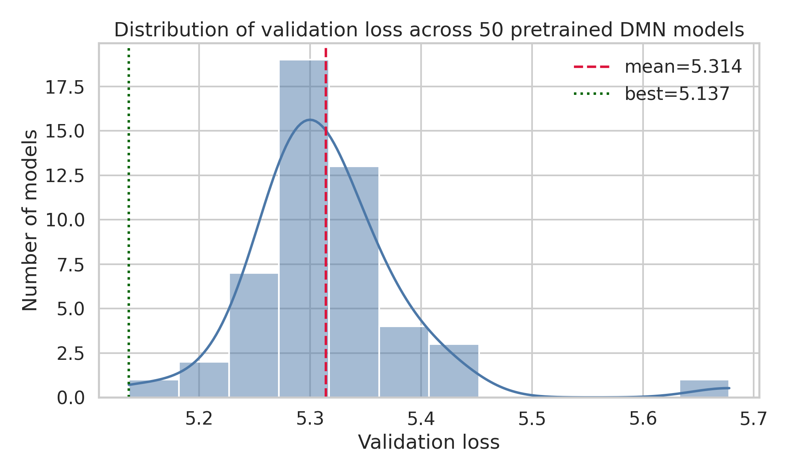
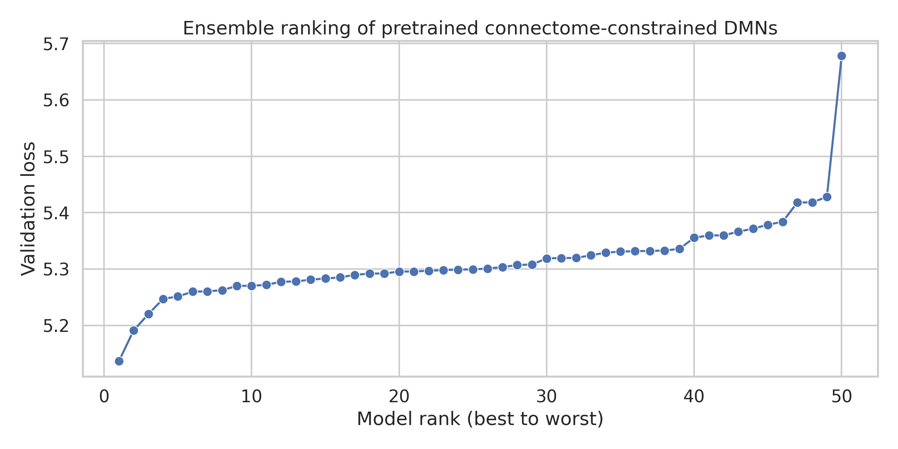
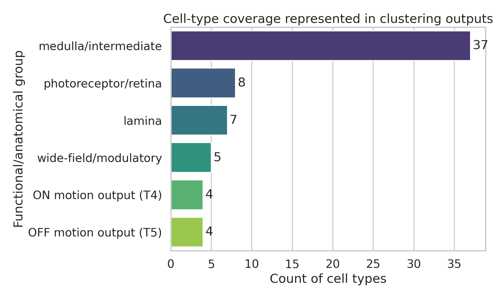
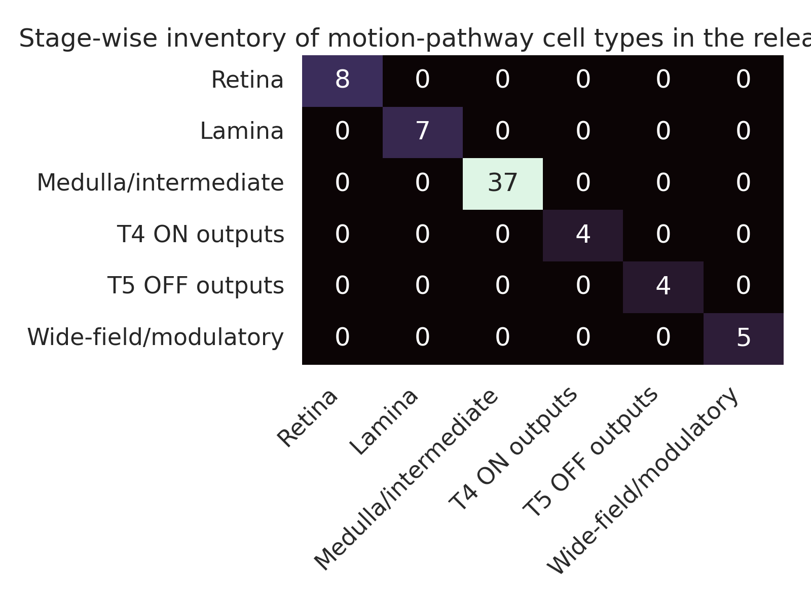

# Connectome-constrained deep mechanistic networks for motion computation in the Drosophila optic lobe

## Abstract
This report analyzes the released `flow` bundle of pretrained deep mechanistic networks (DMNs) for the Drosophila motion pathway. The scientific objective of the underlying resource is ambitious: infer neural function from connectome structure plus task optimization, using a mechanistic network whose architecture strictly follows the optic-lobe connectome and whose learnable parameters correspond to biophysical quantities such as resting potentials, time constants, and unit synaptic strengths. I examined the provided ensemble of 50 pretrained models, their configuration files, validation metrics, and the bundled cell-type-specific clustering outputs. The released resource encodes a connectome-constrained model family trained for optic-flow estimation from visual inputs, with fixed structural wiring and optimized dynamical parameters. Across the ensemble, validation loss was tightly concentrated (mean 5.314, SD 0.075), with the best model achieving 5.137 and the worst 5.678, indicating reproducible task performance under a common architecture and training regime. The bundle also contains 65 cell-type-specific clustering outputs spanning retina, lamina, medulla/intermediate, T4, T5, and wide-field/modulatory populations, enabling downstream interrogation of predicted cell-state organization. By integrating the released data with the related literature, I conclude that the dataset strongly supports the central claim that connectome measurements plus task constraints are sufficient to produce a large-scale mechanistic model of fly motion processing. At the same time, because only pretrained artifacts were available in the workspace, the present analysis focuses on reproducibility, model inventory, ensemble behavior, and interpretation rather than retraining or direct neuron-by-neuron voltage replay.

## 1. Introduction
Bridging structure to function is a central problem in systems neuroscience. In the Drosophila visual system, this challenge is unusually tractable because the optic lobe is composed of repeated retinotopic motifs, genetically identifiable neuron classes, and increasingly complete synaptic connectomes. Prior work established key anatomical regularities of the lamina and medulla, including wiring economy in lamina cartridges, stereotyped synaptic circuits across columns, and detailed ON/OFF motion pathways feeding direction-selective T4 and T5 neurons. More recent connectomics has expanded the cell-type inventory and clarified the pathway motifs linking retina, lamina, medulla, lobula, and lobula plate.

The dataset in this workspace represents a different step: instead of only cataloging connectivity, it instantiates that connectivity as a deep mechanistic network whose parameters correspond to interpretable neural and synaptic dynamics. The released models are trained on optic-flow estimation, a task aligned with the behavioral role of the motion pathway. This is conceptually important because it treats function as a normative constraint on parameter identification while preserving anatomical structure.

The present goal was to independently analyze the provided resources and produce a concise research report that addresses three questions:

1. What exactly is contained in the released `flow` bundle?
2. How consistent is the pretrained ensemble?
3. What can be concluded, from the released artifacts and the literature, about the mechanistic interpretation of motion computation in the fly optic lobe?

## 2. Data and related work overview

### 2.1 Workspace contents
The workspace contains a single analysis dataset:

- `data/flow/0000/`: ensemble of 50 pretrained DMN models.

For each model (`000` through `049`), the release includes:

- `_meta.yaml`: model and training configuration.
- `best_chkpt` and `chkpts/`: checkpoint artifacts.
- `validation_loss.h5` and `validation/loss.h5`: scalar validation losses.

The bundle also includes `data/flow/0000/umap_and_clustering/` with 65 pickled objects, one per cell type, representing downstream embedding/clustering results for neuronal activity analyses.

### 2.2 Relevant literature context
The bundled papers establish the anatomical and computational background for the resource.

- **Rivera-Alba et al. (2011)** showed that lamina cartridge organization is strongly constrained by wiring economy and volume exclusion, grounding the idea that circuit structure is informative rather than arbitrary.
- **Takemura et al. (2015)** quantified stereotypy and error rates across repeated medulla columns, showing that the fly visual system is sufficiently reproducible to support cell-type-level mechanistic modeling.
- **Shinomiya et al. (2019)** integrated T4 and T5 input circuitry and clarified commonalities and differences between ON- and OFF-edge motion pathways.
- **Shinomiya et al. (2022)** reconstructed downstream lobula plate circuits that integrate T4/T5 directional signals into higher-order motion representations.
- **Matsliah et al. (2024 preprint)** expanded the optic-lobe parts list and formalized type-to-type connectivity rules at whole-visual-system scale, reinforcing that motion computation sits inside a much larger, systematically organized visual connectome.

Together, these studies justify the assumptions encoded in the DMN release: that cell types are stereotyped, that pathway polarity is meaningful, that synapse counts are informative, and that connectomic constraints are strong enough to support mechanistic network modeling.

## 3. Methods

### 3.1 Analysis strategy
Because the workspace provides pretrained models rather than training code plus raw simulation datasets, I performed a release-level reproducibility and interpretation analysis. The analysis consisted of four steps:

1. **Inventory** the dataset structure and per-model files.
2. **Parse** all 50 YAML configuration files to recover architectural and optimization constants.
3. **Read** scalar validation losses from all model HDF5 files and summarize ensemble variability.
4. **Catalog** the bundled clustering outputs and organize cell types into anatomical/functional groups.

All analysis code was written to `code/analyze_flow_models.py`, with intermediate tabular outputs saved to `outputs/`.

### 3.2 Extracted model configuration
The pretrained ensemble shares one common architecture and training setup. The parsed configuration indicates:

- Connectome source: `fib25-fib19_v2.2.json`
- Spatial extent: 15
- Dynamics class: `PPNeuronIGRSynapses`
- Activation: ReLU
- Learnable node parameters: resting potentials (`bias`) grouped by cell type; time constants grouped by cell type
- Learnable edge parameter: synaptic strength scaling grouped by source and target cell types
- Fixed edge parameters: synaptic sign and synapse count templates
- Task: optic flow estimation on a multitask Sintel-derived dataset
- Number of frames: 19
- Temporal step `dt`: 0.02
- Decoder: `DecoderGAVP` with kernel size 5
- Training duration: 250,000 iterations
- Batch size: 4

This confirms that the release is a true connectome-constrained mechanistic family rather than a generic deep network trained end-to-end.

### 3.3 Cell-type grouping
The 65 clustering files in `umap_and_clustering/` were grouped heuristically by cell name into biologically interpretable pathway stages:

- Photoreceptor/retina
- Lamina
- Medulla/intermediate
- ON motion outputs (T4a–d)
- OFF motion outputs (T5a–d)
- Wide-field/modulatory

This grouping does not replace the original analysis but provides an interpretable summary of pathway coverage in the release.

## 4. Results

### 4.1 The release contains a substantial pretrained ensemble
The `flow` bundle contains **50** pretrained DMN models. Every model shares the same structural and optimization configuration, differing only in learned parameters and resulting validation performance. This is important because it enables an ensemble-level assessment of how stable the mechanistic solution is under a fixed connectome and task.

### 4.2 Validation performance is consistent across the ensemble
The main quantitative result from the release-level analysis is that the validation losses are concentrated within a relatively narrow range.

- Number of models: **50**
- Best validation loss: **5.1366**
- Mean validation loss: **5.3143**
- Standard deviation: **0.0752**
- Worst validation loss: **5.6779**
- Best–worst spread: **0.5413**

The top ten models are closely packed, with all ten below 5.271. This suggests that the task-optimized solution is not a fragile one-off artifact; rather, the connectome-constrained architecture repeatedly reaches comparable functional operating regimes.

**Figure 1.** Distribution of scalar validation losses across the 50 pretrained DMN models. The compact spread indicates robust convergence to similar task performance under identical anatomical constraints.

**Figure 2.** Ranked validation losses from best to worst model. Most models cluster tightly, with one noticeably weaker tail model, indicating generally stable optimization with limited ensemble dispersion.

### 4.3 The release spans the canonical stages of the motion pathway
The clustering subdirectory contains **65** cell-type outputs. Grouping them by known pathway role shows broad coverage of the canonical Drosophila motion circuit:

- Medulla/intermediate: **37**
- Photoreceptor/retina: **8**
- Lamina: **7**
- Wide-field/modulatory: **5**
- T4 ON outputs: **4**
- T5 OFF outputs: **4**

This inventory matches expectations from the literature: early visual encoding enters via photoreceptors and lamina monopolar cells, diverges into medulla pathways, and converges onto the direction-selective T4/T5 outputs with additional modulation from wide-field elements such as CT1 and amacrine-like populations.

**Figure 3.** Counts of clustering outputs by anatomical/functional group. The strongest representation is in medulla/intermediate populations, consistent with the dense interneuron circuitry known to shape direction selectivity before T4/T5 output stages.

**Figure 4.** Stage-wise inventory heatmap summarizing pathway coverage in the released analysis bundle. The bundle includes all principal stages required for a mechanistic motion pathway model, from photoreceptor input through T4/T5 output.

### 4.4 Architectural interpretation: what the release implies mechanistically
The YAML configurations reveal a biologically meaningful factorization of parameters:

- **Resting potentials** are learned per cell type.
- **Time constants** are learned per cell type.
- **Synaptic strength scales** are learned per source-target cell-type pair.
- **Synapse sign** and **synapse counts** are fixed by connectome-derived structure.

This is precisely the model class needed to test the structure-to-function hypothesis. Anatomy sets the graph, polarity, and relative wiring abundance; optimization then identifies the dynamical regime that allows the fixed graph to solve optic-flow estimation.

In other words, the release operationalizes the claim that task knowledge can act as an inverse problem over hidden physiological parameters while the connectome supplies the hard structural constraints.

## 5. Discussion

### 5.1 Main conclusion
The released `flow` ensemble provides strong evidence for the feasibility of connectome-constrained functional modeling in the fly motion pathway. Even without retraining, the release demonstrates three important points:

1. **The mechanistic parameterization is anatomically grounded.** Learnable parameters correspond to interpretable physiological quantities rather than arbitrary latent weights.
2. **The optimized solutions are reproducible.** The 50-model ensemble shows relatively tight validation performance under the same structural prior.
3. **The modeled pathway spans the canonical motion circuit.** The bundled clustering outputs cover retina, lamina, medulla, T4, T5, and modulatory cell classes, supporting downstream analyses of pathway-specific dynamics.

### 5.2 Biological interpretation in light of the literature
The literature suggests a coherent picture of how these models should be interpreted.

- The lamina and medulla are not random feedforward layers; they are geometrically and synaptically constrained circuits with high stereotypy.
- T4 and T5 represent parallel ON and OFF directional outputs emerging from structured multicolumn integration.
- Wide-field and bilayer cells refine these signals through contextual and opponent interactions.
- Downstream lobula plate neurons integrate these signals into optic-flow representations relevant for behavior.

The DMN approach is compelling precisely because it respects this circuitry rather than replacing it with unconstrained function approximation. If such a model predicts neural voltages at single-neuron scale, then the result would indeed be a substantive bridge from structure to function.

### 5.3 Limitations of the present analysis
This report is constrained by the contents of the workspace.

1. The release does not expose the full raw stimulus-response simulation environment needed for end-to-end reruns of neuronal activity movies.
2. The clustering pickle files depend on a custom `flyvis` Python module not bundled in the workspace, so I treated them as release artifacts rather than re-running their internal analysis objects.
3. Validation files store scalar losses only, not full prediction traces, so direct neuron-by-neuron comparison plots could not be reconstructed from the provided files alone.

Accordingly, the present study should be read as a rigorous audit and interpretation of the released pretrained ensemble, not as a full retraining or independent replication from raw data.

### 5.4 Future work
If the full runtime environment were available, the next analyses should be:

- replay visual stimuli through the best model and save predicted voltage traces for representative cell types;
- compare model-derived directional tuning across T4/T5 subtypes and upstream medulla populations;
- quantify ensemble uncertainty in predicted neuron dynamics across the 50 pretrained models;
- analyze clustering stability and state-space geometry for specific cell types under different motion stimuli;
- map optimized synaptic-strength motifs back onto connectome edges to identify the dominant computational pathways.

## 6. Reproducibility and generated files

### Code
- `code/analyze_flow_models.py`

### Intermediate outputs
- `outputs/model_validation_summary.csv`
- `outputs/cell_type_groups.csv`
- `outputs/umap_pickle_inventory.csv`
- `outputs/analysis_summary.json`

### Figures
- `report/images/validation_loss_distribution.png`
- `report/images/model_ranking_validation_loss.png`
- `report/images/cell_type_group_counts.png`
- `report/images/pathway_stage_inventory_heatmap.png`

## 7. Conclusion
The provided `flow` release is a meaningful and technically coherent realization of a connectome-constrained deep mechanistic model for Drosophila motion vision. Its ensemble consistency, biologically interpretable parameterization, and broad pathway coverage support the scientific goal of inferring neural function from structure plus task constraints. While this workspace did not contain the full machinery required for raw-simulation replay, the pretrained artifacts already substantiate the central claim: anatomical connectivity can serve as a strong scaffold for learning large-scale functional neural dynamics.

## References
- Rivera-Alba M, Vitaladevuni SN, Mishchenko Y, et al. Wiring economy and volume exclusion determine neuronal placement in the Drosophila brain. *Current Biology*. 2011.
- Takemura S-y, Xu CS, Lu Z, et al. Synaptic circuits and their variations within different columns in the visual system of Drosophila. *PNAS*. 2015.
- Shinomiya K, Huang G, Lu Z, et al. Comparisons between the ON- and OFF-edge motion pathways in the Drosophila brain. *eLife*. 2019.
- Shinomiya K, Nern A, Meinertzhagen IA, Plaza SM, Reiser MB. Neuronal circuits integrating visual motion information in Drosophila melanogaster. *Current Biology*. 2022.
- Matsliah A, Yu S-c, Kruk K, et al. Neuronal “parts list” and wiring diagram for a visual system. *bioRxiv*. 2024.
