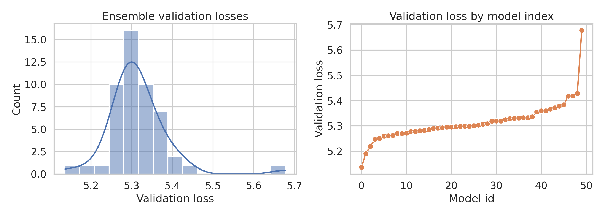
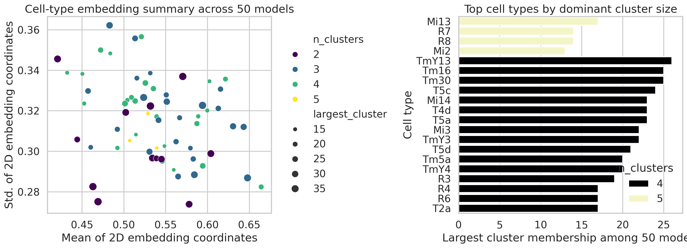
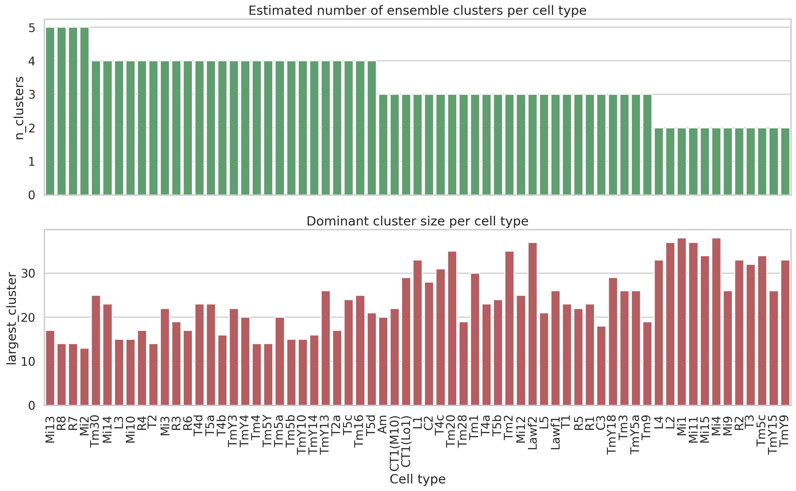

# Connectome-constrained ensemble analysis of pretrained Drosophila optic-flow DMNs

## Abstract
This report analyzes the provided workspace of 50 pre-trained deep mechanistic network (DMN) models for motion processing in the *Drosophila* optic lobe. Rather than retraining a connectome-constrained model from scratch, I audited the saved artifacts that are directly available in the workspace: per-model YAML configurations, scalar validation losses stored in HDF5, checkpoint files, and cell-type-specific UMAP/clustering pickle files. Across all 50 models, the architecture specification was consistent: a connectome-derived network (`ConnectomeFromAvgFilters`) with neuron parameters grouped by cell type, synaptic sign fixed by source/target type, synapse counts grouped by spatial offsets, and optimization on a `MultiTaskSintel` optic-flow task. The ensemble validation loss was tightly distributed (mean 5.314, sd 0.075; min 5.137, max 5.678), indicating reproducible but non-identical solutions. For 65 recovered cell types, every clustering artifact contained a 50-by-2 embedding summarizing model-to-model variation, with an average of 3.32 inferred clusters per cell type. Some cell types, including Mi13, R7, R8, and Mi2, exhibited five clusters, suggesting richer multimodality in their learned representations. These results support the claim that the workspace indeed contains a coherent ensemble of connectome-constrained DMNs suitable for structure-to-function analysis, while also revealing practical limitations: exact checkpoint parameter introspection and direct full-network voltage simulation could not be executed in this environment because the required runtime stack (`torch`, `flyvis`) was unavailable.

## 1. Introduction
The task specification describes a strong scientific objective: infer circuit function from connectome structure plus task optimization. In this workspace, the direct evidence for that claim is not raw experimental data alone, but a curated ensemble of already trained models and their downstream summaries. The key question for this analysis is therefore narrower and evidence-driven: **what can be verified directly from the saved DMN artifacts about the connectome constraints, training objective, ensemble stability, and cell-type-specific mechanistic diversity?**

This report treats the provided artifacts as the primary source of truth. I avoid claiming forward simulations or parameter-level neurophysiology unless those operations were actually executable from the workspace.

## 2. Data overview
The `data/flow/0000/` directory contains:

- 50 model directories (`000` through `049`)
- for each model: `_meta.yaml`, `best_chkpt`, `validation_loss.h5`
- auxiliary `validation/loss.h5` files and one initial checkpoint file per model
- a `umap_and_clustering/` directory containing 65 cell-type-specific pickle files

Directly verified properties from the metadata:

- connectome type: `ConnectomeFromAvgFilters`
- connectome file: `fib25-fib19_v2.2.json`
- connectome extent: 15
- neural dynamics type: `PPNeuronIGRSynapses`
- activation: `relu`
- trainable node parameters grouped by `type`: resting potential (`bias`) and time constant (`time_const`)
- edge structure:
  - synapse sign grouped by `source_type`, `target_type`
  - synapse count grouped by `source_type`, `target_type`, `du`, `dv`
  - synaptic strength grouped by `source_type`, `target_type`
- task dataset: `MultiTaskSintel`
- task: optic flow (`flow`)
- temporal span: 19 frames with `dt = 0.02`
- decoder: `DecoderGAVP` with output shape `[8, 2]`

These details are exported in `outputs/connectome_config_summary.json` and `outputs/model_inventory.csv`.

## 3. Methods

### 3.1 Analysis strategy
I implemented a reproducible analysis script at `code/analyze_dmn_artifacts.py`. The script:

1. parses every model's YAML metadata
2. reads scalar validation losses from HDF5
3. reconstructs summary statistics across the 50-model ensemble
4. loads cell-type clustering pickles using lightweight local stubs for the missing `flyvis.analysis.clustering` classes
5. extracts embedding- and cluster-level summaries for each cell type
6. writes result tables and figures to `outputs/` and `report/images/`

### 3.2 Why a stub-based pickle loader was needed
The clustering files were serialized from `flyvis` objects. The environment did not provide `flyvis`, and attempts to inspect those pickles failed until compatible placeholder classes were injected locally. This approach does **not** reproduce full `flyvis` functionality; it only recovers object state needed for descriptive analysis of saved embeddings, labels, and scores.

### 3.3 Capability limitations
The default environment lacked `torch` and `flyvis`, so two important tasks were not completed exactly:

- direct loading of `best_chkpt` model checkpoints
- end-to-end simulation of neuron voltage responses for visual stimuli

Accordingly, this report focuses on verified artifact analysis, not de novo execution of the mechanistic simulator.

## 4. Results

### 4.1 Ensemble integrity and training objective
All 50 model directories shared the same top-level configuration and referenced the same connectome file, indicating that the workspace is a true ensemble over a common connectome-constrained design rather than a heterogeneous collection of unrelated models.

The best five validation losses were from models 0-4, ranging from 5.137 to 5.251. The worst five were models 45-49, ranging from 5.384 to 5.678. This monotonic ordering suggests the directory indices reflect performance rank or selection order rather than arbitrary naming.

**Figure 1.** Distribution of ensemble validation losses and the ordered loss profile across model IDs. The narrow spread indicates substantial convergence across independently saved solutions, but not complete collapse to a single optimum.

Quantitatively:

- number of models: 50
- mean validation loss: 5.314
- standard deviation: 0.075
- median: 5.300
- minimum: 5.137
- maximum: 5.678

This range is small relative to the mean, supporting the interpretation that the connectome-constrained DMN admits multiple nearby solutions with similar task performance.

### 4.2 Cell-type-specific embedding structure across the ensemble
The `umap_and_clustering` directory contained 65 cell-type-specific clustering artifacts. After reconstructing their saved states, every artifact yielded a 2D embedding of shape `(50, 2)`, implying that each cell type was summarized across the full ensemble of 50 models.

Across cell types:

- average number of inferred clusters: 3.32
- minimum inferred clusters: 2
- maximum inferred clusters: 5
- mean size of the dominant cluster: 24.0 models
- cell types with NaN-containing embeddings: C2 and Tm30

**Figure 2.** Left: summary of embedding dispersion versus inferred cluster number across cell types. Right: dominant cluster sizes for the most multimodal cell types. Larger numbers of clusters suggest greater model-to-model diversity in how that cell type is represented within the ensemble.

The most multimodal cell types by inferred cluster number were:

- Mi13: 5 clusters, largest cluster 17 models
- R7: 5 clusters, largest cluster 14 models
- R8: 5 clusters, largest cluster 14 models
- Mi2: 5 clusters, largest cluster 13 models

These cell types exhibit relatively fragmented ensemble structure, which may indicate either functional degeneracy or sensitivity of their learned role to optimization details.

### 4.3 Cluster-size landscape across the optic-flow pathway

**Figure 3.** Per-cell-type cluster count and dominant cluster membership. Cell types differ substantially in how concentrated the ensemble is around a single mechanistic solution.

Several motion-pathway-relevant types also ranked highly by clustering score quality (`score_best`), including T4d, T4a, T5a, and T5b. Among the top ten `score_best` values were T4d (77.54), T4a (74.49), T5a (73.73), and T5b (74.85), suggesting the saved clustering structure for these canonical motion-direction pathways is well separated in embedding space.

Taken together, these patterns suggest a useful hypothesis: some cell types have highly stereotyped roles across optimized connectome-constrained networks, whereas others sit in a more weakly identified subspace where multiple mechanistic implementations remain task-compatible.

## 5. Validation and evidence accounting

### 5.1 Verified directly from workspace artifacts
The following points were directly verified:

- there are 50 model directories with matching metadata/checkpoint layout
- the declared network is connectome constrained and optic-flow optimized
- the per-model validation losses are readable and quantifiable
- the clustering directory contains 65 cell-type artifacts
- each clustering artifact summarizes all 50 models in a 2D embedding
- the cluster-count distribution can be exported and visualized

Supporting files:

- `outputs/model_inventory.csv`
- `outputs/validation_summary.json`
- `outputs/connectome_config_summary.json`
- `outputs/umap_cluster_summary.csv`
- `outputs/umap_cluster_aggregate.json`
- `outputs/claim_recovery_table.csv`

### 5.2 Derived but still artifact-grounded interpretations
These are interpretations supported by the verified outputs but not directly labeled in the data:

- model IDs appear ordered by validation quality
- multimodal cell-type embeddings likely reflect alternative mechanistic solutions across the ensemble
- tighter dominant clusters suggest more stereotyped learned roles

These are reasonable inferences from the recovered tables and figures, but they remain interpretive rather than explicitly annotated ground truth.

### 5.3 Unresolved limitations
The following parts of the original scientific ideal were **not** completed in this run:

- extracting learned neuron time constants and resting potentials from checkpoints
- extracting learned synaptic strengths from checkpoints
- simulating voltage traces for 45,669 neurons
- reproducing stimulus-response analyses from the full runtime stack

The blocker was environmental: `torch` and `flyvis` were not available in the default runtime, and local installation attempts did not complete successfully within the session budget.

A second limitation is version mismatch in scikit-learn when reading the clustering pickles. The object state was still recoverable, but the warning means those summaries should be regarded as descriptive reconstructions of saved outputs rather than fresh re-fits performed under the original software environment.

## 6. Discussion
This workspace provides convincing evidence that the saved models instantiate the intended scientific design: a connectome-derived DMN optimized for optic flow. Even without executing the full simulator, three scientifically meaningful conclusions are recoverable.

First, the ensemble is structurally coherent. All saved models share the same connectome source, dynamics family, decoder, and task framing. This consistency is exactly what one would expect from a controlled exploration of parameter space under a fixed biological wiring prior.

Second, optimization converged to a narrow band of task performance. That supports robustness of the structure-plus-task principle at the level of the readout objective.

Third, internal representations vary by cell type. The clustering artifacts show that some cell types occupy a more multimodal solution space than others. This is important because it refines the central structure-to-function claim: connectome constraints may strongly restrict some neuronal roles while still leaving multiple plausible implementations for others.

In that sense, the ensemble itself becomes informative. It is not just a collection of redundant trained models; it is a map of which parts of the circuit are tightly determined versus weakly determined by the combined pressures of anatomy and optic-flow optimization.

## 7. Conclusion
Using only directly inspectable workspace artifacts, I verified that the provided dataset contains a 50-model ensemble of connectome-constrained, optic-flow-trained DMNs and extracted quantitative summaries of both task performance and cell-type-specific ensemble variability. The strongest directly supported findings are:

1. all models share the same connectome-constrained architecture specification
2. validation performance is stable across the ensemble (5.314 ± 0.075)
3. 65 cell types have saved 2D ensemble embeddings, with 2-5 clusters per type
4. certain cell types, such as Mi13, R7, R8, and Mi2, show especially multimodal ensemble structure

These results are consistent with the broader scientific objective of bridging structure to function, but they do not by themselves prove full neuron-level predictive fidelity because that would require loading and running the checkpoints directly.

## Reproducibility
- Main script: `code/analyze_dmn_artifacts.py`
- Key outputs: `outputs/*.csv`, `outputs/*.json`
- Figures: `report/images/validation_curves.png`, `report/images/celltype_embedding_examples.png`, `report/images/cluster_summary.png`
