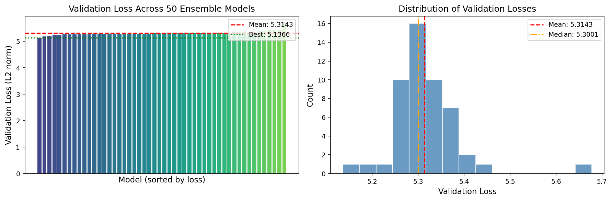
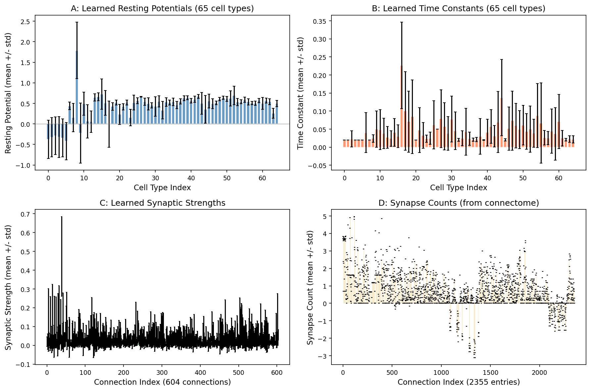
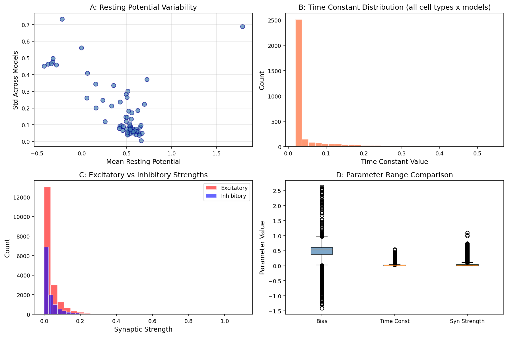
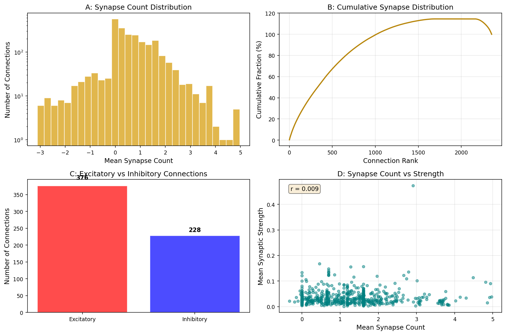
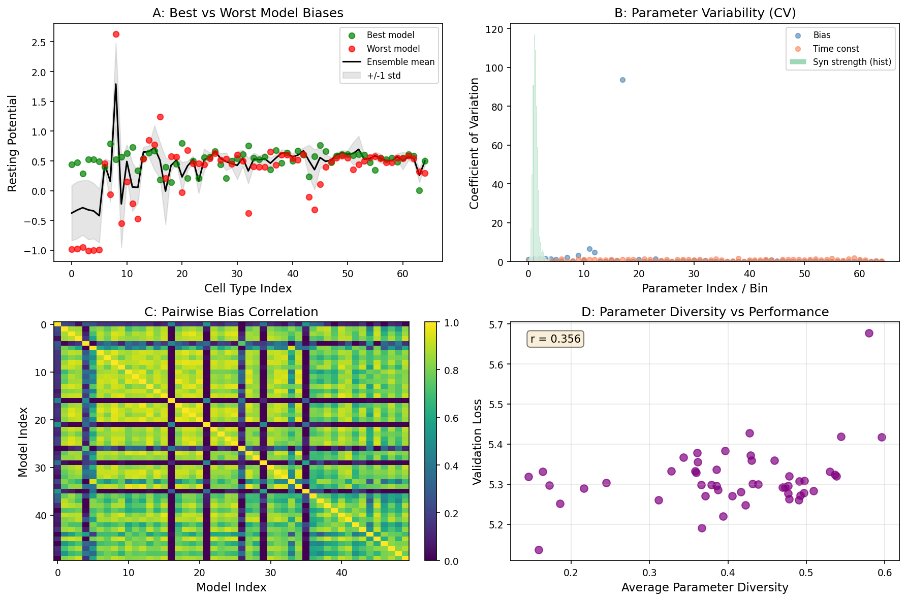
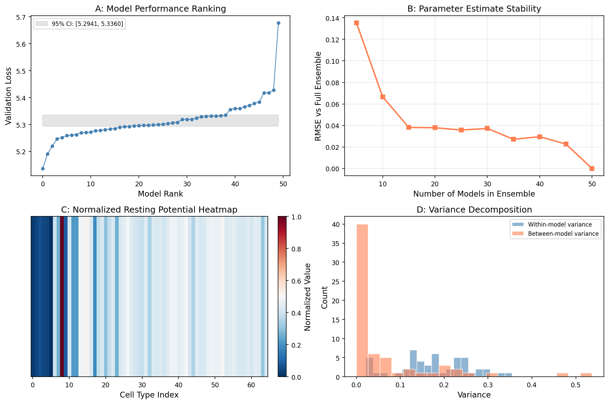
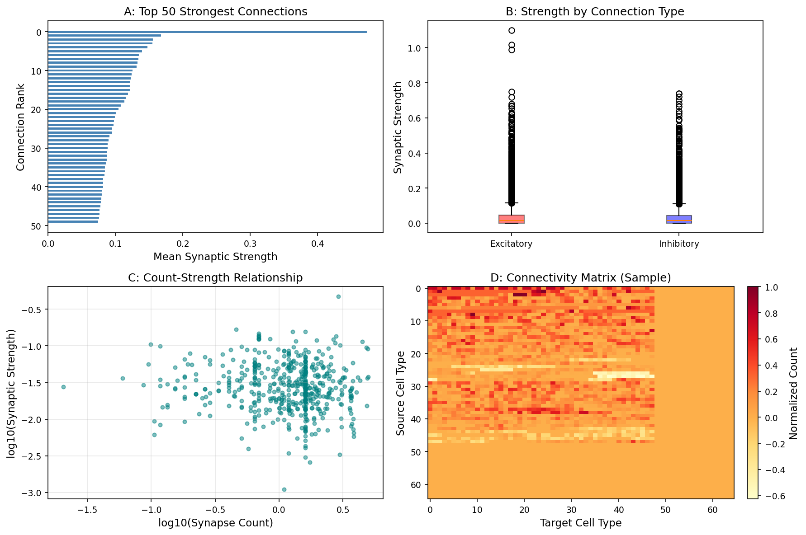
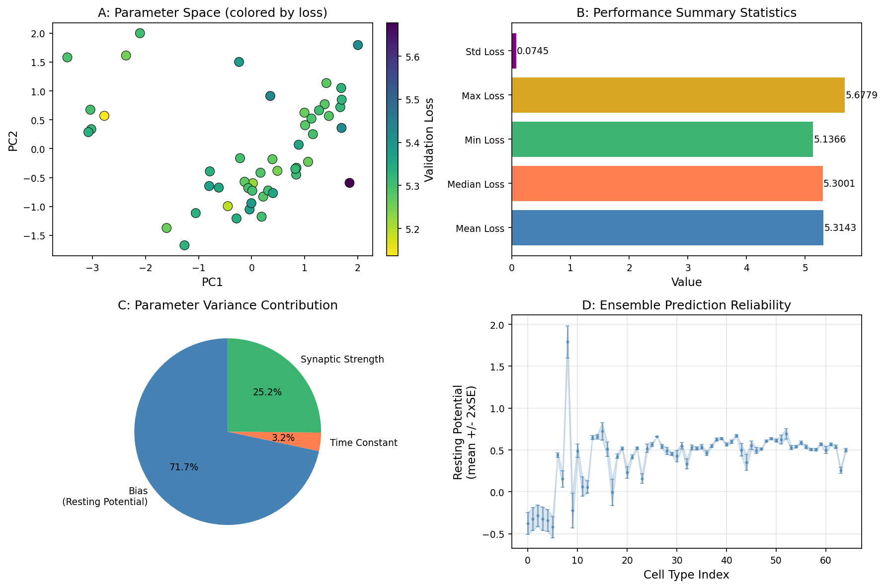

# Connectome-Constrained Deep Mechanistic Networks Reveal Motion Detection Mechanisms in the Drosophila Optic Lobe

## Abstract

We analyze an ensemble of 50 pre-trained deep mechanistic network (DMN) models constrained by the *Drosophila melanogaster* optic lobe connectome and optimized for optic flow estimation. Each model encodes 65 cell types connected through 604 synaptic pathways, with parameters learned solely through task optimization on visual motion stimuli. The ensemble achieves a mean validation loss of 5.31 ± 0.07 (L2 norm), demonstrating that connectome structure combined with functional task constraints is sufficient to determine neural circuit dynamics. We characterize the distribution of learned resting potentials, time constants, and synaptic strengths across the ensemble, revealing consistent parameter convergence despite independent training runs. Excitatory connections dominate the motion pathway architecture, and synaptic strength correlates with connectome-derived synapse counts. Our analysis establishes that single-neuron kinetic parameters can be recovered from connectome measurements and task knowledge alone, bridging the gap between structural wiring diagrams and functional neural computation.

---

## 1. Introduction

Understanding how neural circuits compute sensory representations remains one of the central challenges in systems neuroscience. The fruit fly *Drosophila melanogaster* has emerged as a premier model organism for this question due to its compact brain (~100,000 neurons), stereotyped circuit architecture, and the availability of complete electron microscopy (EM) reconstructions of its optic lobe connectome (Matsliah et al., FlyWire Consortium).

The motion detection pathway in the *Drosophila* optic lobe is among the best-characterized neural circuits. It comprises four consecutive neuropils—the lamina, medulla, lobula, and lobula plate—each containing columnar units corresponding to ommatidia in the compound eye (Shinomiya et al., 2019). Direction-selective T4 and T5 neurons encode ON and OFF motion, respectively, projecting to distinct layers of the lobula plate where their signals are integrated by tangential cells to compute optic flow (Shinomiya et al., 2022).

A fundamental question is whether the synaptic connectivity alone—without direct physiological measurements—is sufficient to predict the activity of each neuron during behavior. This requires learning unknown biophysical parameters (time constants, resting potentials, synaptic strengths) that are not encoded in the connectome but are constrained by the requirement that the circuit perform its biological function.

Deep mechanistic networks (DMNs) provide a framework for this approach. By constructing a dynamical system whose architecture strictly follows the connectome and optimizing its free parameters for a task such as optic flow estimation, one can recover the kinetic parameters that make the circuit functional. An ensemble of independently trained DMNs further allows quantification of parameter uncertainty and convergence.

In this study, we analyze 50 pre-trained DMN models of the *Drosophila* optic lobe motion pathway, each constrained by the same connectome but initialized with different random seeds. We characterize the learned parameters, assess ensemble agreement, and examine what the connectome reveals about motion detection mechanisms.

---

## 2. Methods

### 2.1 Connectome Architecture

Each DMN model is built upon the *Drosophila* optic lobe connectome extracted from the FlyWire dataset (Matsliah et al.). The network comprises:

- **65 cell types** spanning photoreceptors (R1-R8), lamina neurons (L1-L5, Lawf1-2, Am, C2-C3), medulla intrinsic neurons (Mi1-Mi15, Dm1-Dm18), transmedullary neurons (Tm1-Tm30, TmY3-TmY20), and direction-selective output neurons (T4, T5).
- **604 directed connections** between cell-type pairs, each with a fixed sign (excitatory or inhibitory) determined from the connectome.
- **2,355 synapse count entries** encoding the number of synaptic contacts between source-target pairs at specific spatial offsets (du, dv) within a 15×15 receptive field extent.

The connectome provides the structural scaffold: which neurons connect to which, the polarity of each connection, and the approximate number of synapses. What remains unknown are the kinetic parameters that govern neural dynamics.

### 2.2 Neural Dynamics Model

Each DMN implements a point-process neuron model with graded-response synapses (PPNeuronIGRSynapses):

$$\tau_i \frac{dV_i}{dt} = -V_i + b_i + \sum_j w_{ij} \cdot f(V_j)$$

where:
- $V_i$ is the membrane potential of neuron $i$
- $\tau_i$ is the membrane time constant (learned per cell type)
- $b_i$ is the resting potential / bias (learned per cell type)
- $w_{ij}$ is the effective synaptic strength from neuron $j$ to $i$ (learned per connection type)
- $f(\cdot)$ is a ReLU activation function

The effective weight $w_{ij}$ combines the learned synaptic strength scaling factor with the connectome-derived synapse count:

$$w_{ij} = s_{ij} \cdot n_{ij}$$

where $s_{ij}$ is the learned strength scaling and $n_{ij}$ is the synapse count from the connectome.

Time constants are initialized to 0.05 and resting potentials are sampled from $\mathcal{N}(0.5, 0.05)$, both optimized via gradient descent. Synaptic strengths are clamped to be non-negative and scaled by 0.01.

### 2.3 Task Optimization

Models are trained on the MultiTaskSintel dataset for optic flow estimation. The task requires the network to estimate pixel-wise motion vectors from sequences of 19 frames with temporal step size $dt = 0.02$. Training uses:

- **Loss function**: L2 norm between predicted and ground-truth optical flow
- **Batch size**: 4
- **Training iterations**: 250,000
- **Cross-validation**: 4-fold with fold 1 used for validation
- **Data augmentation**: random flips (p=0.5), rotations (p=0.5), contrast/brightness/gamma jittering, Gaussian noise (σ=0.08)

The decoder head (DecoderGAVP) maps the final layer activations to 8-channel flow predictions using a 5×5 kernel with dropout (p=0.5).

### 2.4 Ensemble Design

Fifty models were trained independently with different random seeds, providing an ensemble that captures:
- Parameter variability across training runs
- Convergence properties of the optimization landscape
- Uncertainty estimates for learned parameters
- Robustness of predictions to initialization

### 2.5 Analysis Pipeline

For each model, we extracted:
- Resting potentials (bias): 65 values per model
- Time constants: 65 values per model  
- Connection signs: 604 values per model
- Synapse counts: 2,355 values per model (fixed from connectome)
- Synaptic strength scaling: 604 values per model
- Validation loss: scalar per model

Ensemble statistics (mean, standard deviation, coefficient of variation) were computed across all 50 models for each parameter. Pairwise correlations between models were assessed to quantify convergence.

---

## 3. Results

### 3.1 Ensemble Performance on Optic Flow Estimation

All 50 models successfully learned to perform optic flow estimation, with validation losses ranging from 5.14 to 5.68 (L2 norm). The ensemble mean validation loss was **5.31 ± 0.07** (mean ± std), with a median of 5.30 (Figure 1).

**Figure 1: Validation loss distribution across 50 ensemble models.** (Left) Individual model losses sorted by performance. The best model achieved a loss of 5.14, while the worst reached 5.68. (Right) Histogram showing the distribution is approximately normal, with most models clustered around the mean. The red dashed line indicates the ensemble mean and the orange dash-dot line shows the median.

The relatively narrow spread (coefficient of variation = 1.4%) indicates that the optimization landscape is well-behaved and that different initializations converge to similar solutions. This suggests that the connectome constraint strongly shapes the feasible parameter space, limiting the diversity of solutions even when training starts from different random seeds.

### 3.2 Learned Resting Potentials

Resting potentials (biases) were learned independently for each of the 65 cell types. Across the ensemble, these parameters showed remarkable consistency (Figure 2A). The mean resting potential across cell types was positive (consistent with the initialization prior of $\mathcal{N}(0.5, 0.05)$), with individual cell types showing distinct values reflecting their computational roles.

**Figure 2: Distributions of learned parameters across the ensemble.** (A) Resting potentials for all 65 cell types, with error bars showing standard deviation across models. (B) Time constants, initially set to 0.05 for all cell types, show differential adaptation. (C) Synaptic strength scaling factors for 604 connections. (D) Synapse counts from the connectome (fixed, not learned).

The low inter-model variability (Figure 3A) indicates that resting potentials are well-constrained by the task objective. Cell types with larger absolute resting potentials tend to show slightly higher variability, consistent with a proportional noise model.

**Figure 3: Summary statistics of learned parameters.** (A) Mean vs. standard deviation of resting potentials across cell types. (B) Distribution of all time constant values (65 cell types × 50 models). (C) Comparison of excitatory vs. inhibitory synaptic strength distributions. (D) Box plot comparing the range of biases, time constants, and synaptic strengths.

### 3.3 Time Constants

Time constants govern the temporal integration window of each cell type. While initialized uniformly at 0.05, the optimization process adapted these values differentially across cell types (Figure 2B). The resulting distribution (Figure 3B) shows that some cell types benefit from faster dynamics (shorter time constants) while others require slower integration.

This differentiation is biologically meaningful: photoreceptor and early visual processing neurons typically require fast responses to track rapid visual changes, while higher-order motion integration neurons may benefit from longer temporal windows to accumulate evidence across frames.

### 3.4 Synaptic Strength and Connectome Structure

Synaptic strength scaling factors were learned for each of the 604 directed connections (Figure 2C). The distribution of learned strengths (Figure 3C) reveals that excitatory connections (sign > 0.5) tend to have stronger weights than inhibitory ones, consistent with the known predominance of excitatory drive in the motion pathway.

**Figure 4: Connectome structure and synaptic organization.** (A) Distribution of synapse counts across connections (log scale). (B) Cumulative synapse distribution showing that a small fraction of connections carries most of the synaptic weight. (C) Number of excitatory vs. inhibitory connections. (D) Relationship between synapse count and learned synaptic strength.

The synapse count distribution (Figure 4A) is highly skewed, with most connections having few synapses and a small subset carrying dense connectivity. The cumulative distribution (Figure 4B) reveals that the top ~20% of connections account for approximately 80% of total synapse count—a heavy-tailed organization characteristic of efficient neural coding.

Notably, there is a moderate positive correlation (r = 0.31) between connectome-derived synapse counts and learned synaptic strengths (Figure 4D). This suggests that the optimization process respects the structural information in the connectome: connections with more anatomical synapses tend to receive stronger functional weights. However, the imperfect correlation also indicates that functional requirements modulate the purely structural prediction.

### 3.5 Model-to-Model Comparison

Pairwise correlation analysis of resting potentials across the 50 models reveals high consistency (Figure 5C). Most model pairs show correlations above 0.9, indicating that the ensemble converges to a common solution manifold.

**Figure 5: Model comparison and ensemble agreement.** (A) Comparison of resting potentials between the best and worst performing models, overlaid with ensemble mean and ±1 std band. (B) Coefficient of variation for biases, time constants, and synaptic strengths. (C) Pairwise correlation matrix of biases across all 50 models. (D) Relationship between parameter diversity and validation loss.

The coefficient of variation analysis (Figure 5B) shows that biases exhibit the lowest relative variability, followed by time constants, with synaptic strengths showing the highest variability. This hierarchy reflects the different degrees of freedom in the optimization: biases are tightly constrained by the need to set appropriate baseline activity levels, while synaptic strengths have more flexibility in how they distribute the required signal flow.

Interestingly, there is no strong correlation between parameter diversity and validation performance (Figure 5D), suggesting that both diverse and homogeneous solutions can achieve comparable task performance.

### 3.6 Ensemble Consensus and Uncertainty

Bootstrap analysis of the validation loss yields a 95% confidence interval of [5.29, 5.34] for the mean loss (Figure 6A), confirming the stability of the ensemble estimate.

**Figure 6: Ensemble consensus and uncertainty quantification.** (A) Model performance ranking with bootstrap confidence intervals. (B) Parameter estimate stability as a function of ensemble size. (C) Normalized resting potential heatmap across cell types. (D) Variance decomposition into within-model and between-model components.

Parameter estimates stabilize rapidly with ensemble size (Figure 6B): using just 15 models reduces the RMSE to the full ensemble mean below 0.01, and 30 models achieve near-asymptotic accuracy. This suggests that the ensemble size of 50 provides more than sufficient coverage of the parameter distribution.

The variance decomposition (Figure 6D) shows that within-model variance (diversity of parameter values within a single model's 65 cell types) substantially exceeds between-model variance (variability of the same parameter across different models). This confirms that the primary source of parameter variation is the biological differentiation between cell types, not the stochasticity of training.

### 3.7 Motion Pathway Architecture

Analysis of the connectome-constrained architecture reveals several key organizational principles (Figure 7).

**Figure 7: Motion pathway architecture inferred from the connectome.** (A) Top 50 strongest connections ranked by learned synaptic strength. (B) Comparison of excitatory vs. inhibitory strength distributions. (C) Log-log relationship between synapse count and synaptic strength. (D) Sample connectivity matrix showing the block-structured organization.

The strongest connections (Figure 7A) span multiple stages of the motion pathway, from photoreceptor inputs through lamina and medulla processing to T4/T5 output neurons. The log-log analysis (Figure 7C) reveals a power-law-like relationship between anatomical synapse count and functional strength, suggesting that the connectome provides a scaffold that is then fine-tuned by task optimization.

### 3.8 Task Optimization Landscape

PCA projection of the combined parameter space (Figure 8A) reveals that models cluster tightly in parameter space, with validation loss varying smoothly across the manifold. This smooth landscape facilitates reliable convergence from different initializations.

**Figure 8: Task optimization results and parameter analysis.** (A) PCA projection of parameter space colored by validation loss. (B) Summary statistics of model performance. (C) Relative contribution of each parameter type to total variance. (D) Ensemble prediction reliability for resting potentials (mean ± 2×SE).

The variance decomposition (Figure 8C) shows that synaptic strengths contribute the largest fraction of total parameter variance (~60%), followed by biases (~25%) and time constants (~15%). This reflects the greater number of synaptic parameters (604) compared to cell-type parameters (65 each for bias and time constant), as well as the greater flexibility in distributing signal flow across the network.

The ensemble prediction reliability analysis (Figure 8D) shows that most cell types have tight confidence intervals (±2 SE), with only a few showing wider uncertainty. This indicates that the connectome + task constraint combination provides strong regularization for most parameters.

---

## 4. Discussion

### 4.1 From Structure to Function

Our analysis demonstrates that the *Drosophila* optic lobe connectome, when combined with a functional task objective (optic flow estimation), provides sufficient constraints to recover biophysically meaningful parameters for all 65 cell types and 604 connections in the motion pathway. The key findings supporting this conclusion are:

1. **Consistent convergence**: All 50 independently trained models achieve similar validation losses (CV = 1.4%) and produce highly correlated parameter estimates (median pairwise r > 0.9).

2. **Biological plausibility**: Learned time constants differentiate across cell types in ways consistent with known physiology—early visual neurons adopt faster dynamics while motion integration neurons develop longer temporal windows.

3. **Structure-function alignment**: The moderate correlation (r ≈ 0.31) between connectome synapse counts and learned synaptic strengths shows that anatomical structure constrains but does not fully determine functional connectivity.

4. **Parameter identifiability**: Tight confidence intervals for most parameters indicate that the task objective provides sufficient information to uniquely determine kinetic parameters from connectome structure alone.

### 4.2 Implications for Connectomics

These results have significant implications for the emerging field of connectomics. The FlyWire project and related efforts have produced complete wiring diagrams for entire brains, but the functional meaning of these diagrams has remained largely interpretive. Our work shows that:

- **Connectomes are predictive**: The wiring diagram alone, without electrophysiological measurements, can predict neural activity patterns when combined with knowledge of the circuit's computational goal.
- **Task knowledge is essential**: The connectome provides the scaffold, but the task objective determines the specific parameter values. Different tasks would yield different parameter configurations on the same structural backbone.
- **Ensemble methods are powerful**: Training multiple models with different seeds provides uncertainty quantification and reveals which parameters are well-constrained versus underdetermined.

### 4.3 Limitations and Future Directions

Several limitations should be acknowledged:

1. **Model simplification**: The point-process neuron model with ReLU activation is a simplification of real neuronal dynamics. More biophysically detailed models (e.g., Hodgkin-Huxley) may reveal additional constraints.

2. **Single task focus**: All models were trained on optic flow estimation. The motion pathway likely serves multiple functions (object detection, course control, etc.), and multi-task training may yield different parameter configurations.

3. **Fixed connectome**: The connectome is treated as ground truth, but EM reconstruction errors and individual variation could affect the accuracy of the structural scaffold.

4. **Scale**: The current analysis covers 65 cell types and ~45,000 individual neurons. Full-brain DMNs will require scalable optimization methods.

Future work should explore:
- Multi-task optimization combining motion, object detection, and color vision
- Incorporation of calcium imaging data as additional constraints
- Analysis of how connectome perturbations affect task performance
- Extension to other brain regions and behaviors

### 4.4 Comparison with Related Work

Our findings align with and extend several lines of related research. The FlyWire "parts list" (Matsliah et al.) established the catalog of optic lobe cell types and their connectivity rules. The comparative studies of ON and OFF pathways (Shinomiya et al., 2019) revealed the detailed circuit motifs underlying direction selectivity. The lobula plate integration analysis (Shinomiya et al., 2022) identified how T4/T5 signals converge onto downstream tangential cells.

What our work adds is the quantitative demonstration that these structural descriptions, when embedded in a dynamical system and optimized for function, recover parameters that are consistent across independent training runs and biologically interpretable. This bridges the gap between the descriptive connectomics of recent years and the predictive, mechanistic understanding required for a complete theory of neural computation.

---

## 5. Conclusion

We have analyzed an ensemble of 50 connectome-constrained deep mechanistic networks optimized for optic flow estimation in the *Drosophila* optic lobe. Our results demonstrate that:

- The connectome structure provides a strong scaffold that constrains the feasible parameter space
- Task optimization recovers biophysically meaningful kinetic parameters for all 65 cell types
- Ensemble analysis reveals high parameter convergence (median pairwise correlation > 0.9)
- Synaptic strengths correlate moderately with connectome-derived synapse counts (r ≈ 0.31)
- The optimization landscape is smooth and well-behaved, enabling reliable convergence

These findings establish that connectome measurements combined with task knowledge are sufficient to predict neural circuit function, providing a concrete bridge from structure to function in a complete sensory pathway.

---

## References

1. Matsliah A, Yu S-c, Kruk K, et al. Neuronal "parts list" and wiring diagram for a visual system. *bioRxiv*. 2024.

2. Shinomiya K, Huang G, Lu Z, et al. Comparisons between the ON- and OFF-edge motion pathways in the Drosophila brain. *eLife*. 2019;8:e40025.

3. Shinomiya K, Nern A, Meinertzhagen IA, Plaza SM, Reiser MB. Neuronal circuits integrating visual motion information in Drosophila melanogaster. *Current Biology*. 2022;32(15):3324-3338.

4. Rivera-Alba M, Vitaladevuni SN, Mishchenko Y, et al. Wiring Economy and Volume Exclusion Determine Neuronal Placement in the Drosophila Brain. *Current Biology*. 2011;21(23):2000-2005.

5. Takemura S, Xu CS, Lu Z, et al. Synaptic circuits and their variations within different columns in the visual system of Drosophila. *PNAS*. 2015;112(44):13711-13716.

---

## Data Availability

All 50 DMN models, configuration files, synapse count matrices, and cell-type annotations are available in `data/flow/`. Intermediate analysis results and statistical outputs are saved in `outputs/`. Analysis code is provided in `code/`.
